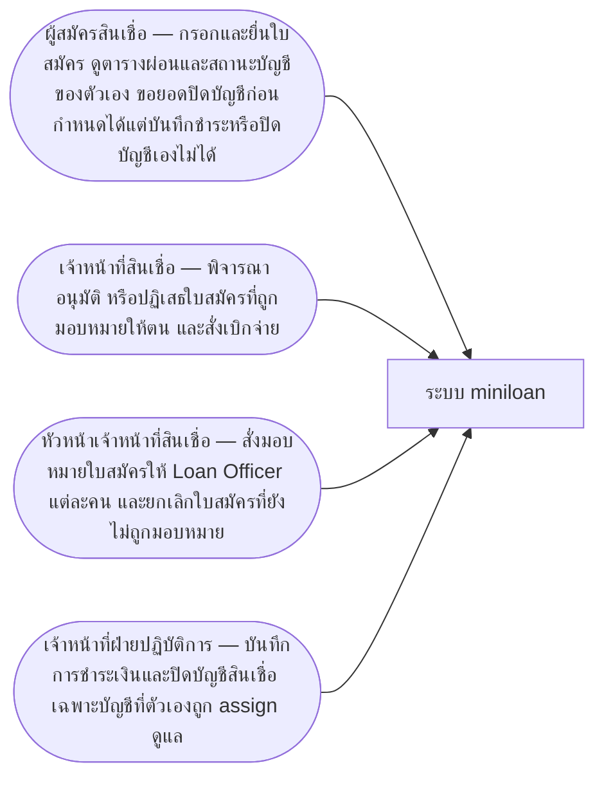
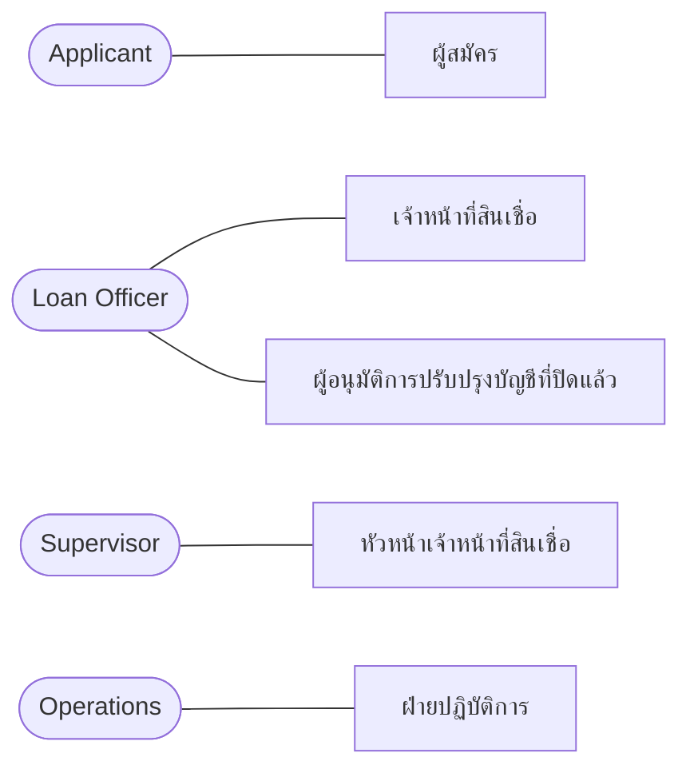
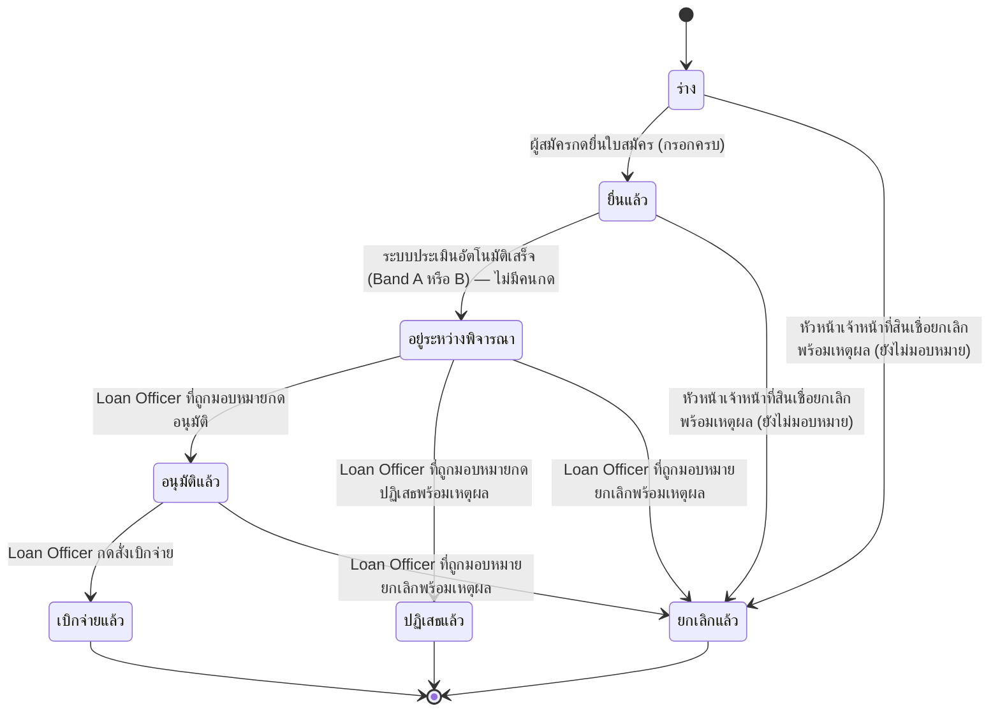
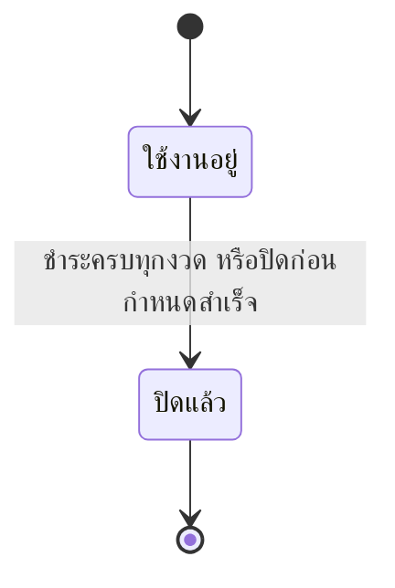
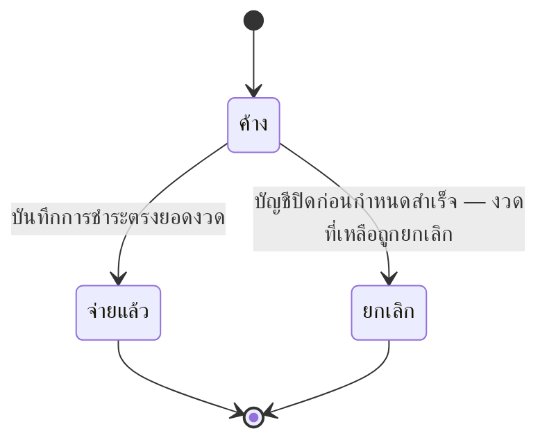
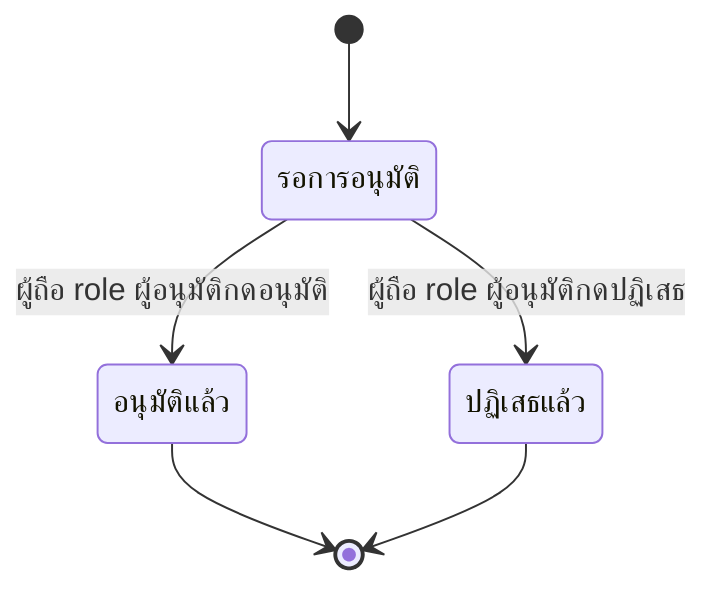
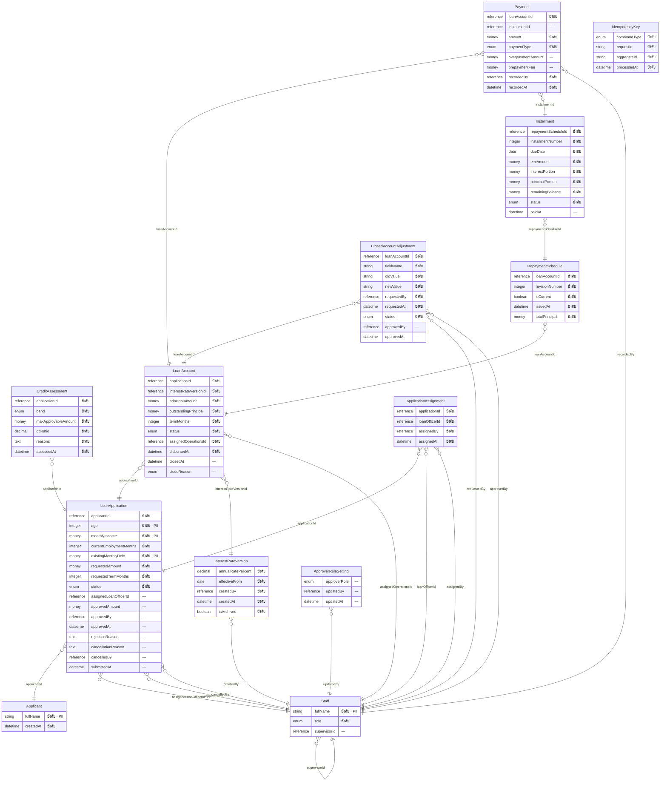
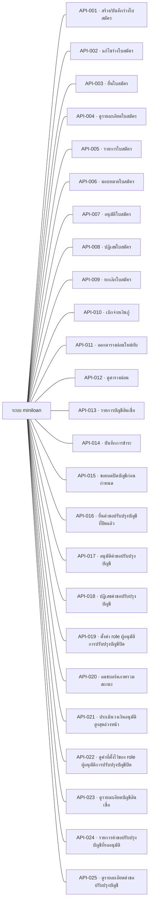
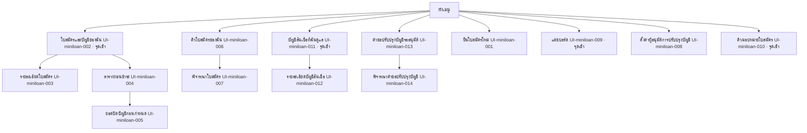

# เอกสารการออกแบบระบบ — miniloan

> เอกสารฉบับนี้ถูก **สร้างจากไฟล์ JSON ทั้งฉบับ** (renderer v1.0) — แก้ไฟล์นี้โดยตรงแล้วจะหายในการ render รอบถัดไป
> แก้ที่ต้นทางเสมอ: รายการและตารางแก้ผ่านคำสั่งของ `design` · ร้อยแก้วแก้ที่ไฟล์ Markdown ต้นทางที่ระบุไว้ท้ายแต่ละหัวข้อ

## ปกและตารางแก้ไข

**เอกสารฉบับนี้ไม่มีเลขเวอร์ชันของตัวเอง** — ไม่มีไฟล์ไหนในเฟสนี้เก็บเลขเวอร์ชันของเอกสารไว้
สิ่งที่ใช้แทนคือตารางการเปลี่ยนแปลงข้างล่าง ซึ่งอ่านจากใบเปลี่ยนแปลงจริง และตารางสถานะการอนุมัติรายไฟล์

### ตารางแก้ไข (Revision History)

| รหัส | ที่มา | เมื่อ | เหตุผล | ผู้เกี่ยวข้อง / สถานะ |
|---|---|---|---|---|
| CHG-miniloan-001 | req | 2026-08-15T11:06+07:00 | หัวหน้าเจ้าหน้าที่สินเชื่อถูกตัดสินแล้วว่าเป็น actor แยก ไม่ใช่ Loan Officer คนหนึ่ง (คำตอบ Q-miniloan-012) · ประโยคเดิมที่ว่า "ยกเลิกได้เฉพาะ Loan Officer เท่านั้น" จึงแคบเกินความจริง และทำให้เส้นยกเลิกใบสถานะ Draft กับ Submitted ที่ BR-miniloan-010@v1 เปิดไว้ ไม่มีใครเดินได้ | เจ้าของสเปก (ตอบในแชท รอบ /req:ask ตอบการ์ดแดง Q-miniloan-012) → เจ้าของสเปก |
| CHG-miniloan-002 | req | 2026-08-21T00:00+07:00 | ประโยค "กลไกการเก็บค่าธรรมเนียมยังไม่ตัดสิน (ดู Q-miniloan-013)" ในข้อความของ BR-miniloan-046@v1 ตกยุคตั้งแต่ Q-miniloan-013 ตอบแล้ว (2026-08-15) — คำตอบคลอด BR-miniloan-050@v1 และ BR-miniloan-051@v1 แยกออกไปแทนที่จะแก้ทับ BR-miniloan-046@v1 เพราะตอนนั้นมีตัวอย่างพิสูจน์อยู่แล้ว (EX-miniloan-087/088/089) · เมื่อ EX-miniloan-087/088 ถูกแก้ในรอบ /req:example ล่าสุดให้ตรงกับกลไกที่ตัดสินแล้ว ตัวอย่างที่พิสูจน์กฎข้อนี้จึงขัดกับข้อความของกฎเอง (กฎบอกว่ายังไม่ตัดสิน ตัวอย่างยืนยันกลไกที่ตัดสินแล้ว) · เป็นการขึ้นเวอร์ชันเพื่อให้ข้อความตรงกับคำตอบที่มีอยู่แล้ว ไม่ใช่การตัดสินใจใหม่ | เจ้าของสเปก (คำตอบเดิมอยู่ใน SRC-013 · Q-miniloan-013 ตอบแล้วตั้งแต่ 2026-08-15 แต่ข้อความ BR-miniloan-046@v1 ไม่เคยถูกแก้ตาม เพราะมีตัวอย่างพิสูจน์อยู่แล้ว — ช่องว่างนี้ถูกจับได้ตอนแก้ EX-miniloan-087/088 ด้วย /req:example) → เจ้าของสเปก |
| CHG-miniloan-003 | req | 2026-08-21T15:00+07:00 | Q-miniloan-015 ถูกตอบแล้ว: กรณีที่ส่วนเกินหลังหักค่าธรรมเนียมการโปะ 1% แล้วมากกว่าเงินต้นคงเหลือ ให้ปฏิเสธการบันทึกทั้งรายการ เช่นเดียวกับ BR-miniloan-052@v1 — ไม่ตัดเท่าที่เหลือแล้วทอนคืนส่วนล้น และไม่ถือเป็นการปิดบัญชีก่อนกำหนด · ประโยค "ยังไม่ตัดสิน (ดู Q-miniloan-015)" ที่ค้างอยู่ในข้อความของ BR-miniloan-050@v1 จึงตกยุคและต้องถูกแทนที่ด้วยผลการตัดสิน | เจ้าของสเปก (ตอบสด ๆ ในรอบ /req:change BR-miniloan-050 นี้ ไม่มีเอกสารรองรับ — Q-miniloan-015 เดิมเป็นการ์ดแดง raised_by BR-miniloan-050@v1 เอง ไม่ได้มาจากคำถามที่เคยส่งลูกค้า) → เจ้าของสเปก |
| CHG-miniloan-004 | req | 2026-08-21T15:30+07:00 | Q-miniloan-015 ข้อ (2) สั่งให้ขยายเงื่อนไขของ BR-miniloan-052@v1 จาก "ส่วนเกินมากกว่ายอดปิดบัญชี" ให้ครอบ "ส่วนเกินหลังหักค่าธรรมเนียมการโปะมากกว่าเงินต้นคงเหลือ" ด้วย — BR-miniloan-050@v2 (CHG-miniloan-003) อ้างถึงกฎข้อนี้ไปแล้วในฐานะปลายทางของการปฏิเสธ แต่เงื่อนไขเดิมยังไม่ครอบกรณีนั้นจริง ผลลัพธ์เหมือนกันทั้งสองทริกเกอร์จึงรวมเป็นเงื่อนไข OR เดียว ไม่แยกเป็นกฎคนละข้อ | เจ้าของสเปก (ยืนยันข้อความใหม่สด ๆ ในรอบ /req:change BR-miniloan-052 นี้ — ทำตามที่ CHG-miniloan-003 รายงานไว้ว่าเป็นขั้นถัดไปที่ต้องอนุมัติแยก) → เจ้าของสเปก |
| CHG-miniloan-005 | req | 2026-09-01T10:00+07:00 | ความขัดกันระหว่าง CALC-miniloan-001@v1 (คำนวณเต็มความละเอียดภายใน ปัดเฉพาะตอนเขียนแถว) กับ BR-miniloan-035@v1 (ปัดทันทีทุกจุดที่เกิดขึ้น) ถูกจับได้จาก Q-miniloan-016 หลังรัน GD-miniloan-001 จริง (คอลัมน์ยอดคงเหลือที่แสดงกับบัญชีภายในต่างกันระหว่างทางราว 0.02–0.17 บาท แม้ปิดที่ 0 พอดีเท่ากันตอนจบตาราง) · เจ้าของสเปกเลือกให้ CALC-miniloan-001 เป็นฝ่ายปรับตาม BR-miniloan-035@v1 แทนที่จะแก้ BR-035 — ผลคือไม่มีบัญชีภายในที่ละเอียดกว่าคอลัมน์ที่แสดงอีกต่อไป มีคอลัมน์เดียวที่ทุกกฎอ่านค่าได้โดยไม่กำกวม ซึ่งปิดคำถามท่อน (3) ของ Q-miniloan-016 ได้ทันที (BR-miniloan-022@v1 และ BR-miniloan-046@v1/BR-miniloan-050@v2 ไม่มีคอลัมน์คู่แข่งให้เลือกอ่านอีกต่อไป) | เจ้าของสเปก (ตอบสดในรอบ /req:change CALC-miniloan-001 นี้ — ยืนยันให้ CALC-miniloan-001 ปรับตาม BR-miniloan-035@v1 แทนที่จะแก้ BR-035 พร้อมปิด Q-miniloan-016 ในรอบเดียวกัน) → เจ้าของสเปก |
| CHG-miniloan-001 | design · revised | 2026-09-03T02:50:56Z | หัวหน้าเจ้าหน้าที่สินเชื่อถูกตัดสินแล้วว่าเป็น actor แยก ไม่ใช่ Loan Officer คนหนึ่ง (คำตอบ Q-miniloan-012) · ประโยคเดิมที่ว่า "ยกเลิกได้เฉพาะ Loan Officer เท่านั้น" จึงแคบเกินความจริง และทำให้เส้นยกเลิกใบสถานะ Draft กับ Submitted ที่ BR-miniloan-010@v1 เปิดไว้ ไม่มีใครเดินได้ | รับเข้าแล้ว 2026-09-03T02:52:36Z |
| CHG-miniloan-002 | design · revised | 2026-09-03T02:50:56Z | ประโยค "กลไกการเก็บค่าธรรมเนียมยังไม่ตัดสิน (ดู Q-miniloan-013)" ในข้อความของ BR-miniloan-046@v1 ตกยุคตั้งแต่ Q-miniloan-013 ตอบแล้ว — เป็นการขึ้นเวอร์ชันเพื่อให้ข้อความตรงกับคำตอบที่มีอยู่แล้ว ไม่ใช่การตัดสินใจใหม่ พฤติกรรมไม่เปลี่ยน มีแต่ข้อความอ้างอิงที่ตามทัน | รับเข้าแล้ว 2026-09-03T02:52:36Z |
| CHG-miniloan-003 | design · revised | 2026-09-03T02:50:56Z | Q-miniloan-015 ถูกตอบแล้ว: กรณีที่ส่วนเกินหลังหักค่าธรรมเนียมการโปะ 1% แล้วมากกว่าเงินต้นคงเหลือ ให้ปฏิเสธการบันทึกทั้งรายการ เช่นเดียวกับ BR-miniloan-052@v1 — ประโยค "ยังไม่ตัดสิน (ดู Q-miniloan-015)" ที่ค้างอยู่ในข้อความของ BR-miniloan-050@v1 จึงตกยุคและถูกแทนที่ด้วยผลการตัดสิน | รับเข้าแล้ว 2026-09-03T02:52:37Z |
| CHG-miniloan-004 | design · revised | 2026-09-03T02:50:56Z | Q-miniloan-015 ข้อ (2) สั่งให้ขยายเงื่อนไขของ BR-miniloan-052@v1 จาก "ส่วนเกินมากกว่ายอดปิดบัญชี" ให้ครอบ "ส่วนเกินหลังหักค่าธรรมเนียมการโปะมากกว่าเงินต้นคงเหลือ" ด้วย เพราะ BR-miniloan-050@v2 อ้างถึงกฎข้อนี้ไปแล้วในฐานะปลายทางของการปฏิเสธ | รับเข้าแล้ว 2026-09-03T02:52:37Z |
| CHG-miniloan-005 | design · revised | 2026-09-03T02:50:56Z | ความขัดกันระหว่าง CALC-miniloan-001@v1 (คำนวณเต็มความละเอียดภายใน ปัดเฉพาะตอนเขียนแถว) กับ BR-miniloan-035@v1 (ปัดทันทีทุกจุดที่เกิดขึ้น) ถูกจับได้จาก Q-miniloan-016 — เจ้าของสเปกเลือกให้ CALC-miniloan-001 ปรับตาม BR-miniloan-035@v1 แทนที่จะแก้ BR-035 ผลคือมีคอลัมน์เดียวที่ทุกกฎอ่านค่าได้โดยไม่กำกวม · GD-miniloan-001 ถูกทำให้ใช้ไม่ได้ (ต้องรอ /req:golden CALC-miniloan-001@v2 ใหม่) | รับเข้าแล้ว 2026-09-03T02:52:37Z |
| ADR-001 | design · revised | 2026-09-04T00:00:00Z | เจ้าของโปรเจกต์ (aplus191) ตัดสินใจเปลี่ยนตัวเลือกที่เลือกไว้ใน DEC-001 จาก ".NET (C# / ASP.NET Core)" เป็น "Java (Spring Boot)" ซึ่งเป็นหนึ่งในตัวเลือกที่เคยพิจารณาไว้แล้วใน DEC-001.options[] (เดิม star:false) ไม่มี requirement ใหม่จาก req ต้นทาง — เป็นการตัดสินใจสถาปัตยกรรมของทีมเองล้วน ๆ ยืนยันแล้วว่า Spring Boot ยังตอบโจทย์ NFR-miniloan-004 (สถาปัตยกรรมแบบ domain-centric/layered — ทำได้ผ่านการแบ่งชั้น Controller/Service/Repository/Domain ตามธรรมเนียมของ Spring) และ NFR-miniloan-005 (สัญญา API ที่ทดสอบได้แบบ stateless REST/JSON พร้อม OpenAPI — springdoc-openapi ให้ความสามารถเทียบเท่า Swagger ของ .NET) เหมือนที่ .NET เคยตอบ | รับเข้าแล้ว 2026-09-04T04:31:22Z |
| ADR-002 | design · added | 2026-09-04T04:40:00Z | เจ้าของโปรเจกต์ (aplus191) ขอเปลี่ยน framework ฝั่ง Web จาก Next.js (React/TypeScript) เป็น Angular ผ่านคำสั่ง /dev:stack เมื่อ 2026-09-04 — ก่อนหน้านี้ apps/web ไม่เคยมีใบตัดสินใจ (decision card) ของตัวเองใน context.json เลย มีแต่สถาปัตยกรรมแยก Web/API ที่ล็อกไว้ใน REQ-miniloan-006 (constraint web-no-business-logic) ซึ่งไม่ผูกกับ framework ตัวใดตัวหนึ่ง จึงเป็นการเพิ่มใบตัดสินใจใหม่ (DEC-003) ไม่ใช่การแก้ใบเดิม ไม่มี requirement ใหม่จาก req ต้นทาง เป็นการตัดสินใจสถาปัตยกรรมของทีมเองล้วน ๆ เช่นเดียวกับ ADR-001 | รับเข้าแล้ว 2026-09-04T05:09:23Z |

### สถานะการอนุมัติรายไฟล์

| ไฟล์ | คำสั่งที่เขียน | สถานะขั้น | สถานะเอกสาร | ผู้อนุมัติ | เมื่อ | หมายเหตุ |
|---|---|---|---|---|---|---|
| design.state.json | /design:init | done | — | — | — | — |
| context.json | /design:overview | done | approved | aplus191 | 2026-09-04T05:14:23Z | — |
| modules/miniloan/functions.json | /design:function | done | approved | aplus191 | 2026-09-03T05:17:39Z | — |
| trace.design.json | /design:function | done | — | — | — | — |
| datamodel.json | /design:datamodel | done | approved | aplus191 | 2026-09-03T05:17:39Z | — |
| modules/miniloan/statemachines.json | /design:datamodel | done | approved | aplus191 | 2026-09-03T05:17:39Z | — |
| modules/miniloan/scenarios.json | /design:scenario | done | approved | aplus191 | 2026-09-03T05:17:39Z | — |
| rbac.json | /design:rbac | done | approved | aplus191 | 2026-09-03T05:17:39Z | — |
| nfr.json | /design:nfr | done | approved | aplus191 | 2026-09-03T05:17:39Z | — |
| sitemap.json | /design:sitemap | done | approved | aplus191 | 2026-09-03T05:17:39Z | — |
| modules/miniloan/screens.json | /design:sitemap | done | approved | aplus191 | 2026-09-03T05:17:39Z | — |
| interfaces.json | /design:interface | done | approved | aplus191 | 2026-09-03T05:17:39Z | — |

> ℹ️ **ข้อจำกัดของข้อมูลชุดนี้** — "สถานะขั้น" มาจากไฟล์สถานะ ส่วน "สถานะเอกสาร" มาจากตัวไฟล์เอง — ขั้นที่ค้างจะเห็นได้ที่คอลัมน์แรกเท่านั้น เพราะเครื่องหมายค้างถูกเก็บที่ขั้น ไม่ใช่ในเนื้อหาที่อนุมัติไปแล้ว

> ℹ️ **ข้อจำกัดของข้อมูลชุดนี้** — ตารางนี้ไม่มีแถวของขั้น `export` เอง เพราะ artifact ของขั้นนั้นคือเอกสารฉบับนี้ — เอกสารที่รายงานสถานะการส่งมอบของตัวเอง จะไม่ตรงกับความจริงทันทีที่มีคนบันทึกว่าส่งแล้ว

## 1 บทนำ

## บทนำ

โครงการนี้จัดทำระบบสินเชื่อส่วนบุคคล ("miniloan") เพื่อรองรับกระบวนการตั้งแต่ผู้สมัครกรอกใบสมัครสินเชื่อ ผ่านการประเมินอัตโนมัติเพื่อจัด Credit Band การพิจารณาอนุมัติหรือปฏิเสธโดยเจ้าหน้าที่สินเชื่อ การเบิกจ่ายเพื่อเปิดบัญชีสินเชื่อพร้อมตารางผ่อนชำระแบบลดต้นลดดอก ไปจนถึงการบันทึกการชำระรายงวดและการปิดบัญชีทั้งแบบชำระครบกำหนดและปิดก่อนกำหนด

ความจำเป็นของระบบนี้เกิดจากหกความต้องการหลักที่ทีมงานได้เก็บและยืนยันไว้ในเฟสวิเคราะห์ความต้องการ (Phase 1):

1. **รับและประเมินใบสมัคร** — คัดกรองผู้สมัครที่ไม่ผ่านเกณฑ์ออกโดยอัตโนมัติ พร้อมเหตุผลประกอบให้เจ้าหน้าที่เห็นก่อนตัดสินใจ
2. **อนุมัติและเบิกจ่าย** — มีจุดตัดสินใจของคนที่ตรวจสอบย้อนหลังได้ และป้องกันการเดินสถานะข้ามขั้นตอนที่จะทำให้สัญญาเริ่มต้นโดยไม่มีผู้อนุมัติ
3. **สร้างบัญชีและตารางผ่อน** — ให้ผู้กู้รู้ยอดผ่อนและกำหนดชำระตั้งแต่วันแรก โดยตัวเลขในตารางเป็นฐานเดียวที่ทุกฝ่ายอ้างอิงตรงกัน
4. **รับชำระและปิดบัญชี** — ให้ยอดคงเหลือของทุกบัญชีตรงกับความจริงตลอดเวลา โดยไม่ต้องเชื่อมต่อระบบชำระเงินภายนอกในรอบนี้
5. **ภาพรวมสถานะ (แดชบอร์ด)** — ให้เจ้าหน้าที่สินเชื่อรู้ปริมาณงานค้างและขั้นตอนของแต่ละใบโดยไม่ต้องไล่เปิดทีละใบ
6. **สถาปัตยกรรมแยก Web กับ API** — บังคับให้กฎธุรกิจทั้งหมดอยู่หลัง API เท่านั้น เพื่อกันไม่ให้กฎถูกข้ามได้ด้วยการเรียก API ตรง และให้ Web กับ API เปลี่ยนแปลง/ทดสอบแยกจากกันได้

ผู้ใช้งานระบบมีสี่กลุ่ม: **ผู้สมัครสินเชื่อ** ที่กรอกและยื่นใบสมัครด้วยตนเอง **เจ้าหน้าที่สินเชื่อ (Loan Officer)** ที่พิจารณาอนุมัติและสั่งเบิกจ่าย **หัวหน้าเจ้าหน้าที่สินเชื่อ (Supervisor)** ที่มอบหมายงานให้เจ้าหน้าที่แต่ละคน และ **ฝ่ายปฏิบัติการ (Operations)** ที่บันทึกการชำระเงินและปิดบัญชีเฉพาะบัญชีที่ตนดูแล

รอบการพัฒนานี้จำกัดขอบเขตไว้ชัดเจนสองเรื่อง คือระบบยืนยันตัวตน (authentication) จริงยังไม่รวมอยู่ในรอบนี้ — ใช้ token จำลองแทนทั้งฝั่ง Web และ API — และไม่มีคิว retry อัตโนมัติเมื่อเรียก API ไม่สำเร็จหรือหมดเวลา ระบบต้องล้มทันทีและให้ผู้ใช้สั่งคำสั่งใหม่ด้วยตนเอง

### 1.1 ขอบเขตที่อยู่ในงาน

| รหัส | รายการ | ที่มา |
|---|---|---|
| application-intake-assessment | รับใบสมัครสินเชื่อส่วนบุคคลตั้งแต่ร่างจนยื่น พร้อมประเมินอัตโนมัติเพื่อจัด Credit Band (A/B/C) วงเงินที่อนุมัติได้ และเหตุผลที่ผ่าน/ไม่ผ่านรายเกณฑ์ | REQ-miniloan-001 |
| approval-disbursement | พิจารณา อนุมัติ หรือปฏิเสธใบสมัครแบบ 1 ระดับ มอบหมายใบสมัครให้ Loan Officer โดยหัวหน้าเจ้าหน้าที่สินเชื่อ และเบิกจ่ายเพื่อเปิดบัญชีสินเชื่อ | REQ-miniloan-002 |
| account-schedule-creation | สร้างบัญชีสินเชื่อและตารางผ่อนชำระแบบลดต้นลดดอกทันทีที่เบิกจ่ายสำเร็จ พร้อมเปิดให้เจ้าของบัญชีดูตารางผ่อนของตัวเอง | REQ-miniloan-003 |
| payment-closure | บันทึกการชำระรายงวด คิดยอดปิดบัญชีก่อนกำหนด ปิดบัญชีทั้งแบบชำระครบและปิดก่อนกำหนด และจัดการคำขอปรับปรุงบัญชีที่ปิดแล้วผ่านกระบวนการอนุมัติแบบ four-eyes | REQ-miniloan-004 |
| status-dashboard | แดชบอร์ดภาพรวมจำนวนใบสมัครและบัญชีสินเชื่อแยกตามสถานะสำหรับ Loan Officer | REQ-miniloan-005 |
| web-api-separation | สถาปัตยกรรมแยก Web กับ API โดยกฎธุรกิจทั้งหมดถูกบังคับที่ฝั่ง API เท่านั้น Web เป็นเพียง client ที่เรียกใช้ | REQ-miniloan-006 |

### 1.2 ขอบเขตที่ไม่อยู่ในงาน

| รหัส | รายการ | ที่มา |
|---|---|---|
| real-authentication | ระบบยืนยันตัวตน (authentication) จริง — รอบนี้ใช้ token จำลองแทนทั้งฝั่ง Web และ API | REQ-miniloan-006 |
| automatic-retry-queue | คิว retry อัตโนมัติเมื่อเรียก API ไม่สำเร็จหรือ timeout — ระบบต้องล้มทันทีและแจ้งผู้ใช้ให้สั่งใหม่เอง | REQ-miniloan-006 |

### 1.3 เอกสารอ้างอิง

| เอกสาร | ที่อยู่ |
|---|---|
| ความต้องการที่ `req` เก็บไว้ | .aeon/req/requirements.json |
| อภิธานศัพท์ | .aeon/req/glossary.json |
| ผู้มีส่วนได้ส่วนเสีย | .aeon/req/stakeholders.json |

### 1.4 อภิธานศัพท์

| รหัส | คำไทย | คำอังกฤษ | ความหมาย | อย่าสับสนกับ | สถานะ |
|---|---|---|---|---|---|
| UL-miniloan-001 | ใบสมัครสินเชื่อ | LoanApplication | ใบสมัครสินเชื่อ ตั้งแต่ร่างจนถึงเบิกจ่าย เป็น Aggregate ฝั่ง Origination · 1 ผู้สมัครมีได้หลายใบสมัคร | UL-miniloan-004 | draft |
| UL-miniloan-002 | ข้อมูลผู้สมัคร | ApplicantProfile | ข้อมูลผู้สมัคร: อายุ รายได้ อายุงาน ภาระหนี้ปัจจุบัน | — | draft |
| UL-miniloan-003 | ผลการประเมินสินเชื่อ | CreditAssessment | ผลการประเมินจาก rule engine ประกอบด้วยคะแนน เหตุผล และวงเงินที่อนุมัติได้ | — | draft |
| UL-miniloan-004 | บัญชีสินเชื่อ | LoanAccount | บัญชีสินเชื่อหลังเบิกจ่าย เป็น Aggregate ฝั่ง Servicing · 1 ใบสมัครที่ Disbursed สร้าง 1 บัญชี | UL-miniloan-001 | draft |
| UL-miniloan-005 | ตารางผ่อน | RepaymentSchedule | ตารางผ่อนรายงวดของบัญชีสินเชื่อหนึ่งบัญชี แต่ละแถวแยกเงินต้น ดอกเบี้ย และยอดคงเหลือ | UL-miniloan-006 | draft |
| UL-miniloan-006 | งวดผ่อน | Installment | งวดผ่อน 1 งวดในตารางผ่อน — หนึ่งแถวของ RepaymentSchedule | UL-miniloan-005 · UL-miniloan-012 | draft |
| UL-miniloan-007 | รายการชำระเงิน | Payment | รายการชำระเงินที่บันทึกเข้าบัญชีสินเชื่อ · รอบการเรียนนี้บันทึกด้วยมือ ไม่เชื่อม payment gateway จริง | — | draft |
| UL-miniloan-008 | การปิดบัญชีก่อนกำหนด | EarlySettlement | การปิดบัญชีสินเชื่อก่อนครบกำหนดงวดสุดท้าย โดยชำระยอดปิดบัญชีตาม BR-07 | — | draft |
| UL-miniloan-009 | จำนวนเงิน | Money | จำนวนเงินพร้อมสกุลเงิน เป็น Value Object · ห้ามใช้ทศนิยมลอย (floating point) · รอบการเรียนนี้ใช้ THB อย่างเดียว | — | draft |
| UL-miniloan-010 | วงเงินอนุมัติสูงสุด | MaxApprovableAmount | วงเงินสูงสุดที่ระบบอนุมัติให้ผู้สมัครรายนี้ได้ = 5 เท่าของรายได้ต่อเดือน และไม่เกิน 1,000,000 บาท — คำนวณโดยระบบ ไม่ใช่ตัวเลขที่ผู้สมัครกรอก | UL-miniloan-011 | draft |
| UL-miniloan-011 | จำนวนเงินกู้ที่ขอ | RequestedAmount | จำนวนเงินที่ผู้สมัครกรอกในใบสมัคร ต้องอยู่ในช่วง 10,000 – 1,000,000 บาท — เป็นตัวเลขที่คนกรอก ไม่ใช่ตัวเลขที่ระบบคำนวณ | UL-miniloan-010 | draft |
| UL-miniloan-012 | จำนวนงวด | Term | จำนวนงวดที่ตกลงกันในสัญญา เป็นตัวเลขนับ ต้องอยู่ในช่วง 6 – 60 งวด (รายเดือน) — เป็นค่าที่ผู้สมัครเลือกตอนกรอกใบสมัคร และเป็น n ในสูตร EMI · ไม่ใช่แถวในตารางผ่อน | UL-miniloan-006 | draft |
| UL-miniloan-013 | การมอบหมายใบสมัคร | ApplicationAssignment | การผูกใบสมัครหนึ่งใบเข้ากับ Loan Officer หนึ่งคนเพื่อให้เป็นผู้พิจารณา · เฉพาะคนที่ถูกมอบหมายเท่านั้นที่กดอนุมัติหรือปฏิเสธใบสมัครนั้นได้ · แนวคิดนี้ไม่มีในเอกสารต้นทาง เกิดจากการตัดสินของเจ้าของในรอบ /req:ask permission | — | draft |
| UL-miniloan-014 | อัตราดอกเบี้ย | InterestRate | อัตราดอกเบี้ยแบบลดต้นลดดอกที่ใช้คำนวณตารางผ่อน · เป็นข้อมูลหลักที่มีเวอร์ชันและมีวันเริ่มมีผล (effective date) ไม่ใช่ค่าคงที่ในโค้ด — บัญชีสินเชื่อผูกกับเวอร์ชันที่มีผลอยู่ ณ วันเบิกจ่าย และเวอร์ชันที่เคยถูกใช้ห้ามลบ | — | draft |
| UL-miniloan-015 | การปรับปรุงบัญชีหลังปิด | ClosedAccountAdjustment | รายการขอแก้ไขข้อมูลของบัญชีสินเชื่อที่ปิดแล้ว (Closed) ต้องผ่านการอนุมัติจากผู้ถือบทบาทผู้อนุมัติ (UL-miniloan-016) ก่อนจึงมีผล ไม่ใช่การแก้ทับทันที · เก็บเป็นรายการปรับปรุงแยกจากตัวบัญชี ค่าเดิมของบัญชีคงไว้ไม่ถูกทับ และรายการเก็บค่าเดิม ค่าใหม่ ผู้ขอแก้ ผู้อนุมัติ และเวลาอนุมัติ | UL-miniloan-008 | draft |
| UL-miniloan-016 | บทบาทผู้อนุมัติ | ApproverRole | role ที่ระบบกำหนดให้มีสิทธิ์อนุมัติการปรับปรุงบัญชีสินเชื่อที่ปิดแล้ว — เป็นค่าที่ตั้งไว้ในระบบและเปลี่ยนได้ภายหลัง ไม่ผูกตายกับ actor ใด actor หนึ่งในโค้ด · ถ้ายังไม่ตั้ง ฟีเจอร์ปรับปรุงบัญชีที่ปิดแล้วใช้ไม่ได้ (ไม่มีค่าเริ่มต้น) · ใครตั้งค่าได้ และต้องต่างจากผู้ขอแก้หรือไม่ ยังไม่ตัดสิน — ดู Q-miniloan-009 | UL-miniloan-013 | draft |
| UL-miniloan-017 | ตารางผ่อนฉบับที่ออกใหม่ | RepaymentScheduleRevision | ตารางผ่อนฉบับใหม่ที่ออกทับฉบับเดิมของบัญชีสินเชื่อเดียวกัน เมื่อจำเป็นต้องเปลี่ยนตารางผ่อนที่ออกให้ผู้กู้ไปแล้ว — ออกทับทั้งฉบับ ไม่ใช่แก้บางแถวของฉบับเดิม · ฉบับเดิมยังเก็บไว้ดูย้อนหลังได้และห้ามลบ แนวเดียวกับเวอร์ชันของอัตราดอกเบี้ยใน BR-miniloan-037@v1 | UL-miniloan-005 | draft |
| UL-miniloan-018 | การโปะเงินต้น | PartialPrepayment | การชำระเกินยอดงวด โดยส่วนที่เกินถูกนำไปตัดเงินต้นของบัญชีสินเชื่อที่ยังเป็น Active — บัญชีไม่ปิด ยังผ่อนต่อ แต่เงินต้นลดลงจึงต้องออกตารางผ่อนฉบับใหม่ทับตาม BR-miniloan-044@v1 · ส่วนเกินไปลดจำนวนงวดโดยค่างวดคงเดิม (Q-miniloan-010) · มีค่าธรรมเนียม 1% ของยอดส่วนที่เกิน หักออกจากส่วนเกินก่อนนำไปตัดเงินต้น (Q-miniloan-013 → BR-miniloan-050@v1) · ถ้าส่วนเกินมากพอปิดบัญชีได้ในครั้งเดียว ไม่ใช่การโปะแล้ว แต่เป็นการปิดบัญชีก่อนกำหนดตาม BR-miniloan-051@v1 | UL-miniloan-008 | draft |
| UL-miniloan-019 | หัวหน้าเจ้าหน้าที่สินเชื่อ | Supervisor | ผู้ที่มีอำนาจสั่งมอบหมายใบสมัครให้ Loan Officer รายคน — เอกสารต้นทาง §3 ไม่มี actor นี้ (มีแค่ Applicant / Loan Officer / Operations / System) เกิดขึ้นจากคำตอบของ Q-miniloan-005 · ยังไม่ตัดสินว่ามีกี่ระดับ ทำอย่างอื่นได้อีกไหม และเห็นข้อมูลของลูกน้องแค่ไหน — ส่วนขอบเขตข้อมูลค้างอยู่ที่ DQ-miniloan-002 | UL-miniloan-013 | draft |
| UL-miniloan-020 | การยกเลิกใบสมัคร | ApplicationCancellation | การจบใบสมัครก่อนถึงการเบิกจ่าย โดยใบนั้นไปอยู่สถานะสุดท้าย Cancelled — ทำได้ตั้งแต่ Draft ถึง Approved เท่านั้น ใบที่ Disbursed แล้วยกเลิกไม่ได้ · **สั่งได้เฉพาะเจ้าหน้าที่ (Loan Officer) และต้องระบุเหตุผลเสมอ** — Applicant ยกเลิกใบของตัวเองไม่ได้ ต้องแจ้งเจ้าหน้าที่ · เป็นวิธีแก้เดียวเมื่อใบสมัครเดินสถานะผิด เพราะ BR-miniloan-010@v1 ไม่มีเส้นถอยกลับ · ใครยกเลิกใบที่ยังไม่ถูกมอบหมายได้ ยังไม่ตัดสิน — ดู Q-miniloan-012 | UL-miniloan-008 | draft |
| UL-miniloan-021 | ค่าธรรมเนียมการโปะ | PrepaymentFee | ค่าธรรมเนียม 1% ของยอดส่วนที่เกิน ซึ่งเกิดขึ้นเมื่อผู้กู้โปะเงินต้นของบัญชีที่ยังเป็น Active — หักออกจากยอดส่วนเกินก่อนนำไปตัดเงินต้น ไม่ใช่รายการเรียกเก็บแยก (BR-miniloan-050@v1) · ต่างจากค่าธรรมเนียมปิดก่อนกำหนดซึ่งคิด 1% ของเงินต้นคงเหลือและใช้เมื่อบัญชีปิด (BR-miniloan-022@v1) · ที่ขอบซึ่งส่วนเกินพอปิดบัญชีได้พอดี ให้ใช้ฐานปิดก่อนกำหนดเสมอตาม BR-miniloan-051@v1 | UL-miniloan-008 | draft |
| UL-miniloan-022 | เงินต้นคงเหลือ | OutstandingPrincipal | เงินต้นที่ยังไม่ได้ชำระของบัญชีสินเชื่อ ณ เวลาหนึ่ง — เป็นฐานของดอกเบี้ยรายงวด (ดอกเบี้ยงวด = เงินต้นคงเหลือ × อัตราต่อเดือน ตาม BR-miniloan-016@v1) · เป็นฐานของยอดปิดบัญชีก่อนกำหนดและค่าธรรมเนียม 1% ตาม BR-miniloan-022@v1 · เป็นคอลัมน์สุดท้ายของตารางผ่อน ซึ่งต้องเป็น 0 พอดีหลังงวดสุดท้าย · **"ยอดคงเหลือ" ที่พบในเอกสารต้นทางและในกฎหลายข้อคือคำเดียวกันกับคำนี้** ไม่ใช่ยอดที่ต้องจ่ายทั้งหมดที่เหลือ (ซึ่งจะรวมดอกเบี้ยในอนาคต) — ยืนยันแล้วในรอบ QB-lang-01 · คำหลักเลือก "เงินต้นคงเหลือ" เพราะเป็นคำที่ไม่กำกวม · **แหล่งอ้างอิงเดียวของค่านี้คือคอลัมน์ยอดคงเหลือของตารางผ่อนฉบับล่าสุด** ไม่ใช่การคำนวณขึ้นใหม่จากสูตร — ตัดสินในรอบตอบการ์ดแดง Q-miniloan-016 และเขียนเป็น BR-miniloan-053@v1 | UL-miniloan-008 | draft |
| UL-miniloan-023 | ยอดที่อนุมัติจริง | ApprovedAmount | จำนวนเงินที่ Loan Officer อนุมัติจริงให้ใบสมัครหนึ่งใบ — อาจต่ำกว่าจำนวนเงินกู้ที่ขอ (UL-miniloan-011) เมื่อยอดที่ขอเกินวงเงินอนุมัติสูงสุด (UL-miniloan-010) และเจ้าหน้าที่ปรับลงตาม BR-miniloan-012@v1 · เป็นตัวเลขที่กลายเป็นเงินต้นตั้งต้น (P) ของตารางผ่อนตอนเบิกจ่าย · **ไม่ใช่ตัวเดียวกับจำนวนเงินกู้ที่ขอ** — DTI ที่บันทึกไว้ตอนยื่นผูกกับยอดที่ขอและไม่คำนวณใหม่แม้เจ้าหน้าที่จะปรับวงเงินลง (Q-miniloan-002) ถ้าใช้คำเดียวกัน ตัวเลขที่ DTI อ้างถึงจะหายไป · **กฎที่ระบุว่า P ของ BR-miniloan-016@v1 มาจากยอดนี้ยังไม่ถูกเขียนเป็น BR** เพราะรอบที่คลอดคำนี้เป็นรอบชั้น 1 ซึ่งเขียน rules[] ไม่ได้ — เส้นทางที่เหลือคือ /req:calc BR-miniloan-016@v1 ซึ่งต้องระบุ input ของสูตรอยู่แล้ว | UL-miniloan-011 · UL-miniloan-010 · UL-miniloan-022 | draft |
| UL-miniloan-024 | ผู้สมัคร | Applicant | คนที่ยื่นขอสินเชื่อ และเป็นคนเดียวกับคนที่ถือบัญชีสินเชื่อหลังเบิกจ่าย — **หนึ่งคน หนึ่งคำ** ไม่แยกเป็นคนละแนวคิดตามช่วงเวลา · คำว่า "ผู้กู้" และ "ลูกค้า" ที่ปรากฏใน spec เป็นคำเรียกอย่างอื่นของคนคนเดียวกัน ไม่ใช่ actor คนละตัว — ทั้งสองคำไม่มีในเอกสารต้นทางเลย เกิดขึ้นระหว่างการเก็บกฎ · เลือก "ผู้สมัคร / Applicant" เป็นคำหลักจากอินพุต (§3 ตาราง actor) — **เป็นการอ่าน ไม่ใช่คำตอบ เจ้าของยังไม่ได้ระบุคำหลัก** | UL-miniloan-002 | draft |
| UL-miniloan-025 | ยอดปิดบัญชี | PayoffAmount | จำนวนเงินทั้งหมดที่ต้องชำระเพื่อปิดบัญชีสินเชื่อก่อนครบกำหนด = เงินต้นคงเหลือ + ดอกเบี้ยค้างจ่ายถึงวันที่ปิด + ค่าธรรมเนียมปิดก่อนกำหนด 1% ของเงินต้นคงเหลือ ตาม BR-miniloan-022@v1 · **เป็นเส้นแบ่งที่ระบบใช้ตัดสินว่าการชำระที่เกินยอดงวดเป็นอะไร** ตาม BR-miniloan-051@v1 — เท่ากันพอดี = ปิดบัญชี · น้อยกว่า = การโปะ · มากกว่า = ปฏิเสธทั้งรายการตาม BR-miniloan-052@v1 · **ไม่ใช่เงินต้นคงเหลือ** ซึ่งเป็นเพียงส่วนหนึ่งของยอดนี้ และไม่ใช่ตัวการปิดบัญชีเอง | UL-miniloan-022 · UL-miniloan-008 | draft |

## 2 ภาพรวมระบบ

## ภาพรวมระบบ

### มุมมองของผลิตภัณฑ์

ระบบ miniloan เป็นระบบเดี่ยว (standalone) แบ่งเป็นสองส่วนคือ **Web** (หน้าจอที่ผู้ใช้ทุกกลุ่มโต้ตอบด้วย) และ **API** (ที่ถือกฎธุรกิจทั้งหมดไว้ทั้งหมด) โดย Web เป็นเพียง client ที่เรียกใช้ API และไม่ตัดสินใจเชิงธุรกิจเอง — เมื่อใดที่ต้องตัดสินอะไรบางอย่าง เช่น อนุมัติได้หรือไม่ วงเงินสูงสุดเท่าไร Web ต้องเรียก API เสมอ ไม่คำนวณเอง

รอบนี้ระบบไม่เชื่อมต่อกับระบบภายนอกใดๆ ทั้งสิ้น (`context.json` บันทึกไว้ว่า `externalSystems: []`) รวมถึงไม่ต้องยืนยันข้อมูลผู้สมัครกับหน่วยงานภายนอก เช่น เครดิตบูโร — ข้อมูลอายุ รายได้ อายุงาน และภาระหนี้เดิมเป็นข้อมูลที่ผู้สมัครกรอกเองทั้งหมด

### สถานะก่อนมีระบบ (As-Is)

เอกสารความต้องการที่เก็บไว้ในเฟสวิเคราะห์ (Phase 1) ไม่ได้บันทึกรายละเอียดของกระบวนการทำงานแบบเดิมก่อนมีระบบนี้ไว้ — โครงการนี้จึงถูกปฏิบัติเป็นการสร้างระบบใหม่ (greenfield) ไม่ใช่การแทนที่ระบบเดิมที่มีการบันทึกไว้เป็นลายลักษณ์อักษร หากมีกระบวนการเดิมที่ควรนำมาเทียบเคียง (เช่น ใช้กระดาษ สเปรดชีต หรือระบบอื่นอยู่ก่อนแล้ว) ขอให้แจ้งกลับเพื่อบันทึกเพิ่มเติมในส่วนนี้ก่อนเผยแพร่เอกสารฉบับที่ลูกค้าเซ็น

### สถานะหลังมีระบบ (To-Be)

เมื่อระบบใช้งานจริง วงจรการทำงานหลักเป็นดังนี้:

1. **ยื่นใบสมัคร** — ผู้สมัครกรอกข้อมูลด้วยตนเอง บันทึกเป็นร่างได้ก่อนยื่นจริง เมื่อยื่นแล้วระบบจะประเมินอัตโนมัติทันทีเพื่อจัด Credit Band (A/B/C) พร้อมวงเงินอนุมัติสูงสุดและเหตุผลประกอบ
2. **มอบหมายและพิจารณา** — หัวหน้าเจ้าหน้าที่สินเชื่อมอบหมายใบสมัครที่ผ่านการประเมินเบื้องต้นให้เจ้าหน้าที่สินเชื่อคนใดคนหนึ่ง เจ้าหน้าที่คนนั้นเป็นผู้เดียวที่มีสิทธิ์อนุมัติหรือปฏิเสธใบนั้น
3. **เบิกจ่ายและเปิดบัญชี** — เมื่ออนุมัติแล้ว เจ้าหน้าที่สั่งเบิกจ่าย ระบบจะเปิดบัญชีสินเชื่อและสร้างตารางผ่อนชำระแบบลดต้นลดดอกให้ทันที โดยใช้อัตราดอกเบี้ยเวอร์ชันที่มีผล ณ วันเบิกจ่าย
4. **ผ่อนชำระ** — ผู้กู้ดูตารางผ่อนของตนเองได้ตลอดเวลา ฝ่ายปฏิบัติการเป็นผู้บันทึกการชำระแต่ละงวดตามที่เงินไหลเข้ามาจริงนอกระบบ (ระบบไม่เชื่อมต่อช่องทางชำระเงินใดๆ)
5. **ปิดบัญชี** — บัญชีปิดได้สองทางคือชำระครบทุกงวดตามกำหนด หรือผู้กู้ขอปิดก่อนกำหนดโดยระบบคำนวณยอดที่ต้องชำระให้ทราบล่วงหน้า
6. **ภาพรวมและตรวจสอบย้อนหลัง** — เจ้าหน้าที่สินเชื่อเห็นภาพรวมจำนวนใบสมัครและบัญชีแยกตามสถานะในหน้าเดียว และทุกการเปลี่ยนสถานะสำคัญถูกบันทึกผู้กระทำและเวลาไว้เสมอ ไม่ว่าจะสั่งงานผ่านหน้าจอหรือเรียก API โดยตรง

### 2.1 ผังบริบทของระบบ (DFD ระดับ 0)

> ℹ️ **ข้อจำกัดของข้อมูลชุดนี้** — `context.json` ยังไม่มีระบบภายนอกสักรายการ ผังนี้จึงมีแต่ผู้ใช้ — ระบบภายนอกที่บันทึกไว้จริงอยู่ในหัวข้อ 6 และเป็นคนละช่องข้อมูล

### 2.2 ผู้ใช้ระบบ

| รหัส | ผู้ใช้ | ผู้มีส่วนได้ส่วนเสียที่ `req` บันทึก |
|---|---|---|
| applicant | ผู้สมัครสินเชื่อ — กรอกและยื่นใบสมัคร ดูตารางผ่อนและสถานะบัญชีของตัวเอง ขอยอดปิดบัญชีก่อนกำหนดได้แต่บันทึกชำระหรือปิดบัญชีเองไม่ได้ | — |
| loan-officer | เจ้าหน้าที่สินเชื่อ — พิจารณา อนุมัติ หรือปฏิเสธใบสมัครที่ถูกมอบหมายให้ตน และสั่งเบิกจ่าย | — |
| supervisor | หัวหน้าเจ้าหน้าที่สินเชื่อ — สั่งมอบหมายใบสมัครให้ Loan Officer แต่ละคน และยกเลิกใบสมัครที่ยังไม่ถูกมอบหมาย | — |
| operations | เจ้าหน้าที่ฝ่ายปฏิบัติการ — บันทึกการชำระเงินและปิดบัญชีสินเชื่อ เฉพาะบัญชีที่ตัวเองถูก assign ดูแล | — |

### 2.3 ข้อสมมติ

| รหัส | ข้อสมมติ | ที่มา |
|---|---|---|
| applicant-data-self-declared | ข้อมูลผู้สมัคร (อายุ รายได้ อายุงาน ภาระหนี้เดิม) เป็นข้อมูลที่กรอกเอง ไม่ต้องยืนยันกับหน่วยงานภายนอก เช่น เครดิตบูโร | — |
| applicant-self-service | Applicant กรอกและยื่นใบสมัครด้วยตัวเอง (self-service) ไม่ใช่เจ้าหน้าที่กรอกแทนให้ | REQ-miniloan-001 |
| staff-are-internal-users | Loan Officer หัวหน้าเจ้าหน้าที่สินเชื่อ และ Operations เป็นพนักงานภายในองค์กรที่ล็อกอินเข้าระบบ ไม่ใช่ผู้ใช้ภายนอก | REQ-miniloan-002 · REQ-miniloan-004 |

### 2.4 ข้อจำกัด

| รหัส | ข้อจำกัด | ที่มา |
|---|---|---|
| business-rules-enforced-at-api | ทุกความสามารถต้องมี API endpoint รองรับ และกฎธุรกิจต้องถูกบังคับที่ฝั่ง API เสมอ โดยไม่พึ่งการ validate ของ Web เพียงอย่างเดียว | REQ-miniloan-006 |
| web-no-business-logic | Web ต้องไม่ตัดสินใจเชิงธุรกิจเอง เมื่อต้องตัดสิน (เช่น อนุมัติได้ไหม วงเงินเท่าไร) ต้องเรียก API เท่านั้น ห้ามคำนวณเอง | REQ-miniloan-006 |
| money-precision-rounding | ค่าเงินทุกจุดที่เกิดขึ้นในระบบต้องปัดทันทีที่เกิดด้วยวิธี round half up ห้ามใช้ floating point และห้ามเก็บค่าเต็มไว้แล้วปัดตอนแสดงผล | REQ-miniloan-006 |
| idempotent-writes | ทุกคำสั่งที่เขียนข้อมูลต้องกันการยิงซ้ำด้วยข้อจำกัดไม่ซ้ำ (unique constraint) ที่ฐานข้อมูล | REQ-miniloan-006 |
| testable-api-contract | API ต้องมีสัญญาที่ทดสอบได้ (เช่น OpenAPI) และ request/response จริงต้องตรงตามสัญญาที่ประกาศไว้ | REQ-miniloan-006 |

### 2.5 แผนผังผู้มีส่วนได้ส่วนเสีย

| รหัส | ชื่อ | ประเภท | กลายเป็นบทบาท | คำอธิบาย |
|---|---|---|---|---|
| STK-miniloan-001 | Applicant | external | — | ผู้สมัครสินเชื่อ/ผู้กู้ — กรอกและยื่นใบสมัคร ดูสถานะและตารางผ่อนของตัวเอง และขอยอดปิดบัญชี ทำสิ่งที่ย้อนกลับไม่ได้ (อนุมัติ ปฏิเสธ เบิกจ่าย บันทึกการชำระ ปิดบัญชี) ไม่ได้ |
| STK-miniloan-002 | Loan Officer | internal | — | เจ้าหน้าที่สินเชื่อ — พิจารณาอนุมัติ/ปฏิเสธใบสมัครที่ถูกมอบหมายให้ตน และสั่งเบิกจ่าย |
| STK-miniloan-003 | Supervisor | internal | — | หัวหน้าเจ้าหน้าที่สินเชื่อ — มอบหมายใบสมัครให้ Loan Officer และยกเลิกใบสมัครที่ยังไม่ถูกมอบหมาย เป็น actor แยกจาก Loan Officer |
| STK-miniloan-004 | Operations | internal | — | ฝ่ายปฏิบัติการ — บันทึกการชำระเงินและดำเนินการปิดบัญชี รวมถึงยื่น/ปฏิบัติตามคำขอปรับปรุงบัญชีที่ปิดแล้ว |

### 2.6 คำตัดสินทางเทคโนโลยี

| รหัส | หัวข้อ | คำถาม | สิ่งที่เลือก | สถานะ |
|---|---|---|---|---|
| DEC-001 | framework | จะเลือก framework/runtime อะไรสำหรับพัฒนาฝั่ง API ซึ่งต้องเป็นสถาปัตยกรรมแบบ domain-centric/layered และเปิดสัญญา API ที่ทดสอบได้แบบ stateless (REST/JSON) ให้ Web เรียกใช้? | Java (Spring Boot) | เลือกแล้ว รอลายเซ็น |
| DEC-002 | database | จะใช้ฐานข้อมูลอะไรเก็บจำนวนเงิน โดยต้องปัดเศษสม่ำเสมอทั้งระบบและห้ามใช้ floating point? | PostgreSQL | เลือกแล้ว รอลายเซ็น |
| DEC-003 | framework | จะเลือก framework อะไรสำหรับพัฒนาฝั่ง Web (client) ซึ่งต้องเป็นเพียง client ที่เรียก API เท่านั้น ไม่ตัดสินใจเชิงธุรกิจเอง และเรียกสัญญา API แบบ REST/JSON ที่ฝั่ง API ประกาศไว้? | Angular | เลือกแล้ว รอลายเซ็น |

#### DEC-001 · จะเลือก framework/runtime อะไรสำหรับพัฒนาฝั่ง API ซึ่งต้องเป็นสถาปัตยกรรมแบบ domain-centric/layered และเปิดสัญญา API ที่ทดสอบได้แบบ stateless (REST/JSON) ให้ Web เรียกใช้?

| ทางเลือกที่ชั่งน้ำหนัก | แนะนำ | หลักฐานที่ตรวจได้ | หมายเหตุ |
|---|---|---|---|
| .NET (C# / ASP.NET Core) | — | รองรับสถาปัตยกรรมแบบ domain-centric/layered โดยตรง และมี OpenAPI/Swagger ในตัว ทำให้สัญญา API ที่ทดสอบได้ตามที่ตัวเลขที่ต้องผ่านคือ NFR-miniloan-005 กำหนดไว้ทำได้โดยไม่ต้องเพิ่มเครื่องมือภายนอก | ตัวเลือกเดิมของโปรเจกต์ — เปลี่ยนออกตามคำขอของเจ้าของโปรเจกต์ใน ADR-001 |
| Node.js (TypeScript / NestJS) | — | — | เหมาะกับทีมที่ถนัด JavaScript/TypeScript และต้องการ deploy ที่เบา |
| Java (Spring Boot) | ⭐ | รองรับสถาปัตยกรรมแบบ domain-centric/layered ผ่านการแบ่งชั้น Controller/Service/Repository/Domain ตามธรรมเนียมของ Spring ตรงตามที่ตัวเลขที่ต้องผ่านคือ NFR-miniloan-004 กำหนดไว้ และมี springdoc-openapi สร้างสัญญา API ที่ทดสอบได้ (OpenAPI/Swagger) ตามที่ตัวเลขที่ต้องผ่านคือ NFR-miniloan-005 ต้องการ โดยไม่ต้องเพิ่มเครื่องมือภายนอก | — |

| หัวข้อ | รายละเอียด |
|---|---|
| สิ่งที่เลือก | Java (Spring Boot) |
| เหตุผล | เปลี่ยนจาก .NET เป็น Java (Spring Boot) ตามคำขอของเจ้าของโปรเจกต์ (บันทึกไว้ที่ ADR-001) — Spring Boot ยังตอบโจทย์ตัวเลขที่ต้องผ่านคือ NFR-miniloan-004 (สถาปัตยกรรมแบบ domain-centric/layered) และ NFR-miniloan-005 (สัญญา API ที่ทดสอบได้แบบ stateless REST/JSON พร้อม OpenAPI) ได้เหมือนที่ .NET เคยตอบ ไม่มี requirement ใหม่จาก req ต้นทาง เป็นการตัดสินใจสถาปัตยกรรมของทีมเองล้วน ๆ |
| ผู้ตัดสิน | aplus191 |
| วันที่ตัดสิน | 2026-09-04 |
| ตัวเลขที่บังคับให้เลือกแบบนี้ | NFR-miniloan-004 · NFR-miniloan-005 |
| ลายเซ็น | ยังไม่มี |

#### DEC-002 · จะใช้ฐานข้อมูลอะไรเก็บจำนวนเงิน โดยต้องปัดเศษสม่ำเสมอทั้งระบบและห้ามใช้ floating point?

| ทางเลือกที่ชั่งน้ำหนัก | แนะนำ | หลักฐานที่ตรวจได้ | หมายเหตุ |
|---|---|---|---|
| PostgreSQL | ⭐ | รองรับชนิดข้อมูล numeric/decimal ที่แม่นยำตามที่ตัวเลขที่ต้องผ่านคือ NFR-miniloan-001 ต้องการ เป็น open-source ไม่มีค่า license เหมาะกับบริบทของโครงการฝึกอบรมนี้ | — |
| SQL Server | — | — | ชนิดข้อมูล decimal แม่นยำเช่นกัน เหมาะหากองค์กรใช้ .NET/Microsoft stack เต็มรูปแบบอยู่แล้ว |
| MySQL | — | — | ชนิดข้อมูล decimal แม่นยำเช่นกัน เป็นที่นิยมในหลายองค์กร |

| หัวข้อ | รายละเอียด |
|---|---|
| สิ่งที่เลือก | PostgreSQL |
| เหตุผล | เลือก PostgreSQL เพราะรองรับชนิดข้อมูล numeric ที่แม่นยำตามที่ตัวเลขที่ต้องผ่านคือ NFR-miniloan-001 กำหนด และเป็น open-source เหมาะกับบริบทของโครงการฝึกอบรมนี้ |
| ผู้ตัดสิน | aplus191 |
| วันที่ตัดสิน | 2026-09-03 |
| ตัวเลขที่บังคับให้เลือกแบบนี้ | NFR-miniloan-001 |
| ลายเซ็น | ยังไม่มี |

#### DEC-003 · จะเลือก framework อะไรสำหรับพัฒนาฝั่ง Web (client) ซึ่งต้องเป็นเพียง client ที่เรียก API เท่านั้น ไม่ตัดสินใจเชิงธุรกิจเอง และเรียกสัญญา API แบบ REST/JSON ที่ฝั่ง API ประกาศไว้?

| ทางเลือกที่ชั่งน้ำหนัก | แนะนำ | หลักฐานที่ตรวจได้ | หมายเหตุ |
|---|---|---|---|
| Next.js (React/TypeScript) | — | รองรับการเป็น client ที่เรียก API เท่านั้นตามที่ตัวเลขที่ต้องผ่านคือ NFR-miniloan-004 กำหนดไว้ และมี TypeScript ให้ type safety เมื่อเรียก REST API | ตัวเลือกเดิมของโปรเจกต์ — เปลี่ยนออกตามคำขอของเจ้าของโปรเจกต์ใน ADR-002 |
| Angular | ⭐ | แบ่งเป็นโมดูล/คอมโพเนนต์/เซอร์วิสในตัว ไม่ต้องเพิ่มเครื่องมือภายนอกเพื่อคุมโครงสร้าง มี HttpClient สำหรับเรียก REST API และ Reactive Forms สำหรับตรวจสอบ input ฝั่ง Web ตามที่ตัวเลขที่ต้องผ่านคือ NFR-miniloan-003 ต้องการ (โดย API ยังเป็นด่านสุดท้ายเสมอ) และไม่ตัดสินใจเชิงธุรกิจเองเพราะเรียก API ทุกครั้งตามที่ตัวเลขที่ต้องผ่านคือ NFR-miniloan-004 กำหนด | — |
| Vue.js (Nuxt) | — | — | เหมาะกับทีมที่ต้องการ syntax ที่เรียบง่ายกว่า แต่ไม่ใช่ตัวเลือกที่เจ้าของโปรเจกต์ร้องขอในรอบนี้ |

| หัวข้อ | รายละเอียด |
|---|---|
| สิ่งที่เลือก | Angular |
| เหตุผล | เปลี่ยนจาก Next.js (React/TypeScript) เป็น Angular ตามคำขอของเจ้าของโปรเจกต์ผ่าน /dev:stack (บันทึกไว้ที่ ADR-002) — ตัวเลขที่ต้องผ่านคือ NFR-miniloan-006 กำหนดว่า requirement ไม่ผูกภาษา/เฟรมเวิร์กฝั่ง Web ทีมจึงเลือกได้อิสระ ตราบใดที่ Web ยังคงเป็นเพียง client ที่เรียก API เท่านั้นตามที่ตัวเลขที่ต้องผ่านคือ NFR-miniloan-004 กำหนด และตรวจสอบ input ฝั่ง Web ได้ตามที่ตัวเลขที่ต้องผ่านคือ NFR-miniloan-003 ต้องการ ไม่มี requirement ใหม่จาก req ต้นทาง เป็นการตัดสินใจสถาปัตยกรรมของทีมเองล้วน ๆ เช่นเดียวกับ ADR-001 |
| ผู้ตัดสิน | aplus191 |
| วันที่ตัดสิน | 2026-09-04 |
| ตัวเลขที่บังคับให้เลือกแบบนี้ | NFR-miniloan-006 · NFR-miniloan-004 · NFR-miniloan-003 |
| ลายเซ็น | ยังไม่มี |

> ℹ️ **ข้อจำกัดของข้อมูลชุดนี้** — การ์ดที่ยังไม่มี “สิ่งที่เลือก” คือคำถามที่ยังเปิดอยู่ ไม่ใช่ช่องที่ลืมกรอก — ท่านกำลังอ่านคำถามที่ทีมออกแบบยังไม่ได้ตัดสิน และเป็นคำถามที่ท่านตอบได้ · ลายเซ็นเป็นรายใบ การเซ็นใบหนึ่งจึงไม่ผูกพันใบอื่น · หลักฐานในตารางเป็นสิ่งที่ท่านตรวจได้เอง คำแนะนำที่ไม่มีหลักฐานถูกปฏิเสธตั้งแต่ตอนบันทึก

## 3 ความต้องการเชิงหน้าที่

### 3.1 โมดูล miniloan

| รหัส | ฟังก์ชัน | คำอธิบาย | ความต้องการต้นทาง | กฎที่คุม |
|---|---|---|---|---|
| FUN-miniloan-001 | กรอกและยื่นใบสมัครสินเชื่อ | — | REQ-miniloan-001 | BR-miniloan-004@v1 · BR-miniloan-007@v1 · BR-miniloan-008@v1 · BR-miniloan-043@v1 |
| FUN-miniloan-002 | ประเมินสินเชื่ออัตโนมัติเมื่อยื่นใบสมัคร | — | REQ-miniloan-001 | BR-miniloan-001@v1 · BR-miniloan-002@v1 · BR-miniloan-003@v1 · BR-miniloan-005@v1 · BR-miniloan-006@v1 · BR-miniloan-009@v1 · BR-miniloan-031@v2 |
| FUN-miniloan-003 | มอบหมายใบสมัครให้เจ้าหน้าที่สินเชื่อ | — | REQ-miniloan-002 | BR-miniloan-032@v1 |
| FUN-miniloan-004 | พิจารณาอนุมัติหรือปฏิเสธใบสมัคร | — | REQ-miniloan-002 | BR-miniloan-010@v1 · BR-miniloan-011@v1 · BR-miniloan-012@v1 · BR-miniloan-013@v1 · BR-miniloan-031@v2 |
| FUN-miniloan-005 | ยกเลิกใบสมัคร | — | REQ-miniloan-002 | BR-miniloan-010@v1 · BR-miniloan-031@v1 · BR-miniloan-031@v2 · BR-miniloan-047@v1 |
| FUN-miniloan-006 | เบิกจ่ายเงินกู้และสร้างตารางผ่อนชำระ | — | REQ-miniloan-002 · REQ-miniloan-003 | BR-miniloan-014@v1 · BR-miniloan-015@v1 · BR-miniloan-016@v1 · BR-miniloan-017@v1 · BR-miniloan-035@v1 · BR-miniloan-036@v1 · BR-miniloan-037@v1 · BR-miniloan-042@v1 |
| FUN-miniloan-007 | ออกตารางผ่อนฉบับใหม่ทับ | — | REQ-miniloan-003 | BR-miniloan-044@v1 · BR-miniloan-045@v1 |
| FUN-miniloan-008 | ดูตารางผ่อนชำระ | — | REQ-miniloan-003 | BR-miniloan-018@v1 · BR-miniloan-033@v1 |
| FUN-miniloan-009 | บันทึกการชำระตรงยอดงวด | — | REQ-miniloan-004 | BR-miniloan-019@v1 · BR-miniloan-020@v1 · BR-miniloan-021@v1 · BR-miniloan-034@v1 |
| FUN-miniloan-010 | รับชำระเกินยอดงวดและตัดเงินต้น | — | REQ-miniloan-004 | BR-miniloan-046@v1 · BR-miniloan-046@v2 · BR-miniloan-035@v1 · BR-miniloan-034@v1 |
| FUN-miniloan-011 | ปิดบัญชีสินเชื่อ (ครบกำหนดหรือก่อนกำหนด) | — | REQ-miniloan-004 | BR-miniloan-021@v1 · BR-miniloan-022@v1 · BR-miniloan-023@v1 · BR-miniloan-034@v1 |
| FUN-miniloan-012 | ปรับปรุงบัญชีสินเชื่อที่ปิดแล้วผ่านการอนุมัติ | — | REQ-miniloan-004 | BR-miniloan-038@v1 · BR-miniloan-039@v1 · BR-miniloan-040@v1 · BR-miniloan-041@v1 · BR-miniloan-048@v1 · BR-miniloan-049@v1 · BR-miniloan-025@v1 |
| FUN-miniloan-013 | แดชบอร์ดภาพรวมสถานะ | — | REQ-miniloan-005 | BR-miniloan-024@v1 |
| FUN-miniloan-014 | บังคับกฎธุรกิจและขอบเขตข้อมูลที่ชั้น API เสมอไม่ว่าจะเรียกผ่านหน้าจอหรือเรียกตรง | — | REQ-miniloan-006 | BR-miniloan-025@v1 · BR-miniloan-026@v1 · BR-miniloan-030@v1 · BR-miniloan-033@v1 · BR-miniloan-054@v1 |
| FUN-miniloan-015 | Web แจ้งข้อผิดพลาดเมื่อ API ปิดให้บริการ | — | REQ-miniloan-006 | BR-miniloan-028@v1 |
| FUN-miniloan-016 | รักษาสัญญา API ที่ทดสอบได้ (OpenAPI) | — | REQ-miniloan-006 | BR-miniloan-029@v1 |
| FUN-miniloan-017 | Web ไม่ตัดสินใจเชิงธุรกิจเอง ต้องเรียก API เสมอ | — | REQ-miniloan-006 | BR-miniloan-027@v1 · BR-miniloan-003@v1 |

#### ผังกรณีใช้งาน — miniloan

```mermaid
flowchart LR
  subgraph U0["FUN-miniloan-001 · กรอกและยื่นใบสมัครสินเชื่อ"]
    U1(["UC-miniloan-001 · —"])
    U2(["UC-miniloan-002 · —"])
  end
  subgraph U3["FUN-miniloan-002 · ประเมินสินเชื่ออัตโนมัติเมื่อยื่นใบสมัคร"]
    U4(["UC-miniloan-003 · —"])
  end
  subgraph U5["FUN-miniloan-003 · มอบหมายใบสมัครให้เจ้าหน้าที่สินเชื่อ"]
    U6(["UC-miniloan-004 · —"])
  end
  subgraph U7["FUN-miniloan-004 · พิจารณาอนุมัติหรือปฏิเสธใบสมัคร"]
    U8(["UC-miniloan-005 · —"])
    U9(["UC-miniloan-006 · —"])
  end
  subgraph U10["FUN-miniloan-005 · ยกเลิกใบสมัคร"]
    U11(["UC-miniloan-007 · —"])
    U12(["UC-miniloan-008 · —"])
  end
  subgraph U13["FUN-miniloan-006 · เบิกจ่ายเงินกู้และสร้างตารางผ่อนชำระ"]
    U14(["UC-miniloan-009 · —"])
  end
  subgraph U15["FUN-miniloan-007 · ออกตารางผ่อนฉบับใหม่ทับ"]
    U16(["UC-miniloan-010 · —"])
  end
  subgraph U17["FUN-miniloan-008 · ดูตารางผ่อนชำระ"]
    U18(["UC-miniloan-011 · —"])
  end
  subgraph U19["FUN-miniloan-009 · บันทึกการชำระตรงยอดงวด"]
    U20(["UC-miniloan-012 · —"])
  end
  subgraph U21["FUN-miniloan-010 · รับชำระเกินยอดงวดและตัดเงินต้น"]
    U22(["UC-miniloan-013 · —"])
  end
  subgraph U23["FUN-miniloan-011 · ปิดบัญชีสินเชื่อ (ครบกำหนดหรือก่อนกำหนด)"]
    U24(["UC-miniloan-014 · —"])
    U25(["UC-miniloan-015 · —"])
    U26(["UC-miniloan-016 · —"])
  end
  subgraph U27["FUN-miniloan-012 · ปรับปรุงบัญชีสินเชื่อที่ปิดแล้วผ่านการอนุมัติ"]
    U28(["UC-miniloan-017 · —"])
    U29(["UC-miniloan-018 · —"])
    U30(["UC-miniloan-019 · —"])
  end
  subgraph U31["FUN-miniloan-013 · แดชบอร์ดภาพรวมสถานะ"]
    U32(["UC-miniloan-020 · —"])
  end
  subgraph U33["FUN-miniloan-014 · บังคับกฎธุรกิจและขอบเขตข้อมูลที่ชั้น API เสมอไม่ว่าจะเรียกผ่านหน้าจอหรือเรียกตรง"]
    U34(["UC-miniloan-021 · —"])
    U35(["UC-miniloan-022 · —"])
    U36(["UC-miniloan-023 · —"])
    U37(["UC-miniloan-024 · —"])
    U38(["UC-miniloan-025 · —"])
  end
  subgraph U39["FUN-miniloan-015 · Web แจ้งข้อผิดพลาดเมื่อ API ปิดให้บริการ"]
    U40(["UC-miniloan-026 · —"])
  end
  subgraph U41["FUN-miniloan-016 · รักษาสัญญา API ที่ทดสอบได้ (OpenAPI)"]
    U42(["UC-miniloan-027 · —"])
  end
  subgraph U43["FUN-miniloan-017 · Web ไม่ตัดสินใจเชิงธุรกิจเอง ต้องเรียก API เสมอ"]
    U44(["UC-miniloan-028 · —"])
  end
  A0["Applicant"] --> U1
  A0["Applicant"] --> U2
  A0["Applicant"] --> U4
  A1["Supervisor"] --> U6
  A2["Loan Officer"] --> U8
  A2["Loan Officer"] --> U9
  A2["Loan Officer"] --> U11
  A1["Supervisor"] --> U12
  A2["Loan Officer"] --> U14
  A3["Operations"] --> U16
  A0["Applicant"] --> U18
  A3["Operations"] --> U20
  A3["Operations"] --> U22
  A3["Operations"] --> U24
  A0["Applicant"] --> U25
  A3["Operations"] --> U26
  A3["Operations"] --> U28
  A4["ผู้ถือ role ผู้อนุมัติตาม BR-miniloan-039@v1"] --> U29
  A2["Loan Officer"] --> U30
  A2["Loan Officer"] --> U32
  A2["Loan Officer"] --> U34
  A0["Applicant"] --> U35
  A0["Applicant"] --> U36
  A3["Operations"] --> U37
  A0["Applicant"] --> U38
  A5["ผู้ใช้งานระบบ (Web)"] --> U40
  A6["ทีมพัฒนา"] --> U42
  A0["Applicant"] --> U44
```

> ℹ️ **ข้อจำกัดของข้อมูลชุดนี้** — Mermaid ไม่มีไวยากรณ์ของ use case diagram โดยตรง ผังนี้จึงวาดด้วย flowchart — ผู้ใช้เป็นกล่อง กรณีใช้งานเป็นแคปซูล และกรอบคือฟังก์ชันที่เป็นเจ้าของ

#### UC-miniloan-001 · undefined

| หัวข้อ | รายละเอียด |
|---|---|
| ฟังก์ชันที่สังกัด | FUN-miniloan-001 |
| ผู้ใช้ | Applicant |
| เงื่อนไขก่อนเริ่ม | ผู้สมัครเข้าสู่ระบบ และยังไม่มีใบสมัคร หรือมีใบสมัครสถานะ Draft ของตนเองอยู่แล้ว |

**ขั้นตอนหลัก**
1. ผู้สมัครกรอกข้อมูลบางส่วนหรือทั้งหมด (ชื่อ อายุ รายได้ อายุงาน จำนวนเงินกู้ จำนวนงวด)
2. ผู้สมัครกดบันทึกร่าง
3. ระบบตรวจเฉพาะรูปแบบข้อมูลพื้นฐาน เช่น จำนวนเงินกู้และจำนวนงวดตาม BR-miniloan-004@v1 โดยยังไม่ตรวจกฎธุรกิจเต็มชุด
4. ระบบบันทึกใบสมัครสถานะ Draft ตาม BR-miniloan-008@v1

**ทางเลือกอื่น**
1. ผู้สมัครเปิดใบสมัคร Draft เดิมขึ้นมาแก้ไขต่อแล้วบันทึกซ้ำ

**กรณียกเว้น**
1. กรอกจำนวนเงินกู้หรือจำนวนงวดนอกช่วงที่กำหนดตาม BR-miniloan-004@v1 — ระบบปฏิเสธค่านั้นพร้อมข้อความ และยังคงบันทึกร่างส่วนที่เหลือได้

#### UC-miniloan-002 · undefined

| หัวข้อ | รายละเอียด |
|---|---|
| ฟังก์ชันที่สังกัด | FUN-miniloan-001 |
| ผู้ใช้ | Applicant |
| เงื่อนไขก่อนเริ่ม | มีใบสมัครสถานะ Draft ของผู้สมัครเอง |

**ขั้นตอนหลัก**
1. ผู้สมัครกรอกข้อมูลครบทุกช่อง
2. ผู้สมัครกดยื่นใบสมัคร
3. ระบบตรวจว่าข้อมูลครบทุกช่องตาม BR-miniloan-007@v1
4. ระบบเปลี่ยนสถานะใบสมัครเป็น Submitted และล็อกการแก้ไข
5. ระบบเริ่มการประเมินอัตโนมัติทันที

**ทางเลือกอื่น**
1. ผู้สมัครกดยื่นจากหน้าที่เพิ่งกรอกครบโดยไม่เคยกดบันทึกร่างมาก่อน

**กรณียกเว้น**
1. กรอกไม่ครบแล้วกดยื่น — ระบบปฏิเสธ ระบุ field ที่ขาด และคงสถานะ Draft ตาม BR-miniloan-007@v1
2. กดยื่นซ้ำสองครั้งติดกันบนใบเดียวกัน — คำสั่งที่สองถูกปฏิเสธพร้อมข้อความที่ผู้ใช้เห็น ไม่คืนผลของครั้งแรกเงียบๆ และไม่สร้างใบซ้ำ ตาม BR-miniloan-043@v1

#### UC-miniloan-003 · undefined

| หัวข้อ | รายละเอียด |
|---|---|
| ฟังก์ชันที่สังกัด | FUN-miniloan-002 |
| ผู้ใช้ | Applicant |
| เงื่อนไขก่อนเริ่ม | ใบสมัครเพิ่งเปลี่ยนสถานะเป็น Submitted |

**ขั้นตอนหลัก**
1. ระบบตรวจเกณฑ์อายุ รายได้ขั้นต่ำ และอายุงานขั้นต่ำตาม BR-miniloan-001@v1
2. ระบบคำนวณ DTI จาก EMI ของงวดใหม่ตาม BR-miniloan-002@v1
3. ระบบคำนวณวงเงินอนุมัติสูงสุดตาม BR-miniloan-003@v1 โดยใช้อัตราดอกเบี้ย 25% ต่อปีตาม BR-miniloan-005@v1
4. ระบบจัด Credit Band A/B/C ตาม BR-miniloan-006@v1
5. ระบบสร้าง CreditAssessment พร้อมคะแนน Band วงเงินที่อนุมัติได้ และเหตุผลตาม BR-miniloan-009@v1
6. ใบสมัคร Band A/B เปลี่ยนสถานะเป็น UnderReview โดยไม่มีใครกดปุ่ม ตาม BR-miniloan-031@v2

**ทางเลือกอื่น**
1. ผู้สมัคร DTI เท่ากับ 50% พอดี ได้ Band A ทันทีตามขอบเขตของ BR-miniloan-006@v1

**กรณียกเว้น**
1. ผู้สมัครไม่ผ่านเกณฑ์ข้อใดข้อหนึ่ง — ได้ Band C พร้อมเหตุผลที่ไม่ผ่าน โดยยังไม่เปลี่ยนเป็น Rejected อัตโนมัติ ต้องรอเจ้าหน้าที่
2. ผู้ใช้เปิดหน้าใบสมัครระหว่างที่การประเมินทำงานและมองหาปุ่มที่จะพาไปสถานะ UnderReview — ไม่มีปุ่มดังกล่าว เพราะการเปลี่ยนสถานะนี้เกิดจากผลประเมินของระบบเท่านั้นตาม BR-miniloan-031@v2

#### UC-miniloan-004 · undefined

| หัวข้อ | รายละเอียด |
|---|---|
| ฟังก์ชันที่สังกัด | FUN-miniloan-003 |
| ผู้ใช้ | Supervisor |
| เงื่อนไขก่อนเริ่ม | ใบสมัครสถานะ UnderReview และยังไม่ถูกมอบหมายให้ Loan Officer คนใด |

**ขั้นตอนหลัก**
1. หัวหน้าเจ้าหน้าที่สินเชื่อเปิดรายการใบสมัครที่รอมอบหมาย
2. หัวหน้าเลือก Loan Officer หนึ่งคนให้รับผิดชอบใบสมัครนั้นตาม BR-miniloan-032@v1
3. ระบบบันทึกการมอบหมายและเปิดสิทธิ์อนุมัติ/ปฏิเสธให้เฉพาะ Loan Officer คนนั้น

**ทางเลือกอื่น**
1. หัวหน้ามอบหมายใบสมัครหลายใบให้ Loan Officer คนเดียวกันในรอบเดียว

**กรณียกเว้น**
1. Loan Officer พยายามหยิบใบสมัครที่ยังไม่ถูกมอบหมายมาอนุมัติ/ปฏิเสธเอง — ระบบปฏิเสธเพราะใบสมัครที่ยังไม่ถูกมอบหมายอนุมัติหรือปฏิเสธไม่ได้เลยตาม BR-miniloan-032@v1
2. Loan Officer ที่ไม่ได้ถูกมอบหมายพยายามอนุมัติ/ปฏิเสธใบสมัครที่มอบหมายให้คนอื่นแล้ว — ระบบปฏิเสธแม้จะถือสิทธิ์ระดับเดียวกัน

#### UC-miniloan-005 · undefined

| หัวข้อ | รายละเอียด |
|---|---|
| ฟังก์ชันที่สังกัด | FUN-miniloan-004 |
| ผู้ใช้ | Loan Officer |
| เงื่อนไขก่อนเริ่ม | ใบสมัครสถานะ UnderReview และถูกมอบหมายให้ Loan Officer คนนี้แล้วตาม BR-miniloan-032@v1 |

**ขั้นตอนหลัก**
1. Loan Officer เปิดดูใบสมัครและผล CreditAssessment
2. Loan Officer กดอนุมัติ
3. ระบบตรวจว่าจำนวนเงินกู้ที่ขอไม่เกินวงเงินอนุมัติสูงสุดตาม BR-miniloan-012@v1
4. ระบบเปลี่ยนสถานะเป็น Approved และบันทึกผู้อนุมัติกับเวลาตาม BR-miniloan-011@v1

**ทางเลือกอื่น**
1. Loan Officer เรียก API อนุมัติใบสมัครโดยตรงโดยไม่ผ่านหน้าจอ — ผลลัพธ์และการบังคับกฎต้องเหมือนกับเรียกผ่านหน้าจอทุกประการตาม BR-miniloan-025@v1

**กรณียกเว้น**
1. จำนวนเงินกู้ที่ขอเกินวงเงินอนุมัติสูงสุด — ระบบเตือนและปฏิเสธการอนุมัติจนกว่าจะปรับวงเงินก่อนตาม BR-miniloan-012@v1
2. พยายามถอยสถานะใบที่ Approved แล้วกลับไป UnderReview — ระบบปฏิเสธทั้งจากหน้าจอและ API ตาม BR-miniloan-010@v1
3. Applicant เรียก API อนุมัติใบสมัครของตัวเองโดยตรง — ระบบปฏิเสธเพราะสิทธิ์อนุมัติเป็นของ Loan Officer เท่านั้นตาม BR-miniloan-031@v2

#### UC-miniloan-006 · undefined

| หัวข้อ | รายละเอียด |
|---|---|
| ฟังก์ชันที่สังกัด | FUN-miniloan-004 |
| ผู้ใช้ | Loan Officer |
| เงื่อนไขก่อนเริ่ม | ใบสมัครสถานะ UnderReview และถูกมอบหมายให้ Loan Officer คนนี้แล้ว |

**ขั้นตอนหลัก**
1. Loan Officer เปิดดูใบสมัครและผล CreditAssessment
2. Loan Officer กดปฏิเสธพร้อมระบุเหตุผล
3. ระบบเปลี่ยนสถานะเป็น Rejected ซึ่งเป็นสถานะสุดท้ายตาม BR-miniloan-013@v1

**ทางเลือกอื่น**
1. Band C ที่ไม่ผ่านเกณฑ์ชัดเจน — Loan Officer ปฏิเสธโดยอ้างอิงเหตุผลที่ระบบประเมินให้

**กรณียกเว้น**
1. Loan Officer กดปฏิเสธโดยไม่ระบุเหตุผล — ระบบปฏิเสธคำสั่งและใบสมัครไม่เปลี่ยนสถานะตาม BR-miniloan-013@v1
2. พยายามอนุมัติใบสมัครที่ Rejected แล้ว — ระบบปฏิเสธเป็น invalid transition เพราะ Rejected เป็นสถานะสุดท้าย

#### UC-miniloan-007 · undefined

| หัวข้อ | รายละเอียด |
|---|---|
| ฟังก์ชันที่สังกัด | FUN-miniloan-005 |
| ผู้ใช้ | Loan Officer |
| เงื่อนไขก่อนเริ่ม | ใบสมัครอยู่ในสถานะ Draft, Submitted, UnderReview หรือ Approved และถูกมอบหมายให้ Loan Officer คนนี้แล้ว |

**ขั้นตอนหลัก**
1. Loan Officer ที่ถูกมอบหมายกดยกเลิกใบสมัครพร้อมระบุเหตุผล
2. ระบบเปลี่ยนสถานะเป็น Cancelled และบันทึกเหตุผลไว้กับใบสมัครตาม BR-miniloan-047@v1

**ทางเลือกอื่น**
1. Loan Officer ยกเลิกใบสมัครที่อยู่ในสถานะ Approved ก่อนที่จะมีการเบิกจ่าย

**กรณียกเว้น**
1. สั่งยกเลิกโดยไม่ระบุเหตุผล — ระบบปฏิเสธและใบสมัครไม่เปลี่ยนสถานะตาม BR-miniloan-047@v1
2. Loan Officer ที่ถูกมอบหมายพยายามยกเลิกใบสมัครที่ Disbursed แล้ว — ระบบปฏิเสธเพราะมีบัญชีสินเชื่อเปิดอยู่แล้ว ต้องไปทางปิดบัญชีแทนตาม BR-miniloan-010@v1

#### UC-miniloan-008 · undefined

| หัวข้อ | รายละเอียด |
|---|---|
| ฟังก์ชันที่สังกัด | FUN-miniloan-005 |
| ผู้ใช้ | Supervisor |
| เงื่อนไขก่อนเริ่ม | ใบสมัครอยู่ในสถานะ Draft หรือ Submitted และยังไม่ถูกมอบหมายให้ Loan Officer คนใด |

**ขั้นตอนหลัก**
1. หัวหน้าเจ้าหน้าที่สินเชื่อกดยกเลิกใบสมัครพร้อมระบุเหตุผล
2. ระบบเปลี่ยนสถานะเป็น Cancelled และบันทึกเหตุผลไว้กับใบสมัคร

**ทางเลือกอื่น**
1. หัวหน้ายกเลิกใบสมัครสถานะ Draft ที่ผู้สมัครยังไม่ได้ยื่นเลย

**กรณียกเว้น**
1. Loan Officer ทั่วไปพยายามยกเลิกใบสมัครที่ยังไม่ถูกมอบหมาย — ระบบปฏิเสธทั้งจากหน้าจอและ API เพราะสิทธิ์นี้เป็นของหัวหน้าเท่านั้นตาม BR-miniloan-031@v2
2. หัวหน้าสั่งยกเลิกใบสมัครที่เพิ่งถูกมอบหมายให้ Loan Officer ไปแล้ว — ระบบปฏิเสธเพราะสิทธิ์ยกเลิกย้ายไปที่ Loan Officer ที่รับผิดชอบแล้วตาม BR-miniloan-031@v2

#### UC-miniloan-009 · undefined

| หัวข้อ | รายละเอียด |
|---|---|
| ฟังก์ชันที่สังกัด | FUN-miniloan-006 |
| ผู้ใช้ | Loan Officer |
| เงื่อนไขก่อนเริ่ม | ใบสมัครสถานะ Approved |

**ขั้นตอนหลัก**
1. Loan Officer กดสั่งเบิกจ่าย
2. ระบบเปลี่ยนสถานะใบสมัครเป็น Disbursed และสร้าง LoanAccount สถานะ Active หนึ่งบัญชีตาม BR-miniloan-014@v1
3. ระบบใช้อัตราดอกเบี้ยเวอร์ชันที่มีผล ณ วันเบิกจ่ายตาม BR-miniloan-036@v1 และผูกบัญชีกับเวอร์ชันนั้นตาม BR-miniloan-037@v1
4. ระบบคำนวณตารางผ่อน EMI เท่ากันทุกงวดตามสูตร BR-miniloan-016@v1 โดยปัดเศษทันทีทุกจุดตาม BR-miniloan-035@v1
5. ระบบตรวจว่าผลรวมเงินต้นทุกงวดเท่ากับเงินต้นตั้งต้นพอดีและยอดคงเหลืองวดสุดท้ายเป็น 0 ตาม BR-miniloan-017@v1

**ทางเลือกอื่น**
1. เบิกจ่ายตรงวัน effective date ของอัตราดอกเบี้ยเวอร์ชันใหม่พอดี — ใช้อัตราเวอร์ชันใหม่ตาม BR-miniloan-036@v1

**กรณียกเว้น**
1. เรียก API ไม่ตอบสนองจนหมดเวลา — ระบบล้มทันที แจ้งผู้ใช้ให้สั่งใหม่เอง ไม่มี retry อัตโนมัติเบื้องหลังตาม BR-miniloan-042@v1
2. หลัง timeout ผู้ใช้กดสั่งเบิกจ่ายใบเดิมซ้ำด้วยตัวเอง — ต้องเบิกจ่ายสำเร็จเพียงครั้งเดียวและได้บัญชีเดียว ไม่เกิดบัญชีที่สองจากคิวที่ค้างอยู่

#### UC-miniloan-010 · undefined

| หัวข้อ | รายละเอียด |
|---|---|
| ฟังก์ชันที่สังกัด | FUN-miniloan-007 |
| ผู้ใช้ | Operations |
| เงื่อนไขก่อนเริ่ม | บัญชีสินเชื่อสถานะ Active และมีเหตุต้องเปลี่ยนตารางผ่อน |

**ขั้นตอนหลัก**
1. ระบบออกตารางผ่อนฉบับใหม่ทับทั้งฉบับตาม BR-miniloan-044@v1
2. ระบบเก็บฉบับเดิมไว้ดูย้อนหลัง ห้ามลบ

**ทางเลือกอื่น**
1. ออกตารางผ่อนฉบับที่สามทับฉบับที่สองอีกครั้งเมื่อมีเหตุเปลี่ยนแปลงซ้ำ

**กรณียกเว้น**
1. พยายามแก้แถวใดแถวหนึ่งในฉบับที่ใช้อยู่โดยตรง ทั้งจากหน้าจอและเรียก API — ระบบปฏิเสธเพราะแก้แถวในฉบับเดิมไม่ได้ตาม BR-miniloan-044@v1
2. พยายามลบตารางผ่อนฉบับเก่าทิ้ง — ระบบปฏิเสธเพราะห้ามลบ
3. Operations สั่งออกตารางผ่อนฉบับใหม่ทับบัญชีที่ปิด (Closed) แล้ว — ระบบปฏิเสธทุกกรณีตาม BR-miniloan-045@v1 แม้จะมีผู้อนุมัติการปรับปรุงบัญชีตาม BR-miniloan-038@v1 ก็ตาม

#### UC-miniloan-011 · undefined

| หัวข้อ | รายละเอียด |
|---|---|
| ฟังก์ชันที่สังกัด | FUN-miniloan-008 |
| ผู้ใช้ | Applicant |
| เงื่อนไขก่อนเริ่ม | บัญชีสินเชื่อสถานะ Active เป็นของผู้สมัครที่ล็อกอินอยู่ |

**ขั้นตอนหลัก**
1. เจ้าของบัญชีเปิดหน้าตารางผ่อนของบัญชีตนเอง
2. ระบบแสดงตารางผ่อนทั้งตารางพร้อมสถานะรายงวด (จ่ายแล้ว/ค้าง) ตาม BR-miniloan-018@v1

**ทางเลือกอื่น**
1. เจ้าของบัญชีเปิดดูแถวสรุปท้ายตารางเพื่อตรวจยอดรวมเงินต้นและยอดคงเหลืองวดสุดท้าย

**กรณียกเว้น**
1. เรียก API ขอตารางผ่อนของบัญชีอื่นด้วย id ของผู้อื่นโดยตรง — ระบบปฏิเสธเพราะเห็นได้เฉพาะบัญชีของตัวเองตาม BR-miniloan-033@v1

#### UC-miniloan-012 · undefined

| หัวข้อ | รายละเอียด |
|---|---|
| ฟังก์ชันที่สังกัด | FUN-miniloan-009 |
| ผู้ใช้ | Operations |
| เงื่อนไขก่อนเริ่ม | บัญชีสินเชื่อสถานะ Active มีงวดค้างอย่างน้อยหนึ่งงวด |

**ขั้นตอนหลัก**
1. Operations เปิดบัญชีและบันทึกยอดชำระของงวดที่ค้าง
2. ระบบตรวจว่ายอดชำระตรงกับยอดงวดพอดีตาม BR-miniloan-020@v1
3. งวดนั้นเปลี่ยนเป็น Paid และยอดคงเหลือของบัญชีลดลง
4. ถ้าเป็นงวดสุดท้าย บัญชีเปลี่ยนเป็น Closed ตาม BR-miniloan-021@v1

**ทางเลือกอื่น**
1. Operations บันทึกการชำระของงวดสุดท้ายครบพอดี ทำให้บัญชีปิดโดยอัตโนมัติ

**กรณียกเว้น**
1. ชำระน้อยกว่ายอดงวด — ระบบแจ้งว่าไม่ครบงวดและไม่ปิดงวดนั้นตาม BR-miniloan-019@v1
2. Applicant พยายามบันทึกการชำระเอง — ระบบปฏิเสธเพราะบันทึกการชำระทำได้เฉพาะ Operations ตาม BR-miniloan-034@v1

#### UC-miniloan-013 · undefined

| หัวข้อ | รายละเอียด |
|---|---|
| ฟังก์ชันที่สังกัด | FUN-miniloan-010 |
| ผู้ใช้ | Operations |
| เงื่อนไขก่อนเริ่ม | บัญชีสินเชื่อสถานะ Active มีงวดค้าง และยอดที่จะชำระมากกว่ายอดงวดนั้น |

**ขั้นตอนหลัก**
1. Operations บันทึกยอดชำระที่มากกว่ายอดงวด
2. ระบบรับชำระและปิดงวดนั้น
3. ระบบคิดค่าธรรมเนียมการโปะ 1% ของส่วนเกิน แล้วนำส่วนที่เหลือไปตัดเงินต้นของบัญชีตาม BR-miniloan-046@v2
4. ระบบออกตารางผ่อนฉบับใหม่ทับทันที คำนวณจากเงินต้นที่ลดลง โดยค่างวด (EMI) คงเดิมและจำนวนงวดที่เหลือลดลง

**ทางเลือกอื่น**
1. ส่วนเกินที่ชำระมีจำนวนน้อย ทำให้ค่าธรรมเนียมการโปะคิดเป็นเศษสตางค์ที่ต้องปัดตาม BR-miniloan-035@v1

**กรณียกเว้น**
1. Applicant พยายามบันทึกการชำระเกินยอดงวดเอง — ระบบปฏิเสธเพราะบันทึกการชำระทำได้เฉพาะ Operations ตาม BR-miniloan-034@v1

#### UC-miniloan-014 · undefined

| หัวข้อ | รายละเอียด |
|---|---|
| ฟังก์ชันที่สังกัด | FUN-miniloan-011 |
| ผู้ใช้ | Operations |
| เงื่อนไขก่อนเริ่ม | บัญชีสินเชื่อสถานะ Active เหลืองวดค้างเพียงงวดเดียวคืองวดสุดท้าย |

**ขั้นตอนหลัก**
1. Operations บันทึกการชำระงวดสุดท้ายตรงยอดงวด
2. ระบบเปลี่ยนบัญชีเป็น Closed ตาม BR-miniloan-021@v1 (ทางที่ 1 — ชำระครบทุกงวด)

**ทางเลือกอื่น**
1. บัญชีปิดพอดีในวันครบกำหนดงวดสุดท้ายที่เพิ่งชำระ

**กรณียกเว้น**
1. Operations กดปุ่มปิดบัญชีตรงๆ ทั้งที่ยังมีงวดค้างเหลืออยู่ — ระบบปฏิเสธเพราะบัญชีปิดได้เฉพาะสองทางตาม BR-miniloan-021@v1
2. Operations สั่งปิดบัญชีที่ปิดไปแล้วซ้ำอีกครั้งทั้งจากหน้าจอและเรียก API — ระบบปฏิเสธเพราะบัญชีปิดแล้วปิดซ้ำไม่ได้

#### UC-miniloan-015 · undefined

| หัวข้อ | รายละเอียด |
|---|---|
| ฟังก์ชันที่สังกัด | FUN-miniloan-011 |
| ผู้ใช้ | Applicant |
| เงื่อนไขก่อนเริ่ม | บัญชีสินเชื่อสถานะ Active เป็นของผู้สมัครที่ล็อกอินอยู่ |

**ขั้นตอนหลัก**
1. ผู้กู้เปิดหน้าบัญชีของตนเองและขอยอดปิดบัญชีก่อนกำหนด
2. ระบบคำนวณยอดปิดบัญชี = เงินต้นคงเหลือ + ดอกเบี้ยค้างจ่ายถึงวันที่ขอ (ฐาน actual/365) + ค่าธรรมเนียมปิดก่อนกำหนด 1% ของเงินต้นคงเหลือตาม BR-miniloan-022@v1
3. ระบบแสดงยอดปิดบัญชีให้ผู้กู้ทราบ

**ทางเลือกอื่น**
1. ผู้กู้ขอยอดปิดบัญชีตรงวันครบกำหนดงวดล่าสุดที่เพิ่งชำระพอดี — ดอกเบี้ยค้างจ่ายเป็น 0

**กรณียกเว้น**
1. Applicant พยายามบันทึกการชำระยอดปิดบัญชีหรือปิดบัญชีเอง หลังเห็นยอดแล้ว — ระบบปฏิเสธเพราะทำได้เฉพาะขอดูยอด บันทึกชำระและปิดบัญชีเองไม่ได้ตาม BR-miniloan-034@v1

#### UC-miniloan-016 · undefined

| หัวข้อ | รายละเอียด |
|---|---|
| ฟังก์ชันที่สังกัด | FUN-miniloan-011 |
| ผู้ใช้ | Operations |
| เงื่อนไขก่อนเริ่ม | บัญชีสินเชื่อสถานะ Active และทราบยอดปิดบัญชีก่อนกำหนดแล้วตาม BR-miniloan-022@v1 |

**ขั้นตอนหลัก**
1. Operations บันทึกการชำระยอดปิดบัญชีก่อนกำหนดเต็มจำนวน
2. ระบบเปลี่ยนบัญชีเป็น Closed ตาม BR-miniloan-021@v1 (ทางที่ 2 — ปิดก่อนกำหนดสำเร็จ)
3. งวดที่เหลือในตารางผ่อนถูกยกเลิกตาม BR-miniloan-023@v1

**ทางเลือกอื่น**
1. Operations บันทึกยอดปิดบัญชีก่อนกำหนดในวันเดียวกับที่คำนวณยอดไว้พอดี

**กรณียกเว้น**
1. บันทึกยอดชำระน้อยกว่ายอดปิดบัญชีที่คำนวณไว้ — ระบบไม่ปิดบัญชีเพราะยังไม่ครบยอด

#### UC-miniloan-017 · undefined

| หัวข้อ | รายละเอียด |
|---|---|
| ฟังก์ชันที่สังกัด | FUN-miniloan-012 |
| ผู้ใช้ | Operations |
| เงื่อนไขก่อนเริ่ม | บัญชีสินเชื่อสถานะ Closed และมี role ผู้อนุมัติการปรับปรุงบัญชีที่ปิดแล้วตั้งไว้แล้วตาม BR-miniloan-039@v1 |

**ขั้นตอนหลัก**
1. Operations ยื่นคำขอแก้ไขข้อมูลบัญชีที่ปิดแล้ว ระบุค่าเดิมและค่าใหม่
2. ระบบบันทึกเป็นรายการปรับปรุง (adjustment) แยกจากตัวบัญชี โดยค่าเดิมของบัญชียังไม่ถูกทับตาม BR-miniloan-041@v1
3. คำขอรอการอนุมัติ

**ทางเลือกอื่น**
1. ยื่นคำขอปรับปรุงมากกว่าหนึ่งฟิลด์ในคำขอเดียวกัน

**กรณียกเว้น**
1. ยังไม่ได้ตั้ง role ผู้อนุมัติตาม BR-miniloan-039@v1 — ระบบปฏิเสธคำขอปรับปรุงทุกกรณีพร้อมแจ้งเหตุผล ไม่มีผู้อนุมัติค่าเริ่มต้นตาม BR-miniloan-040@v1

#### UC-miniloan-018 · undefined

| หัวข้อ | รายละเอียด |
|---|---|
| ฟังก์ชันที่สังกัด | FUN-miniloan-012 |
| ผู้ใช้ | ผู้ถือ role ผู้อนุมัติตาม BR-miniloan-039@v1 |
| เงื่อนไขก่อนเริ่ม | มีคำขอปรับปรุงบัญชีที่ปิดแล้วรอการอนุมัติ และผู้ที่จะอนุมัติถือ role ผู้อนุมัติตามที่ตั้งไว้ |

**ขั้นตอนหลัก**
1. ผู้ถือ role ผู้อนุมัติเปิดดูคำขอปรับปรุง เทียบค่าเดิมกับค่าใหม่
2. ผู้อนุมัติกดอนุมัติ
3. ระบบบันทึกผู้อนุมัติและเวลาไว้กับรายการปรับปรุงตาม BR-miniloan-041@v1 และให้ค่าใหม่มีผล

**ทางเลือกอื่น**
1. ผู้อนุมัติปฏิเสธคำขอปรับปรุงแทนการอนุมัติ — ค่าเดิมของบัญชียังคงอยู่

**กรณียกเว้น**
1. ผู้ที่ยื่นคำขอพยายามอนุมัติคำขอของตัวเอง แม้จะถือ role ผู้อนุมัติ — ระบบปฏิเสธด้วยหลัก four-eyes ตาม BR-miniloan-049@v1 และการปฏิเสธนี้บังคับที่ฝั่ง API ตาม BR-miniloan-025@v1

#### UC-miniloan-019 · undefined

| หัวข้อ | รายละเอียด |
|---|---|
| ฟังก์ชันที่สังกัด | FUN-miniloan-012 |
| ผู้ใช้ | Loan Officer |
| เงื่อนไขก่อนเริ่ม | ผู้ใช้ที่ล็อกอินอยู่เป็น Loan Officer |

**ขั้นตอนหลัก**
1. Loan Officer เปิดหน้าตั้งค่า role ผู้อนุมัติการปรับปรุงบัญชีที่ปิดแล้ว
2. Loan Officer เลือกหรือเปลี่ยน role ที่จะทำหน้าที่นี้ตาม BR-miniloan-039@v1
3. ระบบบันทึกค่าที่ตั้งไว้โดยไม่ต้องแก้โปรแกรม

**ทางเลือกอื่น**
1. Loan Officer เปลี่ยน role ผู้อนุมัติที่ตั้งไว้เดิมเป็น role อื่น

**กรณียกเว้น**
1. Operations หรือ Applicant พยายามตั้งค่า role ผู้อนุมัตินี้ ทั้งจากหน้าจอและเรียก API — ระบบปฏิเสธเพราะสิทธิ์นี้เป็นของ Loan Officer เท่านั้นตาม BR-miniloan-048@v1

#### UC-miniloan-020 · undefined

| หัวข้อ | รายละเอียด |
|---|---|
| ฟังก์ชันที่สังกัด | FUN-miniloan-013 |
| ผู้ใช้ | Loan Officer |
| เงื่อนไขก่อนเริ่ม | ผู้ใช้ที่ล็อกอินอยู่เป็น Loan Officer |

**ขั้นตอนหลัก**
1. Loan Officer เปิดหน้าแดชบอร์ด
2. ระบบนับใบสมัครแยกตามสถานะ Submitted / UnderReview / Approved และนับบัญชีสินเชื่อแยกตามสถานะ Active / Closed
3. ระบบแสดงทั้งห้าตัวเลขบนแดชบอร์ดตาม BR-miniloan-024@v1

**ทางเลือกอื่น**
1. ระบบยังไม่มีใบสมัครหรือบัญชีสินเชื่อเลยสักรายการ — ทุกยอดแสดงเป็นเลข 0 ไม่ใช่ช่องว่างหรือขีด

**กรณียกเว้น**
1. ใบสมัครที่เดินถึงสถานะ Disbursed แล้วและมีบัญชีสินเชื่อสถานะ Active — ระบบนับเป็น "ใช้งานอยู่" เพียงครั้งเดียวเท่านั้น ไม่นับซ้ำในช่อง "อนุมัติแล้ว" เพราะสถานะ Disbursed ไม่มีช่องของตัวเองบนแดชบอร์ด

#### UC-miniloan-021 · undefined

| หัวข้อ | รายละเอียด |
|---|---|
| ฟังก์ชันที่สังกัด | FUN-miniloan-014 |
| ผู้ใช้ | Loan Officer |
| เงื่อนไขก่อนเริ่ม | ใบสมัครสถานะ UnderReview ถูกมอบหมายให้ Loan Officer คนนี้ |

**ขั้นตอนหลัก**
1. Loan Officer เรียก API อนุมัติใบสมัครโดยตรงด้วยเครื่องมือทดสอบ ไม่ผ่านหน้าจอ
2. API ตรวจกฎธุรกิจเช่นเดียวกับที่ตรวจเมื่อเรียกผ่านหน้าจอ
3. API อนุมัติสำเร็จเช่นเดียวกับเรียกผ่านหน้าจอ

**ทางเลือกอื่น**
1. Loan Officer เรียก API ผ่านหน้าจอตามปกติ ได้ผลลัพธ์เดียวกัน

**กรณียกเว้น**
1. เรียก API อนุมัติด้วยจำนวนเงินกู้ที่เกินวงเงินสูงสุดโดยตรง — API ต้องปฏิเสธเองแม้ Web จะปิดการตรวจแล้วก็ตาม ไม่พึ่งการ validate ของ Web เพียงอย่างเดียวตาม BR-miniloan-025@v1

#### UC-miniloan-022 · undefined

| หัวข้อ | รายละเอียด |
|---|---|
| ฟังก์ชันที่สังกัด | FUN-miniloan-014 |
| ผู้ใช้ | Applicant |
| เงื่อนไขก่อนเริ่ม | ผู้ใช้มี token จำลองที่ถูกต้อง |

**ขั้นตอนหลัก**
1. ผู้ใช้เรียก API สร้างใบสมัครโดยตรงด้วยข้อมูลที่ถูกต้องตามกฎ
2. API ตรวจผ่านและสร้างใบสมัคร

**ทางเลือกอื่น**
1. ผู้ใช้ส่งข้อมูลชุดเดิมผ่านหน้าจอที่ปิดการตรวจไว้ ได้ผลการปฏิเสธเดียวกันกับเรียก API ตรง

**กรณียกเว้น**
1. เรียก API สร้างใบสมัครด้วยจำนวนเงินกู้หรือจำนวนงวดนอกช่วงที่กำหนดโดยตรง — API ต้องปฏิเสธพร้อมรหัสและข้อความ error ที่ชัดเจนตาม BR-miniloan-026@v1

#### UC-miniloan-023 · undefined

| หัวข้อ | รายละเอียด |
|---|---|
| ฟังก์ชันที่สังกัด | FUN-miniloan-014 |
| ผู้ใช้ | Applicant |
| เงื่อนไขก่อนเริ่ม | ผู้ใช้ล็อกอินเป็น Applicant คนหนึ่ง และมีผู้สมัครอีกคนที่มีใบสมัคร/บัญชีอยู่ในระบบ |

**ขั้นตอนหลัก**
1. Applicant เรียกดูรายการใบสมัครและบัญชีของตัวเอง
2. API คืนเฉพาะรายการที่ตัวเองเป็นเจ้าของ

**ทางเลือกอื่น**
1. Applicant เรียก API ขอรายการใบสมัครทั้งหมดที่ตัวเองเข้าถึงได้ ได้ผลลัพธ์เท่ากับที่เห็นบนหน้าจอ

**กรณียกเว้น**
1. Applicant เรียก API เปิดดูใบสมัครของผู้อื่นด้วย id ของผู้อื่นโดยตรง ไม่ผ่านหน้าจอ — API ต้องปฏิเสธเพราะขอบเขตนี้บังคับที่ฝั่ง API ตาม BR-miniloan-033@v1

#### UC-miniloan-024 · undefined

| หัวข้อ | รายละเอียด |
|---|---|
| ฟังก์ชันที่สังกัด | FUN-miniloan-014 |
| ผู้ใช้ | Operations |
| เงื่อนไขก่อนเริ่ม | บัญชีสินเชื่อบัญชีหนึ่งถูก assign ให้ Operations คนอื่น ไม่ใช่ผู้ที่ล็อกอินอยู่ |

**ขั้นตอนหลัก**
1. Operations เปิดหน้าบัญชีที่ตัวเองถูก assign ดูแลแล้วบันทึกการชำระตรงตามยอดงวด
2. API อนุญาตเพราะเป็นบัญชีที่ถูก assign ให้ตน

**ทางเลือกอื่น**
1. Operations เปิดหน้ารายการบัญชีสินเชื่อของตัวเอง เห็นเฉพาะบัญชีที่ตัวเองถูก assign

**กรณียกเว้น**
1. Operations เรียก API บันทึกการชำระหรือปิดบัญชีของบัญชีที่ตัวเองไม่ได้ถูก assign ดูแล ด้วย id ของบัญชีนั้นโดยตรง — API ต้องปฏิเสธตาม BR-miniloan-054@v1 แม้ Operations คนนั้นจะถือ role เดียวกัน

#### UC-miniloan-025 · undefined

| หัวข้อ | รายละเอียด |
|---|---|
| ฟังก์ชันที่สังกัด | FUN-miniloan-014 |
| ผู้ใช้ | Applicant |
| เงื่อนไขก่อนเริ่ม | ผู้ใช้ยังไม่ได้แนบ token จำลอง หรือแนบ token ที่ไม่ถูกต้อง |

**ขั้นตอนหลัก**
1. หน้าเว็บเรียก API พร้อมแนบ token จำลองทุกครั้งตาม BR-miniloan-030@v1
2. API ตรวจสอบ token แล้วให้บริการตามปกติ

**ทางเลือกอื่น**
1. ผู้ใช้ล็อกอินใหม่ทำให้ได้ token จำลองใหม่ แล้วเรียก API ต่อได้ตามปกติ

**กรณียกเว้น**
1. เรียก API ดึงรายการใบสมัครโดยตรงโดยไม่มี token — API ปฏิเสธ
2. เรียก API ดึงรายการใบสมัครด้วย token ที่ไม่ถูกต้อง — API ปฏิเสธก่อนให้บริการเสมอตาม BR-miniloan-030@v1

#### UC-miniloan-026 · undefined

| หัวข้อ | รายละเอียด |
|---|---|
| ฟังก์ชันที่สังกัด | FUN-miniloan-015 |
| ผู้ใช้ | ผู้ใช้งานระบบ (Web) |
| เงื่อนไขก่อนเริ่ม | API ไม่สามารถให้บริการได้ (ปิดหรือขัดข้อง) |

**ขั้นตอนหลัก**
1. ผู้ใช้เปิดหน้าที่ต้องเรียกข้อมูลจาก API
2. Web ตรวจพบว่าเรียก API ไม่สำเร็จ
3. Web แสดงสถานะข้อผิดพลาดอย่างเหมาะสมโดยไม่ crash ตาม BR-miniloan-028@v1

**ทางเลือกอื่น**
1. ผู้ใช้กดปุ่มลองใหม่บนหน้าเดิมหลังจาก API กลับมาให้บริการ — หน้าทำงานได้ตามปกติ

**กรณียกเว้น**
1. ผู้ใช้กดปุ่มลองใหม่ขณะ API ยังปิดให้บริการอยู่ — Web ยังคงแสดงข้อผิดพลาดเช่นเดิมโดยไม่ค้างหรือ crash

#### UC-miniloan-027 · undefined

| หัวข้อ | รายละเอียด |
|---|---|
| ฟังก์ชันที่สังกัด | FUN-miniloan-016 |
| ผู้ใช้ | ทีมพัฒนา |
| เงื่อนไขก่อนเริ่ม | API ประกาศสัญญา (เช่น OpenAPI) ครอบทุก endpoint แล้ว |

**ขั้นตอนหลัก**
1. ทีมพัฒนาเรียก endpoint ด้วย request ที่ตรงตาม schema
2. ทีมพัฒนานำ response ที่ได้ไปตรวจกับ schema ที่ประกาศไว้ทุกฟิลด์
3. การตรวจผ่านครบทุกฟิลด์ ชื่อฟิลด์ ชนิดข้อมูล และฟิลด์บังคับตาม BR-miniloan-029@v1

**ทางเลือกอื่น**
1. ทีมพัฒนารันการตรวจสัญญาอัตโนมัติเป็นส่วนหนึ่งของ pipeline ทดสอบ

**กรณียกเว้น**
1. response จริงมีฟิลด์ไม่ตรงกับ schema ที่ประกาศ (เช่น จำนวนเงินเป็นข้อความแทนตัวเลข) — การตรวจต้องไม่ผ่านและชี้ได้ว่าฟิลด์ไหนไม่ตรง ถือเป็นข้อผิดพลาดของสัญญา

#### UC-miniloan-028 · undefined

| หัวข้อ | รายละเอียด |
|---|---|
| ฟังก์ชันที่สังกัด | FUN-miniloan-017 |
| ผู้ใช้ | Applicant |
| เงื่อนไขก่อนเริ่ม | ผู้สมัครกำลังกรอกใบสมัคร |

**ขั้นตอนหลัก**
1. ผู้สมัครกรอกรายได้ต่อเดือน
2. Web เรียก API เพื่อคำนวณวงเงินอนุมัติสูงสุดตาม BR-miniloan-003@v1
3. Web แสดงวงเงินสูงสุดที่ API คำนวณมาให้ โดยไม่คำนวณเอง

**ทางเลือกอื่น**
1. ผู้สมัครแก้ไขรายได้ที่กรอกไว้ — Web เรียก API คำนวณวงเงินใหม่อีกครั้ง

**กรณียกเว้น**
1. Web คำนวณวงเงินสูงสุดเองที่ฝั่งหน้าจอโดยไม่เรียก API — ถือเป็นการออกแบบที่ผิดกฎ BR-miniloan-027@v1 ต้องแก้ให้เรียก API เสมอ

#### เกณฑ์การยอมรับ — miniloan

| รหัส | เกณฑ์ | ตัวอย่างต้นทาง | กฎที่คุม | กรณีใช้งาน |
|---|---|---|---|---|
| AC-miniloan-001 | ผลรวมเงินต้นของตารางผ่อน — กรณีปกติ | EX-miniloan-001 | BR-miniloan-017@v1 | UC-miniloan-009 |
| AC-miniloan-002 | ผลรวมเงินต้นของตารางผ่อน — กรณีขอบเขต | EX-miniloan-002 | BR-miniloan-017@v1 | UC-miniloan-009 |
| AC-miniloan-003 | ผลรวมเงินต้นของตารางผ่อน — กรณีขอบเขต | EX-miniloan-003 | BR-miniloan-017@v1 | UC-miniloan-009 |
| AC-miniloan-004 | เส้นทางการปิดบัญชี — กรณีปกติ | EX-miniloan-004 | BR-miniloan-021@v1 | UC-miniloan-012 · UC-miniloan-014 |
| AC-miniloan-005 | เส้นทางการปิดบัญชี — กรณีทางเลือก | EX-miniloan-005 | BR-miniloan-021@v1 · BR-miniloan-023@v1 | UC-miniloan-016 |
| AC-miniloan-006 | เส้นทางการปิดบัญชี — กรณีข้อยกเว้น | EX-miniloan-006 | BR-miniloan-021@v1 | UC-miniloan-014 |
| AC-miniloan-007 | เส้นทางการปิดบัญชี — กรณีขอบเขต | EX-miniloan-007 | BR-miniloan-021@v1 | UC-miniloan-014 |
| AC-miniloan-008 | การออกตารางผ่อนฉบับใหม่ — กรณีปกติ | EX-miniloan-008 | BR-miniloan-044@v1 | UC-miniloan-010 |
| AC-miniloan-009 | การออกตารางผ่อนฉบับใหม่ — กรณีข้อยกเว้น | EX-miniloan-009 | BR-miniloan-044@v1 | UC-miniloan-010 |
| AC-miniloan-010 | การออกตารางผ่อนฉบับใหม่ — กรณีข้อยกเว้น | EX-miniloan-010 | BR-miniloan-044@v1 | UC-miniloan-010 |
| AC-miniloan-011 | การออกตารางผ่อนฉบับใหม่ — กรณีขอบเขต | EX-miniloan-011 | BR-miniloan-044@v1 | UC-miniloan-010 |
| AC-miniloan-012 | การชำระไม่ครบงวด — กรณีขอบเขต | EX-miniloan-012 | BR-miniloan-019@v1 | UC-miniloan-012 |
| AC-miniloan-013 | การชำระไม่ครบงวด — กรณีปกติ | EX-miniloan-013 | BR-miniloan-019@v1 · BR-miniloan-020@v1 | UC-miniloan-012 |
| AC-miniloan-014 | การชำระไม่ครบงวด — กรณีข้อยกเว้น | EX-miniloan-014 | BR-miniloan-019@v1 | UC-miniloan-012 |
| AC-miniloan-015 | เกณฑ์คุณสมบัติผู้สมัคร — กรณีปกติ | EX-miniloan-015 | BR-miniloan-001@v1 | UC-miniloan-003 |
| AC-miniloan-016 | เกณฑ์คุณสมบัติผู้สมัคร — กรณีขอบเขต | EX-miniloan-016 | BR-miniloan-001@v1 | UC-miniloan-003 |
| AC-miniloan-017 | เกณฑ์คุณสมบัติผู้สมัคร — กรณีข้อยกเว้น | EX-miniloan-017 | BR-miniloan-001@v1 | UC-miniloan-003 |
| AC-miniloan-018 | เกณฑ์คุณสมบัติผู้สมัคร — กรณีขอบเขต | EX-miniloan-018 | BR-miniloan-001@v1 | UC-miniloan-003 |
| AC-miniloan-019 | วงเงินอนุมัติสูงสุด — กรณีปกติ | EX-miniloan-019 | BR-miniloan-003@v1 | UC-miniloan-003 |
| AC-miniloan-020 | วงเงินอนุมัติสูงสุด — กรณีขอบเขต | EX-miniloan-020 | BR-miniloan-003@v1 | UC-miniloan-003 |
| AC-miniloan-021 | วงเงินอนุมัติสูงสุด — กรณีขอบเขต | EX-miniloan-021 | BR-miniloan-003@v1 | UC-miniloan-003 |
| AC-miniloan-022 | วงเงินอนุมัติสูงสุด — กรณีขอบเขต | EX-miniloan-022 | BR-miniloan-003@v1 | UC-miniloan-003 |
| AC-miniloan-023 | ช่วงจำนวนเงินกู้และจำนวนงวด — กรณีปกติ | EX-miniloan-023 | BR-miniloan-004@v1 | UC-miniloan-001 |
| AC-miniloan-024 | ช่วงจำนวนเงินกู้และจำนวนงวด — กรณีขอบเขต | EX-miniloan-024 | BR-miniloan-004@v1 | UC-miniloan-001 |
| AC-miniloan-025 | ช่วงจำนวนเงินกู้และจำนวนงวด — กรณีขอบเขต | EX-miniloan-025 | BR-miniloan-004@v1 | UC-miniloan-001 |
| AC-miniloan-026 | ช่วงจำนวนเงินกู้และจำนวนงวด — กรณีข้อยกเว้น | EX-miniloan-026 | BR-miniloan-004@v1 | UC-miniloan-001 |
| AC-miniloan-027 | อัตราดอกเบี้ย — กรณีปกติ | EX-miniloan-027 | BR-miniloan-005@v1 | UC-miniloan-003 |
| AC-miniloan-028 | อัตราดอกเบี้ย — กรณีข้อยกเว้น | EX-miniloan-028 | BR-miniloan-005@v1 | UC-miniloan-003 |
| AC-miniloan-029 | การยื่นใบสมัคร — กรณีปกติ | EX-miniloan-029 | BR-miniloan-007@v1 | UC-miniloan-002 |
| AC-miniloan-030 | การยื่นใบสมัคร — กรณีข้อยกเว้น | EX-miniloan-030 | BR-miniloan-007@v1 | UC-miniloan-002 |
| AC-miniloan-031 | การยื่นใบสมัคร — กรณีขอบเขต | EX-miniloan-031 | BR-miniloan-007@v1 | UC-miniloan-002 |
| AC-miniloan-032 | การบันทึกร่างใบสมัคร — กรณีปกติ | EX-miniloan-032 | BR-miniloan-008@v1 | UC-miniloan-001 |
| AC-miniloan-033 | การบันทึกร่างใบสมัคร — กรณีทางเลือก | EX-miniloan-033 | BR-miniloan-008@v1 | UC-miniloan-001 |
| AC-miniloan-034 | การสร้าง CreditAssessment — กรณีปกติ | EX-miniloan-034 | BR-miniloan-009@v1 | UC-miniloan-003 |
| AC-miniloan-035 | การสร้าง CreditAssessment — กรณีข้อยกเว้น | EX-miniloan-035 | BR-miniloan-009@v1 | UC-miniloan-003 |
| AC-miniloan-036 | การสร้าง CreditAssessment — กรณีขอบเขต | EX-miniloan-036 | BR-miniloan-009@v1 | UC-miniloan-003 |
| AC-miniloan-037 | การคำนวณ DTI — กรณีขอบเขต | EX-miniloan-037 | BR-miniloan-002@v1 | UC-miniloan-003 |
| AC-miniloan-038 | การคำนวณ DTI — กรณีข้อยกเว้น | EX-miniloan-038 | BR-miniloan-002@v1 | UC-miniloan-003 |
| AC-miniloan-039 | การคำนวณ DTI — กรณีปกติ | EX-miniloan-039 | BR-miniloan-002@v1 | UC-miniloan-003 |
| AC-miniloan-040 | การคำนวณ DTI — กรณีทางเลือก | EX-miniloan-040 | BR-miniloan-002@v1 | UC-miniloan-003 |
| AC-miniloan-041 | การจัด Credit Band — กรณีปกติ | EX-miniloan-041 | BR-miniloan-006@v1 | UC-miniloan-003 |
| AC-miniloan-042 | การจัด Credit Band — กรณีขอบเขต | EX-miniloan-042 | BR-miniloan-006@v1 | UC-miniloan-003 |
| AC-miniloan-043 | การจัด Credit Band — กรณีขอบเขต | EX-miniloan-043 | BR-miniloan-006@v1 | UC-miniloan-003 |
| AC-miniloan-044 | การจัด Credit Band — กรณีข้อยกเว้น | EX-miniloan-044 | BR-miniloan-006@v1 | UC-miniloan-003 |
| AC-miniloan-045 | เส้นทางสถานะใบสมัคร — กรณีปกติ | EX-miniloan-045 | BR-miniloan-010@v1 | UC-miniloan-002 · UC-miniloan-003 · UC-miniloan-005 · UC-miniloan-009 |
| AC-miniloan-046 | เส้นทางสถานะใบสมัคร — กรณีข้อยกเว้น | EX-miniloan-046 | BR-miniloan-010@v1 | UC-miniloan-005 |
| AC-miniloan-047 | เส้นทางสถานะใบสมัคร — กรณีทางเลือก | EX-miniloan-047 | BR-miniloan-010@v1 · BR-miniloan-031@v2 | UC-miniloan-007 |
| AC-miniloan-048 | เส้นทางสถานะใบสมัคร — กรณีขอบเขต | EX-miniloan-048 | BR-miniloan-010@v1 | UC-miniloan-007 |
| AC-miniloan-049 | การอนุมัติใบสมัคร — กรณีปกติ | EX-miniloan-049 | BR-miniloan-011@v1 | UC-miniloan-005 |
| AC-miniloan-050 | การอนุมัติใบสมัคร — กรณีข้อยกเว้น | EX-miniloan-050 | BR-miniloan-011@v1 | UC-miniloan-005 |
| AC-miniloan-051 | การอนุมัติใบสมัคร — กรณีขอบเขต | EX-miniloan-051 | BR-miniloan-011@v1 | UC-miniloan-005 |
| AC-miniloan-052 | การเตือนวงเงินเกิน — กรณีขอบเขต | EX-miniloan-052 | BR-miniloan-012@v1 | UC-miniloan-005 |
| AC-miniloan-053 | การเตือนวงเงินเกิน — กรณีข้อยกเว้น | EX-miniloan-053 | BR-miniloan-012@v1 | UC-miniloan-005 |
| AC-miniloan-054 | การเตือนวงเงินเกิน — กรณีทางเลือก | EX-miniloan-054 | BR-miniloan-012@v1 | UC-miniloan-005 |
| AC-miniloan-055 | การปฏิเสธใบสมัคร — กรณีปกติ | EX-miniloan-055 | BR-miniloan-013@v1 | UC-miniloan-006 |
| AC-miniloan-056 | การปฏิเสธใบสมัคร — กรณีข้อยกเว้น | EX-miniloan-056 | BR-miniloan-013@v1 | UC-miniloan-006 |
| AC-miniloan-057 | การปฏิเสธใบสมัคร — กรณีขอบเขต | EX-miniloan-057 | BR-miniloan-013@v1 | UC-miniloan-006 |
| AC-miniloan-058 | การเบิกจ่าย — กรณีปกติ | EX-miniloan-058 | BR-miniloan-014@v1 | UC-miniloan-009 |
| AC-miniloan-059 | การเบิกจ่าย — กรณีข้อยกเว้น | EX-miniloan-059 | BR-miniloan-014@v1 | UC-miniloan-009 |
| AC-miniloan-060 | การเบิกจ่าย — กรณีขอบเขต | EX-miniloan-060 | BR-miniloan-014@v1 | UC-miniloan-009 |
| AC-miniloan-061 | สิทธิ์เดินสถานะใบสมัคร — กรณีปกติ | EX-miniloan-061 | BR-miniloan-031@v1 · BR-miniloan-031@v2 | UC-miniloan-002 |
| AC-miniloan-062 | สิทธิ์เดินสถานะใบสมัคร — กรณีข้อยกเว้น | EX-miniloan-062 | BR-miniloan-031@v1 · BR-miniloan-031@v2 | UC-miniloan-005 |
| AC-miniloan-063 | สิทธิ์เดินสถานะใบสมัคร — กรณีทางเลือก | EX-miniloan-064 | BR-miniloan-031@v1 · BR-miniloan-031@v2 | UC-miniloan-003 |
| AC-miniloan-064 | การมอบหมายใบสมัคร — กรณีปกติ | EX-miniloan-065 | BR-miniloan-032@v1 | UC-miniloan-004 |
| AC-miniloan-065 | การมอบหมายใบสมัคร — กรณีข้อยกเว้น | EX-miniloan-066 | BR-miniloan-032@v1 | UC-miniloan-004 |
| AC-miniloan-066 | การมอบหมายใบสมัคร — กรณีขอบเขต | EX-miniloan-067 | BR-miniloan-032@v1 | UC-miniloan-004 |
| AC-miniloan-067 | เหตุผลการยกเลิกใบสมัคร — กรณีปกติ | EX-miniloan-068 | BR-miniloan-047@v1 | UC-miniloan-007 · UC-miniloan-008 |
| AC-miniloan-068 | เหตุผลการยกเลิกใบสมัคร — กรณีข้อยกเว้น | EX-miniloan-069 | BR-miniloan-047@v1 | UC-miniloan-007 · UC-miniloan-008 |
| AC-miniloan-069 | สิทธิ์บันทึกการชำระและปิดบัญชี — กรณีปกติ | EX-miniloan-070 | BR-miniloan-034@v1 | UC-miniloan-012 · UC-miniloan-014 |
| AC-miniloan-070 | สิทธิ์บันทึกการชำระและปิดบัญชี — กรณีข้อยกเว้น | EX-miniloan-071 | BR-miniloan-034@v1 | UC-miniloan-012 |
| AC-miniloan-071 | สิทธิ์บันทึกการชำระและปิดบัญชี — กรณีทางเลือก | EX-miniloan-072 | BR-miniloan-034@v1 | UC-miniloan-015 |
| AC-miniloan-072 | สิทธิ์บันทึกการชำระและปิดบัญชี — กรณีขอบเขต | EX-miniloan-073 | BR-miniloan-034@v1 | UC-miniloan-015 |
| AC-miniloan-073 | การคิดยอดปิดบัญชีก่อนกำหนด — กรณีปกติ | EX-miniloan-074 | BR-miniloan-022@v1 | UC-miniloan-015 |
| AC-miniloan-074 | การคิดยอดปิดบัญชีก่อนกำหนด — กรณีขอบเขต | EX-miniloan-075 | BR-miniloan-022@v1 | UC-miniloan-015 |
| AC-miniloan-075 | การคิดยอดปิดบัญชีก่อนกำหนด — กรณีขอบเขต | EX-miniloan-076 | BR-miniloan-022@v1 | UC-miniloan-015 |
| AC-miniloan-076 | การปรับปรุงบัญชีที่ปิดแล้ว — กรณีปกติ | EX-miniloan-077 | BR-miniloan-038@v1 · BR-miniloan-049@v1 | UC-miniloan-017 · UC-miniloan-018 |
| AC-miniloan-077 | การปรับปรุงบัญชีที่ปิดแล้ว — กรณีข้อยกเว้น | EX-miniloan-078 | BR-miniloan-038@v1 | UC-miniloan-017 |
| AC-miniloan-078 | การปรับปรุงบัญชีที่ปิดแล้ว — กรณีข้อยกเว้น | EX-miniloan-079 | BR-miniloan-038@v1 | UC-miniloan-017 |
| AC-miniloan-079 | หลัก four-eyes ในการอนุมัติ — กรณีข้อยกเว้น | EX-miniloan-080 | BR-miniloan-049@v1 | UC-miniloan-018 |
| AC-miniloan-080 | การปฏิเสธเมื่อยังไม่ตั้งผู้อนุมัติ — กรณีข้อยกเว้น | EX-miniloan-081 | BR-miniloan-040@v1 | UC-miniloan-017 |
| AC-miniloan-081 | การปฏิเสธเมื่อยังไม่ตั้งผู้อนุมัติ — กรณีขอบเขต | EX-miniloan-082 | BR-miniloan-040@v1 | UC-miniloan-017 |
| AC-miniloan-082 | สิทธิ์ตั้งค่า role ผู้อนุมัติ — กรณีปกติ | EX-miniloan-083 | BR-miniloan-048@v1 · BR-miniloan-039@v1 | UC-miniloan-019 |
| AC-miniloan-083 | สิทธิ์ตั้งค่า role ผู้อนุมัติ — กรณีข้อยกเว้น | EX-miniloan-084 | BR-miniloan-048@v1 | UC-miniloan-019 |
| AC-miniloan-084 | รายการปรับปรุงบัญชี — กรณีปกติ | EX-miniloan-085 | BR-miniloan-041@v1 | UC-miniloan-018 |
| AC-miniloan-085 | รายการปรับปรุงบัญชี — กรณีข้อยกเว้น | EX-miniloan-086 | BR-miniloan-041@v1 | UC-miniloan-018 |
| AC-miniloan-086 | การรับชำระเกินยอดงวด — กรณีปกติ | EX-miniloan-087 | BR-miniloan-046@v1 · BR-miniloan-046@v2 | UC-miniloan-013 |
| AC-miniloan-087 | การรับชำระเกินยอดงวด — กรณีขอบเขต | EX-miniloan-088 | BR-miniloan-046@v1 · BR-miniloan-046@v2 | UC-miniloan-013 |
| AC-miniloan-088 | การรับชำระเกินยอดงวด — กรณีข้อยกเว้น | EX-miniloan-089 | BR-miniloan-046@v1 · BR-miniloan-046@v2 | UC-miniloan-013 |
| AC-miniloan-089 | role ผู้อนุมัติการปรับปรุง — กรณีปกติ | EX-miniloan-090 | BR-miniloan-039@v1 | UC-miniloan-019 |
| AC-miniloan-090 | สิทธิ์เดินสถานะใบสมัคร — กรณีปกติ | EX-miniloan-091 | BR-miniloan-031@v2 | UC-miniloan-008 |
| AC-miniloan-091 | สิทธิ์เดินสถานะใบสมัคร — กรณีข้อยกเว้น | EX-miniloan-092 | BR-miniloan-031@v2 | UC-miniloan-008 |
| AC-miniloan-092 | สิทธิ์เดินสถานะใบสมัคร — กรณีขอบเขต | EX-miniloan-093 | BR-miniloan-031@v2 | UC-miniloan-008 |
| AC-miniloan-093 | การสร้างตารางผ่อน — กรณีปกติ | EX-miniloan-094 | BR-miniloan-015@v1 | UC-miniloan-009 |
| AC-miniloan-094 | การสร้างตารางผ่อน — กรณีขอบเขต | EX-miniloan-095 | BR-miniloan-015@v1 | UC-miniloan-009 |
| AC-miniloan-095 | การสร้างตารางผ่อน — กรณีข้อยกเว้น | EX-miniloan-096 | BR-miniloan-015@v1 | UC-miniloan-009 |
| AC-miniloan-096 | สูตรคำนวณ EMI — กรณีปกติ | EX-miniloan-097 | BR-miniloan-016@v1 | UC-miniloan-009 |
| AC-miniloan-097 | สูตรคำนวณ EMI — กรณีขอบเขต | EX-miniloan-098 | BR-miniloan-016@v1 | UC-miniloan-009 |
| AC-miniloan-098 | การดูตารางผ่อน — กรณีปกติ | EX-miniloan-099 | BR-miniloan-018@v1 | UC-miniloan-011 |
| AC-miniloan-099 | การดูตารางผ่อน — กรณีข้อยกเว้น | EX-miniloan-100 | BR-miniloan-018@v1 | UC-miniloan-011 |
| AC-miniloan-100 | เวอร์ชันอัตราดอกเบี้ย — กรณีปกติ | EX-miniloan-101 | BR-miniloan-036@v1 | UC-miniloan-009 |
| AC-miniloan-101 | เวอร์ชันอัตราดอกเบี้ย — กรณีขอบเขต | EX-miniloan-102 | BR-miniloan-036@v1 | UC-miniloan-009 |
| AC-miniloan-102 | เวอร์ชันอัตราดอกเบี้ย — กรณีข้อยกเว้น | EX-miniloan-103 | BR-miniloan-036@v1 | UC-miniloan-009 |
| AC-miniloan-103 | เวอร์ชันอัตราดอกเบี้ย — กรณีทางเลือก | EX-miniloan-104 | BR-miniloan-036@v1 | UC-miniloan-009 |
| AC-miniloan-104 | การผูกบัญชีกับเวอร์ชันอัตรา — กรณีปกติ | EX-miniloan-105 | BR-miniloan-037@v1 | UC-miniloan-009 |
| AC-miniloan-105 | การผูกบัญชีกับเวอร์ชันอัตรา — กรณีข้อยกเว้น | EX-miniloan-106 | BR-miniloan-037@v1 | UC-miniloan-009 |
| AC-miniloan-106 | การผูกบัญชีกับเวอร์ชันอัตรา — กรณีขอบเขต | EX-miniloan-107 | BR-miniloan-037@v1 | UC-miniloan-009 |
| AC-miniloan-107 | ตารางผ่อนของบัญชีที่ปิดแล้ว — กรณีข้อยกเว้น | EX-miniloan-108 | BR-miniloan-045@v1 | UC-miniloan-010 |
| AC-miniloan-108 | ตารางผ่อนของบัญชีที่ปิดแล้ว — กรณีข้อยกเว้น | EX-miniloan-109 | BR-miniloan-045@v1 | UC-miniloan-010 · UC-miniloan-017 |
| AC-miniloan-109 | ตารางผ่อนของบัญชีที่ปิดแล้ว — กรณีขอบเขต | EX-miniloan-110 | BR-miniloan-045@v1 | UC-miniloan-010 |
| AC-miniloan-110 | แดชบอร์ดภาพรวมสถานะ — กรณีปกติ | EX-miniloan-120 | BR-miniloan-024@v1 | UC-miniloan-020 |
| AC-miniloan-111 | แดชบอร์ดภาพรวมสถานะ — กรณีขอบเขต | EX-miniloan-121 | BR-miniloan-024@v1 | UC-miniloan-020 |
| AC-miniloan-112 | แดชบอร์ดภาพรวมสถานะ — กรณีข้อยกเว้น | EX-miniloan-122 | BR-miniloan-024@v1 | UC-miniloan-020 |
| AC-miniloan-113 | การบังคับกฎที่ API — กรณีปกติ | EX-miniloan-123 | BR-miniloan-025@v1 | UC-miniloan-021 |
| AC-miniloan-114 | การบังคับกฎที่ API — กรณีข้อยกเว้น | EX-miniloan-124 | BR-miniloan-025@v1 | UC-miniloan-021 |
| AC-miniloan-115 | การปฏิเสธข้อมูลผิดกฎที่ API — กรณีข้อยกเว้น | EX-miniloan-125 | BR-miniloan-026@v1 | UC-miniloan-022 |
| AC-miniloan-116 | การปฏิเสธข้อมูลผิดกฎที่ API — กรณีข้อยกเว้น | EX-miniloan-126 | BR-miniloan-026@v1 | UC-miniloan-022 |
| AC-miniloan-117 | Web ไม่ตัดสินใจธุรกิจเอง — กรณีปกติ | EX-miniloan-127 | BR-miniloan-027@v1 | UC-miniloan-028 |
| AC-miniloan-118 | Web ไม่ตัดสินใจธุรกิจเอง — กรณีข้อยกเว้น | EX-miniloan-128 | BR-miniloan-027@v1 | UC-miniloan-028 |
| AC-miniloan-119 | การแสดงข้อผิดพลาดเมื่อ API ล่ม — กรณีข้อยกเว้น | EX-miniloan-129 | BR-miniloan-028@v1 | UC-miniloan-026 |
| AC-miniloan-120 | การแสดงข้อผิดพลาดเมื่อ API ล่ม — กรณีขอบเขต | EX-miniloan-130 | BR-miniloan-028@v1 | UC-miniloan-026 |
| AC-miniloan-121 | สัญญา API ที่ทดสอบได้ — กรณีปกติ | EX-miniloan-131 | BR-miniloan-029@v1 | UC-miniloan-027 |
| AC-miniloan-122 | สัญญา API ที่ทดสอบได้ — กรณีข้อยกเว้น | EX-miniloan-132 | BR-miniloan-029@v1 | UC-miniloan-027 |
| AC-miniloan-123 | การตรวจ token จำลอง — กรณีปกติ | EX-miniloan-133 | BR-miniloan-030@v1 | UC-miniloan-025 |
| AC-miniloan-124 | การตรวจ token จำลอง — กรณีข้อยกเว้น | EX-miniloan-134 | BR-miniloan-030@v1 | UC-miniloan-025 |
| AC-miniloan-125 | การตรวจ token จำลอง — กรณีข้อยกเว้น | EX-miniloan-135 | BR-miniloan-030@v1 | UC-miniloan-025 |
| AC-miniloan-126 | ขอบเขตข้อมูลของ Applicant — กรณีปกติ | EX-miniloan-136 | BR-miniloan-033@v1 | UC-miniloan-023 |
| AC-miniloan-127 | ขอบเขตข้อมูลของ Applicant — กรณีข้อยกเว้น | EX-miniloan-137 | BR-miniloan-033@v1 | UC-miniloan-023 |
| AC-miniloan-128 | ขอบเขตข้อมูลของ Applicant — กรณีขอบเขต | EX-miniloan-138 | BR-miniloan-033@v1 | UC-miniloan-023 |
| AC-miniloan-129 | การปัดเศษค่าเงิน — กรณีขอบเขต | EX-miniloan-139 | BR-miniloan-035@v1 | UC-miniloan-009 |
| AC-miniloan-130 | การปัดเศษค่าเงิน — กรณีขอบเขต | EX-miniloan-140 | BR-miniloan-035@v1 | UC-miniloan-009 |
| AC-miniloan-131 | การจัดการ timeout เมื่อเรียก API — กรณีข้อยกเว้น | EX-miniloan-141 | BR-miniloan-042@v1 | UC-miniloan-009 |
| AC-miniloan-132 | การจัดการ timeout เมื่อเรียก API — กรณีขอบเขต | EX-miniloan-142 | BR-miniloan-042@v1 | UC-miniloan-009 |
| AC-miniloan-133 | การกันคำสั่งซ้ำ — กรณีข้อยกเว้น | EX-miniloan-143 | BR-miniloan-043@v1 | UC-miniloan-002 |
| AC-miniloan-134 | การกันคำสั่งซ้ำ — กรณีขอบเขต | EX-miniloan-144 | BR-miniloan-043@v1 | UC-miniloan-002 |
| AC-miniloan-135 | ขอบเขตบัญชีที่ Operations ถูก assign — กรณีปกติ | EX-miniloan-150 | BR-miniloan-054@v1 | UC-miniloan-024 |
| AC-miniloan-136 | ขอบเขตบัญชีที่ Operations ถูก assign — กรณีข้อยกเว้น | EX-miniloan-151 | BR-miniloan-054@v1 | UC-miniloan-024 |
| AC-miniloan-137 | ขอบเขตบัญชีที่ Operations ถูก assign — กรณีขอบเขต | EX-miniloan-152 | BR-miniloan-054@v1 | UC-miniloan-024 |

##### AC-miniloan-001 · ผลรวมเงินต้นของตารางผ่อน — กรณีปกติ

| หัวข้อ | รายละเอียด |
|---|---|
| สถานการณ์ตั้งต้น | บัญชีสินเชื่อสถานะ Active ของผู้กู้ที่มีรายได้ 20,000 บาทต่อเดือน (ผ่านเกณฑ์ BR-miniloan-001@v1 และวงเงินสูงสุดตาม BR-miniloan-003@v1 = 100,000 บาท) เบิกจ่ายเงินต้น 100,000 บาท ผ่อน 12 งวด อัตราลดต้นลดดอก 25% ต่อปี และระบบสร้างตารางผ่อนให้แล้วตาม BR-miniloan-015@v1 |
| สิ่งที่เกิดขึ้น | เจ้าของบัญชีเปิดหน้า "ตารางผ่อน" ของบัญชีนั้น แล้วดูแถวสรุปท้ายตาราง |
| ผลที่ผู้ใช้ต้องเห็น | แถวสรุปท้ายตารางแสดง "รวมเงินต้น 12 งวด 100,000.00 บาท — ตรงกับเงินต้นตั้งต้น" และช่อง "ยอดคงเหลือ" ของงวดที่ 12 แสดง "0.00" |

##### AC-miniloan-002 · ผลรวมเงินต้นของตารางผ่อน — กรณีขอบเขต

| หัวข้อ | รายละเอียด |
|---|---|
| สถานการณ์ตั้งต้น | ตารางผ่อนของบัญชีเดียวกันกับ EX-miniloan-001 (รายได้ 20,000 บาทต่อเดือน · เงินต้น 100,000 บาท · 12 งวด · 25% ต่อปี) ที่ระบบสร้างเสร็จแล้ว — ขอบที่ตรวจคือรอยต่อระหว่างงวดรองสุดท้ายกับงวดสุดท้าย |
| สิ่งที่เกิดขึ้น | เจ้าของบัญชีเทียบแถวงวดที่ 11 กับแถวงวดที่ 12 ในตารางผ่อน |
| ผลที่ผู้ใช้ต้องเห็น | งวดที่ 11 ช่อง "ยอดคงเหลือ" แสดงจำนวนที่มากกว่า "0.00" · งวดที่ 12 ช่อง "ยอดคงเหลือ" แสดง "0.00" และช่อง "เงินต้นของงวด" ของงวดที่ 12 ต่างจากงวดที่ 11 เท่ากับเศษที่เหลือจากการปัด โดยแถวนั้นมีหมายเหตุกำกับว่า "งวดสุดท้าย — ปรับเศษให้ยอดคงเหลือเป็น 0" |

##### AC-miniloan-003 · ผลรวมเงินต้นของตารางผ่อน — กรณีขอบเขต

| หัวข้อ | รายละเอียด |
|---|---|
| สถานการณ์ตั้งต้น | บัญชีสินเชื่อของผู้กู้ที่มีรายได้ 200,000 บาทต่อเดือน ซึ่งทำให้วงเงินสูงสุดตาม BR-miniloan-003@v1 ชนเพดาน 1,000,000 บาทพอดี · เบิกจ่ายเงินต้น 1,000,000 บาท ผ่อน 60 งวด — ทั้งเงินต้นและจำนวนงวดอยู่ที่ค่าสูงสุดที่ BR-miniloan-004@v1 ยอมรับ อัตราลดต้นลดดอก 25% ต่อปี · เป็นเคสที่เศษจากการปัดสะสมมากที่สุดในระบบ |
| สิ่งที่เกิดขึ้น | เปิดตารางผ่อนของบัญชีนั้น แล้วดูแถวสรุปท้ายตารางกับแถวงวดที่ 60 |
| ผลที่ผู้ใช้ต้องเห็น | แถวสรุปแสดง "รวมเงินต้น 60 งวด 1,000,000.00 บาท — ตรงกับเงินต้นตั้งต้น" ไม่ใช่ "999,999.99" หรือ "1,000,000.03" และช่อง "ยอดคงเหลือ" ของงวดที่ 60 แสดง "0.00" |

##### AC-miniloan-004 · เส้นทางการปิดบัญชี — กรณีปกติ

| หัวข้อ | รายละเอียด |
|---|---|
| สถานการณ์ตั้งต้น | บัญชีสินเชื่อสถานะ Active ของผู้กู้รายได้ 20,000 บาทต่อเดือน (เงินต้น 100,000 บาท · 12 งวด · 25% ต่อปี) ที่ชำระมาแล้ว 11 งวด เหลือเพียงงวดที่ 12 เป็นงวดค้างงวดสุดท้าย |
| สิ่งที่เกิดขึ้น | Operations บันทึกการชำระงวดที่ 12 ตรงตามยอดงวด (ทางที่ 1 — ชำระครบทุกงวด ตาม BR-miniloan-020@v1) |
| ผลที่ผู้ใช้ต้องเห็น | หน้าบัญชีแสดงสถานะ "ปิดบัญชีแล้ว (Closed)" พร้อมข้อความ "ชำระครบทุกงวดแล้ว — ปิดบัญชีเมื่อ {วันที่บันทึกงวดสุดท้าย}" และทุกงวดในตารางผ่อนแสดงสถานะ "จ่ายแล้ว" |

##### AC-miniloan-005 · เส้นทางการปิดบัญชี — กรณีทางเลือก

| หัวข้อ | รายละเอียด |
|---|---|
| สถานการณ์ตั้งต้น | บัญชีสินเชื่อสถานะ Active (เงินต้น 100,000 บาท · 12 งวด) ที่ชำระมาแล้ว 5 งวด และ Applicant ขอยอดปิดบัญชีก่อนกำหนดตาม BR-miniloan-022@v1 ไปแล้ว |
| สิ่งที่เกิดขึ้น | Operations บันทึกการชำระยอดปิดบัญชีก่อนกำหนดครบเต็มจำนวน (ทางที่ 2 — ปิดก่อนกำหนดสำเร็จ) |
| ผลที่ผู้ใช้ต้องเห็น | หน้าบัญชีแสดงสถานะ "ปิดบัญชีแล้ว (Closed)" พร้อมข้อความ "ปิดบัญชีก่อนกำหนด — ชำระยอดปิดบัญชีครบเมื่อ {วันที่บันทึก}" และงวดที่ 6 ถึง 12 ในตารางผ่อนแสดงสถานะ "ยกเลิก (ปิดบัญชีก่อนกำหนด)" ตาม BR-miniloan-023@v1 |

##### AC-miniloan-006 · เส้นทางการปิดบัญชี — กรณีข้อยกเว้น

| หัวข้อ | รายละเอียด |
|---|---|
| สถานการณ์ตั้งต้น | บัญชีสินเชื่อสถานะ Active ที่ยังมีงวดค้างอยู่ 7 งวด และยังไม่มีการชำระยอดปิดบัญชีก่อนกำหนด — ไม่เข้าทางใดในสองทางที่กฎอนุญาต |
| สิ่งที่เกิดขึ้น | Operations กดปุ่ม "ปิดบัญชี" บนหน้าบัญชีนั้น |
| ผลที่ผู้ใช้ต้องเห็น | ระบบไม่เปลี่ยนสถานะบัญชี และแสดงข้อความ "ปิดบัญชีไม่ได้ — บัญชีนี้ยังมีงวดค้าง 7 งวด · ปิดบัญชีได้เมื่อชำระครบทุกงวด หรือชำระยอดปิดบัญชีก่อนกำหนดครบเท่านั้น" · บัญชียังคงสถานะ "กำลังผ่อนชำระ (Active)" |

##### AC-miniloan-007 · เส้นทางการปิดบัญชี — กรณีขอบเขต

| หัวข้อ | รายละเอียด |
|---|---|
| สถานการณ์ตั้งต้น | บัญชีสินเชื่อที่สถานะเป็น Closed ไปแล้วจากการชำระครบทุกงวด — ขอบที่ตรวจคือสถานะปลายทางซึ่งไม่มีเส้นออก |
| สิ่งที่เกิดขึ้น | ภายหลัง Operations สั่งปิดบัญชีเดิมซ้ำอีกครั้ง ทั้งจากหน้าจอและด้วยการเรียก API ปิดบัญชีด้วย id เดิมโดยตรง |
| ผลที่ผู้ใช้ต้องเห็น | ทั้งสองทางถูกปฏิเสธเหมือนกัน — หน้าจอแสดง "บัญชีนี้ปิดแล้ว — ปิดซ้ำไม่ได้" และ API ปฏิเสธด้วยเช่นกันตาม BR-miniloan-025@v1 (กฎบังคับที่ฝั่ง API ไม่ใช่แค่ซ่อนบนหน้าจอ) · สถานะยังเป็น "ปิดบัญชีแล้ว (Closed)" ไม่เปลี่ยนแปลง |

##### AC-miniloan-008 · การออกตารางผ่อนฉบับใหม่ — กรณีปกติ

| หัวข้อ | รายละเอียด |
|---|---|
| สถานการณ์ตั้งต้น | บัญชีสินเชื่อสถานะ Active (เงินต้น 100,000 บาท · 12 งวด · 25% ต่อปี) ที่ระบบออกตารางผ่อนฉบับที่ 1 ให้ผู้กู้ไปแล้วตั้งแต่วันเบิกจ่ายตาม BR-miniloan-015@v1 |
| สิ่งที่เกิดขึ้น | มีเหตุต้องเปลี่ยนตารางผ่อนของบัญชีนั้น ระบบจึงออกตารางผ่อนฉบับที่ 2 ทับทั้งฉบับ |
| ผลที่ผู้ใช้ต้องเห็น | หน้า "ตารางผ่อน" แสดง "ฉบับที่ 2 (ใช้อยู่) — ออกเมื่อ {วันที่ออกฉบับใหม่}" เป็นตารางที่ใช้จริง และมีตัวเลือก "ดูฉบับก่อนหน้า" ที่เปิดฉบับที่ 1 ขึ้นมาดูได้ครบทุกแถว โดยฉบับที่ 1 กำกับว่า "ฉบับที่ 1 — ถูกแทนที่เมื่อ {วันที่ออกฉบับใหม่}" |

##### AC-miniloan-009 · การออกตารางผ่อนฉบับใหม่ — กรณีข้อยกเว้น

| หัวข้อ | รายละเอียด |
|---|---|
| สถานการณ์ตั้งต้น | บัญชีสินเชื่อ**สถานะ Active** ที่มีตารางผ่อนฉบับที่ใช้อยู่หนึ่งฉบับ ซึ่งออกให้ผู้กู้ไปแล้ว |
| สิ่งที่เกิดขึ้น | พยายามแก้ยอดเงินต้นของงวดที่ 7 ในฉบับที่ใช้อยู่โดยตรง ทั้งจากหน้าจอและด้วยการเรียก API แก้แถวนั้น |
| ผลที่ผู้ใช้ต้องเห็น | ทั้งสองทางถูกปฏิเสธเหมือนกัน — แสดงข้อความ "แก้ตารางผ่อนรายงวดไม่ได้ — ถ้าต้องเปลี่ยน ให้ออกตารางผ่อนฉบับใหม่ทับทั้งฉบับ" และ API ปฏิเสธด้วยเช่นกันตาม BR-miniloan-025@v1 · แถวงวดที่ 7 ยังคงค่าเดิมทุกช่อง |

##### AC-miniloan-010 · การออกตารางผ่อนฉบับใหม่ — กรณีข้อยกเว้น

| หัวข้อ | รายละเอียด |
|---|---|
| สถานการณ์ตั้งต้น | บัญชีสินเชื่อ**สถานะ Active** ที่มีตารางผ่อน 2 ฉบับ — ฉบับที่ 1 ถูกแทนที่ไปแล้ว และฉบับที่ 2 เป็นฉบับที่ใช้อยู่ |
| สิ่งที่เกิดขึ้น | พยายามลบตารางผ่อนฉบับที่ 1 ทิ้ง |
| ผลที่ผู้ใช้ต้องเห็น | ระบบปฏิเสธ และแสดงข้อความ "ลบตารางผ่อนฉบับเก่าไม่ได้ — ฉบับที่ถูกแทนที่ต้องเก็บไว้ให้ดูย้อนหลังได้" · ฉบับที่ 1 ยังเปิดดูได้ครบทุกแถวตามเดิม |

##### AC-miniloan-011 · การออกตารางผ่อนฉบับใหม่ — กรณีขอบเขต

| หัวข้อ | รายละเอียด |
|---|---|
| สถานการณ์ตั้งต้น | บัญชีสินเชื่อ**สถานะ Active** ที่ออกตารางผ่อนมาแล้ว 2 ฉบับ (ฉบับที่ 2 ใช้อยู่) — ขอบที่ตรวจคือการออกทับซ้อนหลายรอบ ไม่ใช่แค่รอบเดียว |
| สิ่งที่เกิดขึ้น | ออกตารางผ่อนฉบับที่ 3 ทับอีกครั้ง |
| ผลที่ผู้ใช้ต้องเห็น | หน้า "ตารางผ่อน" แสดง "ฉบับที่ 3 (ใช้อยู่)" เป็นตารางที่ใช้จริง · รายการฉบับก่อนหน้าแสดงทั้ง "ฉบับที่ 1" และ "ฉบับที่ 2" และเปิดดูได้ทั้งคู่ ไม่มีฉบับใดหายไป · มีฉบับที่กำกับว่า "ใช้อยู่" ได้เพียงฉบับเดียวเสมอ |

##### AC-miniloan-012 · การชำระไม่ครบงวด — กรณีขอบเขต

| หัวข้อ | รายละเอียด |
|---|---|
| สถานการณ์ตั้งต้น | บัญชีสินเชื่อสถานะ Active ที่ชำระมาแล้ว 2 งวด และงวดที่ 3 เป็นงวดค้างงวดถัดไป — ขอบที่ตรวจคือค่าที่ต่ำกว่ายอดงวดน้อยที่สุดเท่าที่เป็นไปได้ |
| สิ่งที่เกิดขึ้น | Operations บันทึกการชำระงวดที่ 3 ด้วยยอดที่น้อยกว่ายอดงวดอยู่ 0.01 บาท |
| ผลที่ผู้ใช้ต้องเห็น | ระบบไม่บันทึกการชำระ และแสดงข้อความ "ยอดชำระไม่ครบงวด — งวดที่ 3 ต้องชำระเต็มจำนวน {ยอดงวด} บาท ระบบไม่รับชำระบางส่วน" · งวดที่ 3 ยังมีสถานะ "ค้าง" และยอดคงเหลือของบัญชีไม่เปลี่ยน — ขาดแม้สตางค์เดียวก็ไม่ผ่าน ไม่มีค่าผ่อนผัน (tolerance) |

##### AC-miniloan-013 · การชำระไม่ครบงวด — กรณีปกติ

| หัวข้อ | รายละเอียด |
|---|---|
| สถานการณ์ตั้งต้น | บัญชีสินเชื่อสถานะ Active เดียวกัน ที่งวดที่ 3 เป็นงวดค้าง — ขอบที่ตรวจคือค่าที่ตรงเส้นพอดี ซึ่งเป็นฝั่งที่ผ่าน |
| สิ่งที่เกิดขึ้น | Operations บันทึกการชำระงวดที่ 3 ด้วยยอดที่ตรงกับยอดงวดพอดี |
| ผลที่ผู้ใช้ต้องเห็น | ระบบบันทึกการชำระสำเร็จ และแสดงข้อความ "บันทึกการชำระงวดที่ 3 เรียบร้อย" · งวดที่ 3 เปลี่ยนสถานะเป็น "จ่ายแล้ว" และยอดคงเหลือของบัญชีลดลงตามเงินต้นของงวดนั้น ตาม BR-miniloan-020@v1 |

##### AC-miniloan-014 · การชำระไม่ครบงวด — กรณีข้อยกเว้น

| หัวข้อ | รายละเอียด |
|---|---|
| สถานการณ์ตั้งต้น | บัญชีสินเชื่อสถานะ Active เดียวกัน ที่งวดที่ 3 เป็นงวดค้าง และยังไม่มีการชำระงวดนั้นเลย |
| สิ่งที่เกิดขึ้น | Operations บันทึกการชำระงวดที่ 3 เป็นสองครั้ง ครั้งละครึ่งหนึ่งของยอดงวด ซึ่งรวมกันแล้วเท่ากับยอดงวดพอดี |
| ผลที่ผู้ใช้ต้องเห็น | ทั้งสองครั้งถูกปฏิเสธแยกกันด้วยข้อความเดียวกัน "ยอดชำระไม่ครบงวด — งวดที่ 3 ต้องชำระเต็มจำนวน {ยอดงวด} บาท ระบบไม่รับชำระบางส่วน" · ไม่มีการสะสมยอดที่จ่ายมาก่อนหน้า และไม่มีสถานะ "ชำระแล้วบางส่วน" ในระบบ · งวดที่ 3 ยังเป็น "ค้าง" และยอดคงเหลือของบัญชีไม่เปลี่ยน |

##### AC-miniloan-015 · เกณฑ์คุณสมบัติผู้สมัคร — กรณีปกติ

| หัวข้อ | รายละเอียด |
|---|---|
| สถานการณ์ตั้งต้น | ผู้สมัครกรอกใบสมัครครบตาม BR-miniloan-007@v1 โดยมีอายุ 35 ปี รายได้ 30,000 บาทต่อเดือน และอายุงานปัจจุบัน 24 เดือน — ห่างจากทุกขอบเกณฑ์อย่างชัดเจน เป็นตัวแทนของกลุ่มที่ผ่าน (EP) |
| สิ่งที่เกิดขึ้น | ยื่นใบสมัคร และระบบประเมินอัตโนมัติตาม BR-miniloan-009@v1 |
| ผลที่ผู้ใช้ต้องเห็น | หน้าผลการประเมินแสดงเกณฑ์คุณสมบัติทั้งสามข้อเป็น "ผ่าน" — "อายุ 35 ปี ✓ (เกณฑ์ 20–60 ปี)" · "รายได้ 30,000 บาท/เดือน ✓ (เกณฑ์ ไม่น้อยกว่า 15,000 บาท)" · "อายุงาน 24 เดือน ✓ (เกณฑ์ ไม่น้อยกว่า 4 เดือน)" |

##### AC-miniloan-016 · เกณฑ์คุณสมบัติผู้สมัคร — กรณีขอบเขต

| หัวข้อ | รายละเอียด |
|---|---|
| สถานการณ์ตั้งต้น | ผู้สมัครที่มีอายุ 20 ปีพอดี รายได้ 15,000 บาทต่อเดือนพอดี และอายุงาน 4 เดือนพอดี — ชนขอบล่างของทั้งสามเกณฑ์พร้อมกัน |
| สิ่งที่เกิดขึ้น | ยื่นใบสมัคร และระบบประเมินอัตโนมัติ |
| ผลที่ผู้ใช้ต้องเห็น | ทั้งสามข้อขึ้น "ผ่าน" — "อายุ 20 ปี ✓ (เกณฑ์ 20–60 ปี)" · "รายได้ 15,000 บาท/เดือน ✓ (เกณฑ์ ไม่น้อยกว่า 15,000 บาท)" · "อายุงาน 4 เดือน ✓ (เกณฑ์ ไม่น้อยกว่า 4 เดือน)" — ค่าที่ตรงขอบพอดีถือว่าผ่าน ไม่ใช่ตก |

##### AC-miniloan-017 · เกณฑ์คุณสมบัติผู้สมัคร — กรณีข้อยกเว้น

| หัวข้อ | รายละเอียด |
|---|---|
| สถานการณ์ตั้งต้น | ผู้สมัครที่มีอายุ 19 ปี รายได้ 14,999 บาทต่อเดือน และอายุงาน 3 เดือน — ต่ำกว่าขอบล่างของทั้งสามเกณฑ์อย่างละหนึ่งหน่วย |
| สิ่งที่เกิดขึ้น | ยื่นใบสมัคร และระบบประเมินอัตโนมัติ |
| ผลที่ผู้ใช้ต้องเห็น | ระบบปฏิเสธ และหน้าผลการประเมินแสดงเหตุผลครบทั้งสามข้อ ไม่ใช่ข้อแรกข้อเดียว — "อายุ 19 ปี ✗ ต้องอยู่ระหว่าง 20–60 ปี" · "รายได้ 14,999 บาท/เดือน ✗ ต้องไม่น้อยกว่า 15,000 บาท" · "อายุงาน 3 เดือน ✗ ต้องไม่น้อยกว่า 4 เดือน" (BR-miniloan-009@v1 บังคับให้บอกเหตุผลรายเกณฑ์) |

##### AC-miniloan-018 · เกณฑ์คุณสมบัติผู้สมัคร — กรณีขอบเขต

| หัวข้อ | รายละเอียด |
|---|---|
| สถานการณ์ตั้งต้น | ผู้สมัครสองรายที่เหมือนกันทุกอย่าง (รายได้ 30,000 บาทต่อเดือน · อายุงาน 24 เดือน) ต่างกันแค่อายุ — รายแรกอายุ 60 ปีพอดี รายที่สองอายุ 61 ปี · ขอบที่ตรวจคือขอบบนของช่วงอายุ ซึ่งเป็นขอบเดียวที่มีทิศตรงข้ามกับอีกสองเกณฑ์ |
| สิ่งที่เกิดขึ้น | ทั้งสองรายยื่นใบสมัคร และระบบประเมินอัตโนมัติ |
| ผลที่ผู้ใช้ต้องเห็น | รายอายุ 60 ปีผ่าน — "อายุ 60 ปี ✓ (เกณฑ์ 20–60 ปี)" · รายอายุ 61 ปีถูกปฏิเสธ — "อายุ 61 ปี ✗ ต้องอยู่ระหว่าง 20–60 ปี" · ขอบบนนับรวมเช่นเดียวกับขอบล่าง |

##### AC-miniloan-019 · วงเงินอนุมัติสูงสุด — กรณีปกติ

| หัวข้อ | รายละเอียด |
|---|---|
| สถานการณ์ตั้งต้น | ผู้สมัครที่ผ่านเกณฑ์คุณสมบัติตาม BR-miniloan-001@v1 และมีรายได้ 30,000 บาทต่อเดือน — ห้าเท่าของรายได้ยังต่ำกว่าเพดานมาก |
| สิ่งที่เกิดขึ้น | ระบบประเมินและคำนวณวงเงินอนุมัติสูงสุดตาม BR-miniloan-009@v1 |
| ผลที่ผู้ใช้ต้องเห็น | หน้าผลการประเมินแสดง "วงเงินที่อนุมัติได้ 150,000 บาท (5 เท่าของรายได้ 30,000 บาท/เดือน)" — เพดาน 1,000,000 บาทไม่ได้เข้ามาเกี่ยวข้องในเคสนี้ |

##### AC-miniloan-020 · วงเงินอนุมัติสูงสุด — กรณีขอบเขต

| หัวข้อ | รายละเอียด |
|---|---|
| สถานการณ์ตั้งต้น | ผู้สมัครที่มีรายได้ 199,999 บาทต่อเดือน — ห้าเท่าได้ 999,995 บาท ต่ำกว่าเพดานอยู่ 5 บาท คือค่าสุดท้ายก่อนเพดานจะเริ่มมีผล |
| สิ่งที่เกิดขึ้น | ระบบประเมินและคำนวณวงเงินอนุมัติสูงสุด |
| ผลที่ผู้ใช้ต้องเห็น | หน้าผลการประเมินแสดง "วงเงินที่อนุมัติได้ 999,995 บาท (5 เท่าของรายได้ 199,999 บาท/เดือน)" — ยังใช้ค่าจากสูตร ไม่ใช่ค่าจากเพดาน |

##### AC-miniloan-021 · วงเงินอนุมัติสูงสุด — กรณีขอบเขต

| หัวข้อ | รายละเอียด |
|---|---|
| สถานการณ์ตั้งต้น | ผู้สมัครที่มีรายได้ 200,000 บาทต่อเดือน — ห้าเท่าได้ 1,000,000 บาทพอดี เท่ากับเพดานพอดี เป็นจุดที่สองเงื่อนไขให้คำตอบเดียวกัน |
| สิ่งที่เกิดขึ้น | ระบบประเมินและคำนวณวงเงินอนุมัติสูงสุด |
| ผลที่ผู้ใช้ต้องเห็น | หน้าผลการประเมินแสดง "วงเงินที่อนุมัติได้ 1,000,000 บาท" — จุดนี้คือรอยต่อที่สูตรกับเพดานให้คำตอบตรงกัน โค้ดที่เขียนเงื่อนไขผิดด้าน (ใช้ < แทน ≤ หรือกลับกัน) จะพลาดที่ค่านี้ค่าเดียว |

##### AC-miniloan-022 · วงเงินอนุมัติสูงสุด — กรณีขอบเขต

| หัวข้อ | รายละเอียด |
|---|---|
| สถานการณ์ตั้งต้น | ผู้สมัครที่มีรายได้ 250,000 บาทต่อเดือน — ห้าเท่าได้ 1,250,000 บาท ซึ่งเกินเพดาน |
| สิ่งที่เกิดขึ้น | ระบบประเมินและคำนวณวงเงินอนุมัติสูงสุด |
| ผลที่ผู้ใช้ต้องเห็น | หน้าผลการประเมินแสดง "วงเงินที่อนุมัติได้ 1,000,000 บาท (ถูกจำกัดด้วยเพดาน 1,000,000 บาท ไม่ใช่ 5 เท่าของรายได้)" — ต้องบอกด้วยว่าอะไรเป็นตัวจำกัด ไม่ใช่แสดงแต่ตัวเลข เพราะ BR-miniloan-009@v1 บังคับให้ผลประเมินมีเหตุผลกำกับ |

##### AC-miniloan-023 · ช่วงจำนวนเงินกู้และจำนวนงวด — กรณีปกติ

| หัวข้อ | รายละเอียด |
|---|---|
| สถานการณ์ตั้งต้น | ผู้สมัครกรอกจำนวนเงินกู้ 100,000 บาท และจำนวนงวด 12 งวด — อยู่กลางช่วงทั้งสองค่า เป็นตัวแทนของกลุ่มที่รับได้ (EP) |
| สิ่งที่เกิดขึ้น | กดยื่นใบสมัคร |
| ผลที่ผู้ใช้ต้องเห็น | ระบบรับใบสมัคร ไม่มีข้อความเตือนเรื่องช่วงจำนวนเงินหรือจำนวนงวด และใบสมัครเดินต่อไปตาม BR-miniloan-007@v1 |

##### AC-miniloan-024 · ช่วงจำนวนเงินกู้และจำนวนงวด — กรณีขอบเขต

| หัวข้อ | รายละเอียด |
|---|---|
| สถานการณ์ตั้งต้น | ผู้สมัครกรอกจำนวนเงินกู้ 10,000 บาท และจำนวนงวด 6 งวด — ชนขอบล่างของทั้งสองค่าพร้อมกัน |
| สิ่งที่เกิดขึ้น | กดยื่นใบสมัคร |
| ผลที่ผู้ใช้ต้องเห็น | ระบบรับใบสมัคร ไม่มีข้อความเตือน — ค่าที่ตรงขอบล่างพอดีถือว่าอยู่ในช่วง |

##### AC-miniloan-025 · ช่วงจำนวนเงินกู้และจำนวนงวด — กรณีขอบเขต

| หัวข้อ | รายละเอียด |
|---|---|
| สถานการณ์ตั้งต้น | ผู้สมัครกรอกจำนวนเงินกู้ 1,000,000 บาท และจำนวนงวด 60 งวด — ชนขอบบนของทั้งสองค่าพร้อมกัน |
| สิ่งที่เกิดขึ้น | กดยื่นใบสมัคร |
| ผลที่ผู้ใช้ต้องเห็น | ระบบรับใบสมัคร ไม่มีข้อความเตือน — ค่าที่ตรงขอบบนพอดีถือว่าอยู่ในช่วงเช่นเดียวกับขอบล่าง |

##### AC-miniloan-026 · ช่วงจำนวนเงินกู้และจำนวนงวด — กรณีข้อยกเว้น

| หัวข้อ | รายละเอียด |
|---|---|
| สถานการณ์ตั้งต้น | ผู้สมัครกรอกจำนวนเงินกู้ 9,999 บาท และจำนวนงวด 61 งวด — พลาดขอบล่างของค่าแรกและขอบบนของค่าที่สองอย่างละหนึ่งหน่วย |
| สิ่งที่เกิดขึ้น | กดยื่นใบสมัคร |
| ผลที่ผู้ใช้ต้องเห็น | ระบบไม่เปลี่ยนสถานะใบสมัคร และแสดงข้อความครบทั้งสองข้อ — "จำนวนเงินกู้ 9,999 บาท ✗ ต้องอยู่ระหว่าง 10,000 – 1,000,000 บาท" · "จำนวนงวด 61 งวด ✗ ต้องอยู่ระหว่าง 6 – 60 งวด" · ใบสมัครยังเป็น "ร่าง (Draft)" ตาม BR-miniloan-007@v1 |

##### AC-miniloan-027 · อัตราดอกเบี้ย — กรณีปกติ

| หัวข้อ | รายละเอียด |
|---|---|
| สถานการณ์ตั้งต้น | บัญชีสินเชื่อที่เบิกจ่ายแล้วและระบบสร้างตารางผ่อนให้ตาม BR-miniloan-015@v1 — เป็นตัวแทนของกลุ่ม 'คิดแบบลดต้นลดดอก' ซึ่งเป็นวิธีเดียวที่กฎข้อนี้ยอมรับ |
| สิ่งที่เกิดขึ้น | เจ้าของบัญชีเปิดตารางผ่อนและดูคอลัมน์ "ดอกเบี้ยของงวด" ไล่จากงวดที่ 1 ลงไป |
| ผลที่ผู้ใช้ต้องเห็น | ดอกเบี้ยของงวดที่ 1 เท่ากับ เงินต้นตั้งต้น × 25% ÷ 12 และดอกเบี้ยของงวดถัดๆ ไป **ลดลงทุกงวด** เพราะคิดจากยอดคงเหลือที่ลดลง · หน้าจอกำกับว่า "อัตราดอกเบี้ย 25% ต่อปี (ลดต้นลดดอก)" |

##### AC-miniloan-028 · อัตราดอกเบี้ย — กรณีข้อยกเว้น

| หัวข้อ | รายละเอียด |
|---|---|
| สถานการณ์ตั้งต้น | ตารางผ่อนที่ระบบสร้างขึ้นแล้ว แต่คำนวณดอกเบี้ยจากเงินต้นตั้งต้นทุกงวดแทนที่จะคิดจากยอดคงเหลือ — เป็นตัวแทนของกลุ่ม 'คิดแบบคงที่ (flat)' ซึ่งกฎข้อนี้ไม่ยอมรับ |
| สิ่งที่เกิดขึ้น | เปิดตารางผ่อนและเทียบคอลัมน์ "ดอกเบี้ยของงวด" ของงวดที่ 1 กับงวดสุดท้าย |
| ผลที่ผู้ใช้ต้องเห็น | ดอกเบี้ยเท่ากันทุกงวด — เป็นผลของการคิดแบบคงที่ (flat) ซึ่ง **ผิด BR-miniloan-005@v1** · ตารางที่ถูกต้องต้องมีดอกเบี้ยงวดสุดท้ายน้อยกว่างวดแรกเสมอ · เคสนี้ต้องทำให้เทสต์ตก ไม่ใช่ผ่าน |

##### AC-miniloan-029 · การยื่นใบสมัคร — กรณีปกติ

| หัวข้อ | รายละเอียด |
|---|---|
| สถานการณ์ตั้งต้น | ใบสมัครสถานะ Draft ที่กรอกครบทั้งหกช่อง — ชื่อ อายุ รายได้ อายุงาน จำนวนเงินกู้ และจำนวนงวด — และทุกค่าอยู่ในช่วงที่ BR-miniloan-004@v1 รับ |
| สิ่งที่เกิดขึ้น | กดยื่นใบสมัคร |
| ผลที่ผู้ใช้ต้องเห็น | ใบสมัครเปลี่ยนสถานะเป็น "ยื่นแล้ว (Submitted)" และหน้าจอแสดง "ยื่นใบสมัครเรียบร้อย — แก้ไขข้อมูลไม่ได้อีก" · ทุกช่องกรอกกลายเป็นอ่านอย่างเดียว |

##### AC-miniloan-030 · การยื่นใบสมัคร — กรณีข้อยกเว้น

| หัวข้อ | รายละเอียด |
|---|---|
| สถานการณ์ตั้งต้น | ใบสมัครสถานะ Draft ที่กรอกมาแล้วสี่ช่อง แต่เว้น อายุงาน และ จำนวนงวด ไว้ |
| สิ่งที่เกิดขึ้น | กดยื่นใบสมัคร |
| ผลที่ผู้ใช้ต้องเห็น | ระบบไม่เปลี่ยนสถานะ และแสดงข้อความระบุช่องที่ขาด **ครบทุกช่อง ไม่ใช่ช่องแรกช่องเดียว** — "ยื่นใบสมัครไม่ได้ — ยังกรอกไม่ครบ: อายุงาน, จำนวนงวด" · ใบสมัครยังเป็น "ร่าง (Draft)" และยังแก้ไขได้ตามปกติ |

##### AC-miniloan-031 · การยื่นใบสมัคร — กรณีขอบเขต

| หัวข้อ | รายละเอียด |
|---|---|
| สถานการณ์ตั้งต้น | ใบสมัครที่อยู่ในสถานะ Submitted แล้ว — ขอบที่ตรวจคือสถานะหลังการล็อก ซึ่งเป็นสถานะที่ไม่มีเส้นกลับไปแก้ไข |
| สิ่งที่เกิดขึ้น | พยายามแก้จำนวนเงินกู้ของใบสมัครนั้น ทั้งจากหน้าจอและด้วยการเรียก API แก้ใบสมัครด้วย id เดิม |
| ผลที่ผู้ใช้ต้องเห็น | ทั้งสองทางถูกปฏิเสธเหมือนกัน — "ใบสมัครนี้ยื่นแล้ว แก้ไขข้อมูลไม่ได้" และ API ปฏิเสธด้วยตาม BR-miniloan-025@v1 · จำนวนเงินกู้ยังเป็นค่าเดิม |

##### AC-miniloan-032 · การบันทึกร่างใบสมัคร — กรณีปกติ

| หัวข้อ | รายละเอียด |
|---|---|
| สถานการณ์ตั้งต้น | ผู้สมัครเปิดหน้าใบสมัครใหม่ กรอกเฉพาะชื่อ แล้วยังไม่ได้กรอกช่องอื่นเลย |
| สิ่งที่เกิดขึ้น | กด "บันทึกร่าง" |
| ผลที่ผู้ใช้ต้องเห็น | ระบบบันทึกสำเร็จและแสดง "บันทึกร่างเรียบร้อย" · ได้ใบสมัครสถานะ "ร่าง (Draft)" ที่กลับมาแก้ต่อได้ · **ไม่มีข้อความเตือนเรื่องช่องที่ยังไม่ได้กรอก** |

##### AC-miniloan-033 · การบันทึกร่างใบสมัคร — กรณีทางเลือก

| หัวข้อ | รายละเอียด |
|---|---|
| สถานการณ์ตั้งต้น | ผู้สมัครกรอกจำนวนเงินกู้ 5,000 บาท ซึ่งต่ำกว่าช่วงที่ BR-miniloan-004@v1 รับ และกรอกช่องอื่นไม่ครบ |
| สิ่งที่เกิดขึ้น | กด "บันทึกร่าง" (ไม่ใช่กดยื่น) |
| ผลที่ผู้ใช้ต้องเห็น | ระบบบันทึกสำเร็จและแสดง "บันทึกร่างเรียบร้อย" · ใบสมัครเป็น "ร่าง (Draft)" ที่เก็บค่า 5,000 ไว้ตามที่กรอก · **ขั้นร่างยังไม่ตรวจ business rule เต็ม** — ค่านี้จะถูกปฏิเสธก็ต่อเมื่อกดยื่น ตาม BR-miniloan-004@v1 |

##### AC-miniloan-034 · การสร้าง CreditAssessment — กรณีปกติ

| หัวข้อ | รายละเอียด |
|---|---|
| สถานการณ์ตั้งต้น | ใบสมัครที่กรอกครบและผ่านเกณฑ์คุณสมบัติตาม BR-miniloan-001@v1 |
| สิ่งที่เกิดขึ้น | กดยื่นใบสมัคร |
| ผลที่ผู้ใช้ต้องเห็น | ระบบประเมินทันทีโดยไม่ต้องมีใครกดอะไรเพิ่ม และหน้าผลการประเมินมีครบสามส่วน — ช่อง "Credit Band" มีค่ากำกับ · ช่อง "วงเงินที่อนุมัติได้" มีจำนวนเงิน · และรายการ "เหตุผลรายเกณฑ์" แสดงผลผ่าน/ไม่ผ่านของทุกเกณฑ์ ไม่ใช่เฉพาะข้อที่ตก |

##### AC-miniloan-035 · การสร้าง CreditAssessment — กรณีข้อยกเว้น

| หัวข้อ | รายละเอียด |
|---|---|
| สถานการณ์ตั้งต้น | ใบสมัครที่ยังเป็นสถานะ Draft — บันทึกร่างไว้แล้วตาม BR-miniloan-008@v1 แต่ยังไม่ได้กดยื่น |
| สิ่งที่เกิดขึ้น | เปิดดูผลการประเมินของใบสมัครนั้น |
| ผลที่ผู้ใช้ต้องเห็น | ไม่มี CreditAssessment ให้ดู และหน้าจอแสดง "ยังไม่มีผลการประเมิน — ใบสมัครนี้ยังไม่ได้ยื่น" · **การประเมินผูกกับการยื่น ไม่ใช่กับการบันทึก** |

##### AC-miniloan-036 · การสร้าง CreditAssessment — กรณีขอบเขต

| หัวข้อ | รายละเอียด |
|---|---|
| สถานการณ์ตั้งต้น | ใบสมัครของผู้สมัครที่ตกเกณฑ์คุณสมบัติชัดเจน (อายุ 19 ปี) — เป็นเคสที่ปลายทางคือถูกปฏิเสธ |
| สิ่งที่เกิดขึ้น | กดยื่นใบสมัคร |
| ผลที่ผู้ใช้ต้องเห็น | ถึงผลจะเป็นการปฏิเสธ ระบบก็ยัง **ต้องสร้าง CreditAssessment เก็บไว้** — หน้าผลการประเมินแสดง "อายุ 19 ปี ✗ ต้องอยู่ระหว่าง 20–60 ปี" พร้อม Credit Band และวงเงินที่คำนวณได้ · **ไม่ใช่ปฏิเสธแล้วไม่เก็บอะไรเลย** ไม่งั้นจะตอบไม่ได้ว่าตอนนั้นระบบตัดสินด้วยอะไร |

##### AC-miniloan-037 · การคำนวณ DTI — กรณีขอบเขต

| หัวข้อ | รายละเอียด |
|---|---|
| สถานการณ์ตั้งต้น | ผู้สมัครที่ผ่านเกณฑ์คุณสมบัติตาม BR-miniloan-001@v1 มีรายได้ 30,000 บาทต่อเดือน · ภาระหนี้เดิมบวกค่างวดใหม่ที่คำนวณจากยอดที่ขอ รวมกันได้ 21,000 บาทพอดี ซึ่งเท่ากับ 70% ของรายได้พอดี |
| สิ่งที่เกิดขึ้น | ยื่นใบสมัคร และระบบประเมินอัตโนมัติ |
| ผลที่ผู้ใช้ต้องเห็น | ผ่านเกณฑ์ DTI — หน้าผลการประเมินแสดง "ภาระหนี้ต่อรายได้ (DTI) 70.00% ✓ (เกณฑ์ ไม่เกิน 70%)" · ค่าที่ตรงเพดานพอดีถือว่าผ่าน ไม่ใช่ตก |

##### AC-miniloan-038 · การคำนวณ DTI — กรณีข้อยกเว้น

| หัวข้อ | รายละเอียด |
|---|---|
| สถานการณ์ตั้งต้น | ผู้สมัครคนเดียวกันทุกอย่าง ต่างกันแค่ภาระหนี้เดิมบวกค่างวดใหม่รวมกันได้ 21,001 บาท — เกิน 70% ของรายได้ 30,000 บาทอยู่ 1 บาท |
| สิ่งที่เกิดขึ้น | ยื่นใบสมัคร และระบบประเมินอัตโนมัติ |
| ผลที่ผู้ใช้ต้องเห็น | ไม่ผ่านเกณฑ์ DTI — หน้าผลการประเมินแสดง "ภาระหนี้ต่อรายได้ (DTI) เกินเกณฑ์ ✗ ภาระหนี้รวม 21,001 บาท เกินเพดาน 21,000 บาท (70% ของรายได้ 30,000 บาท/เดือน)" และใบสมัครได้ Band C ตาม BR-miniloan-006@v1 · **การเปรียบเทียบต้องตัดสินจากยอดบาทที่เกินจริง ไม่ใช่จากเปอร์เซ็นต์ที่ปัดแล้ว** — 21,001 ÷ 30,000 ปัดสองตำแหน่งได้ 70.00% เท่ากับเคสที่ผ่าน |

##### AC-miniloan-039 · การคำนวณ DTI — กรณีปกติ

| หัวข้อ | รายละเอียด |
|---|---|
| สถานการณ์ตั้งต้น | ผู้สมัครที่มีรายได้ 30,000 บาทต่อเดือน และภาระหนี้เดิมบวกค่างวดใหม่รวมกัน 10,500 บาท — ห่างจากเพดานอย่างชัดเจน |
| สิ่งที่เกิดขึ้น | ยื่นใบสมัคร และระบบประเมินอัตโนมัติ |
| ผลที่ผู้ใช้ต้องเห็น | ผ่านเกณฑ์ DTI — "ภาระหนี้ต่อรายได้ (DTI) 35.00% ✓ (เกณฑ์ ไม่เกิน 70%)" |

##### AC-miniloan-040 · การคำนวณ DTI — กรณีทางเลือก

| หัวข้อ | รายละเอียด |
|---|---|
| สถานการณ์ตั้งต้น | ใบสมัครที่ประเมินแล้วและบันทึก DTI ไว้จากจำนวนเงินกู้ที่ขอ 300,000 บาท · เจ้าหน้าที่พบว่ายอดที่ขอเกินวงเงินอนุมัติสูงสุด จึงต้องปรับวงเงินลงเหลือ 150,000 บาทตาม BR-miniloan-012@v1 |
| สิ่งที่เกิดขึ้น | เจ้าหน้าที่ปรับวงเงินลงเหลือ 150,000 บาท แล้วเปิดดูผลการประเมินอีกครั้ง |
| ผลที่ผู้ใช้ต้องเห็น | ค่า DTI ในผลการประเมิน **ไม่เปลี่ยน** ยังเป็นค่าเดิมที่คำนวณจากยอดที่ขอ 300,000 บาท · หน้าจอกำกับว่า "DTI คำนวณจากจำนวนเงินกู้ที่ขอ 300,000 บาท ณ วันยื่น" เพื่อไม่ให้เข้าใจผิดว่าเป็นค่าของวงเงินที่อนุมัติจริง |

##### AC-miniloan-041 · การจัด Credit Band — กรณีปกติ

| หัวข้อ | รายละเอียด |
|---|---|
| สถานการณ์ตั้งต้น | ผู้สมัครที่ผ่านเกณฑ์คุณสมบัติทุกข้อตาม BR-miniloan-001@v1 มีรายได้ 30,000 บาทต่อเดือน และภาระหนี้รวม 10,500 บาท (DTI 35%) — เป็นตัวแทนของกิ่ง Band A |
| สิ่งที่เกิดขึ้น | ยื่นใบสมัคร และระบบประเมินอัตโนมัติ |
| ผลที่ผู้ใช้ต้องเห็น | หน้าผลการประเมินแสดง "Credit Band A — อนุมัติอัตโนมัติได้ (รอเจ้าหน้าที่ยืนยัน)" และใบสมัครเปลี่ยนสถานะเป็น "อยู่ระหว่างพิจารณา (UnderReview)" · **Band A ไม่ได้แปลว่าอนุมัติแล้ว** ยังต้องมีเจ้าหน้าที่กดยืนยันตาม BR-miniloan-031@v1 |

##### AC-miniloan-042 · การจัด Credit Band — กรณีขอบเขต

| หัวข้อ | รายละเอียด |
|---|---|
| สถานการณ์ตั้งต้น | ผู้สมัครที่ผ่านเกณฑ์คุณสมบัติทุกข้อ มีรายได้ 30,000 บาทต่อเดือน และภาระหนี้รวม 15,000 บาทพอดี — DTI เท่ากับ 50% พอดี ซึ่งเป็นขอบที่ Q-miniloan-003 เพิ่งตัดสิน |
| สิ่งที่เกิดขึ้น | ยื่นใบสมัคร และระบบประเมินอัตโนมัติ |
| ผลที่ผู้ใช้ต้องเห็น | หน้าผลการประเมินแสดง "Credit Band A — อนุมัติอัตโนมัติได้ (รอเจ้าหน้าที่ยืนยัน)" · **DTI 50% พอดีได้ Band A ไม่ใช่ Band B** — ขอบนี้นับรวมเข้าฝั่ง A |

##### AC-miniloan-043 · การจัด Credit Band — กรณีขอบเขต

| หัวข้อ | รายละเอียด |
|---|---|
| สถานการณ์ตั้งต้น | ผู้สมัครคนเดียวกันทุกอย่าง ต่างกันแค่ภาระหนี้รวมเป็น 15,001 บาท — เกิน 50% ของรายได้อยู่ 1 บาท แต่ยังไม่ถึง 70% |
| สิ่งที่เกิดขึ้น | ยื่นใบสมัคร และระบบประเมินอัตโนมัติ |
| ผลที่ผู้ใช้ต้องเห็น | หน้าผลการประเมินแสดง "Credit Band B — ส่งเจ้าหน้าที่พิจารณา" · เกิน 50% แม้บาทเดียวก็ตกไป Band B ทันที และเส้นทางเปลี่ยนจาก "อนุมัติอัตโนมัติได้" เป็น "ต้องให้เจ้าหน้าที่พิจารณา" |

##### AC-miniloan-044 · การจัด Credit Band — กรณีข้อยกเว้น

| หัวข้อ | รายละเอียด |
|---|---|
| สถานการณ์ตั้งต้น | ผู้สมัครอายุ 19 ปี ซึ่งตกเกณฑ์คุณสมบัติตาม BR-miniloan-001@v1 แม้ DTI จะต่ำมากก็ตาม — เป็นตัวแทนของกิ่ง Band C |
| สิ่งที่เกิดขึ้น | ยื่นใบสมัคร และระบบประเมินอัตโนมัติ |
| ผลที่ผู้ใช้ต้องเห็น | หน้าผลการประเมินแสดง "Credit Band C — ปฏิเสธ" พร้อมเหตุผล "อายุ 19 ปี ✗ ต้องอยู่ระหว่าง 20–60 ปี" · **ผิดเกณฑ์ข้อเดียวก็เป็น Band C ทันที ไม่ว่า DTI จะดีแค่ไหน** และผลประเมินยังถูกเก็บไว้ตาม BR-miniloan-009@v1 |

##### AC-miniloan-045 · เส้นทางสถานะใบสมัคร — กรณีปกติ

| หัวข้อ | รายละเอียด |
|---|---|
| สถานการณ์ตั้งต้น | ใบสมัครใหม่ที่กรอกครบและผู้สมัครผ่านทุกเกณฑ์ · หัวหน้ามอบหมายให้ Loan Officer แล้วตาม BR-miniloan-032@v1 |
| สิ่งที่เกิดขึ้น | เดินครบเส้นทางหลัก: ยื่น → ระบบประเมิน → เจ้าหน้าที่อนุมัติ → เจ้าหน้าที่สั่งเบิกจ่าย |
| ผลที่ผู้ใช้ต้องเห็น | ใบสมัครเดินตามลำดับ "ร่าง (Draft)" → "ยื่นแล้ว (Submitted)" → "อยู่ระหว่างพิจารณา (UnderReview)" → "อนุมัติแล้ว (Approved)" → "เบิกจ่ายแล้ว (Disbursed)" โดยไม่ข้ามขั้นใดเลย และทุกครั้งที่เปลี่ยนสถานะมีผู้กระทำและเวลาบันทึกไว้ |

##### AC-miniloan-046 · เส้นทางสถานะใบสมัคร — กรณีข้อยกเว้น

| หัวข้อ | รายละเอียด |
|---|---|
| สถานการณ์ตั้งต้น | ใบสมัครสถานะ "อนุมัติแล้ว (Approved)" ที่เจ้าหน้าที่เพิ่งพบว่าตัวเองอนุมัติผิดใบ |
| สิ่งที่เกิดขึ้น | พยายามถอยสถานะกลับไปเป็น "อยู่ระหว่างพิจารณา (UnderReview)" ทั้งจากหน้าจอและด้วยการเรียก API ตรง |
| ผลที่ผู้ใช้ต้องเห็น | ทั้งสองทางถูกปฏิเสธเหมือนกัน — "ถอยสถานะใบสมัครไม่ได้ — ถ้าต้องแก้ ให้ยกเลิกใบนี้แล้วสร้างใบใหม่" และ API ปฏิเสธด้วยตาม BR-miniloan-025@v1 · สถานะยังเป็น "อนุมัติแล้ว (Approved)" ไม่เปลี่ยน |

##### AC-miniloan-047 · เส้นทางสถานะใบสมัคร — กรณีทางเลือก

| หัวข้อ | รายละเอียด |
|---|---|
| สถานการณ์ตั้งต้น | ใบสมัครสถานะ "อนุมัติแล้ว (Approved)" ที่ถูกมอบหมายให้ Loan Officer คนหนึ่งอยู่แล้ว และยังไม่ได้เบิกจ่าย |
| สิ่งที่เกิดขึ้น | Loan Officer ที่ถูกมอบหมายสั่งยกเลิกใบสมัครนั้นพร้อมระบุเหตุผล |
| ผลที่ผู้ใช้ต้องเห็น | ใบสมัครเปลี่ยนเป็น "ยกเลิกแล้ว (Cancelled)" ซึ่งเป็นสถานะสุดท้าย · หน้าจอแสดง "ยกเลิกใบสมัครเรียบร้อย — ใบนี้จบแล้ว สร้างใบใหม่ได้ถ้าต้องการยื่นอีกครั้ง" · ปุ่มอนุมัติ ปฏิเสธ และเบิกจ่ายหายไปทั้งหมด |

##### AC-miniloan-048 · เส้นทางสถานะใบสมัคร — กรณีขอบเขต

| หัวข้อ | รายละเอียด |
|---|---|
| สถานการณ์ตั้งต้น | ใบสมัครสถานะ "เบิกจ่ายแล้ว (Disbursed)" ซึ่งมีบัญชีสินเชื่อเปิดอยู่แล้ว — ขอบที่ตรวจคือจุดที่การยกเลิกหมดสิทธิ์ |
| สิ่งที่เกิดขึ้น | Loan Officer ที่ถูกมอบหมายสั่งยกเลิกใบสมัครนั้น |
| ผลที่ผู้ใช้ต้องเห็น | ระบบปฏิเสธ — "ยกเลิกใบสมัครที่เบิกจ่ายแล้วไม่ได้ — ใบนี้มีบัญชีสินเชื่อเปิดอยู่ ให้ดำเนินการทางปิดบัญชีแทน" · สถานะยังเป็น "เบิกจ่ายแล้ว (Disbursed)" และบัญชีสินเชื่อไม่ถูกแตะต้อง |

##### AC-miniloan-049 · การอนุมัติใบสมัคร — กรณีปกติ

| หัวข้อ | รายละเอียด |
|---|---|
| สถานการณ์ตั้งต้น | ใบสมัครสถานะ "อยู่ระหว่างพิจารณา (UnderReview)" ที่มอบหมายให้ Loan Officer ชื่อ ก. แล้ว |
| สิ่งที่เกิดขึ้น | ก. กดอนุมัติใบสมัครนั้น |
| ผลที่ผู้ใช้ต้องเห็น | ใบสมัครเปลี่ยนเป็น "อนุมัติแล้ว (Approved)" และหน้าใบสมัครแสดง "อนุมัติโดย ก. เมื่อ {วันที่เวลา}" · ทั้งชื่อผู้อนุมัติและเวลาถูกบันทึกไว้กับใบสมัคร ไม่ใช่แค่ใน log แยก |

##### AC-miniloan-050 · การอนุมัติใบสมัคร — กรณีข้อยกเว้น

| หัวข้อ | รายละเอียด |
|---|---|
| สถานการณ์ตั้งต้น | ใบสมัครสถานะ "ยื่นแล้ว (Submitted)" ที่ระบบยังประเมินไม่เสร็จ จึงยังไม่เข้า UnderReview |
| สิ่งที่เกิดขึ้น | Loan Officer พยายามกดอนุมัติใบสมัครนั้น |
| ผลที่ผู้ใช้ต้องเห็น | ระบบปฏิเสธ — "อนุมัติไม่ได้ — ใบสมัครนี้ยังไม่เข้าสู่การพิจารณา" · สถานะยังเป็น "ยื่นแล้ว (Submitted)" และไม่มีการบันทึกผู้อนุมัติใดๆ |

##### AC-miniloan-051 · การอนุมัติใบสมัคร — กรณีขอบเขต

| หัวข้อ | รายละเอียด |
|---|---|
| สถานการณ์ตั้งต้น | ใบสมัครที่อนุมัติไปแล้วสถานะ "อนุมัติแล้ว (Approved)" — ขอบที่ตรวจคือการอนุมัติซ้ำบนใบที่พ้น UnderReview ไปแล้ว |
| สิ่งที่เกิดขึ้น | Loan Officer กดอนุมัติใบเดิมอีกครั้ง |
| ผลที่ผู้ใช้ต้องเห็น | ระบบปฏิเสธ — "อนุมัติไม่ได้ — ใบสมัครนี้อนุมัติไปแล้วเมื่อ {วันที่เวลา}" · ค่าผู้อนุมัติและเวลาเดิมไม่ถูกเขียนทับ |

##### AC-miniloan-052 · การเตือนวงเงินเกิน — กรณีขอบเขต

| หัวข้อ | รายละเอียด |
|---|---|
| สถานการณ์ตั้งต้น | ใบสมัครที่ผู้สมัครรายได้ 30,000 บาทต่อเดือน จึงมีวงเงินอนุมัติสูงสุด 150,000 บาทตาม BR-miniloan-003@v1 และขอมาพอดี 150,000 บาท |
| สิ่งที่เกิดขึ้น | Loan Officer ที่ถูกมอบหมายกดอนุมัติ |
| ผลที่ผู้ใช้ต้องเห็น | อนุมัติได้ทันที ไม่มีข้อความเตือนเรื่องวงเงิน · ใบสมัครเปลี่ยนเป็น "อนุมัติแล้ว (Approved)" — ขอเท่าวงเงินสูงสุดพอดีไม่ถือว่าเกิน |

##### AC-miniloan-053 · การเตือนวงเงินเกิน — กรณีข้อยกเว้น

| หัวข้อ | รายละเอียด |
|---|---|
| สถานการณ์ตั้งต้น | ใบสมัครของผู้สมัครคนเดียวกัน (วงเงินสูงสุด 150,000 บาท) แต่ขอมา 150,001 บาท — เกินไป 1 บาท |
| สิ่งที่เกิดขึ้น | Loan Officer กดอนุมัติ |
| ผลที่ผู้ใช้ต้องเห็น | ระบบไม่อนุมัติ และแสดง "อนุมัติไม่ได้ — จำนวนเงินที่ขอ 150,001 บาท เกินวงเงินอนุมัติสูงสุด 150,000 บาท กรุณาปรับวงเงินก่อน" · ใบสมัครยังเป็น "อยู่ระหว่างพิจารณา (UnderReview)" |

##### AC-miniloan-054 · การเตือนวงเงินเกิน — กรณีทางเลือก

| หัวข้อ | รายละเอียด |
|---|---|
| สถานการณ์ตั้งต้น | ใบสมัครใบเดียวกับ EX-miniloan-053 ที่ถูกเตือนว่าขอเกินวงเงิน |
| สิ่งที่เกิดขึ้น | Loan Officer ปรับวงเงินลงเหลือ 150,000 บาท แล้วกดอนุมัติอีกครั้ง |
| ผลที่ผู้ใช้ต้องเห็น | อนุมัติสำเร็จ ใบสมัครเปลี่ยนเป็น "อนุมัติแล้ว (Approved)" ที่วงเงิน 150,000 บาท · ค่า DTI ในผลการประเมิน **ไม่ถูกคำนวณใหม่** ยังเป็นค่าที่คิดจากยอดที่ขอเดิม ตาม BR-miniloan-002@v1 |

##### AC-miniloan-055 · การปฏิเสธใบสมัคร — กรณีปกติ

| หัวข้อ | รายละเอียด |
|---|---|
| สถานการณ์ตั้งต้น | ใบสมัครสถานะ "อยู่ระหว่างพิจารณา (UnderReview)" ที่มอบหมายแล้ว |
| สิ่งที่เกิดขึ้น | Loan Officer กดปฏิเสธพร้อมกรอกเหตุผล "ภาระหนี้ต่อรายได้สูงเกินเกณฑ์" |
| ผลที่ผู้ใช้ต้องเห็น | ใบสมัครเปลี่ยนเป็น "ปฏิเสธแล้ว (Rejected)" และหน้าใบสมัครแสดง "ปฏิเสธโดย {ชื่อเจ้าหน้าที่} เมื่อ {วันที่เวลา} · เหตุผล: ภาระหนี้ต่อรายได้สูงเกินเกณฑ์" |

##### AC-miniloan-056 · การปฏิเสธใบสมัคร — กรณีข้อยกเว้น

| หัวข้อ | รายละเอียด |
|---|---|
| สถานการณ์ตั้งต้น | ใบสมัครสถานะ "อยู่ระหว่างพิจารณา (UnderReview)" เช่นเดียวกัน |
| สิ่งที่เกิดขึ้น | Loan Officer กดปฏิเสธโดยเว้นช่องเหตุผลไว้ว่าง |
| ผลที่ผู้ใช้ต้องเห็น | ระบบไม่เปลี่ยนสถานะ และแสดง "ปฏิเสธไม่ได้ — ต้องระบุเหตุผลการปฏิเสธ" · ใบสมัครยังเป็น "อยู่ระหว่างพิจารณา (UnderReview)" |

##### AC-miniloan-057 · การปฏิเสธใบสมัคร — กรณีขอบเขต

| หัวข้อ | รายละเอียด |
|---|---|
| สถานการณ์ตั้งต้น | ใบสมัครที่ถูกปฏิเสธไปแล้วสถานะ "ปฏิเสธแล้ว (Rejected)" — ขอบที่ตรวจคือสถานะสุดท้ายที่ไม่มีเส้นออก |
| สิ่งที่เกิดขึ้น | Loan Officer พยายามกดอนุมัติใบนั้น ทั้งจากหน้าจอและด้วยการเรียก API ตรง |
| ผลที่ผู้ใช้ต้องเห็น | ทั้งสองทางถูกปฏิเสธเป็นการเดินสถานะที่ไม่ถูกต้อง — "อนุมัติไม่ได้ — ใบสมัครนี้ถูกปฏิเสธไปแล้ว" · สถานะยังเป็น "ปฏิเสธแล้ว (Rejected)" |

##### AC-miniloan-058 · การเบิกจ่าย — กรณีปกติ

| หัวข้อ | รายละเอียด |
|---|---|
| สถานการณ์ตั้งต้น | ใบสมัครสถานะ "อนุมัติแล้ว (Approved)" วงเงิน 100,000 บาท 12 งวด ที่ยังไม่เคยเบิกจ่าย |
| สิ่งที่เกิดขึ้น | Loan Officer สั่งเบิกจ่าย |
| ผลที่ผู้ใช้ต้องเห็น | ใบสมัครเปลี่ยนเป็น "เบิกจ่ายแล้ว (Disbursed)" และระบบสร้างบัญชีสินเชื่อสถานะ "กำลังผ่อนชำระ (Active)" ขึ้นหนึ่งบัญชี พร้อมตารางผ่อนตาม BR-miniloan-015@v1 · หน้าจอแสดง "เบิกจ่ายเรียบร้อย — เปิดบัญชีสินเชื่อเลขที่ {เลขบัญชี}" |

##### AC-miniloan-059 · การเบิกจ่าย — กรณีข้อยกเว้น

| หัวข้อ | รายละเอียด |
|---|---|
| สถานการณ์ตั้งต้น | ใบสมัครสถานะ "อยู่ระหว่างพิจารณา (UnderReview)" ที่ยังไม่มีใครอนุมัติ |
| สิ่งที่เกิดขึ้น | Loan Officer สั่งเบิกจ่ายใบนั้น |
| ผลที่ผู้ใช้ต้องเห็น | ระบบปฏิเสธ — "เบิกจ่ายไม่ได้ — ใบสมัครนี้ยังไม่ได้รับอนุมัติ" · ไม่มีบัญชีสินเชื่อถูกสร้าง และสถานะใบสมัครไม่เปลี่ยน |

##### AC-miniloan-060 · การเบิกจ่าย — กรณีขอบเขต

| หัวข้อ | รายละเอียด |
|---|---|
| สถานการณ์ตั้งต้น | ใบสมัครที่เบิกจ่ายไปแล้วสถานะ "เบิกจ่ายแล้ว (Disbursed)" และมีบัญชีสินเชื่อเปิดอยู่หนึ่งบัญชี — ขอบที่ตรวจคือความสัมพันธ์หนึ่งใบต่อหนึ่งบัญชี |
| สิ่งที่เกิดขึ้น | Loan Officer สั่งเบิกจ่ายใบเดิมอีกครั้ง |
| ผลที่ผู้ใช้ต้องเห็น | ระบบปฏิเสธ — "เบิกจ่ายไม่ได้ — ใบสมัครนี้เบิกจ่ายไปแล้วเมื่อ {วันที่เวลา}" · **ไม่มีบัญชีสินเชื่อใบที่สองเกิดขึ้น** จำนวนบัญชีของใบสมัครนี้ยังเป็น 1 |

##### AC-miniloan-061 · สิทธิ์เดินสถานะใบสมัคร — กรณีปกติ

| หัวข้อ | รายละเอียด |
|---|---|
| สถานการณ์ตั้งต้น | ใบสมัครสถานะ "ร่าง (Draft)" ที่กรอกครบแล้ว และผู้ที่ล็อกอินอยู่คือ Applicant เจ้าของใบสมัครนั้น |
| สิ่งที่เกิดขึ้น | กดยื่นใบสมัคร |
| ผลที่ผู้ใช้ต้องเห็น | ใบสมัครเปลี่ยนเป็น "ยื่นแล้ว (Submitted)" ตามปกติ — เส้น Draft → Submitted เป็นของ Applicant เจ้าของใบเท่านั้น |

##### AC-miniloan-062 · สิทธิ์เดินสถานะใบสมัคร — กรณีข้อยกเว้น

| หัวข้อ | รายละเอียด |
|---|---|
| สถานการณ์ตั้งต้น | ใบสมัครของตัวเองที่อยู่สถานะ "อยู่ระหว่างพิจารณา (UnderReview)" และผู้ที่ล็อกอินอยู่คือ Applicant เจ้าของใบ |
| สิ่งที่เกิดขึ้น | Applicant เรียก API อนุมัติใบสมัครของตัวเองโดยตรง โดยไม่ผ่านหน้าจอ |
| ผลที่ผู้ใช้ต้องเห็น | API ปฏิเสธ — "ไม่มีสิทธิ์อนุมัติใบสมัคร" · **การปฏิเสธเกิดที่ฝั่ง API ไม่ใช่แค่ซ่อนปุ่มบนหน้าจอ** ตาม BR-miniloan-025@v1 · สถานะใบสมัครไม่เปลี่ยน |

##### AC-miniloan-063 · สิทธิ์เดินสถานะใบสมัคร — กรณีทางเลือก

| หัวข้อ | รายละเอียด |
|---|---|
| สถานการณ์ตั้งต้น | ใบสมัครสถานะ "ยื่นแล้ว (Submitted)" ที่ระบบกำลังประเมินตาม BR-miniloan-009@v1 |
| สิ่งที่เกิดขึ้น | ดูหน้าใบสมัครระหว่างที่การประเมินทำงาน และมองหาปุ่มที่จะพาไปสถานะ UnderReview |
| ผลที่ผู้ใช้ต้องเห็น | **ไม่มีปุ่มให้ใครกดเลย** — ทั้ง Applicant, Loan Officer และหัวหน้า · ใบสมัครเปลี่ยนเป็น "อยู่ระหว่างพิจารณา (UnderReview)" เองเมื่อการประเมินเสร็จ เพราะเส้นนี้เป็นของ System ไม่ใช่ของคน |

##### AC-miniloan-064 · การมอบหมายใบสมัคร — กรณีปกติ

| หัวข้อ | รายละเอียด |
|---|---|
| สถานการณ์ตั้งต้น | ใบสมัครสถานะ "อยู่ระหว่างพิจารณา (UnderReview)" ที่หัวหน้าสั่งมอบหมายให้ Loan Officer ชื่อ ก. แล้ว |
| สิ่งที่เกิดขึ้น | ก. กดอนุมัติใบสมัครนั้น |
| ผลที่ผู้ใช้ต้องเห็น | อนุมัติสำเร็จ ใบสมัครเปลี่ยนเป็น "อนุมัติแล้ว (Approved)" · หน้าใบสมัครแสดง "ผู้รับผิดชอบ: ก. (มอบหมายโดย {ชื่อหัวหน้า} เมื่อ {วันที่เวลา})" |

##### AC-miniloan-065 · การมอบหมายใบสมัคร — กรณีข้อยกเว้น

| หัวข้อ | รายละเอียด |
|---|---|
| สถานการณ์ตั้งต้น | ใบสมัครใบเดียวกันที่มอบหมายให้ ก. อยู่ และผู้ที่ล็อกอินอยู่คือ Loan Officer ชื่อ ข. ซึ่งมีสิทธิ์ระดับเดียวกับ ก. ทุกประการ |
| สิ่งที่เกิดขึ้น | ข. กดอนุมัติใบสมัครนั้น ทั้งจากหน้าจอและด้วยการเรียก API ตรง |
| ผลที่ผู้ใช้ต้องเห็น | ทั้งสองทางถูกปฏิเสธ — "อนุมัติไม่ได้ — ใบสมัครนี้มอบหมายให้ ก. เป็นผู้พิจารณา" · **มีสิทธิ์ระดับเดียวกันไม่พอ ต้องเป็นคนที่ถูกมอบหมายเท่านั้น** |

##### AC-miniloan-066 · การมอบหมายใบสมัคร — กรณีขอบเขต

| หัวข้อ | รายละเอียด |
|---|---|
| สถานการณ์ตั้งต้น | ใบสมัครที่เข้าสถานะ "อยู่ระหว่างพิจารณา (UnderReview)" แล้ว แต่หัวหน้ายังไม่ได้สั่งมอบหมายให้ใคร — ขอบที่ตรวจคือช่วงที่ยังไม่มีผู้รับผิดชอบ |
| สิ่งที่เกิดขึ้น | Loan Officer คนใดก็ตามกดอนุมัติหรือปฏิเสธใบสมัครนั้น |
| ผลที่ผู้ใช้ต้องเห็น | ถูกปฏิเสธทุกคน — "ดำเนินการไม่ได้ — ใบสมัครนี้ยังไม่ถูกมอบหมายให้ผู้พิจารณา" · ใบสมัครค้างรอจนกว่าหัวหน้าจะจ่ายงาน · **นี่คือสภาพปกติของระบบ ไม่ใช่ข้อผิดพลาด** |

##### AC-miniloan-067 · เหตุผลการยกเลิกใบสมัคร — กรณีปกติ

| หัวข้อ | รายละเอียด |
|---|---|
| สถานการณ์ตั้งต้น | ใบสมัครสถานะ "อยู่ระหว่างพิจารณา (UnderReview)" ที่มอบหมายให้ Loan Officer ชื่อ ก. แล้ว |
| สิ่งที่เกิดขึ้น | ก. สั่งยกเลิกใบสมัครพร้อมกรอกเหตุผล "ผู้สมัครแจ้งขอถอนเรื่อง" |
| ผลที่ผู้ใช้ต้องเห็น | ใบสมัครเปลี่ยนเป็น "ยกเลิกแล้ว (Cancelled)" และหน้าใบสมัครแสดง "ยกเลิกโดย ก. เมื่อ {วันที่เวลา} · เหตุผล: ผู้สมัครแจ้งขอถอนเรื่อง" · เหตุผลถูกเก็บไว้กับใบสมัคร เปิดดูย้อนหลังได้ |

##### AC-miniloan-068 · เหตุผลการยกเลิกใบสมัคร — กรณีข้อยกเว้น

| หัวข้อ | รายละเอียด |
|---|---|
| สถานการณ์ตั้งต้น | ใบสมัครใบเดียวกันที่ยังไม่ถูกยกเลิก |
| สิ่งที่เกิดขึ้น | ก. สั่งยกเลิกโดยเว้นช่องเหตุผลไว้ว่าง |
| ผลที่ผู้ใช้ต้องเห็น | ระบบไม่เปลี่ยนสถานะ และแสดง "ยกเลิกไม่ได้ — ต้องระบุเหตุผลการยกเลิก" · ใบสมัครยังเป็น "อยู่ระหว่างพิจารณา (UnderReview)" — **เงื่อนไขเดียวกับการปฏิเสธตาม BR-miniloan-013@v1 ไม่ใช่คนละมาตรฐาน** |

##### AC-miniloan-069 · สิทธิ์บันทึกการชำระและปิดบัญชี — กรณีปกติ

| หัวข้อ | รายละเอียด |
|---|---|
| สถานการณ์ตั้งต้น | บัญชีสินเชื่อสถานะ Active (เงินต้น 100,000 บาท · 12 งวด) ที่ชำระมาแล้ว 11 งวด เหลืองวดที่ 12 เป็นงวดค้างงวดสุดท้าย · ผู้ใช้ที่ล็อกอินมีบทบาท Operations |
| สิ่งที่เกิดขึ้น | Operations บันทึกการชำระงวดที่ 12 ตรงตามยอดงวด แล้วบัญชีเดินเข้าเส้นปิดบัญชีตาม BR-miniloan-021@v1 |
| ผลที่ผู้ใช้ต้องเห็น | ระบบรับคำสั่งทั้งสองขั้นจากผู้ใช้รายนี้ — แสดง "บันทึกการชำระงวดที่ 12 เรียบร้อย" แล้วหน้าบัญชีแสดงสถานะ "ปิดบัญชีแล้ว (Closed)" · บนหน้าบัญชี ปุ่ม "บันทึกการชำระ" และ "ปิดบัญชี" แสดงให้กดได้กับบทบาท Operations เท่านั้น |

##### AC-miniloan-070 · สิทธิ์บันทึกการชำระและปิดบัญชี — กรณีข้อยกเว้น

| หัวข้อ | รายละเอียด |
|---|---|
| สถานการณ์ตั้งต้น | บัญชีสินเชื่อสถานะ Active ของ Applicant ก. ที่งวดที่ 3 เป็นงวดค้าง · ก. ล็อกอินด้วยบทบาท Applicant และเป็นเจ้าของบัญชีนั้นเอง |
| สิ่งที่เกิดขึ้น | ก. พยายามบันทึกการชำระงวดที่ 3 ด้วยตัวเอง ทั้งจากหน้าบัญชีและด้วยการเรียก API บันทึกการชำระโดยตรง |
| ผลที่ผู้ใช้ต้องเห็น | ทั้งสองทางถูกปฏิเสธเหมือนกัน — หน้าจอไม่มีปุ่ม "บันทึกการชำระ" ให้กด และ API ปฏิเสธด้วยข้อความ "ไม่มีสิทธิ์บันทึกการชำระ — การบันทึกการชำระทำได้เฉพาะเจ้าหน้าที่ Operations" · การปฏิเสธเกิดที่ฝั่ง API ไม่ใช่แค่ซ่อนปุ่มบนหน้าจอ ตาม BR-miniloan-025@v1 · งวดที่ 3 ยังมีสถานะ "ค้าง" และยอดคงเหลือของบัญชีไม่เปลี่ยน — เป็นเจ้าของบัญชีก็ไม่ทำให้บันทึกการชำระเองได้ |

##### AC-miniloan-071 · สิทธิ์บันทึกการชำระและปิดบัญชี — กรณีทางเลือก

| หัวข้อ | รายละเอียด |
|---|---|
| สถานการณ์ตั้งต้น | บัญชีสินเชื่อสถานะ Active ของ Applicant ก. ที่ชำระมาแล้ว 5 งวด · ก. ล็อกอินด้วยบทบาท Applicant — เส้นนี้คือสิ่งเดียวในกฎที่ Applicant ทำได้ |
| สิ่งที่เกิดขึ้น | ก. กด "ขอยอดปิดบัญชีก่อนกำหนด" บนหน้าบัญชีของตัวเอง |
| ผลที่ผู้ใช้ต้องเห็น | ระบบแสดงยอดให้ ก. เห็นได้ — "ยอดปิดบัญชีก่อนกำหนด ณ วันที่ {วันที่ขอ}" พร้อมรายการแยก "เงินต้นคงเหลือ {จำนวน} บาท · ดอกเบี้ยค้างจ่ายถึงวันที่ปิด {จำนวน} บาท · ค่าธรรมเนียมปิดก่อนกำหนด 1% ของเงินต้นคงเหลือ {จำนวน} บาท · รวมที่ต้องชำระ {จำนวน} บาท" · เป็นการแสดงยอดอย่างเดียว ไม่เปลี่ยนสถานะบัญชีและไม่สร้างรายการชำระใดๆ · ตัวเลขในยอดนี้เป็นเรื่องของ BR-miniloan-022@v1 ไม่ใช่สิ่งที่ตัวอย่างนี้พิสูจน์ |

##### AC-miniloan-072 · สิทธิ์บันทึกการชำระและปิดบัญชี — กรณีขอบเขต

| หัวข้อ | รายละเอียด |
|---|---|
| สถานการณ์ตั้งต้น | ต่อจากสถานการณ์ที่ ก. ขอยอดปิดบัญชีก่อนกำหนดสำเร็จและเห็นยอดรวมบนหน้าจอแล้ว — ขอบที่ตรวจคือเส้นแบ่งระหว่างสิ่งที่ Applicant ทำได้กับสิ่งที่ทำไม่ได้ ซึ่งอยู่ติดกันบนหน้าจอเดียวกัน |
| สิ่งที่เกิดขึ้น | ก. กด "ยืนยันปิดบัญชี" ต่อจากหน้ายอดนั้น และเมื่อไม่สำเร็จก็เรียก API ปิดบัญชีด้วย id บัญชีของตัวเองโดยตรง |
| ผลที่ผู้ใช้ต้องเห็น | ทั้งสองทางถูกปฏิเสธ — หน้าจอแสดง "ขอยอดได้ แต่ปิดบัญชีเองไม่ได้ — นำยอดนี้ไปชำระ แล้วเจ้าหน้าที่ Operations จะเป็นผู้บันทึกการชำระและปิดบัญชีให้" และ API ปฏิเสธด้วยข้อความ "ไม่มีสิทธิ์ปิดบัญชีสินเชื่อ" ตาม BR-miniloan-025@v1 · บัญชียังคงสถานะ "กำลังผ่อนชำระ (Active)" และงวดที่เหลือในตารางผ่อนไม่ถูกยกเลิก |

##### AC-miniloan-073 · การคิดยอดปิดบัญชีก่อนกำหนด — กรณีปกติ

| หัวข้อ | รายละเอียด |
|---|---|
| สถานการณ์ตั้งต้น | บัญชีสถานะ Active (เงินต้น 100,000 บาท · 12 งวด · 25% ต่อปี) ที่ชำระมาแล้ว 5 งวด งวดที่ 5 ครบกำหนดและชำระในวันที่ 15 มิถุนายน · ผู้กู้ขอปิดบัญชีวันที่ 25 มิถุนายน และยังมีงวดที่ 6 ถึง 12 ที่ยังไม่ถึงกำหนด — สมมติเงินต้นคงเหลือ ณ วันนั้น = 50,000.00 บาท (ค่าที่ใช้ยืนยันสูตรใน GD-miniloan-005 ไม่ใช่ค่าที่ไล่มาจากตารางผ่อนจริงของบัญชีนี้) |
| สิ่งที่เกิดขึ้น | Operations เปิดหน้า "ยอดปิดบัญชีก่อนกำหนด" ของบัญชีนั้น โดยระบุวันที่ปิด = 25 มิถุนายน |
| ผลที่ผู้ใช้ต้องเห็น | ระบบแสดงยอดแยกเป็นสามบรรทัดเสมอ — **"เงินต้นคงเหลือ 50,000.00 บาท · ดอกเบี้ยค้างจ่าย 10 วัน (15 มิ.ย. → 25 มิ.ย. · ฐาน actual/365) 342.47 บาท · ค่าธรรมเนียมปิดก่อนกำหนด 1% ของเงินต้นคงเหลือ 500.00 บาท"** ปิดท้ายด้วย **"รวมที่ต้องชำระ 50,842.47 บาท"** · ในยอดนี้ไม่มีดอกเบี้ยของงวดที่ 6 ถึง 12 ซึ่งยังไม่ถึงกำหนดรวมอยู่เลย · ตัวเลขทั้งหมดยืนยันแล้วจาก GD-miniloan-005 (C1, เจ้าของสเปกเซ็นรับ 2026-09-01) |

##### AC-miniloan-074 · การคิดยอดปิดบัญชีก่อนกำหนด — กรณีขอบเขต

| หัวข้อ | รายละเอียด |
|---|---|
| สถานการณ์ตั้งต้น | บัญชีเดียวกันที่เพิ่งชำระงวดที่ 5 ในวันครบกำหนดคือ 15 มิถุนายน — ขอบล่างของช่วงนับดอกเบี้ย คือช่วงที่ยาว 0 วัน (เงินต้นคงเหลือสมมติเดียวกับ EX-miniloan-074 = 50,000.00 บาท) |
| สิ่งที่เกิดขึ้น | Operations ขอยอดปิดบัญชีโดยระบุวันที่ปิด = 15 มิถุนายน ซึ่งเป็นวันเดียวกับวันครบกำหนดงวดล่าสุดที่ชำระแล้ว |
| ผลที่ผู้ใช้ต้องเห็น | บรรทัดดอกเบี้ยแสดง **"ดอกเบี้ยค้างจ่าย 0 วัน — 0.00 บาท"** และยอดรวม **"รวมที่ต้องชำระ 50,500.00 บาท"** (เงินต้นคงเหลือ 50,000.00 + ค่าธรรมเนียม 500.00 เท่านั้น) · เลข 0.00 นี้เป็นศูนย์โดยนิยามเพราะช่วงนับวันยาว 0 วัน ไม่ใช่ผลลัพธ์ที่คำนวณมาจากสูตร แต่ยอดรวม 50,500.00 ยืนยันแล้วจาก GD-miniloan-005 (C2, เจ้าของสเปกเซ็นรับ 2026-09-01) |

##### AC-miniloan-075 · การคิดยอดปิดบัญชีก่อนกำหนด — กรณีขอบเขต

| หัวข้อ | รายละเอียด |
|---|---|
| สถานการณ์ตั้งต้น | บัญชีเดียวกัน — ขอบอีกฝั่งของ 0 วัน คือ 1 วันถัดจากวันครบกำหนดงวดล่าสุดที่ชำระแล้ว (เงินต้นคงเหลือสมมติเดียวกัน = 50,000.00 บาท) |
| สิ่งที่เกิดขึ้น | Operations ขอยอดปิดบัญชีโดยระบุวันที่ปิด = 16 มิถุนายน |
| ผลที่ผู้ใช้ต้องเห็น | บรรทัดดอกเบี้ยแสดง **"ดอกเบี้ยค้างจ่าย 1 วัน (15 มิ.ย. → 16 มิ.ย. · ฐาน actual/365) 34.25 บาท"** และยอดรวม **"รวมที่ต้องชำระ 50,534.25 บาท"** ซึ่งมากกว่า 50,500.00 ของ EX-miniloan-075 · ระบบไม่ปัดขึ้นเป็นดอกเบี้ยทั้งงวดหรือทั้งเดือน ไม่นับย้อนกลับไปถึงวันเบิกจ่าย และตัวหารคือ 365 ไม่ใช่ 360 และไม่ใช่ 30 วันต่อเดือน · ตัวเลขยืนยันแล้วจาก GD-miniloan-005 (C3, เจ้าของสเปกเซ็นรับ 2026-09-01) |

##### AC-miniloan-076 · การปรับปรุงบัญชีที่ปิดแล้ว — กรณีปกติ

| หัวข้อ | รายละเอียด |
|---|---|
| สถานการณ์ตั้งต้น | บัญชีสินเชื่อสถานะ Closed ที่พบภายหลังว่ายอดชำระงวดสุดท้ายถูกบันทึกผิด · ระบบตั้ง role ผู้อนุมัติไว้แล้วตาม BR-miniloan-039@v1 · Operations ก. เป็นผู้พบข้อผิดพลาด ส่วน Loan Officer ข. เป็นผู้ถือ role ผู้อนุมัติ — คนละคนกัน |
| สิ่งที่เกิดขึ้น | ก. ยื่นคำขอปรับปรุงยอดชำระงวดสุดท้าย จากนั้น ข. เปิดคำขอนั้นและกดอนุมัติ |
| ผลที่ผู้ใช้ต้องเห็น | ระบบแยกเป็นสองขั้นชัดเจน — ตอนยื่นแสดง "ส่งคำขอปรับปรุงบัญชีที่ปิดแล้วเรียบร้อย — รออนุมัติจาก {role ผู้อนุมัติ}" และหลัง ข. อนุมัติแสดง "อนุมัติคำขอปรับปรุงแล้ว — การแก้ไขมีผลเมื่อ {เวลาอนุมัติ}" · ค่าบนบัญชีเปลี่ยนเป็นค่าใหม่ก็ต่อเมื่อผ่านขั้นที่สองแล้วเท่านั้น · ผู้ขอแก้ (ก.) กับผู้อนุมัติ (ข.) เป็นคนละคน ซึ่งเป็นเงื่อนไขที่ BR-miniloan-049@v1 บังคับไว้ |

##### AC-miniloan-077 · การปรับปรุงบัญชีที่ปิดแล้ว — กรณีข้อยกเว้น

| หัวข้อ | รายละเอียด |
|---|---|
| สถานการณ์ตั้งต้น | บัญชี Closed เดียวกัน และ ก. ยื่นคำขอปรับปรุงไว้แล้วแต่ยังไม่มีใครอนุมัติ |
| สิ่งที่เกิดขึ้น | ก. เปิดหน้าบัญชีนั้นแล้วพยายามแก้ค่าบนตัวบัญชีตรงๆ ทั้งจากหน้าจอและด้วยการเรียก API แก้ไขบัญชีโดยตรง |
| ผลที่ผู้ใช้ต้องเห็น | ทั้งสองทางถูกปฏิเสธ — ช่องข้อมูลบนหน้าบัญชีที่ปิดแล้วอยู่ในสถานะแก้ไม่ได้ และ API ปฏิเสธด้วยข้อความ "แก้ข้อมูลบัญชีที่ปิดแล้วโดยตรงไม่ได้ — ต้องยื่นคำขอปรับปรุงและรออนุมัติก่อน" ตาม BR-miniloan-025@v1 · ค่าบนบัญชียังเป็นค่าเดิม และคำขอที่ยื่นไว้ยังอยู่ในสถานะ "รออนุมัติ" |

##### AC-miniloan-078 · การปรับปรุงบัญชีที่ปิดแล้ว — กรณีข้อยกเว้น

| หัวข้อ | รายละเอียด |
|---|---|
| สถานการณ์ตั้งต้น | บัญชี Closed เดียวกันที่บันทึกยอดผิด · ก. เลือกทางลัดด้วยการล้างบัญชีทิ้งแล้วสร้างใหม่ แทนการยื่นคำขอปรับปรุง |
| สิ่งที่เกิดขึ้น | ก. สั่งยกเลิกหรือลบบัญชีสินเชื่อที่ปิดแล้วนั้น |
| ผลที่ผู้ใช้ต้องเห็น | ระบบปฏิเสธ — "ยกเลิกบัญชีสินเชื่อที่ปิดแล้วไม่ได้ — ถ้าข้อมูลผิด ให้ยื่นคำขอปรับปรุงเพื่อขออนุมัติแทน" · บัญชียังคงสถานะ "ปิดบัญชีแล้ว (Closed)" และข้อมูลเดิมยังอยู่ครบ — เส้นทางแก้ข้อมูลหลังปิดมีทางเดียวคือคำขอปรับปรุงที่ผ่านการอนุมัติ |

##### AC-miniloan-079 · หลัก four-eyes ในการอนุมัติ — กรณีข้อยกเว้น

| หัวข้อ | รายละเอียด |
|---|---|
| สถานการณ์ตั้งต้น | บัญชี Closed ที่ต้องแก้ยอด · Loan Officer ค. เป็นทั้งผู้พบข้อผิดพลาดและเป็นผู้ถือ role ผู้อนุมัติที่ตั้งไว้ — สิทธิ์ครบทุกอย่างอยู่ในคนเดียว |
| สิ่งที่เกิดขึ้น | ค. ยื่นคำขอปรับปรุงเอง แล้วกดอนุมัติคำขอของตัวเอง ทั้งจากหน้าจอและด้วยการเรียก API อนุมัติโดยตรง |
| ผลที่ผู้ใช้ต้องเห็น | ทั้งสองทางถูกปฏิเสธ — ปุ่ม "อนุมัติ" บนคำขอที่ตัวเองยื่นแสดงเป็นสถานะกดไม่ได้ และ API ปฏิเสธด้วยข้อความ "อนุมัติคำขอของตัวเองไม่ได้ — ผู้อนุมัติต้องเป็นคนละคนกับผู้ขอแก้" ตาม BR-miniloan-025@v1 · คำขอยังอยู่ในสถานะ "รออนุมัติ" และค่าบนบัญชียังไม่เปลี่ยน — ถือ role ผู้อนุมัติยังไม่พอ ต้องเป็นคนละคนด้วย |

##### AC-miniloan-080 · การปฏิเสธเมื่อยังไม่ตั้งผู้อนุมัติ — กรณีข้อยกเว้น

| หัวข้อ | รายละเอียด |
|---|---|
| สถานการณ์ตั้งต้น | ระบบยังไม่เคยตั้งค่า role ผู้อนุมัติตาม BR-miniloan-039@v1 (ค่ายังว่าง) และมีบัญชี Closed ที่ยอดชำระถูกบันทึกผิดรออยู่ |
| สิ่งที่เกิดขึ้น | Operations ก. ยื่นคำขอปรับปรุงบัญชีที่ปิดแล้วนั้น |
| ผลที่ผู้ใช้ต้องเห็น | ระบบปฏิเสธตั้งแต่ขั้นยื่น — "ยังไม่ได้ตั้ง role ผู้อนุมัติ — ใช้ฟีเจอร์แก้ข้อมูลบัญชีที่ปิดแล้วไม่ได้ · ให้ Loan Officer ตั้งค่า role ผู้อนุมัติก่อน" · ไม่มีคำขอถูกสร้างขึ้น ไม่มีผู้อนุมัติค่าเริ่มต้นที่ระบบเลือกให้เอง และบัญชีไม่ถูกแตะต้อง |

##### AC-miniloan-081 · การปฏิเสธเมื่อยังไม่ตั้งผู้อนุมัติ — กรณีขอบเขต

| หัวข้อ | รายละเอียด |
|---|---|
| สถานการณ์ตั้งต้น | สถานการณ์เดียวกันที่ยังไม่มี role ผู้อนุมัติ — ขอบที่ตรวจคือทางเลี่ยงที่คนมักคิดถึง คือให้การแก้มีผลไปก่อนแล้วค่อยหาคนอนุมัติย้อนหลัง |
| สิ่งที่เกิดขึ้น | ก. เรียก API แก้ไขบัญชีที่ปิดแล้วโดยตรง โดยตั้งใจจะขออนุมัติย้อนหลังภายหลัง |
| ผลที่ผู้ใช้ต้องเห็น | API ปฏิเสธ — "ยังไม่ได้ตั้ง role ผู้อนุมัติ — การแก้ไขมีผลก่อนได้รับอนุมัติไม่ได้ทุกกรณี" ตาม BR-miniloan-025@v1 · ไม่มีการเขียนค่าใหม่ลงบัญชี และไม่มีรายการปรับปรุงถูกสร้างค้างไว้ — ระบบไม่มีสถานะ "แก้แล้วรออนุมัติย้อนหลัง" ให้เดินเข้าไปได้เลย |

##### AC-miniloan-082 · สิทธิ์ตั้งค่า role ผู้อนุมัติ — กรณีปกติ

| หัวข้อ | รายละเอียด |
|---|---|
| สถานการณ์ตั้งต้น | ระบบยังไม่ได้ตั้ง role ผู้อนุมัติ · ผู้ใช้ที่ล็อกอินมีบทบาท Loan Officer |
| สิ่งที่เกิดขึ้น | Loan Officer เปิดหน้าตั้งค่าระบบแล้วกำหนด role ผู้อนุมัติการปรับปรุงบัญชีที่ปิดแล้ว |
| ผลที่ผู้ใช้ต้องเห็น | ระบบบันทึกค่าและแสดง "ตั้งค่า role ผู้อนุมัติการปรับปรุงบัญชีที่ปิดแล้วเป็น {role ที่เลือก} เรียบร้อย" · หลังจากนี้คำขอปรับปรุงบัญชีที่ปิดแล้วยื่นได้ตาม BR-miniloan-038@v1 และประตูที่ BR-miniloan-040@v1 ปิดไว้ก็เปิดออก |

##### AC-miniloan-083 · สิทธิ์ตั้งค่า role ผู้อนุมัติ — กรณีข้อยกเว้น

| หัวข้อ | รายละเอียด |
|---|---|
| สถานการณ์ตั้งต้น | ระบบเดียวกัน · ผู้ใช้ที่ล็อกอินมีบทบาท Operations ซึ่งเป็นฝ่ายที่มักเป็นผู้ขอแก้เอง |
| สิ่งที่เกิดขึ้น | Operations พยายามเปิดหน้าตั้งค่า role ผู้อนุมัติและกำหนดค่าเอง ทั้งจากหน้าจอและด้วยการเรียก API ตั้งค่าโดยตรง (ทดสอบด้วยบทบาท Applicant ให้ผลเดียวกัน) |
| ผลที่ผู้ใช้ต้องเห็น | ทั้งสองทางถูกปฏิเสธ — เมนูตั้งค่า role ผู้อนุมัติไม่ปรากฏสำหรับบทบาทนี้ และ API ปฏิเสธด้วยข้อความ "ไม่มีสิทธิ์ตั้งค่า role ผู้อนุมัติ — ทำได้เฉพาะ Loan Officer" ตาม BR-miniloan-025@v1 · ค่า role ผู้อนุมัติไม่เปลี่ยน — ฝ่ายที่จะเป็นผู้ขอแก้ ตั้งผู้อนุมัติของตัวเองไม่ได้ |

##### AC-miniloan-084 · รายการปรับปรุงบัญชี — กรณีปกติ

| หัวข้อ | รายละเอียด |
|---|---|
| สถานการณ์ตั้งต้น | ต่อจาก EX-miniloan-077 ที่คำขอปรับปรุงยอดชำระงวดสุดท้ายได้รับอนุมัติจาก ข. เรียบร้อยแล้ว |
| สิ่งที่เกิดขึ้น | เปิดดูประวัติการปรับปรุงของบัญชีนั้น |
| ผลที่ผู้ใช้ต้องเห็น | หน้าประวัติแสดงรายการปรับปรุงหนึ่งรายการพร้อมครบห้าช่อง — "ค่าเดิม {ค่าเดิม} · ค่าใหม่ {ค่าใหม่} · ผู้ขอแก้ ก. · ผู้อนุมัติ ข. · เวลาอนุมัติ {วันเวลา}" · ค่าเดิมของบัญชียังอ่านได้จากรายการนี้เสมอแม้ค่าบนบัญชีจะเป็นค่าใหม่แล้ว — รายการปรับปรุงเป็นคนละรายการกับตัวบัญชี ไม่ใช่การเขียนทับ |

##### AC-miniloan-085 · รายการปรับปรุงบัญชี — กรณีข้อยกเว้น

| หัวข้อ | รายละเอียด |
|---|---|
| สถานการณ์ตั้งต้น | คำขอปรับปรุงที่ยื่นแล้วแต่ยังไม่มีใครอนุมัติ — ยังไม่มีผู้อนุมัติและยังไม่มีเวลาอนุมัติ |
| สิ่งที่เกิดขึ้น | เปิดดูประวัติการปรับปรุงของบัญชีนั้น |
| ผลที่ผู้ใช้ต้องเห็น | หน้าประวัติยังไม่มีรายการปรับปรุงใดๆ — แสดง "ยังไม่มีรายการปรับปรุงที่มีผล · มีคำขอรออนุมัติ 1 รายการ" · รายการปรับปรุงเกิดขึ้นได้เฉพาะเมื่อครบทั้งผู้อนุมัติและเวลาอนุมัติเท่านั้น ระบบไม่บันทึกรายการปรับปรุงที่ช่องผู้อนุมัติว่างไว้ก่อน |

##### AC-miniloan-086 · การรับชำระเกินยอดงวด — กรณีปกติ

| หัวข้อ | รายละเอียด |
|---|---|
| สถานการณ์ตั้งต้น | บัญชีสถานะ Active (เงินต้น 100,000 บาท · 12 งวด · ค่างวดเท่ากันทุกงวดตาม BR-miniloan-016@v1) ที่ชำระมาแล้ว 5 งวด และงวดที่ 6 เป็นงวดค้าง |
| สิ่งที่เกิดขึ้น | Operations บันทึกการชำระงวดที่ 6 ด้วยยอดที่มากกว่ายอดงวดอยู่ 20,000 บาท |
| ผลที่ผู้ใช้ต้องเห็น | ระบบรับชำระและแสดง "บันทึกการชำระงวดที่ 6 เรียบร้อย — ส่วนเกิน 20,000.00 บาท · ค่าธรรมเนียมการโปะ 200.00 บาท · ตัดเงินต้น 19,800.00 บาท" (ตาม BR-miniloan-050@v1) · งวดที่ 6 เปลี่ยนเป็น "จ่ายแล้ว" และระบบออกตารางผ่อนฉบับใหม่ทับทันทีตาม BR-miniloan-044@v1 คำนวณจากเงินต้นที่ลดลง 19,800.00 บาท ไม่ใช่ 20,000.00 บาท · ค่างวดยังเท่าเดิมทุกงวด และจำนวนงวดที่เหลือลดลง · ไม่มีการปฏิเสธและไม่มีการทอนเงินคืน |

##### AC-miniloan-087 · การรับชำระเกินยอดงวด — กรณีขอบเขต

| หัวข้อ | รายละเอียด |
|---|---|
| สถานการณ์ตั้งต้น | บัญชีเดียวกัน งวดที่ 6 เป็นงวดค้าง — ขอบบนของเส้น "ยอดงวด" ซึ่งเป็นฝั่งที่ BR-miniloan-019@v1 เงียบมาตลอด (EX-miniloan-012 ตรวจฝั่งต่ำกว่าไว้แล้ว) |
| สิ่งที่เกิดขึ้น | Operations บันทึกการชำระงวดที่ 6 ด้วยยอดที่มากกว่ายอดงวดอยู่ 0.01 บาท |
| ผลที่ผู้ใช้ต้องเห็น | ระบบรับชำระ — "บันทึกการชำระงวดที่ 6 เรียบร้อย — ส่วนเกิน 0.01 บาท · ค่าธรรมเนียมการโปะ 0.00 บาท · ตัดเงินต้น 0.01 บาท" (ค่าธรรมเนียม 1% ของ 0.01 บาท = 0.0001 บาท ปัดด้วย round half up ตาม BR-miniloan-035@v1 แล้วเป็น 0.00 บาท ที่ 2 ตำแหน่ง — **จำนวนตำแหน่งทศนิยมที่ใช้ปัดยังไม่ถูกเคาะ (DQ-miniloan-001)** ถ้าตัดสินที่ 4 ตำแหน่งค่านี้จะเป็น 0.0001 บาทแทน ใบนี้ต้องรีวิวใหม่เมื่อนั้น) · งวดที่ 6 เป็น "จ่ายแล้ว" และระบบออกตารางผ่อนฉบับใหม่ทับ · เกินแม้สตางค์เดียวก็เข้าเส้นโปะ ไม่ใช่เศษที่ปัดทิ้ง — เป็นภาพสะท้อนของฝั่งขาด 0.01 บาทที่ไม่รับตาม BR-miniloan-019@v1 |

##### AC-miniloan-088 · การรับชำระเกินยอดงวด — กรณีข้อยกเว้น

| หัวข้อ | รายละเอียด |
|---|---|
| สถานการณ์ตั้งต้น | บัญชีสถานะ Closed ที่ชำระครบทุกงวดไปแล้ว |
| สิ่งที่เกิดขึ้น | Operations บันทึกการชำระเพิ่มเข้าบัญชีนั้นเพื่อโปะเงินต้น |
| ผลที่ผู้ใช้ต้องเห็น | ระบบปฏิเสธ — "บัญชีนี้ปิดแล้ว — บันทึกการชำระเพิ่มไม่ได้" · ไม่มีการออกตารางผ่อนฉบับใหม่ เพราะตารางผ่อนของบัญชีที่ปิดแล้วล็อกถาวรตาม BR-miniloan-045@v1 · การโปะทำได้เฉพาะขณะบัญชียังเป็น Active เท่านั้น |

##### AC-miniloan-089 · role ผู้อนุมัติการปรับปรุง — กรณีปกติ

| หัวข้อ | รายละเอียด |
|---|---|
| สถานการณ์ตั้งต้น | ระบบตั้ง role ผู้อนุมัติไว้เป็น role หนึ่งอยู่แล้ว และมีคำขอปรับปรุงบัญชีที่ปิดแล้วเข้ามาเป็นระยะ |
| สิ่งที่เกิดขึ้น | Loan Officer เปลี่ยนค่า role ผู้อนุมัติเป็นอีก role หนึ่งตาม BR-miniloan-048@v1 แล้วมีคำขอปรับปรุงใหม่เข้ามาหลังจากนั้น |
| ผลที่ผู้ใช้ต้องเห็น | ระบบแสดง "เปลี่ยน role ผู้อนุมัติเป็น {role ใหม่} เรียบร้อย" · คำขอที่ยื่นหลังจากนี้แสดง "รออนุมัติจาก {role ใหม่}" และผู้ถือ role เดิมกดอนุมัติไม่ได้อีก โดย API ปฏิเสธด้วย "ไม่มีสิทธิ์อนุมัติคำขอปรับปรุง" ตาม BR-miniloan-025@v1 · การเปลี่ยนมีผลจากการตั้งค่าล้วนๆ — ไม่ต้องแก้โปรแกรมและไม่ต้องนำระบบขึ้นใหม่ |

##### AC-miniloan-090 · สิทธิ์เดินสถานะใบสมัคร — กรณีปกติ

| หัวข้อ | รายละเอียด |
|---|---|
| สถานการณ์ตั้งต้น | ใบสมัครสถานะ "ร่าง (Draft)" ที่ยังไม่มีใครถูกมอบหมาย — การมอบหมายเกิดตอนใบเข้าสู่การพิจารณาตาม BR-miniloan-032@v1 · ผู้ที่ล็อกอินอยู่คือหัวหน้าเจ้าหน้าที่สินเชื่อ |
| สิ่งที่เกิดขึ้น | หัวหน้าสั่งยกเลิกใบสมัครนั้นพร้อมระบุเหตุผลตาม BR-miniloan-047@v1 |
| ผลที่ผู้ใช้ต้องเห็น | ใบสมัครเปลี่ยนเป็น "ยกเลิกแล้ว (Cancelled)" ซึ่งเป็นสถานะสุดท้าย · หน้าจอแสดง **"ยกเลิกใบสมัครเรียบร้อย — ใบนี้จบแล้ว สร้างใบใหม่ได้ถ้าต้องการยื่นอีกครั้ง"** · ระบบบันทึกว่าหัวหน้าเป็นผู้กระทำพร้อมเวลาตาม NFR-miniloan-002 · **เส้น Draft → Cancelled ที่ BR-miniloan-010@v1 ประกาศไว้ตั้งแต่แรก เดินได้จริงเป็นครั้งแรกที่ใบนี้** |

##### AC-miniloan-091 · สิทธิ์เดินสถานะใบสมัคร — กรณีข้อยกเว้น

| หัวข้อ | รายละเอียด |
|---|---|
| สถานการณ์ตั้งต้น | ใบสมัครสถานะ "ยื่นแล้ว (Submitted)" ที่ยังไม่มีใครถูกมอบหมาย · ผู้ที่ล็อกอินอยู่คือ Loan Officer ที่ไม่ใช่หัวหน้า |
| สิ่งที่เกิดขึ้น | กดยกเลิกใบสมัครนั้น ทั้งจากหน้าจอและด้วยการเรียก API ตรง |
| ผลที่ผู้ใช้ต้องเห็น | ทั้งสองทางถูกปฏิเสธเหมือนกัน — **"ยกเลิกใบสมัครที่ยังไม่ถูกมอบหมายได้เฉพาะหัวหน้าเจ้าหน้าที่สินเชื่อ"** · การปฏิเสธเกิดที่ฝั่ง API ไม่ใช่แค่ซ่อนปุ่มบนหน้าจอ ตาม BR-miniloan-025@v1 · สถานะยังเป็น "ยื่นแล้ว (Submitted)" ไม่เปลี่ยน · **นี่คือข้อจำกัดที่ @v1 ไม่มี** — ภายใต้ @v1 ใบนี้จะถูกยกเลิกสำเร็จ เพราะกฎเดิมให้ Loan Officer คนไหนก็ได้ |

##### AC-miniloan-092 · สิทธิ์เดินสถานะใบสมัคร — กรณีขอบเขต

| หัวข้อ | รายละเอียด |
|---|---|
| สถานการณ์ตั้งต้น | ใบสมัครใบเดียวกับที่หัวหน้ายกเลิกได้ตอนยังเป็น "ยื่นแล้ว (Submitted)" · ตอนนี้ใบเดินเข้า "อยู่ระหว่างพิจารณา (UnderReview)" และหัวหน้ามอบหมายให้ Loan Officer คนหนึ่งไปแล้วตาม BR-miniloan-032@v1 — **ขอบที่ตรวจคือจังหวะที่การมอบหมายเกิดขึ้น ซึ่งเป็นจุดที่สิทธิ์ยกเลิกสลับมือ** |
| สิ่งที่เกิดขึ้น | หัวหน้าคนเดิมสั่งยกเลิกใบสมัครใบนั้นอีกครั้ง |
| ผลที่ผู้ใช้ต้องเห็น | ระบบปฏิเสธ — **"ใบสมัครนี้ถูกมอบหมายแล้ว ยกเลิกได้เฉพาะเจ้าหน้าที่ที่รับผิดชอบใบนี้"** · สถานะยังเป็น "อยู่ระหว่างพิจารณา (UnderReview)" ไม่เปลี่ยน · **สิทธิ์ยกเลิกย้ายจากหัวหน้าไปที่ Loan Officer ที่ถูกมอบหมายทันทีที่การมอบหมายเกิด ไม่ใช่ทั้งสองคนถือพร้อมกัน** — คนเดิมคนเดียวกัน ใบเดิมใบเดียวกัน ต่างกันแค่ถูกมอบหมายแล้วหรือยัง |

##### AC-miniloan-093 · การสร้างตารางผ่อน — กรณีปกติ

| หัวข้อ | รายละเอียด |
|---|---|
| สถานการณ์ตั้งต้น | ใบสมัครสถานะ "อนุมัติแล้ว (Approved)" ที่ผ่านการพิจารณาครบแล้ว และยังไม่เคยเบิกจ่าย |
| สิ่งที่เกิดขึ้น | Loan Officer ที่ถูกมอบหมายสั่งเบิกจ่าย |
| ผลที่ผู้ใช้ต้องเห็น | ใบสมัครเปลี่ยนเป็น "เบิกจ่ายแล้ว (Disbursed)" · เกิดบัญชีสินเชื่อสถานะ "ใช้งานอยู่ (Active)" หนึ่งบัญชี · **และตารางผ่อนถูกสร้างพร้อมกันในจังหวะเดียวกัน ไม่ใช่งานที่รอทำทีหลัง** · หน้าจอแสดง **"เบิกจ่ายเรียบร้อย — เปิดบัญชีสินเชื่อเลขที่ {เลขบัญชี} พร้อมตารางผ่อน {จำนวนงวด} งวด"** |

##### AC-miniloan-094 · การสร้างตารางผ่อน — กรณีขอบเขต

| หัวข้อ | รายละเอียด |
|---|---|
| สถานการณ์ตั้งต้น | บัญชีสินเชื่อที่เพิ่งถูกเปิดจากการเบิกจ่ายเมื่อครู่ ยังไม่มีการชำระใดๆ เกิดขึ้น — ขอบที่ตรวจคือคำว่า "ทันที" |
| สิ่งที่เกิดขึ้น | เปิดหน้าบัญชีนั้นในคำขอถัดไปทันที |
| ผลที่ผู้ใช้ต้องเห็น | เห็นตารางผ่อนครบทุกงวดแล้ว · **ไม่มีสถานะ "กำลังสร้างตารางผ่อน" ไม่มีหน้าว่าง และไม่ต้องกดรีเฟรชรอ** · "ทันที" หมายถึงเห็นได้ในคำขอถัดไป ไม่ใช่ภายในไม่กี่วินาที |

##### AC-miniloan-095 · การสร้างตารางผ่อน — กรณีข้อยกเว้น

| หัวข้อ | รายละเอียด |
|---|---|
| สถานการณ์ตั้งต้น | ใบสมัครสถานะ "อนุมัติแล้ว (Approved)" ที่ยังไม่ได้สั่งเบิกจ่าย |
| สิ่งที่เกิดขึ้น | พยายามเปิดดูตารางผ่อนของใบสมัครนั้น |
| ผลที่ผู้ใช้ต้องเห็น | ระบบแจ้ง **"ยังไม่มีตารางผ่อน — ตารางผ่อนจะถูกสร้างเมื่อเบิกจ่ายเรียบร้อยแล้ว"** · ไม่มีบัญชีสินเชื่อและไม่มีตารางผ่อนเกิดขึ้นก่อนการเบิกจ่าย |

##### AC-miniloan-096 · สูตรคำนวณ EMI — กรณีปกติ

| หัวข้อ | รายละเอียด |
|---|---|
| สถานการณ์ตั้งต้น | ใบสมัครที่เบิกจ่ายแล้ว มีเงินต้นตั้งต้น P · อัตราดอกเบี้ยต่อปีตามเวอร์ชันที่มีผล ณ วันเบิกจ่าย · จำนวนงวด n ตามที่ผู้สมัครเลือก |
| สิ่งที่เกิดขึ้น | ระบบสร้างตารางผ่อนตามสูตร EMI |
| ผลที่ผู้ใช้ต้องเห็น | ได้ตารางผ่อน **n แถวพอดี** · **ค่างวดของทุกแถวเท่ากันทุกงวด** · ทุกแถวแยกเป็นดอกเบี้ยและเงินต้น และดอกเบี้ย + เงินต้นของแถวนั้นรวมกันได้เท่ากับค่างวด · **ตัวเลขเงินบาทจริงยังไม่ถูกยืนยันในใบนี้โดยตั้งใจ** — กฎข้อนี้เป็น `calculation` ที่ยังไม่มีสัญญาการคำนวณและยังไม่มีเลขเฉลยที่รันจริง ตัวเลขต้องมาจาก `/req:calc` แล้ว `/req:golden` ไม่ใช่จากการคำนวณด้วยมือ |

##### AC-miniloan-097 · สูตรคำนวณ EMI — กรณีขอบเขต

| หัวข้อ | รายละเอียด |
|---|---|
| สถานการณ์ตั้งต้น | ตารางผ่อนที่เพิ่งสร้างเสร็จ — ขอบที่ตรวจคือ **งวดแรก** ซึ่งเป็นงวดเดียวที่ดอกเบี้ยคิดจากเงินต้นเต็มจำนวนก่อนถูกตัดครั้งแรก |
| สิ่งที่เกิดขึ้น | อ่านแถวงวดที่ 1 เทียบกับแถวงวดสุดท้าย |
| ผลที่ผู้ใช้ต้องเห็น | งวดที่ 1 มี **ดอกเบี้ยสูงที่สุดและเงินต้นต่ำที่สุด**ของทั้งตาราง เพราะยอดเงินต้นคงเหลือยังไม่ลดเลย · งวดสุดท้ายกลับกันคือดอกเบี้ยต่ำสุดและเงินต้นสูงสุด · **สัดส่วนต้อง ไล่ทิศทางเดียวกันทั้งตาราง ไม่มีงวดไหนที่ดอกเบี้ยเพิ่มขึ้นจากงวดก่อนหน้า** — นี่คือรูปแบบที่พิสูจน์ว่าเป็นลดต้นลดดอกจริง ไม่ใช่ดอกเบี้ยคงที่ |

##### AC-miniloan-098 · การดูตารางผ่อน — กรณีปกติ

| หัวข้อ | รายละเอียด |
|---|---|
| สถานการณ์ตั้งต้น | ผู้สมัครที่มีบัญชีสินเชื่อสถานะ "ใช้งานอยู่ (Active)" ของตัวเอง ผ่อนมาแล้วบางงวด |
| สิ่งที่เกิดขึ้น | เปิดดูตารางผ่อนของบัญชีตัวเอง |
| ผลที่ผู้ใช้ต้องเห็น | เห็น **ทุกงวดตั้งแต่งวดที่ 1 ถึงงวดสุดท้าย ไม่ใช่เฉพาะงวดที่ยังไม่ถึงกำหนด** · แต่ละงวดมีป้ายสถานะ **"จ่ายแล้ว"** หรือ **"ค้าง"** กำกับชัดเจน · เห็นเงินต้น ดอกเบี้ย และยอดคงเหลือของแต่ละงวด |

##### AC-miniloan-099 · การดูตารางผ่อน — กรณีข้อยกเว้น

| หัวข้อ | รายละเอียด |
|---|---|
| สถานการณ์ตั้งต้น | ผู้สมัคร ก. ที่ล็อกอินอยู่ และเลขบัญชีสินเชื่อของผู้สมัคร ข. ซึ่งเป็นคนละคน |
| สิ่งที่เกิดขึ้น | ก. เรียกดูตารางผ่อนของบัญชี ข. ทั้งจากหน้าจอและด้วยการเรียก API ตรง |
| ผลที่ผู้ใช้ต้องเห็น | ทั้งสองทางถูกปฏิเสธ — **"ไม่มีสิทธิ์เข้าถึงบัญชีสินเชื่อนี้"** · การปฏิเสธเกิดที่ฝั่ง API ตาม BR-miniloan-033@v1 ไม่ใช่แค่ไม่แสดงลิงก์บนหน้าจอ · **ไม่มีข้อมูลงวดใดของ ข. หลุดออกมาแม้แต่แถวเดียว** |

##### AC-miniloan-100 · เวอร์ชันอัตราดอกเบี้ย — กรณีปกติ

| หัวข้อ | รายละเอียด |
|---|---|
| สถานการณ์ตั้งต้น | อัตราดอกเบี้ยมีสองเวอร์ชัน — เวอร์ชันเก่ามีผลตั้งแต่ 2026-01-01 และเวอร์ชันใหม่มีผลตั้งแต่ 2026-09-01 · วันนี้คือ 2026-08-20 |
| สิ่งที่เกิดขึ้น | เบิกจ่ายใบสมัครหนึ่งใบวันนี้ |
| ผลที่ผู้ใช้ต้องเห็น | ตารางผ่อนถูกสร้างด้วย **อัตราเวอร์ชันเก่า** เพราะเป็นเวอร์ชันที่มีผลอยู่ ณ วันเบิกจ่าย · หน้าบัญชีแสดง **"อัตราดอกเบี้ยที่ใช้: เวอร์ชันมีผล 2026-01-01"** กำกับไว้ |

##### AC-miniloan-101 · เวอร์ชันอัตราดอกเบี้ย — กรณีขอบเขต

| หัวข้อ | รายละเอียด |
|---|---|
| สถานการณ์ตั้งต้น | เวอร์ชันใหม่ของอัตราดอกเบี้ยมีวันเริ่มมีผลเป็น 2026-09-01 — ขอบที่ตรวจคือ **วันเริ่มมีผลพอดีเป๊ะ** |
| สิ่งที่เกิดขึ้น | เบิกจ่ายใบสมัครในวันที่ 2026-09-01 |
| ผลที่ผู้ใช้ต้องเห็น | ใช้ **อัตราเวอร์ชันใหม่** ไม่ใช่เวอร์ชันเก่า — **วันเริ่มมีผลนับรวมวันนั้น (inclusive)** · ถ้าเบิกจ่ายวันที่ 2026-08-31 จะยังเป็นเวอร์ชันเก่า · ขอบนี้ต่างกันแค่หนึ่งวันแต่ให้ตารางผ่อนคนละฉบับ |

##### AC-miniloan-102 · เวอร์ชันอัตราดอกเบี้ย — กรณีข้อยกเว้น

| หัวข้อ | รายละเอียด |
|---|---|
| สถานการณ์ตั้งต้น | วันนี้คือ 2026-08-20 และผู้ดูแลอัตราดอกเบี้ยกำลังประกาศเวอร์ชันใหม่ |
| สิ่งที่เกิดขึ้น | กรอกวันเริ่มมีผลเป็น 2026-08-01 ซึ่งเป็นวันในอดีต แล้วกดบันทึก |
| ผลที่ผู้ใช้ต้องเห็น | ระบบปฏิเสธ — **"วันเริ่มมีผลต้องเป็นวันนี้หรือวันในอนาคตเท่านั้น — ประกาศอัตราดอกเบี้ยย้อนหลังไม่ได้"** · **ไม่มีเวอร์ชันใหม่ถูกบันทึกลงระบบเลย** ไม่ใช่บันทึกแล้วเตือน · เพราะห้ามย้อนหลังตั้งแต่ต้น จึงไม่มีวันเกิดกรณีที่บัญชีซึ่งเบิกจ่ายไปแล้วต้องคำนวณตารางผ่อนใหม่ |

##### AC-miniloan-103 · เวอร์ชันอัตราดอกเบี้ย — กรณีทางเลือก

| หัวข้อ | รายละเอียด |
|---|---|
| สถานการณ์ตั้งต้น | มีบัญชีสินเชื่อที่เบิกจ่ายไปแล้วและมีตารางผ่อนอยู่ ใช้อัตราเวอร์ชันที่มีผล ณ วันนั้น |
| สิ่งที่เกิดขึ้น | ประกาศอัตราดอกเบี้ยเวอร์ชันใหม่ที่มีผลตั้งแต่พรุ่งนี้ |
| ผลที่ผู้ใช้ต้องเห็น | **ตารางผ่อนของบัญชีเดิมไม่ขยับแม้แต่แถวเดียว** — ค่างวด ดอกเบี้ย และยอดคงเหลือทุกงวดคงเดิม · การประกาศอัตราใหม่มีผลกับบัญชีที่เบิกจ่าย **ตั้งแต่วันเริ่มมีผลเป็นต้นไป** เท่านั้น |

##### AC-miniloan-104 · การผูกบัญชีกับเวอร์ชันอัตรา — กรณีปกติ

| หัวข้อ | รายละเอียด |
|---|---|
| สถานการณ์ตั้งต้น | บัญชีสินเชื่อที่เปิดเมื่อต้นปีด้วยอัตราเวอร์ชันเก่า และหลังจากนั้นมีการประกาศอัตราเวอร์ชันใหม่ไปแล้วสองรอบ |
| สิ่งที่เกิดขึ้น | เปิดดูรายละเอียดบัญชีเก่าใบนั้นวันนี้ |
| ผลที่ผู้ใช้ต้องเห็น | ยังเห็น **อัตราเดิมของเวอร์ชันที่ใช้ตอนสร้างตารางผ่อน** ไม่ใช่อัตราล่าสุดของข้อมูลหลัก · หน้าจอแสดงว่าอ้างถึงเวอร์ชันไหน ไม่ใช่แสดงแค่ตัวเลขลอยๆ · **บัญชีเก็บการอ้างถึงเวอร์ชัน ไม่ได้คัดลอกตัวเลขมาเก็บไว้ในตัวเอง** |

##### AC-miniloan-105 · การผูกบัญชีกับเวอร์ชันอัตรา — กรณีข้อยกเว้น

| หัวข้อ | รายละเอียด |
|---|---|
| สถานการณ์ตั้งต้น | เวอร์ชันอัตราดอกเบี้ยหนึ่งที่มีบัญชีสินเชื่อผูกอยู่ |
| สิ่งที่เกิดขึ้น | ผู้ดูแลสั่งลบเวอร์ชันนั้นออกจากข้อมูลหลัก |
| ผลที่ผู้ใช้ต้องเห็น | ระบบปฏิเสธ — **"ลบเวอร์ชันอัตราดอกเบี้ยนี้ไม่ได้ — มีบัญชีสินเชื่อผูกอยู่ {จำนวน} บัญชี"** · ถ้าลบได้ บัญชีเก่าจะอ่านอัตราของตัวเองไม่ออก ซึ่งทำให้ตอบไม่ได้ว่าสัญญานั้นคิดดอกเบี้ยเท่าไร |

##### AC-miniloan-106 · การผูกบัญชีกับเวอร์ชันอัตรา — กรณีขอบเขต

| หัวข้อ | รายละเอียด |
|---|---|
| สถานการณ์ตั้งต้น | เวอร์ชันอัตราที่ประกาศไว้แล้วแต่ยังไม่มีบัญชีไหนใช้เลย — ขอบที่ตรวจคือ **วินาทีที่บัญชีแรกผูกเข้ามา** |
| สิ่งที่เกิดขึ้น | เบิกจ่ายใบสมัครใบแรกที่ตกอยู่ในช่วงของเวอร์ชันนั้น |
| ผลที่ผู้ใช้ต้องเห็น | นับจากวินาทีนั้นเวอร์ชันนี้ **ห้ามลบตลอดไป** · ก่อนหน้านั้นยังไม่มีบัญชีไหนอ้างถึงมัน · **จุดที่สิทธิ์ลบหายไปคือจุดที่มีบัญชีแรกผูก ไม่ใช่จุดที่ประกาศ** — วิธีเก็บเวอร์ชันที่เลิกใช้ (ซ่อนหรือ archive) ยังไม่ตัดสิน ดู DQ-miniloan-006 |

##### AC-miniloan-107 · ตารางผ่อนของบัญชีที่ปิดแล้ว — กรณีข้อยกเว้น

| หัวข้อ | รายละเอียด |
|---|---|
| สถานการณ์ตั้งต้น | บัญชีสินเชื่อสถานะ "ปิดแล้ว (Closed)" ที่ชำระครบทุกงวดไปแล้ว |
| สิ่งที่เกิดขึ้น | Operations สั่งออกตารางผ่อนฉบับใหม่ทับบัญชีนั้น |
| ผลที่ผู้ใช้ต้องเห็น | ระบบปฏิเสธ — **"บัญชีนี้ปิดแล้ว — ออกตารางผ่อนฉบับใหม่ทับไม่ได้"** · ตารางผ่อนฉบับเดิมยังอ่านได้ครบทุกงวดตามเดิม ไม่ถูกแตะต้อง |

##### AC-miniloan-108 · ตารางผ่อนของบัญชีที่ปิดแล้ว — กรณีข้อยกเว้น

| หัวข้อ | รายละเอียด |
|---|---|
| สถานการณ์ตั้งต้น | บัญชีสินเชื่อสถานะ "ปิดแล้ว (Closed)" ที่มีคำขอปรับปรุงและ **ได้รับอนุมัติจากผู้ถือบทบาทผู้อนุมัติเรียบร้อยแล้ว** ตาม BR-miniloan-038@v1 |
| สิ่งที่เกิดขึ้น | ผู้ขอแก้ใช้คำขอที่อนุมัติแล้วนั้นสั่งออกตารางผ่อนฉบับใหม่ทับ |
| ผลที่ผู้ใช้ต้องเห็น | **ยังถูกปฏิเสธอยู่ดี** — **"ตารางผ่อนของบัญชีที่ปิดแล้วล็อกถาวร — ถึงมีผู้อนุมัติก็ออกฉบับใหม่ทับไม่ได้"** · ใบนี้คือใบที่พิสูจน์ว่าตารางผ่อนถูกกันออกจากเส้นทางการปรับปรุงบัญชีหลังปิดทั้งเส้น ไม่ใช่แค่ต้องขออนุมัติเพิ่ม |

##### AC-miniloan-109 · ตารางผ่อนของบัญชีที่ปิดแล้ว — กรณีขอบเขต

| หัวข้อ | รายละเอียด |
|---|---|
| สถานการณ์ตั้งต้น | บัญชีสินเชื่อเดียวกันสองจังหวะ — จังหวะแรกยังเป็น "ใช้งานอยู่ (Active)" จังหวะที่สองเพิ่งถูกปิด · ขอบที่ตรวจคือ **จังหวะที่บัญชีเปลี่ยนเป็น Closed** |
| สิ่งที่เกิดขึ้น | สั่งออกตารางผ่อนฉบับใหม่ทับทั้งสองจังหวะ |
| ผลที่ผู้ใช้ต้องเห็น | จังหวะที่ยัง Active **ทำได้** ตาม BR-miniloan-044@v1 · จังหวะที่ปิดแล้ว **ทำไม่ได้** · **สิทธิ์ออกฉบับใหม่หายไปพร้อมกับการปิดบัญชี ไม่มีช่วงผ่อนผัน** |

##### AC-miniloan-110 · แดชบอร์ดภาพรวมสถานะ — กรณีปกติ

| หัวข้อ | รายละเอียด |
|---|---|
| สถานการณ์ตั้งต้น | ระบบมีใบสมัครสถานะ Submitted 3 ใบ · UnderReview 2 ใบ · Approved 1 ใบ และมีบัญชีสินเชื่อสถานะ Active 5 บัญชี · Closed 4 บัญชี |
| สิ่งที่เกิดขึ้น | Loan Officer เปิดแดชบอร์ด |
| ผลที่ผู้ใช้ต้องเห็น | แดชบอร์ดแสดงครบห้าตัวเลข **"ยื่นแล้ว 3 · อยู่ระหว่างพิจารณา 2 · อนุมัติแล้ว 1 · ใช้งานอยู่ 5 · ปิดแล้ว 4"** · **สามตัวแรกนับจากใบสมัคร สองตัวหลังนับจากบัญชีสินเชื่อ — ตัวเลขชุดเดียวกันมาจากสอง Aggregate** |

##### AC-miniloan-111 · แดชบอร์ดภาพรวมสถานะ — กรณีขอบเขต

| หัวข้อ | รายละเอียด |
|---|---|
| สถานการณ์ตั้งต้น | ระบบที่ยังไม่มีใบสมัครและไม่มีบัญชีสินเชื่อเลยสักรายการ — ขอบล่างสุดของการนับ |
| สิ่งที่เกิดขึ้น | Loan Officer เปิดแดชบอร์ด |
| ผลที่ผู้ใช้ต้องเห็น | แสดง **"ยื่นแล้ว 0 · อยู่ระหว่างพิจารณา 0 · อนุมัติแล้ว 0 · ใช้งานอยู่ 0 · ปิดแล้ว 0"** · **เป็นเลขศูนย์ ไม่ใช่ช่องว่าง ไม่ใช่ขีด และไม่ใช่ข้อความว่าไม่มีข้อมูล** · หน้าจอไม่พังและไม่แสดงข้อผิดพลาด |

##### AC-miniloan-112 · แดชบอร์ดภาพรวมสถานะ — กรณีข้อยกเว้น

| หัวข้อ | รายละเอียด |
|---|---|
| สถานการณ์ตั้งต้น | ใบสมัครหนึ่งใบที่เดินถึงสถานะ "เบิกจ่ายแล้ว (Disbursed)" แล้ว และสร้างบัญชีสินเชื่อสถานะ Active ขึ้นมาหนึ่งบัญชี — ใบเดียวกัน เรื่องเดียวกัน แต่มีตัวตนอยู่ในสอง Aggregate |
| สิ่งที่เกิดขึ้น | ตรวจตัวเลขบนแดชบอร์ด |
| ผลที่ผู้ใช้ต้องเห็น | ถูกนับเป็น **"ใช้งานอยู่ 1" เท่านั้น** · **ต้องไม่ถูกนับซ้ำในช่อง "อนุมัติแล้ว" ด้วย** และสถานะ Disbursed ของใบสมัครไม่มีช่องของตัวเองบนแดชบอร์ด · **นี่คือจุดที่การนับข้ามสอง Aggregate พลาดได้ง่ายที่สุด** · ขอบเขตข้อมูลที่ Loan Officer แต่ละคนเห็นยังไม่ตัดสิน (DQ-miniloan-004) |

##### AC-miniloan-113 · การบังคับกฎที่ API — กรณีปกติ

| หัวข้อ | รายละเอียด |
|---|---|
| สถานการณ์ตั้งต้น | ใบสมัครสถานะ "อยู่ระหว่างพิจารณา (UnderReview)" ที่ถูกมอบหมายให้ Loan Officer ก. แล้ว — ใช้ความสามารถ "อนุมัติใบสมัคร" เป็นตัวแทนของ Epic 1–8 |
| สิ่งที่เกิดขึ้น | ก. เรียก API อนุมัติใบสมัครนั้นโดยตรง ไม่ผ่านหน้าจอเลย |
| ผลที่ผู้ใช้ต้องเห็น | **มี endpoint รองรับจริงและทำงานได้ครบ** — ใบสมัครเปลี่ยนเป็น "อนุมัติแล้ว (Approved)" พร้อมบันทึกผู้อนุมัติและเวลา เหมือนกับที่กดผ่านหน้าจอทุกประการ · **ใบนี้พิสูจน์ความสามารถหนึ่งตัวเป็นตัวแทน ไม่ได้พิสูจน์ทุกความสามารถใน Epic 1–8 พร้อมกัน** — ความครบถ้วนต้องมาจากการที่ทุกกฎมีตัวอย่างของตัวเอง |

##### AC-miniloan-114 · การบังคับกฎที่ API — กรณีข้อยกเว้น

| หัวข้อ | รายละเอียด |
|---|---|
| สถานการณ์ตั้งต้น | ใบสมัครเดียวกัน และผู้ใช้ที่เป็น Loan Officer ข. ซึ่งไม่ได้ถูกมอบหมายใบนี้ |
| สิ่งที่เกิดขึ้น | ข. เรียก API อนุมัติใบสมัครนั้นโดยตรง |
| ผลที่ผู้ใช้ต้องเห็น | API ปฏิเสธ — **"อนุมัติไม่ได้ — ใบสมัครนี้มอบหมายให้ผู้พิจารณาคนอื่น"** · **กฎธุรกิจถูกบังคับที่ฝั่ง API ไม่ใช่แค่ที่หน้าจอ** — ถ้าปฏิเสธเฉพาะบนหน้าจอ ใบนี้จะผ่าน และนั่นคือสิ่งที่กฎข้อนี้ห้าม |

##### AC-miniloan-115 · การปฏิเสธข้อมูลผิดกฎที่ API — กรณีข้อยกเว้น

| หัวข้อ | รายละเอียด |
|---|---|
| สถานการณ์ตั้งต้น | ข้อมูลใบสมัครที่มีจำนวนเงินกู้ที่ขอ 5,000 บาท ซึ่งต่ำกว่าขั้นต่ำ 10,000 บาทตาม BR-miniloan-004@v1 |
| สิ่งที่เกิดขึ้น | เรียก API สร้างใบสมัครด้วยข้อมูลชุดนั้นโดยตรง |
| ผลที่ผู้ใช้ต้องเห็น | API ปฏิเสธพร้อม **รหัสข้อผิดพลาดที่อ่านได้ด้วยเครื่อง** และ **ข้อความไทยที่คนอ่านรู้เรื่อง** — **"จำนวนเงินกู้ที่ขอต้องอยู่ระหว่าง 10,000 – 1,000,000 บาท"** · **ไม่ใช่ข้อความว่างเปล่า ไม่ใช่ 500 Internal Server Error และไม่ใช่รหัสอย่างเดียวโดยไม่มีข้อความ** |

##### AC-miniloan-116 · การปฏิเสธข้อมูลผิดกฎที่ API — กรณีข้อยกเว้น

| หัวข้อ | รายละเอียด |
|---|---|
| สถานการณ์ตั้งต้น | หน้าจอเว็บที่ปกติตรวจช่วงจำนวนเงินให้ก่อนส่ง — จำลองว่าการตรวจฝั่งหน้าจอถูกข้ามไป |
| สิ่งที่เกิดขึ้น | ส่งข้อมูลชุดเดิม (5,000 บาท) ผ่านหน้าจอที่ปิดการตรวจแล้ว |
| ผลที่ผู้ใช้ต้องเห็น | **API ยังปฏิเสธเหมือนเดิมด้วยรหัสและข้อความเดียวกัน** · หน้าจอแสดงข้อความที่ API ส่งกลับมา ไม่ใช่ข้อความที่หน้าจอแต่งเอง · **การตรวจของหน้าจอเป็นความสะดวก ไม่ใช่ด่านสุดท้าย** |

##### AC-miniloan-117 · Web ไม่ตัดสินใจธุรกิจเอง — กรณีปกติ

| หัวข้อ | รายละเอียด |
|---|---|
| สถานการณ์ตั้งต้น | หน้าจอกรอกใบสมัครที่ต้องแสดงวงเงินอนุมัติสูงสุดจากรายได้ที่กรอก |
| สิ่งที่เกิดขึ้น | ผู้ใช้กรอกรายได้แล้วหน้าจอต้องแสดงวงเงินสูงสุด |
| ผลที่ผู้ใช้ต้องเห็น | **หน้าจอเรียก API เพื่อขอตัวเลขทุกครั้ง** ไม่ได้คูณ 5 เองในเบราว์เซอร์ · ตรวจได้จากการที่มีคำขอออกไปยัง API ทุกครั้งที่ตัวเลขเปลี่ยน · **ตัวเลขที่ผู้ใช้เห็นมาจากฝั่งเดียวกับที่จะใช้ตัดสินตอนอนุมัติจริง จึงไม่มีวันไม่ตรงกัน** |

##### AC-miniloan-118 · Web ไม่ตัดสินใจธุรกิจเอง — กรณีข้อยกเว้น

| หัวข้อ | รายละเอียด |
|---|---|
| สถานการณ์ตั้งต้น | หน้าจอเดียวกัน แต่ API ไม่ตอบสนอง |
| สิ่งที่เกิดขึ้น | ผู้ใช้กรอกรายได้แล้วรอดูวงเงินสูงสุด |
| ผลที่ผู้ใช้ต้องเห็น | หน้าจอ **ไม่แสดงตัวเลขที่คำนวณเอง** แต่แสดงข้อผิดพลาดตาม BR-miniloan-028@v1 — **"ตอนนี้ดึงข้อมูลวงเงินไม่ได้ กรุณาลองใหม่อีกครั้ง"** · **การเดาตัวเลขให้ผู้ใช้ดูไปพลางๆ เป็นสิ่งที่กฎข้อนี้ห้าม** เพราะตัวเลขที่เดาอาจไม่ตรงกับที่ API จะตัดสินจริง |

##### AC-miniloan-119 · การแสดงข้อผิดพลาดเมื่อ API ล่ม — กรณีข้อยกเว้น

| หัวข้อ | รายละเอียด |
|---|---|
| สถานการณ์ตั้งต้น | ระบบที่ API ถูกปิดให้บริการอยู่ ส่วนเว็บยังทำงานปกติ |
| สิ่งที่เกิดขึ้น | ผู้ใช้เปิดหน้ารายการใบสมัคร |
| ผลที่ผู้ใช้ต้องเห็น | หน้าจอ **แสดงสถานะข้อผิดพลาดอย่างชัดเจน** — **"ตอนนี้เชื่อมต่อระบบไม่ได้ กรุณาลองใหม่อีกครั้ง"** · **ไม่ใช่หน้าขาว ไม่ใช่หน้าที่ค้างหมุนตลอด และไม่ใช่ข้อความภาษาอังกฤษดิบจากเบราว์เซอร์** · เมนูและส่วนอื่นของหน้ายังกดได้ ไม่พังทั้งแอป |

##### AC-miniloan-120 · การแสดงข้อผิดพลาดเมื่อ API ล่ม — กรณีขอบเขต

| หัวข้อ | รายละเอียด |
|---|---|
| สถานการณ์ตั้งต้น | หน้าเดียวกันที่เพิ่งแสดงข้อผิดพลาดไป และ API เพิ่งกลับมาให้บริการ — ขอบที่ตรวจคือจังหวะฟื้นตัว |
| สิ่งที่เกิดขึ้น | ผู้ใช้กดปุ่มลองใหม่บนหน้าเดิม |
| ผลที่ผู้ใช้ต้องเห็น | หน้าจอโหลดข้อมูลได้ตามปกติทันที · **ไม่ต้องปิดแล้วเปิดแอปใหม่ ไม่ต้องล็อกอินใหม่** · สถานะข้อผิดพลาดหายไปเอง — พิสูจน์ว่าหน้าจอไม่ได้พังค้างอยู่ แค่แสดงสถานะ |

##### AC-miniloan-121 · สัญญา API ที่ทดสอบได้ — กรณีปกติ

| หัวข้อ | รายละเอียด |
|---|---|
| สถานการณ์ตั้งต้น | ระบบที่ประกาศสัญญา API ไว้เป็นเอกสาร OpenAPI ครอบ endpoint ทั้งหมด |
| สิ่งที่เกิดขึ้น | เรียก endpoint สร้างใบสมัครด้วย request ที่ตรงตาม schema แล้วนำ response ที่ได้ไปตรวจกับ schema ที่ประกาศไว้ |
| ผลที่ผู้ใช้ต้องเห็น | **response ผ่านการตรวจกับ schema ทุกฟิลด์** — ชื่อฟิลด์ ชนิดข้อมูล และฟิลด์ที่บังคับ ตรงกับที่ประกาศทั้งหมด · **สัญญาที่ประกาศไว้ทดสอบได้จริงด้วยเครื่อง ไม่ใช่เอกสารที่เขียนไว้เฉยๆ** |

##### AC-miniloan-122 · สัญญา API ที่ทดสอบได้ — กรณีข้อยกเว้น

| หัวข้อ | รายละเอียด |
|---|---|
| สถานการณ์ตั้งต้น | endpoint ที่ response จริงมีฟิลด์ไม่ตรงกับ schema ที่ประกาศ (เช่น ส่งจำนวนเงินเป็นข้อความแทนตัวเลข) |
| สิ่งที่เกิดขึ้น | รันการตรวจ response กับ schema |
| ผลที่ผู้ใช้ต้องเห็น | **การตรวจต้องไม่ผ่าน และต้องชี้ได้ว่าฟิลด์ไหนไม่ตรง** · **ถือเป็นข้อผิดพลาดของสัญญา ไม่ใช่เรื่องเล็กที่ปล่อยผ่าน** — เพราะฝั่งเว็บสร้างขึ้นจาก schema ที่ประกาศ ถ้าของจริงไม่ตรง เว็บจะพังโดยไม่มีใครรู้ล่วงหน้า |

##### AC-miniloan-123 · การตรวจ token จำลอง — กรณีปกติ

| หัวข้อ | รายละเอียด |
|---|---|
| สถานการณ์ตั้งต้น | ผู้ใช้ที่ล็อกอินแล้วและมี token จำลองที่ถูกต้อง |
| สิ่งที่เกิดขึ้น | หน้าเว็บเรียก API เพื่อดึงรายการใบสมัคร |
| ผลที่ผู้ใช้ต้องเห็น | **คำขอมี token แนบไปด้วยทุกครั้ง** และ API ตรวจ token ผ่านแล้วจึงให้บริการ · ข้อมูลถูกส่งกลับตามปกติ |

##### AC-miniloan-124 · การตรวจ token จำลอง — กรณีข้อยกเว้น

| หัวข้อ | รายละเอียด |
|---|---|
| สถานการณ์ตั้งต้น | คำขอที่ **ไม่มี token แนบมาเลย** |
| สิ่งที่เกิดขึ้น | เรียก API ดึงรายการใบสมัครโดยตรง |
| ผลที่ผู้ใช้ต้องเห็น | API ปฏิเสธก่อนแตะข้อมูลใดๆ — **"ไม่ได้รับอนุญาต — กรุณาเข้าสู่ระบบใหม่"** · **ไม่มีข้อมูลใบสมัครถูกส่งกลับแม้แต่รายการเดียว** |

##### AC-miniloan-125 · การตรวจ token จำลอง — กรณีข้อยกเว้น

| หัวข้อ | รายละเอียด |
|---|---|
| สถานการณ์ตั้งต้น | คำขอที่แนบ token ซึ่งไม่ถูกต้อง (ปลอมหรือหมดอายุ) |
| สิ่งที่เกิดขึ้น | เรียก API ดึงรายการใบสมัครด้วย token นั้น |
| ผลที่ผู้ใช้ต้องเห็น | API ปฏิเสธเหมือนกรณีไม่มี token เลย · **การมี token ไม่พอ ต้องเป็น token ที่ผ่านการตรวจ** — ถ้า API รับ token ทุกอันที่แนบมา การตรวจก็ไม่มีความหมาย · ระบบ auth จริงอยู่นอกขอบเขต แต่การตรวจต้องมี |

##### AC-miniloan-126 · ขอบเขตข้อมูลของ Applicant — กรณีปกติ

| หัวข้อ | รายละเอียด |
|---|---|
| สถานการณ์ตั้งต้น | ผู้สมัคร ก. ที่มีใบสมัคร 2 ใบและบัญชีสินเชื่อ 1 บัญชีเป็นของตัวเอง |
| สิ่งที่เกิดขึ้น | ก. เรียกดูรายการใบสมัครและบัญชีของตัวเอง |
| ผลที่ผู้ใช้ต้องเห็น | เห็นครบทั้ง 2 ใบและ 1 บัญชีของตัวเองตามปกติ |

##### AC-miniloan-127 · ขอบเขตข้อมูลของ Applicant — กรณีข้อยกเว้น

| หัวข้อ | รายละเอียด |
|---|---|
| สถานการณ์ตั้งต้น | ผู้สมัคร ก. ที่ล็อกอินอยู่ และเลขที่ใบสมัครของผู้สมัคร ข. |
| สิ่งที่เกิดขึ้น | ก. เรียก API เปิดดูใบสมัครของ ข. ด้วย id ของ ข. โดยตรง ไม่ผ่านหน้าจอ |
| ผลที่ผู้ใช้ต้องเห็น | API ปฏิเสธ — **"ไม่มีสิทธิ์เข้าถึงใบสมัครนี้"** · **การปฏิเสธเกิดที่ฝั่ง API ไม่ใช่แค่ไม่แสดงลิงก์บนหน้าจอ** — ถ้ากันแค่บนหน้าจอ ใบนี้จะผ่าน |

##### AC-miniloan-128 · ขอบเขตข้อมูลของ Applicant — กรณีขอบเขต

| หัวข้อ | รายละเอียด |
|---|---|
| สถานการณ์ตั้งต้น | ระบบที่มีใบสมัครของหลายคนปนกันอยู่ในตารางเดียวกัน — ขอบที่ตรวจคือ **การเรียกดูแบบรายการ ไม่ใช่รายใบ** |
| สิ่งที่เกิดขึ้น | ก. เรียก API ขอรายการใบสมัครทั้งหมดที่ตัวเองเข้าถึงได้ |
| ผลที่ผู้ใช้ต้องเห็น | **ไม่มีใบของคนอื่นหลุดเข้ามาแม้แต่ใบเดียว** และจำนวนรายการที่ได้ตรงกับจำนวนใบของ ก. เท่านั้น · **ช่องโหว่ของขอบเขตข้อมูลมักอยู่ที่การเรียกแบบรายการ ไม่ใช่รายใบ** เพราะรายใบมักมีการตรวจ แต่รายการมักลืม |

##### AC-miniloan-129 · การปัดเศษค่าเงิน — กรณีขอบเขต

| หัวข้อ | รายละเอียด |
|---|---|
| สถานการณ์ตั้งต้น | ค่าเงินที่คำนวณออกมาแล้วลงท้ายพอดีครึ่ง — ใช้ 2 ตำแหน่งทศนิยมเป็นตัวอย่างประกอบ (จำนวนตำแหน่งจริงยังไม่เคาะ ดู DQ-miniloan-001) เช่น 1,234.565 |
| สิ่งที่เกิดขึ้น | ระบบปัดค่านั้นเพื่อเก็บลงฐานข้อมูล |
| ผลที่ผู้ใช้ต้องเห็น | ได้ **1,234.57** — **ปัดขึ้นเมื่อเจอครึ่งพอดี (round half up)** ไม่ใช่ 1,234.56 ที่ได้จากการปัดแบบ banker's rounding ซึ่งเป็นค่าเริ่มต้นของหลายภาษา · **ใบนี้จับความต่างที่ทำให้ยอดเพี้ยนหลักสตางค์สะสมข้ามหกสิบงวด** |

##### AC-miniloan-130 · การปัดเศษค่าเงิน — กรณีขอบเขต

| หัวข้อ | รายละเอียด |
|---|---|
| สถานการณ์ตั้งต้น | งวดผ่อนหนึ่งงวดที่ต้องแยกเป็นดอกเบี้ยและเงินต้น — ขอบที่ตรวจคือ **ลำดับของการปัด ไม่ใช่ค่าที่ปัด** |
| สิ่งที่เกิดขึ้น | ระบบคำนวณเงินต้นของงวดนั้น |
| ผลที่ผู้ใช้ต้องเห็น | ต้องได้จาก **ค่างวดที่ปัดแล้ว ลบ ดอกเบี้ยที่ปัดแล้ว** ไม่ใช่คำนวณด้วยค่าเต็มความละเอียดทั้งเส้นแล้วค่อยปัดตอนแสดงผล · **ผลรวมเงินต้นทุกงวดจึงยังเท่ากับเงินต้นตั้งต้นพอดีตาม BR-miniloan-017@v1** · ถ้าปัดตอนท้าย ตัวเลขบนหน้าจอกับตัวเลขในฐานข้อมูลจะเป็นคนละค่า |

##### AC-miniloan-131 · การจัดการ timeout เมื่อเรียก API — กรณีข้อยกเว้น

| หัวข้อ | รายละเอียด |
|---|---|
| สถานการณ์ตั้งต้น | ผู้ใช้กดสั่งเบิกจ่ายใบสมัครหนึ่งใบ และ API ไม่ตอบสนองจนหมดเวลารอ |
| สิ่งที่เกิดขึ้น | รอจนคำขอ timeout |
| ผลที่ผู้ใช้ต้องเห็น | ระบบ **ล้มทันที** และแจ้ง **"ดำเนินการไม่สำเร็จ — ระบบไม่ตอบสนอง กรุณาสั่งใหม่อีกครั้ง"** · **ไม่มีการลองใหม่อัตโนมัติเบื้องหลัง ไม่มีคิวงานค้างไว้ และหน้าจอไม่ค้างหมุนรอจนกว่าจะสำเร็จ** · ผู้ใช้เป็นคนตัดสินใจว่าจะสั่งใหม่หรือไม่ |

##### AC-miniloan-132 · การจัดการ timeout เมื่อเรียก API — กรณีขอบเขต

| หัวข้อ | รายละเอียด |
|---|---|
| สถานการณ์ตั้งต้น | หลังจากคำขอเบิกจ่ายล้มเหลวไปแล้วหนึ่งครั้ง และ API กลับมาให้บริการ — ขอบที่ตรวจคือ **ต้องไม่มีคำสั่งค้างจากครั้งแรก** |
| สิ่งที่เกิดขึ้น | ผู้ใช้กดสั่งเบิกจ่ายใบเดิมอีกครั้งด้วยตัวเอง |
| ผลที่ผู้ใช้ต้องเห็น | เบิกจ่ายสำเร็จ **หนึ่งครั้งเท่านั้น** และเกิดบัญชีสินเชื่อ **หนึ่งบัญชี** · **ต้องไม่มีการเบิกจ่ายครั้งที่สองโผล่มาทีหลังจากคิว retry ที่ระบบเก็บไว้เอง** — ถ้ามีคิวเงียบๆ อยู่ ใบนี้จะเจอบัญชีสองใบ |

##### AC-miniloan-133 · การกันคำสั่งซ้ำ — กรณีข้อยกเว้น

| หัวข้อ | รายละเอียด |
|---|---|
| สถานการณ์ตั้งต้น | คำสั่งยื่นใบสมัครหนึ่งครั้งที่ทำสำเร็จไปแล้ว |
| สิ่งที่เกิดขึ้น | ยิงคำสั่งเดิมซ้ำอีกครั้ง (เช่น ผู้ใช้กดปุ่มสองครั้งติดกัน) |
| ผลที่ผู้ใช้ต้องเห็น | ครั้งที่สอง **ถูกปฏิเสธพร้อมข้อความที่ผู้ใช้เห็น** · **ไม่ใช่คืนผลของครั้งแรกเงียบๆ เหมือนไม่มีอะไรเกิดขึ้น และไม่ใช่ปล่อยให้เกิดใบสมัครใบที่สองแล้วให้ผู้ใช้ไปลบเอง** · **ข้อความไทยตรงตัวยังไม่ถูกเคาะ (DQ-miniloan-010)** ใบนี้จึงพิสูจน์พฤติกรรม ไม่ใช่ถ้อยคำ |

##### AC-miniloan-134 · การกันคำสั่งซ้ำ — กรณีขอบเขต

| หัวข้อ | รายละเอียด |
|---|---|
| สถานการณ์ตั้งต้น | ฐานข้อมูลหลังจากการยิงซ้ำในใบก่อนหน้า — ขอบที่ตรวจคือ **ผลที่ตกค้างในฐานข้อมูล ไม่ใช่สิ่งที่หน้าจอแสดง** |
| สิ่งที่เกิดขึ้น | ตรวจจำนวนรายการใบสมัครที่เกิดขึ้นจริงจากการยิงสองครั้ง |
| ผลที่ผู้ใช้ต้องเห็น | มี **หนึ่งรายการเท่านั้น** · การกันซ้ำต้องเกิดจาก **ข้อจำกัดไม่ซ้ำที่ฐานข้อมูล** ไม่ใช่จากการปิดปุ่มบนหน้าจอหรือการเช็คในหน่วยความจำของแอป · **ฟิลด์ที่ใช้เป็น key กันซ้ำของแต่ละคำสั่งยังไม่ถูกกำหนด (DQ-miniloan-009)** ใบนี้จึงบังคับที่ผลลัพธ์ ไม่ใช่ที่วิธี |

##### AC-miniloan-135 · ขอบเขตบัญชีที่ Operations ถูก assign — กรณีปกติ

| หัวข้อ | รายละเอียด |
|---|---|
| สถานการณ์ตั้งต้น | Operations ก. ถูก assign ดูแลบัญชีสินเชื่อ X (เงินต้น 100,000 บาท · 12 งวด) ที่งวดหนึ่งเป็นงวดค้าง — ก. ไม่ได้ถูก assign บัญชีอื่นใดในระบบ |
| สิ่งที่เกิดขึ้น | ก. เปิดหน้าบัญชี X แล้วบันทึกการชำระงวดที่ค้างตรงตามยอดงวด |
| ผลที่ผู้ใช้ต้องเห็น | ระบบรับชำระตามปกติ — แสดง **"บันทึกการชำระเรียบร้อย"** และงวดนั้นเปลี่ยนเป็น **"จ่ายแล้ว"** ตาม BR-miniloan-020@v1 · ปุ่ม **"บันทึกการชำระ"** และ **"ปิดบัญชี"** บนหน้าบัญชี X แสดงให้กดได้ตามปกติสำหรับ ก. เพราะเป็นบัญชีที่ตัวเองถูก assign ดูแล |

##### AC-miniloan-136 · ขอบเขตบัญชีที่ Operations ถูก assign — กรณีข้อยกเว้น

| หัวข้อ | รายละเอียด |
|---|---|
| สถานการณ์ตั้งต้น | บัญชีสินเชื่อ Y ถูก assign ดูแลโดย Operations ข. เท่านั้น ไม่ใช่ ก. · ก. ทราบเลขที่บัญชี Y จากระบบอื่น |
| สิ่งที่เกิดขึ้น | ก. เรียก API บันทึกการชำระ (และแยกทดสอบด้วยการเรียก API ปิดบัญชี) ของบัญชี Y ด้วย id ของบัญชี Y โดยตรง ไม่ผ่านหน้าจอ |
| ผลที่ผู้ใช้ต้องเห็น | ทั้งสองคำสั่งถูก API ปฏิเสธเหมือนกัน — **"ไม่มีสิทธิ์ดำเนินการกับบัญชีสินเชื่อนี้ — ไม่ได้ถูก assign ดูแลบัญชีนี้"** ตาม BR-miniloan-025@v1 · บัญชี Y ไม่มีการเปลี่ยนแปลงใดๆ ทั้งยอดคงเหลือและสถานะ · **การปฏิเสธเกิดที่ฝั่ง API ไม่ใช่แค่ไม่มีปุ่มบนหน้าจอ** — ถ้ากันแค่บนหน้าจอ คำสั่งเรียก API ตรงนี้จะผ่าน |

##### AC-miniloan-137 · ขอบเขตบัญชีที่ Operations ถูก assign — กรณีขอบเขต

| หัวข้อ | รายละเอียด |
|---|---|
| สถานการณ์ตั้งต้น | ระบบมีบัญชีสินเชื่อของหลาย Operations ปนกันอยู่ในตารางเดียวกัน — ก. ถูก assign ดูแลบัญชี X เท่านั้น ส่วนบัญชี Y และบัญชีอื่นๆ ถูก assign ให้ Operations คนอื่น — ขอบที่ตรวจคือ **การเรียกดูแบบรายการ ไม่ใช่รายบัญชี** |
| สิ่งที่เกิดขึ้น | ก. เปิดหน้ารายการบัญชีสินเชื่อ (และแดชบอร์ดสรุปยอด) ของตัวเอง |
| ผลที่ผู้ใช้ต้องเห็น | เห็นเฉพาะบัญชี X ในรายการและในยอดสรุป — **ไม่มีบัญชีของ Operations คนอื่นหลุดเข้ามาแม้แต่บัญชีเดียว** และจำนวนรายการที่เห็นตรงกับจำนวนบัญชีที่ ก. ถูก assign เท่านั้น · **ช่องโหว่ของขอบเขตข้อมูลมักอยู่ที่การเรียกแบบรายการ ไม่ใช่รายบัญชี** เพราะรายบัญชีมักมีการตรวจ แต่รายการมักลืม |

> ℹ️ **ข้อจำกัดของข้อมูลชุดนี้** — แถว “ผลที่ผู้ใช้ต้องเห็น” คัดลอกมาจากตัวอย่างของกฎที่ `req` เขียนไว้ **คำต่อคำ** — ผู้ทดสอบเทียบข้อความนี้ทีละไบต์ การแก้ถ้อยคำตรงนี้จึงทำให้สิ่งที่ท่านเซ็นกับสิ่งที่ถูกทดสอบเลิกเป็นข้อเดียวกัน · ถ้อยคำที่ต้องแก้ ให้แก้ที่ต้นทางแล้วสร้างเอกสารใหม่

#### วงจรชีวิต STM-miniloan-001 · วงจรสถานะใบสมัครสินเชื่อ

เอนทิตี: `ENT-002`

| จาก | ไป | เหตุการณ์ | ผู้กระทำ |
|---|---|---|---|
| Draft | Submitted | ผู้สมัครกดยื่นใบสมัคร (กรอกครบ) | — |
| Submitted | UnderReview | ระบบประเมินอัตโนมัติเสร็จ (Band A หรือ B) — ไม่มีคนกด | — |
| UnderReview | Approved | Loan Officer ที่ถูกมอบหมายกดอนุมัติ | — |
| UnderReview | Rejected | Loan Officer ที่ถูกมอบหมายกดปฏิเสธพร้อมเหตุผล | — |
| Approved | Disbursed | Loan Officer กดสั่งเบิกจ่าย | — |
| Draft | Cancelled | หัวหน้าเจ้าหน้าที่สินเชื่อยกเลิกพร้อมเหตุผล (ยังไม่มอบหมาย) | — |
| Submitted | Cancelled | หัวหน้าเจ้าหน้าที่สินเชื่อยกเลิกพร้อมเหตุผล (ยังไม่มอบหมาย) | — |
| UnderReview | Cancelled | Loan Officer ที่ถูกมอบหมายยกเลิกพร้อมเหตุผล | — |
| Approved | Cancelled | Loan Officer ที่ถูกมอบหมายยกเลิกพร้อมเหตุผล | — |

#### วงจรชีวิต STM-miniloan-002 · วงจรสถานะบัญชีสินเชื่อ

เอนทิตี: `ENT-006`

| จาก | ไป | เหตุการณ์ | ผู้กระทำ |
|---|---|---|---|
| Active | Closed | ชำระครบทุกงวด หรือปิดก่อนกำหนดสำเร็จ | — |

#### วงจรชีวิต STM-miniloan-003 · วงจรสถานะงวดผ่อน

เอนทิตี: `ENT-008`

| จาก | ไป | เหตุการณ์ | ผู้กระทำ |
|---|---|---|---|
| Due | Paid | บันทึกการชำระตรงยอดงวด | — |
| Due | Cancelled | บัญชีปิดก่อนกำหนดสำเร็จ — งวดที่เหลือถูกยกเลิก | — |

#### วงจรชีวิต STM-miniloan-004 · วงจรสถานะคำขอปรับปรุงบัญชีที่ปิดแล้ว

เอนทิตี: `ENT-010`

| จาก | ไป | เหตุการณ์ | ผู้กระทำ |
|---|---|---|---|
| Pending | Approved | ผู้ถือ role ผู้อนุมัติกดอนุมัติ | — |
| Pending | Rejected | ผู้ถือ role ผู้อนุมัติกดปฏิเสธ | — |

## 4 ความต้องการที่ไม่ใช่เชิงหน้าที่

| รหัส | ด้าน | ข้อความจาก `req` | สิ่งที่วัด | เป้าหมาย | เงื่อนไข | วัดด้วย |
|---|---|---|---|---|---|---|
| NFR-miniloan-001 | other | ความถูกต้องของการเงิน: จำนวนเงินเป็นชนิดข้อมูลที่แม่นยำ (ไม่ใช้ floating point) และปัดเศษสม่ำเสมอทั้งระบบ | ผลต่าง (หน่วยสตางค์) ระหว่างผลรวมเงินต้นทุกงวดในตารางผ่อนกับเงินต้นตั้งต้น และยอดคงเหลืองวดสุดท้ายที่คำนวณได้ เทียบกับ 0 ตามเงื่อนไขของ BR-miniloan-017@v1 | = 0 satang | ทุกตารางผ่อนที่ระบบสร้างจากการเบิกจ่าย (BR-miniloan-016@v1) ไม่ว่าจำนวนเงินกู้หรือจำนวนงวดจะเป็นเท่าใด รวมถึงตารางผ่อนฉบับใหม่ที่ออกทับ (BR-miniloan-044@v1, BR-miniloan-046@v2) — คำนวณซ้ำกี่ครั้งต้องได้ผลปัดเศษเดียวกันตาม BR-miniloan-035@v1 | unit_test — สุ่มสร้างตารางผ่อนด้วยชุดจำนวนเงินกู้/จำนวนงวด/อัตราดอกเบี้ยที่หลากหลาย (property-based test) แล้วตรวจผลรวมเงินต้นและยอดคงเหลืองวดสุดท้ายทุกครั้งที่ CI รัน |
| NFR-miniloan-002 | compliance | ตรวจสอบย้อนหลัง: ทุกการเปลี่ยนสถานะบันทึกผู้กระทำและเวลา | สัดส่วนของการเปลี่ยนสถานะ (state transition) ในระบบที่มีบันทึกผู้กระทำและเวลาไว้ใน audit log ครบถ้วน | >= 100 percent | ทุก state transition ของ LoanApplication (STM-miniloan-001), LoanAccount (STM-miniloan-002), Installment (STM-miniloan-003) และคำขอปรับปรุงบัญชีที่ปิดแล้ว (STM-miniloan-004) ไม่ว่าจะเรียกผ่านหน้าจอหรือเรียก API โดยตรง | audit_log_review — automated test ตรวจว่าทุก transition handler เขียน audit log ก่อน merge เข้าสาขาหลัก และสุ่มตรวจสอบ log เทียบกับ transition ที่เกิดขึ้นจริงทุก release |
| NFR-miniloan-003 | security | ตรวจสอบ input ทั้งฝั่ง Web และฝั่ง API โดย API เป็นด่านสุดท้ายเสมอ และไม่เก็บข้อมูลอ่อนไหวจริง | สัดส่วนของคำขอที่ส่งข้อมูลไม่ผ่านกฎธุรกิจไปยัง API โดยตรง (ข้ามหน้าจอ) แล้วถูก API ปฏิเสธเช่นเดียวกับเรียกผ่านหน้าจอ | >= 100 percent | ทดสอบทุก endpoint ที่มีกฎบังคับ (เช่น BR-miniloan-025@v1, BR-miniloan-026@v1, BR-miniloan-030@v1, BR-miniloan-033@v1, BR-miniloan-054@v1) ด้วยชุด negative test ที่เรียกตรงตามที่ UC-miniloan-021 ถึง UC-miniloan-025 กำหนดไว้ ทุกครั้งที่ endpoint เปลี่ยนแปลง | api_contract_test — automated negative-path contract test suite รันใน CI ทุก build |
| NFR-miniloan-004 | other | business logic อยู่ที่ฝั่ง API และรวมศูนย์อยู่ในชั้น domain (domain-centric / layered) — Web ไม่ทำ business logic | สัดส่วนของค่าที่ Web แสดงผลซึ่งเป็นผลการตัดสินใจเชิงธุรกิจ (เช่น วงเงินอนุมัติสูงสุดตาม BR-miniloan-003@v1 ที่ UC-miniloan-028 แสดงระหว่างกรอกใบสมัคร) ที่มาจากค่าที่ API ส่งมาโดยตรง ไม่ใช่ค่าที่ Web คำนวณเอง | >= 100 percent | ทุกหน้าจอที่แสดงผลลัพธ์เชิงธุรกิจ ทดสอบทุกครั้งที่มีการแก้ไขหน้าจอนั้นก่อน merge เข้าสาขาหลัก | architecture_review ร่วมกับ automated test ที่ mock ค่าตอบกลับจาก API แล้วตรวจว่าค่าที่ Web แสดงตรงกับค่าที่ API ส่งมาเป๊ะ ไม่ถูกคำนวณซ้ำฝั่ง Web |
| NFR-miniloan-005 | other | API เป็นแบบ stateless สื่อสารด้วยรูปแบบมาตรฐาน (เช่น REST/JSON) · Web กับ API deploy และทดสอบแยกกันได้อิสระ · มีสัญญา API (เช่น OpenAPI) ให้อ้างอิงและทดสอบ · ตั้งค่า CORS/Origin ให้ Web เรียก API ได้ถูกต้อง | จำนวนครั้งที่ deploy Web และ API แยกกันสำเร็จ (deploy ฝั่งหนึ่งได้โดยไม่ต้องแก้ไขหรือ deploy อีกฝั่งพร้อมกัน) พร้อมเรียกข้าม origin ได้ถูกต้องตาม CORS ที่ตั้งไว้ จากทั้งหมดที่ทดสอบใน pipeline | >= 100 percent | ทดสอบใน CI/CD pipeline ทุกครั้งที่มีการ deploy อย่างน้อยเดือนละหนึ่งรอบตลอดช่วงพัฒนา รวมถึงตรวจสัญญา OpenAPI ตาม BR-miniloan-029@v1 | deployment_test — automated pipeline ที่ deploy Web และ API แยกกัน ตรวจการเรียกข้าม origin และตรวจ response ตรงกับสัญญา OpenAPI ที่ประกาศไว้ |
| NFR-miniloan-006 | other | ความเป็นอิสระจากภาษา: requirement ไม่ผูกภาษา/เฟรมเวิร์ก ทีมเลือกได้อิสระ ตราบใดที่พฤติกรรมตรงตาม Acceptance Criteria | สัดส่วนของเกณฑ์การยอมรับ (Acceptance Criteria) ในทุก use case ที่ผ่าน acceptance test โดยไม่ผูกกับภาษา/เฟรมเวิร์กที่ทีมเลือกใช้ภายใน | >= 100 percent | ทดสอบทุก use case ก่อนส่งมอบแต่ละ sprint/release ตลอดอายุโครงการ | acceptance_test — automated acceptance test suite อ้างอิงจาก scenario (SCN-) ของแต่ละ use case โดยไม่ตรวจสอบเทคโนโลยีที่ใช้ภายใน |

> ℹ️ **ข้อจำกัดของข้อมูลชุดนี้** — ช่อง *ด้าน* กับ *ข้อความ* เป็นของ `req` และไม่ถูกคัดลอกลงไฟล์ของ `design` — ถ้าเห็นเป็นขีด แปลว่ารหัสนี้ไม่มีอยู่ในสัญญาที่ `req` ส่งมา

## 5 ความต้องการด้านข้อมูล

### 5.1 แผนภาพความสัมพันธ์ของข้อมูล (ERD)

| ชื่อในผัง | รหัส | ชื่อที่แสดง | มีวงจรชีวิต | คำอธิบาย |
|---|---|---|---|---|
| Applicant | ENT-001 | ผู้สมัคร | ไม่มี | — |
| LoanApplication | ENT-002 | ใบสมัครสินเชื่อ | มี | — |
| CreditAssessment | ENT-003 | ผลการประเมินสินเชื่อ | ไม่มี | — |
| Staff | ENT-004 | พนักงาน | ไม่มี | — |
| InterestRateVersion | ENT-005 | เวอร์ชันอัตราดอกเบี้ย | ไม่มี | — |
| LoanAccount | ENT-006 | บัญชีสินเชื่อ | มี | — |
| RepaymentSchedule | ENT-007 | ตารางผ่อน (หนึ่งฉบับ) | ไม่มี | — |
| Installment | ENT-008 | งวดผ่อน | มี | — |
| Payment | ENT-009 | รายการชำระเงิน | ไม่มี | — |
| ClosedAccountAdjustment | ENT-010 | คำขอปรับปรุงบัญชีที่ปิดแล้ว | มี | — |
| ApproverRoleSetting | ENT-011 | การตั้งค่า role ผู้อนุมัติการปรับปรุงบัญชีปิดแล้ว | ไม่มี | — |
| IdempotencyKey | ENT-012 | บันทึกคำสั่งที่ประมวลผลแล้ว (กันการยิงซ้ำ) | ไม่มี | — |
| ApplicationAssignment | ENT-013 | ประวัติการมอบหมายใบสมัคร | ไม่มี | — |

### 5.2 พจนานุกรมข้อมูล (Data Dictionary)

#### ENT-001 · ผู้สมัคร

| ฟิลด์ | ชื่อที่แสดง | ชนิด | บังคับ | ข้อมูลส่วนบุคคล | ชั้นความอ่อนไหว | ระยะเก็บรักษา | กฎตรวจสอบ |
|---|---|---|---|---|---|---|---|
| fullName | — | string | บังคับ | ใช่ | confidential | เก็บตราบเท่าที่ใบสมัคร/บัญชีที่เกิดจากใบนี้ยังมีผล บวกอีก 10 ปีหลังปิดบัญชีสุดท้าย ตามข้อกำหนดการเก็บเอกสารทางการเงิน | ชื่อ-นามสกุลผู้สมัคร |
| createdAt | — | datetime | บังคับ | ไม่ใช่ | — | — | เวลาที่สมัครใช้งานระบบครั้งแรก |

#### ENT-002 · ใบสมัครสินเชื่อ

ข้อบังคับที่ต้องเป็นจริงเสมอ: `BR-miniloan-007@v1` · `BR-miniloan-009@v1` · `BR-miniloan-010@v1` · `BR-miniloan-011@v1` · `BR-miniloan-012@v1` · `BR-miniloan-013@v1` · `BR-miniloan-014@v1` · `BR-miniloan-031@v2` · `BR-miniloan-032@v1` · `BR-miniloan-047@v1`

| ฟิลด์ | ชื่อที่แสดง | ชนิด | บังคับ | ข้อมูลส่วนบุคคล | ชั้นความอ่อนไหว | ระยะเก็บรักษา | กฎตรวจสอบ |
|---|---|---|---|---|---|---|---|
| applicantId | — | reference → ENT-001 | บังคับ | ไม่ใช่ | — | — | ต้องอ้างถึงผู้สมัครที่มีอยู่จริง |
| age | — | integer | บังคับ | ใช่ | confidential | เก็บตราบเท่าที่ใบสมัคร/บัญชีที่เกิดจากใบนี้ยังมีผล บวกอีก 10 ปีหลังปิดบัญชีสุดท้าย ตามข้อกำหนดการเก็บเอกสารทางการเงิน | 20–60 ปี ตาม BR-miniloan-001@v1 |
| monthlyIncome | — | money | บังคับ | ใช่ | confidential | เก็บตราบเท่าที่ใบสมัคร/บัญชีที่เกิดจากใบนี้ยังมีผล บวกอีก 10 ปีหลังปิดบัญชีสุดท้าย ตามข้อกำหนดการเก็บเอกสารทางการเงิน | ≥ 15,000 บาทต่อเดือน ตาม BR-miniloan-001@v1 |
| currentEmploymentMonths | — | integer | บังคับ | ไม่ใช่ | — | — | ≥ 4 เดือน ตาม BR-miniloan-001@v1 |
| existingMonthlyDebt | — | money | บังคับ | ใช่ | confidential | เก็บตราบเท่าที่ใบสมัคร/บัญชีที่เกิดจากใบนี้ยังมีผล บวกอีก 10 ปีหลังปิดบัญชีสุดท้าย ตามข้อกำหนดการเก็บเอกสารทางการเงิน | ภาระหนี้เดิมต่อเดือน ใช้คำนวณ DTI ตาม BR-miniloan-002@v1 |
| requestedAmount | — | money | บังคับ | ไม่ใช่ | — | — | 10,000–1,000,000 บาท ตาม BR-miniloan-004@v1 |
| requestedTermMonths | — | integer | บังคับ | ไม่ใช่ | — | — | 6–60 งวด (รายเดือน) ตาม BR-miniloan-004@v1 |
| status | — | enum ตาม STM-miniloan-001: Draft · Submitted · UnderReview · Approved · Disbursed · Rejected · Cancelled | บังคับ | ไม่ใช่ | — | — | เดินตามเส้นทางที่ state machine STM-miniloan-001 กำหนดเท่านั้น |
| assignedLoanOfficerId | — | reference → ENT-004 | ไม่บังคับ | ไม่ใช่ | — | — | ตั้งค่าเมื่อหัวหน้ามอบหมายแล้วเท่านั้น ตาม BR-miniloan-032@v1 |
| approvedAmount | — | money | ไม่บังคับ | ไม่ใช่ | — | — | ยอดที่ Loan Officer อนุมัติจริง อาจต่ำกว่าจำนวนที่ขอ ตั้งค่าเมื่ออนุมัติ ตาม BR-miniloan-011@v1 |
| approvedBy | — | reference → ENT-004 | ไม่บังคับ | ไม่ใช่ | — | — | บันทึกผู้อนุมัติเมื่ออนุมัติ ตาม BR-miniloan-011@v1 |
| approvedAt | — | datetime | ไม่บังคับ | ไม่ใช่ | — | — | บันทึกเวลาที่อนุมัติ ตาม BR-miniloan-011@v1 |
| rejectionReason | — | text | ไม่บังคับ | ไม่ใช่ | — | — | บังคับกรอกเมื่อปฏิเสธ ตาม BR-miniloan-013@v1 |
| cancellationReason | — | text | ไม่บังคับ | ไม่ใช่ | — | — | บังคับกรอกเมื่อยกเลิก ตาม BR-miniloan-047@v1 |
| cancelledBy | — | reference → ENT-004 | ไม่บังคับ | ไม่ใช่ | — | — | บันทึกผู้สั่งยกเลิก |
| submittedAt | — | datetime | ไม่บังคับ | ไม่ใช่ | — | — | บันทึกเวลาที่ยื่น |

#### ENT-003 · ผลการประเมินสินเชื่อ

| ฟิลด์ | ชื่อที่แสดง | ชนิด | บังคับ | ข้อมูลส่วนบุคคล | ชั้นความอ่อนไหว | ระยะเก็บรักษา | กฎตรวจสอบ |
|---|---|---|---|---|---|---|---|
| applicationId | — | reference → ENT-002 | บังคับ | ไม่ใช่ | — | — | หนึ่งใบสมัครมีผลประเมินล่าสุดหนึ่งชุด |
| band | — | enum: A · B · C | บังคับ | ไม่ใช่ | — | — | จัดตามเกณฑ์ DTI และคุณสมบัติ ตาม BR-miniloan-006@v1 |
| maxApprovableAmount | — | money | บังคับ | ไม่ใช่ | — | — | 5 เท่าของรายได้ต่อเดือน ไม่เกิน 1,000,000 บาท ตาม BR-miniloan-003@v1 |
| dtiRatio | — | decimal | บังคับ | ไม่ใช่ | — | — | (ภาระหนี้เดิม + งวดใหม่) / รายได้ต่อเดือน ตาม BR-miniloan-002@v1 |
| reasons | — | text | บังคับ | ไม่ใช่ | — | — | เหตุผลผ่าน/ไม่ผ่านรายเกณฑ์ ตาม BR-miniloan-009@v1 |
| assessedAt | — | datetime | บังคับ | ไม่ใช่ | — | — | เวลาที่ระบบประเมินเสร็จ |

#### ENT-004 · พนักงาน

| ฟิลด์ | ชื่อที่แสดง | ชนิด | บังคับ | ข้อมูลส่วนบุคคล | ชั้นความอ่อนไหว | ระยะเก็บรักษา | กฎตรวจสอบ |
|---|---|---|---|---|---|---|---|
| fullName | — | string | บังคับ | ใช่ | internal | เก็บตลอดระยะเวลาที่เป็นพนักงาน และอีก 5 ปีหลังพ้นสภาพ ตามนโยบายเก็บข้อมูลพนักงานภายใน | ชื่อ-นามสกุลพนักงาน |
| role | — | enum: LoanOfficer · Supervisor · Operations | บังคับ | ไม่ใช่ | — | — | หนึ่งคนถือหนึ่ง role ในรอบนี้ — ไม่มี role ผู้ดูแลระบบเพิ่มตาม BR-miniloan-048@v1 |
| supervisorId | — | reference → ENT-004 | ไม่บังคับ | ไม่ใช่ | — | — | ผู้บังคับบัญชาโดยตรง หากมี — บันทึกไว้ให้ /design:rbac ใช้ตัดสินขอบเขตการมองเห็นของหัวหน้า (DQ-miniloan-002 ยังเปิดอยู่ที่ชั้นนโยบาย) |

#### ENT-005 · เวอร์ชันอัตราดอกเบี้ย

ข้อบังคับที่ต้องเป็นจริงเสมอ: `BR-miniloan-037@v1`

| ฟิลด์ | ชื่อที่แสดง | ชนิด | บังคับ | ข้อมูลส่วนบุคคล | ชั้นความอ่อนไหว | ระยะเก็บรักษา | กฎตรวจสอบ |
|---|---|---|---|---|---|---|---|
| annualRatePercent | — | decimal | บังคับ | ไม่ใช่ | — | — | อัตราดอกเบี้ยลดต้นลดดอกต่อปี เช่น 25.00 ตาม BR-miniloan-005@v1 |
| effectiveFrom | — | date | บังคับ | ไม่ใช่ | — | — | ต้องเป็นวันที่ประกาศหรือวันในอนาคตเท่านั้น ห้ามย้อนหลัง นับรวมวันนั้น (inclusive) ตาม BR-miniloan-036@v1 — แก้ไขไม่ได้หลังบันทึก ต้องสร้างเวอร์ชันใหม่เสมอ (คำตอบ DQ-miniloan-005) |
| createdBy | — | reference → ENT-004 | บังคับ | ไม่ใช่ | — | — | ผู้ประกาศอัตรา |
| createdAt | — | datetime | บังคับ | ไม่ใช่ | — | — | เวลาที่ประกาศ |
| isArchived | — | boolean | บังคับ | ไม่ใช่ | — | — | ซ่อนจากรายการเลือกใช้งานปกติเมื่อมีเวอร์ชันใหม่มาแทน แต่ยังอ้างอิงได้เสมอ ห้ามลบจริง (soft-archive, คำตอบ DQ-miniloan-006) ตาม BR-miniloan-037@v1 |

#### ENT-006 · บัญชีสินเชื่อ

ข้อบังคับที่ต้องเป็นจริงเสมอ: `BR-miniloan-021@v1` · `BR-miniloan-023@v1` · `BR-miniloan-034@v1` · `BR-miniloan-037@v1`

| ฟิลด์ | ชื่อที่แสดง | ชนิด | บังคับ | ข้อมูลส่วนบุคคล | ชั้นความอ่อนไหว | ระยะเก็บรักษา | กฎตรวจสอบ |
|---|---|---|---|---|---|---|---|
| applicationId | — | reference → ENT-002 | บังคับ | ไม่ใช่ | — | — | หนึ่งใบสมัครที่ Disbursed สร้างหนึ่งบัญชี ตาม UL-miniloan-004 |
| interestRateVersionId | — | reference → ENT-005 | บังคับ | ไม่ใช่ | — | — | เวอร์ชันที่มีผล ณ วันเบิกจ่าย ผูกถาวร ไม่คัดลอกตัวเลขมาเก็บเอง ตาม BR-miniloan-036@v1 / BR-miniloan-037@v1 |
| principalAmount | — | money | บังคับ | ไม่ใช่ | — | — | เงินต้นตั้งต้น = ยอดที่อนุมัติจริง ณ วันเบิกจ่าย |
| outstandingPrincipal | — | money | บังคับ | ไม่ใช่ | — | — | เงินต้นคงเหลือ ณ เวลาหนึ่ง ลดลงทุกครั้งที่มีการชำระ ตาม BR-miniloan-020@v1 / BR-miniloan-046@v2 |
| termMonths | — | integer | บังคับ | ไม่ใช่ | — | — | จำนวนงวดตั้งต้นตาม BR-miniloan-004@v1 |
| status | — | enum ตาม STM-miniloan-002: Active · Closed | บังคับ | ไม่ใช่ | — | — | เดินตามเส้นทางที่ state machine STM-miniloan-002 กำหนดเท่านั้น |
| assignedOperationsId | — | reference → ENT-004 | บังคับ | ไม่ใช่ | — | — | สืบทอดจาก Loan Officer ของใบสมัครที่สร้างบัญชีนี้ ณ วันเบิกจ่าย เป็นค่า snapshot ครั้งเดียว ไม่ตามการมอบหมายใหม่ของใบสมัครภายหลัง เพราะไม่มีกลไกมอบหมายใหม่หลังเบิกจ่ายในสเปกปัจจุบัน (คำตอบ DQ-miniloan-011) ตาม BR-miniloan-054@v1 |
| disbursedAt | — | datetime | บังคับ | ไม่ใช่ | — | — | เวลาที่เบิกจ่าย |
| closedAt | — | datetime | ไม่บังคับ | ไม่ใช่ | — | — | เวลาที่ปิดบัญชี |
| closeReason | — | enum: FullyPaid · EarlySettlement | ไม่บังคับ | ไม่ใช่ | — | — | ทางที่ปิดบัญชี ตาม BR-miniloan-021@v1 |

#### ENT-007 · ตารางผ่อน (หนึ่งฉบับ)

ข้อบังคับที่ต้องเป็นจริงเสมอ: `BR-miniloan-015@v1` · `BR-miniloan-017@v1` · `BR-miniloan-045@v1`

| ฟิลด์ | ชื่อที่แสดง | ชนิด | บังคับ | ข้อมูลส่วนบุคคล | ชั้นความอ่อนไหว | ระยะเก็บรักษา | กฎตรวจสอบ |
|---|---|---|---|---|---|---|---|
| loanAccountId | — | reference → ENT-006 | บังคับ | ไม่ใช่ | — | — | บัญชีสินเชื่อเจ้าของตารางผ่อนนี้ |
| revisionNumber | — | integer | บังคับ | ไม่ใช่ | — | — | เริ่มที่ 1 เพิ่มทีละ 1 ทุกครั้งที่ออกฉบับใหม่ทับ ตาม BR-miniloan-044@v1 |
| isCurrent | — | boolean | บังคับ | ไม่ใช่ | — | — | มีได้เพียงฉบับเดียวต่อบัญชีที่ isCurrent=true ในแต่ละเวลา ฉบับเก่าเก็บไว้ดูย้อนหลัง ห้ามลบ ตาม BR-miniloan-044@v1 · ฉบับของบัญชีที่ Closed แล้วห้ามออกฉบับใหม่ทับอีกทุกกรณี ตาม BR-miniloan-045@v1 |
| issuedAt | — | datetime | บังคับ | ไม่ใช่ | — | — | เวลาที่ออกฉบับนี้ |
| totalPrincipal | — | money | บังคับ | ไม่ใช่ | — | — | ต้องเท่ากับผลรวมเงินต้นทุกงวดในฉบับนี้พอดี ตาม BR-miniloan-017@v1 |

#### ENT-008 · งวดผ่อน

ข้อบังคับที่ต้องเป็นจริงเสมอ: `BR-miniloan-020@v1`

| ฟิลด์ | ชื่อที่แสดง | ชนิด | บังคับ | ข้อมูลส่วนบุคคล | ชั้นความอ่อนไหว | ระยะเก็บรักษา | กฎตรวจสอบ |
|---|---|---|---|---|---|---|---|
| repaymentScheduleId | — | reference → ENT-007 | บังคับ | ไม่ใช่ | — | — | ตารางผ่อนฉบับที่งวดนี้อยู่ |
| installmentNumber | — | integer | บังคับ | ไม่ใช่ | — | — | ลำดับงวด 1 ถึงจำนวนงวดของฉบับนี้ |
| dueDate | — | date | บังคับ | ไม่ใช่ | — | — | วันครบกำหนดชำระของงวดนี้ |
| emiAmount | — | money | บังคับ | ไม่ใช่ | — | — | เท่ากันทุกงวดตามสูตร EMI ปัดทันทีตาม BR-miniloan-016@v1 / BR-miniloan-035@v1 |
| interestPortion | — | money | บังคับ | ไม่ใช่ | — | — | ยอดคงเหลือ × อัตราดอกเบี้ยต่อเดือน ปัดทันที ตาม BR-miniloan-016@v1 / BR-miniloan-035@v1 |
| principalPortion | — | money | บังคับ | ไม่ใช่ | — | — | EMI − ดอกเบี้ยที่ปัดแล้ว ตาม BR-miniloan-016@v1 / BR-miniloan-035@v1 |
| remainingBalance | — | money | บังคับ | ไม่ใช่ | — | — | ยอดคงเหลือหลังงวดนี้ งวดสุดท้ายต้องเป็น 0 พอดี ตาม BR-miniloan-017@v1 |
| status | — | enum ตาม STM-miniloan-003: Due · Paid · Cancelled | บังคับ | ไม่ใช่ | — | — | เดินตามเส้นทางที่ state machine STM-miniloan-003 กำหนดเท่านั้น ตาม BR-miniloan-020@v1 |
| paidAt | — | datetime | ไม่บังคับ | ไม่ใช่ | — | — | เวลาที่ชำระงวดนี้สำเร็จ |

#### ENT-009 · รายการชำระเงิน

| ฟิลด์ | ชื่อที่แสดง | ชนิด | บังคับ | ข้อมูลส่วนบุคคล | ชั้นความอ่อนไหว | ระยะเก็บรักษา | กฎตรวจสอบ |
|---|---|---|---|---|---|---|---|
| loanAccountId | — | reference → ENT-006 | บังคับ | ไม่ใช่ | — | — | บัญชีที่รับชำระ |
| installmentId | — | reference → ENT-008 | ไม่บังคับ | ไม่ใช่ | — | — | ระบุเมื่อชำระตรงยอดงวดหรือชำระเกินยอดงวดของงวดนั้น ว่างไว้เมื่อเป็นการชำระยอดปิดบัญชีก่อนกำหนด |
| amount | — | money | บังคับ | ไม่ใช่ | — | — | จำนวนที่รับชำระจริง |
| paymentType | — | enum: InstallmentExact · InstallmentOverpayment · EarlySettlement | บังคับ | ไม่ใช่ | — | — | ประเภทการชำระ กำหนดกฎที่บังคับ ตาม BR-miniloan-019@v1 / BR-miniloan-046@v2 / BR-miniloan-022@v1 |
| overpaymentAmount | — | money | ไม่บังคับ | ไม่ใช่ | — | — | ส่วนเกินยอดงวดที่นำไปตัดเงินต้น ตาม BR-miniloan-046@v2 |
| prepaymentFee | — | money | ไม่บังคับ | ไม่ใช่ | — | — | ค่าธรรมเนียมการโปะ 1% ของส่วนเกิน ตาม BR-miniloan-046@v2 |
| recordedBy | — | reference → ENT-004 | บังคับ | ไม่ใช่ | — | — | บันทึกได้เฉพาะ Operations ตาม BR-miniloan-034@v1 |
| recordedAt | — | datetime | บังคับ | ไม่ใช่ | — | — | เวลาที่บันทึก |

#### ENT-010 · คำขอปรับปรุงบัญชีที่ปิดแล้ว

| ฟิลด์ | ชื่อที่แสดง | ชนิด | บังคับ | ข้อมูลส่วนบุคคล | ชั้นความอ่อนไหว | ระยะเก็บรักษา | กฎตรวจสอบ |
|---|---|---|---|---|---|---|---|
| loanAccountId | — | reference → ENT-006 | บังคับ | ไม่ใช่ | — | — | บัญชีที่ขอปรับปรุง ต้องสถานะ Closed |
| fieldName | — | string | บังคับ | ไม่ใช่ | — | — | ชื่อฟิลด์ของบัญชีที่ขอแก้ |
| oldValue | — | string | บังคับ | ไม่ใช่ | — | — | ค่าเดิมของบัญชี ต้องเก็บไว้ไม่ถูกทับ ตาม BR-miniloan-041@v1 |
| newValue | — | string | บังคับ | ไม่ใช่ | — | — | ค่าใหม่ที่ขอแก้ ตาม BR-miniloan-041@v1 |
| requestedBy | — | reference → ENT-004 | บังคับ | ไม่ใช่ | — | — | ผู้ยื่นคำขอ |
| requestedAt | — | datetime | บังคับ | ไม่ใช่ | — | — | เวลาที่ยื่นคำขอ |
| status | — | enum ตาม STM-miniloan-004: Pending · Approved · Rejected | บังคับ | ไม่ใช่ | — | — | เดินตามเส้นทางที่ state machine STM-miniloan-004 กำหนดเท่านั้น |
| approvedBy | — | reference → ENT-004 | ไม่บังคับ | ไม่ใช่ | — | — | ต้องเป็นคนละคนกับ requestedBy (four-eyes) ตาม BR-miniloan-049@v1 |
| approvedAt | — | datetime | ไม่บังคับ | ไม่ใช่ | — | — | เวลาที่อนุมัติหรือปฏิเสธ |

#### ENT-011 · การตั้งค่า role ผู้อนุมัติการปรับปรุงบัญชีปิดแล้ว

| ฟิลด์ | ชื่อที่แสดง | ชนิด | บังคับ | ข้อมูลส่วนบุคคล | ชั้นความอ่อนไหว | ระยะเก็บรักษา | กฎตรวจสอบ |
|---|---|---|---|---|---|---|---|
| approverRole | — | enum: LoanOfficer · Supervisor · Operations | ไม่บังคับ | ไม่ใช่ | — | — | role ที่มีสิทธิ์อนุมัติคำขอปรับปรุงบัญชีปิดแล้ว ไม่มีค่าเริ่มต้น ต้องตั้งก่อนจึงอนุมัติได้ ตาม BR-miniloan-039@v1 / BR-miniloan-040@v1 |
| updatedBy | — | reference → ENT-004 | ไม่บังคับ | ไม่ใช่ | — | — | ต้องเป็น Loan Officer เท่านั้น ตาม BR-miniloan-048@v1 |
| updatedAt | — | datetime | ไม่บังคับ | ไม่ใช่ | — | — | เวลาที่ตั้งค่าล่าสุด |

#### ENT-012 · บันทึกคำสั่งที่ประมวลผลแล้ว (กันการยิงซ้ำ)

| ฟิลด์ | ชื่อที่แสดง | ชนิด | บังคับ | ข้อมูลส่วนบุคคล | ชั้นความอ่อนไหว | ระยะเก็บรักษา | กฎตรวจสอบ |
|---|---|---|---|---|---|---|---|
| commandType | — | enum: SubmitApplication · ApproveApplication · RejectApplication · CancelApplication · DisburseLoan · RecordPayment | บังคับ | ไม่ใช่ | — | — | ชนิดคำสั่งที่ต้องกันการยิงซ้ำ ตาม BR-miniloan-043@v1 |
| requestId | — | string | บังคับ | ไม่ใช่ | — | — | ค่าที่ client ส่งมาต่อครั้ง (idempotency key) — คู่ (commandType, requestId) มีข้อจำกัดไม่ซ้ำที่ฐานข้อมูล (unique constraint) เป็นคำตอบของ DQ-miniloan-009 ตาม BR-miniloan-043@v1 |
| aggregateId | — | string | บังคับ | ไม่ใช่ | — | — | id ของ LoanApplication / LoanAccount / Payment ที่คำสั่งนี้กระทำ |
| processedAt | — | datetime | บังคับ | ไม่ใช่ | — | — | เวลาที่ประมวลผลคำสั่งนี้สำเร็จ |

#### ENT-013 · ประวัติการมอบหมายใบสมัคร

| ฟิลด์ | ชื่อที่แสดง | ชนิด | บังคับ | ข้อมูลส่วนบุคคล | ชั้นความอ่อนไหว | ระยะเก็บรักษา | กฎตรวจสอบ |
|---|---|---|---|---|---|---|---|
| applicationId | — | reference → ENT-002 | บังคับ | ไม่ใช่ | — | — | ใบสมัครที่ถูกมอบหมาย |
| loanOfficerId | — | reference → ENT-004 | บังคับ | ไม่ใช่ | — | — | Loan Officer ที่ได้รับมอบหมายในรอบนี้ |
| assignedBy | — | reference → ENT-004 | บังคับ | ไม่ใช่ | — | — | ต้องเป็นหัวหน้าเจ้าหน้าที่สินเชื่อ ตาม BR-miniloan-032@v1 |
| assignedAt | — | datetime | บังคับ | ไม่ใช่ | — | — | เวลาที่มอบหมาย — แถวใหม่ถูกเพิ่มทุกครั้งที่มอบหมายใหม่ ไม่ทับแถวเดิม ประวัติจึงเก็บครบ (คำตอบ DQ-miniloan-003 ครึ่งการเก็บประวัติ — ส่วนสิทธิ์มองเห็นของคนเดิมยังเป็นไปตาม assignedLoanOfficerId ปัจจุบันบน LoanApplication เท่านั้น ไม่ใช่ประวัตินี้) |

> ℹ️ **ข้อจำกัดของข้อมูลชุดนี้** — มีฟิลด์ที่ติดธงว่าเป็นข้อมูลส่วนบุคคล 5 ฟิลด์ — ฟิลด์ที่ไม่มีใครติดธง ไม่มีสคริปต์ไหนรู้ว่าเป็นข้อมูลส่วนบุคคล ตารางนี้จึงไม่ใช่ผลการตรวจ PDPA

## 6 ความต้องการด้าน Interface

### 6.1 หน้าจอ

#### โมดูล miniloan

| รหัส | หน้าจอ | ชนิดหน้า | หน้าที่ | ถือข้อมูล | บทบาทที่เข้าถึงได้ |
|---|---|---|---|---|---|
| UI-miniloan-001 | กรอกและยื่นใบสมัครสินเชื่อ | create | ผู้สมัครกรอกข้อมูลใบสมัคร บันทึกเป็นร่าง และยื่นเมื่อกรอกครบ | ใช่ | ROLE-001 |
| UI-miniloan-002 | รายการใบสมัครและบัญชีของฉัน | list | ผู้สมัครดูภาพรวมใบสมัครและบัญชีสินเชื่อทั้งหมดของตัวเอง แล้วเลือกเปิดดูรายการที่ต้องการ | ใช่ | ROLE-001 |
| UI-miniloan-003 | รายละเอียดใบสมัครของฉัน | detail | ผู้สมัครดูสถานะและผลการประเมินของใบสมัครหนึ่งใบ | ใช่ | ROLE-001 |
| UI-miniloan-004 | ตารางผ่อนชำระของฉัน | detail | ผู้สมัครดูตารางผ่อนชำระทั้งตารางพร้อมสถานะรายงวด | ใช่ | ROLE-001 |
| UI-miniloan-005 | ยอดปิดบัญชีก่อนกำหนดของฉัน | detail | ผู้สมัครขอทราบยอดที่ต้องชำระเพื่อปิดบัญชีก่อนกำหนด ณ วันที่ขอ | ใช่ | ROLE-001 |
| UI-miniloan-006 | คิวใบสมัครที่มอบหมายให้ฉัน | list | Loan Officer ดูรายการใบสมัครที่ถูกมอบหมายให้ตนเอง เพื่อเลือกเปิดพิจารณา | ใช่ | ROLE-002 |
| UI-miniloan-007 | พิจารณาใบสมัคร | workflow | Loan Officer เปิดดูใบสมัครและผลประเมิน แล้วอนุมัติ ปฏิเสธ ยกเลิก หรือสั่งเบิกจ่าย | ใช่ | ROLE-002 |
| UI-miniloan-008 | ตั้งค่าผู้อนุมัติการปรับปรุงบัญชีที่ปิดแล้ว | edit | Loan Officer เลือกหรือเปลี่ยน role ที่ทำหน้าที่อนุมัติคำขอปรับปรุงบัญชีที่ปิดแล้ว | ใช่ | ROLE-002 |
| UI-miniloan-009 | แดชบอร์ดภาพรวมสถานะ | dashboard | Loan Officer ดูภาพรวมจำนวนใบสมัครและบัญชีสินเชื่อแยกตามสถานะ | ใช่ | ROLE-002 |
| UI-miniloan-010 | คิวใบสมัครที่ยังไม่ถูกมอบหมาย | list | หัวหน้าเจ้าหน้าที่สินเชื่อมอบหมายใบสมัครให้ Loan Officer หรือยกเลิกใบสมัครที่ยังไม่ถูกมอบหมาย | ใช่ | ROLE-003 |
| UI-miniloan-011 | บัญชีสินเชื่อที่ฉันดูแล | list | Operations ดูรายการบัญชีสินเชื่อที่ตนถูก assign เพื่อเลือกเปิดจัดการ | ใช่ | ROLE-004 |
| UI-miniloan-012 | รายละเอียดบัญชีสินเชื่อ | detail | Operations ดูรายละเอียดบัญชี บันทึกการชำระ ออกตารางผ่อนใหม่ทับ หรือยื่นคำขอปรับปรุงบัญชีที่ปิดแล้ว | ใช่ | ROLE-004 |
| UI-miniloan-013 | รายการคำขอปรับปรุงบัญชีที่รออนุมัติ | list | ผู้ถือ role ผู้อนุมัติดูรายการคำขอปรับปรุงบัญชีที่ปิดแล้วที่รอการอนุมัติ | ใช่ | ROLE-005 |
| UI-miniloan-014 | พิจารณาคำขอปรับปรุงบัญชีที่ปิดแล้ว | workflow | ผู้ถือ role ผู้อนุมัติเปิดดูคำขอ เทียบค่าเดิมกับค่าใหม่ แล้วอนุมัติหรือปฏิเสธ | ใช่ | ROLE-005 |

##### UI-miniloan-001 · กรอกและยื่นใบสมัครสินเชื่อ

| ฟิลด์ | ผูกกับข้อมูล | อ่าน/กรอก | บังคับ | กฎตรวจสอบ | กฎธุรกิจที่คุม |
|---|---|---|---|---|---|
| ชื่อ-นามสกุล | ENT-001.fullName | กรอก | บังคับ | ต้องกรอกก่อนยื่นตาม BR-miniloan-007@v1 | BR-miniloan-007@v1 |
| อายุ | ENT-002.age | กรอก | บังคับ | จำนวนเต็ม ต้องผ่านเกณฑ์อายุขั้นต่ำตาม BR-miniloan-001@v1 | BR-miniloan-001@v1 |
| รายได้ต่อเดือน | ENT-002.monthlyIncome | กรอก | บังคับ | จำนวนเงินมากกว่า 0 ต้องผ่านเกณฑ์รายได้ขั้นต่ำตาม BR-miniloan-001@v1 | BR-miniloan-001@v1 |
| อายุงาน (เดือน) | ENT-002.currentEmploymentMonths | กรอก | บังคับ | จำนวนเต็ม ต้องผ่านเกณฑ์อายุงานขั้นต่ำตาม BR-miniloan-001@v1 | BR-miniloan-001@v1 |
| ภาระหนี้เดิมต่อเดือน | ENT-002.existingMonthlyDebt | กรอก | บังคับ | จำนวนเงินตั้งแต่ 0 ขึ้นไป ใช้คำนวณ DTI ตาม BR-miniloan-002@v1 | BR-miniloan-002@v1 |
| จำนวนเงินกู้ที่ขอ | ENT-002.requestedAmount | กรอก | บังคับ | ต้องอยู่ในช่วงที่กำหนดตาม BR-miniloan-004@v1 | BR-miniloan-004@v1 |
| จำนวนงวดที่ขอ | ENT-002.requestedTermMonths | กรอก | บังคับ | ต้องอยู่ในช่วงที่กำหนดตาม BR-miniloan-004@v1 | BR-miniloan-004@v1 |
| วงเงินอนุมัติสูงสุดโดยประมาณ | ไม่ผูกกับเอนทิตีไหน | อ่าน | ไม่บังคับ | คำนวณจาก API ทุกครั้งที่รายได้เปลี่ยน ไม่ใช่ค่าที่ Web คำนวณเองตาม BR-miniloan-003@v1 และ BR-miniloan-027@v1 | BR-miniloan-003@v1 · BR-miniloan-027@v1 |

| การกระทำ | ชนิด | ผลที่เกิด | ไปที่ |
|---|---|---|---|
| บันทึกร่าง | edit | บันทึกข้อมูลที่กรอกไว้เป็นสถานะ Draft โดยยังไม่ตรวจกฎธุรกิจเต็มชุด | อยู่ที่หน้าเดิม |
| ยื่นใบสมัคร | command | เปลี่ยนสถานะใบสมัครเป็น Submitted ล็อกการแก้ไข และเริ่มการประเมินอัตโนมัติทันที | หน้ารายละเอียดใบสมัครของฉัน |

| สถานะที่ต้องรองรับ | พฤติกรรม |
|---|---|
| empty | ไม่เกิด — ฟอร์มกรอกใหม่แสดงช่องว่างเปล่าเสมอ ไม่มีสถานะ empty แยกต่างหาก |
| loading | ระหว่างบันทึกร่างหรือยื่น ปุ่มที่กดถูก disable และแสดง spinner บนปุ่มนั้น ป้องกันกดซ้ำสองครั้งติดกันตาม BR-miniloan-043@v1 |
| error | แสดงข้อความ error รายฟิลด์ใต้ช่องที่ผิด (เช่น จำนวนเงินกู้นอกช่วง) พร้อมคงข้อมูลที่กรอกไว้ทั้งหมด ไม่ล้างฟอร์ม |
| unauthorized | ไม่เกิด — ผู้สมัครที่ล็อกอินแล้วเข้าหน้านี้ได้เสมอเพื่อกรอกใบสมัครของตัวเอง |
| overflow | ไม่เกิด — ฟอร์มมีจำนวนฟิลด์คงที่ ไม่มีรายการที่ล้นจอ |

##### UI-miniloan-002 · รายการใบสมัครและบัญชีของฉัน

| ฟิลด์ | ผูกกับข้อมูล | อ่าน/กรอก | บังคับ | กฎตรวจสอบ | กฎธุรกิจที่คุม |
|---|---|---|---|---|---|
| สถานะใบสมัคร | ENT-002.status | อ่าน | บังคับ | แสดงผลจากข้อมูลที่บันทึกไว้ ไม่มีการรับค่าใหม่ | — |
| จำนวนเงินกู้ที่ขอ | ENT-002.requestedAmount | อ่าน | บังคับ | แสดงผลจากข้อมูลที่บันทึกไว้ ไม่มีการรับค่าใหม่ | — |
| วันที่ยื่น | ENT-002.submittedAt | อ่าน | ไม่บังคับ | แสดงผลจากข้อมูลที่บันทึกไว้ ไม่มีการรับค่าใหม่ | — |
| สถานะบัญชี | ENT-006.status | อ่าน | บังคับ | แสดงผลจากข้อมูลที่บันทึกไว้ ไม่มีการรับค่าใหม่ | — |
| เงินต้นคงเหลือ | ENT-006.outstandingPrincipal | อ่าน | บังคับ | แสดงผลจากข้อมูลที่บันทึกไว้ ไม่มีการรับค่าใหม่ | — |

| การกระทำ | ชนิด | ผลที่เกิด | ไปที่ |
|---|---|---|---|
| ดูรายละเอียดใบสมัคร | view | เปิดหน้ารายละเอียดของใบสมัครที่เลือก | หน้ารายละเอียดใบสมัครของฉัน |
| ดูตารางผ่อนชำระ | view | เปิดหน้าตารางผ่อนของบัญชีที่เลือก | หน้าตารางผ่อนชำระของฉัน |
| ยื่นใบสมัครใหม่ | create | เปิดฟอร์มกรอกใบสมัครสินเชื่อใบใหม่ | หน้ากรอกและยื่นใบสมัครสินเชื่อ |

| สถานะที่ต้องรองรับ | พฤติกรรม |
|---|---|
| empty | ยังไม่มีใบสมัครหรือบัญชีเลย — แสดงข้อความชวนยื่นใบสมัครใหม่พร้อมปุ่ม 'ยื่นใบสมัครใหม่' |
| loading | แสดง skeleton ของรายการระหว่างโหลด |
| error | แสดงข้อความโหลดรายการไม่สำเร็จ พร้อมปุ่มลองใหม่ |
| unauthorized | ไม่เกิด — เห็นเฉพาะของตัวเองเสมอตาม BR-miniloan-033@v1 จึงไม่มีกรณีเข้าหน้านี้แล้วไม่มีสิทธิ์ |
| overflow | ไม่เกิด — จำนวนใบสมัคร/บัญชีต่อผู้สมัครหนึ่งคนมีน้อย ไม่ใช้ pagination |

##### UI-miniloan-003 · รายละเอียดใบสมัครของฉัน

| ฟิลด์ | ผูกกับข้อมูล | อ่าน/กรอก | บังคับ | กฎตรวจสอบ | กฎธุรกิจที่คุม |
|---|---|---|---|---|---|
| สถานะ | ENT-002.status | อ่าน | บังคับ | แสดงผลจากข้อมูลที่บันทึกไว้ ไม่มีการรับค่าใหม่ | — |
| จำนวนเงินกู้ที่ขอ | ENT-002.requestedAmount | อ่าน | บังคับ | แสดงผลจากข้อมูลที่บันทึกไว้ ไม่มีการรับค่าใหม่ | — |
| จำนวนงวดที่ขอ | ENT-002.requestedTermMonths | อ่าน | บังคับ | แสดงผลจากข้อมูลที่บันทึกไว้ ไม่มีการรับค่าใหม่ | — |
| วันที่ยื่น | ENT-002.submittedAt | อ่าน | ไม่บังคับ | แสดงผลจากข้อมูลที่บันทึกไว้ ไม่มีการรับค่าใหม่ | — |
| Credit Band | ENT-003.band | อ่าน | ไม่บังคับ | ค่าที่ระบบประเมินให้ตาม BR-miniloan-006@v1 แสดงหลังประเมินอัตโนมัติเสร็จเท่านั้น | BR-miniloan-006@v1 |
| วงเงินอนุมัติสูงสุด | ENT-003.maxApprovableAmount | อ่าน | ไม่บังคับ | ค่าที่ระบบคำนวณให้ตาม BR-miniloan-003@v1 | BR-miniloan-003@v1 |
| เหตุผลผลการประเมิน | ENT-003.reasons | อ่าน | ไม่บังคับ | ข้อความที่ระบบสร้างให้ตาม BR-miniloan-009@v1 | BR-miniloan-009@v1 |
| เหตุผลที่ปฏิเสธ | ENT-002.rejectionReason | อ่าน | ไม่บังคับ | แสดงเมื่อสถานะเป็น Rejected เท่านั้น | — |

| การกระทำ | ชนิด | ผลที่เกิด | ไปที่ |
|---|---|---|---|
| กลับไปที่รายการ | navigate | กลับไปหน้ารายการใบสมัครและบัญชีของฉัน | หน้ารายการใบสมัครและบัญชีของฉัน |

| สถานะที่ต้องรองรับ | พฤติกรรม |
|---|---|
| empty | ไม่เกิด — เข้าหน้านี้ได้ต่อเมื่อมีใบสมัครอยู่แล้วเท่านั้น |
| loading | แสดง skeleton ระหว่างโหลดรายละเอียด |
| error | แสดงข้อความโหลดไม่สำเร็จ พร้อมปุ่มลองใหม่ |
| unauthorized | แสดงข้อความว่าไม่มีสิทธิ์ดูใบสมัครนี้ เมื่อพยายามเปิดใบสมัครของผู้อื่นตาม BR-miniloan-033@v1 |
| overflow | ไม่เกิด — เนื้อหาหน้าคงที่ ไม่มีรายการที่ล้น |

##### UI-miniloan-004 · ตารางผ่อนชำระของฉัน

| ฟิลด์ | ผูกกับข้อมูล | อ่าน/กรอก | บังคับ | กฎตรวจสอบ | กฎธุรกิจที่คุม |
|---|---|---|---|---|---|
| งวดที่ | ENT-008.installmentNumber | อ่าน | บังคับ | แสดงผลจากข้อมูลที่บันทึกไว้ ไม่มีการรับค่าใหม่ | — |
| วันครบกำหนด | ENT-008.dueDate | อ่าน | บังคับ | แสดงผลจากข้อมูลที่บันทึกไว้ ไม่มีการรับค่าใหม่ | — |
| ค่างวด (EMI) | ENT-008.emiAmount | อ่าน | บังคับ | ค่าที่ระบบคำนวณให้ตาม BR-miniloan-016@v1 เท่ากันทุกงวด | BR-miniloan-016@v1 |
| ส่วนดอกเบี้ย | ENT-008.interestPortion | อ่าน | บังคับ | ค่าที่ระบบคำนวณให้และปัดเศษตาม BR-miniloan-035@v1 | BR-miniloan-035@v1 |
| ส่วนเงินต้น | ENT-008.principalPortion | อ่าน | บังคับ | ค่าที่ระบบคำนวณให้และปัดเศษตาม BR-miniloan-035@v1 | BR-miniloan-035@v1 |
| ยอดคงเหลือ | ENT-008.remainingBalance | อ่าน | บังคับ | งวดสุดท้ายต้องเป็น 0 พอดีตาม BR-miniloan-017@v1 | BR-miniloan-017@v1 |
| สถานะงวด | ENT-008.status | อ่าน | บังคับ | แสดงผลจากข้อมูลที่บันทึกไว้ ไม่มีการรับค่าใหม่ | — |
| เงินต้นรวมทั้งตาราง | ENT-007.totalPrincipal | อ่าน | บังคับ | แสดงผลจากข้อมูลที่บันทึกไว้ ไม่มีการรับค่าใหม่ | — |

| การกระทำ | ชนิด | ผลที่เกิด | ไปที่ |
|---|---|---|---|
| ขอยอดปิดบัญชีก่อนกำหนด | navigate | เปิดหน้าแสดงยอดที่ต้องชำระเพื่อปิดบัญชีก่อนกำหนด | หน้ายอดปิดบัญชีก่อนกำหนดของฉัน |

| สถานะที่ต้องรองรับ | พฤติกรรม |
|---|---|
| empty | ไม่เกิด — เข้าหน้านี้ได้ต่อเมื่อบัญชีมีตารางผ่อนอยู่แล้วเสมอ |
| loading | แสดง skeleton ของตารางระหว่างโหลด |
| error | แสดงข้อความโหลดตารางไม่สำเร็จ พร้อมปุ่มลองใหม่ |
| unauthorized | แสดงข้อความว่าไม่มีสิทธิ์ดูตารางผ่อนของบัญชีนี้ตาม BR-miniloan-033@v1 |
| overflow | จำนวนงวดมากไม่มีการตัดหน้า เพราะจำนวนงวดสูงสุดมีเพดานจาก BR-miniloan-004@v1 อยู่แล้ว จึงเลื่อนดูในตารางเดียวได้เสมอ |

##### UI-miniloan-005 · ยอดปิดบัญชีก่อนกำหนดของฉัน

| ฟิลด์ | ผูกกับข้อมูล | อ่าน/กรอก | บังคับ | กฎตรวจสอบ | กฎธุรกิจที่คุม |
|---|---|---|---|---|---|
| เงินต้นคงเหลือ | ENT-006.outstandingPrincipal | อ่าน | บังคับ | แสดงผลจากข้อมูลที่บันทึกไว้ ไม่มีการรับค่าใหม่ | — |
| ดอกเบี้ยค้างจ่าย | ไม่ผูกกับเอนทิตีไหน | อ่าน | บังคับ | คำนวณถึงวันที่ขอ ฐาน actual/365 ตาม BR-miniloan-022@v1 | BR-miniloan-022@v1 |
| ค่าธรรมเนียมปิดก่อนกำหนด | ไม่ผูกกับเอนทิตีไหน | อ่าน | บังคับ | 1% ของเงินต้นคงเหลือตาม BR-miniloan-022@v1 | BR-miniloan-022@v1 |
| ยอดที่ต้องชำระทั้งหมด | ไม่ผูกกับเอนทิตีไหน | อ่าน | บังคับ | ผลรวมของเงินต้นคงเหลือ ดอกเบี้ยค้างจ่าย และค่าธรรมเนียมตาม BR-miniloan-022@v1 | BR-miniloan-022@v1 |
| วันที่คำนวณยอด | ไม่ผูกกับเอนทิตีไหน | อ่าน | บังคับ | แสดงผลจากข้อมูลที่บันทึกไว้ ไม่มีการรับค่าใหม่ | — |

| การกระทำ | ชนิด | ผลที่เกิด | ไปที่ |
|---|---|---|---|
| กลับไปที่ตารางผ่อน | navigate | กลับไปหน้าตารางผ่อนชำระของฉัน | หน้าตารางผ่อนชำระของฉัน |

| สถานะที่ต้องรองรับ | พฤติกรรม |
|---|---|
| empty | ไม่เกิด — คำนวณยอดใหม่ทุกครั้งที่เข้าหน้า จึงมีค่าแสดงเสมอ |
| loading | แสดง spinner ระหว่างรอผลคำนวณจาก API |
| error | แสดงข้อความคำนวณยอดไม่สำเร็จ พร้อมปุ่มลองใหม่ |
| unauthorized | แสดงข้อความว่าไม่มีสิทธิ์ขอยอดปิดบัญชีของบัญชีนี้ตาม BR-miniloan-033@v1 |
| overflow | ไม่เกิด — หน้านี้แสดงตัวเลขสรุปจำนวนน้อยรายการคงที่ |

##### UI-miniloan-006 · คิวใบสมัครที่มอบหมายให้ฉัน

| ฟิลด์ | ผูกกับข้อมูล | อ่าน/กรอก | บังคับ | กฎตรวจสอบ | กฎธุรกิจที่คุม |
|---|---|---|---|---|---|
| ชื่อผู้สมัคร | ENT-001.fullName | อ่าน | บังคับ | แสดงผลจากข้อมูลที่บันทึกไว้ ไม่มีการรับค่าใหม่ | — |
| สถานะ | ENT-002.status | อ่าน | บังคับ | แสดงผลจากข้อมูลที่บันทึกไว้ ไม่มีการรับค่าใหม่ | — |
| Credit Band | ENT-003.band | อ่าน | ไม่บังคับ | ค่าที่ระบบประเมินให้ตาม BR-miniloan-006@v1 | BR-miniloan-006@v1 |
| จำนวนเงินกู้ที่ขอ | ENT-002.requestedAmount | อ่าน | บังคับ | แสดงผลจากข้อมูลที่บันทึกไว้ ไม่มีการรับค่าใหม่ | — |

| การกระทำ | ชนิด | ผลที่เกิด | ไปที่ |
|---|---|---|---|
| เปิดพิจารณาใบสมัคร | view | เปิดหน้าพิจารณาใบสมัครที่เลือก | หน้าพิจารณาใบสมัคร |
| กรองตามสถานะ | filter | กรองรายการในคิวตามสถานะที่เลือก | อยู่ที่หน้าเดิม |

| สถานะที่ต้องรองรับ | พฤติกรรม |
|---|---|
| empty | ไม่มีใบสมัครที่มอบหมายให้ฉันในขณะนี้ — แสดงข้อความ 'ไม่มีใบสมัครรอพิจารณา' |
| loading | แสดง skeleton ของรายการระหว่างโหลด |
| error | แสดงข้อความโหลดรายการไม่สำเร็จ พร้อมปุ่มลองใหม่ |
| unauthorized | ไม่เกิด — เห็นเฉพาะใบที่มอบหมายให้ตนเองตาม BR-miniloan-032@v1 จึงไม่มีกรณีเข้าหน้านี้แล้วไม่มีสิทธิ์ |
| overflow | จำนวนใบสมัครในคิวเกินหน้าจอ — ใช้การแบ่งหน้า (pagination) |

##### UI-miniloan-007 · พิจารณาใบสมัคร

| ฟิลด์ | ผูกกับข้อมูล | อ่าน/กรอก | บังคับ | กฎตรวจสอบ | กฎธุรกิจที่คุม |
|---|---|---|---|---|---|
| ชื่อผู้สมัคร | ENT-001.fullName | อ่าน | บังคับ | แสดงผลจากข้อมูลที่บันทึกไว้ ไม่มีการรับค่าใหม่ | — |
| อายุ | ENT-002.age | อ่าน | บังคับ | แสดงผลจากข้อมูลที่บันทึกไว้ ไม่มีการรับค่าใหม่ | — |
| รายได้ต่อเดือน | ENT-002.monthlyIncome | อ่าน | บังคับ | แสดงผลจากข้อมูลที่บันทึกไว้ ไม่มีการรับค่าใหม่ | — |
| อายุงาน (เดือน) | ENT-002.currentEmploymentMonths | อ่าน | บังคับ | แสดงผลจากข้อมูลที่บันทึกไว้ ไม่มีการรับค่าใหม่ | — |
| ภาระหนี้เดิมต่อเดือน | ENT-002.existingMonthlyDebt | อ่าน | บังคับ | แสดงผลจากข้อมูลที่บันทึกไว้ ไม่มีการรับค่าใหม่ | — |
| จำนวนเงินกู้ที่ขอ | ENT-002.requestedAmount | อ่าน | บังคับ | แสดงผลจากข้อมูลที่บันทึกไว้ ไม่มีการรับค่าใหม่ | — |
| จำนวนงวดที่ขอ | ENT-002.requestedTermMonths | อ่าน | บังคับ | แสดงผลจากข้อมูลที่บันทึกไว้ ไม่มีการรับค่าใหม่ | — |
| Credit Band | ENT-003.band | อ่าน | บังคับ | ค่าที่ระบบประเมินให้ตาม BR-miniloan-006@v1 | BR-miniloan-006@v1 |
| วงเงินอนุมัติสูงสุด | ENT-003.maxApprovableAmount | อ่าน | บังคับ | ค่าที่ระบบคำนวณให้ตาม BR-miniloan-003@v1 | BR-miniloan-003@v1 |
| DTI | ENT-003.dtiRatio | อ่าน | บังคับ | ค่าที่ระบบคำนวณให้ตาม BR-miniloan-002@v1 | BR-miniloan-002@v1 |
| เหตุผลผลการประเมิน | ENT-003.reasons | อ่าน | บังคับ | ข้อความที่ระบบสร้างให้ตาม BR-miniloan-009@v1 | BR-miniloan-009@v1 |
| เหตุผลที่ปฏิเสธ | ENT-002.rejectionReason | กรอก | ไม่บังคับ | บังคับกรอกเมื่อกดปฏิเสธตาม BR-miniloan-013@v1 | BR-miniloan-013@v1 |
| เหตุผลที่ยกเลิก | ENT-002.cancellationReason | กรอก | ไม่บังคับ | บังคับกรอกเมื่อกดยกเลิกตาม BR-miniloan-047@v1 | BR-miniloan-047@v1 |

| การกระทำ | ชนิด | ผลที่เกิด | ไปที่ |
|---|---|---|---|
| อนุมัติ | command | เปลี่ยนสถานะเป็น Approved บันทึกผู้อนุมัติและเวลา | อยู่ที่หน้าเดิม แสดงสถานะใหม่ |
| ปฏิเสธ | command | เปลี่ยนสถานะเป็น Rejected ซึ่งเป็นสถานะสุดท้าย | อยู่ที่หน้าเดิม แสดงสถานะใหม่ |
| ยกเลิกใบสมัคร | command | เปลี่ยนสถานะเป็น Cancelled พร้อมบันทึกเหตุผล | กลับไปที่คิวใบสมัครที่มอบหมายให้ฉัน |
| สั่งเบิกจ่าย | command | เปลี่ยนสถานะเป็น Disbursed สร้างบัญชีสินเชื่อและตารางผ่อนงวดแรก | อยู่ที่หน้าเดิม แสดงสถานะใหม่ |

| สถานะที่ต้องรองรับ | พฤติกรรม |
|---|---|
| empty | ไม่เกิด — เข้าหน้านี้ได้ต่อเมื่อมีใบสมัครที่ถูกมอบหมายอยู่แล้วเท่านั้น |
| loading | ระหว่างกดอนุมัติ ปฏิเสธ ยกเลิก หรือเบิกจ่าย ปุ่มที่กดถูก disable และแสดง spinner ป้องกันกดซ้ำตาม BR-miniloan-043@v1 |
| error | แสดงข้อความ error ตามเหตุ เช่น เกินวงเงินอนุมัติสูงสุด (BR-miniloan-012@v1) หรือไม่ระบุเหตุผล (BR-miniloan-013@v1) โดยไม่เปลี่ยนสถานะใบสมัคร |
| unauthorized | แสดงข้อความว่าไม่มีสิทธิ์ดำเนินการกับใบสมัครนี้ เมื่อพยายามเปิดใบที่มอบหมายให้ Loan Officer คนอื่นตาม BR-miniloan-032@v1 |
| overflow | ไม่เกิด — เนื้อหาต่อหนึ่งใบสมัครมีจำนวนคงที่ |

##### UI-miniloan-008 · ตั้งค่าผู้อนุมัติการปรับปรุงบัญชีที่ปิดแล้ว

| ฟิลด์ | ผูกกับข้อมูล | อ่าน/กรอก | บังคับ | กฎตรวจสอบ | กฎธุรกิจที่คุม |
|---|---|---|---|---|---|
| Role ผู้อนุมัติ | ENT-011.approverRole | กรอก | ไม่บังคับ | เลือก role ที่จะทำหน้าที่นี้ตาม BR-miniloan-039@v1 | BR-miniloan-039@v1 |
| แก้ไขล่าสุดโดย | ENT-011.updatedBy | อ่าน | ไม่บังคับ | แสดงผลจากข้อมูลที่บันทึกไว้ ไม่มีการรับค่าใหม่ | — |
| แก้ไขล่าสุดเมื่อ | ENT-011.updatedAt | อ่าน | ไม่บังคับ | แสดงผลจากข้อมูลที่บันทึกไว้ ไม่มีการรับค่าใหม่ | — |

| การกระทำ | ชนิด | ผลที่เกิด | ไปที่ |
|---|---|---|---|
| บันทึกการตั้งค่า | edit | บันทึก role ผู้อนุมัติใหม่โดยไม่ต้องแก้โปรแกรม | อยู่ที่หน้าเดิม |

| สถานะที่ต้องรองรับ | พฤติกรรม |
|---|---|
| empty | ยังไม่เคยตั้งค่ามาก่อน — แสดงค่าว่างพร้อมข้อความเตือนว่าคำขอปรับปรุงบัญชีจะถูกปฏิเสธทั้งหมดจนกว่าจะตั้งค่าตาม BR-miniloan-040@v1 |
| loading | แสดง spinner บนปุ่มระหว่างบันทึก |
| error | แสดงข้อความบันทึกไม่สำเร็จ พร้อมปุ่มลองใหม่ คงค่าที่เลือกไว้ |
| unauthorized | แสดงข้อความว่าไม่มีสิทธิ์ตั้งค่านี้ เมื่อ Operations หรือ Applicant พยายามเข้าหน้านี้ตาม BR-miniloan-048@v1 |
| overflow | ไม่เกิด — มีฟิลด์เดียวคงที่ |

##### UI-miniloan-009 · แดชบอร์ดภาพรวมสถานะ

| ฟิลด์ | ผูกกับข้อมูล | อ่าน/กรอก | บังคับ | กฎตรวจสอบ | กฎธุรกิจที่คุม |
|---|---|---|---|---|---|
| จำนวนใบสมัคร Submitted | ไม่ผูกกับเอนทิตีไหน | อ่าน | บังคับ | ตัวเลขนับที่ระบบคำนวณให้ตาม BR-miniloan-024@v1 แสดง 0 เมื่อไม่มีข้อมูล | BR-miniloan-024@v1 |
| จำนวนใบสมัคร UnderReview | ไม่ผูกกับเอนทิตีไหน | อ่าน | บังคับ | ตัวเลขนับที่ระบบคำนวณให้ตาม BR-miniloan-024@v1 แสดง 0 เมื่อไม่มีข้อมูล | BR-miniloan-024@v1 |
| จำนวนใบสมัคร Approved | ไม่ผูกกับเอนทิตีไหน | อ่าน | บังคับ | ตัวเลขนับที่ระบบคำนวณให้ตาม BR-miniloan-024@v1 แสดง 0 เมื่อไม่มีข้อมูล | BR-miniloan-024@v1 |
| จำนวนบัญชี Active | ไม่ผูกกับเอนทิตีไหน | อ่าน | บังคับ | นับ Disbursed เป็น Active ครั้งเดียว ไม่นับซ้ำในช่อง Approved ตาม BR-miniloan-024@v1 | BR-miniloan-024@v1 |
| จำนวนบัญชี Closed | ไม่ผูกกับเอนทิตีไหน | อ่าน | บังคับ | ตัวเลขนับที่ระบบคำนวณให้ตาม BR-miniloan-024@v1 แสดง 0 เมื่อไม่มีข้อมูล | BR-miniloan-024@v1 |

| การกระทำ | ชนิด | ผลที่เกิด | ไปที่ |
|---|---|---|---|
| รีเฟรชข้อมูล | view | ดึงตัวเลขล่าสุดมาแสดงใหม่ | อยู่ที่หน้าเดิม |

| สถานะที่ต้องรองรับ | พฤติกรรม |
|---|---|
| empty | ยังไม่มีใบสมัครหรือบัญชีสินเชื่อเลยสักรายการ — ทุกยอดแสดงเป็นเลข 0 ตาม BR-miniloan-024@v1 |
| loading | แสดง skeleton ของตัวเลขระหว่างโหลด |
| error | แสดงข้อความโหลดแดชบอร์ดไม่สำเร็จ พร้อมปุ่มลองใหม่ |
| unauthorized | ไม่เกิด — หน้านี้เปิดให้เฉพาะ Loan Officer ที่ล็อกอินอยู่แล้วเสมอ |
| overflow | ไม่เกิด — จำนวนตัวเลขสรุปคงที่ที่ 5 ค่าตาม BR-miniloan-024@v1 |

##### UI-miniloan-010 · คิวใบสมัครที่ยังไม่ถูกมอบหมาย

| ฟิลด์ | ผูกกับข้อมูล | อ่าน/กรอก | บังคับ | กฎตรวจสอบ | กฎธุรกิจที่คุม |
|---|---|---|---|---|---|
| ชื่อผู้สมัคร | ENT-001.fullName | อ่าน | บังคับ | แสดงผลจากข้อมูลที่บันทึกไว้ ไม่มีการรับค่าใหม่ | — |
| สถานะ | ENT-002.status | อ่าน | บังคับ | แสดงผลจากข้อมูลที่บันทึกไว้ ไม่มีการรับค่าใหม่ | — |
| Credit Band | ENT-003.band | อ่าน | ไม่บังคับ | ค่าที่ระบบประเมินให้ตาม BR-miniloan-006@v1 แสดงเฉพาะใบที่ประเมินแล้ว | BR-miniloan-006@v1 |
| จำนวนเงินกู้ที่ขอ | ENT-002.requestedAmount | อ่าน | บังคับ | แสดงผลจากข้อมูลที่บันทึกไว้ ไม่มีการรับค่าใหม่ | — |

| การกระทำ | ชนิด | ผลที่เกิด | ไปที่ |
|---|---|---|---|
| มอบหมายให้ Loan Officer | command | บันทึกการมอบหมายและเปิดสิทธิ์อนุมัติ/ปฏิเสธให้ Loan Officer ที่เลือก | อยู่ที่หน้าเดิม แสดงรายการที่อัปเดต |
| ยกเลิกใบสมัคร | command | เปลี่ยนสถานะเป็น Cancelled พร้อมบันทึกเหตุผล | อยู่ที่หน้าเดิม แสดงรายการที่อัปเดต |

| สถานะที่ต้องรองรับ | พฤติกรรม |
|---|---|
| empty | ไม่มีใบสมัครรอมอบหมายในขณะนี้ — แสดงข้อความ 'ไม่มีใบสมัครรอมอบหมาย' |
| loading | แสดง skeleton ของรายการระหว่างโหลด |
| error | แสดงข้อความโหลดรายการไม่สำเร็จ พร้อมปุ่มลองใหม่ |
| unauthorized | แสดงข้อความว่าไม่มีสิทธิ์เข้าหน้านี้ เมื่อ Loan Officer ทั่วไปพยายามเข้าถึงตาม BR-miniloan-031@v2 |
| overflow | จำนวนใบสมัครรอมอบหมายเกินหน้าจอ — ใช้การแบ่งหน้า (pagination) |

##### UI-miniloan-011 · บัญชีสินเชื่อที่ฉันดูแล

| ฟิลด์ | ผูกกับข้อมูล | อ่าน/กรอก | บังคับ | กฎตรวจสอบ | กฎธุรกิจที่คุม |
|---|---|---|---|---|---|
| สถานะบัญชี | ENT-006.status | อ่าน | บังคับ | แสดงผลจากข้อมูลที่บันทึกไว้ ไม่มีการรับค่าใหม่ | — |
| เงินต้นคงเหลือ | ENT-006.outstandingPrincipal | อ่าน | บังคับ | แสดงผลจากข้อมูลที่บันทึกไว้ ไม่มีการรับค่าใหม่ | — |
| งวดถัดไปที่ครบกำหนด | ไม่ผูกกับเอนทิตีไหน | อ่าน | ไม่บังคับ | งวดแรกที่ยังไม่ Paid ในตารางผ่อนฉบับปัจจุบัน | — |

| การกระทำ | ชนิด | ผลที่เกิด | ไปที่ |
|---|---|---|---|
| เปิดบัญชีสินเชื่อ | view | เปิดหน้ารายละเอียดของบัญชีที่เลือก | หน้ารายละเอียดบัญชีสินเชื่อ |

| สถานะที่ต้องรองรับ | พฤติกรรม |
|---|---|
| empty | ยังไม่มีบัญชีสินเชื่อที่ถูก assign ให้ฉัน — แสดงข้อความ 'ไม่มีบัญชีในความดูแล' |
| loading | แสดง skeleton ของรายการระหว่างโหลด |
| error | แสดงข้อความโหลดรายการไม่สำเร็จ พร้อมปุ่มลองใหม่ |
| unauthorized | ไม่เกิด — เห็นเฉพาะบัญชีที่ตนถูก assign ตาม BR-miniloan-054@v1 จึงไม่มีกรณีเข้าหน้านี้แล้วไม่มีสิทธิ์ |
| overflow | จำนวนบัญชีเกินหน้าจอ — ใช้การแบ่งหน้า (pagination) |

##### UI-miniloan-012 · รายละเอียดบัญชีสินเชื่อ

| ฟิลด์ | ผูกกับข้อมูล | อ่าน/กรอก | บังคับ | กฎตรวจสอบ | กฎธุรกิจที่คุม |
|---|---|---|---|---|---|
| เงินต้นตั้งต้น | ENT-006.principalAmount | อ่าน | บังคับ | แสดงผลจากข้อมูลที่บันทึกไว้ ไม่มีการรับค่าใหม่ | — |
| เงินต้นคงเหลือ | ENT-006.outstandingPrincipal | อ่าน | บังคับ | แสดงผลจากข้อมูลที่บันทึกไว้ ไม่มีการรับค่าใหม่ | — |
| จำนวนงวดทั้งหมด | ENT-006.termMonths | อ่าน | บังคับ | แสดงผลจากข้อมูลที่บันทึกไว้ ไม่มีการรับค่าใหม่ | — |
| สถานะบัญชี | ENT-006.status | อ่าน | บังคับ | แสดงผลจากข้อมูลที่บันทึกไว้ ไม่มีการรับค่าใหม่ | — |
| วันที่เบิกจ่าย | ENT-006.disbursedAt | อ่าน | บังคับ | แสดงผลจากข้อมูลที่บันทึกไว้ ไม่มีการรับค่าใหม่ | — |
| วันที่ปิดบัญชี | ENT-006.closedAt | อ่าน | ไม่บังคับ | แสดงเมื่อบัญชีสถานะ Closed เท่านั้น | — |
| งวดที่ | ENT-008.installmentNumber | อ่าน | บังคับ | แสดงผลจากข้อมูลที่บันทึกไว้ ไม่มีการรับค่าใหม่ | — |
| วันครบกำหนด | ENT-008.dueDate | อ่าน | บังคับ | แสดงผลจากข้อมูลที่บันทึกไว้ ไม่มีการรับค่าใหม่ | — |
| ค่างวด (EMI) | ENT-008.emiAmount | อ่าน | บังคับ | ค่าที่ระบบคำนวณให้ตาม BR-miniloan-016@v1 | BR-miniloan-016@v1 |
| สถานะงวด | ENT-008.status | อ่าน | บังคับ | แสดงผลจากข้อมูลที่บันทึกไว้ ไม่มีการรับค่าใหม่ | — |
| ยอดชำระ | ENT-009.amount | กรอก | บังคับ | ตรงยอดงวดหรือมากกว่ายอดงวดตาม BR-miniloan-019@v1 และ BR-miniloan-046@v2 | BR-miniloan-019@v1 · BR-miniloan-046@v2 |
| ชื่อฟิลด์ที่ขอแก้ | ENT-010.fieldName | กรอก | บังคับ | บังคับกรอกเมื่อยื่นคำขอปรับปรุงบัญชีที่ปิดแล้วตาม BR-miniloan-041@v1 | BR-miniloan-041@v1 |
| ค่าเดิม | ENT-010.oldValue | กรอก | บังคับ | บังคับกรอกเมื่อยื่นคำขอปรับปรุงบัญชีที่ปิดแล้วตาม BR-miniloan-041@v1 | BR-miniloan-041@v1 |
| ค่าใหม่ | ENT-010.newValue | กรอก | บังคับ | บังคับกรอกเมื่อยื่นคำขอปรับปรุงบัญชีที่ปิดแล้วตาม BR-miniloan-041@v1 | BR-miniloan-041@v1 |

| การกระทำ | ชนิด | ผลที่เกิด | ไปที่ |
|---|---|---|---|
| บันทึกการชำระ | create | บันทึกยอดชำระของงวดที่ค้าง ปิดงวดนั้นและลดยอดคงเหลือ | อยู่ที่หน้าเดิม แสดงยอดที่อัปเดต |
| บันทึกการชำระยอดปิดบัญชีก่อนกำหนด | create | บันทึกยอดปิดบัญชีก่อนกำหนดเต็มจำนวนและปิดบัญชี | อยู่ที่หน้าเดิม แสดงสถานะบัญชีที่ปิดแล้ว |
| ออกตารางผ่อนฉบับใหม่ทับ | command | ออกตารางผ่อนฉบับใหม่ทับทั้งฉบับ เก็บฉบับเดิมไว้ดูย้อนหลัง | อยู่ที่หน้าเดิม แสดงตารางผ่อนฉบับใหม่ |
| ยื่นคำขอปรับปรุงบัญชีที่ปิดแล้ว | create | บันทึกคำขอปรับปรุงแยกจากตัวบัญชี รอการอนุมัติ | อยู่ที่หน้าเดิม แสดงสถานะคำขอที่รออนุมัติ |

| สถานะที่ต้องรองรับ | พฤติกรรม |
|---|---|
| empty | ไม่เกิด — เข้าหน้านี้ได้ต่อเมื่อมีบัญชีสินเชื่ออยู่แล้วเท่านั้น |
| loading | ระหว่างบันทึกการชำระหรือออกตารางใหม่ ปุ่มที่กดถูก disable และแสดง spinner ป้องกันกดซ้ำ |
| error | แสดงข้อความ error ตามเหตุ เช่น ชำระไม่ครบยอดงวด (BR-miniloan-019@v1) หรือพยายามออกตารางทับบัญชีที่ปิดแล้ว (BR-miniloan-045@v1) |
| unauthorized | แสดงข้อความว่าไม่มีสิทธิ์ดำเนินการกับบัญชีนี้ เมื่อ Operations ที่ไม่ได้ถูก assign พยายามเข้าถึงตาม BR-miniloan-054@v1 |
| overflow | จำนวนงวดในตารางผ่อนมากไม่มีการตัดหน้า เพราะจำนวนงวดสูงสุดมีเพดานจาก BR-miniloan-004@v1 อยู่แล้ว จึงเลื่อนดูในตารางเดียวได้เสมอ |

##### UI-miniloan-013 · รายการคำขอปรับปรุงบัญชีที่รออนุมัติ

| ฟิลด์ | ผูกกับข้อมูล | อ่าน/กรอก | บังคับ | กฎตรวจสอบ | กฎธุรกิจที่คุม |
|---|---|---|---|---|---|
| ชื่อฟิลด์ที่ขอแก้ | ENT-010.fieldName | อ่าน | บังคับ | แสดงผลจากข้อมูลที่บันทึกไว้ ไม่มีการรับค่าใหม่ | — |
| ค่าเดิม | ENT-010.oldValue | อ่าน | บังคับ | แสดงผลจากข้อมูลที่บันทึกไว้ ไม่มีการรับค่าใหม่ | — |
| ค่าใหม่ | ENT-010.newValue | อ่าน | บังคับ | แสดงผลจากข้อมูลที่บันทึกไว้ ไม่มีการรับค่าใหม่ | — |
| ผู้ยื่นคำขอ | ENT-010.requestedBy | อ่าน | บังคับ | แสดงผลจากข้อมูลที่บันทึกไว้ ไม่มีการรับค่าใหม่ | — |
| วันที่ยื่นคำขอ | ENT-010.requestedAt | อ่าน | บังคับ | แสดงผลจากข้อมูลที่บันทึกไว้ ไม่มีการรับค่าใหม่ | — |

| การกระทำ | ชนิด | ผลที่เกิด | ไปที่ |
|---|---|---|---|
| เปิดพิจารณาคำขอ | view | เปิดหน้าพิจารณาคำขอที่เลือก | หน้าพิจารณาคำขอปรับปรุงบัญชีที่ปิดแล้ว |

| สถานะที่ต้องรองรับ | พฤติกรรม |
|---|---|
| empty | ไม่มีคำขอปรับปรุงบัญชีรออนุมัติในขณะนี้ — แสดงข้อความ 'ไม่มีคำขอรออนุมัติ' |
| loading | แสดง skeleton ของรายการระหว่างโหลด |
| error | แสดงข้อความโหลดรายการไม่สำเร็จ พร้อมปุ่มลองใหม่ |
| unauthorized | แสดงข้อความว่าไม่มีสิทธิ์เข้าหน้านี้ เมื่อผู้ใช้ที่ไม่ได้ถือ role ผู้อนุมัติพยายามเข้าถึง |
| overflow | จำนวนคำขอเกินหน้าจอ — ใช้การแบ่งหน้า (pagination) |

##### UI-miniloan-014 · พิจารณาคำขอปรับปรุงบัญชีที่ปิดแล้ว

| ฟิลด์ | ผูกกับข้อมูล | อ่าน/กรอก | บังคับ | กฎตรวจสอบ | กฎธุรกิจที่คุม |
|---|---|---|---|---|---|
| ชื่อฟิลด์ที่ขอแก้ | ENT-010.fieldName | อ่าน | บังคับ | แสดงผลจากข้อมูลที่บันทึกไว้ ไม่มีการรับค่าใหม่ | — |
| ค่าเดิม | ENT-010.oldValue | อ่าน | บังคับ | แสดงผลจากข้อมูลที่บันทึกไว้ ไม่มีการรับค่าใหม่ | — |
| ค่าใหม่ | ENT-010.newValue | อ่าน | บังคับ | แสดงผลจากข้อมูลที่บันทึกไว้ ไม่มีการรับค่าใหม่ | — |
| ผู้ยื่นคำขอ | ENT-010.requestedBy | อ่าน | บังคับ | แสดงผลจากข้อมูลที่บันทึกไว้ ไม่มีการรับค่าใหม่ | — |
| วันที่ยื่นคำขอ | ENT-010.requestedAt | อ่าน | บังคับ | แสดงผลจากข้อมูลที่บันทึกไว้ ไม่มีการรับค่าใหม่ | — |

| การกระทำ | ชนิด | ผลที่เกิด | ไปที่ |
|---|---|---|---|
| อนุมัติคำขอ | command | บันทึกผู้อนุมัติและเวลา ให้ค่าใหม่มีผลกับบัญชี | กลับไปที่รายการคำขอปรับปรุงบัญชีที่รออนุมัติ |
| ปฏิเสธคำขอ | command | ปฏิเสธคำขอ ค่าเดิมของบัญชียังคงอยู่ | กลับไปที่รายการคำขอปรับปรุงบัญชีที่รออนุมัติ |

| สถานะที่ต้องรองรับ | พฤติกรรม |
|---|---|
| empty | ไม่เกิด — เข้าหน้านี้ได้ต่อเมื่อมีคำขอปรับปรุงอยู่แล้วเท่านั้น |
| loading | ระหว่างกดอนุมัติหรือปฏิเสธ ปุ่มที่กดถูก disable และแสดง spinner |
| error | แสดงข้อความปฏิเสธการอนุมัติ เมื่อผู้ยื่นคำขอพยายามอนุมัติของตัวเองตามหลัก four-eyes ตาม BR-miniloan-049@v1 |
| unauthorized | แสดงข้อความว่าไม่มีสิทธิ์พิจารณาคำขอนี้ เมื่อผู้ใช้ที่ไม่ได้ถือ role ผู้อนุมัติพยายามเข้าถึง |
| overflow | ไม่เกิด — เนื้อหาต่อหนึ่งคำขอมีจำนวนคงที่ |

### 6.2 ระบบภายนอกและ API

> ℹ️ **ข้อจำกัดของข้อมูลชุดนี้** — §11.1 ขอทั้ง Sequence และ Integration Diagram — ที่วาดได้คือ Integration เท่านั้น เพราะ `interfaces.json` เก็บ *ชุด* ของ endpoint ไม่ได้เก็บ *ลำดับ* ของข้อความ และการวาดลำดับที่ไม่มีใครเขียนไว้คือการอ้างพฤติกรรมที่ไม่มีหลักฐาน

#### ระบบที่อยู่อีกฝั่งของสาย

_(ไม่มีรายการ)_

#### เมื่อปลายทางล่ม

_(ไม่มีรายการ)_

#### ที่อยู่ที่ระบบนี้ตอบ

| รหัส | ชื่อ | การกระทำ | เพื่ออะไร |
|---|---|---|---|
| API-001 | สร้าง/บันทึกร่างใบสมัคร | POST /applications | ผู้สมัครบันทึกข้อมูลใบสมัครบางส่วนหรือทั้งหมดเป็นร่าง (Draft) |
| API-002 | แก้ไขร่างใบสมัคร | PUT /applications/{id} | ผู้สมัครแก้ไขใบสมัครสถานะ Draft ของตนเองต่อจากที่บันทึกไว้ |
| API-003 | ยื่นใบสมัคร | POST /applications/{id}/submit | ผู้สมัครยื่นใบสมัครที่กรอกครบแล้ว ระบบล็อกการแก้ไขและเริ่มประเมินอัตโนมัติทันที |
| API-004 | ดูรายละเอียดใบสมัคร | GET /applications/{id} | ดูข้อมูลใบสมัครหนึ่งใบพร้อมผลการประเมิน (CreditAssessment) ถ้ามี |
| API-005 | รายการใบสมัคร | GET /applications | ดูรายการใบสมัครที่ผู้เรียกมีสิทธิ์เห็น — ขอบเขตจำกัดตามผู้เรียกที่ API ชั้นนี้เป็นด่านสุดท้าย |
| API-006 | มอบหมายใบสมัคร | POST /applications/{id}/assign | หัวหน้าเจ้าหน้าที่สินเชื่อมอบหมายใบสมัครให้ Loan Officer หนึ่งคน |
| API-007 | อนุมัติใบสมัคร | POST /applications/{id}/approve | Loan Officer ที่ถูกมอบหมายอนุมัติใบสมัคร |
| API-008 | ปฏิเสธใบสมัคร | POST /applications/{id}/reject | Loan Officer ที่ถูกมอบหมายปฏิเสธใบสมัครพร้อมเหตุผล |
| API-009 | ยกเลิกใบสมัคร | POST /applications/{id}/cancel | ยกเลิกใบสมัครพร้อมเหตุผล โดยผู้มีสิทธิ์ขึ้นกับสถานะและการมอบหมายปัจจุบัน |
| API-010 | เบิกจ่ายเงินกู้ | POST /applications/{id}/disburse | สั่งเบิกจ่ายใบสมัครที่ Approved แล้ว สร้าง LoanAccount และตารางผ่อนงวดแรก |
| API-011 | ออกตารางผ่อนใหม่ทับ | POST /loan-accounts/{id}/reschedule | ออกตารางผ่อนฉบับใหม่ทับทั้งฉบับสำหรับบัญชีที่ยัง Active |
| API-012 | ดูตารางผ่อน | GET /loan-accounts/{id}/schedule | ดูตารางผ่อนปัจจุบันพร้อมสถานะรายงวด (ค้าง/จ่ายแล้ว/ยกเลิก) |
| API-013 | รายการบัญชีสินเชื่อ | GET /loan-accounts | ดูรายการบัญชีสินเชื่อที่ผู้เรียกมีสิทธิ์เห็น — เจ้าของบัญชีเห็นของตน, Operations เห็นเฉพาะที่ถูก assign |
| API-014 | บันทึกการชำระ | POST /loan-accounts/{id}/payments | Operations บันทึกยอดชำระของงวดที่ค้าง ไม่ว่าจะตรงยอดพอดีหรือมากกว่ายอดงวด |
| API-015 | ขอยอดปิดบัญชีก่อนกำหนด | GET /loan-accounts/{id}/payoff-quote | คำนวณและแสดงยอดที่ต้องชำระเพื่อปิดบัญชีก่อนกำหนด ณ วันที่ขอ |
| API-016 | ยื่นคำขอปรับปรุงบัญชีที่ปิดแล้ว | POST /loan-accounts/{id}/adjustments | Operations ยื่นคำขอแก้ไขข้อมูลบัญชีที่ Closed แล้ว ระบุค่าเดิมและค่าใหม่ |
| API-017 | อนุมัติคำขอปรับปรุงบัญชี | POST /adjustments/{id}/approve | ผู้ถือ role ผู้อนุมัติอนุมัติคำขอปรับปรุงบัญชีที่ปิดแล้ว ให้ค่าใหม่มีผล |
| API-018 | ปฏิเสธคำขอปรับปรุงบัญชี | POST /adjustments/{id}/reject | ผู้ถือ role ผู้อนุมัติปฏิเสธคำขอปรับปรุงบัญชีที่ปิดแล้ว ค่าเดิมคงอยู่ |
| API-019 | ตั้งค่า role ผู้อนุมัติการปรับปรุงบัญชีปิด | PUT /settings/closed-account-approver-role | Loan Officer เลือกหรือเปลี่ยน role ที่ทำหน้าที่อนุมัติคำขอปรับปรุงบัญชีที่ปิดแล้ว |
| API-020 | แดชบอร์ดภาพรวมสถานะ | GET /dashboard | นับใบสมัครแยกตามสถานะและบัญชีสินเชื่อแยกตามสถานะสำหรับแสดงบนแดชบอร์ด |
| API-021 | ประเมินวงเงินอนุมัติสูงสุดล่วงหน้า | POST /credit-assessments/preview | คำนวณวงเงินอนุมัติสูงสุดจากรายได้ที่กรอกระหว่างกรอกใบสมัคร โดยยังไม่ต้องมีใบสมัครอยู่ในระบบ |
| API-022 | ดูค่าที่ตั้งไว้ของ role ผู้อนุมัติการปรับปรุงบัญชีปิด | GET /settings/closed-account-approver-role | ดึงค่า role ที่ตั้งไว้ปัจจุบันมาแสดงในหน้าตั้งค่า |
| API-023 | ดูรายละเอียดบัญชีสินเชื่อ | GET /loan-accounts/{id} | ดึงข้อมูลสรุปของบัญชีสินเชื่อหนึ่งบัญชี (เงินต้น สถานะ วันที่เบิกจ่าย/ปิด) |
| API-024 | รายการคำขอปรับปรุงบัญชีที่รออนุมัติ | GET /adjustments?status=Pending | ดึงรายการคำขอปรับปรุงบัญชีที่ปิดแล้วซึ่งรอการอนุมัติ |
| API-025 | ดูรายละเอียดคำขอปรับปรุงบัญชี | GET /adjustments/{id} | ดึงรายละเอียดคำขอปรับปรุงบัญชีหนึ่งคำขอเพื่อใช้พิจารณา |

#### กฎธุรกิจถูกบังคับใช้ที่ชั้นไหน

| กฎ | ชั้นที่บังคับใช้ | หมายเหตุ |
|---|---|---|
| BR-miniloan-001@v1 | domain · api | เกณฑ์อายุ/รายได้ขั้นต่ำ/อายุงานขั้นต่ำ คำนวณที่ domain, API เป็นทางเดียวที่เข้าถึง flow ประเมิน |
| BR-miniloan-002@v1 | domain | สูตรคำนวณ DTI เป็นตรรกะคำนวณล้วน |
| BR-miniloan-003@v1 | domain · api | สูตรคำนวณวงเงินอนุมัติสูงสุด — เปิดให้เรียกผ่าน API-021 โดยตรงด้วย |
| BR-miniloan-004@v1 | ui · api · domain | ui แจ้งทันทีเพื่อประสบการณ์ผู้ใช้ แต่ api/domain เป็นด่านจริงตาม UC-miniloan-022 |
| BR-miniloan-005@v1 | domain | อัตราดอกเบี้ย 25%/ปี ใช้ในสูตรคำนวณที่ domain |
| BR-miniloan-006@v1 | domain | การจัด Credit Band เป็นผลจากตรรกะประเมิน |
| BR-miniloan-007@v1 | ui · api · domain | ui กันพลาดตอนกรอก แต่ api/domain ปฏิเสธจริงถ้ากรอกไม่ครบ |
| BR-miniloan-008@v1 | domain · db | สถานะ Draft ถูกกำหนดและบันทึกที่ domain/db |
| BR-miniloan-009@v1 | domain · db | สร้างและบันทึกระเบียน CreditAssessment |
| BR-miniloan-010@v1 | api · domain | ห้ามถอยสถานะ/ยกเลิกใบที่เบิกจ่ายแล้ว บังคับที่ state machine guard ทั้งเรียกผ่านหน้าจอและ API ตรง |
| BR-miniloan-011@v1 | domain · db | บันทึกผู้อนุมัติและเวลาไว้กับใบสมัคร |
| BR-miniloan-012@v1 | api · domain | ตรวจวงเงินอนุมัติสูงสุดก่อนอนุมัติจริง ไม่พึ่ง UI |
| BR-miniloan-013@v1 | ui · api · domain | ต้องระบุเหตุผลปฏิเสธ — ui บังคับกรอก, api/domain ปฏิเสธคำสั่งถ้าไม่มีเหตุผล |
| BR-miniloan-014@v1 | domain · db | สร้าง LoanAccount สถานะ Active เมื่อเบิกจ่าย |
| BR-miniloan-015@v1 | domain | กฎย่อยของการสร้างตารางผ่อน คำนวณที่ domain |
| BR-miniloan-016@v1 | domain | สูตร EMI เท่ากันทุกงวด |
| BR-miniloan-017@v1 | domain | ตรวจผลรวมเงินต้น/ยอดคงเหลืองวดสุดท้ายเป็น invariant ของการคำนวณที่ domain — วัดตาม NFR-miniloan-001 |
| BR-miniloan-018@v1 | api · domain | การแสดงตารางผ่อนพร้อมสถานะต้องผ่าน API ที่คำนวณสถานะให้ ไม่ใช่ Web คำนวณเอง |
| BR-miniloan-019@v1 | domain | ชำระน้อยกว่ายอดงวด ไม่ปิดงวด — ตรรกะที่ domain |
| BR-miniloan-020@v1 | domain · db | ชำระตรงยอดงวดเปลี่ยนงวดเป็น Paid และบันทึกยอดคงเหลือใหม่ |
| BR-miniloan-021@v1 | api · domain | บัญชีปิดได้เฉพาะสองทาง (ชำระครบ/ปิดก่อนกำหนดสำเร็จ) — ปฏิเสธคำสั่งปิดตรงๆ ทั้งจากหน้าจอและ API |
| BR-miniloan-022@v1 | domain | สูตรคำนวณยอดปิดบัญชีก่อนกำหนด |
| BR-miniloan-023@v1 | domain · db | ยกเลิกงวดที่เหลือเมื่อปิดบัญชีก่อนกำหนดสำเร็จ |
| BR-miniloan-024@v1 | domain | การนับตัวเลขแดชบอร์ดไม่ให้นับซ้ำ (Disbursed นับเป็น Active ครั้งเดียว) เป็นตรรกะนับที่ domain |
| BR-miniloan-025@v1 | api · domain | หัวใจของ REQ-miniloan-006 — บังคับกฎธุรกิจที่ API เสมอไม่ว่าจะเรียกทางไหน วัดตาม NFR-miniloan-003 |
| BR-miniloan-026@v1 | api | API ปฏิเสธค่าที่นอกช่วงพร้อมรหัส/ข้อความ error เอง โดยไม่พึ่งการ validate ของ Web |
| BR-miniloan-027@v1 | ui | วินัยสถาปัตยกรรมของ Web เอง — Web ต้องไม่คำนวณธุรกิจเอง ไม่มีชั้นอื่นที่ 'บังคับ' พฤติกรรมนี้ในเวลารัน บังคับจริงด้วย code review/architecture review วัดตาม NFR-miniloan-004 |
| BR-miniloan-028@v1 | ui | การแสดงข้อผิดพลาดอย่างเหมาะสมเมื่อ API ล่ม เป็นพฤติกรรมฝั่ง Web เท่านั้น ไม่มีชั้นอื่นเกี่ยวข้อง |
| BR-miniloan-029@v1 | api | รักษาสัญญา OpenAPI ให้ตรงทุก field เป็นความรับผิดชอบของ API เอง ตรวจด้วย contract test — วัดตาม NFR-miniloan-005 |
| BR-miniloan-030@v1 | api | API ตรวจ token ก่อนให้บริการเสมอ เป็นด่านแรกของทุก endpoint |
| BR-miniloan-031@v1 | api · domain | สิทธิ์ยกเลิกใบสมัครก่อนมอบหมาย เป็นของหัวหน้าเท่านั้น |
| BR-miniloan-031@v2 | api · domain | สิทธิ์เปลี่ยนสถานะผูกกับบทบาท/การมอบหมาย บังคับที่ state machine guard เสมอ ไม่ว่าจะเรียกทางไหน |
| BR-miniloan-032@v1 | api · domain | ต้องถูกมอบหมายก่อนจึงอนุมัติ/ปฏิเสธ/ยกเลิกได้ |
| BR-miniloan-033@v1 | api · domain | ขอบเขตข้อมูล — เห็นเฉพาะของตัวเอง บังคับที่ query ชั้น API/domain เสมอ แม้เรียกด้วย id ของผู้อื่นตรงๆ |
| BR-miniloan-034@v1 | api · domain | บันทึกการชำระ/ปิดบัญชีทำได้เฉพาะ Operations |
| BR-miniloan-035@v1 | domain | ปัดเศษสม่ำเสมอทุกจุดคำนวณเงิน — วัดตาม NFR-miniloan-001 |
| BR-miniloan-036@v1 | domain | เลือกอัตราดอกเบี้ยเวอร์ชันที่มีผล ณ วันเบิกจ่าย |
| BR-miniloan-037@v1 | domain · db | ผูกบัญชีกับเวอร์ชันอัตราดอกเบี้ยที่ใช้ตอนเบิกจ่ายอย่างถาวร |
| BR-miniloan-038@v1 | api · domain | ต้องมี role ผู้อนุมัติตั้งไว้ก่อนจึงยื่นคำขอปรับปรุงบัญชีปิดได้ |
| BR-miniloan-039@v1 | domain · db | ผู้อนุมัติกำหนดเป็น role ที่ตั้งค่าได้ ไม่ผูกกับ actor ในโค้ด |
| BR-miniloan-040@v1 | api · domain | ไม่มีผู้อนุมัติค่าเริ่มต้น — ปฏิเสธคำขอทุกกรณีถ้ายังไม่ตั้งค่า |
| BR-miniloan-041@v1 | domain · db | บันทึกเป็นรายการปรับปรุงแยก ค่าเดิมของบัญชีไม่ถูกทับจนกว่าจะอนุมัติ |
| BR-miniloan-042@v1 | api · domain | ไม่มี retry อัตโนมัติเบื้องหลังเมื่อ timeout ตอนเบิกจ่าย ผู้ใช้ต้องสั่งใหม่เอง |
| BR-miniloan-043@v1 | api · domain · db | ป้องกันยื่นซ้ำสองครั้งติดกัน — ใช้กลไก idempotency ที่ต้องกันซ้ำได้แม้เรียก API พร้อมกัน |
| BR-miniloan-044@v1 | api · domain · db | ออกตารางผ่อนใหม่ทับทั้งฉบับ ห้ามแก้แถวเดียวในฉบับเดิมทั้งจากหน้าจอและ API |
| BR-miniloan-045@v1 | api · domain | ห้ามออกตารางผ่อนใหม่ทับบัญชีที่ Closed แล้วไม่ว่ากรณีใด |
| BR-miniloan-046@v1 | domain | สูตรค่าธรรมเนียมการโปะ — เวอร์ชันเดิมก่อนแก้ไข เก็บไว้เพื่อการสอบย้อนหลัง |
| BR-miniloan-046@v2 | domain | สูตรค่าธรรมเนียมการโปะ 1% ของส่วนเกิน — เวอร์ชันปัจจุบัน |
| BR-miniloan-047@v1 | ui · api · domain | ต้องระบุเหตุผลยกเลิก — ui บังคับกรอก, api/domain ปฏิเสธคำสั่งถ้าไม่มีเหตุผล |
| BR-miniloan-048@v1 | api · domain | ตั้งค่า role ผู้อนุมัติได้เฉพาะ Loan Officer เท่านั้น ทั้งจากหน้าจอและ API |
| BR-miniloan-049@v1 | api · domain | หลัก four-eyes — ผู้ยื่นคำขอปรับปรุงอนุมัติของตัวเองไม่ได้ บังคับที่ API เสมอ |
| BR-miniloan-054@v1 | api · domain | ขอบเขตของ Operations จำกัดเฉพาะบัญชีที่ตัวเองถูก assign แม้ถือ role เดียวกันกับคนอื่น |

### 6.5 ตารางกำหนดสิทธิ์

**ค่าเริ่มต้นเมื่อไม่มีรายการไหนตรง:** `deny`

#### บทบาท

| รหัส | บทบาท | ผู้มีส่วนได้ส่วนเสียต้นทาง | สืบทอดจาก |
|---|---|---|---|
| ROLE-001 | ผู้สมัคร | STK-miniloan-001 | — |
| ROLE-002 | เจ้าหน้าที่สินเชื่อ | STK-miniloan-002 | — |
| ROLE-003 | หัวหน้าเจ้าหน้าที่สินเชื่อ | STK-miniloan-003 | — |
| ROLE-004 | ฝ่ายปฏิบัติการ | STK-miniloan-004 | — |
| ROLE-005 | ผู้อนุมัติการปรับปรุงบัญชีที่ปิดแล้ว | STK-miniloan-002 | — |

#### ตารางสิทธิ์

| รหัส | บทบาท | ทำกับอะไร | ทำอะไรได้ | ขอบเขตข้อมูล | เฉพาะตอนสถานะ | บังคับใช้ที่ชั้น |
|---|---|---|---|---|---|---|
| ACL-001 | ROLE-001 | UC-miniloan-001 | บันทึกร่างใบสมัคร | own | — | api · domain |
| ACL-002 | ROLE-001 | UC-miniloan-002 | ยื่นใบสมัคร | own | STM-miniloan-001 Draft | api · domain |
| ACL-003 | ROLE-003 | UC-miniloan-004 | มอบหมายใบสมัครให้ Loan Officer | all | STM-miniloan-001 UnderReview | api · domain |
| ACL-004 | ROLE-002 | UC-miniloan-005 | อนุมัติใบสมัคร | own | STM-miniloan-001 UnderReview | api · domain |
| ACL-005 | ROLE-002 | UC-miniloan-006 | ปฏิเสธใบสมัคร | own | STM-miniloan-001 UnderReview | api · domain |
| ACL-006 | ROLE-002 | UC-miniloan-007 | ยกเลิกใบสมัครที่ถูกมอบหมายให้ตน | own | STM-miniloan-001 UnderReview · Approved | api · domain |
| ACL-007 | ROLE-003 | UC-miniloan-008 | ยกเลิกใบสมัครที่ยังไม่ถูกมอบหมาย | all | STM-miniloan-001 Draft · Submitted | api · domain |
| ACL-008 | ROLE-002 | UC-miniloan-009 | เบิกจ่ายเงินกู้ | own | STM-miniloan-001 Approved | api · domain |
| ACL-009 | ROLE-004 | UC-miniloan-010 | ออกตารางผ่อนฉบับใหม่ทับ | own | STM-miniloan-002 Active | api · domain |
| ACL-010 | ROLE-001 | UC-miniloan-011 | ดูตารางผ่อนของบัญชีตัวเอง | own | STM-miniloan-002 Active | api · domain |
| ACL-011 | ROLE-004 | UC-miniloan-012 | บันทึกการชำระตรงยอดงวด | own | STM-miniloan-003 Due | api · domain |
| ACL-012 | ROLE-004 | UC-miniloan-013 | บันทึกการชำระเกินยอดงวด | own | STM-miniloan-003 Due | api · domain |
| ACL-013 | ROLE-001 | UC-miniloan-015 | ขอยอดปิดบัญชีก่อนกำหนด | own | STM-miniloan-002 Active | api · domain |
| ACL-014 | ROLE-004 | UC-miniloan-016 | บันทึกการชำระยอดปิดบัญชีก่อนกำหนด | own | STM-miniloan-002 Active | api · domain |
| ACL-015 | ROLE-004 | UC-miniloan-017 | ยื่นคำขอปรับปรุงบัญชีที่ปิดแล้ว | own | STM-miniloan-002 Closed | api · domain |
| ACL-016 | ROLE-005 | UC-miniloan-018 | อนุมัติ/ปฏิเสธคำขอปรับปรุงบัญชีที่ปิดแล้ว | all | STM-miniloan-004 Pending | api · domain |
| ACL-017 | ROLE-002 | UC-miniloan-019 | ตั้งค่า role ผู้อนุมัติการปรับปรุงบัญชีที่ปิดแล้ว | all | — | api · domain |
| ACL-018 | ROLE-002 | UC-miniloan-020 | ดูแดชบอร์ดภาพรวมสถานะ | own | — | api · domain |
| ACL-019 | ROLE-001 | UC-miniloan-023 | ดูรายการใบสมัครและบัญชีของตัวเอง | own | — | api · domain |
| ACL-020 | ROLE-004 | UC-miniloan-024 | ดูและดำเนินการกับบัญชีสินเชื่อที่ตนถูก assign | own | — | api · domain |
| ACL-021 | ROLE-001 | UC-miniloan-028 | ประเมินวงเงินอนุมัติสูงสุดล่วงหน้า | own | — | api · domain |
| ACL-022 | ROLE-001 | UI-miniloan-001 | เปิดหน้ากรอกและยื่นใบสมัครสินเชื่อ | own | — | api · domain |
| ACL-023 | ROLE-001 | UI-miniloan-002 | เปิดหน้ารายการใบสมัครและบัญชีของฉัน | own | — | api · domain |
| ACL-024 | ROLE-001 | UI-miniloan-003 | เปิดหน้ารายละเอียดใบสมัครของฉัน | own | — | api · domain |
| ACL-025 | ROLE-001 | UI-miniloan-004 | เปิดหน้าตารางผ่อนชำระของฉัน | own | — | api · domain |
| ACL-026 | ROLE-001 | UI-miniloan-005 | เปิดหน้ายอดปิดบัญชีก่อนกำหนดของฉัน | own | — | api · domain |
| ACL-027 | ROLE-002 | UI-miniloan-006 | เปิดหน้าคิวใบสมัครที่มอบหมายให้ฉัน | own | — | api · domain |
| ACL-028 | ROLE-002 | UI-miniloan-007 | เปิดหน้าพิจารณาใบสมัคร | own | — | api · domain |
| ACL-029 | ROLE-002 | UI-miniloan-008 | เปิดหน้าตั้งค่าผู้อนุมัติการปรับปรุงบัญชีที่ปิดแล้ว | all | — | api · domain |
| ACL-030 | ROLE-002 | UI-miniloan-009 | เปิดหน้าแดชบอร์ดภาพรวมสถานะ | own | — | api · domain |
| ACL-031 | ROLE-003 | UI-miniloan-010 | เปิดหน้าคิวใบสมัครที่ยังไม่ถูกมอบหมาย | all | — | api · domain |
| ACL-032 | ROLE-004 | UI-miniloan-011 | เปิดหน้าบัญชีสินเชื่อที่ฉันดูแล | own | — | api · domain |
| ACL-033 | ROLE-004 | UI-miniloan-012 | เปิดหน้ารายละเอียดบัญชีสินเชื่อ | own | — | api · domain |
| ACL-034 | ROLE-005 | UI-miniloan-013 | เปิดหน้ารายการคำขอปรับปรุงบัญชีที่รออนุมัติ | all | — | api · domain |
| ACL-035 | ROLE-005 | UI-miniloan-014 | เปิดหน้าพิจารณาคำขอปรับปรุงบัญชีที่ปิดแล้ว | all | — | api · domain |

#### ฟิลด์ที่จำกัดการมองเห็น

| เอนทิตี | ฟิลด์ | ใครเห็นได้ | ชั้นความอ่อนไหว |
|---|---|---|---|
| ENT-001 | fullName | ROLE-001 · ROLE-002 · ROLE-003 · ROLE-004 | confidential |
| ENT-002 | age | ROLE-001 · ROLE-002 | confidential |
| ENT-002 | monthlyIncome | ROLE-001 · ROLE-002 | confidential |
| ENT-002 | existingMonthlyDebt | ROLE-001 · ROLE-002 | confidential |
| ENT-004 | fullName | ROLE-002 · ROLE-003 · ROLE-004 | internal |

#### การมอบอำนาจ

| เปิดใช้ | ขอบเขตที่ผู้รับมอบได้ |
|---|---|
| ปิด | — |

#### เมทริกซ์สิทธิ์ · บทบาท × หน้าจอ

|  | ผู้สมัคร ROLE-001 | เจ้าหน้าที่สินเชื่อ ROLE-002 | หัวหน้าเจ้าหน้าที่สินเชื่อ ROLE-003 | ฝ่ายปฏิบัติการ ROLE-004 | ผู้อนุมัติการปรับปรุงบัญชีที่ปิดแล้ว ROLE-005 |
|---|---|---|---|---|---|
| กรอกและยื่นใบสมัครสินเชื่อ UI-miniloan-001 | ✅ ACL-022 | ⛔ ปฏิเสธ | ⛔ ปฏิเสธ | ⛔ ปฏิเสธ | ⛔ ปฏิเสธ |
| รายการใบสมัครและบัญชีของฉัน UI-miniloan-002 | ✅ ACL-023 | ⛔ ปฏิเสธ | ⛔ ปฏิเสธ | ⛔ ปฏิเสธ | ⛔ ปฏิเสธ |
| รายละเอียดใบสมัครของฉัน UI-miniloan-003 | ✅ ACL-024 | ⛔ ปฏิเสธ | ⛔ ปฏิเสธ | ⛔ ปฏิเสธ | ⛔ ปฏิเสธ |
| ตารางผ่อนชำระของฉัน UI-miniloan-004 | ✅ ACL-025 | ⛔ ปฏิเสธ | ⛔ ปฏิเสธ | ⛔ ปฏิเสธ | ⛔ ปฏิเสธ |
| ยอดปิดบัญชีก่อนกำหนดของฉัน UI-miniloan-005 | ✅ ACL-026 | ⛔ ปฏิเสธ | ⛔ ปฏิเสธ | ⛔ ปฏิเสธ | ⛔ ปฏิเสธ |
| คิวใบสมัครที่มอบหมายให้ฉัน UI-miniloan-006 | ⛔ ปฏิเสธ | ✅ ACL-027 | ⛔ ปฏิเสธ | ⛔ ปฏิเสธ | ⛔ ปฏิเสธ |
| พิจารณาใบสมัคร UI-miniloan-007 | ⛔ ปฏิเสธ | ✅ ACL-028 | ⛔ ปฏิเสธ | ⛔ ปฏิเสธ | ⛔ ปฏิเสธ |
| ตั้งค่าผู้อนุมัติการปรับปรุงบัญชีที่ปิดแล้ว UI-miniloan-008 | ⛔ ปฏิเสธ | ✅ ACL-029 | ⛔ ปฏิเสธ | ⛔ ปฏิเสธ | ⛔ ปฏิเสธ |
| แดชบอร์ดภาพรวมสถานะ UI-miniloan-009 | ⛔ ปฏิเสธ | ✅ ACL-030 | ⛔ ปฏิเสธ | ⛔ ปฏิเสธ | ⛔ ปฏิเสธ |
| คิวใบสมัครที่ยังไม่ถูกมอบหมาย UI-miniloan-010 | ⛔ ปฏิเสธ | ⛔ ปฏิเสธ | ✅ ACL-031 | ⛔ ปฏิเสธ | ⛔ ปฏิเสธ |
| บัญชีสินเชื่อที่ฉันดูแล UI-miniloan-011 | ⛔ ปฏิเสธ | ⛔ ปฏิเสธ | ⛔ ปฏิเสธ | ✅ ACL-032 | ⛔ ปฏิเสธ |
| รายละเอียดบัญชีสินเชื่อ UI-miniloan-012 | ⛔ ปฏิเสธ | ⛔ ปฏิเสธ | ⛔ ปฏิเสธ | ✅ ACL-033 | ⛔ ปฏิเสธ |
| รายการคำขอปรับปรุงบัญชีที่รออนุมัติ UI-miniloan-013 | ⛔ ปฏิเสธ | ⛔ ปฏิเสธ | ⛔ ปฏิเสธ | ⛔ ปฏิเสธ | ✅ ACL-034 |
| พิจารณาคำขอปรับปรุงบัญชีที่ปิดแล้ว UI-miniloan-014 | ⛔ ปฏิเสธ | ⛔ ปฏิเสธ | ⛔ ปฏิเสธ | ⛔ ปฏิเสธ | ✅ ACL-035 |

#### เมทริกซ์สิทธิ์ · บทบาท × API

|  | ผู้สมัคร ROLE-001 | เจ้าหน้าที่สินเชื่อ ROLE-002 | หัวหน้าเจ้าหน้าที่สินเชื่อ ROLE-003 | ฝ่ายปฏิบัติการ ROLE-004 | ผู้อนุมัติการปรับปรุงบัญชีที่ปิดแล้ว ROLE-005 |
|---|---|---|---|---|---|
| API-001 | ⛔ ปฏิเสธ | ⛔ ปฏิเสธ | ⛔ ปฏิเสธ | ⛔ ปฏิเสธ | ⛔ ปฏิเสธ |
| API-002 | ⛔ ปฏิเสธ | ⛔ ปฏิเสธ | ⛔ ปฏิเสธ | ⛔ ปฏิเสธ | ⛔ ปฏิเสธ |
| API-003 | ⛔ ปฏิเสธ | ⛔ ปฏิเสธ | ⛔ ปฏิเสธ | ⛔ ปฏิเสธ | ⛔ ปฏิเสธ |
| API-004 | ⛔ ปฏิเสธ | ⛔ ปฏิเสธ | ⛔ ปฏิเสธ | ⛔ ปฏิเสธ | ⛔ ปฏิเสธ |
| API-005 | ⛔ ปฏิเสธ | ⛔ ปฏิเสธ | ⛔ ปฏิเสธ | ⛔ ปฏิเสธ | ⛔ ปฏิเสธ |
| API-006 | ⛔ ปฏิเสธ | ⛔ ปฏิเสธ | ⛔ ปฏิเสธ | ⛔ ปฏิเสธ | ⛔ ปฏิเสธ |
| API-007 | ⛔ ปฏิเสธ | ⛔ ปฏิเสธ | ⛔ ปฏิเสธ | ⛔ ปฏิเสธ | ⛔ ปฏิเสธ |
| API-008 | ⛔ ปฏิเสธ | ⛔ ปฏิเสธ | ⛔ ปฏิเสธ | ⛔ ปฏิเสธ | ⛔ ปฏิเสธ |
| API-009 | ⛔ ปฏิเสธ | ⛔ ปฏิเสธ | ⛔ ปฏิเสธ | ⛔ ปฏิเสธ | ⛔ ปฏิเสธ |
| API-010 | ⛔ ปฏิเสธ | ⛔ ปฏิเสธ | ⛔ ปฏิเสธ | ⛔ ปฏิเสธ | ⛔ ปฏิเสธ |
| API-011 | ⛔ ปฏิเสธ | ⛔ ปฏิเสธ | ⛔ ปฏิเสธ | ⛔ ปฏิเสธ | ⛔ ปฏิเสธ |
| API-012 | ⛔ ปฏิเสธ | ⛔ ปฏิเสธ | ⛔ ปฏิเสธ | ⛔ ปฏิเสธ | ⛔ ปฏิเสธ |
| API-013 | ⛔ ปฏิเสธ | ⛔ ปฏิเสธ | ⛔ ปฏิเสธ | ⛔ ปฏิเสธ | ⛔ ปฏิเสธ |
| API-014 | ⛔ ปฏิเสธ | ⛔ ปฏิเสธ | ⛔ ปฏิเสธ | ⛔ ปฏิเสธ | ⛔ ปฏิเสธ |
| API-015 | ⛔ ปฏิเสธ | ⛔ ปฏิเสธ | ⛔ ปฏิเสธ | ⛔ ปฏิเสธ | ⛔ ปฏิเสธ |
| API-016 | ⛔ ปฏิเสธ | ⛔ ปฏิเสธ | ⛔ ปฏิเสธ | ⛔ ปฏิเสธ | ⛔ ปฏิเสธ |
| API-017 | ⛔ ปฏิเสธ | ⛔ ปฏิเสธ | ⛔ ปฏิเสธ | ⛔ ปฏิเสธ | ⛔ ปฏิเสธ |
| API-018 | ⛔ ปฏิเสธ | ⛔ ปฏิเสธ | ⛔ ปฏิเสธ | ⛔ ปฏิเสธ | ⛔ ปฏิเสธ |
| API-019 | ⛔ ปฏิเสธ | ⛔ ปฏิเสธ | ⛔ ปฏิเสธ | ⛔ ปฏิเสธ | ⛔ ปฏิเสธ |
| API-020 | ⛔ ปฏิเสธ | ⛔ ปฏิเสธ | ⛔ ปฏิเสธ | ⛔ ปฏิเสธ | ⛔ ปฏิเสธ |
| API-021 | ⛔ ปฏิเสธ | ⛔ ปฏิเสธ | ⛔ ปฏิเสธ | ⛔ ปฏิเสธ | ⛔ ปฏิเสธ |
| API-022 | ⛔ ปฏิเสธ | ⛔ ปฏิเสธ | ⛔ ปฏิเสธ | ⛔ ปฏิเสธ | ⛔ ปฏิเสธ |
| API-023 | ⛔ ปฏิเสธ | ⛔ ปฏิเสธ | ⛔ ปฏิเสธ | ⛔ ปฏิเสธ | ⛔ ปฏิเสธ |
| API-024 | ⛔ ปฏิเสธ | ⛔ ปฏิเสธ | ⛔ ปฏิเสธ | ⛔ ปฏิเสธ | ⛔ ปฏิเสธ |
| API-025 | ⛔ ปฏิเสธ | ⛔ ปฏิเสธ | ⛔ ปฏิเสธ | ⛔ ปฏิเสธ | ⛔ ปฏิเสธ |

> ⛔ **ยังไม่มีข้อมูลในส่วนนี้** — ไม่มีรายการสิทธิ์ใบไหนอ้างถึง API เลย — ทุกช่องตกไปที่ค่าเริ่มต้น
>
> **ปิดช่องว่างนี้ด้วย:** รัน `/design:rbac` แล้วเขียนรายการที่ `resource` เป็น `API-` หรือต่อเส้น `governedByAcl` จาก endpoint (ไม่มีกฎไหนถามข้อนี้ — LIMIT ของ V27 บอกไว้เอง)

> ℹ️ **ข้อจำกัดของข้อมูลชุดนี้** — สองตารางข้างบน **คำนวณสดจากตารางสิทธิ์** ไม่ได้เก็บไว้เป็นอีกไฟล์ · ช่องที่ไม่ใช่ ✅ คือ `deny` ตามค่าเริ่มต้นที่ไฟล์นี้ประกาศเอง **ไม่ใช่ช่องที่ลืมกรอก** — คนที่ไม่มีข้อห้ามจึงทำอะไรไม่ได้ ซึ่งเป็นสิ่งที่เมทริกซ์เต็มช่องมีไว้กัน · **ที่นี่ยังไม่มีค่า "ไม่เกี่ยวข้อง"** แยกจาก "ปฏิเสธ" เพราะไม่มีไฟล์ไหนบันทึกความต่างนั้นไว้ และการเดาแทนคือสิ่งที่ตลาดนี้ห้าม · ✅ ที่มีคำว่า *สืบทอด* คือสิทธิ์ที่ได้จากบทบาทที่สืบทอดมา ไม่ใช่แถวที่บทบาทนี้เขียนเอง · ⚠️ คือช่องที่**ไม่มีรายการไหนอนุญาต** แต่ค่าเริ่มต้นของไฟล์ไม่ใช่ `deny` ⇒ เข้าได้โดยไม่มีใครตัดสินใจให้เข้า ซึ่งเป็นสภาพที่เมทริกซ์นี้มีไว้ทำให้เห็น

> ℹ️ **ข้อจำกัดของข้อมูลชุดนี้** — ตารางนี้เป็นเอกสารที่ **ลูกค้าเซ็น** ไม่ใช่ของภายในทีม — อำนาจในองค์กรเป็นคำถามทางธุรกิจ ตารางที่ไม่เข้าเอกสารส่งมอบคือตารางที่จะไปเถียงกันตอนตรวจรับ

## 7 ตารางสอบทานความต้องการ (RTM)

| ความต้องการ | หัวข้อ | ฟังก์ชัน | หน้าจอ | สถานการณ์ทดสอบ | ต้องมีหน้าจอไหม | ผลสอบทานหน้าจอ | ผลสอบทานการทดสอบ |
|---|---|---|---|---|---|---|---|
| REQ-miniloan-001 | รับและประเมินใบสมัคร | FUN-miniloan-001 · FUN-miniloan-002 | UI-miniloan-001 · UI-miniloan-002 · UI-miniloan-003 · UI-miniloan-006 · UI-miniloan-007 · UI-miniloan-010 | SCN-miniloan-001 · SCN-miniloan-002 · SCN-miniloan-003 · SCN-miniloan-004 · SCN-miniloan-005 · SCN-miniloan-006 · SCN-miniloan-007 · SCN-miniloan-008 · SCN-miniloan-009 · SCN-miniloan-010 · SCN-miniloan-011 · SCN-miniloan-099 · SCN-miniloan-100 · SCN-miniloan-101 · SCN-miniloan-102 · SCN-miniloan-103 · SCN-miniloan-104 | ต้องมี | มีแล้ว | มีแล้ว |
| REQ-miniloan-002 | อนุมัติและเบิกจ่าย | FUN-miniloan-003 · FUN-miniloan-004 · FUN-miniloan-005 · FUN-miniloan-006 | UI-miniloan-006 · UI-miniloan-007 · UI-miniloan-010 | SCN-miniloan-012 · SCN-miniloan-013 · SCN-miniloan-014 · SCN-miniloan-015 · SCN-miniloan-016 · SCN-miniloan-017 · SCN-miniloan-018 · SCN-miniloan-019 · SCN-miniloan-020 · SCN-miniloan-021 · SCN-miniloan-022 · SCN-miniloan-023 · SCN-miniloan-024 · SCN-miniloan-025 · SCN-miniloan-026 · SCN-miniloan-027 · SCN-miniloan-028 · SCN-miniloan-029 · SCN-miniloan-030 · SCN-miniloan-031 · SCN-miniloan-032 · SCN-miniloan-033 · SCN-miniloan-034 · SCN-miniloan-035 · SCN-miniloan-036 · SCN-miniloan-105 · SCN-miniloan-106 | ต้องมี | มีแล้ว | มีแล้ว |
| REQ-miniloan-003 | สร้างบัญชีและตารางผ่อน | FUN-miniloan-006 · FUN-miniloan-007 · FUN-miniloan-008 | UI-miniloan-002 · UI-miniloan-004 · UI-miniloan-007 · UI-miniloan-012 | SCN-miniloan-033 · SCN-miniloan-034 · SCN-miniloan-035 · SCN-miniloan-036 · SCN-miniloan-037 · SCN-miniloan-038 · SCN-miniloan-039 · SCN-miniloan-040 · SCN-miniloan-041 · SCN-miniloan-042 · SCN-miniloan-043 · SCN-miniloan-044 · SCN-miniloan-105 · SCN-miniloan-106 | ต้องมี | มีแล้ว | มีแล้ว |
| REQ-miniloan-004 | รับชำระและปิดบัญชี | FUN-miniloan-009 · FUN-miniloan-010 · FUN-miniloan-011 · FUN-miniloan-012 | UI-miniloan-005 · UI-miniloan-008 · UI-miniloan-011 · UI-miniloan-012 · UI-miniloan-013 · UI-miniloan-014 | SCN-miniloan-045 · SCN-miniloan-046 · SCN-miniloan-047 · SCN-miniloan-048 · SCN-miniloan-049 · SCN-miniloan-050 · SCN-miniloan-051 · SCN-miniloan-052 · SCN-miniloan-053 · SCN-miniloan-054 · SCN-miniloan-055 · SCN-miniloan-056 · SCN-miniloan-057 · SCN-miniloan-058 · SCN-miniloan-059 · SCN-miniloan-060 · SCN-miniloan-061 · SCN-miniloan-062 · SCN-miniloan-063 · SCN-miniloan-064 · SCN-miniloan-065 · SCN-miniloan-066 · SCN-miniloan-067 · SCN-miniloan-068 · SCN-miniloan-069 · SCN-miniloan-070 · SCN-miniloan-107 · SCN-miniloan-109 | ต้องมี | มีแล้ว | มีแล้ว |
| REQ-miniloan-005 | ภาพรวมสถานะ (แดชบอร์ด) | FUN-miniloan-013 | UI-miniloan-009 | SCN-miniloan-071 · SCN-miniloan-072 · SCN-miniloan-073 · SCN-miniloan-108 | ต้องมี | มีแล้ว | มีแล้ว |
| REQ-miniloan-006 | สถาปัตยกรรมแยก Web กับ API | FUN-miniloan-014 · FUN-miniloan-015 · FUN-miniloan-016 · FUN-miniloan-017 | UI-miniloan-001 | SCN-miniloan-110 · SCN-miniloan-111 · SCN-miniloan-112 · SCN-miniloan-113 · SCN-miniloan-114 · SCN-miniloan-115 · SCN-miniloan-074 · SCN-miniloan-075 · SCN-miniloan-076 · SCN-miniloan-077 · SCN-miniloan-078 · SCN-miniloan-079 · SCN-miniloan-080 · SCN-miniloan-081 · SCN-miniloan-082 · SCN-miniloan-083 · SCN-miniloan-084 · SCN-miniloan-085 · SCN-miniloan-086 · SCN-miniloan-087 · SCN-miniloan-088 · SCN-miniloan-089 · SCN-miniloan-090 · SCN-miniloan-091 · SCN-miniloan-092 · SCN-miniloan-093 · SCN-miniloan-094 · SCN-miniloan-095 · SCN-miniloan-096 · SCN-miniloan-097 · SCN-miniloan-098 | ไม่ต้องมี | มีแล้ว | มีแล้ว |

**สรุป:** 6 ความต้องการ · 0 ข้อยังมีช่องว่าง

**กฎธุรกิจข้อไหนถูกนำมาใช้ในดีไซน์นี้บ้าง** — ตารางข้างบนอ่านจากความต้องการลงมา ตารางนี้อ่านจากกฎขึ้นไป ความต้องการที่ครบทุกช่องยังมีกฎข้างในที่ไม่มีใครหยิบไปใช้ได้

| กฎ | ข้อความ | สถานะจาก `req` | สิ่งที่ชี้ถึงกฎนี้ | ผลสอบทาน |
|---|---|---|---|---|
| BR-miniloan-001@v1 | ผู้สมัครต้องมีอายุ 20–60 ปี · รายได้ต่อเดือน ≥ 15,000 บาท · อายุงานปัจจุบัน ≥ 4 เดือน | draft | FUN-miniloan-002, AC-miniloan-015, AC-miniloan-016, AC-miniloan-017, AC-miniloan-018 | `req` ยังไม่ยืนยัน |
| BR-miniloan-002@v1 | Debt-to-Income หลังรวมงวดใหม่ ต้อง ≤ 70% ของรายได้ต่อเดือน โดย DTI = (ภาระหนี้เดิมต่อเดือน + งวดใหม่) / รายได้ต่อเดือน · "งวดใหม่" คือค่างวด EMI ที่คำนวณด้วยสูตรเดียวกับ BR-miniloan-016@v1 จากจำนวนเงินกู้ที่ขอ จำนวนงวดที่ขอ และอัตราดอกเบี้ยที่มีผล ณ วันประเมิน — ไม่มีสูตรประมาณแยกอีกชุด · DTI คำนวณครั้งเดียวตอนยื่นจากจำนวนเงินกู้ที่ขอ และไม่คำนวณใหม่แม้เจ้าหน้าที่จะปรับวงเงินลงตาม BR-miniloan-012@v1 | draft | FUN-miniloan-002, AC-miniloan-037, AC-miniloan-038, AC-miniloan-039, AC-miniloan-040 | `req` ยังไม่ยืนยัน |
| BR-miniloan-003@v1 | วงเงินอนุมัติสูงสุด = 5 เท่าของรายได้ต่อเดือน และไม่เกิน 1,000,000 บาท | draft | FUN-miniloan-002, FUN-miniloan-017, AC-miniloan-019, AC-miniloan-020, AC-miniloan-021, AC-miniloan-022 | `req` ยังไม่ยืนยัน |
| BR-miniloan-004@v1 | ใบสมัครรับได้เฉพาะจำนวนเงินกู้ 10,000 – 1,000,000 บาท และจำนวนงวด 6 – 60 งวด (รายเดือน) | draft | FUN-miniloan-001, AC-miniloan-023, AC-miniloan-024, AC-miniloan-025, AC-miniloan-026 | `req` ยังไม่ยืนยัน |
| BR-miniloan-005@v1 | อัตราดอกเบี้ยเป็นแบบลดต้นลดดอก 25% ต่อปี | draft | FUN-miniloan-002, AC-miniloan-027, AC-miniloan-028 | `req` ยังไม่ยืนยัน |
| BR-miniloan-006@v1 | จัด Credit Band จากผลประเมิน: Band A = ผ่านทุกเกณฑ์ + DTI ≤ 50% → อนุมัติอัตโนมัติได้ (ยังต้องให้เจ้าหน้าที่ยืนยัน) · Band B = ผ่านเกณฑ์ + DTI มากกว่า 50% ถึง 70% → ส่งเจ้าหน้าที่พิจารณา · Band C = ผิดเกณฑ์ข้อใดข้อหนึ่ง → ปฏิเสธพร้อมเหตุผล · DTI เท่ากับ 50% พอดีได้ Band A ไม่ใช่ Band B — ขอบทั้งสองแบนด์ไม่ซ้อนกันอีกต่อไป | draft | FUN-miniloan-002, AC-miniloan-041, AC-miniloan-042, AC-miniloan-043, AC-miniloan-044 | `req` ยังไม่ยืนยัน |
| BR-miniloan-007@v1 | ยื่นใบสมัครได้เฉพาะเมื่อกรอกครบ (ชื่อ อายุ รายได้ อายุงาน จำนวนเงินกู้ จำนวนงวด) — ครบแล้วสถานะเปลี่ยนเป็น Submitted และล็อกการแก้ไข · ไม่ครบ ระบบต้องปฏิเสธพร้อมระบุ field ที่ขาด และคงสถานะ Draft | draft | FUN-miniloan-001, AC-miniloan-029, AC-miniloan-030, AC-miniloan-031 | `req` ยังไม่ยืนยัน |
| BR-miniloan-008@v1 | บันทึกร่างใบสมัครได้แม้กรอกไม่ครบ — ขั้นร่างยังไม่ตรวจ business rule เต็ม และได้ใบสมัครสถานะ Draft | draft | FUN-miniloan-001, AC-miniloan-032, AC-miniloan-033 | `req` ยังไม่ยืนยัน |
| BR-miniloan-009@v1 | เมื่อใบสมัครถูกยื่น ระบบต้องประเมินอัตโนมัติและสร้าง CreditAssessment ที่มีคะแนน Band (A/B/C) วงเงินที่อนุมัติได้ และเหตุผลที่ผ่าน/ไม่ผ่านรายเกณฑ์ | draft | FUN-miniloan-002, AC-miniloan-034, AC-miniloan-035, AC-miniloan-036 | `req` ยังไม่ยืนยัน |
| BR-miniloan-010@v1 | LoanApplication เดินสถานะได้เฉพาะตามเส้นทางที่กำหนด: Draft → Submitted → UnderReview → Approved → Disbursed และ UnderReview → Rejected · มีเส้นยกเลิกเพิ่ม: Draft, Submitted, UnderReview และ Approved → Cancelled ได้ · ใบที่ Disbursed แล้วยกเลิกไม่ได้ทุกกรณี ต้องไปทางปิดบัญชีตาม BR-miniloan-021@v1 แทน · Rejected และ Cancelled เป็นสถานะสุดท้ายทั้งคู่ ไม่มีเส้นออก · เปลี่ยนสถานะได้ผ่าน method บน Aggregate เท่านั้น (Submit(), Approve(), Reject(), Disburse(), Cancel()) — ถอยสถานะกลับไม่ได้ วิธีแก้เมื่อเดินผิดคือยกเลิกแล้วสร้างใบใหม่ | draft | FUN-miniloan-004, FUN-miniloan-005, AC-miniloan-045, AC-miniloan-046, AC-miniloan-047, AC-miniloan-048 | `req` ยังไม่ยืนยัน |
| BR-miniloan-011@v1 | อนุมัติได้เฉพาะใบสมัครสถานะ UnderReview และเมื่ออนุมัติต้องบันทึกผู้อนุมัติและเวลาไว้ด้วย | draft | FUN-miniloan-004, AC-miniloan-049, AC-miniloan-050, AC-miniloan-051 | `req` ยังไม่ยืนยัน |
| BR-miniloan-012@v1 | ถ้าจำนวนเงินกู้ที่ขอ > วงเงินอนุมัติสูงสุดตาม BR-miniloan-003@v1 ระบบต้องเตือนและให้ปรับวงเงินก่อน จึงจะอนุมัติได้ | draft | FUN-miniloan-004, AC-miniloan-052, AC-miniloan-053, AC-miniloan-054 | `req` ยังไม่ยืนยัน |
| BR-miniloan-013@v1 | ปฏิเสธใบสมัครต้องระบุเหตุผลเสมอ และสถานะ Rejected เป็นสถานะสุดท้าย — พยายามอนุมัติใบที่ Rejected แล้วต้องถูกปฏิเสธเป็น invalid transition | draft | FUN-miniloan-004, AC-miniloan-055, AC-miniloan-056, AC-miniloan-057 | `req` ยังไม่ยืนยัน |
| BR-miniloan-014@v1 | เบิกจ่ายได้เฉพาะใบสมัครสถานะ Approved · เมื่อเบิกจ่ายสำเร็จ ใบสมัครเปลี่ยนเป็น Disbursed และระบบสร้าง LoanAccount สถานะ Active หนึ่งบัญชีต่อหนึ่งใบสมัคร | draft | FUN-miniloan-006, AC-miniloan-058, AC-miniloan-059, AC-miniloan-060 | `req` ยังไม่ยืนยัน |
| BR-miniloan-031@v2 | สิทธิ์เดินสถานะ LoanApplication แยกตามเส้น: Draft → Submitted ทำได้เฉพาะ Applicant ที่เป็นเจ้าของใบสมัครนั้น · Submitted → UnderReview เกิดจากผลการประเมินของ System ไม่มีคนกด · UnderReview → Approved, UnderReview → Rejected และ Approved → Disbursed ทำได้เฉพาะ Loan Officer · **การยกเลิก (→ Cancelled) แยกตามว่าใบนั้นถูกมอบหมายแล้วหรือยัง — ใบที่ถูกมอบหมายแล้ว ยกเลิกได้เฉพาะ Loan Officer ที่ถูกมอบหมายตาม BR-miniloan-032@v1 · ใบที่ยังไม่ถูกมอบหมาย (Draft และ Submitted) ยกเลิกได้เฉพาะหัวหน้าเจ้าหน้าที่สินเชื่อ (UL-miniloan-019) เท่านั้น Loan Officer ทั่วไปทำไม่ได้** · Applicant ทำ Approve, Reject, Disburse และ Cancel ไม่ได้ทุกกรณีทุกสถานะ — ต้องการยกเลิกต้องแจ้งเจ้าหน้าที่ และถ้าใบยังไม่ถูกมอบหมายต้องถึงหัวหน้า | draft | FUN-miniloan-002, FUN-miniloan-004, FUN-miniloan-005, AC-miniloan-047, AC-miniloan-061, AC-miniloan-062, AC-miniloan-063, AC-miniloan-090, AC-miniloan-091, AC-miniloan-092 | `req` ยังไม่ยืนยัน |
| BR-miniloan-032@v1 | ใบสมัครที่เข้าสู่การพิจารณาต้องถูกมอบหมาย (assign) ให้ Loan Officer หนึ่งคน โดย**หัวหน้าเป็นผู้สั่งมอบหมาย** — ระบบไม่กระจายงานเอง และเจ้าหน้าที่หยิบงานเองไม่ได้ · เฉพาะคนที่ถูกมอบหมายเท่านั้นที่กดอนุมัติหรือปฏิเสธใบสมัครนั้นได้ Loan Officer คนอื่นทำไม่ได้แม้จะมีสิทธิ์ระดับเดียวกัน · ใบสมัครที่ยังไม่ถูกมอบหมายจึงอนุมัติหรือปฏิเสธไม่ได้เลย ต้องรอหัวหน้าจ่ายงานก่อน | draft | FUN-miniloan-003, AC-miniloan-064, AC-miniloan-065, AC-miniloan-066 | `req` ยังไม่ยืนยัน |
| BR-miniloan-047@v1 | ยกเลิกใบสมัครต้องระบุเหตุผลเสมอ และเก็บเหตุผลนั้นไว้กับใบสมัคร — เช่นเดียวกับที่ BR-miniloan-013@v1 บังคับกับการปฏิเสธ · สั่งยกเลิกโดยไม่ระบุเหตุผลต้องถูกปฏิเสธและใบสมัครไม่เปลี่ยนสถานะ | draft | FUN-miniloan-005, AC-miniloan-067, AC-miniloan-068 | `req` ยังไม่ยืนยัน |
| BR-miniloan-015@v1 | เมื่อเบิกจ่ายสำเร็จ ระบบต้องสร้าง RepaymentSchedule ให้บัญชีนั้นทันทีตามกฎการคำนวณงวดผ่อน | draft | FUN-miniloan-006, AC-miniloan-093, AC-miniloan-094, AC-miniloan-095 | `req` ยังไม่ยืนยัน |
| BR-miniloan-016@v1 | งวดผ่อนเท่ากันทุกงวด (EMI) = P × r × (1+r)^n / ((1+r)^n − 1) โดย P = เงินต้น, r = อัตราดอกเบี้ยต่อเดือน (= อัตราต่อปี / 12), n = จำนวนงวด · แต่ละงวดแยกเป็นดอกเบี้ย (ยอดคงเหลือ × r) และเงินต้น (EMI − ดอกเบี้ย) | draft | FUN-miniloan-006, AC-miniloan-096, AC-miniloan-097 | `req` ยังไม่ยืนยัน |
| BR-miniloan-017@v1 | ผลรวมเงินต้นทุกงวดในตารางผ่อนต้องเท่ากับเงินต้นตั้งต้นพอดี และยอดคงเหลือหลังงวดสุดท้ายต้องเป็น 0 — งวดสุดท้ายเป็นงวดที่รับเศษจากการปัด | draft | FUN-miniloan-006, AC-miniloan-001, AC-miniloan-002, AC-miniloan-003 | `req` ยังไม่ยืนยัน |
| BR-miniloan-018@v1 | เจ้าของบัญชีเปิดดูตารางผ่อนของบัญชีสถานะ Active ของตัวเองได้ทั้งตาราง พร้อมสถานะรายงวด (จ่ายแล้ว / ค้าง) | draft | FUN-miniloan-008, AC-miniloan-098, AC-miniloan-099 | `req` ยังไม่ยืนยัน |
| BR-miniloan-036@v1 | อัตราดอกเบี้ยและสูตรคำนวณมีเวอร์ชันและมีวันเริ่มมีผล (effective date) · บัญชีสินเชื่อใช้เวอร์ชันที่มีผลอยู่ ณ วันเบิกจ่าย และการประกาศอัตราใหม่ไม่กระทบตารางผ่อนที่สร้างไปแล้ว · **วันเริ่มมีผลนับรวมวันนั้น (inclusive)** — เบิกจ่ายตรงวัน effective date พอดี ใช้อัตราเวอร์ชันใหม่ ไม่ใช่เวอร์ชันเก่า · **ประกาศอัตราย้อนหลังไม่ได้** — effective date ต้องเป็นวันที่ประกาศหรือวันในอนาคตเท่านั้น ใส่วันในอดีตระบบต้องปฏิเสธและไม่บันทึกเวอร์ชันนั้น จึงไม่มีกรณีที่บัญชีซึ่งเบิกจ่ายไปแล้วต้องคำนวณตารางผ่อนใหม่ | draft | FUN-miniloan-006, AC-miniloan-100, AC-miniloan-101, AC-miniloan-102, AC-miniloan-103 | `req` ยังไม่ยืนยัน |
| BR-miniloan-037@v1 | บัญชีสินเชื่อผูกกับเวอร์ชันของอัตราดอกเบี้ยที่ใช้ตอนสร้างตารางผ่อน ไม่ได้คัดลอกตัวเลขมาเก็บไว้ในตัวบัญชี — เปิดบัญชีเก่าต้องเห็นอัตราเดิมเสมอแม้ master จะเปลี่ยนไปแล้ว และเวอร์ชันของอัตราที่เคยถูกใช้ห้ามลบ | draft | FUN-miniloan-006, AC-miniloan-104, AC-miniloan-105, AC-miniloan-106 | `req` ยังไม่ยืนยัน |
| BR-miniloan-044@v1 | ตารางผ่อนที่ออกให้ผู้กู้แล้วหลังเบิกจ่าย แก้แถวในฉบับเดิมไม่ได้ — ถ้าต้องเปลี่ยน ต้องออกตารางผ่อนฉบับใหม่ทับทั้งฉบับ และฉบับเดิมต้องเก็บไว้ดูย้อนหลังได้ ห้ามลบ | draft | FUN-miniloan-007, AC-miniloan-008, AC-miniloan-009, AC-miniloan-010, AC-miniloan-011 | `req` ยังไม่ยืนยัน |
| BR-miniloan-045@v1 | ตารางผ่อนของบัญชีสินเชื่อที่ปิดแล้ว (Closed) ล็อกถาวร — ออกตารางผ่อนฉบับใหม่ทับไม่ได้ทุกกรณี · ข้อนี้เป็นข้อยกเว้นที่กันตารางผ่อนออกจากเส้นทางการปรับปรุงบัญชีหลังปิดตาม BR-miniloan-038@v1 ด้วย คือถึงมีผู้อนุมัติก็ออกฉบับใหม่ไม่ได้ · การออกฉบับใหม่ทับตาม BR-miniloan-044@v1 ทำได้เฉพาะขณะบัญชียังเป็น Active เท่านั้น | draft | FUN-miniloan-007, AC-miniloan-107, AC-miniloan-108, AC-miniloan-109 | `req` ยังไม่ยืนยัน |
| BR-miniloan-019@v1 | ไม่รับชำระบางส่วน — ชำระน้อยกว่ายอดงวด ระบบต้องแจ้งว่าไม่ครบงวด และไม่ปิดงวดนั้น | draft | FUN-miniloan-009, AC-miniloan-012, AC-miniloan-013, AC-miniloan-014 | `req` ยังไม่ยืนยัน |
| BR-miniloan-020@v1 | บันทึก Payment ตรงตามยอดงวดของบัญชี Active ที่มีงวดค้าง → งวดนั้นเปลี่ยนสถานะเป็น Paid และยอดคงเหลือของบัญชีลดลง | draft | FUN-miniloan-009, AC-miniloan-013 | `req` ยังไม่ยืนยัน |
| BR-miniloan-021@v1 | LoanAccount เปลี่ยนเป็น Closed ได้เฉพาะสองทาง: ชำระครบทุกงวด หรือปิดก่อนกำหนดสำเร็จ | draft | FUN-miniloan-009, FUN-miniloan-011, AC-miniloan-004, AC-miniloan-005, AC-miniloan-006, AC-miniloan-007 | `req` ยังไม่ยืนยัน |
| BR-miniloan-022@v1 | ยอดปิดบัญชีก่อนกำหนด = เงินต้นคงเหลือ + ดอกเบี้ยค้างจ่ายถึงวันที่ปิด + ค่าธรรมเนียมปิดก่อนกำหนด 1% ของเงินต้นคงเหลือ · ไม่คิดดอกเบี้ยของงวดในอนาคตที่ยังไม่ถึงกำหนด · ดอกเบี้ยค้างจ่ายใช้ฐานนับวัน actual/365 (นับวันจริง หารด้วย 365) นับจากวันครบกำหนดงวดล่าสุดที่ชำระแล้วถึงวันที่ปิด — ปิดตรงวันครบกำหนดที่เพิ่งชำระ ดอกเบี้ยค้างจ่ายเป็น 0 | draft | FUN-miniloan-011, AC-miniloan-073, AC-miniloan-074, AC-miniloan-075 | `req` ยังไม่ยืนยัน |
| BR-miniloan-023@v1 | เมื่อชำระยอดปิดบัญชีก่อนกำหนดครบ บัญชีเปลี่ยนเป็น Closed และงวดที่เหลือในตารางผ่อนถูกยกเลิก | draft | FUN-miniloan-011, AC-miniloan-005 | `req` ยังไม่ยืนยัน |
| BR-miniloan-034@v1 | บันทึก Payment และปิดบัญชีสินเชื่อทำได้เฉพาะ Operations · Applicant ขอยอดปิดบัญชีก่อนกำหนดได้ แต่บันทึกการชำระเองและปิดบัญชีเองไม่ได้ | draft | FUN-miniloan-009, FUN-miniloan-010, FUN-miniloan-011, AC-miniloan-069, AC-miniloan-070, AC-miniloan-071, AC-miniloan-072 | `req` ยังไม่ยืนยัน |
| BR-miniloan-038@v1 | แก้ข้อมูลของบัญชีสินเชื่อที่ปิดแล้ว (Closed) ทำได้ แต่ต้องผ่านการอนุมัติก่อนจึงมีผล — แก้ทับทันทีไม่ได้ และการยกเลิกบัญชีทิ้งอย่างเดียวก็ไม่ใช่ทางแก้ | draft | FUN-miniloan-012, AC-miniloan-076, AC-miniloan-077, AC-miniloan-078 | `req` ยังไม่ยืนยัน |
| BR-miniloan-039@v1 | ผู้อนุมัติการปรับปรุงบัญชีสินเชื่อที่ปิดแล้ว (Closed) กำหนดเป็น role ได้ — เป็นค่าที่ตั้งไว้ในระบบและเปลี่ยนได้ภายหลังโดยไม่ต้องแก้โปรแกรม ไม่ผูกตายกับ actor ใด actor หนึ่งในโค้ด | draft | FUN-miniloan-012, AC-miniloan-082, AC-miniloan-089 | `req` ยังไม่ยืนยัน |
| BR-miniloan-040@v1 | ถ้ายังไม่ได้ตั้ง role ผู้อนุมัติตาม BR-miniloan-039@v1 ระบบต้องปฏิเสธคำขอปรับปรุงบัญชีที่ปิดแล้วทุกกรณีพร้อมแจ้งเหตุผล — ไม่มีผู้อนุมัติค่าเริ่มต้น (default) และห้ามให้การแก้มีผลไปก่อนแล้วค่อยหาคนอนุมัติทีหลัง | draft | FUN-miniloan-012, AC-miniloan-080, AC-miniloan-081 | `req` ยังไม่ยืนยัน |
| BR-miniloan-041@v1 | การแก้ข้อมูลบัญชีสินเชื่อที่ปิดแล้วต้องบันทึกเป็นรายการปรับปรุง (adjustment) แยกจากตัวบัญชี — ค่าเดิมของบัญชีคงไว้ไม่ถูกทับ · รายการปรับปรุงต้องเก็บค่าเดิม ค่าใหม่ ผู้ขอแก้ ผู้อนุมัติ และเวลาอนุมัติ (บันทึกผู้อนุมัติและเวลาแนวเดียวกับ BR-miniloan-011@v1) | draft | FUN-miniloan-012, AC-miniloan-084, AC-miniloan-085 | `req` ยังไม่ยืนยัน |
| BR-miniloan-046@v2 | ชำระเกินยอดงวด ระบบต้องรับชำระ ปิดงวดนั้น และนำส่วนที่เกินไปตัดเงินต้นของบัญชี (โปะเงินต้น) — ไม่ปฏิเสธและไม่ทอนคืน · เมื่อเงินต้นลดลง ตารางผ่อนที่ออกไปแล้วไม่ตรงอีกต่อไป ระบบจึงต้องออกตารางผ่อนฉบับใหม่ทับตาม BR-miniloan-044@v1 ทุกครั้งที่มีการโปะ · ส่วนเกินไปลดจำนวนงวด โดยค่างวด (EMI) คงเดิม · การโปะมีค่าธรรมเนียม 1% ของยอดส่วนที่เกิน ฐานเดียวกับค่าธรรมเนียมปิดก่อนกำหนดตาม BR-miniloan-022@v1 · กลไกการหักและฐานการคำนวณที่แน่นอนกำหนดไว้ที่ BR-miniloan-050@v1 (หักออกจากส่วนเกินก่อนนำไปตัดเงินต้น เงินต้นลดลง = ส่วนเกิน × 99%) | draft | FUN-miniloan-010, AC-miniloan-086, AC-miniloan-087, AC-miniloan-088 | `req` ยังไม่ยืนยัน |
| BR-miniloan-048@v1 | ผู้มีสิทธิ์ตั้งค่าและเปลี่ยน role ผู้อนุมัติตาม BR-miniloan-039@v1 คือ Loan Officer เท่านั้น — Operations และ Applicant ตั้งค่าไม่ได้ ทั้งจากหน้าจอและผ่าน API · โมดูลนี้ไม่เพิ่ม actor ผู้ดูแลระบบ (System Admin) เข้ามาในรอบนี้ | draft | FUN-miniloan-012, AC-miniloan-082, AC-miniloan-083 | `req` ยังไม่ยืนยัน |
| BR-miniloan-049@v1 | ผู้อนุมัติคำขอปรับปรุงบัญชีสินเชื่อที่ปิดแล้วต้องเป็นคนละคนกับผู้ขอแก้ (four-eyes) — ผู้ที่ยื่นคำขออนุมัติคำขอของตัวเองไม่ได้ แม้จะถือ role ผู้อนุมัติที่ตั้งไว้ตาม BR-miniloan-039@v1 · ข้อห้ามนี้ต้องบังคับที่ฝั่ง API ตาม BR-miniloan-025@v1 ไม่ใช่แค่ซ่อนปุ่มบนหน้าจอ | draft | FUN-miniloan-012, AC-miniloan-076, AC-miniloan-079 | `req` ยังไม่ยืนยัน |
| BR-miniloan-054@v1 | Operations เห็นบัญชีสินเชื่อ (LoanAccount) ในหน้ารายการ/แดชบอร์ด และบันทึกการชำระ/ปิดบัญชีของบัญชีนั้นได้ เฉพาะบัญชีที่ตัวเองถูก assign ดูแลเท่านั้น — Operations คนอื่นที่ถือ role เดียวกันแต่ไม่ได้ถูก assign บัญชีนั้นทำไม่ได้ทั้งสองอย่าง · การ assign นี้ไม่ใช่กลไกแยกต่างหากที่สร้างขึ้นสำหรับงาน Servicing แต่สืบทอดมาจาก Loan Officer เดิมที่ดูแลใบสมัครซึ่งสร้างบัญชีนั้น (1 ใบสมัครที่ Disbursed สร้าง 1 บัญชี ตาม UL-miniloan-004) · ขอบเขตนี้ต้องถูกบังคับที่ฝั่ง API เช่นเดียวกับ BR-miniloan-033@v1 ไม่ใช่แค่ซ่อนปุ่มหรือซ่อนแถวบนหน้าจอ — เรียก API ด้วย id ของบัญชีที่ไม่ได้ถูก assign ต้องถูกปฏิเสธ · กลไกลำดับชั้น (หัวหน้าเห็นของลูกน้องไหม) และการโอนบัญชีให้ Operations คนอื่นดูแล ยังไม่ตัดสิน — ใช้คำถามค้างชุดเดียวกับ Loan Officer เพราะ assignment สืบทอดมาจากที่เดียวกัน (ดู DQ-miniloan-002, DQ-miniloan-003, DQ-miniloan-004) · เป็นกฎคนละข้อกับ BR-miniloan-034@v1 ซึ่งกำหนดว่า role ไหน (Operations vs Applicant) ทำอะไรได้ — ข้อนี้กำหนดว่าในบรรดา Operations ด้วยกัน คนไหนทำกับบัญชีไหนได้ | draft | FUN-miniloan-014, AC-miniloan-135, AC-miniloan-136, AC-miniloan-137 | `req` ยังไม่ยืนยัน |
| BR-miniloan-024@v1 | แดชบอร์ดของ Loan Officer แสดงจำนวนแยกตามสถานะ Submitted / UnderReview / Approved / Active / Closed โดยนับข้ามทั้ง LoanApplication และ LoanAccount | draft | FUN-miniloan-013, AC-miniloan-110, AC-miniloan-111, AC-miniloan-112 | `req` ยังไม่ยืนยัน |
| BR-miniloan-025@v1 | ทุกความสามารถใน Epic 1–8 ต้องมี API endpoint รองรับ และ business rule ต้องถูกบังคับที่ฝั่ง API เสมอ | draft | FUN-miniloan-012, FUN-miniloan-014, AC-miniloan-113, AC-miniloan-114 | `req` ยังไม่ยืนยัน |
| BR-miniloan-026@v1 | เรียก API ด้วยข้อมูลที่ผิด business rule → API ต้องปฏิเสธพร้อมรหัสและข้อความ error ที่ชัดเจน โดยไม่พึ่งการ validate ของ Web เพียงอย่างเดียว | draft | FUN-miniloan-014, AC-miniloan-115, AC-miniloan-116 | `req` ยังไม่ยืนยัน |
| BR-miniloan-027@v1 | Web ไม่ตัดสินใจเชิงธุรกิจเอง — เมื่อต้องตัดสิน (เช่น อนุมัติได้ไหม วงเงินเท่าไร) ต้องเรียก API เท่านั้น ห้ามคำนวณเอง | draft | FUN-miniloan-017, AC-miniloan-117, AC-miniloan-118 | `req` ยังไม่ยืนยัน |
| BR-miniloan-028@v1 | เมื่อ API ปิดให้บริการ Web ต้องแสดงสถานะข้อผิดพลาดอย่างเหมาะสม และต้องไม่ crash | draft | FUN-miniloan-015, AC-miniloan-119, AC-miniloan-120 | `req` ยังไม่ยืนยัน |
| BR-miniloan-029@v1 | API ต้องมีสัญญาที่ทดสอบได้ — คำอธิบาย endpoint และ request/response schema (เช่น OpenAPI) — และ request/response จริงต้องตรงตาม schema ที่ประกาศไว้ | draft | FUN-miniloan-016, AC-miniloan-121, AC-miniloan-122 | `req` ยังไม่ยืนยัน |
| BR-miniloan-030@v1 | Web เรียก API ต้องแนบ token จำลองทุกครั้ง และ API ต้องตรวจสอบ token ก่อนให้บริการ (ระบบ auth จริงอยู่นอกขอบเขต) | draft | FUN-miniloan-014, AC-miniloan-123, AC-miniloan-124, AC-miniloan-125 | `req` ยังไม่ยืนยัน |
| BR-miniloan-033@v1 | Applicant เห็นและเรียกดูได้เฉพาะใบสมัครและบัญชีสินเชื่อที่ตัวเองเป็นเจ้าของเท่านั้น · ขอบเขตนี้ต้องถูกบังคับที่ฝั่ง API ไม่ใช่แค่ซ่อนบนหน้าจอ — เรียก API ด้วย id ของคนอื่นต้องถูกปฏิเสธ | draft | FUN-miniloan-008, FUN-miniloan-014, AC-miniloan-126, AC-miniloan-127, AC-miniloan-128 | `req` ยังไม่ยืนยัน |
| BR-miniloan-035@v1 | ค่าเงินทุกจุดที่เกิดขึ้นในระบบต้องปัดทันทีที่เกิดด้วยวิธี round half up ไม่ใช่เก็บค่าเต็มไว้แล้วปัดตอนแสดงผล — EMI ปัดก่อน ดอกเบี้ยรายงวดปัด แล้วเงินต้นของงวด = EMI − ดอกเบี้ยที่ปัดแล้ว · จำนวนตำแหน่งทศนิยมยังไม่ถูกกำหนด (ดู DQ-miniloan-001) | draft | FUN-miniloan-006, FUN-miniloan-010, AC-miniloan-129, AC-miniloan-130 | `req` ยังไม่ยืนยัน |
| BR-miniloan-042@v1 | เมื่อ Web เรียก API แล้วล้มเหลวหรือ timeout ระบบต้องล้มทันทีและแจ้งผู้ใช้ให้สั่งใหม่เอง — ไม่มีคิว retry อัตโนมัติ และห้ามค้างรอจนกว่าจะสำเร็จ · รูปแบบการแสดงข้อผิดพลาดเป็นไปตาม BR-miniloan-028@v1 | draft | FUN-miniloan-006, AC-miniloan-131, AC-miniloan-132 | `req` ยังไม่ยืนยัน |
| BR-miniloan-043@v1 | ทุกคำสั่งที่เขียนข้อมูล (สร้างรายการใหม่ หรือเปลี่ยนสถานะ) ต้องกันการยิงซ้ำด้วยข้อจำกัดไม่ซ้ำ (unique constraint) ที่ฐานข้อมูล — คำสั่งซ้ำต้องถูกปฏิเสธพร้อม error ที่ผู้ใช้เห็น ไม่ใช่คืนผลของครั้งแรกเงียบๆ และไม่ใช่ปล่อยให้เกิดรายการซ้ำแล้วให้ผู้ใช้ไปลบเอง · ฟิลด์ที่ใช้เป็น key กันซ้ำของแต่ละคำสั่งยังไม่ถูกกำหนด (ดู DQ-miniloan-009) | draft | FUN-miniloan-001, AC-miniloan-133, AC-miniloan-134 | `req` ยังไม่ยืนยัน |

**สรุป:** 50 กฎ · สอบทาน 0 ข้อที่ `req` ยืนยันแล้ว · 0 ข้อยังไม่มีอะไรในดีไซน์นี้ชี้ถึง

> ℹ️ **ข้อจำกัดของข้อมูลชุดนี้** — ตารางนี้อ่านจาก **มุมมองรวมตอนอ่าน** ของกราฟ ไม่ใช่จากไฟล์กราฟรวมใบไหน — §11 เขียนว่าสร้างจาก `trace.json` แต่ไฟล์นั้นไม่มีอยู่และจะไม่มี · ช่อง "ต้องมีหน้าจอไหม" มีสามค่า และ "req ไม่ได้บอก" ไม่ใช่ทั้งช่องว่างและไม่ใช่ทั้งผ่าน · ตารางกฎอ่านจากเส้นในกราฟ **ไม่ใช่จากช่อง `rules` ในไฟล์** — กฎที่ถูกเอ่ยชื่อไว้ในช่องแต่ไม่มีใครต่อเส้นให้ จะขึ้นว่า *ยังขาด* ที่นี่

**แหล่งข้อมูลของกราฟที่อ่านไม่ได้ในรอบนี้:**
- `dev` — absent
- `qa` — absent

`absent` แปลว่ายังไม่มีใครบันทึกอะไรไว้ทั้งสองทาง ไม่ได้แปลว่า *ยังไม่ได้สร้าง* และไม่ได้แปลว่า *ไม่มีเทส*

## 8 ผังหน้าจอ

| หน้าจอ | ชื่อในเมนู | อยู่ใต้ | ลำดับ | เป็นจุดเข้า |
|---|---|---|---|---|
| UI-miniloan-002 | ใบสมัครและบัญชีของฉัน | (ระดับบนสุด) | 1 | ใช่ |
| UI-miniloan-003 | รายละเอียดใบสมัคร | UI-miniloan-002 | 1 | ไม่ใช่ |
| UI-miniloan-004 | ตารางผ่อนชำระ | UI-miniloan-002 | 2 | ไม่ใช่ |
| UI-miniloan-005 | ยอดปิดบัญชีก่อนกำหนด | UI-miniloan-004 | 1 | ไม่ใช่ |
| UI-miniloan-001 | ยื่นใบสมัครใหม่ | (ระดับบนสุด) | 2 | ไม่ใช่ |
| UI-miniloan-009 | แดชบอร์ด | (ระดับบนสุด) | 3 | ใช่ |
| UI-miniloan-006 | คิวใบสมัครของฉัน | (ระดับบนสุด) | 4 | ไม่ใช่ |
| UI-miniloan-007 | พิจารณาใบสมัคร | UI-miniloan-006 | 1 | ไม่ใช่ |
| UI-miniloan-008 | ตั้งค่าผู้อนุมัติการปรับปรุงบัญชี | (ระดับบนสุด) | 5 | ไม่ใช่ |
| UI-miniloan-010 | คิวมอบหมายใบสมัคร | (ระดับบนสุด) | 6 | ใช่ |
| UI-miniloan-011 | บัญชีสินเชื่อที่ฉันดูแล | (ระดับบนสุด) | 7 | ใช่ |
| UI-miniloan-012 | รายละเอียดบัญชีสินเชื่อ | UI-miniloan-011 | 1 | ไม่ใช่ |
| UI-miniloan-013 | คำขอปรับปรุงบัญชีรออนุมัติ | (ระดับบนสุด) | 8 | ไม่ใช่ |
| UI-miniloan-014 | พิจารณาคำขอปรับปรุงบัญชี | UI-miniloan-013 | 1 | ไม่ใช่ |

## 9 Wireframe / Mockup

> ⛔ **ยังไม่มีข้อมูลในส่วนนี้** — wireframe กับ mockup เป็นของ plugin `mock` — เอกสารใบนี้ render จากไฟล์ของ `design` เท่านั้น จึงไม่มีต้นทางให้หัวข้อนี้
>
> **ปิดช่องว่างนี้ด้วย:** `design` เป็นเจ้าของ *พฤติกรรม* ของหน้าจอ (หัวข้อ 6.1) ไม่ใช่ *หน้าตา* — หน้าตาส่งมอบด้วย `/mock:deliver` เป็นชุดของมันเอง ไม่ไหลกลับเข้าเอกสารใบนี้

## 10 สถาปัตยกรรมการตัดสินใจ (ภาคผนวก)

> ⛔ **ยังไม่มีข้อมูลในส่วนนี้** — ยังไม่มีบันทึกการตัดสินใจสักใบใน .aeon/wiki/adr
>
> **ปิดช่องว่างนี้ด้วย:** เขียนไฟล์ `.md` ลงโฟลเดอร์ `adr/` ของห้องสมุด แล้ว render ใหม่ — ไม่มีคำสั่งไหนสร้างให้ เพราะการตัดสินใจเป็นของคน

---

## ที่มาของเอกสารฉบับนี้

| หัวข้อ | สร้างจาก | ผังที่ generate |
|---|---|---|
| — ปกและตารางแก้ไข | design.state.json · changes.json · req/change-set.json | — |
| 1 บทนำ | context.json · docs/design/01-introduction.md | — |
| 1.4 อภิธานศัพท์ | req/glossary.json | — |
| 2 ภาพรวมระบบ | context.json · req/stakeholders.json · docs/design/02-system-overview.md | System Context (DFD 0) · Stakeholder Map |
| 3 ความต้องการเชิงหน้าที่ | modules/<module>/functions.json · modules/<module>/statemachines.json | Use Case · State Diagram |
| 4 ความต้องการที่ไม่ใช่เชิงหน้าที่ | nfr.json · req/requirements.json | — |
| 5 ความต้องการด้านข้อมูล | datamodel.json | Conceptual ERD |
| 6 ความต้องการด้าน Interface | interfaces.json · modules/<module>/screens.json | Integration Diagram |
| 6.5 ตารางกำหนดสิทธิ์ | rbac.json | — |
| 7 ตารางสอบทานความต้องการ (RTM) | queries.mjs · merged graph · req/requirements.json | — |
| 8 ผังหน้าจอ | sitemap.json | Sitemap Tree |
| 9 Wireframe / Mockup | mock plugin · delivered by /mock:deliver | — |
| 10 สถาปัตยกรรมการตัดสินใจ (ภาคผนวก) | wiki/adr/*.md | — |

> ℹ️ **ข้อจำกัดของข้อมูลชุดนี้** — `design` ไม่แปลงไฟล์นี้เป็น `.docx` — รีโปนี้ไม่มี `package.json` และไม่มี dependency ตัวไหน · ให้แปลงด้วยเครื่องมือภายนอก และแปลงจากไฟล์นี้เสมอ ไม่ใช่จากสำเนาที่มีคนแก้มือ
