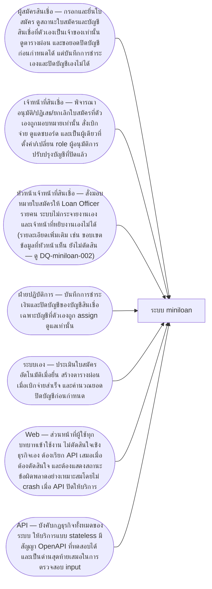
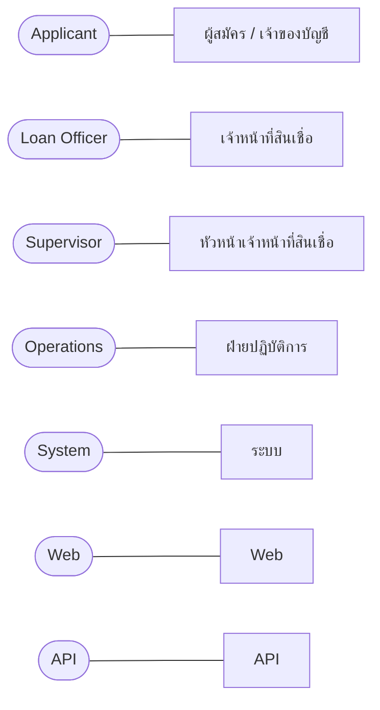
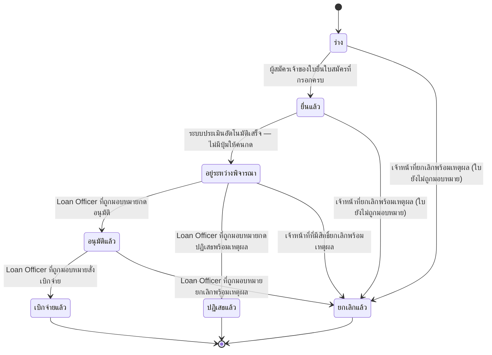
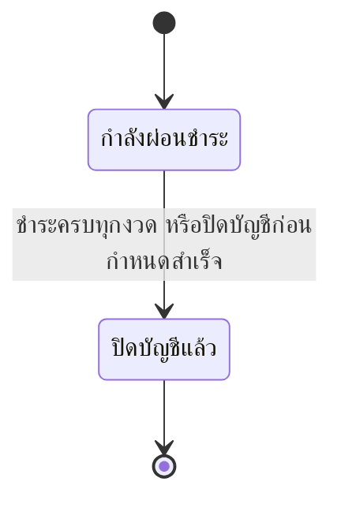
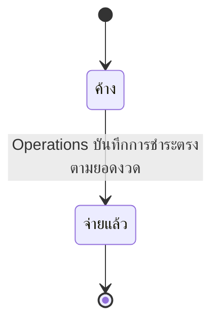
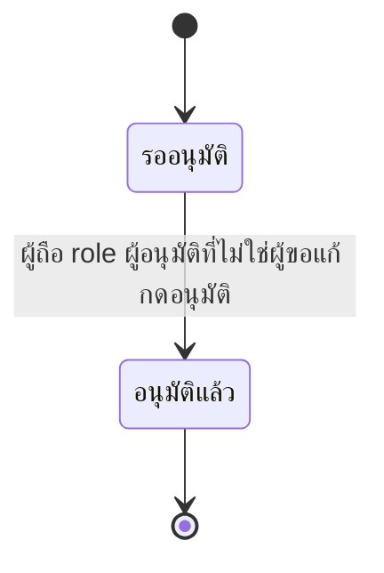
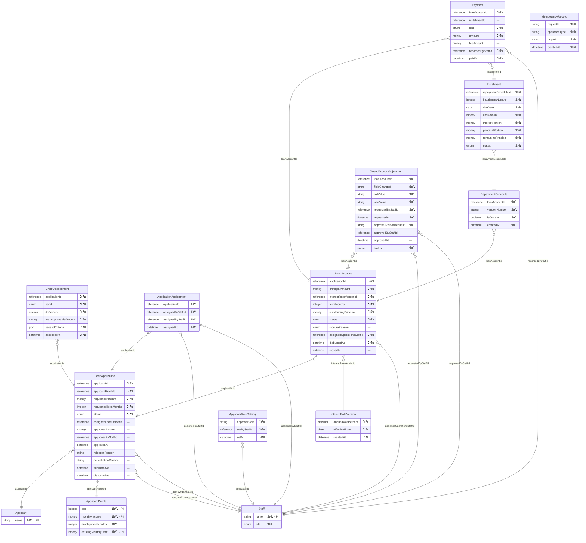
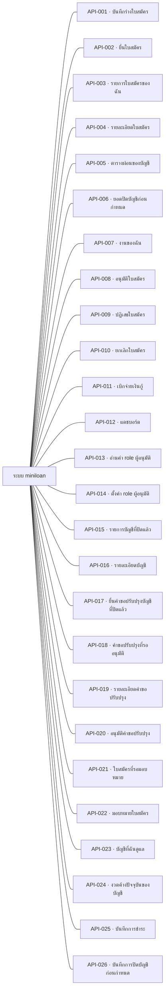
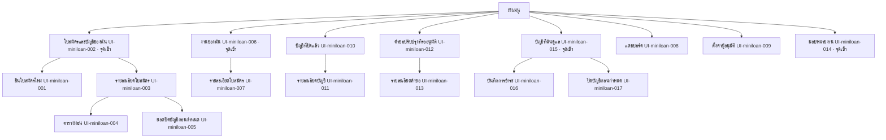

# เอกสารการออกแบบระบบ — miniloan

> เอกสารฉบับนี้ถูก **สร้างจากไฟล์ JSON ทั้งฉบับ** (renderer v1.0) — แก้ไฟล์นี้โดยตรงแล้วจะหายในการ render รอบถัดไป
> แก้ที่ต้นทางเสมอ: รายการและตารางแก้ผ่านคำสั่งของ `design` · ร้อยแก้วแก้ที่ไฟล์ Markdown ต้นทางที่ระบุไว้ท้ายแต่ละหัวข้อ

## ปกและตารางแก้ไข

**เอกสารฉบับนี้ไม่มีเลขเวอร์ชันของตัวเอง** — ไม่มีไฟล์ไหนในเฟสนี้เก็บเลขเวอร์ชันของเอกสารไว้
สิ่งที่ใช้แทนคือตารางการเปลี่ยนแปลงข้างล่าง ซึ่งอ่านจากใบเปลี่ยนแปลงจริง และตารางสถานะการอนุมัติรายไฟล์

### ตารางแก้ไข (Revision History)

| รหัส | ที่มา | เมื่อ | เหตุผล | ผู้เกี่ยวข้อง / สถานะ |
|---|---|---|---|---|
| CHG-miniloan-001 | req | 2026-08-15T11:06+07:00 | หัวหน้าเจ้าหน้าที่สินเชื่อถูกตัดสินแล้วว่าเป็น actor แยก ไม่ใช่ Loan Officer คนหนึ่ง (คำตอบ Q-miniloan-012) · ประโยคเดิมที่ว่า "ยกเลิกได้เฉพาะ Loan Officer เท่านั้น" จึงแคบเกินความจริง และทำให้เส้นยกเลิกใบสถานะ Draft กับ Submitted ที่ BR-miniloan-010@v1 เปิดไว้ ไม่มีใครเดินได้ | เจ้าของสเปก (ตอบในแชท รอบ /req:ask ตอบการ์ดแดง Q-miniloan-012) → เจ้าของสเปก |
| CHG-miniloan-002 | req | 2026-08-21T00:00+07:00 | ประโยค "กลไกการเก็บค่าธรรมเนียมยังไม่ตัดสิน (ดู Q-miniloan-013)" ในข้อความของ BR-miniloan-046@v1 ตกยุคตั้งแต่ Q-miniloan-013 ตอบแล้ว (2026-08-15) — คำตอบคลอด BR-miniloan-050@v1 และ BR-miniloan-051@v1 แยกออกไปแทนที่จะแก้ทับ BR-miniloan-046@v1 เพราะตอนนั้นมีตัวอย่างพิสูจน์อยู่แล้ว (EX-miniloan-087/088/089) · เมื่อ EX-miniloan-087/088 ถูกแก้ในรอบ /req:example ล่าสุดให้ตรงกับกลไกที่ตัดสินแล้ว ตัวอย่างที่พิสูจน์กฎข้อนี้จึงขัดกับข้อความของกฎเอง (กฎบอกว่ายังไม่ตัดสิน ตัวอย่างยืนยันกลไกที่ตัดสินแล้ว) · เป็นการขึ้นเวอร์ชันเพื่อให้ข้อความตรงกับคำตอบที่มีอยู่แล้ว ไม่ใช่การตัดสินใจใหม่ | เจ้าของสเปก (คำตอบเดิมอยู่ใน SRC-013 · Q-miniloan-013 ตอบแล้วตั้งแต่ 2026-08-15 แต่ข้อความ BR-miniloan-046@v1 ไม่เคยถูกแก้ตาม เพราะมีตัวอย่างพิสูจน์อยู่แล้ว — ช่องว่างนี้ถูกจับได้ตอนแก้ EX-miniloan-087/088 ด้วย /req:example) → เจ้าของสเปก |
| CHG-miniloan-003 | req | 2026-08-21T15:00+07:00 | Q-miniloan-015 ถูกตอบแล้ว: กรณีที่ส่วนเกินหลังหักค่าธรรมเนียมการโปะ 1% แล้วมากกว่าเงินต้นคงเหลือ ให้ปฏิเสธการบันทึกทั้งรายการ เช่นเดียวกับ BR-miniloan-052@v1 — ไม่ตัดเท่าที่เหลือแล้วทอนคืนส่วนล้น และไม่ถือเป็นการปิดบัญชีก่อนกำหนด · ประโยค "ยังไม่ตัดสิน (ดู Q-miniloan-015)" ที่ค้างอยู่ในข้อความของ BR-miniloan-050@v1 จึงตกยุคและต้องถูกแทนที่ด้วยผลการตัดสิน | เจ้าของสเปก (ตอบสด ๆ ในรอบ /req:change BR-miniloan-050 นี้ ไม่มีเอกสารรองรับ — Q-miniloan-015 เดิมเป็นการ์ดแดง raised_by BR-miniloan-050@v1 เอง ไม่ได้มาจากคำถามที่เคยส่งลูกค้า) → เจ้าของสเปก |
| CHG-miniloan-004 | req | 2026-08-21T15:30+07:00 | Q-miniloan-015 ข้อ (2) สั่งให้ขยายเงื่อนไขของ BR-miniloan-052@v1 จาก "ส่วนเกินมากกว่ายอดปิดบัญชี" ให้ครอบ "ส่วนเกินหลังหักค่าธรรมเนียมการโปะมากกว่าเงินต้นคงเหลือ" ด้วย — BR-miniloan-050@v2 (CHG-miniloan-003) อ้างถึงกฎข้อนี้ไปแล้วในฐานะปลายทางของการปฏิเสธ แต่เงื่อนไขเดิมยังไม่ครอบกรณีนั้นจริง ผลลัพธ์เหมือนกันทั้งสองทริกเกอร์จึงรวมเป็นเงื่อนไข OR เดียว ไม่แยกเป็นกฎคนละข้อ | เจ้าของสเปก (ยืนยันข้อความใหม่สด ๆ ในรอบ /req:change BR-miniloan-052 นี้ — ทำตามที่ CHG-miniloan-003 รายงานไว้ว่าเป็นขั้นถัดไปที่ต้องอนุมัติแยก) → เจ้าของสเปก |
| CHG-miniloan-005 | req | 2026-09-01T10:00+07:00 | ความขัดกันระหว่าง CALC-miniloan-001@v1 (คำนวณเต็มความละเอียดภายใน ปัดเฉพาะตอนเขียนแถว) กับ BR-miniloan-035@v1 (ปัดทันทีทุกจุดที่เกิดขึ้น) ถูกจับได้จาก Q-miniloan-016 หลังรัน GD-miniloan-001 จริง (คอลัมน์ยอดคงเหลือที่แสดงกับบัญชีภายในต่างกันระหว่างทางราว 0.02–0.17 บาท แม้ปิดที่ 0 พอดีเท่ากันตอนจบตาราง) · เจ้าของสเปกเลือกให้ CALC-miniloan-001 เป็นฝ่ายปรับตาม BR-miniloan-035@v1 แทนที่จะแก้ BR-035 — ผลคือไม่มีบัญชีภายในที่ละเอียดกว่าคอลัมน์ที่แสดงอีกต่อไป มีคอลัมน์เดียวที่ทุกกฎอ่านค่าได้โดยไม่กำกวม ซึ่งปิดคำถามท่อน (3) ของ Q-miniloan-016 ได้ทันที (BR-miniloan-022@v1 และ BR-miniloan-046@v1/BR-miniloan-050@v2 ไม่มีคอลัมน์คู่แข่งให้เลือกอ่านอีกต่อไป) | เจ้าของสเปก (ตอบสดในรอบ /req:change CALC-miniloan-001 นี้ — ยืนยันให้ CALC-miniloan-001 ปรับตาม BR-miniloan-035@v1 แทนที่จะแก้ BR-035 พร้อมปิด Q-miniloan-016 ในรอบเดียวกัน) → เจ้าของสเปก |
| CHG-miniloan-001 | design · revised | 2026-09-01T19:30:00+07:00 | หัวหน้าเจ้าหน้าที่สินเชื่อถูกตัดสินแล้วว่าเป็น actor แยก ไม่ใช่ Loan Officer คนหนึ่ง (คำตอบ Q-miniloan-012) — เส้นยกเลิกใบสถานะ Draft/Submitted ที่กฎเดิมเปิดไว้ให้เฉพาะ Loan Officer ต้องเปิดกว้างขึ้น | รับเข้าแล้ว 2026-09-01T19:45:00+07:00 |
| CHG-miniloan-002 | design · revised | 2026-09-01T19:30:00+07:00 | ข้อความ BR-miniloan-046 ตกยุค — Q-miniloan-013 ตอบแล้วว่ากลไกค่าธรรมเนียมการโปะคือ BR-miniloan-050@v1 (หักจากส่วนเกิน) แยกออกไป ไม่ใช่สิ่งที่ยังไม่ตัดสิน ขึ้นเวอร์ชันเพื่อให้ข้อความตรงกับคำตอบที่มีอยู่แล้ว ไม่ใช่การตัดสินใหม่ | รับเข้าแล้ว 2026-09-01T19:45:00+07:00 |
| CHG-miniloan-003 | design · revised | 2026-09-01T19:30:00+07:00 | Q-miniloan-015 ตอบแล้ว: ส่วนเกินหลังหักค่าธรรมเนียมการโปะ 1% มากกว่าเงินต้นคงเหลือ ต้องปฏิเสธการบันทึกทั้งรายการ ไม่ตัดเท่าที่เหลือแล้วทอนคืนส่วนล้น | รับเข้าแล้ว 2026-09-01T19:45:00+07:00 |
| CHG-miniloan-004 | design · revised | 2026-09-01T19:30:00+07:00 | Q-miniloan-015 ข้อ (2) สั่งขยายเงื่อนไขของ BR-miniloan-052 จาก "ส่วนเกินมากกว่ายอดปิดบัญชี" ให้ครอบ "ส่วนเกินหลังหักค่าธรรมเนียมการโปะมากกว่าเงินต้นคงเหลือ" ด้วย เป็นเงื่อนไข OR เดียว | รับเข้าแล้ว 2026-09-01T19:45:00+07:00 |
| CHG-miniloan-005 | design · revised | 2026-09-01T19:30:00+07:00 | ความขัดกันระหว่าง CALC-miniloan-001@v1 (คำนวณเต็มความละเอียดภายใน ปัดเฉพาะตอนเขียนแถว) กับ BR-miniloan-035@v1 (ปัดทันทีทุกจุดที่เกิดขึ้น) — เจ้าของสเปกเลือกให้ CALC-miniloan-001 ปรับตาม BR-miniloan-035@v1 แทน ปัดทุกงวดตั้งแต่ตอนนี้ ไม่เก็บบัญชีภายในที่ละเอียดกว่าคอลัมน์ที่แสดงอีกต่อไป | รับเข้าแล้ว 2026-09-01T19:45:00+07:00 |

### สถานะการอนุมัติรายไฟล์

| ไฟล์ | คำสั่งที่เขียน | สถานะขั้น | สถานะเอกสาร | ผู้อนุมัติ | เมื่อ | หมายเหตุ |
|---|---|---|---|---|---|---|
| design.state.json | /design:init | done | — | — | — | — |
| context.json | /design:overview | done | approved | mounchons | 2026-09-01T14:28:00Z | — |
| modules/miniloan/functions.json | /design:function | done | approved | mounchons | 2026-09-01T14:28:00Z | — |
| trace.design.json | /design:function | done | — | — | — | — |
| datamodel.json | /design:datamodel | done | approved | mounchons | 2026-09-01T14:28:00Z | — |
| modules/miniloan/statemachines.json | /design:datamodel | done | approved | mounchons | 2026-09-01T14:28:00Z | — |
| modules/miniloan/scenarios.json | /design:scenario | done | approved | mounchons | 2026-09-01T14:28:00Z | — |
| rbac.json | /design:rbac | done | approved | mounchons | 2026-09-01T14:28:00Z | — |
| nfr.json | /design:nfr | done | approved | mounchons | 2026-09-01T14:28:00Z | — |
| sitemap.json | /design:sitemap | done | approved | mounchons | 2026-09-01T14:28:00Z | — |
| modules/miniloan/screens.json | /design:sitemap | done | approved | mounchons | 2026-09-01T14:28:00Z | — |
| interfaces.json | /design:interface | done | approved | mounchons | 2026-09-01T14:28:00Z | — |

> ℹ️ **ข้อจำกัดของข้อมูลชุดนี้** — "สถานะขั้น" มาจากไฟล์สถานะ ส่วน "สถานะเอกสาร" มาจากตัวไฟล์เอง — ขั้นที่ค้างจะเห็นได้ที่คอลัมน์แรกเท่านั้น เพราะเครื่องหมายค้างถูกเก็บที่ขั้น ไม่ใช่ในเนื้อหาที่อนุมัติไปแล้ว

> ℹ️ **ข้อจำกัดของข้อมูลชุดนี้** — ตารางนี้ไม่มีแถวของขั้น `export` เอง เพราะ artifact ของขั้นนั้นคือเอกสารฉบับนี้ — เอกสารที่รายงานสถานะการส่งมอบของตัวเอง จะไม่ตรงกับความจริงทันทีที่มีคนบันทึกว่าส่งแล้ว

## 1 บทนำ

## 1.1 ความเป็นมาและวัตถุประสงค์

เอกสารฉบับนี้เป็นแบบออกแบบระบบ (System Design Specification) ของ **miniloan** — ระบบสินเชื่อส่วนบุคคล (personal
loan) ที่ครอบคลุมตั้งแต่การรับใบสมัคร การประเมินสินเชื่ออัตโนมัติ การพิจารณาอนุมัติ การเบิกจ่าย ไปจนถึงการติดตาม
ผ่อนชำระและปิดบัญชี จัดทำขึ้นเป็นงานฝึกในคอร์สเรียนด้าน software engineering โดยมีเป้าหมายให้ผู้เรียนได้ฝึกกระบวนการ
ออกแบบระบบแบบครบวงจร — จากความต้องการทางธุรกิจ (Phase 1 · Requirement) ไปสู่แบบออกแบบทางเทคนิค (Phase 2 ·
Design) ที่พร้อมส่งต่อให้ทีมพัฒนาใช้สร้างระบบจริงได้

โปรเจกต์นี้ใช้ **ค่าสมมติ** สำหรับตัวเลขทางธุรกิจทั้งหมด (อัตราดอกเบี้ย เกณฑ์คุณสมบัติผู้สมัคร วงเงินอนุมัติ ฯลฯ)
ตามที่ระบุไว้ในเอกสารความต้องการต้นทาง ไม่ได้อิงกฎเกณฑ์ของสถาบันการเงินจริงแห่งใดแห่งหนึ่ง

## 1.2 ที่มาของความต้องการ

ความต้องการทั้งหมดผ่านกระบวนการ Phase 1 (`req`) มาแล้ว — บันทึกเป็นกฎธุรกิจ (Business Rule) ตัวอย่างที่พิสูจน์แต่ละกฎ
(Example) และคำถามที่ยังไม่มีคำตอบ (Deferred Question / Red Card) ทุกข้อ พร้อมระบุแหล่งอ้างอิงถึงเอกสารต้นทางหรือ
บทสนทนาที่เจ้าของสเปกยืนยันไว้ Phase 1 ปิดรอบด้วยการเซ็นรับรอง (CP1) เมื่อวันที่ 2026-09-01 ก่อนที่ Phase 2 (`design`)
จะเริ่มออกแบบต่อ

ระหว่างการออกแบบ พบว่าความต้องการบางส่วนที่ Phase 1 บันทึกไว้ยังไม่ถูกส่งออกมาถึงขั้นออกแบบอย่างครบถ้วน (เช่น
กฎการโปะเงินต้นและค่าธรรมเนียมบางเวอร์ชัน และรายชื่อผู้ใช้งานที่ยังไม่เคยถูกบันทึกเป็นทางการ) ทีมออกแบบได้แก้ไขช่อง
โหว่เหล่านี้ที่ต้นทาง (`spec.json` ของ `req`) พร้อมอ้างอิงหลักฐานที่มาให้ครบทุกจุด แล้วจึงสร้างส่วนออกแบบที่เกี่ยวข้องต่อ
รายละเอียดบันทึกไว้ในประวัติการเปลี่ยนแปลง (commit history) ของโปรเจกต์

## 1.3 ขอบเขตของเอกสารนี้

เอกสารนี้ครอบคลุมผลลัพธ์ทั้งหมดของ Phase 2 ได้แก่ ฟังก์ชันและ use case (หัวข้อ 3), ความต้องการที่ไม่ใช่เชิงหน้าที่ที่
ขยายเป็นตัวเลขวัดผลได้ (หัวข้อ 4), แบบจำลองข้อมูลและวงจรสถานะ (หัวข้อ 5), ข้อกำหนดด้าน interface ทั้งภายในและ
ภายนอก พร้อมชั้นที่บังคับใช้แต่ละกฎธุรกิจ (หัวข้อ 6), ตารางสอบทานความต้องการ (หัวข้อ 7), ผังหน้าจอและการนำทาง
(หัวข้อ 8) เอกสารนี้**ไม่ครอบคลุม** งานออกแบบหน้าตา (wireframe/mockup — เป็นของขั้นตอน `mock` ซึ่งยังไม่เริ่ม) และ
**ไม่ใช่**เอกสารข้อกำหนดทางธุรกิจ (นั่นคือหน้าที่ของเอกสาร Phase 1 ซึ่งอ้างอิงได้จาก id กฎ/ความต้องการที่ปรากฏทั่วทั้ง
เอกสารนี้)

## 1.4 อภิธานศัพท์

ดูรายการคำศัพท์ทั้งหมดที่หัวข้อ 1.4 ท้ายบทนี้ (สร้างจากคลังคำศัพท์ของ `req`) — คำศัพท์ทุกคำในเอกสารนี้ใช้ความหมาย
เดียวกับที่นิยามไว้ที่นั่น

### 1.1 ขอบเขตที่อยู่ในงาน

| รหัส | รายการ | ที่มา |
|---|---|---|
| application-intake-assessment | รับใบสมัครสินเชื่อส่วนบุคคลตั้งแต่ร่างจนยื่น และประเมินอัตโนมัติด้วย rule engine ภายในเพื่อจัด Credit Band (A/B/C) พร้อมเหตุผลและวงเงินที่อนุมัติได้ | REQ-miniloan-001 |
| approval-disbursement | การมอบหมายใบสมัครให้ Loan Officer โดยหัวหน้าเจ้าหน้าที่สินเชื่อ การพิจารณาอนุมัติ/ปฏิเสธ/ยกเลิกใบสมัครแบบหนึ่งระดับ และการสั่งเบิกจ่ายเพื่อเปิดบัญชีสินเชื่อ | REQ-miniloan-002 |
| loan-account-schedule | การสร้างบัญชีสินเชื่อและตารางผ่อนแบบลดต้นลดดอก (EMI) โดยใช้เวอร์ชันอัตราดอกเบี้ยที่มีผล ณ วันเบิกจ่าย และให้เจ้าของบัญชีเปิดดูตารางผ่อนของตัวเองได้ | REQ-miniloan-003 |
| payment-closure | การบันทึกการชำระรายงวด การโปะเงินต้น การคิดยอดและปิดบัญชีก่อนกำหนด การปิดบัญชีเมื่อชำระครบทุกงวด และการปรับปรุงบัญชีที่ปิดแล้วผ่านกระบวนการอนุมัติแบบ four-eyes | REQ-miniloan-004 |
| status-dashboard | แดชบอร์ดของ Loan Officer แสดงจำนวนใบสมัครและบัญชีสินเชื่อแยกตามสถานะ | REQ-miniloan-005 |
| web-api-architecture | สถาปัตยกรรมแยก Web (client) กับ API โดยกฎธุรกิจทั้งหมดถูกบังคับที่ฝั่ง API เท่านั้น มีสัญญา API ที่ทดสอบได้ (OpenAPI) และใช้ token จำลองแทนระบบ auth จริง | REQ-miniloan-006 |

### 1.2 ขอบเขตที่ไม่อยู่ในงาน

| รหัส | รายการ | ที่มา |
|---|---|---|
| real-authentication | ระบบยืนยันตัวตน/สิทธิ์การเข้าใช้งานจริง (SSO, Identity Provider) — ใช้ token จำลองแทนตามที่ req ระบุไว้ อยู่นอกขอบเขตของรอบนี้ | REQ-miniloan-006 |
| real-payment-gateway | การเชื่อมต่อ payment gateway จริงเพื่อรับชำระเงิน — รอบนี้บันทึกรายการชำระด้วยมือโดย Operations เท่านั้น | REQ-miniloan-004 |
| multi-currency | การรองรับหลายสกุลเงิน — รอบนี้ใช้สกุลเงินบาท (THB) เพียงสกุลเดียว | REQ-miniloan-003 · REQ-miniloan-004 |
| real-sensitive-data | การเก็บข้อมูลอ่อนไหวจริงของผู้สมัคร (เช่น เลขบัตรประชาชน ข้อมูลธนาคารจริง) — รอบนี้ไม่เก็บข้อมูลอ่อนไหวจริงตามที่ req ระบุไว้ | REQ-miniloan-006 |
| applicant-notifications | การแจ้งเตือนผู้สมัครผ่าน SMS/Email เมื่อสถานะใบสมัครเปลี่ยน — req ไม่ได้พูดถึงความสามารถนี้เลย เป็นการตัดสินใจของขั้นตอน /design:overview ที่ยืนยันกับเจ้าของโปรเจกต์ ไม่ใช่ข้อความที่มาจาก req โดยตรง | — |

### 1.3 เอกสารอ้างอิง

| เอกสาร | ที่อยู่ |
|---|---|
| ความต้องการที่ `req` เก็บไว้ | .aeon/req/requirements.json |
| อภิธานศัพท์ | .aeon/req/glossary.json |
| ผู้มีส่วนได้ส่วนเสีย | .aeon/req/stakeholders.json |

### 1.4 อภิธานศัพท์

| รหัส | คำไทย | คำอังกฤษ | ความหมาย | อย่าสับสนกับ | สถานะ |
|---|---|---|---|---|---|
| UL-miniloan-001 | ใบสมัครสินเชื่อ | LoanApplication | ใบสมัครสินเชื่อ ตั้งแต่ร่างจนถึงเบิกจ่าย เป็น Aggregate ฝั่ง Origination · 1 ผู้สมัครมีได้หลายใบสมัคร | UL-miniloan-004 | draft |
| UL-miniloan-002 | ข้อมูลผู้สมัคร | ApplicantProfile | ข้อมูลผู้สมัคร: อายุ รายได้ อายุงาน ภาระหนี้ปัจจุบัน | — | draft |
| UL-miniloan-003 | ผลการประเมินสินเชื่อ | CreditAssessment | ผลการประเมินจาก rule engine ประกอบด้วยคะแนน เหตุผล และวงเงินที่อนุมัติได้ | — | draft |
| UL-miniloan-004 | บัญชีสินเชื่อ | LoanAccount | บัญชีสินเชื่อหลังเบิกจ่าย เป็น Aggregate ฝั่ง Servicing · 1 ใบสมัครที่ Disbursed สร้าง 1 บัญชี | UL-miniloan-001 | draft |
| UL-miniloan-005 | ตารางผ่อน | RepaymentSchedule | ตารางผ่อนรายงวดของบัญชีสินเชื่อหนึ่งบัญชี แต่ละแถวแยกเงินต้น ดอกเบี้ย และยอดคงเหลือ | UL-miniloan-006 | draft |
| UL-miniloan-006 | งวดผ่อน | Installment | งวดผ่อน 1 งวดในตารางผ่อน — หนึ่งแถวของ RepaymentSchedule | UL-miniloan-005 · UL-miniloan-012 | draft |
| UL-miniloan-007 | รายการชำระเงิน | Payment | รายการชำระเงินที่บันทึกเข้าบัญชีสินเชื่อ · รอบการเรียนนี้บันทึกด้วยมือ ไม่เชื่อม payment gateway จริง | — | draft |
| UL-miniloan-008 | การปิดบัญชีก่อนกำหนด | EarlySettlement | การปิดบัญชีสินเชื่อก่อนครบกำหนดงวดสุดท้าย โดยชำระยอดปิดบัญชีตาม BR-07 | — | draft |
| UL-miniloan-009 | จำนวนเงิน | Money | จำนวนเงินพร้อมสกุลเงิน เป็น Value Object · ห้ามใช้ทศนิยมลอย (floating point) · รอบการเรียนนี้ใช้ THB อย่างเดียว | — | draft |
| UL-miniloan-010 | วงเงินอนุมัติสูงสุด | MaxApprovableAmount | วงเงินสูงสุดที่ระบบอนุมัติให้ผู้สมัครรายนี้ได้ = 5 เท่าของรายได้ต่อเดือน และไม่เกิน 1,000,000 บาท — คำนวณโดยระบบ ไม่ใช่ตัวเลขที่ผู้สมัครกรอก | UL-miniloan-011 | draft |
| UL-miniloan-011 | จำนวนเงินกู้ที่ขอ | RequestedAmount | จำนวนเงินที่ผู้สมัครกรอกในใบสมัคร ต้องอยู่ในช่วง 10,000 – 1,000,000 บาท — เป็นตัวเลขที่คนกรอก ไม่ใช่ตัวเลขที่ระบบคำนวณ | UL-miniloan-010 | draft |
| UL-miniloan-012 | จำนวนงวด | Term | จำนวนงวดที่ตกลงกันในสัญญา เป็นตัวเลขนับ ต้องอยู่ในช่วง 6 – 60 งวด (รายเดือน) — เป็นค่าที่ผู้สมัครเลือกตอนกรอกใบสมัคร และเป็น n ในสูตร EMI · ไม่ใช่แถวในตารางผ่อน | UL-miniloan-006 | draft |
| UL-miniloan-013 | การมอบหมายใบสมัคร | ApplicationAssignment | การผูกใบสมัครหนึ่งใบเข้ากับ Loan Officer หนึ่งคนเพื่อให้เป็นผู้พิจารณา · เฉพาะคนที่ถูกมอบหมายเท่านั้นที่กดอนุมัติหรือปฏิเสธใบสมัครนั้นได้ · แนวคิดนี้ไม่มีในเอกสารต้นทาง เกิดจากการตัดสินของเจ้าของในรอบ /req:ask permission | — | draft |
| UL-miniloan-014 | อัตราดอกเบี้ย | InterestRate | อัตราดอกเบี้ยแบบลดต้นลดดอกที่ใช้คำนวณตารางผ่อน · เป็นข้อมูลหลักที่มีเวอร์ชันและมีวันเริ่มมีผล (effective date) ไม่ใช่ค่าคงที่ในโค้ด — บัญชีสินเชื่อผูกกับเวอร์ชันที่มีผลอยู่ ณ วันเบิกจ่าย และเวอร์ชันที่เคยถูกใช้ห้ามลบ | — | draft |
| UL-miniloan-015 | การปรับปรุงบัญชีหลังปิด | ClosedAccountAdjustment | รายการขอแก้ไขข้อมูลของบัญชีสินเชื่อที่ปิดแล้ว (Closed) ต้องผ่านการอนุมัติจากผู้ถือบทบาทผู้อนุมัติ (UL-miniloan-016) ก่อนจึงมีผล ไม่ใช่การแก้ทับทันที · เก็บเป็นรายการปรับปรุงแยกจากตัวบัญชี ค่าเดิมของบัญชีคงไว้ไม่ถูกทับ และรายการเก็บค่าเดิม ค่าใหม่ ผู้ขอแก้ ผู้อนุมัติ และเวลาอนุมัติ | UL-miniloan-008 | draft |
| UL-miniloan-016 | บทบาทผู้อนุมัติ | ApproverRole | role ที่ระบบกำหนดให้มีสิทธิ์อนุมัติการปรับปรุงบัญชีสินเชื่อที่ปิดแล้ว — เป็นค่าที่ตั้งไว้ในระบบและเปลี่ยนได้ภายหลัง ไม่ผูกตายกับ actor ใด actor หนึ่งในโค้ด · ถ้ายังไม่ตั้ง ฟีเจอร์ปรับปรุงบัญชีที่ปิดแล้วใช้ไม่ได้ (ไม่มีค่าเริ่มต้น) · ใครตั้งค่าได้ และต้องต่างจากผู้ขอแก้หรือไม่ ยังไม่ตัดสิน — ดู Q-miniloan-009 | UL-miniloan-013 | draft |
| UL-miniloan-017 | ตารางผ่อนฉบับที่ออกใหม่ | RepaymentScheduleRevision | ตารางผ่อนฉบับใหม่ที่ออกทับฉบับเดิมของบัญชีสินเชื่อเดียวกัน เมื่อจำเป็นต้องเปลี่ยนตารางผ่อนที่ออกให้ผู้กู้ไปแล้ว — ออกทับทั้งฉบับ ไม่ใช่แก้บางแถวของฉบับเดิม · ฉบับเดิมยังเก็บไว้ดูย้อนหลังได้และห้ามลบ แนวเดียวกับเวอร์ชันของอัตราดอกเบี้ยใน BR-miniloan-037@v1 | UL-miniloan-005 | draft |
| UL-miniloan-018 | การโปะเงินต้น | PartialPrepayment | การชำระเกินยอดงวด โดยส่วนที่เกินถูกนำไปตัดเงินต้นของบัญชีสินเชื่อที่ยังเป็น Active — บัญชีไม่ปิด ยังผ่อนต่อ แต่เงินต้นลดลงจึงต้องออกตารางผ่อนฉบับใหม่ทับตาม BR-miniloan-044@v1 · ส่วนเกินไปลดจำนวนงวดโดยค่างวดคงเดิม (Q-miniloan-010) · มีค่าธรรมเนียม 1% ของยอดส่วนที่เกิน หักออกจากส่วนเกินก่อนนำไปตัดเงินต้น (Q-miniloan-013 → BR-miniloan-050@v1) · ถ้าส่วนเกินมากพอปิดบัญชีได้ในครั้งเดียว ไม่ใช่การโปะแล้ว แต่เป็นการปิดบัญชีก่อนกำหนดตาม BR-miniloan-051@v1 | UL-miniloan-008 | draft |
| UL-miniloan-019 | หัวหน้าเจ้าหน้าที่สินเชื่อ | Supervisor | ผู้ที่มีอำนาจสั่งมอบหมายใบสมัครให้ Loan Officer รายคน — เอกสารต้นทาง §3 ไม่มี actor นี้ (มีแค่ Applicant / Loan Officer / Operations / System) เกิดขึ้นจากคำตอบของ Q-miniloan-005 · ยังไม่ตัดสินว่ามีกี่ระดับ ทำอย่างอื่นได้อีกไหม และเห็นข้อมูลของลูกน้องแค่ไหน — ส่วนขอบเขตข้อมูลค้างอยู่ที่ DQ-miniloan-002 | UL-miniloan-013 | draft |
| UL-miniloan-020 | การยกเลิกใบสมัคร | ApplicationCancellation | การจบใบสมัครก่อนถึงการเบิกจ่าย โดยใบนั้นไปอยู่สถานะสุดท้าย Cancelled — ทำได้ตั้งแต่ Draft ถึง Approved เท่านั้น ใบที่ Disbursed แล้วยกเลิกไม่ได้ · **สั่งได้เฉพาะเจ้าหน้าที่ (Loan Officer) และต้องระบุเหตุผลเสมอ** — Applicant ยกเลิกใบของตัวเองไม่ได้ ต้องแจ้งเจ้าหน้าที่ · เป็นวิธีแก้เดียวเมื่อใบสมัครเดินสถานะผิด เพราะ BR-miniloan-010@v1 ไม่มีเส้นถอยกลับ · ใครยกเลิกใบที่ยังไม่ถูกมอบหมายได้ ยังไม่ตัดสิน — ดู Q-miniloan-012 | UL-miniloan-008 | draft |
| UL-miniloan-021 | ค่าธรรมเนียมการโปะ | PrepaymentFee | ค่าธรรมเนียม 1% ของยอดส่วนที่เกิน ซึ่งเกิดขึ้นเมื่อผู้กู้โปะเงินต้นของบัญชีที่ยังเป็น Active — หักออกจากยอดส่วนเกินก่อนนำไปตัดเงินต้น ไม่ใช่รายการเรียกเก็บแยก (BR-miniloan-050@v1) · ต่างจากค่าธรรมเนียมปิดก่อนกำหนดซึ่งคิด 1% ของเงินต้นคงเหลือและใช้เมื่อบัญชีปิด (BR-miniloan-022@v1) · ที่ขอบซึ่งส่วนเกินพอปิดบัญชีได้พอดี ให้ใช้ฐานปิดก่อนกำหนดเสมอตาม BR-miniloan-051@v1 | UL-miniloan-008 | draft |
| UL-miniloan-022 | เงินต้นคงเหลือ | OutstandingPrincipal | เงินต้นที่ยังไม่ได้ชำระของบัญชีสินเชื่อ ณ เวลาหนึ่ง — เป็นฐานของดอกเบี้ยรายงวด (ดอกเบี้ยงวด = เงินต้นคงเหลือ × อัตราต่อเดือน ตาม BR-miniloan-016@v1) · เป็นฐานของยอดปิดบัญชีก่อนกำหนดและค่าธรรมเนียม 1% ตาม BR-miniloan-022@v1 · เป็นคอลัมน์สุดท้ายของตารางผ่อน ซึ่งต้องเป็น 0 พอดีหลังงวดสุดท้าย · **"ยอดคงเหลือ" ที่พบในเอกสารต้นทางและในกฎหลายข้อคือคำเดียวกันกับคำนี้** ไม่ใช่ยอดที่ต้องจ่ายทั้งหมดที่เหลือ (ซึ่งจะรวมดอกเบี้ยในอนาคต) — ยืนยันแล้วในรอบ QB-lang-01 · คำหลักเลือก "เงินต้นคงเหลือ" เพราะเป็นคำที่ไม่กำกวม · **แหล่งอ้างอิงเดียวของค่านี้คือคอลัมน์ยอดคงเหลือของตารางผ่อนฉบับล่าสุด** ไม่ใช่การคำนวณขึ้นใหม่จากสูตร — ตัดสินในรอบตอบการ์ดแดง Q-miniloan-016 และเขียนเป็น BR-miniloan-053@v1 | UL-miniloan-008 | draft |
| UL-miniloan-023 | ยอดที่อนุมัติจริง | ApprovedAmount | จำนวนเงินที่ Loan Officer อนุมัติจริงให้ใบสมัครหนึ่งใบ — อาจต่ำกว่าจำนวนเงินกู้ที่ขอ (UL-miniloan-011) เมื่อยอดที่ขอเกินวงเงินอนุมัติสูงสุด (UL-miniloan-010) และเจ้าหน้าที่ปรับลงตาม BR-miniloan-012@v1 · เป็นตัวเลขที่กลายเป็นเงินต้นตั้งต้น (P) ของตารางผ่อนตอนเบิกจ่าย · **ไม่ใช่ตัวเดียวกับจำนวนเงินกู้ที่ขอ** — DTI ที่บันทึกไว้ตอนยื่นผูกกับยอดที่ขอและไม่คำนวณใหม่แม้เจ้าหน้าที่จะปรับวงเงินลง (Q-miniloan-002) ถ้าใช้คำเดียวกัน ตัวเลขที่ DTI อ้างถึงจะหายไป · **กฎที่ระบุว่า P ของ BR-miniloan-016@v1 มาจากยอดนี้ยังไม่ถูกเขียนเป็น BR** เพราะรอบที่คลอดคำนี้เป็นรอบชั้น 1 ซึ่งเขียน rules[] ไม่ได้ — เส้นทางที่เหลือคือ /req:calc BR-miniloan-016@v1 ซึ่งต้องระบุ input ของสูตรอยู่แล้ว | UL-miniloan-011 · UL-miniloan-010 · UL-miniloan-022 | draft |
| UL-miniloan-024 | ผู้สมัคร | Applicant | คนที่ยื่นขอสินเชื่อ และเป็นคนเดียวกับคนที่ถือบัญชีสินเชื่อหลังเบิกจ่าย — **หนึ่งคน หนึ่งคำ** ไม่แยกเป็นคนละแนวคิดตามช่วงเวลา · คำว่า "ผู้กู้" และ "ลูกค้า" ที่ปรากฏใน spec เป็นคำเรียกอย่างอื่นของคนคนเดียวกัน ไม่ใช่ actor คนละตัว — ทั้งสองคำไม่มีในเอกสารต้นทางเลย เกิดขึ้นระหว่างการเก็บกฎ · เลือก "ผู้สมัคร / Applicant" เป็นคำหลักจากอินพุต (§3 ตาราง actor) — **เป็นการอ่าน ไม่ใช่คำตอบ เจ้าของยังไม่ได้ระบุคำหลัก** | UL-miniloan-002 | draft |
| UL-miniloan-025 | ยอดปิดบัญชี | PayoffAmount | จำนวนเงินทั้งหมดที่ต้องชำระเพื่อปิดบัญชีสินเชื่อก่อนครบกำหนด = เงินต้นคงเหลือ + ดอกเบี้ยค้างจ่ายถึงวันที่ปิด + ค่าธรรมเนียมปิดก่อนกำหนด 1% ของเงินต้นคงเหลือ ตาม BR-miniloan-022@v1 · **เป็นเส้นแบ่งที่ระบบใช้ตัดสินว่าการชำระที่เกินยอดงวดเป็นอะไร** ตาม BR-miniloan-051@v1 — เท่ากันพอดี = ปิดบัญชี · น้อยกว่า = การโปะ · มากกว่า = ปฏิเสธทั้งรายการตาม BR-miniloan-052@v1 · **ไม่ใช่เงินต้นคงเหลือ** ซึ่งเป็นเพียงส่วนหนึ่งของยอดนี้ และไม่ใช่ตัวการปิดบัญชีเอง | UL-miniloan-022 · UL-miniloan-008 | draft |

## 2 ภาพรวมระบบ

## 2.1 มุมมองผลิตภัณฑ์ (Product Perspective)

miniloan เป็นระบบใหม่ทั้งหมด (greenfield) ไม่ได้แทนที่ระบบเดิมที่มีอยู่ — โปรเจกต์นี้จำลองสถานการณ์ตั้งต้นของสถาบัน
การเงินขนาดเล็กที่ต้องการระบบสินเชื่อส่วนบุคคลแบบครบวงจรใบแรก ระบบแบ่งเป็นสองส่วนที่ deploy แยกกันตามที่ตกลงไว้ที่
`REQ-miniloan-006`: **Web** (ส่วนหน้าที่ผู้ใช้ทุกบทบาทเข้าใช้งาน ไม่ตัดสินใจเชิงธุรกิจเอง) และ **API** (บังคับกฎธุรกิจ
ทั้งหมด ให้บริการแบบ stateless) — ไม่มีระบบภายนอกที่ต้องเชื่อมต่อ (ระบบปิด — closed system) เพราะไม่มี payment
gateway จริง ไม่มีระบบยืนยันตัวตนจริง และไม่มีการแจ้งเตือนผ่าน SMS/Email ในรอบนี้ (ดูหัวข้อ 2.3)

## 2.2 กระบวนการทำงาน — As-Is / To-Be

**As-Is (ก่อนมีระบบ):** กระบวนการพิจารณาสินเชื่อส่วนบุคคลแบบดั้งเดิมที่ระบบนี้จำลอง มักทำด้วยมือหรือกึ่งอัตโนมัติ —
เจ้าหน้าที่สินเชื่อรับใบสมัครกระดาษหรือไฟล์ Excel ตรวจคุณสมบัติผู้สมัคร (อายุ รายได้ อายุงาน) และคำนวณ Debt-to-Income
เอง มอบหมายงานกันด้วยปากเปล่าหรือสเปรดชีตกลาง ไม่มีบันทึกที่มาของการตัดสินใจอนุมัติ/ปฏิเสธที่เป็นระบบ การคำนวณ
ตารางผ่อนและยอดปิดบัญชีก่อนกำหนดทำด้วยสเปรดชีตแยกไฟล์ต่อบัญชี เสี่ยงต่อความผิดพลาดจากการปัดเศษที่ไม่สม่ำเสมอ
และไม่มีร่องรอยตรวจสอบย้อนหลัง (audit trail) ว่าใครแก้ไขอะไรเมื่อไร

**To-Be (ระบบที่ออกแบบในเอกสารนี้):** ทุกขั้นตอนของวงจรชีวิตใบสมัคร-บัญชีสินเชื่อเดินผ่านระบบเดียว ตั้งแต่บันทึกร่าง
ใบสมัคร ยื่น ประเมินอัตโนมัติ มอบหมาย พิจารณา เบิกจ่าย จนถึงติดตามผ่อนชำระและปิดบัญชี (หัวข้อ 3) — ทุกการเปลี่ยน
สถานะบันทึกผู้กระทำและเวลาโดยอัตโนมัติ (`NFR-miniloan-002`) การคำนวณทางการเงินทุกจุดใช้กฎการปัดเศษเดียวกันทั้ง
ระบบ (`BR-miniloan-035@v1`) สิทธิ์การเข้าถึงข้อมูลถูกจำกัดตามบทบาทและขอบเขตความรับผิดชอบอย่างชัดเจน (หัวข้อ 6.5)
และมีตารางสอบทานที่โยงทุกฟังก์ชันกลับไปยังความต้องการต้นทางได้ (หัวข้อ 7) — สิ่งที่เคยทำด้วยมือและเสี่ยงต่อความ
ผิดพลาดของมนุษย์ กลายเป็นกฎที่ระบบบังคับใช้เองที่ชั้น domain ของ API เสมอ ไม่ขึ้นกับดุลยพินิจของผู้ใช้แต่ละคน

## 2.3 ขอบเขต

**อยู่ในขอบเขต:** การรับและประเมินใบสมัคร, การมอบหมาย/พิจารณา/เบิกจ่าย, การสร้างบัญชีสินเชื่อและตารางผ่อน, การ
บันทึกการชำระ/โปะเงินต้น/ปิดบัญชีก่อนกำหนด/ปรับปรุงบัญชีที่ปิดแล้ว, แดชบอร์ดสรุปสถานะ, สถาปัตยกรรม Web/API แยกส่วน

**นอกขอบเขตของรอบนี้:** ระบบยืนยันตัวตนจริง (ใช้ token จำลองแทน), การเชื่อมต่อ payment gateway จริง (บันทึกการ
ชำระด้วยมือโดย Operations เท่านั้น), การรองรับหลายสกุลเงิน (ใช้บาทเดียว), การเก็บข้อมูลอ่อนไหวจริงของผู้สมัคร, และ
การแจ้งเตือนผู้สมัครผ่าน SMS/Email — รายละเอียดพร้อมแหล่งอ้างอิงอยู่ที่ `context.json`

## 2.4 ผู้ใช้งานระบบ (Stakeholders)

ระบบมีผู้ใช้งาน 4 กลุ่มที่เป็นคน และ 3 บทบาทเชิงเทคนิค — บันทึกอย่างเป็นทางการที่ `req` เป็น `STK-miniloan-001` ถึง
`007` และผูกเข้ากับตารางสิทธิ์ (`ROLE-001` ถึง `007`) ที่หัวข้อ 6.5:

| ผู้ใช้งาน | บทบาทหลัก |
|---|---|
| ผู้สมัคร (Applicant) | กรอกและยื่นใบสมัคร ดูสถานะและตารางผ่อนของตัวเองเท่านั้น ขอยอดปิดบัญชีก่อนกำหนดได้ แต่บันทึกการชำระ/ปิดบัญชีเองไม่ได้ |
| เจ้าหน้าที่สินเชื่อ (Loan Officer) | พิจารณาอนุมัติ/ปฏิเสธ/ยกเลิกใบสมัครที่ตัวเองถูกมอบหมาย สั่งเบิกจ่าย ดูแดชบอร์ด ตั้งค่า role ผู้อนุมัติการปรับปรุงบัญชีที่ปิดแล้ว |
| หัวหน้าเจ้าหน้าที่สินเชื่อ (Supervisor) | มอบหมายใบสมัครให้เจ้าหน้าที่สินเชื่อรายคน |
| ฝ่ายปฏิบัติการ (Operations) | บันทึกการชำระและปิดบัญชีเฉพาะบัญชีที่ตัวเองถูก assign ดูแล |
| ระบบ (System) | ประเมินใบสมัครอัตโนมัติ สร้างตารางผ่อน คำนวณยอดปิดบัญชี — ไม่มีคนกด |
| Web / API | บทบาทเชิงเทคนิคของสถาปัตยกรรม ไม่ใช่ผู้ใช้ที่เป็นคน |

## 2.5 เทคโนโลยีที่เลือกใช้

ทีมเลือกเทคโนโลยีได้อย่างอิสระภายใต้ `NFR-miniloan-006` (ความเป็นอิสระจากภาษา/เฟรมเวิร์ก) เพราะไม่มีข้อบังคับจาก
ภายนอกคอร์ส — รายละเอียดคำถามและเหตุผลที่เลือกบันทึกไว้เป็นการ์ดตัดสินใจ (`DEC-001` ถึง `DEC-004`) ที่หัวข้อ 2.6
สรุปสั้น: **Next.js (React)** สำหรับ Web, **ASP.NET Core Web API** สำหรับ API, **PostgreSQL** สำหรับฐานข้อมูล และ
**Docker Compose** สำหรับรันในเครื่องพัฒนา

### 2.1 ผังบริบทของระบบ (DFD ระดับ 0)

> ℹ️ **ข้อจำกัดของข้อมูลชุดนี้** — `context.json` ยังไม่มีระบบภายนอกสักรายการ ผังนี้จึงมีแต่ผู้ใช้ — ระบบภายนอกที่บันทึกไว้จริงอยู่ในหัวข้อ 6 และเป็นคนละช่องข้อมูล

### 2.2 ผู้ใช้ระบบ

| รหัส | ผู้ใช้ | ผู้มีส่วนได้ส่วนเสียที่ `req` บันทึก |
|---|---|---|
| applicant | ผู้สมัครสินเชื่อ — กรอกและยื่นใบสมัคร ดูสถานะใบสมัครและบัญชีสินเชื่อที่ตัวเองเป็นเจ้าของเท่านั้น ดูตารางผ่อน และขอยอดปิดบัญชีก่อนกำหนดได้ แต่บันทึกการชำระเองและปิดบัญชีเองไม่ได้ | — |
| loan-officer | เจ้าหน้าที่สินเชื่อ — พิจารณาอนุมัติ/ปฏิเสธ/ยกเลิกใบสมัครที่ตัวเองถูกมอบหมายเท่านั้น สั่งเบิกจ่าย ดูแดชบอร์ด และเป็นผู้เดียวที่ตั้งค่า/เปลี่ยน role ผู้อนุมัติการปรับปรุงบัญชีที่ปิดแล้ว | — |
| supervisor | หัวหน้าเจ้าหน้าที่สินเชื่อ — สั่งมอบหมายใบสมัครให้ Loan Officer รายคน ระบบไม่กระจายงานเอง และเจ้าหน้าที่หยิบงานเองไม่ได้ (รายละเอียดเพิ่มเติม เช่น ขอบเขตข้อมูลที่หัวหน้าเห็น ยังไม่ตัดสิน — ดู DQ-miniloan-002) | — |
| operations | ฝ่ายปฏิบัติการ — บันทึกการชำระเงินและปิดบัญชีของบัญชีสินเชื่อเฉพาะบัญชีที่ตัวเองถูก assign ดูแลเท่านั้น | — |
| system | ระบบเอง — ประเมินใบสมัครอัตโนมัติเมื่อยื่น สร้างตารางผ่อนเมื่อเบิกจ่ายสำเร็จ และคำนวณยอดปิดบัญชีก่อนกำหนด | — |
| web-client | Web — ส่วนหน้าที่ผู้ใช้ทุกบทบาทเข้าใช้งาน ไม่ตัดสินใจเชิงธุรกิจเอง ต้องเรียก API เสมอเมื่อต้องตัดสินใจ และต้องแสดงสถานะข้อผิดพลาดอย่างเหมาะสมโดยไม่ crash เมื่อ API ปิดให้บริการ | — |
| api | API — บังคับกฎธุรกิจทั้งหมดของระบบ ให้บริการแบบ stateless มีสัญญา OpenAPI ที่ทดสอบได้ และเป็นด่านสุดท้ายเสมอในการตรวจสอบ input | — |

### 2.3 ข้อสมมติ

| รหัส | ข้อสมมติ | ที่มา |
|---|---|---|
| thai-only-ui | หน้าจอผู้ใช้ (Web) ใช้ภาษาไทยเพียงภาษาเดียว ไม่ต้องรองรับหลายภาษา — ยืนยันกับเจ้าของโปรเจกต์แล้วในขั้นตอน /design:overview เอกสารต้นทางและ glossary ทั้งหมดเป็นภาษาไทยอยู่แล้ว | — |
| training-project-scope | โปรเจกต์นี้เป็นงานเพื่อการเรียน/ฝึกฝนในคอร์ส ไม่ใช่ระบบที่จะขึ้นใช้งานจริงกับผู้ใช้จริง — ระดับความเข้มงวดของ security และ scalability ที่ออกแบบจึงอิงตามที่ req ระบุไว้ใน NFR เท่านั้น ไม่ต้องเผื่อสำหรับ production | REQ-miniloan-006 |
| no-external-constraint | ไม่มี deadline งบประมาณ หรือเทคโนโลยีที่ถูกบังคับมาจากภายนอกคอร์ส — ทีมออกแบบเลือกเทคโนโลยีได้เองภายใต้ NFR-miniloan-006 (ความเป็นอิสระจากภาษา/เฟรมเวิร์ก) ผลการเลือกบันทึกไว้ใน decisions[] | REQ-miniloan-006 |

### 2.4 ข้อจำกัด

_(ไม่มีรายการ)_

### 2.5 แผนผังผู้มีส่วนได้ส่วนเสีย

| รหัส | ชื่อ | ประเภท | กลายเป็นบทบาท | คำอธิบาย |
|---|---|---|---|---|
| STK-miniloan-001 | Applicant | external | — | ผู้สมัครสินเชื่อ — กรอกและยื่นใบสมัคร ดูสถานะใบสมัครและบัญชีสินเชื่อที่ตัวเองเป็นเจ้าของ ขอยอดปิดบัญชีก่อนกำหนด |
| STK-miniloan-002 | Loan Officer | internal | — | เจ้าหน้าที่สินเชื่อ — พิจารณาอนุมัติ/ปฏิเสธ/ยกเลิกใบสมัครที่ตัวเองถูกมอบหมาย สั่งเบิกจ่าย ดูแดชบอร์ด และตั้งค่า role ผู้อนุมัติการปรับปรุงบัญชีที่ปิดแล้ว |
| STK-miniloan-003 | Supervisor | internal | — | หัวหน้าเจ้าหน้าที่สินเชื่อ — สั่งมอบหมายใบสมัครให้ Loan Officer รายคน แยกออกจาก Loan Officer ตามคำตอบ Q-miniloan-005/Q-miniloan-012 — เอกสารต้นทาง §3 ไม่มี actor นี้ |
| STK-miniloan-004 | Operations | internal | — | ฝ่ายปฏิบัติการ — บันทึกการชำระเงินและปิดบัญชีของบัญชีสินเชื่อเฉพาะบัญชีที่ตัวเองถูก assign ดูแล สืบทอด assignment จาก Loan Officer เดิมของใบสมัครตอนเบิกจ่าย |
| STK-miniloan-005 | System | system | — | ระบบเอง — ประเมินใบสมัครอัตโนมัติเมื่อยื่น คำนวณคะแนน/วงเงิน/ตารางผ่อน และบังคับ business rule อัตโนมัติ ไม่มีคนกด |
| STK-miniloan-006 | Web | system | — | ส่วนหน้าที่ผู้ใช้ทุกบทบาทที่เป็นคนเข้าใช้งาน ไม่ตัดสินใจเชิงธุรกิจเอง เรียก API เสมอเมื่อต้องตัดสินใจ |
| STK-miniloan-007 | API | system | — | บังคับกฎธุรกิจทั้งหมดของระบบเสมอ ไม่พึ่งการ validate ของ Web ให้บริการแบบ stateless มีสัญญา OpenAPI ที่ทดสอบได้ และเป็นด่านสุดท้ายเสมอในการตรวจสอบ input |

### 2.6 คำตัดสินทางเทคโนโลยี

| รหัส | หัวข้อ | คำถาม | สิ่งที่เลือก | สถานะ |
|---|---|---|---|---|
| DEC-001 | framework | Frontend (Web client) ใช้เฟรมเวิร์กอะไร — Web ต้องเป็น thin client ที่ไม่ตัดสินใจเชิงธุรกิจเองตาม BR-miniloan-027@v1 และต้องแสดงสถานะข้อผิดพลาดอย่างเหมาะสมเมื่อ API ล่มตาม BR-miniloan-028@v1 | Next.js (React) | เลือกแล้ว รอลายเซ็น |
| DEC-002 | framework | Backend API ใช้ framework/runtime อะไร — ต้องรองรับ NFR-miniloan-001 (ห้าม floating point กับเงิน), NFR-miniloan-004 (domain-centric/layered) และ NFR-miniloan-005 (stateless REST + OpenAPI) | .NET / C# (ASP.NET Core Web API) | เลือกแล้ว รอลายเซ็น |
| DEC-003 | database | ฐานข้อมูลเลือกอะไร — ต้องเก็บจำนวนเงินแบบ exact decimal ตาม NFR-miniloan-001 และรองรับ unique constraint กันคำสั่งซ้ำตาม BR-miniloan-043@v1 | PostgreSQL | เลือกแล้ว รอลายเซ็น |
| DEC-004 | hosting | การ deploy/hosting ของโปรเจกต์นี้เป็นแบบใด — โปรเจกต์นี้เป็นงานฝึกในคอร์สเรียน ไม่ใช่ระบบที่ขึ้น production จริง | Local / Docker Compose | เลือกแล้ว รอลายเซ็น |

#### DEC-001 · Frontend (Web client) ใช้เฟรมเวิร์กอะไร — Web ต้องเป็น thin client ที่ไม่ตัดสินใจเชิงธุรกิจเองตาม BR-miniloan-027@v1 และต้องแสดงสถานะข้อผิดพลาดอย่างเหมาะสมเมื่อ API ล่มตาม BR-miniloan-028@v1

| ทางเลือกที่ชั่งน้ำหนัก | แนะนำ | หลักฐานที่ตรวจได้ | หมายเหตุ |
|---|---|---|---|
| Next.js (React) | ⭐ | รองรับทั้ง SSR และ client-side rendering ระบบนิเวศไลบรารีฟอร์ม/validation UI พร้อม ทำให้แยกชั้นการตัดสินใจเชิงธุรกิจออกจาก UI ได้ชัดตาม BR-miniloan-027@v1 | — |
| Vue.js (Nuxt) | — | — | — |

| หัวข้อ | รายละเอียด |
|---|---|
| สิ่งที่เลือก | Next.js (React) |
| เหตุผล | เจ้าของโปรเจกต์เลือก Next.js ตามความถนัดของทีมและระบบนิเวศที่พร้อมสำหรับการแยกชั้น UI ออกจาก business logic |
| ผู้ตัดสิน | mounchons |
| วันที่ตัดสิน | 2026-09-01 |
| ตัวเลขที่บังคับให้เลือกแบบนี้ | NFR-miniloan-004 |
| ลายเซ็น | ยังไม่มี |

#### DEC-002 · Backend API ใช้ framework/runtime อะไร — ต้องรองรับ NFR-miniloan-001 (ห้าม floating point กับเงิน), NFR-miniloan-004 (domain-centric/layered) และ NFR-miniloan-005 (stateless REST + OpenAPI)

| ทางเลือกที่ชั่งน้ำหนัก | แนะนำ | หลักฐานที่ตรวจได้ | หมายเหตุ |
|---|---|---|---|
| .NET / C# (ASP.NET Core Web API) | ⭐ | มี decimal type ในตัวภาษาโดยตรง สนอง NFR-miniloan-001 โดยไม่ต้องพึ่ง library ช่วย และ Swashbuckle ออก OpenAPI ให้อัตโนมัติ สนอง NFR-miniloan-005 | — |
| Java / Spring Boot | — | — | — |
| Node.js / TypeScript (NestJS) | — | — | — |

| หัวข้อ | รายละเอียด |
|---|---|
| สิ่งที่เลือก | .NET / C# (ASP.NET Core Web API) |
| เหตุผล | เจ้าของโปรเจกต์เลือก .NET/ASP.NET Core เพราะมี decimal type ในตัวที่ตรงกับข้อกำหนดห้ามใช้ floating point กับเงินตาม NFR-miniloan-001 และมี tooling รองรับ OpenAPI/layered architecture ครบ |
| ผู้ตัดสิน | mounchons |
| วันที่ตัดสิน | 2026-09-01 |
| ตัวเลขที่บังคับให้เลือกแบบนี้ | NFR-miniloan-001 · NFR-miniloan-004 · NFR-miniloan-005 |
| ลายเซ็น | ยังไม่มี |

#### DEC-003 · ฐานข้อมูลเลือกอะไร — ต้องเก็บจำนวนเงินแบบ exact decimal ตาม NFR-miniloan-001 และรองรับ unique constraint กันคำสั่งซ้ำตาม BR-miniloan-043@v1

| ทางเลือกที่ชั่งน้ำหนัก | แนะนำ | หลักฐานที่ตรวจได้ | หมายเหตุ |
|---|---|---|---|
| PostgreSQL | ⭐ | มีชนิดข้อมูล NUMERIC(p,s) แบบ exact decimal โดยตรง รองรับ unique constraint และ transaction ครบตามที่ BR-miniloan-043@v1 ต้องการ และเป็น open-source เหมาะกับงานฝึกในคอร์ส | — |
| SQL Server | — | — | — |

| หัวข้อ | รายละเอียด |
|---|---|
| สิ่งที่เลือก | PostgreSQL |
| เหตุผล | เจ้าของโปรเจกต์เลือก PostgreSQL เพราะมีชนิดข้อมูล NUMERIC แบบ exact decimal ตรงตาม NFR-miniloan-001 และไม่มีค่าใช้จ่ายด้าน license เหมาะกับงานฝึกในคอร์ส |
| ผู้ตัดสิน | mounchons |
| วันที่ตัดสิน | 2026-09-01 |
| ตัวเลขที่บังคับให้เลือกแบบนี้ | NFR-miniloan-001 |
| ลายเซ็น | ยังไม่มี |

#### DEC-004 · การ deploy/hosting ของโปรเจกต์นี้เป็นแบบใด — โปรเจกต์นี้เป็นงานฝึกในคอร์สเรียน ไม่ใช่ระบบที่ขึ้น production จริง

| ทางเลือกที่ชั่งน้ำหนัก | แนะนำ | หลักฐานที่ตรวจได้ | หมายเหตุ |
|---|---|---|---|
| Local / Docker Compose | ⭐ | เพียงพอสำหรับรัน Web + API + PostgreSQL บนเครื่องเดียวเพื่อการเรียน ไม่ต้องมีค่าใช้จ่าย cloud และสอดคล้องกับสมมติฐานว่าโปรเจกต์นี้เป็นงานฝึกในคอร์ส ไม่ใช่ production จริง | — |
| Cloud (Azure/AWS) | — | — | — |

| หัวข้อ | รายละเอียด |
|---|---|
| สิ่งที่เลือก | Local / Docker Compose |
| เหตุผล | โปรเจกต์นี้เป็นงานฝึกในคอร์สเรียน ไม่ต้องรองรับผู้ใช้จริงหรือ scale จริง จึงเพียงพอที่จะรันบน Docker Compose ในเครื่อง |
| ผู้ตัดสิน | mounchons |
| วันที่ตัดสิน | 2026-09-01 |
| ตัวเลขที่บังคับให้เลือกแบบนี้ | — |
| ลายเซ็น | ยังไม่มี |

> ℹ️ **ข้อจำกัดของข้อมูลชุดนี้** — การ์ดที่ยังไม่มี “สิ่งที่เลือก” คือคำถามที่ยังเปิดอยู่ ไม่ใช่ช่องที่ลืมกรอก — ท่านกำลังอ่านคำถามที่ทีมออกแบบยังไม่ได้ตัดสิน และเป็นคำถามที่ท่านตอบได้ · ลายเซ็นเป็นรายใบ การเซ็นใบหนึ่งจึงไม่ผูกพันใบอื่น · หลักฐานในตารางเป็นสิ่งที่ท่านตรวจได้เอง คำแนะนำที่ไม่มีหลักฐานถูกปฏิเสธตั้งแต่ตอนบันทึก

## 3 ความต้องการเชิงหน้าที่

### 3.1 โมดูล miniloan

| รหัส | ฟังก์ชัน | คำอธิบาย | ความต้องการต้นทาง | กฎที่คุม |
|---|---|---|---|---|
| FUN-miniloan-001 | บันทึกและยื่นใบสมัครสินเชื่อ | รับข้อมูลใบสมัครสินเชื่อส่วนบุคคลจากผู้สมัคร ตั้งแต่บันทึกร่างจนถึงยื่นเข้าสู่การประเมิน | REQ-miniloan-001 | BR-miniloan-004@v1 · BR-miniloan-007@v1 · BR-miniloan-008@v1 |
| FUN-miniloan-002 | ประเมินสินเชื่ออัตโนมัติ | ประเมินใบสมัครที่ยื่นแล้วด้วย rule engine ภายใน เพื่อจัด Credit Band พร้อมเหตุผลและวงเงินที่อนุมัติได้ | REQ-miniloan-001 | BR-miniloan-001@v1 · BR-miniloan-002@v1 · BR-miniloan-003@v1 · BR-miniloan-006@v1 · BR-miniloan-009@v1 |
| FUN-miniloan-003 | มอบหมายใบสมัครให้เจ้าหน้าที่สินเชื่อ | ให้หัวหน้าเจ้าหน้าที่สินเชื่อเลือก Loan Officer ผู้รับผิดชอบพิจารณาใบสมัครแต่ละใบ | REQ-miniloan-002 | BR-miniloan-032@v1 |
| FUN-miniloan-004 | พิจารณาอนุมัติหรือปฏิเสธใบสมัคร | ให้ Loan Officer ที่ถูกมอบหมายพิจารณาใบสมัครที่อยู่ระหว่างพิจารณา แล้วอนุมัติหรือปฏิเสธ | REQ-miniloan-002 | BR-miniloan-010@v1 · BR-miniloan-011@v1 · BR-miniloan-012@v1 · BR-miniloan-013@v1 · BR-miniloan-031@v2 · BR-miniloan-032@v1 |
| FUN-miniloan-005 | ยกเลิกใบสมัคร | ให้เจ้าหน้าที่ (Loan Officer ที่ถูกมอบหมาย หรือหัวหน้าเมื่อยังไม่ถูกมอบหมาย) ยกเลิกใบสมัครที่ยังไม่เบิกจ่ายพร้อมเหตุผล | REQ-miniloan-002 | BR-miniloan-010@v1 · BR-miniloan-031@v2 · BR-miniloan-047@v1 |
| FUN-miniloan-006 | เบิกจ่ายเงินกู้ | ให้ Loan Officer สั่งเบิกจ่ายใบสมัครที่อนุมัติแล้ว เพื่อเปิดบัญชีสินเชื่อ | REQ-miniloan-002 | BR-miniloan-010@v1 · BR-miniloan-014@v1 · BR-miniloan-031@v2 |
| FUN-miniloan-007 | สร้างตารางผ่อนเมื่อเบิกจ่าย | สร้างตารางผ่อนแบบลดต้นลดดอกให้บัญชีสินเชื่อทันทีที่เบิกจ่ายสำเร็จ โดยใช้เวอร์ชันอัตราดอกเบี้ยที่มีผล ณ วันเบิกจ่าย | REQ-miniloan-003 | BR-miniloan-005@v1 · BR-miniloan-015@v1 · BR-miniloan-016@v1 · BR-miniloan-017@v1 · BR-miniloan-036@v1 · BR-miniloan-037@v1 |
| FUN-miniloan-008 | ดูตารางผ่อนของบัญชีตัวเอง | ให้เจ้าของบัญชีเปิดดูตารางผ่อนเต็มตารางของบัญชีสถานะ Active ของตัวเอง พร้อมสถานะรายงวด | REQ-miniloan-003 | BR-miniloan-018@v1 |
| FUN-miniloan-009 | ออกตารางผ่อนฉบับใหม่ทับ | ออกตารางผ่อนฉบับใหม่ทับทั้งฉบับเมื่อเงินต้นหรือเงื่อนไขเปลี่ยน โดยเก็บฉบับเดิมไว้ดูย้อนหลังและห้ามลบ | REQ-miniloan-003 | BR-miniloan-044@v1 · BR-miniloan-045@v1 |
| FUN-miniloan-010 | บันทึกการชำระรายงวด | ให้ Operations บันทึกการชำระที่ตรงยอดงวดเข้าบัญชีสินเชื่อ | REQ-miniloan-004 | BR-miniloan-019@v1 · BR-miniloan-020@v1 · BR-miniloan-034@v1 |
| FUN-miniloan-011 | โปะเงินต้น (ชำระเกินยอดงวด) | รับชำระที่เกินยอดงวด นำส่วนเกินหลังหักค่าธรรมเนียมไปตัดเงินต้น แล้วออกตารางผ่อนฉบับใหม่ทับ | REQ-miniloan-004 | BR-miniloan-034@v1 · BR-miniloan-046@v2 · BR-miniloan-050@v2 · BR-miniloan-051@v1 · BR-miniloan-052@v2 · BR-miniloan-053@v1 |
| FUN-miniloan-012 | คำนวณยอดและปิดบัญชีก่อนกำหนด | แสดงยอดปิดบัญชีก่อนกำหนดให้เจ้าของบัญชีดู และให้ Operations บันทึกการปิดบัญชีเมื่อชำระยอดนั้นครบ | REQ-miniloan-004 | BR-miniloan-021@v1 · BR-miniloan-022@v1 · BR-miniloan-023@v1 · BR-miniloan-034@v1 · BR-miniloan-053@v1 |
| FUN-miniloan-013 | ตั้งค่า role ผู้อนุมัติการปรับปรุงบัญชีที่ปิดแล้ว | ให้ Loan Officer ตั้งค่าหรือเปลี่ยน role ที่มีสิทธิ์อนุมัติคำขอปรับปรุงบัญชีสินเชื่อที่ปิดแล้ว | REQ-miniloan-004 | BR-miniloan-039@v1 · BR-miniloan-040@v1 · BR-miniloan-048@v1 |
| FUN-miniloan-014 | ขอและอนุมัติการปรับปรุงบัญชีที่ปิดแล้ว | ให้เจ้าหน้าที่ยื่นคำขอแก้ไขข้อมูลบัญชีที่ปิดแล้ว และให้ผู้ถือ role ผู้อนุมัติ (คนละคนกับผู้ขอ) อนุมัติก่อนมีผล | REQ-miniloan-004 | BR-miniloan-038@v1 · BR-miniloan-041@v1 · BR-miniloan-049@v1 |
| FUN-miniloan-015 | ดูรายการบัญชีสินเชื่อที่ดูแล | จำกัดให้ Operations เห็นและดำเนินการกับเฉพาะบัญชีสินเชื่อที่ตัวเองถูก assign ดูแลเท่านั้น | REQ-miniloan-004 | BR-miniloan-054@v1 |
| FUN-miniloan-016 | ดูแดชบอร์ดภาพรวมสถานะ | แสดงจำนวนใบสมัครและบัญชีสินเชื่อแยกตามสถานะให้ Loan Officer เห็นภาพรวมงานในหน้าเดียว | REQ-miniloan-005 | BR-miniloan-024@v1 |
| FUN-miniloan-017 | บังคับกฎธุรกิจและสัญญาที่ชั้น API | บังคับกฎธุรกิจทุกข้อที่ API เสมอ ไม่พึ่งการ validate ของ Web และเผยแพร่สัญญา API ที่ทดสอบได้ | REQ-miniloan-006 | BR-miniloan-025@v1 · BR-miniloan-026@v1 · BR-miniloan-027@v1 · BR-miniloan-029@v1 · BR-miniloan-030@v1 |
| FUN-miniloan-018 | จัดการข้อผิดพลาดของ API และการยิงคำสั่งซ้ำ | ให้ Web แสดงสถานะข้อผิดพลาดอย่างเหมาะสมเมื่อ API ล่มหรือ timeout และให้ API กันคำสั่งเขียนที่ยิงซ้ำด้วย unique constraint | REQ-miniloan-006 | BR-miniloan-028@v1 · BR-miniloan-042@v1 · BR-miniloan-043@v1 |
| FUN-miniloan-019 | จำกัดสิทธิ์เข้าถึงข้อมูลตามเจ้าของที่ชั้น API | บังคับที่ฝั่ง API ว่าผู้สมัครเห็นและเรียกดูได้เฉพาะใบสมัครและบัญชีสินเชื่อที่ตัวเองเป็นเจ้าของ | REQ-miniloan-006 | BR-miniloan-033@v1 |
| FUN-miniloan-020 | ปัดเศษจำนวนเงินสม่ำเสมอทั้งระบบ | ปัดเศษจำนวนเงินทันทีที่เกิดขึ้นทุกจุดของระบบด้วยวิธี round half up วิธีเดียวกันทั้งระบบ | REQ-miniloan-006 | BR-miniloan-035@v1 |

#### ผังกรณีใช้งาน — miniloan

```mermaid
flowchart LR
  subgraph U0["FUN-miniloan-001 · บันทึกและยื่นใบสมัครสินเชื่อ"]
    U1(["UC-miniloan-001 · บันทึกร่างใบสมัคร"])
    U2(["UC-miniloan-002 · ยื่นใบสมัคร"])
  end
  subgraph U3["FUN-miniloan-002 · ประเมินสินเชื่ออัตโนมัติ"]
    U4(["UC-miniloan-003 · ประเมินใบสมัครเมื่อยื่น"])
  end
  subgraph U5["FUN-miniloan-003 · มอบหมายใบสมัครให้เจ้าหน้าที่สินเชื่อ"]
    U6(["UC-miniloan-004 · มอบหมายใบสมัครให้เจ้าหน้าที่สินเชื่อ"])
  end
  subgraph U7["FUN-miniloan-004 · พิจารณาอนุมัติหรือปฏิเสธใบสมัคร"]
    U8(["UC-miniloan-005 · อนุมัติใบสมัคร"])
    U9(["UC-miniloan-006 · ปฏิเสธใบสมัคร"])
  end
  subgraph U10["FUN-miniloan-005 · ยกเลิกใบสมัคร"]
    U11(["UC-miniloan-007 · ยกเลิกใบสมัคร"])
  end
  subgraph U12["FUN-miniloan-006 · เบิกจ่ายเงินกู้"]
    U13(["UC-miniloan-008 · เบิกจ่ายเงินกู้"])
  end
  subgraph U14["FUN-miniloan-007 · สร้างตารางผ่อนเมื่อเบิกจ่าย"]
    U15(["UC-miniloan-009 · สร้างตารางผ่อนเมื่อเบิกจ่าย"])
  end
  subgraph U16["FUN-miniloan-008 · ดูตารางผ่อนของบัญชีตัวเอง"]
    U17(["UC-miniloan-010 · ดูตารางผ่อน"])
  end
  subgraph U18["FUN-miniloan-009 · ออกตารางผ่อนฉบับใหม่ทับ"]
    U19(["UC-miniloan-011 · ออกตารางผ่อนฉบับใหม่ทับ"])
  end
  subgraph U20["FUN-miniloan-010 · บันทึกการชำระรายงวด"]
    U21(["UC-miniloan-012 · บันทึกการชำระรายงวด"])
  end
  subgraph U22["FUN-miniloan-011 · โปะเงินต้น (ชำระเกินยอดงวด)"]
    U23(["UC-miniloan-013 · บันทึกการโปะเงินต้น"])
  end
  subgraph U24["FUN-miniloan-012 · คำนวณยอดและปิดบัญชีก่อนกำหนด"]
    U25(["UC-miniloan-014 · ขอยอดปิดบัญชีก่อนกำหนด"])
    U26(["UC-miniloan-015 · บันทึกการปิดบัญชีก่อนกำหนด"])
  end
  subgraph U27["FUN-miniloan-013 · ตั้งค่า role ผู้อนุมัติการปรับปรุงบัญชีที่ปิดแล้ว"]
    U28(["UC-miniloan-016 · ตั้งค่า/เปลี่ยน role ผู้อนุมัติ"])
  end
  subgraph U29["FUN-miniloan-014 · ขอและอนุมัติการปรับปรุงบัญชีที่ปิดแล้ว"]
    U30(["UC-miniloan-017 · ขอปรับปรุงบัญชีที่ปิดแล้ว"])
    U31(["UC-miniloan-018 · อนุมัติการปรับปรุงบัญชีที่ปิดแล้ว"])
  end
  subgraph U32["FUN-miniloan-015 · ดูรายการบัญชีสินเชื่อที่ดูแล"]
    U33(["UC-miniloan-019 · ดูรายการบัญชีที่ดูแล"])
  end
  subgraph U34["FUN-miniloan-016 · ดูแดชบอร์ดภาพรวมสถานะ"]
    U35(["UC-miniloan-020 · ดูแดชบอร์ด"])
  end
  subgraph U36["FUN-miniloan-017 · บังคับกฎธุรกิจและสัญญาที่ชั้น API"]
    U37(["UC-miniloan-021 · เรียก API ตามสัญญา"])
  end
  subgraph U38["FUN-miniloan-018 · จัดการข้อผิดพลาดของ API และการยิงคำสั่งซ้ำ"]
    U39(["UC-miniloan-022 · จัดการเมื่อ API ล้มเหลวหรือยิงซ้ำ"])
  end
  subgraph U40["FUN-miniloan-019 · จำกัดสิทธิ์เข้าถึงข้อมูลตามเจ้าของที่ชั้น API"]
    U41(["UC-miniloan-023 · จำกัดขอบเขตข้อมูลตามเจ้าของ"])
  end
  subgraph U42["FUN-miniloan-020 · ปัดเศษจำนวนเงินสม่ำเสมอทั้งระบบ"]
    U43(["UC-miniloan-024 · ปัดเศษจำนวนเงิน"])
  end
  A0["Applicant"] --> U1
  A0["Applicant"] --> U2
  A1["System"] --> U4
  A2["Supervisor"] --> U6
  A3["Loan Officer"] --> U8
  A3["Loan Officer"] --> U9
  A3["Loan Officer"] --> U11
  A3["Loan Officer"] --> U13
  A1["System"] --> U15
  A0["Applicant"] --> U17
  A1["System"] --> U19
  A4["Operations"] --> U21
  A4["Operations"] --> U23
  A0["Applicant"] --> U25
  A4["Operations"] --> U26
  A3["Loan Officer"] --> U28
  A3["Loan Officer"] --> U30
  A3["Loan Officer"] --> U31
  A4["Operations"] --> U33
  A3["Loan Officer"] --> U35
  A5["Web"] --> U37
  A5["Web"] --> U39
  A6["API"] --> U41
  A1["System"] --> U43
```

> ℹ️ **ข้อจำกัดของข้อมูลชุดนี้** — Mermaid ไม่มีไวยากรณ์ของ use case diagram โดยตรง ผังนี้จึงวาดด้วย flowchart — ผู้ใช้เป็นกล่อง กรณีใช้งานเป็นแคปซูล และกรอบคือฟังก์ชันที่เป็นเจ้าของ

#### UC-miniloan-001 · บันทึกร่างใบสมัคร

| หัวข้อ | รายละเอียด |
|---|---|
| ฟังก์ชันที่สังกัด | FUN-miniloan-001 |
| ผู้ใช้ | Applicant |
| เงื่อนไขก่อนเริ่ม | ผู้สมัครล็อกอินเข้าระบบด้วยบัญชีของตัวเองแล้ว |

**ขั้นตอนหลัก**
1. ผู้สมัครเปิดแบบฟอร์มใบสมัครสินเชื่อ
2. ผู้สมัครกรอกข้อมูลเท่าที่มีในมือ ไม่จำเป็นต้องครบทุกช่อง
3. ผู้สมัครกดบันทึกร่าง
4. ระบบบันทึกใบสมัครสถานะ "ร่าง (Draft)" โดยยังไม่ตรวจ business rule เต็มตาม BR-miniloan-008@v1

**ทางเลือกอื่น**
1. ผู้สมัครเปิดร่างเดิมที่เคยบันทึกไว้ขึ้นมาแก้ไขต่อ แล้วบันทึกทับร่างเดิม

**กรณียกเว้น**
1. ผู้สมัครกดบันทึกร่างโดยไม่กรอกอะไรเลย — ระบบยังบันทึกร่างเปล่าให้ได้ เพราะขั้นร่างไม่ตรวจความครบถ้วน

#### UC-miniloan-002 · ยื่นใบสมัคร

| หัวข้อ | รายละเอียด |
|---|---|
| ฟังก์ชันที่สังกัด | FUN-miniloan-001 |
| ผู้ใช้ | Applicant |
| เงื่อนไขก่อนเริ่ม | มีใบสมัครสถานะ "ร่าง (Draft)" ของผู้สมัครที่ล็อกอินอยู่ |

**ขั้นตอนหลัก**
1. ผู้สมัครเปิดร่างใบสมัครของตัวเอง
2. ผู้สมัครกรอกข้อมูลให้ครบ (ชื่อ อายุ รายได้ อายุงาน จำนวนเงินกู้ จำนวนงวด)
3. ระบบตรวจว่าจำนวนเงินกู้และจำนวนงวดอยู่ในช่วงที่รับได้ตาม BR-miniloan-004@v1
4. ผู้สมัครกดยื่นใบสมัคร
5. ระบบเปลี่ยนสถานะเป็น "ยื่นแล้ว (Submitted)" และล็อกการแก้ไขตาม BR-miniloan-007@v1

**ทางเลือกอื่น**
1. ผู้สมัครกดยื่นจากหน้าจอที่มีข้อมูลครบอยู่แล้วในครั้งเดียว โดยไม่ผ่านขั้นบันทึกร่างก่อน

**กรณียกเว้น**
1. กรอกไม่ครบ (ชื่อ อายุ รายได้ อายุงาน จำนวนเงินกู้ หรือจำนวนงวดขาดไป) — ระบบปฏิเสธการยื่นพร้อมระบุ field ที่ขาด ใบสมัครยังเป็น "ร่าง (Draft)"
2. จำนวนเงินกู้หรือจำนวนงวดอยู่นอกช่วงที่ BR-miniloan-004@v1 กำหนด — ระบบปฏิเสธการยื่นพร้อมข้อความช่วงที่รับได้

#### UC-miniloan-003 · ประเมินใบสมัครเมื่อยื่น

| หัวข้อ | รายละเอียด |
|---|---|
| ฟังก์ชันที่สังกัด | FUN-miniloan-002 |
| ผู้ใช้ | System |
| เงื่อนไขก่อนเริ่ม | ใบสมัครเพิ่งเปลี่ยนเป็นสถานะ "ยื่นแล้ว (Submitted)" |

**ขั้นตอนหลัก**
1. ระบบตรวจเกณฑ์อายุ รายได้ และอายุงานตาม BR-miniloan-001@v1
2. ระบบคำนวณ Debt-to-Income ตาม BR-miniloan-002@v1
3. ระบบคำนวณวงเงินอนุมัติสูงสุดตาม BR-miniloan-003@v1
4. ระบบจัด Credit Band (A/B/C) ตาม BR-miniloan-006@v1
5. ระบบสร้าง CreditAssessment พร้อมคะแนน เหตุผลที่ผ่าน/ไม่ผ่านรายเกณฑ์ และวงเงินที่อนุมัติได้ตาม BR-miniloan-009@v1
6. ระบบเปลี่ยนสถานะใบสมัครเป็น "อยู่ระหว่างพิจารณา (UnderReview)" โดยไม่มีใครกด เพราะเส้นนี้เป็นของ System

**ทางเลือกอื่น**
1. ผู้สมัครผ่านทุกเกณฑ์และ DTI ≤ 50% (Band A) — ผลประเมินระบุว่าเข้าเงื่อนไขอนุมัติอัตโนมัติได้ แต่ยังต้องรอเจ้าหน้าที่ยืนยันตาม BR-miniloan-006@v1

**กรณียกเว้น**
1. ผู้สมัครไม่ผ่านเกณฑ์อายุ รายได้ อายุงาน หรือ DTI เกิน 70% (Band C) — ผลประเมินระบุเหตุผลที่ไม่ผ่านรายเกณฑ์ชัดเจน ใบสมัครยังคงเข้าสู่ UnderReview เพื่อให้เจ้าหน้าที่เห็นเหตุผลก่อนตัดสินใจ

#### UC-miniloan-004 · มอบหมายใบสมัครให้เจ้าหน้าที่สินเชื่อ

| หัวข้อ | รายละเอียด |
|---|---|
| ฟังก์ชันที่สังกัด | FUN-miniloan-003 |
| ผู้ใช้ | Supervisor |
| เงื่อนไขก่อนเริ่ม | ใบสมัครอยู่สถานะ "อยู่ระหว่างพิจารณา (UnderReview)" และยังไม่ถูกมอบหมาย |

**ขั้นตอนหลัก**
1. หัวหน้าเจ้าหน้าที่สินเชื่อเปิดรายการใบสมัครที่รอมอบหมาย
2. หัวหน้าเลือก Loan Officer หนึ่งคนสำหรับใบสมัครนั้นตาม BR-miniloan-032@v1
3. ระบบบันทึกการมอบหมายพร้อมชื่อผู้มอบหมายและเวลา
4. เฉพาะ Loan Officer ที่ถูกมอบหมายเท่านั้นที่เห็นปุ่มอนุมัติ/ปฏิเสธของใบสมัครนั้น

**ทางเลือกอื่น**
1. หัวหน้ามอบหมายใบสมัครหลายใบให้ Loan Officer คนเดียวกันในรอบเดียว

**กรณียกเว้น**
1. ผู้ใช้ที่ไม่ใช่หัวหน้าเจ้าหน้าที่สินเชื่อพยายามมอบหมายใบสมัคร — ระบบปฏิเสธเพราะระบบไม่กระจายงานเองและเจ้าหน้าที่หยิบงานเองไม่ได้

#### UC-miniloan-005 · อนุมัติใบสมัคร

| หัวข้อ | รายละเอียด |
|---|---|
| ฟังก์ชันที่สังกัด | FUN-miniloan-004 |
| ผู้ใช้ | Loan Officer |
| เงื่อนไขก่อนเริ่ม | ใบสมัครอยู่สถานะ "อยู่ระหว่างพิจารณา (UnderReview)" · ใบสมัครถูกมอบหมายให้ Loan Officer ที่ล็อกอินอยู่แล้วตาม BR-miniloan-032@v1 |

**ขั้นตอนหลัก**
1. Loan Officer เปิดใบสมัครที่ตัวเองถูกมอบหมาย พร้อมดูผลประเมิน
2. Loan Officer กดอนุมัติ
3. ระบบตรวจว่าจำนวนเงินกู้ที่ขอไม่เกินวงเงินอนุมัติสูงสุดตาม BR-miniloan-003@v1
4. ระบบเปลี่ยนสถานะเป็น "อนุมัติแล้ว (Approved)" และบันทึกผู้อนุมัติกับเวลาตาม BR-miniloan-011@v1

**ทางเลือกอื่น**
1. จำนวนเงินกู้ที่ขอเกินวงเงินอนุมัติสูงสุด — ระบบเตือนและให้ Loan Officer ปรับวงเงินลงก่อนตาม BR-miniloan-012@v1 จึงจะกดอนุมัติสำเร็จ

**กรณียกเว้น**
1. Loan Officer ที่ไม่ถูกมอบหมายใบนี้พยายามอนุมัติ ทั้งจากหน้าจอและเรียก API ตรง — ถูกปฏิเสธทั้งสองทางตาม BR-miniloan-032@v1
2. ใบสมัครยังไม่ถูกมอบหมายให้ผู้พิจารณา — ทุกคนถูกปฏิเสธ ใบสมัครค้างรอจนกว่าหัวหน้าจะจ่ายงาน
3. พยายามถอยสถานะใบที่ "อนุมัติแล้ว (Approved)" กลับไป "อยู่ระหว่างพิจารณา (UnderReview)" — ระบบปฏิเสธเพราะ BR-miniloan-010@v1 ไม่มีเส้นถอยกลับ ต้องยกเลิกแล้วสร้างใบใหม่แทน

#### UC-miniloan-006 · ปฏิเสธใบสมัคร

| หัวข้อ | รายละเอียด |
|---|---|
| ฟังก์ชันที่สังกัด | FUN-miniloan-004 |
| ผู้ใช้ | Loan Officer |
| เงื่อนไขก่อนเริ่ม | ใบสมัครอยู่สถานะ "อยู่ระหว่างพิจารณา (UnderReview)" · ใบสมัครถูกมอบหมายให้ Loan Officer ที่ล็อกอินอยู่แล้ว |

**ขั้นตอนหลัก**
1. Loan Officer เปิดใบสมัครที่ตัวเองถูกมอบหมาย
2. Loan Officer กดปฏิเสธและระบุเหตุผล
3. ระบบเปลี่ยนสถานะเป็น "ปฏิเสธแล้ว (Rejected)" ซึ่งเป็นสถานะสุดท้ายตาม BR-miniloan-013@v1

**ทางเลือกอื่น**
1. Loan Officer ปฏิเสธทันทีหลังเห็นผลประเมิน Band C โดยไม่ขอข้อมูลเพิ่มจากผู้สมัคร

**กรณียกเว้น**
1. Loan Officer กดปฏิเสธโดยไม่ระบุเหตุผล — ระบบปฏิเสธคำสั่งนี้ บังคับให้ระบุเหตุผลเสมอ
2. พยายามอนุมัติใบที่ "ปฏิเสธแล้ว (Rejected)" อีกครั้ง — ระบบปฏิเสธเป็น invalid transition เพราะ Rejected เป็นสถานะสุดท้าย

#### UC-miniloan-007 · ยกเลิกใบสมัคร

| หัวข้อ | รายละเอียด |
|---|---|
| ฟังก์ชันที่สังกัด | FUN-miniloan-005 |
| ผู้ใช้ | Loan Officer |
| เงื่อนไขก่อนเริ่ม | ใบสมัครอยู่สถานะ Draft, Submitted หรือ UnderReview เท่านั้น (ยังไม่เบิกจ่าย) |

**ขั้นตอนหลัก**
1. Loan Officer ที่ถูกมอบหมายใบสมัครนั้นเปิดใบสมัคร
2. Loan Officer กดยกเลิกและระบุเหตุผลตาม BR-miniloan-047@v1
3. ระบบเปลี่ยนสถานะเป็น "ยกเลิกแล้ว (Cancelled)" ซึ่งเป็นสถานะสุดท้ายตาม BR-miniloan-010@v1

**ทางเลือกอื่น**
1. ใบสมัครยังไม่ถูกมอบหมาย — หัวหน้าเจ้าหน้าที่สินเชื่อเป็นผู้กดยกเลิกแทน เพราะสิทธิ์ยกเลิกยังไม่ย้ายไปที่ Loan Officer คนใดตาม BR-miniloan-031@v2

**กรณียกเว้น**
1. Applicant พยายามยกเลิกใบสมัครของตัวเอง — ระบบปฏิเสธ เพราะยกเลิกได้เฉพาะเจ้าหน้าที่เท่านั้น ต้องแจ้งเจ้าหน้าที่แทน
2. Loan Officer คนอื่นที่ไม่ใช่ผู้ถูกมอบหมาย หรือหัวหน้าหลังใบถูกมอบหมายแล้ว พยายามยกเลิก — ระบบปฏิเสธเพราะสิทธิ์ยกเลิกย้ายไปที่ผู้ถูกมอบหมายทันทีที่มอบหมายเกิดขึ้น
3. พยายามยกเลิกใบสมัครที่ "เบิกจ่ายแล้ว (Disbursed)" — ระบบปฏิเสธเพราะมีบัญชีสินเชื่อเปิดอยู่แล้ว ต้องดำเนินการทางปิดบัญชีแทน

#### UC-miniloan-008 · เบิกจ่ายเงินกู้

| หัวข้อ | รายละเอียด |
|---|---|
| ฟังก์ชันที่สังกัด | FUN-miniloan-006 |
| ผู้ใช้ | Loan Officer |
| เงื่อนไขก่อนเริ่ม | ใบสมัครอยู่สถานะ "อนุมัติแล้ว (Approved)" |

**ขั้นตอนหลัก**
1. Loan Officer เปิดใบสมัครที่อนุมัติแล้ว
2. Loan Officer กดสั่งเบิกจ่าย
3. ระบบเปลี่ยนสถานะใบสมัครเป็น "เบิกจ่ายแล้ว (Disbursed)" ตาม BR-miniloan-014@v1
4. ระบบสร้าง LoanAccount สถานะ "กำลังผ่อนชำระ (Active)" หนึ่งบัญชีต่อหนึ่งใบสมัคร

**ทางเลือกอื่น**
1. Loan Officer ที่ถูกมอบหมายสั่งเบิกจ่ายทันทีในวันเดียวกับที่อนุมัติ

**กรณียกเว้น**
1. พยายามเบิกจ่ายใบสมัครที่ยังไม่ "อนุมัติแล้ว (Approved)" — ระบบปฏิเสธเป็น invalid transition
2. Loan Officer ที่ไม่ถูกมอบหมายใบนี้พยายามสั่งเบิกจ่าย ทั้งจากหน้าจอและเรียก API ตรง — ถูกปฏิเสธทั้งสองทาง

#### UC-miniloan-009 · สร้างตารางผ่อนเมื่อเบิกจ่าย

| หัวข้อ | รายละเอียด |
|---|---|
| ฟังก์ชันที่สังกัด | FUN-miniloan-007 |
| ผู้ใช้ | System |
| เงื่อนไขก่อนเริ่ม | ใบสมัครเพิ่งเปลี่ยนเป็นสถานะ "เบิกจ่ายแล้ว (Disbursed)" และเปิด LoanAccount แล้ว |

**ขั้นตอนหลัก**
1. ระบบอ่านเวอร์ชันอัตราดอกเบี้ยที่มีผล ณ วันเบิกจ่ายตาม BR-miniloan-036@v1
2. ระบบคำนวณค่างวด EMI ด้วยสูตรลดต้นลดดอกตาม BR-miniloan-016@v1 โดยใช้อัตรา 25% ต่อปีตาม BR-miniloan-005@v1
3. ระบบแยกแต่ละงวดเป็นดอกเบี้ยและเงินต้น ให้ผลรวมเงินต้นเท่ากับเงินต้นตั้งต้นพอดีและยอดคงเหลืองวดสุดท้ายเป็น 0 ตาม BR-miniloan-017@v1
4. ระบบบันทึกบัญชีให้ผูกกับ id ของเวอร์ชันอัตราที่ใช้ ไม่คัดลอกตัวเลขมาเก็บตาม BR-miniloan-037@v1
5. ระบบสร้าง RepaymentSchedule ให้บัญชีนั้นตาม BR-miniloan-015@v1

**ทางเลือกอื่น**
1. วันเบิกจ่ายตรงกับวันเริ่มมีผลของอัตราดอกเบี้ยเวอร์ชันใหม่พอดี — ระบบใช้เวอร์ชันที่เริ่มมีผลแล้ว ณ วันนั้น

**กรณียกเว้น**
1. มีการประกาศอัตราดอกเบี้ยเวอร์ชันใหม่หลังบัญชีนี้เบิกจ่ายไปแล้ว — ตารางผ่อนที่สร้างไปแล้วไม่ถูกกระทบ เพราะบัญชีผูกกับเวอร์ชันเดิมที่ใช้ตอนสร้างตาราง

#### UC-miniloan-010 · ดูตารางผ่อน

| หัวข้อ | รายละเอียด |
|---|---|
| ฟังก์ชันที่สังกัด | FUN-miniloan-008 |
| ผู้ใช้ | Applicant |
| เงื่อนไขก่อนเริ่ม | ผู้สมัครล็อกอินและเป็นเจ้าของบัญชีสินเชื่อสถานะ Active |

**ขั้นตอนหลัก**
1. เจ้าของบัญชีเปิดหน้าตารางผ่อนของบัญชีตัวเอง
2. ระบบแสดงตารางผ่อนทั้งตารางพร้อมสถานะรายงวด (จ่ายแล้ว / ค้าง) ตาม BR-miniloan-018@v1

**ทางเลือกอื่น**
1. เจ้าของบัญชีเลื่อนดูแถวสรุปท้ายตารางเพื่อตรวจผลรวมเงินต้นและยอดคงเหลืองวดสุดท้าย

**กรณียกเว้น**
1. ผู้ใช้พยายามเปิดตารางผ่อนของบัญชีที่ไม่ใช่ของตัวเอง — ระบบปฏิเสธที่ฝั่ง API ตาม BR-miniloan-033@v1

#### UC-miniloan-011 · ออกตารางผ่อนฉบับใหม่ทับ

| หัวข้อ | รายละเอียด |
|---|---|
| ฟังก์ชันที่สังกัด | FUN-miniloan-009 |
| ผู้ใช้ | System |
| เงื่อนไขก่อนเริ่ม | บัญชีสินเชื่อมีเหตุให้เงินต้นหรือเงื่อนไขเปลี่ยนหลังเบิกจ่ายไปแล้ว (เช่น โปะเงินต้น) และบัญชียังไม่ "ปิดบัญชีแล้ว (Closed)" |

**ขั้นตอนหลัก**
1. ระบบคำนวณตารางผ่อนใหม่จากเงินต้นคงเหลือปัจจุบัน
2. ระบบออกตารางผ่อนฉบับใหม่ทับทั้งฉบับตาม BR-miniloan-044@v1
3. ระบบเก็บฉบับเดิมไว้ดูย้อนหลังได้ ห้ามลบ

**ทางเลือกอื่น**
1. การเปลี่ยนแปลงเกิดจากการโปะเงินต้นระหว่างงวด — ตารางฉบับใหม่เริ่มนับใหม่จากงวดถัดไป

**กรณียกเว้น**
1. บัญชีสินเชื่อสถานะ "ปิดบัญชีแล้ว (Closed)" — ระบบปฏิเสธการออกตารางผ่อนฉบับใหม่ทับทุกกรณีตาม BR-miniloan-045@v1 เพราะตารางผ่อนของบัญชีที่ปิดแล้วล็อกถาวร

#### UC-miniloan-012 · บันทึกการชำระรายงวด

| หัวข้อ | รายละเอียด |
|---|---|
| ฟังก์ชันที่สังกัด | FUN-miniloan-010 |
| ผู้ใช้ | Operations |
| เงื่อนไขก่อนเริ่ม | บัญชีสินเชื่อสถานะ Active มีงวดค้างอยู่ · ผู้ใช้ที่ล็อกอินมีบทบาท Operations และถูก assign ดูแลบัญชีนั้น |

**ขั้นตอนหลัก**
1. Operations เปิดหน้าบัญชีที่ต้องการบันทึกการชำระ
2. Operations กรอกยอดที่รับชำระตรงตามยอดงวด
3. ระบบเปลี่ยนสถานะงวดนั้นเป็น "จ่ายแล้ว (Paid)" และลดยอดคงเหลือของบัญชีตาม BR-miniloan-020@v1

**ทางเลือกอื่น**
1. การชำระงวดนี้เป็นงวดสุดท้ายพอดี — หลังบันทึกสำเร็จบัญชีเดินเข้าสถานะ "ปิดบัญชีแล้ว (Closed)" ต่อทันทีตาม BR-miniloan-021@v1

**กรณียกเว้น**
1. ยอดที่รับชำระน้อยกว่ายอดงวด — ระบบแจ้งว่าไม่ครบงวดและไม่ปิดงวดนั้นตาม BR-miniloan-019@v1
2. Applicant หรือ Operations ที่ไม่ถูก assign ดูแลบัญชีนี้พยายามบันทึกการชำระ ทั้งจากหน้าจอและเรียก API ตรง — ถูกปฏิเสธทั้งสองทาง

#### UC-miniloan-013 · บันทึกการโปะเงินต้น

| หัวข้อ | รายละเอียด |
|---|---|
| ฟังก์ชันที่สังกัด | FUN-miniloan-011 |
| ผู้ใช้ | Operations |
| เงื่อนไขก่อนเริ่ม | บัญชีสินเชื่อสถานะ Active · ยอดที่รับชำระมากกว่ายอดงวดปกติ แต่ไม่ถึงยอดปิดบัญชีก่อนกำหนดตาม BR-miniloan-051@v1 |

**ขั้นตอนหลัก**
1. Operations บันทึกยอดที่รับชำระซึ่งเกินยอดงวด
2. ระบบปิดงวดนั้นตามปกติ
3. ระบบหักค่าธรรมเนียมการโปะ 1% ของส่วนเกินออกก่อน แล้วนำส่วนที่เหลือไปตัดเงินต้นตาม BR-miniloan-050@v2 (อ่านเงินต้นคงเหลือจากตารางผ่อนฉบับล่าสุดตาม BR-miniloan-053@v1)
4. ระบบออกตารางผ่อนฉบับใหม่ทับ เพราะเงินต้นเปลี่ยนตาม BR-miniloan-044@v1

**ทางเลือกอื่น**
1. ส่วนเกินหลังหักค่าธรรมเนียมพอดีเท่ากับยอดปิดบัญชีก่อนกำหนด — ระบบจัดเป็นการปิดบัญชีก่อนกำหนดแทนการโปะตาม BR-miniloan-051@v1

**กรณียกเว้น**
1. ส่วนเกินหลังหักค่าธรรมเนียมการโปะมากกว่าเงินต้นคงเหลือ — ระบบปฏิเสธการบันทึกทั้งรายการตาม BR-miniloan-052@v2 ไม่ตัดเท่าที่เหลือแล้วทอนคืนส่วนล้น

#### UC-miniloan-014 · ขอยอดปิดบัญชีก่อนกำหนด

| หัวข้อ | รายละเอียด |
|---|---|
| ฟังก์ชันที่สังกัด | FUN-miniloan-012 |
| ผู้ใช้ | Applicant |
| เงื่อนไขก่อนเริ่ม | ผู้สมัครเป็นเจ้าของบัญชีสินเชื่อสถานะ Active |

**ขั้นตอนหลัก**
1. เจ้าของบัญชีกด "ขอยอดปิดบัญชีก่อนกำหนด" บนหน้าบัญชีของตัวเอง
2. ระบบคำนวณเงินต้นคงเหลือ (อ่านจากคอลัมน์ในตารางผ่อนฉบับล่าสุดตาม BR-miniloan-053@v1 ไม่คำนวณเองใหม่) ดอกเบี้ยค้างจ่ายถึงวันที่ขอ และค่าธรรมเนียมปิดก่อนกำหนดตาม BR-miniloan-022@v1
3. ระบบแสดงยอดปิดบัญชีแยกเป็นรายการโดยไม่เปลี่ยนสถานะบัญชีและไม่สร้างรายการชำระใดๆ

**ทางเลือกอื่น**
1. เจ้าของบัญชีระบุวันที่ต้องการปิดล่วงหน้าเป็นวันอื่นที่ไม่ใช่วันนี้ เพื่อดูยอด ณ วันนั้น

**กรณียกเว้น**
1. เจ้าของบัญชีกด "ยืนยันปิดบัญชี" ต่อจากหน้ายอด หรือเรียก API ปิดบัญชีตรง — ระบบปฏิเสธ เพราะขอยอดได้แต่ปิดบัญชีเองไม่ได้ ต้องนำยอดไปชำระให้ Operations บันทึกแทน

#### UC-miniloan-015 · บันทึกการปิดบัญชีก่อนกำหนด

| หัวข้อ | รายละเอียด |
|---|---|
| ฟังก์ชันที่สังกัด | FUN-miniloan-012 |
| ผู้ใช้ | Operations |
| เงื่อนไขก่อนเริ่ม | บัญชีสินเชื่อสถานะ Active · ผู้ใช้ที่ล็อกอินมีบทบาท Operations และถูก assign ดูแลบัญชีนั้น |

**ขั้นตอนหลัก**
1. Operations เปิดหน้า "ยอดปิดบัญชีก่อนกำหนด" ของบัญชี ระบุวันที่ปิด
2. ระบบคำนวณยอดปิดบัญชี = เงินต้นคงเหลือ (อ่านจากคอลัมน์ในตารางผ่อนฉบับล่าสุดตาม BR-miniloan-053@v1) + ดอกเบี้ยค้างจ่ายถึงวันที่ปิด + ค่าธรรมเนียม 1% ของเงินต้นคงเหลือตาม BR-miniloan-022@v1
3. Operations บันทึกการชำระยอดปิดบัญชีเต็มจำนวน
4. ระบบเปลี่ยนบัญชีเป็น "ปิดบัญชีแล้ว (Closed)" และยกเลิกงวดที่เหลือในตารางผ่อนตาม BR-miniloan-023@v1

**ทางเลือกอื่น**
1. วันที่ปิดตรงกับวันครบกำหนดงวดล่าสุดที่ชำระแล้วพอดี — ดอกเบี้ยค้างจ่ายเป็น 0 บาท

**กรณียกเว้น**
1. Applicant พยายามยืนยันปิดบัญชีเองต่อจากหน้ายอดที่ตัวเองขอไว้ ทั้งจากหน้าจอและเรียก API ตรง — ถูกปฏิเสธทั้งสองทาง บัญชียังคงสถานะ Active และงวดที่เหลือไม่ถูกยกเลิก

#### UC-miniloan-016 · ตั้งค่า/เปลี่ยน role ผู้อนุมัติ

| หัวข้อ | รายละเอียด |
|---|---|
| ฟังก์ชันที่สังกัด | FUN-miniloan-013 |
| ผู้ใช้ | Loan Officer |
| เงื่อนไขก่อนเริ่ม | ผู้ใช้ล็อกอินด้วยบทบาท Loan Officer |

**ขั้นตอนหลัก**
1. Loan Officer เปิดหน้าตั้งค่าระบบ
2. Loan Officer กำหนดหรือเปลี่ยน role ที่มีสิทธิ์อนุมัติคำขอปรับปรุงบัญชีที่ปิดแล้วตาม BR-miniloan-039@v1
3. ระบบบันทึกค่าใหม่ทันทีโดยไม่ต้องแก้โปรแกรมตาม BR-miniloan-048@v1

**ทางเลือกอื่น**
1. Loan Officer เปลี่ยน role ผู้อนุมัติที่เคยตั้งไว้แล้วเป็น role อื่น

**กรณียกเว้น**
1. Operations หรือ Applicant พยายามตั้งค่า role ผู้อนุมัติ ทั้งจากหน้าจอและเรียก API ตรง — ถูกปฏิเสธทั้งสองทางตาม BR-miniloan-048@v1
2. ยังไม่มีใครตั้งค่า role ผู้อนุมัติเลย — ระบบปฏิเสธคำขอปรับปรุงบัญชีที่ปิดแล้วทุกกรณีพร้อมแจ้งเหตุผลตาม BR-miniloan-040@v1 เพราะไม่มีผู้อนุมัติค่าเริ่มต้น

#### UC-miniloan-017 · ขอปรับปรุงบัญชีที่ปิดแล้ว

| หัวข้อ | รายละเอียด |
|---|---|
| ฟังก์ชันที่สังกัด | FUN-miniloan-014 |
| ผู้ใช้ | Loan Officer |
| เงื่อนไขก่อนเริ่ม | บัญชีสินเชื่อสถานะ "ปิดบัญชีแล้ว (Closed)" · มีการตั้งค่า role ผู้อนุมัติไว้แล้วตาม BR-miniloan-039@v1 |

**ขั้นตอนหลัก**
1. เจ้าหน้าที่เปิดบัญชีที่ปิดแล้วซึ่งพบว่าข้อมูลผิด
2. เจ้าหน้าที่ยื่นคำขอปรับปรุงพร้อมระบุค่าเดิมและค่าใหม่
3. ระบบบันทึกคำขอเป็นรายการปรับปรุงที่ยังไม่มีผล รอผู้ถือ role ผู้อนุมัติตาม BR-miniloan-041@v1

**ทางเลือกอื่น**
1. เจ้าหน้าที่แนบเหตุผลประกอบคำขอปรับปรุงเพื่อให้ผู้อนุมัติพิจารณาง่ายขึ้น

**กรณียกเว้น**
1. เจ้าหน้าที่พยายามแก้ค่าบนตัวบัญชีที่ปิดแล้วโดยตรง ทั้งจากหน้าจอและเรียก API แก้ไขตรง — ถูกปฏิเสธทั้งสองทางตาม BR-miniloan-038@v1 ต้องยื่นคำขอปรับปรุงและรออนุมัติก่อน
2. เจ้าหน้าที่สั่งยกเลิกหรือลบบัญชีที่ปิดแล้วเพื่อแก้ปัญหาแทนการยื่นคำขอ — ระบบปฏิเสธ บัญชียังคงสถานะ Closed และข้อมูลเดิมยังอยู่ครบ

#### UC-miniloan-018 · อนุมัติการปรับปรุงบัญชีที่ปิดแล้ว

| หัวข้อ | รายละเอียด |
|---|---|
| ฟังก์ชันที่สังกัด | FUN-miniloan-014 |
| ผู้ใช้ | Loan Officer |
| เงื่อนไขก่อนเริ่ม | มีคำขอปรับปรุงบัญชีที่ปิดแล้วรออนุมัติ · ผู้ใช้ที่ล็อกอินถือ role ผู้อนุมัติตาม BR-miniloan-039@v1 และไม่ใช่ผู้ยื่นคำขอนั้น |

**ขั้นตอนหลัก**
1. ผู้ถือ role ผู้อนุมัติเปิดคำขอปรับปรุงที่รออยู่
2. ผู้อนุมัติตรวจค่าเดิมและค่าใหม่ แล้วกดอนุมัติ
3. ระบบบันทึกผู้อนุมัติและเวลาอนุมัติลงในรายการปรับปรุงตาม BR-miniloan-041@v1
4. การแก้ไขมีผลกับบัญชีทันทีที่อนุมัติ โดยค่าเดิมของบัญชียังเก็บไว้ในรายการปรับปรุง ไม่ถูกทับ

**ทางเลือกอื่น**
1. ผู้อนุมัติเปิดดูประวัติการปรับปรุงของบัญชีหลังอนุมัติ เพื่อยืนยันว่าค่าเดิม ค่าใหม่ ผู้ขอแก้ ผู้อนุมัติ และเวลาถูกบันทึกครบ

**กรณียกเว้น**
1. ผู้ยื่นคำขอพยายามกดอนุมัติคำขอของตัวเอง ทั้งจากหน้าจอและเรียก API ตรง — ถูกปฏิเสธทั้งสองทางตาม BR-miniloan-049@v1 เพราะผู้อนุมัติต้องเป็นคนละคนกับผู้ขอแก้ (four-eyes)

#### UC-miniloan-019 · ดูรายการบัญชีที่ดูแล

| หัวข้อ | รายละเอียด |
|---|---|
| ฟังก์ชันที่สังกัด | FUN-miniloan-015 |
| ผู้ใช้ | Operations |
| เงื่อนไขก่อนเริ่ม | ผู้ใช้ล็อกอินด้วยบทบาท Operations |

**ขั้นตอนหลัก**
1. Operations เปิดหน้ารายการบัญชีสินเชื่อและแดชบอร์ดสรุปยอดของตัวเอง
2. ระบบแสดงเฉพาะบัญชีที่ผู้ใช้รายนี้ถูก assign ดูแลตาม BR-miniloan-054@v1

**ทางเลือกอื่น**
1. Operations ถูก assign ดูแลหลายบัญชี — รายการแสดงทุกบัญชีที่ถูก assign ให้ครบในหน้าเดียว

**กรณียกเว้น**
1. Operations พยายามบันทึกการชำระหรือปิดบัญชีของบัญชีที่ตัวเองไม่ได้ถูก assign ดูแล โดยเรียก API ด้วย id บัญชีนั้นตรง — API ปฏิเสธว่าไม่มีสิทธิ์ดำเนินการกับบัญชีนี้

#### UC-miniloan-020 · ดูแดชบอร์ด

| หัวข้อ | รายละเอียด |
|---|---|
| ฟังก์ชันที่สังกัด | FUN-miniloan-016 |
| ผู้ใช้ | Loan Officer |
| เงื่อนไขก่อนเริ่ม | ผู้ใช้ล็อกอินด้วยบทบาท Loan Officer |

**ขั้นตอนหลัก**
1. Loan Officer เปิดหน้าแดชบอร์ด
2. ระบบแสดงจำนวนแยกตามสถานะ Submitted / UnderReview / Approved / Active / Closed โดยนับข้ามทั้ง LoanApplication และ LoanAccount ตาม BR-miniloan-024@v1

**ทางเลือกอื่น**
1. Loan Officer เปิดแดชบอร์ดในวันที่ไม่มีใบสมัครหรือบัญชีในสถานะใดสถานะหนึ่งเลย — ช่องของสถานะนั้นแสดงจำนวน 0

**กรณียกเว้น**
1. ผู้ใช้บทบาทอื่นที่ไม่ใช่ Loan Officer พยายามเปิดหน้าแดชบอร์ด — ระบบปฏิเสธการเข้าถึง

#### UC-miniloan-021 · เรียก API ตามสัญญา

| หัวข้อ | รายละเอียด |
|---|---|
| ฟังก์ชันที่สังกัด | FUN-miniloan-017 |
| ผู้ใช้ | Web |
| เงื่อนไขก่อนเริ่ม | ผู้ใช้ล็อกอินผ่าน Web และมี token จำลองของ session นั้น |

**ขั้นตอนหลัก**
1. Web เรียก API พร้อมแนบ token จำลองทุกครั้งตาม BR-miniloan-030@v1
2. API ตรวจสอบ token ก่อนให้บริการ
3. API บังคับกฎธุรกิจของ Epic 1–8 ทุกข้อที่ตัวเองเสมอ โดยไม่พึ่งการ validate ของ Web ตาม BR-miniloan-025@v1 และ BR-miniloan-026@v1
4. Web แสดงผลลัพธ์ที่ API ส่งกลับ โดยไม่ตัดสินใจเชิงธุรกิจเองตาม BR-miniloan-027@v1

**ทางเลือกอื่น**
1. นักพัฒนาอ่านสัญญา API (OpenAPI) เพื่อทดสอบ request/response ให้ตรงตามที่ประกาศไว้ตาม BR-miniloan-029@v1

**กรณียกเว้น**
1. Web เรียก API ด้วยข้อมูลที่ผิด business rule — API ปฏิเสธพร้อมรหัสและข้อความ error ที่ชัดเจนตาม BR-miniloan-026@v1

#### UC-miniloan-022 · จัดการเมื่อ API ล้มเหลวหรือยิงซ้ำ

| หัวข้อ | รายละเอียด |
|---|---|
| ฟังก์ชันที่สังกัด | FUN-miniloan-018 |
| ผู้ใช้ | Web |
| เงื่อนไขก่อนเริ่ม | ผู้ใช้กำลังสั่งคำสั่งที่เขียนข้อมูลผ่าน Web |

**ขั้นตอนหลัก**
1. ผู้ใช้กดคำสั่งที่เขียนข้อมูล (สร้างรายการใหม่ หรือเปลี่ยนสถานะ)
2. Web เรียก API และรอผลลัพธ์
3. API กันการยิงซ้ำด้วย unique constraint ที่ฐานข้อมูลตาม BR-miniloan-043@v1
4. Web แสดงผลสำเร็จเมื่อ API ตอบกลับสำเร็จ

**ทางเลือกอื่น**
1. ผู้ใช้กดคำสั่งเดิมซ้ำโดยไม่ตั้งใจ (เช่น กดปุ่มซ้ำ) — API ปฏิเสธคำสั่งที่ซ้ำด้วย error ที่ผู้ใช้เห็นตาม BR-miniloan-043@v1 โดยไม่สร้างรายการซ้ำ

**กรณียกเว้น**
1. API ปิดให้บริการหรือ timeout — Web ล้มทันที แสดงสถานะข้อผิดพลาดอย่างเหมาะสมโดยไม่ crash และไม่มีคิว retry อัตโนมัติตาม BR-miniloan-028@v1 และ BR-miniloan-042@v1 ผู้ใช้ต้องสั่งใหม่เอง

#### UC-miniloan-023 · จำกัดขอบเขตข้อมูลตามเจ้าของ

| หัวข้อ | รายละเอียด |
|---|---|
| ฟังก์ชันที่สังกัด | FUN-miniloan-019 |
| ผู้ใช้ | API |
| เงื่อนไขก่อนเริ่ม | มีคำขอเรียกดูใบสมัครหรือบัญชีสินเชื่อเข้ามาที่ API |

**ขั้นตอนหลัก**
1. API ตรวจว่าผู้เรียก (Applicant) เป็นเจ้าของใบสมัครหรือบัญชีสินเชื่อที่ขอดูจริงตาม BR-miniloan-033@v1
2. API ส่งข้อมูลกลับเมื่อเป็นเจ้าของจริง

**ทางเลือกอื่น**
1. Applicant เรียกดูรายการใบสมัครและบัญชีของตัวเองหลายรายการในคำขอเดียว — API กรองให้เห็นเฉพาะของตัวเองทั้งหมด

**กรณียกเว้น**
1. Applicant เรียก API ด้วย id ใบสมัครหรือบัญชีของคนอื่นโดยตรง — API ปฏิเสธ ไม่ใช่แค่ซ่อนบนหน้าจอ

#### UC-miniloan-024 · ปัดเศษจำนวนเงิน

| หัวข้อ | รายละเอียด |
|---|---|
| ฟังก์ชันที่สังกัด | FUN-miniloan-020 |
| ผู้ใช้ | System |
| เงื่อนไขก่อนเริ่ม | ระบบกำลังคำนวณค่าเงินจุดใดจุดหนึ่ง (EMI ดอกเบี้ยรายงวด เงินต้นรายงวด ยอดปิดบัญชี ค่าธรรมเนียม) |

**ขั้นตอนหลัก**
1. ระบบคำนวณค่าเงินตามสูตรของจุดนั้น
2. ระบบปัดเศษด้วยวิธี round half up ทันทีที่ค่านั้นเกิดขึ้นตาม BR-miniloan-035@v1
3. ระบบใช้ค่าที่ปัดแล้วต่อในขั้นถัดไป ไม่เก็บค่าทศนิยมเต็มไว้แล้วปัดตอนแสดงผล

**ทางเลือกอื่น**
1. งวดสุดท้ายของตารางผ่อนรับเศษที่เหลือจากการปัดของงวดก่อนหน้า เพื่อให้ยอดคงเหลือเป็น 0 พอดี

**กรณียกเว้น**
1. ค่าที่คำนวณได้ลงท้ายด้วย .5 พอดี — ระบบปัดขึ้นเสมอตามกติกา round half up ไม่ใช่ round half to even

#### เกณฑ์การยอมรับ — miniloan

| รหัส | เกณฑ์ | ตัวอย่างต้นทาง | กฎที่คุม | กรณีใช้งาน |
|---|---|---|---|---|
| AC-miniloan-001 | เจ้าของบัญชีเปิดหน้า "ตารางผ่อน" ของบัญชีนั้น แล้วดูแถวสรุปท้ายตาราง | EX-miniloan-001 | BR-miniloan-017@v1 | UC-miniloan-009 |
| AC-miniloan-002 | เจ้าของบัญชีเทียบแถวงวดที่ 11 กับแถวงวดที่ 12 ในตารางผ่อน | EX-miniloan-002 | BR-miniloan-017@v1 | UC-miniloan-009 |
| AC-miniloan-003 | เปิดตารางผ่อนของบัญชีนั้น แล้วดูแถวสรุปท้ายตารางกับแถวงวดที่ 60 | EX-miniloan-003 | BR-miniloan-017@v1 | UC-miniloan-009 |
| AC-miniloan-004 | Operations บันทึกการชำระงวดที่ 12 ตรงตามยอดงวด (ทางที่ 1 — ชำระครบทุกงวด ตาม BR-miniloan-020@v1) | EX-miniloan-004 | BR-miniloan-021@v1 | UC-miniloan-015 |
| AC-miniloan-005 | Operations บันทึกการชำระยอดปิดบัญชีก่อนกำหนดครบเต็มจำนวน (ทางที่ 2 — ปิดก่อนกำหนดสำเร็จ) | EX-miniloan-005 | BR-miniloan-021@v1 · BR-miniloan-023@v1 | UC-miniloan-015 |
| AC-miniloan-006 | Operations กดปุ่ม "ปิดบัญชี" บนหน้าบัญชีนั้น | EX-miniloan-006 | BR-miniloan-021@v1 | UC-miniloan-015 |
| AC-miniloan-007 | ภายหลัง Operations สั่งปิดบัญชีเดิมซ้ำอีกครั้ง ทั้งจากหน้าจอและด้วยการเรียก API ปิดบัญชีด้วย id เดิมโดยตรง | EX-miniloan-007 | BR-miniloan-021@v1 | UC-miniloan-015 |
| AC-miniloan-008 | มีเหตุต้องเปลี่ยนตารางผ่อนของบัญชีนั้น ระบบจึงออกตารางผ่อนฉบับที่ 2 ทับทั้งฉบับ | EX-miniloan-008 | BR-miniloan-044@v1 | UC-miniloan-011 |
| AC-miniloan-009 | พยายามแก้ยอดเงินต้นของงวดที่ 7 ในฉบับที่ใช้อยู่โดยตรง ทั้งจากหน้าจอและด้วยการเรียก API แก้แถวนั้น | EX-miniloan-009 | BR-miniloan-044@v1 | UC-miniloan-011 |
| AC-miniloan-010 | พยายามลบตารางผ่อนฉบับที่ 1 ทิ้ง | EX-miniloan-010 | BR-miniloan-044@v1 | UC-miniloan-011 |
| AC-miniloan-011 | ออกตารางผ่อนฉบับที่ 3 ทับอีกครั้ง | EX-miniloan-011 | BR-miniloan-044@v1 | UC-miniloan-011 |
| AC-miniloan-012 | Operations บันทึกการชำระงวดที่ 3 ด้วยยอดที่น้อยกว่ายอดงวดอยู่ 0.01 บาท | EX-miniloan-012 | BR-miniloan-019@v1 | UC-miniloan-012 |
| AC-miniloan-013 | Operations บันทึกการชำระงวดที่ 3 ด้วยยอดที่ตรงกับยอดงวดพอดี | EX-miniloan-013 | BR-miniloan-019@v1 · BR-miniloan-020@v1 | UC-miniloan-012 |
| AC-miniloan-014 | Operations บันทึกการชำระงวดที่ 3 เป็นสองครั้ง ครั้งละครึ่งหนึ่งของยอดงวด ซึ่งรวมกันแล้วเท่ากับยอดงวดพอดี | EX-miniloan-014 | BR-miniloan-019@v1 | UC-miniloan-012 |
| AC-miniloan-015 | ยื่นใบสมัคร และระบบประเมินอัตโนมัติตาม BR-miniloan-009@v1 | EX-miniloan-015 | BR-miniloan-001@v1 | UC-miniloan-003 |
| AC-miniloan-016 | ยื่นใบสมัคร และระบบประเมินอัตโนมัติ | EX-miniloan-016 | BR-miniloan-001@v1 | UC-miniloan-003 |
| AC-miniloan-017 | ยื่นใบสมัคร และระบบประเมินอัตโนมัติ | EX-miniloan-017 | BR-miniloan-001@v1 | UC-miniloan-003 |
| AC-miniloan-018 | ทั้งสองรายยื่นใบสมัคร และระบบประเมินอัตโนมัติ | EX-miniloan-018 | BR-miniloan-001@v1 | UC-miniloan-003 |
| AC-miniloan-019 | ระบบประเมินและคำนวณวงเงินอนุมัติสูงสุดตาม BR-miniloan-009@v1 | EX-miniloan-019 | BR-miniloan-003@v1 | UC-miniloan-003 |
| AC-miniloan-020 | ระบบประเมินและคำนวณวงเงินอนุมัติสูงสุด | EX-miniloan-020 | BR-miniloan-003@v1 | UC-miniloan-003 |
| AC-miniloan-021 | ระบบประเมินและคำนวณวงเงินอนุมัติสูงสุด | EX-miniloan-021 | BR-miniloan-003@v1 | UC-miniloan-003 |
| AC-miniloan-022 | ระบบประเมินและคำนวณวงเงินอนุมัติสูงสุด | EX-miniloan-022 | BR-miniloan-003@v1 | UC-miniloan-003 |
| AC-miniloan-023 | กดยื่นใบสมัคร | EX-miniloan-023 | BR-miniloan-004@v1 | UC-miniloan-002 |
| AC-miniloan-024 | กดยื่นใบสมัคร | EX-miniloan-024 | BR-miniloan-004@v1 | UC-miniloan-002 |
| AC-miniloan-025 | กดยื่นใบสมัคร | EX-miniloan-025 | BR-miniloan-004@v1 | UC-miniloan-002 |
| AC-miniloan-026 | กดยื่นใบสมัคร | EX-miniloan-026 | BR-miniloan-004@v1 | UC-miniloan-002 |
| AC-miniloan-027 | เจ้าของบัญชีเปิดตารางผ่อนและดูคอลัมน์ "ดอกเบี้ยของงวด" ไล่จากงวดที่ 1 ลงไป | EX-miniloan-027 | BR-miniloan-005@v1 | UC-miniloan-009 |
| AC-miniloan-028 | เปิดตารางผ่อนและเทียบคอลัมน์ "ดอกเบี้ยของงวด" ของงวดที่ 1 กับงวดสุดท้าย | EX-miniloan-028 | BR-miniloan-005@v1 | UC-miniloan-009 |
| AC-miniloan-029 | กดยื่นใบสมัคร | EX-miniloan-029 | BR-miniloan-007@v1 | UC-miniloan-002 |
| AC-miniloan-030 | กดยื่นใบสมัคร | EX-miniloan-030 | BR-miniloan-007@v1 | UC-miniloan-002 |
| AC-miniloan-031 | พยายามแก้จำนวนเงินกู้ของใบสมัครนั้น ทั้งจากหน้าจอและด้วยการเรียก API แก้ใบสมัครด้วย id เดิม | EX-miniloan-031 | BR-miniloan-007@v1 | UC-miniloan-002 |
| AC-miniloan-032 | กด "บันทึกร่าง" | EX-miniloan-032 | BR-miniloan-008@v1 | UC-miniloan-001 |
| AC-miniloan-033 | กด "บันทึกร่าง" (ไม่ใช่กดยื่น) | EX-miniloan-033 | BR-miniloan-008@v1 | UC-miniloan-001 |
| AC-miniloan-034 | กดยื่นใบสมัคร | EX-miniloan-034 | BR-miniloan-009@v1 | UC-miniloan-003 |
| AC-miniloan-035 | เปิดดูผลการประเมินของใบสมัครนั้น | EX-miniloan-035 | BR-miniloan-009@v1 | UC-miniloan-003 |
| AC-miniloan-036 | กดยื่นใบสมัคร | EX-miniloan-036 | BR-miniloan-009@v1 | UC-miniloan-003 |
| AC-miniloan-037 | ยื่นใบสมัคร และระบบประเมินอัตโนมัติ | EX-miniloan-037 | BR-miniloan-002@v1 | UC-miniloan-003 |
| AC-miniloan-038 | ยื่นใบสมัคร และระบบประเมินอัตโนมัติ | EX-miniloan-038 | BR-miniloan-002@v1 | UC-miniloan-003 |
| AC-miniloan-039 | ยื่นใบสมัคร และระบบประเมินอัตโนมัติ | EX-miniloan-039 | BR-miniloan-002@v1 | UC-miniloan-003 |
| AC-miniloan-040 | เจ้าหน้าที่ปรับวงเงินลงเหลือ 150,000 บาท แล้วเปิดดูผลการประเมินอีกครั้ง | EX-miniloan-040 | BR-miniloan-002@v1 | UC-miniloan-003 |
| AC-miniloan-041 | ยื่นใบสมัคร และระบบประเมินอัตโนมัติ | EX-miniloan-041 | BR-miniloan-006@v1 | UC-miniloan-003 |
| AC-miniloan-042 | ยื่นใบสมัคร และระบบประเมินอัตโนมัติ | EX-miniloan-042 | BR-miniloan-006@v1 | UC-miniloan-003 |
| AC-miniloan-043 | ยื่นใบสมัคร และระบบประเมินอัตโนมัติ | EX-miniloan-043 | BR-miniloan-006@v1 | UC-miniloan-003 |
| AC-miniloan-044 | ยื่นใบสมัคร และระบบประเมินอัตโนมัติ | EX-miniloan-044 | BR-miniloan-006@v1 | UC-miniloan-003 |
| AC-miniloan-045 | เดินครบเส้นทางหลัก: ยื่น → ระบบประเมิน → เจ้าหน้าที่อนุมัติ → เจ้าหน้าที่สั่งเบิกจ่าย | EX-miniloan-045 | BR-miniloan-010@v1 | UC-miniloan-008 |
| AC-miniloan-046 | พยายามถอยสถานะกลับไปเป็น "อยู่ระหว่างพิจารณา (UnderReview)" ทั้งจากหน้าจอและด้วยการเรียก API ตรง | EX-miniloan-046 | BR-miniloan-010@v1 | UC-miniloan-005 |
| AC-miniloan-047 | Loan Officer ที่ถูกมอบหมายสั่งยกเลิกใบสมัครนั้นพร้อมระบุเหตุผล | EX-miniloan-047 | BR-miniloan-010@v1 · BR-miniloan-031@v2 | UC-miniloan-007 |
| AC-miniloan-048 | Loan Officer ที่ถูกมอบหมายสั่งยกเลิกใบสมัครนั้น | EX-miniloan-048 | BR-miniloan-010@v1 | UC-miniloan-007 |
| AC-miniloan-049 | ก. กดอนุมัติใบสมัครนั้น | EX-miniloan-049 | BR-miniloan-011@v1 | UC-miniloan-005 |
| AC-miniloan-050 | Loan Officer พยายามกดอนุมัติใบสมัครนั้น | EX-miniloan-050 | BR-miniloan-011@v1 | UC-miniloan-005 |
| AC-miniloan-051 | Loan Officer กดอนุมัติใบเดิมอีกครั้ง | EX-miniloan-051 | BR-miniloan-011@v1 | UC-miniloan-005 |
| AC-miniloan-052 | Loan Officer ที่ถูกมอบหมายกดอนุมัติ | EX-miniloan-052 | BR-miniloan-012@v1 | UC-miniloan-005 |
| AC-miniloan-053 | Loan Officer กดอนุมัติ | EX-miniloan-053 | BR-miniloan-012@v1 | UC-miniloan-005 |
| AC-miniloan-054 | Loan Officer ปรับวงเงินลงเหลือ 150,000 บาท แล้วกดอนุมัติอีกครั้ง | EX-miniloan-054 | BR-miniloan-012@v1 | UC-miniloan-005 |
| AC-miniloan-055 | Loan Officer กดปฏิเสธพร้อมกรอกเหตุผล "ภาระหนี้ต่อรายได้สูงเกินเกณฑ์" | EX-miniloan-055 | BR-miniloan-013@v1 | UC-miniloan-006 |
| AC-miniloan-056 | Loan Officer กดปฏิเสธโดยเว้นช่องเหตุผลไว้ว่าง | EX-miniloan-056 | BR-miniloan-013@v1 | UC-miniloan-006 |
| AC-miniloan-057 | Loan Officer พยายามกดอนุมัติใบนั้น ทั้งจากหน้าจอและด้วยการเรียก API ตรง | EX-miniloan-057 | BR-miniloan-013@v1 | UC-miniloan-006 |
| AC-miniloan-058 | Loan Officer สั่งเบิกจ่าย | EX-miniloan-058 | BR-miniloan-014@v1 | UC-miniloan-008 |
| AC-miniloan-059 | Loan Officer สั่งเบิกจ่ายใบนั้น | EX-miniloan-059 | BR-miniloan-014@v1 | UC-miniloan-008 |
| AC-miniloan-060 | Loan Officer สั่งเบิกจ่ายใบเดิมอีกครั้ง | EX-miniloan-060 | BR-miniloan-014@v1 | UC-miniloan-008 |
| AC-miniloan-061 | กดยื่นใบสมัคร | EX-miniloan-061 | BR-miniloan-031@v1 · BR-miniloan-031@v2 | UC-miniloan-002 |
| AC-miniloan-062 | Applicant เรียก API อนุมัติใบสมัครของตัวเองโดยตรง โดยไม่ผ่านหน้าจอ | EX-miniloan-062 | BR-miniloan-031@v1 · BR-miniloan-031@v2 | UC-miniloan-005 |
| AC-miniloan-063 | ดูหน้าใบสมัครระหว่างที่การประเมินทำงาน และมองหาปุ่มที่จะพาไปสถานะ UnderReview | EX-miniloan-064 | BR-miniloan-031@v1 · BR-miniloan-031@v2 | UC-miniloan-003 |
| AC-miniloan-064 | ก. กดอนุมัติใบสมัครนั้น | EX-miniloan-065 | BR-miniloan-032@v1 | UC-miniloan-005 |
| AC-miniloan-065 | ข. กดอนุมัติใบสมัครนั้น ทั้งจากหน้าจอและด้วยการเรียก API ตรง | EX-miniloan-066 | BR-miniloan-032@v1 | UC-miniloan-005 |
| AC-miniloan-066 | Loan Officer คนใดก็ตามกดอนุมัติหรือปฏิเสธใบสมัครนั้น | EX-miniloan-067 | BR-miniloan-032@v1 | UC-miniloan-005 |
| AC-miniloan-067 | ก. สั่งยกเลิกใบสมัครพร้อมกรอกเหตุผล "ผู้สมัครแจ้งขอถอนเรื่อง" | EX-miniloan-068 | BR-miniloan-047@v1 | UC-miniloan-007 |
| AC-miniloan-068 | ก. สั่งยกเลิกโดยเว้นช่องเหตุผลไว้ว่าง | EX-miniloan-069 | BR-miniloan-047@v1 | UC-miniloan-007 |
| AC-miniloan-069 | Operations บันทึกการชำระงวดที่ 12 ตรงตามยอดงวด แล้วบัญชีเดินเข้าเส้นปิดบัญชีตาม BR-miniloan-021@v1 | EX-miniloan-070 | BR-miniloan-034@v1 | UC-miniloan-012 |
| AC-miniloan-070 | ก. พยายามบันทึกการชำระงวดที่ 3 ด้วยตัวเอง ทั้งจากหน้าบัญชีและด้วยการเรียก API บันทึกการชำระโดยตรง | EX-miniloan-071 | BR-miniloan-034@v1 | UC-miniloan-012 |
| AC-miniloan-071 | ก. กด "ขอยอดปิดบัญชีก่อนกำหนด" บนหน้าบัญชีของตัวเอง | EX-miniloan-072 | BR-miniloan-034@v1 | UC-miniloan-014 |
| AC-miniloan-072 | ก. กด "ยืนยันปิดบัญชี" ต่อจากหน้ายอดนั้น และเมื่อไม่สำเร็จก็เรียก API ปิดบัญชีด้วย id บัญชีของตัวเองโดยตรง | EX-miniloan-073 | BR-miniloan-034@v1 | UC-miniloan-015 |
| AC-miniloan-073 | Operations เปิดหน้า "ยอดปิดบัญชีก่อนกำหนด" ของบัญชีนั้น โดยระบุวันที่ปิด = 25 มิถุนายน | EX-miniloan-074 | BR-miniloan-022@v1 | UC-miniloan-015 |
| AC-miniloan-074 | Operations ขอยอดปิดบัญชีโดยระบุวันที่ปิด = 15 มิถุนายน ซึ่งเป็นวันเดียวกับวันครบกำหนดงวดล่าสุดที่ชำระแล้ว | EX-miniloan-075 | BR-miniloan-022@v1 | UC-miniloan-015 |
| AC-miniloan-075 | Operations ขอยอดปิดบัญชีโดยระบุวันที่ปิด = 16 มิถุนายน | EX-miniloan-076 | BR-miniloan-022@v1 | UC-miniloan-015 |
| AC-miniloan-076 | ก. ยื่นคำขอปรับปรุงยอดชำระงวดสุดท้าย จากนั้น ข. เปิดคำขอนั้นและกดอนุมัติ | EX-miniloan-077 | BR-miniloan-038@v1 · BR-miniloan-049@v1 | UC-miniloan-017 · UC-miniloan-018 |
| AC-miniloan-077 | ก. เปิดหน้าบัญชีนั้นแล้วพยายามแก้ค่าบนตัวบัญชีตรงๆ ทั้งจากหน้าจอและด้วยการเรียก API แก้ไขบัญชีโดยตรง | EX-miniloan-078 | BR-miniloan-038@v1 | UC-miniloan-017 |
| AC-miniloan-078 | ก. สั่งยกเลิกหรือลบบัญชีสินเชื่อที่ปิดแล้วนั้น | EX-miniloan-079 | BR-miniloan-038@v1 | UC-miniloan-017 |
| AC-miniloan-079 | ค. ยื่นคำขอปรับปรุงเอง แล้วกดอนุมัติคำขอของตัวเอง ทั้งจากหน้าจอและด้วยการเรียก API อนุมัติโดยตรง | EX-miniloan-080 | BR-miniloan-049@v1 | UC-miniloan-018 |
| AC-miniloan-080 | Operations ก. ยื่นคำขอปรับปรุงบัญชีที่ปิดแล้วนั้น | EX-miniloan-081 | BR-miniloan-040@v1 | UC-miniloan-016 |
| AC-miniloan-081 | ก. เรียก API แก้ไขบัญชีที่ปิดแล้วโดยตรง โดยตั้งใจจะขออนุมัติย้อนหลังภายหลัง | EX-miniloan-082 | BR-miniloan-040@v1 | UC-miniloan-016 |
| AC-miniloan-082 | Loan Officer เปิดหน้าตั้งค่าระบบแล้วกำหนด role ผู้อนุมัติการปรับปรุงบัญชีที่ปิดแล้ว | EX-miniloan-083 | BR-miniloan-048@v1 · BR-miniloan-039@v1 | UC-miniloan-016 |
| AC-miniloan-083 | Operations พยายามเปิดหน้าตั้งค่า role ผู้อนุมัติและกำหนดค่าเอง ทั้งจากหน้าจอและด้วยการเรียก API ตั้งค่าโดยตรง (ทดสอบด้วยบทบาท Applicant ใ... | EX-miniloan-084 | BR-miniloan-048@v1 | UC-miniloan-016 |
| AC-miniloan-084 | เปิดดูประวัติการปรับปรุงของบัญชีนั้น | EX-miniloan-085 | BR-miniloan-041@v1 | UC-miniloan-018 |
| AC-miniloan-085 | เปิดดูประวัติการปรับปรุงของบัญชีนั้น | EX-miniloan-086 | BR-miniloan-041@v1 | UC-miniloan-017 |
| AC-miniloan-086 | Operations บันทึกการชำระงวดที่ 6 ด้วยยอดที่มากกว่ายอดงวดอยู่ 20,000 บาท | EX-miniloan-087 | BR-miniloan-046@v1 · BR-miniloan-046@v2 | UC-miniloan-013 |
| AC-miniloan-087 | Operations บันทึกการชำระงวดที่ 6 ด้วยยอดที่มากกว่ายอดงวดอยู่ 0.01 บาท | EX-miniloan-088 | BR-miniloan-046@v1 · BR-miniloan-046@v2 | UC-miniloan-013 |
| AC-miniloan-088 | Operations บันทึกการชำระเพิ่มเข้าบัญชีนั้นเพื่อโปะเงินต้น | EX-miniloan-089 | BR-miniloan-046@v1 · BR-miniloan-046@v2 | UC-miniloan-013 |
| AC-miniloan-089 | Loan Officer เปลี่ยนค่า role ผู้อนุมัติเป็นอีก role หนึ่งตาม BR-miniloan-048@v1 แล้วมีคำขอปรับปรุงใหม่เข้ามาหลังจากนั้น | EX-miniloan-090 | BR-miniloan-039@v1 | UC-miniloan-016 |
| AC-miniloan-090 | หัวหน้าสั่งยกเลิกใบสมัครนั้นพร้อมระบุเหตุผลตาม BR-miniloan-047@v1 | EX-miniloan-091 | BR-miniloan-031@v2 | UC-miniloan-007 |
| AC-miniloan-091 | กดยกเลิกใบสมัครนั้น ทั้งจากหน้าจอและด้วยการเรียก API ตรง | EX-miniloan-092 | BR-miniloan-031@v2 | UC-miniloan-007 |
| AC-miniloan-092 | หัวหน้าคนเดิมสั่งยกเลิกใบสมัครใบนั้นอีกครั้ง | EX-miniloan-093 | BR-miniloan-031@v2 | UC-miniloan-007 |
| AC-miniloan-093 | Loan Officer ที่ถูกมอบหมายสั่งเบิกจ่าย | EX-miniloan-094 | BR-miniloan-015@v1 | UC-miniloan-009 |
| AC-miniloan-094 | เปิดหน้าบัญชีนั้นในคำขอถัดไปทันที | EX-miniloan-095 | BR-miniloan-015@v1 | UC-miniloan-009 |
| AC-miniloan-095 | พยายามเปิดดูตารางผ่อนของใบสมัครนั้น | EX-miniloan-096 | BR-miniloan-015@v1 | UC-miniloan-009 |
| AC-miniloan-096 | ระบบสร้างตารางผ่อนตามสูตร EMI | EX-miniloan-097 | BR-miniloan-016@v1 | UC-miniloan-009 |
| AC-miniloan-097 | อ่านแถวงวดที่ 1 เทียบกับแถวงวดสุดท้าย | EX-miniloan-098 | BR-miniloan-016@v1 | UC-miniloan-009 |
| AC-miniloan-098 | เปิดดูตารางผ่อนของบัญชีตัวเอง | EX-miniloan-099 | BR-miniloan-018@v1 | UC-miniloan-010 |
| AC-miniloan-099 | ก. เรียกดูตารางผ่อนของบัญชี ข. ทั้งจากหน้าจอและด้วยการเรียก API ตรง | EX-miniloan-100 | BR-miniloan-018@v1 | UC-miniloan-010 |
| AC-miniloan-100 | เบิกจ่ายใบสมัครหนึ่งใบวันนี้ | EX-miniloan-101 | BR-miniloan-036@v1 | UC-miniloan-009 |
| AC-miniloan-101 | เบิกจ่ายใบสมัครในวันที่ 2026-09-01 | EX-miniloan-102 | BR-miniloan-036@v1 | UC-miniloan-009 |
| AC-miniloan-102 | กรอกวันเริ่มมีผลเป็น 2026-08-01 ซึ่งเป็นวันในอดีต แล้วกดบันทึก | EX-miniloan-103 | BR-miniloan-036@v1 | UC-miniloan-009 |
| AC-miniloan-103 | ประกาศอัตราดอกเบี้ยเวอร์ชันใหม่ที่มีผลตั้งแต่พรุ่งนี้ | EX-miniloan-104 | BR-miniloan-036@v1 | UC-miniloan-009 |
| AC-miniloan-104 | เปิดดูรายละเอียดบัญชีเก่าใบนั้นวันนี้ | EX-miniloan-105 | BR-miniloan-037@v1 | UC-miniloan-009 |
| AC-miniloan-105 | ผู้ดูแลสั่งลบเวอร์ชันนั้นออกจากข้อมูลหลัก | EX-miniloan-106 | BR-miniloan-037@v1 | UC-miniloan-009 |
| AC-miniloan-106 | เบิกจ่ายใบสมัครใบแรกที่ตกอยู่ในช่วงของเวอร์ชันนั้น | EX-miniloan-107 | BR-miniloan-037@v1 | UC-miniloan-009 |
| AC-miniloan-107 | Operations สั่งออกตารางผ่อนฉบับใหม่ทับบัญชีนั้น | EX-miniloan-108 | BR-miniloan-045@v1 | UC-miniloan-011 |
| AC-miniloan-108 | ผู้ขอแก้ใช้คำขอที่อนุมัติแล้วนั้นสั่งออกตารางผ่อนฉบับใหม่ทับ | EX-miniloan-109 | BR-miniloan-045@v1 | UC-miniloan-011 |
| AC-miniloan-109 | สั่งออกตารางผ่อนฉบับใหม่ทับทั้งสองจังหวะ | EX-miniloan-110 | BR-miniloan-045@v1 | UC-miniloan-011 |
| AC-miniloan-110 | Loan Officer เปิดแดชบอร์ด | EX-miniloan-120 | BR-miniloan-024@v1 | UC-miniloan-020 |
| AC-miniloan-111 | Loan Officer เปิดแดชบอร์ด | EX-miniloan-121 | BR-miniloan-024@v1 | UC-miniloan-020 |
| AC-miniloan-112 | ตรวจตัวเลขบนแดชบอร์ด | EX-miniloan-122 | BR-miniloan-024@v1 | UC-miniloan-020 |
| AC-miniloan-113 | ก. เรียก API อนุมัติใบสมัครนั้นโดยตรง ไม่ผ่านหน้าจอเลย | EX-miniloan-123 | BR-miniloan-025@v1 | UC-miniloan-021 |
| AC-miniloan-114 | ข. เรียก API อนุมัติใบสมัครนั้นโดยตรง | EX-miniloan-124 | BR-miniloan-025@v1 | UC-miniloan-021 |
| AC-miniloan-115 | เรียก API สร้างใบสมัครด้วยข้อมูลชุดนั้นโดยตรง | EX-miniloan-125 | BR-miniloan-026@v1 | UC-miniloan-021 |
| AC-miniloan-116 | ส่งข้อมูลชุดเดิม (5,000 บาท) ผ่านหน้าจอที่ปิดการตรวจแล้ว | EX-miniloan-126 | BR-miniloan-026@v1 | UC-miniloan-021 |
| AC-miniloan-117 | ผู้ใช้กรอกรายได้แล้วหน้าจอต้องแสดงวงเงินสูงสุด | EX-miniloan-127 | BR-miniloan-027@v1 | UC-miniloan-021 |
| AC-miniloan-118 | ผู้ใช้กรอกรายได้แล้วรอดูวงเงินสูงสุด | EX-miniloan-128 | BR-miniloan-027@v1 | UC-miniloan-021 |
| AC-miniloan-119 | ผู้ใช้เปิดหน้ารายการใบสมัคร | EX-miniloan-129 | BR-miniloan-028@v1 | UC-miniloan-022 |
| AC-miniloan-120 | ผู้ใช้กดปุ่มลองใหม่บนหน้าเดิม | EX-miniloan-130 | BR-miniloan-028@v1 | UC-miniloan-022 |
| AC-miniloan-121 | เรียก endpoint สร้างใบสมัครด้วย request ที่ตรงตาม schema แล้วนำ response ที่ได้ไปตรวจกับ schema ที่ประกาศไว้ | EX-miniloan-131 | BR-miniloan-029@v1 | UC-miniloan-021 |
| AC-miniloan-122 | รันการตรวจ response กับ schema | EX-miniloan-132 | BR-miniloan-029@v1 | UC-miniloan-021 |
| AC-miniloan-123 | หน้าเว็บเรียก API เพื่อดึงรายการใบสมัคร | EX-miniloan-133 | BR-miniloan-030@v1 | UC-miniloan-021 |
| AC-miniloan-124 | เรียก API ดึงรายการใบสมัครโดยตรง | EX-miniloan-134 | BR-miniloan-030@v1 | UC-miniloan-021 |
| AC-miniloan-125 | เรียก API ดึงรายการใบสมัครด้วย token นั้น | EX-miniloan-135 | BR-miniloan-030@v1 | UC-miniloan-021 |
| AC-miniloan-126 | ก. เรียกดูรายการใบสมัครและบัญชีของตัวเอง | EX-miniloan-136 | BR-miniloan-033@v1 | UC-miniloan-023 |
| AC-miniloan-127 | ก. เรียก API เปิดดูใบสมัครของ ข. ด้วย id ของ ข. โดยตรง ไม่ผ่านหน้าจอ | EX-miniloan-137 | BR-miniloan-033@v1 | UC-miniloan-023 |
| AC-miniloan-128 | ก. เรียก API ขอรายการใบสมัครทั้งหมดที่ตัวเองเข้าถึงได้ | EX-miniloan-138 | BR-miniloan-033@v1 | UC-miniloan-023 |
| AC-miniloan-129 | ระบบปัดค่านั้นเพื่อเก็บลงฐานข้อมูล | EX-miniloan-139 | BR-miniloan-035@v1 | UC-miniloan-024 |
| AC-miniloan-130 | ระบบคำนวณเงินต้นของงวดนั้น | EX-miniloan-140 | BR-miniloan-035@v1 | UC-miniloan-024 |
| AC-miniloan-131 | รอจนคำขอ timeout | EX-miniloan-141 | BR-miniloan-042@v1 | UC-miniloan-022 |
| AC-miniloan-132 | ผู้ใช้กดสั่งเบิกจ่ายใบเดิมอีกครั้งด้วยตัวเอง | EX-miniloan-142 | BR-miniloan-042@v1 | UC-miniloan-022 |
| AC-miniloan-133 | ยิงคำสั่งเดิมซ้ำอีกครั้ง (เช่น ผู้ใช้กดปุ่มสองครั้งติดกัน) | EX-miniloan-143 | BR-miniloan-043@v1 | UC-miniloan-022 |
| AC-miniloan-134 | ตรวจจำนวนรายการใบสมัครที่เกิดขึ้นจริงจากการยิงสองครั้ง | EX-miniloan-144 | BR-miniloan-043@v1 | UC-miniloan-022 |
| AC-miniloan-135 | ก. เปิดหน้าบัญชี X แล้วบันทึกการชำระงวดที่ค้างตรงตามยอดงวด | EX-miniloan-150 | BR-miniloan-054@v1 | UC-miniloan-019 |
| AC-miniloan-136 | ก. เรียก API บันทึกการชำระ (และแยกทดสอบด้วยการเรียก API ปิดบัญชี) ของบัญชี Y ด้วย id ของบัญชี Y โดยตรง ไม่ผ่านหน้าจอ | EX-miniloan-151 | BR-miniloan-054@v1 | UC-miniloan-019 |
| AC-miniloan-137 | ก. เปิดหน้ารายการบัญชีสินเชื่อ (และแดชบอร์ดสรุปยอด) ของตัวเอง | EX-miniloan-152 | BR-miniloan-054@v1 | UC-miniloan-019 |
| AC-miniloan-138 | Operations บันทึกการชำระที่ทำให้ส่วนเกินเท่ากับยอดปิดบัญชีพอดี | EX-miniloan-114 | BR-miniloan-051@v1 | UC-miniloan-013 |
| AC-miniloan-139 | Operations บันทึกการชำระที่ต่ำกว่ายอดปิดบัญชีอยู่หนึ่งสตางค์ | EX-miniloan-115 | BR-miniloan-051@v1 | UC-miniloan-013 |
| AC-miniloan-140 | ระบบต้องเทียบด้วยส่วนเกินเต็มจำนวน ไม่ใช่ส่วนเกินหลังหักค่าธรรมเนียม | EX-miniloan-116 | BR-miniloan-051@v1 | UC-miniloan-013 |
| AC-miniloan-141 | ยอดปิดบัญชีอ่านเงินต้นคงเหลือจากตารางผ่อนฉบับเดียวที่มีอยู่ | EX-miniloan-145 | BR-miniloan-053@v1 | UC-miniloan-015 |
| AC-miniloan-142 | ยอดปิดบัญชีอ่านเงินต้นคงเหลือจากตารางผ่อนฉบับที่ใช้อยู่ ไม่ใช่ฉบับเก่าที่ถูกทับ | EX-miniloan-146 | BR-miniloan-053@v1 | UC-miniloan-015 |
| AC-miniloan-143 | การโปะอ้างอิงเงินต้นคงเหลือจากตารางผ่อน ไม่ใช่จากสูตร EMI คำนวณตรง | EX-miniloan-147 | BR-miniloan-053@v1 | UC-miniloan-013 |
| AC-miniloan-144 | ส่วนเกินหลังหักค่าธรรมเนียมพอดีเท่ากับเงินต้นคงเหลือ — ขอบบนที่ยังรับได้ | EX-miniloan-148 | BR-miniloan-050@v2 | UC-miniloan-013 |
| AC-miniloan-145 | ส่วนเกินหลังหักค่าธรรมเนียมมากกว่าเงินต้นคงเหลืออยู่หนึ่งสตางค์ — ปฏิเสธทั้งรายการ | EX-miniloan-149 | BR-miniloan-050@v2 · BR-miniloan-052@v2 | UC-miniloan-013 |

##### AC-miniloan-001 · เจ้าของบัญชีเปิดหน้า "ตารางผ่อน" ของบัญชีนั้น แล้วดูแถวสรุปท้ายตาราง

| หัวข้อ | รายละเอียด |
|---|---|
| สถานการณ์ตั้งต้น | บัญชีสินเชื่อสถานะ Active ของผู้กู้ที่มีรายได้ 20,000 บาทต่อเดือน (ผ่านเกณฑ์ BR-miniloan-001@v1 และวงเงินสูงสุดตาม BR-miniloan-003@v1 = 100,000 บาท) เบิกจ่ายเงินต้น 100,000 บาท ผ่อน 12 งวด อัตราลดต้นลดดอก 25% ต่อปี และระบบสร้างตารางผ่อนให้แล้วตาม BR-miniloan-015@v1 |
| สิ่งที่เกิดขึ้น | เจ้าของบัญชีเปิดหน้า "ตารางผ่อน" ของบัญชีนั้น แล้วดูแถวสรุปท้ายตาราง |
| ผลที่ผู้ใช้ต้องเห็น | แถวสรุปท้ายตารางแสดง "รวมเงินต้น 12 งวด 100,000.00 บาท — ตรงกับเงินต้นตั้งต้น" และช่อง "ยอดคงเหลือ" ของงวดที่ 12 แสดง "0.00" |

##### AC-miniloan-002 · เจ้าของบัญชีเทียบแถวงวดที่ 11 กับแถวงวดที่ 12 ในตารางผ่อน

| หัวข้อ | รายละเอียด |
|---|---|
| สถานการณ์ตั้งต้น | ตารางผ่อนของบัญชีเดียวกันกับ EX-miniloan-001 (รายได้ 20,000 บาทต่อเดือน · เงินต้น 100,000 บาท · 12 งวด · 25% ต่อปี) ที่ระบบสร้างเสร็จแล้ว — ขอบที่ตรวจคือรอยต่อระหว่างงวดรองสุดท้ายกับงวดสุดท้าย |
| สิ่งที่เกิดขึ้น | เจ้าของบัญชีเทียบแถวงวดที่ 11 กับแถวงวดที่ 12 ในตารางผ่อน |
| ผลที่ผู้ใช้ต้องเห็น | งวดที่ 11 ช่อง "ยอดคงเหลือ" แสดงจำนวนที่มากกว่า "0.00" · งวดที่ 12 ช่อง "ยอดคงเหลือ" แสดง "0.00" และช่อง "เงินต้นของงวด" ของงวดที่ 12 ต่างจากงวดที่ 11 เท่ากับเศษที่เหลือจากการปัด โดยแถวนั้นมีหมายเหตุกำกับว่า "งวดสุดท้าย — ปรับเศษให้ยอดคงเหลือเป็น 0" |

##### AC-miniloan-003 · เปิดตารางผ่อนของบัญชีนั้น แล้วดูแถวสรุปท้ายตารางกับแถวงวดที่ 60

| หัวข้อ | รายละเอียด |
|---|---|
| สถานการณ์ตั้งต้น | บัญชีสินเชื่อของผู้กู้ที่มีรายได้ 200,000 บาทต่อเดือน ซึ่งทำให้วงเงินสูงสุดตาม BR-miniloan-003@v1 ชนเพดาน 1,000,000 บาทพอดี · เบิกจ่ายเงินต้น 1,000,000 บาท ผ่อน 60 งวด — ทั้งเงินต้นและจำนวนงวดอยู่ที่ค่าสูงสุดที่ BR-miniloan-004@v1 ยอมรับ อัตราลดต้นลดดอก 25% ต่อปี · เป็นเคสที่เศษจากการปัดสะสมมากที่สุดในระบบ |
| สิ่งที่เกิดขึ้น | เปิดตารางผ่อนของบัญชีนั้น แล้วดูแถวสรุปท้ายตารางกับแถวงวดที่ 60 |
| ผลที่ผู้ใช้ต้องเห็น | แถวสรุปแสดง "รวมเงินต้น 60 งวด 1,000,000.00 บาท — ตรงกับเงินต้นตั้งต้น" ไม่ใช่ "999,999.99" หรือ "1,000,000.03" และช่อง "ยอดคงเหลือ" ของงวดที่ 60 แสดง "0.00" |

##### AC-miniloan-004 · Operations บันทึกการชำระงวดที่ 12 ตรงตามยอดงวด (ทางที่ 1 — ชำระครบทุกงวด ตาม BR-miniloan-020@v1)

| หัวข้อ | รายละเอียด |
|---|---|
| สถานการณ์ตั้งต้น | บัญชีสินเชื่อสถานะ Active ของผู้กู้รายได้ 20,000 บาทต่อเดือน (เงินต้น 100,000 บาท · 12 งวด · 25% ต่อปี) ที่ชำระมาแล้ว 11 งวด เหลือเพียงงวดที่ 12 เป็นงวดค้างงวดสุดท้าย |
| สิ่งที่เกิดขึ้น | Operations บันทึกการชำระงวดที่ 12 ตรงตามยอดงวด (ทางที่ 1 — ชำระครบทุกงวด ตาม BR-miniloan-020@v1) |
| ผลที่ผู้ใช้ต้องเห็น | หน้าบัญชีแสดงสถานะ "ปิดบัญชีแล้ว (Closed)" พร้อมข้อความ "ชำระครบทุกงวดแล้ว — ปิดบัญชีเมื่อ {วันที่บันทึกงวดสุดท้าย}" และทุกงวดในตารางผ่อนแสดงสถานะ "จ่ายแล้ว" |

##### AC-miniloan-005 · Operations บันทึกการชำระยอดปิดบัญชีก่อนกำหนดครบเต็มจำนวน (ทางที่ 2 — ปิดก่อนกำหนดสำเร็จ)

| หัวข้อ | รายละเอียด |
|---|---|
| สถานการณ์ตั้งต้น | บัญชีสินเชื่อสถานะ Active (เงินต้น 100,000 บาท · 12 งวด) ที่ชำระมาแล้ว 5 งวด และ Applicant ขอยอดปิดบัญชีก่อนกำหนดตาม BR-miniloan-022@v1 ไปแล้ว |
| สิ่งที่เกิดขึ้น | Operations บันทึกการชำระยอดปิดบัญชีก่อนกำหนดครบเต็มจำนวน (ทางที่ 2 — ปิดก่อนกำหนดสำเร็จ) |
| ผลที่ผู้ใช้ต้องเห็น | หน้าบัญชีแสดงสถานะ "ปิดบัญชีแล้ว (Closed)" พร้อมข้อความ "ปิดบัญชีก่อนกำหนด — ชำระยอดปิดบัญชีครบเมื่อ {วันที่บันทึก}" และงวดที่ 6 ถึง 12 ในตารางผ่อนแสดงสถานะ "ยกเลิก (ปิดบัญชีก่อนกำหนด)" ตาม BR-miniloan-023@v1 |

##### AC-miniloan-006 · Operations กดปุ่ม "ปิดบัญชี" บนหน้าบัญชีนั้น

| หัวข้อ | รายละเอียด |
|---|---|
| สถานการณ์ตั้งต้น | บัญชีสินเชื่อสถานะ Active ที่ยังมีงวดค้างอยู่ 7 งวด และยังไม่มีการชำระยอดปิดบัญชีก่อนกำหนด — ไม่เข้าทางใดในสองทางที่กฎอนุญาต |
| สิ่งที่เกิดขึ้น | Operations กดปุ่ม "ปิดบัญชี" บนหน้าบัญชีนั้น |
| ผลที่ผู้ใช้ต้องเห็น | ระบบไม่เปลี่ยนสถานะบัญชี และแสดงข้อความ "ปิดบัญชีไม่ได้ — บัญชีนี้ยังมีงวดค้าง 7 งวด · ปิดบัญชีได้เมื่อชำระครบทุกงวด หรือชำระยอดปิดบัญชีก่อนกำหนดครบเท่านั้น" · บัญชียังคงสถานะ "กำลังผ่อนชำระ (Active)" |

##### AC-miniloan-007 · ภายหลัง Operations สั่งปิดบัญชีเดิมซ้ำอีกครั้ง ทั้งจากหน้าจอและด้วยการเรียก API ปิดบัญชีด้วย id เดิมโดยตรง

| หัวข้อ | รายละเอียด |
|---|---|
| สถานการณ์ตั้งต้น | บัญชีสินเชื่อที่สถานะเป็น Closed ไปแล้วจากการชำระครบทุกงวด — ขอบที่ตรวจคือสถานะปลายทางซึ่งไม่มีเส้นออก |
| สิ่งที่เกิดขึ้น | ภายหลัง Operations สั่งปิดบัญชีเดิมซ้ำอีกครั้ง ทั้งจากหน้าจอและด้วยการเรียก API ปิดบัญชีด้วย id เดิมโดยตรง |
| ผลที่ผู้ใช้ต้องเห็น | ทั้งสองทางถูกปฏิเสธเหมือนกัน — หน้าจอแสดง "บัญชีนี้ปิดแล้ว — ปิดซ้ำไม่ได้" และ API ปฏิเสธด้วยเช่นกันตาม BR-miniloan-025@v1 (กฎบังคับที่ฝั่ง API ไม่ใช่แค่ซ่อนบนหน้าจอ) · สถานะยังเป็น "ปิดบัญชีแล้ว (Closed)" ไม่เปลี่ยนแปลง |

##### AC-miniloan-008 · มีเหตุต้องเปลี่ยนตารางผ่อนของบัญชีนั้น ระบบจึงออกตารางผ่อนฉบับที่ 2 ทับทั้งฉบับ

| หัวข้อ | รายละเอียด |
|---|---|
| สถานการณ์ตั้งต้น | บัญชีสินเชื่อสถานะ Active (เงินต้น 100,000 บาท · 12 งวด · 25% ต่อปี) ที่ระบบออกตารางผ่อนฉบับที่ 1 ให้ผู้กู้ไปแล้วตั้งแต่วันเบิกจ่ายตาม BR-miniloan-015@v1 |
| สิ่งที่เกิดขึ้น | มีเหตุต้องเปลี่ยนตารางผ่อนของบัญชีนั้น ระบบจึงออกตารางผ่อนฉบับที่ 2 ทับทั้งฉบับ |
| ผลที่ผู้ใช้ต้องเห็น | หน้า "ตารางผ่อน" แสดง "ฉบับที่ 2 (ใช้อยู่) — ออกเมื่อ {วันที่ออกฉบับใหม่}" เป็นตารางที่ใช้จริง และมีตัวเลือก "ดูฉบับก่อนหน้า" ที่เปิดฉบับที่ 1 ขึ้นมาดูได้ครบทุกแถว โดยฉบับที่ 1 กำกับว่า "ฉบับที่ 1 — ถูกแทนที่เมื่อ {วันที่ออกฉบับใหม่}" |

##### AC-miniloan-009 · พยายามแก้ยอดเงินต้นของงวดที่ 7 ในฉบับที่ใช้อยู่โดยตรง ทั้งจากหน้าจอและด้วยการเรียก API แก้แถวนั้น

| หัวข้อ | รายละเอียด |
|---|---|
| สถานการณ์ตั้งต้น | บัญชีสินเชื่อ**สถานะ Active** ที่มีตารางผ่อนฉบับที่ใช้อยู่หนึ่งฉบับ ซึ่งออกให้ผู้กู้ไปแล้ว |
| สิ่งที่เกิดขึ้น | พยายามแก้ยอดเงินต้นของงวดที่ 7 ในฉบับที่ใช้อยู่โดยตรง ทั้งจากหน้าจอและด้วยการเรียก API แก้แถวนั้น |
| ผลที่ผู้ใช้ต้องเห็น | ทั้งสองทางถูกปฏิเสธเหมือนกัน — แสดงข้อความ "แก้ตารางผ่อนรายงวดไม่ได้ — ถ้าต้องเปลี่ยน ให้ออกตารางผ่อนฉบับใหม่ทับทั้งฉบับ" และ API ปฏิเสธด้วยเช่นกันตาม BR-miniloan-025@v1 · แถวงวดที่ 7 ยังคงค่าเดิมทุกช่อง |

##### AC-miniloan-010 · พยายามลบตารางผ่อนฉบับที่ 1 ทิ้ง

| หัวข้อ | รายละเอียด |
|---|---|
| สถานการณ์ตั้งต้น | บัญชีสินเชื่อ**สถานะ Active** ที่มีตารางผ่อน 2 ฉบับ — ฉบับที่ 1 ถูกแทนที่ไปแล้ว และฉบับที่ 2 เป็นฉบับที่ใช้อยู่ |
| สิ่งที่เกิดขึ้น | พยายามลบตารางผ่อนฉบับที่ 1 ทิ้ง |
| ผลที่ผู้ใช้ต้องเห็น | ระบบปฏิเสธ และแสดงข้อความ "ลบตารางผ่อนฉบับเก่าไม่ได้ — ฉบับที่ถูกแทนที่ต้องเก็บไว้ให้ดูย้อนหลังได้" · ฉบับที่ 1 ยังเปิดดูได้ครบทุกแถวตามเดิม |

##### AC-miniloan-011 · ออกตารางผ่อนฉบับที่ 3 ทับอีกครั้ง

| หัวข้อ | รายละเอียด |
|---|---|
| สถานการณ์ตั้งต้น | บัญชีสินเชื่อ**สถานะ Active** ที่ออกตารางผ่อนมาแล้ว 2 ฉบับ (ฉบับที่ 2 ใช้อยู่) — ขอบที่ตรวจคือการออกทับซ้อนหลายรอบ ไม่ใช่แค่รอบเดียว |
| สิ่งที่เกิดขึ้น | ออกตารางผ่อนฉบับที่ 3 ทับอีกครั้ง |
| ผลที่ผู้ใช้ต้องเห็น | หน้า "ตารางผ่อน" แสดง "ฉบับที่ 3 (ใช้อยู่)" เป็นตารางที่ใช้จริง · รายการฉบับก่อนหน้าแสดงทั้ง "ฉบับที่ 1" และ "ฉบับที่ 2" และเปิดดูได้ทั้งคู่ ไม่มีฉบับใดหายไป · มีฉบับที่กำกับว่า "ใช้อยู่" ได้เพียงฉบับเดียวเสมอ |

##### AC-miniloan-012 · Operations บันทึกการชำระงวดที่ 3 ด้วยยอดที่น้อยกว่ายอดงวดอยู่ 0.01 บาท

| หัวข้อ | รายละเอียด |
|---|---|
| สถานการณ์ตั้งต้น | บัญชีสินเชื่อสถานะ Active ที่ชำระมาแล้ว 2 งวด และงวดที่ 3 เป็นงวดค้างงวดถัดไป — ขอบที่ตรวจคือค่าที่ต่ำกว่ายอดงวดน้อยที่สุดเท่าที่เป็นไปได้ |
| สิ่งที่เกิดขึ้น | Operations บันทึกการชำระงวดที่ 3 ด้วยยอดที่น้อยกว่ายอดงวดอยู่ 0.01 บาท |
| ผลที่ผู้ใช้ต้องเห็น | ระบบไม่บันทึกการชำระ และแสดงข้อความ "ยอดชำระไม่ครบงวด — งวดที่ 3 ต้องชำระเต็มจำนวน {ยอดงวด} บาท ระบบไม่รับชำระบางส่วน" · งวดที่ 3 ยังมีสถานะ "ค้าง" และยอดคงเหลือของบัญชีไม่เปลี่ยน — ขาดแม้สตางค์เดียวก็ไม่ผ่าน ไม่มีค่าผ่อนผัน (tolerance) |

##### AC-miniloan-013 · Operations บันทึกการชำระงวดที่ 3 ด้วยยอดที่ตรงกับยอดงวดพอดี

| หัวข้อ | รายละเอียด |
|---|---|
| สถานการณ์ตั้งต้น | บัญชีสินเชื่อสถานะ Active เดียวกัน ที่งวดที่ 3 เป็นงวดค้าง — ขอบที่ตรวจคือค่าที่ตรงเส้นพอดี ซึ่งเป็นฝั่งที่ผ่าน |
| สิ่งที่เกิดขึ้น | Operations บันทึกการชำระงวดที่ 3 ด้วยยอดที่ตรงกับยอดงวดพอดี |
| ผลที่ผู้ใช้ต้องเห็น | ระบบบันทึกการชำระสำเร็จ และแสดงข้อความ "บันทึกการชำระงวดที่ 3 เรียบร้อย" · งวดที่ 3 เปลี่ยนสถานะเป็น "จ่ายแล้ว" และยอดคงเหลือของบัญชีลดลงตามเงินต้นของงวดนั้น ตาม BR-miniloan-020@v1 |

##### AC-miniloan-014 · Operations บันทึกการชำระงวดที่ 3 เป็นสองครั้ง ครั้งละครึ่งหนึ่งของยอดงวด ซึ่งรวมกันแล้วเท่ากับยอดงวดพอดี

| หัวข้อ | รายละเอียด |
|---|---|
| สถานการณ์ตั้งต้น | บัญชีสินเชื่อสถานะ Active เดียวกัน ที่งวดที่ 3 เป็นงวดค้าง และยังไม่มีการชำระงวดนั้นเลย |
| สิ่งที่เกิดขึ้น | Operations บันทึกการชำระงวดที่ 3 เป็นสองครั้ง ครั้งละครึ่งหนึ่งของยอดงวด ซึ่งรวมกันแล้วเท่ากับยอดงวดพอดี |
| ผลที่ผู้ใช้ต้องเห็น | ทั้งสองครั้งถูกปฏิเสธแยกกันด้วยข้อความเดียวกัน "ยอดชำระไม่ครบงวด — งวดที่ 3 ต้องชำระเต็มจำนวน {ยอดงวด} บาท ระบบไม่รับชำระบางส่วน" · ไม่มีการสะสมยอดที่จ่ายมาก่อนหน้า และไม่มีสถานะ "ชำระแล้วบางส่วน" ในระบบ · งวดที่ 3 ยังเป็น "ค้าง" และยอดคงเหลือของบัญชีไม่เปลี่ยน |

##### AC-miniloan-015 · ยื่นใบสมัคร และระบบประเมินอัตโนมัติตาม BR-miniloan-009@v1

| หัวข้อ | รายละเอียด |
|---|---|
| สถานการณ์ตั้งต้น | ผู้สมัครกรอกใบสมัครครบตาม BR-miniloan-007@v1 โดยมีอายุ 35 ปี รายได้ 30,000 บาทต่อเดือน และอายุงานปัจจุบัน 24 เดือน — ห่างจากทุกขอบเกณฑ์อย่างชัดเจน เป็นตัวแทนของกลุ่มที่ผ่าน (EP) |
| สิ่งที่เกิดขึ้น | ยื่นใบสมัคร และระบบประเมินอัตโนมัติตาม BR-miniloan-009@v1 |
| ผลที่ผู้ใช้ต้องเห็น | หน้าผลการประเมินแสดงเกณฑ์คุณสมบัติทั้งสามข้อเป็น "ผ่าน" — "อายุ 35 ปี ✓ (เกณฑ์ 20–60 ปี)" · "รายได้ 30,000 บาท/เดือน ✓ (เกณฑ์ ไม่น้อยกว่า 15,000 บาท)" · "อายุงาน 24 เดือน ✓ (เกณฑ์ ไม่น้อยกว่า 4 เดือน)" |

##### AC-miniloan-016 · ยื่นใบสมัคร และระบบประเมินอัตโนมัติ

| หัวข้อ | รายละเอียด |
|---|---|
| สถานการณ์ตั้งต้น | ผู้สมัครที่มีอายุ 20 ปีพอดี รายได้ 15,000 บาทต่อเดือนพอดี และอายุงาน 4 เดือนพอดี — ชนขอบล่างของทั้งสามเกณฑ์พร้อมกัน |
| สิ่งที่เกิดขึ้น | ยื่นใบสมัคร และระบบประเมินอัตโนมัติ |
| ผลที่ผู้ใช้ต้องเห็น | ทั้งสามข้อขึ้น "ผ่าน" — "อายุ 20 ปี ✓ (เกณฑ์ 20–60 ปี)" · "รายได้ 15,000 บาท/เดือน ✓ (เกณฑ์ ไม่น้อยกว่า 15,000 บาท)" · "อายุงาน 4 เดือน ✓ (เกณฑ์ ไม่น้อยกว่า 4 เดือน)" — ค่าที่ตรงขอบพอดีถือว่าผ่าน ไม่ใช่ตก |

##### AC-miniloan-017 · ยื่นใบสมัคร และระบบประเมินอัตโนมัติ

| หัวข้อ | รายละเอียด |
|---|---|
| สถานการณ์ตั้งต้น | ผู้สมัครที่มีอายุ 19 ปี รายได้ 14,999 บาทต่อเดือน และอายุงาน 3 เดือน — ต่ำกว่าขอบล่างของทั้งสามเกณฑ์อย่างละหนึ่งหน่วย |
| สิ่งที่เกิดขึ้น | ยื่นใบสมัคร และระบบประเมินอัตโนมัติ |
| ผลที่ผู้ใช้ต้องเห็น | ระบบปฏิเสธ และหน้าผลการประเมินแสดงเหตุผลครบทั้งสามข้อ ไม่ใช่ข้อแรกข้อเดียว — "อายุ 19 ปี ✗ ต้องอยู่ระหว่าง 20–60 ปี" · "รายได้ 14,999 บาท/เดือน ✗ ต้องไม่น้อยกว่า 15,000 บาท" · "อายุงาน 3 เดือน ✗ ต้องไม่น้อยกว่า 4 เดือน" (BR-miniloan-009@v1 บังคับให้บอกเหตุผลรายเกณฑ์) |

##### AC-miniloan-018 · ทั้งสองรายยื่นใบสมัคร และระบบประเมินอัตโนมัติ

| หัวข้อ | รายละเอียด |
|---|---|
| สถานการณ์ตั้งต้น | ผู้สมัครสองรายที่เหมือนกันทุกอย่าง (รายได้ 30,000 บาทต่อเดือน · อายุงาน 24 เดือน) ต่างกันแค่อายุ — รายแรกอายุ 60 ปีพอดี รายที่สองอายุ 61 ปี · ขอบที่ตรวจคือขอบบนของช่วงอายุ ซึ่งเป็นขอบเดียวที่มีทิศตรงข้ามกับอีกสองเกณฑ์ |
| สิ่งที่เกิดขึ้น | ทั้งสองรายยื่นใบสมัคร และระบบประเมินอัตโนมัติ |
| ผลที่ผู้ใช้ต้องเห็น | รายอายุ 60 ปีผ่าน — "อายุ 60 ปี ✓ (เกณฑ์ 20–60 ปี)" · รายอายุ 61 ปีถูกปฏิเสธ — "อายุ 61 ปี ✗ ต้องอยู่ระหว่าง 20–60 ปี" · ขอบบนนับรวมเช่นเดียวกับขอบล่าง |

##### AC-miniloan-019 · ระบบประเมินและคำนวณวงเงินอนุมัติสูงสุดตาม BR-miniloan-009@v1

| หัวข้อ | รายละเอียด |
|---|---|
| สถานการณ์ตั้งต้น | ผู้สมัครที่ผ่านเกณฑ์คุณสมบัติตาม BR-miniloan-001@v1 และมีรายได้ 30,000 บาทต่อเดือน — ห้าเท่าของรายได้ยังต่ำกว่าเพดานมาก |
| สิ่งที่เกิดขึ้น | ระบบประเมินและคำนวณวงเงินอนุมัติสูงสุดตาม BR-miniloan-009@v1 |
| ผลที่ผู้ใช้ต้องเห็น | หน้าผลการประเมินแสดง "วงเงินที่อนุมัติได้ 150,000 บาท (5 เท่าของรายได้ 30,000 บาท/เดือน)" — เพดาน 1,000,000 บาทไม่ได้เข้ามาเกี่ยวข้องในเคสนี้ |

##### AC-miniloan-020 · ระบบประเมินและคำนวณวงเงินอนุมัติสูงสุด

| หัวข้อ | รายละเอียด |
|---|---|
| สถานการณ์ตั้งต้น | ผู้สมัครที่มีรายได้ 199,999 บาทต่อเดือน — ห้าเท่าได้ 999,995 บาท ต่ำกว่าเพดานอยู่ 5 บาท คือค่าสุดท้ายก่อนเพดานจะเริ่มมีผล |
| สิ่งที่เกิดขึ้น | ระบบประเมินและคำนวณวงเงินอนุมัติสูงสุด |
| ผลที่ผู้ใช้ต้องเห็น | หน้าผลการประเมินแสดง "วงเงินที่อนุมัติได้ 999,995 บาท (5 เท่าของรายได้ 199,999 บาท/เดือน)" — ยังใช้ค่าจากสูตร ไม่ใช่ค่าจากเพดาน |

##### AC-miniloan-021 · ระบบประเมินและคำนวณวงเงินอนุมัติสูงสุด

| หัวข้อ | รายละเอียด |
|---|---|
| สถานการณ์ตั้งต้น | ผู้สมัครที่มีรายได้ 200,000 บาทต่อเดือน — ห้าเท่าได้ 1,000,000 บาทพอดี เท่ากับเพดานพอดี เป็นจุดที่สองเงื่อนไขให้คำตอบเดียวกัน |
| สิ่งที่เกิดขึ้น | ระบบประเมินและคำนวณวงเงินอนุมัติสูงสุด |
| ผลที่ผู้ใช้ต้องเห็น | หน้าผลการประเมินแสดง "วงเงินที่อนุมัติได้ 1,000,000 บาท" — จุดนี้คือรอยต่อที่สูตรกับเพดานให้คำตอบตรงกัน โค้ดที่เขียนเงื่อนไขผิดด้าน (ใช้ < แทน ≤ หรือกลับกัน) จะพลาดที่ค่านี้ค่าเดียว |

##### AC-miniloan-022 · ระบบประเมินและคำนวณวงเงินอนุมัติสูงสุด

| หัวข้อ | รายละเอียด |
|---|---|
| สถานการณ์ตั้งต้น | ผู้สมัครที่มีรายได้ 250,000 บาทต่อเดือน — ห้าเท่าได้ 1,250,000 บาท ซึ่งเกินเพดาน |
| สิ่งที่เกิดขึ้น | ระบบประเมินและคำนวณวงเงินอนุมัติสูงสุด |
| ผลที่ผู้ใช้ต้องเห็น | หน้าผลการประเมินแสดง "วงเงินที่อนุมัติได้ 1,000,000 บาท (ถูกจำกัดด้วยเพดาน 1,000,000 บาท ไม่ใช่ 5 เท่าของรายได้)" — ต้องบอกด้วยว่าอะไรเป็นตัวจำกัด ไม่ใช่แสดงแต่ตัวเลข เพราะ BR-miniloan-009@v1 บังคับให้ผลประเมินมีเหตุผลกำกับ |

##### AC-miniloan-023 · กดยื่นใบสมัคร

| หัวข้อ | รายละเอียด |
|---|---|
| สถานการณ์ตั้งต้น | ผู้สมัครกรอกจำนวนเงินกู้ 100,000 บาท และจำนวนงวด 12 งวด — อยู่กลางช่วงทั้งสองค่า เป็นตัวแทนของกลุ่มที่รับได้ (EP) |
| สิ่งที่เกิดขึ้น | กดยื่นใบสมัคร |
| ผลที่ผู้ใช้ต้องเห็น | ระบบรับใบสมัคร ไม่มีข้อความเตือนเรื่องช่วงจำนวนเงินหรือจำนวนงวด และใบสมัครเดินต่อไปตาม BR-miniloan-007@v1 |

##### AC-miniloan-024 · กดยื่นใบสมัคร

| หัวข้อ | รายละเอียด |
|---|---|
| สถานการณ์ตั้งต้น | ผู้สมัครกรอกจำนวนเงินกู้ 10,000 บาท และจำนวนงวด 6 งวด — ชนขอบล่างของทั้งสองค่าพร้อมกัน |
| สิ่งที่เกิดขึ้น | กดยื่นใบสมัคร |
| ผลที่ผู้ใช้ต้องเห็น | ระบบรับใบสมัคร ไม่มีข้อความเตือน — ค่าที่ตรงขอบล่างพอดีถือว่าอยู่ในช่วง |

##### AC-miniloan-025 · กดยื่นใบสมัคร

| หัวข้อ | รายละเอียด |
|---|---|
| สถานการณ์ตั้งต้น | ผู้สมัครกรอกจำนวนเงินกู้ 1,000,000 บาท และจำนวนงวด 60 งวด — ชนขอบบนของทั้งสองค่าพร้อมกัน |
| สิ่งที่เกิดขึ้น | กดยื่นใบสมัคร |
| ผลที่ผู้ใช้ต้องเห็น | ระบบรับใบสมัคร ไม่มีข้อความเตือน — ค่าที่ตรงขอบบนพอดีถือว่าอยู่ในช่วงเช่นเดียวกับขอบล่าง |

##### AC-miniloan-026 · กดยื่นใบสมัคร

| หัวข้อ | รายละเอียด |
|---|---|
| สถานการณ์ตั้งต้น | ผู้สมัครกรอกจำนวนเงินกู้ 9,999 บาท และจำนวนงวด 61 งวด — พลาดขอบล่างของค่าแรกและขอบบนของค่าที่สองอย่างละหนึ่งหน่วย |
| สิ่งที่เกิดขึ้น | กดยื่นใบสมัคร |
| ผลที่ผู้ใช้ต้องเห็น | ระบบไม่เปลี่ยนสถานะใบสมัคร และแสดงข้อความครบทั้งสองข้อ — "จำนวนเงินกู้ 9,999 บาท ✗ ต้องอยู่ระหว่าง 10,000 – 1,000,000 บาท" · "จำนวนงวด 61 งวด ✗ ต้องอยู่ระหว่าง 6 – 60 งวด" · ใบสมัครยังเป็น "ร่าง (Draft)" ตาม BR-miniloan-007@v1 |

##### AC-miniloan-027 · เจ้าของบัญชีเปิดตารางผ่อนและดูคอลัมน์ "ดอกเบี้ยของงวด" ไล่จากงวดที่ 1 ลงไป

| หัวข้อ | รายละเอียด |
|---|---|
| สถานการณ์ตั้งต้น | บัญชีสินเชื่อที่เบิกจ่ายแล้วและระบบสร้างตารางผ่อนให้ตาม BR-miniloan-015@v1 — เป็นตัวแทนของกลุ่ม 'คิดแบบลดต้นลดดอก' ซึ่งเป็นวิธีเดียวที่กฎข้อนี้ยอมรับ |
| สิ่งที่เกิดขึ้น | เจ้าของบัญชีเปิดตารางผ่อนและดูคอลัมน์ "ดอกเบี้ยของงวด" ไล่จากงวดที่ 1 ลงไป |
| ผลที่ผู้ใช้ต้องเห็น | ดอกเบี้ยของงวดที่ 1 เท่ากับ เงินต้นตั้งต้น × 25% ÷ 12 และดอกเบี้ยของงวดถัดๆ ไป **ลดลงทุกงวด** เพราะคิดจากยอดคงเหลือที่ลดลง · หน้าจอกำกับว่า "อัตราดอกเบี้ย 25% ต่อปี (ลดต้นลดดอก)" |

##### AC-miniloan-028 · เปิดตารางผ่อนและเทียบคอลัมน์ "ดอกเบี้ยของงวด" ของงวดที่ 1 กับงวดสุดท้าย

| หัวข้อ | รายละเอียด |
|---|---|
| สถานการณ์ตั้งต้น | ตารางผ่อนที่ระบบสร้างขึ้นแล้ว แต่คำนวณดอกเบี้ยจากเงินต้นตั้งต้นทุกงวดแทนที่จะคิดจากยอดคงเหลือ — เป็นตัวแทนของกลุ่ม 'คิดแบบคงที่ (flat)' ซึ่งกฎข้อนี้ไม่ยอมรับ |
| สิ่งที่เกิดขึ้น | เปิดตารางผ่อนและเทียบคอลัมน์ "ดอกเบี้ยของงวด" ของงวดที่ 1 กับงวดสุดท้าย |
| ผลที่ผู้ใช้ต้องเห็น | ดอกเบี้ยเท่ากันทุกงวด — เป็นผลของการคิดแบบคงที่ (flat) ซึ่ง **ผิด BR-miniloan-005@v1** · ตารางที่ถูกต้องต้องมีดอกเบี้ยงวดสุดท้ายน้อยกว่างวดแรกเสมอ · เคสนี้ต้องทำให้เทสต์ตก ไม่ใช่ผ่าน |

##### AC-miniloan-029 · กดยื่นใบสมัคร

| หัวข้อ | รายละเอียด |
|---|---|
| สถานการณ์ตั้งต้น | ใบสมัครสถานะ Draft ที่กรอกครบทั้งหกช่อง — ชื่อ อายุ รายได้ อายุงาน จำนวนเงินกู้ และจำนวนงวด — และทุกค่าอยู่ในช่วงที่ BR-miniloan-004@v1 รับ |
| สิ่งที่เกิดขึ้น | กดยื่นใบสมัคร |
| ผลที่ผู้ใช้ต้องเห็น | ใบสมัครเปลี่ยนสถานะเป็น "ยื่นแล้ว (Submitted)" และหน้าจอแสดง "ยื่นใบสมัครเรียบร้อย — แก้ไขข้อมูลไม่ได้อีก" · ทุกช่องกรอกกลายเป็นอ่านอย่างเดียว |

##### AC-miniloan-030 · กดยื่นใบสมัคร

| หัวข้อ | รายละเอียด |
|---|---|
| สถานการณ์ตั้งต้น | ใบสมัครสถานะ Draft ที่กรอกมาแล้วสี่ช่อง แต่เว้น อายุงาน และ จำนวนงวด ไว้ |
| สิ่งที่เกิดขึ้น | กดยื่นใบสมัคร |
| ผลที่ผู้ใช้ต้องเห็น | ระบบไม่เปลี่ยนสถานะ และแสดงข้อความระบุช่องที่ขาด **ครบทุกช่อง ไม่ใช่ช่องแรกช่องเดียว** — "ยื่นใบสมัครไม่ได้ — ยังกรอกไม่ครบ: อายุงาน, จำนวนงวด" · ใบสมัครยังเป็น "ร่าง (Draft)" และยังแก้ไขได้ตามปกติ |

##### AC-miniloan-031 · พยายามแก้จำนวนเงินกู้ของใบสมัครนั้น ทั้งจากหน้าจอและด้วยการเรียก API แก้ใบสมัครด้วย id เดิม

| หัวข้อ | รายละเอียด |
|---|---|
| สถานการณ์ตั้งต้น | ใบสมัครที่อยู่ในสถานะ Submitted แล้ว — ขอบที่ตรวจคือสถานะหลังการล็อก ซึ่งเป็นสถานะที่ไม่มีเส้นกลับไปแก้ไข |
| สิ่งที่เกิดขึ้น | พยายามแก้จำนวนเงินกู้ของใบสมัครนั้น ทั้งจากหน้าจอและด้วยการเรียก API แก้ใบสมัครด้วย id เดิม |
| ผลที่ผู้ใช้ต้องเห็น | ทั้งสองทางถูกปฏิเสธเหมือนกัน — "ใบสมัครนี้ยื่นแล้ว แก้ไขข้อมูลไม่ได้" และ API ปฏิเสธด้วยตาม BR-miniloan-025@v1 · จำนวนเงินกู้ยังเป็นค่าเดิม |

##### AC-miniloan-032 · กด "บันทึกร่าง"

| หัวข้อ | รายละเอียด |
|---|---|
| สถานการณ์ตั้งต้น | ผู้สมัครเปิดหน้าใบสมัครใหม่ กรอกเฉพาะชื่อ แล้วยังไม่ได้กรอกช่องอื่นเลย |
| สิ่งที่เกิดขึ้น | กด "บันทึกร่าง" |
| ผลที่ผู้ใช้ต้องเห็น | ระบบบันทึกสำเร็จและแสดง "บันทึกร่างเรียบร้อย" · ได้ใบสมัครสถานะ "ร่าง (Draft)" ที่กลับมาแก้ต่อได้ · **ไม่มีข้อความเตือนเรื่องช่องที่ยังไม่ได้กรอก** |

##### AC-miniloan-033 · กด "บันทึกร่าง" (ไม่ใช่กดยื่น)

| หัวข้อ | รายละเอียด |
|---|---|
| สถานการณ์ตั้งต้น | ผู้สมัครกรอกจำนวนเงินกู้ 5,000 บาท ซึ่งต่ำกว่าช่วงที่ BR-miniloan-004@v1 รับ และกรอกช่องอื่นไม่ครบ |
| สิ่งที่เกิดขึ้น | กด "บันทึกร่าง" (ไม่ใช่กดยื่น) |
| ผลที่ผู้ใช้ต้องเห็น | ระบบบันทึกสำเร็จและแสดง "บันทึกร่างเรียบร้อย" · ใบสมัครเป็น "ร่าง (Draft)" ที่เก็บค่า 5,000 ไว้ตามที่กรอก · **ขั้นร่างยังไม่ตรวจ business rule เต็ม** — ค่านี้จะถูกปฏิเสธก็ต่อเมื่อกดยื่น ตาม BR-miniloan-004@v1 |

##### AC-miniloan-034 · กดยื่นใบสมัคร

| หัวข้อ | รายละเอียด |
|---|---|
| สถานการณ์ตั้งต้น | ใบสมัครที่กรอกครบและผ่านเกณฑ์คุณสมบัติตาม BR-miniloan-001@v1 |
| สิ่งที่เกิดขึ้น | กดยื่นใบสมัคร |
| ผลที่ผู้ใช้ต้องเห็น | ระบบประเมินทันทีโดยไม่ต้องมีใครกดอะไรเพิ่ม และหน้าผลการประเมินมีครบสามส่วน — ช่อง "Credit Band" มีค่ากำกับ · ช่อง "วงเงินที่อนุมัติได้" มีจำนวนเงิน · และรายการ "เหตุผลรายเกณฑ์" แสดงผลผ่าน/ไม่ผ่านของทุกเกณฑ์ ไม่ใช่เฉพาะข้อที่ตก |

##### AC-miniloan-035 · เปิดดูผลการประเมินของใบสมัครนั้น

| หัวข้อ | รายละเอียด |
|---|---|
| สถานการณ์ตั้งต้น | ใบสมัครที่ยังเป็นสถานะ Draft — บันทึกร่างไว้แล้วตาม BR-miniloan-008@v1 แต่ยังไม่ได้กดยื่น |
| สิ่งที่เกิดขึ้น | เปิดดูผลการประเมินของใบสมัครนั้น |
| ผลที่ผู้ใช้ต้องเห็น | ไม่มี CreditAssessment ให้ดู และหน้าจอแสดง "ยังไม่มีผลการประเมิน — ใบสมัครนี้ยังไม่ได้ยื่น" · **การประเมินผูกกับการยื่น ไม่ใช่กับการบันทึก** |

##### AC-miniloan-036 · กดยื่นใบสมัคร

| หัวข้อ | รายละเอียด |
|---|---|
| สถานการณ์ตั้งต้น | ใบสมัครของผู้สมัครที่ตกเกณฑ์คุณสมบัติชัดเจน (อายุ 19 ปี) — เป็นเคสที่ปลายทางคือถูกปฏิเสธ |
| สิ่งที่เกิดขึ้น | กดยื่นใบสมัคร |
| ผลที่ผู้ใช้ต้องเห็น | ถึงผลจะเป็นการปฏิเสธ ระบบก็ยัง **ต้องสร้าง CreditAssessment เก็บไว้** — หน้าผลการประเมินแสดง "อายุ 19 ปี ✗ ต้องอยู่ระหว่าง 20–60 ปี" พร้อม Credit Band และวงเงินที่คำนวณได้ · **ไม่ใช่ปฏิเสธแล้วไม่เก็บอะไรเลย** ไม่งั้นจะตอบไม่ได้ว่าตอนนั้นระบบตัดสินด้วยอะไร |

##### AC-miniloan-037 · ยื่นใบสมัคร และระบบประเมินอัตโนมัติ

| หัวข้อ | รายละเอียด |
|---|---|
| สถานการณ์ตั้งต้น | ผู้สมัครที่ผ่านเกณฑ์คุณสมบัติตาม BR-miniloan-001@v1 มีรายได้ 30,000 บาทต่อเดือน · ภาระหนี้เดิมบวกค่างวดใหม่ที่คำนวณจากยอดที่ขอ รวมกันได้ 21,000 บาทพอดี ซึ่งเท่ากับ 70% ของรายได้พอดี |
| สิ่งที่เกิดขึ้น | ยื่นใบสมัคร และระบบประเมินอัตโนมัติ |
| ผลที่ผู้ใช้ต้องเห็น | ผ่านเกณฑ์ DTI — หน้าผลการประเมินแสดง "ภาระหนี้ต่อรายได้ (DTI) 70.00% ✓ (เกณฑ์ ไม่เกิน 70%)" · ค่าที่ตรงเพดานพอดีถือว่าผ่าน ไม่ใช่ตก |

##### AC-miniloan-038 · ยื่นใบสมัคร และระบบประเมินอัตโนมัติ

| หัวข้อ | รายละเอียด |
|---|---|
| สถานการณ์ตั้งต้น | ผู้สมัครคนเดียวกันทุกอย่าง ต่างกันแค่ภาระหนี้เดิมบวกค่างวดใหม่รวมกันได้ 21,001 บาท — เกิน 70% ของรายได้ 30,000 บาทอยู่ 1 บาท |
| สิ่งที่เกิดขึ้น | ยื่นใบสมัคร และระบบประเมินอัตโนมัติ |
| ผลที่ผู้ใช้ต้องเห็น | ไม่ผ่านเกณฑ์ DTI — หน้าผลการประเมินแสดง "ภาระหนี้ต่อรายได้ (DTI) เกินเกณฑ์ ✗ ภาระหนี้รวม 21,001 บาท เกินเพดาน 21,000 บาท (70% ของรายได้ 30,000 บาท/เดือน)" และใบสมัครได้ Band C ตาม BR-miniloan-006@v1 · **การเปรียบเทียบต้องตัดสินจากยอดบาทที่เกินจริง ไม่ใช่จากเปอร์เซ็นต์ที่ปัดแล้ว** — 21,001 ÷ 30,000 ปัดสองตำแหน่งได้ 70.00% เท่ากับเคสที่ผ่าน |

##### AC-miniloan-039 · ยื่นใบสมัคร และระบบประเมินอัตโนมัติ

| หัวข้อ | รายละเอียด |
|---|---|
| สถานการณ์ตั้งต้น | ผู้สมัครที่มีรายได้ 30,000 บาทต่อเดือน และภาระหนี้เดิมบวกค่างวดใหม่รวมกัน 10,500 บาท — ห่างจากเพดานอย่างชัดเจน |
| สิ่งที่เกิดขึ้น | ยื่นใบสมัคร และระบบประเมินอัตโนมัติ |
| ผลที่ผู้ใช้ต้องเห็น | ผ่านเกณฑ์ DTI — "ภาระหนี้ต่อรายได้ (DTI) 35.00% ✓ (เกณฑ์ ไม่เกิน 70%)" |

##### AC-miniloan-040 · เจ้าหน้าที่ปรับวงเงินลงเหลือ 150,000 บาท แล้วเปิดดูผลการประเมินอีกครั้ง

| หัวข้อ | รายละเอียด |
|---|---|
| สถานการณ์ตั้งต้น | ใบสมัครที่ประเมินแล้วและบันทึก DTI ไว้จากจำนวนเงินกู้ที่ขอ 300,000 บาท · เจ้าหน้าที่พบว่ายอดที่ขอเกินวงเงินอนุมัติสูงสุด จึงต้องปรับวงเงินลงเหลือ 150,000 บาทตาม BR-miniloan-012@v1 |
| สิ่งที่เกิดขึ้น | เจ้าหน้าที่ปรับวงเงินลงเหลือ 150,000 บาท แล้วเปิดดูผลการประเมินอีกครั้ง |
| ผลที่ผู้ใช้ต้องเห็น | ค่า DTI ในผลการประเมิน **ไม่เปลี่ยน** ยังเป็นค่าเดิมที่คำนวณจากยอดที่ขอ 300,000 บาท · หน้าจอกำกับว่า "DTI คำนวณจากจำนวนเงินกู้ที่ขอ 300,000 บาท ณ วันยื่น" เพื่อไม่ให้เข้าใจผิดว่าเป็นค่าของวงเงินที่อนุมัติจริง |

##### AC-miniloan-041 · ยื่นใบสมัคร และระบบประเมินอัตโนมัติ

| หัวข้อ | รายละเอียด |
|---|---|
| สถานการณ์ตั้งต้น | ผู้สมัครที่ผ่านเกณฑ์คุณสมบัติทุกข้อตาม BR-miniloan-001@v1 มีรายได้ 30,000 บาทต่อเดือน และภาระหนี้รวม 10,500 บาท (DTI 35%) — เป็นตัวแทนของกิ่ง Band A |
| สิ่งที่เกิดขึ้น | ยื่นใบสมัคร และระบบประเมินอัตโนมัติ |
| ผลที่ผู้ใช้ต้องเห็น | หน้าผลการประเมินแสดง "Credit Band A — อนุมัติอัตโนมัติได้ (รอเจ้าหน้าที่ยืนยัน)" และใบสมัครเปลี่ยนสถานะเป็น "อยู่ระหว่างพิจารณา (UnderReview)" · **Band A ไม่ได้แปลว่าอนุมัติแล้ว** ยังต้องมีเจ้าหน้าที่กดยืนยันตาม BR-miniloan-031@v1 |

##### AC-miniloan-042 · ยื่นใบสมัคร และระบบประเมินอัตโนมัติ

| หัวข้อ | รายละเอียด |
|---|---|
| สถานการณ์ตั้งต้น | ผู้สมัครที่ผ่านเกณฑ์คุณสมบัติทุกข้อ มีรายได้ 30,000 บาทต่อเดือน และภาระหนี้รวม 15,000 บาทพอดี — DTI เท่ากับ 50% พอดี ซึ่งเป็นขอบที่ Q-miniloan-003 เพิ่งตัดสิน |
| สิ่งที่เกิดขึ้น | ยื่นใบสมัคร และระบบประเมินอัตโนมัติ |
| ผลที่ผู้ใช้ต้องเห็น | หน้าผลการประเมินแสดง "Credit Band A — อนุมัติอัตโนมัติได้ (รอเจ้าหน้าที่ยืนยัน)" · **DTI 50% พอดีได้ Band A ไม่ใช่ Band B** — ขอบนี้นับรวมเข้าฝั่ง A |

##### AC-miniloan-043 · ยื่นใบสมัคร และระบบประเมินอัตโนมัติ

| หัวข้อ | รายละเอียด |
|---|---|
| สถานการณ์ตั้งต้น | ผู้สมัครคนเดียวกันทุกอย่าง ต่างกันแค่ภาระหนี้รวมเป็น 15,001 บาท — เกิน 50% ของรายได้อยู่ 1 บาท แต่ยังไม่ถึง 70% |
| สิ่งที่เกิดขึ้น | ยื่นใบสมัคร และระบบประเมินอัตโนมัติ |
| ผลที่ผู้ใช้ต้องเห็น | หน้าผลการประเมินแสดง "Credit Band B — ส่งเจ้าหน้าที่พิจารณา" · เกิน 50% แม้บาทเดียวก็ตกไป Band B ทันที และเส้นทางเปลี่ยนจาก "อนุมัติอัตโนมัติได้" เป็น "ต้องให้เจ้าหน้าที่พิจารณา" |

##### AC-miniloan-044 · ยื่นใบสมัคร และระบบประเมินอัตโนมัติ

| หัวข้อ | รายละเอียด |
|---|---|
| สถานการณ์ตั้งต้น | ผู้สมัครอายุ 19 ปี ซึ่งตกเกณฑ์คุณสมบัติตาม BR-miniloan-001@v1 แม้ DTI จะต่ำมากก็ตาม — เป็นตัวแทนของกิ่ง Band C |
| สิ่งที่เกิดขึ้น | ยื่นใบสมัคร และระบบประเมินอัตโนมัติ |
| ผลที่ผู้ใช้ต้องเห็น | หน้าผลการประเมินแสดง "Credit Band C — ปฏิเสธ" พร้อมเหตุผล "อายุ 19 ปี ✗ ต้องอยู่ระหว่าง 20–60 ปี" · **ผิดเกณฑ์ข้อเดียวก็เป็น Band C ทันที ไม่ว่า DTI จะดีแค่ไหน** และผลประเมินยังถูกเก็บไว้ตาม BR-miniloan-009@v1 |

##### AC-miniloan-045 · เดินครบเส้นทางหลัก: ยื่น → ระบบประเมิน → เจ้าหน้าที่อนุมัติ → เจ้าหน้าที่สั่งเบิกจ่าย

| หัวข้อ | รายละเอียด |
|---|---|
| สถานการณ์ตั้งต้น | ใบสมัครใหม่ที่กรอกครบและผู้สมัครผ่านทุกเกณฑ์ · หัวหน้ามอบหมายให้ Loan Officer แล้วตาม BR-miniloan-032@v1 |
| สิ่งที่เกิดขึ้น | เดินครบเส้นทางหลัก: ยื่น → ระบบประเมิน → เจ้าหน้าที่อนุมัติ → เจ้าหน้าที่สั่งเบิกจ่าย |
| ผลที่ผู้ใช้ต้องเห็น | ใบสมัครเดินตามลำดับ "ร่าง (Draft)" → "ยื่นแล้ว (Submitted)" → "อยู่ระหว่างพิจารณา (UnderReview)" → "อนุมัติแล้ว (Approved)" → "เบิกจ่ายแล้ว (Disbursed)" โดยไม่ข้ามขั้นใดเลย และทุกครั้งที่เปลี่ยนสถานะมีผู้กระทำและเวลาบันทึกไว้ |

##### AC-miniloan-046 · พยายามถอยสถานะกลับไปเป็น "อยู่ระหว่างพิจารณา (UnderReview)" ทั้งจากหน้าจอและด้วยการเรียก API ตรง

| หัวข้อ | รายละเอียด |
|---|---|
| สถานการณ์ตั้งต้น | ใบสมัครสถานะ "อนุมัติแล้ว (Approved)" ที่เจ้าหน้าที่เพิ่งพบว่าตัวเองอนุมัติผิดใบ |
| สิ่งที่เกิดขึ้น | พยายามถอยสถานะกลับไปเป็น "อยู่ระหว่างพิจารณา (UnderReview)" ทั้งจากหน้าจอและด้วยการเรียก API ตรง |
| ผลที่ผู้ใช้ต้องเห็น | ทั้งสองทางถูกปฏิเสธเหมือนกัน — "ถอยสถานะใบสมัครไม่ได้ — ถ้าต้องแก้ ให้ยกเลิกใบนี้แล้วสร้างใบใหม่" และ API ปฏิเสธด้วยตาม BR-miniloan-025@v1 · สถานะยังเป็น "อนุมัติแล้ว (Approved)" ไม่เปลี่ยน |

##### AC-miniloan-047 · Loan Officer ที่ถูกมอบหมายสั่งยกเลิกใบสมัครนั้นพร้อมระบุเหตุผล

| หัวข้อ | รายละเอียด |
|---|---|
| สถานการณ์ตั้งต้น | ใบสมัครสถานะ "อนุมัติแล้ว (Approved)" ที่ถูกมอบหมายให้ Loan Officer คนหนึ่งอยู่แล้ว และยังไม่ได้เบิกจ่าย |
| สิ่งที่เกิดขึ้น | Loan Officer ที่ถูกมอบหมายสั่งยกเลิกใบสมัครนั้นพร้อมระบุเหตุผล |
| ผลที่ผู้ใช้ต้องเห็น | ใบสมัครเปลี่ยนเป็น "ยกเลิกแล้ว (Cancelled)" ซึ่งเป็นสถานะสุดท้าย · หน้าจอแสดง "ยกเลิกใบสมัครเรียบร้อย — ใบนี้จบแล้ว สร้างใบใหม่ได้ถ้าต้องการยื่นอีกครั้ง" · ปุ่มอนุมัติ ปฏิเสธ และเบิกจ่ายหายไปทั้งหมด |

##### AC-miniloan-048 · Loan Officer ที่ถูกมอบหมายสั่งยกเลิกใบสมัครนั้น

| หัวข้อ | รายละเอียด |
|---|---|
| สถานการณ์ตั้งต้น | ใบสมัครสถานะ "เบิกจ่ายแล้ว (Disbursed)" ซึ่งมีบัญชีสินเชื่อเปิดอยู่แล้ว — ขอบที่ตรวจคือจุดที่การยกเลิกหมดสิทธิ์ |
| สิ่งที่เกิดขึ้น | Loan Officer ที่ถูกมอบหมายสั่งยกเลิกใบสมัครนั้น |
| ผลที่ผู้ใช้ต้องเห็น | ระบบปฏิเสธ — "ยกเลิกใบสมัครที่เบิกจ่ายแล้วไม่ได้ — ใบนี้มีบัญชีสินเชื่อเปิดอยู่ ให้ดำเนินการทางปิดบัญชีแทน" · สถานะยังเป็น "เบิกจ่ายแล้ว (Disbursed)" และบัญชีสินเชื่อไม่ถูกแตะต้อง |

##### AC-miniloan-049 · ก. กดอนุมัติใบสมัครนั้น

| หัวข้อ | รายละเอียด |
|---|---|
| สถานการณ์ตั้งต้น | ใบสมัครสถานะ "อยู่ระหว่างพิจารณา (UnderReview)" ที่มอบหมายให้ Loan Officer ชื่อ ก. แล้ว |
| สิ่งที่เกิดขึ้น | ก. กดอนุมัติใบสมัครนั้น |
| ผลที่ผู้ใช้ต้องเห็น | ใบสมัครเปลี่ยนเป็น "อนุมัติแล้ว (Approved)" และหน้าใบสมัครแสดง "อนุมัติโดย ก. เมื่อ {วันที่เวลา}" · ทั้งชื่อผู้อนุมัติและเวลาถูกบันทึกไว้กับใบสมัคร ไม่ใช่แค่ใน log แยก |

##### AC-miniloan-050 · Loan Officer พยายามกดอนุมัติใบสมัครนั้น

| หัวข้อ | รายละเอียด |
|---|---|
| สถานการณ์ตั้งต้น | ใบสมัครสถานะ "ยื่นแล้ว (Submitted)" ที่ระบบยังประเมินไม่เสร็จ จึงยังไม่เข้า UnderReview |
| สิ่งที่เกิดขึ้น | Loan Officer พยายามกดอนุมัติใบสมัครนั้น |
| ผลที่ผู้ใช้ต้องเห็น | ระบบปฏิเสธ — "อนุมัติไม่ได้ — ใบสมัครนี้ยังไม่เข้าสู่การพิจารณา" · สถานะยังเป็น "ยื่นแล้ว (Submitted)" และไม่มีการบันทึกผู้อนุมัติใดๆ |

##### AC-miniloan-051 · Loan Officer กดอนุมัติใบเดิมอีกครั้ง

| หัวข้อ | รายละเอียด |
|---|---|
| สถานการณ์ตั้งต้น | ใบสมัครที่อนุมัติไปแล้วสถานะ "อนุมัติแล้ว (Approved)" — ขอบที่ตรวจคือการอนุมัติซ้ำบนใบที่พ้น UnderReview ไปแล้ว |
| สิ่งที่เกิดขึ้น | Loan Officer กดอนุมัติใบเดิมอีกครั้ง |
| ผลที่ผู้ใช้ต้องเห็น | ระบบปฏิเสธ — "อนุมัติไม่ได้ — ใบสมัครนี้อนุมัติไปแล้วเมื่อ {วันที่เวลา}" · ค่าผู้อนุมัติและเวลาเดิมไม่ถูกเขียนทับ |

##### AC-miniloan-052 · Loan Officer ที่ถูกมอบหมายกดอนุมัติ

| หัวข้อ | รายละเอียด |
|---|---|
| สถานการณ์ตั้งต้น | ใบสมัครที่ผู้สมัครรายได้ 30,000 บาทต่อเดือน จึงมีวงเงินอนุมัติสูงสุด 150,000 บาทตาม BR-miniloan-003@v1 และขอมาพอดี 150,000 บาท |
| สิ่งที่เกิดขึ้น | Loan Officer ที่ถูกมอบหมายกดอนุมัติ |
| ผลที่ผู้ใช้ต้องเห็น | อนุมัติได้ทันที ไม่มีข้อความเตือนเรื่องวงเงิน · ใบสมัครเปลี่ยนเป็น "อนุมัติแล้ว (Approved)" — ขอเท่าวงเงินสูงสุดพอดีไม่ถือว่าเกิน |

##### AC-miniloan-053 · Loan Officer กดอนุมัติ

| หัวข้อ | รายละเอียด |
|---|---|
| สถานการณ์ตั้งต้น | ใบสมัครของผู้สมัครคนเดียวกัน (วงเงินสูงสุด 150,000 บาท) แต่ขอมา 150,001 บาท — เกินไป 1 บาท |
| สิ่งที่เกิดขึ้น | Loan Officer กดอนุมัติ |
| ผลที่ผู้ใช้ต้องเห็น | ระบบไม่อนุมัติ และแสดง "อนุมัติไม่ได้ — จำนวนเงินที่ขอ 150,001 บาท เกินวงเงินอนุมัติสูงสุด 150,000 บาท กรุณาปรับวงเงินก่อน" · ใบสมัครยังเป็น "อยู่ระหว่างพิจารณา (UnderReview)" |

##### AC-miniloan-054 · Loan Officer ปรับวงเงินลงเหลือ 150,000 บาท แล้วกดอนุมัติอีกครั้ง

| หัวข้อ | รายละเอียด |
|---|---|
| สถานการณ์ตั้งต้น | ใบสมัครใบเดียวกับ EX-miniloan-053 ที่ถูกเตือนว่าขอเกินวงเงิน |
| สิ่งที่เกิดขึ้น | Loan Officer ปรับวงเงินลงเหลือ 150,000 บาท แล้วกดอนุมัติอีกครั้ง |
| ผลที่ผู้ใช้ต้องเห็น | อนุมัติสำเร็จ ใบสมัครเปลี่ยนเป็น "อนุมัติแล้ว (Approved)" ที่วงเงิน 150,000 บาท · ค่า DTI ในผลการประเมิน **ไม่ถูกคำนวณใหม่** ยังเป็นค่าที่คิดจากยอดที่ขอเดิม ตาม BR-miniloan-002@v1 |

##### AC-miniloan-055 · Loan Officer กดปฏิเสธพร้อมกรอกเหตุผล "ภาระหนี้ต่อรายได้สูงเกินเกณฑ์"

| หัวข้อ | รายละเอียด |
|---|---|
| สถานการณ์ตั้งต้น | ใบสมัครสถานะ "อยู่ระหว่างพิจารณา (UnderReview)" ที่มอบหมายแล้ว |
| สิ่งที่เกิดขึ้น | Loan Officer กดปฏิเสธพร้อมกรอกเหตุผล "ภาระหนี้ต่อรายได้สูงเกินเกณฑ์" |
| ผลที่ผู้ใช้ต้องเห็น | ใบสมัครเปลี่ยนเป็น "ปฏิเสธแล้ว (Rejected)" และหน้าใบสมัครแสดง "ปฏิเสธโดย {ชื่อเจ้าหน้าที่} เมื่อ {วันที่เวลา} · เหตุผล: ภาระหนี้ต่อรายได้สูงเกินเกณฑ์" |

##### AC-miniloan-056 · Loan Officer กดปฏิเสธโดยเว้นช่องเหตุผลไว้ว่าง

| หัวข้อ | รายละเอียด |
|---|---|
| สถานการณ์ตั้งต้น | ใบสมัครสถานะ "อยู่ระหว่างพิจารณา (UnderReview)" เช่นเดียวกัน |
| สิ่งที่เกิดขึ้น | Loan Officer กดปฏิเสธโดยเว้นช่องเหตุผลไว้ว่าง |
| ผลที่ผู้ใช้ต้องเห็น | ระบบไม่เปลี่ยนสถานะ และแสดง "ปฏิเสธไม่ได้ — ต้องระบุเหตุผลการปฏิเสธ" · ใบสมัครยังเป็น "อยู่ระหว่างพิจารณา (UnderReview)" |

##### AC-miniloan-057 · Loan Officer พยายามกดอนุมัติใบนั้น ทั้งจากหน้าจอและด้วยการเรียก API ตรง

| หัวข้อ | รายละเอียด |
|---|---|
| สถานการณ์ตั้งต้น | ใบสมัครที่ถูกปฏิเสธไปแล้วสถานะ "ปฏิเสธแล้ว (Rejected)" — ขอบที่ตรวจคือสถานะสุดท้ายที่ไม่มีเส้นออก |
| สิ่งที่เกิดขึ้น | Loan Officer พยายามกดอนุมัติใบนั้น ทั้งจากหน้าจอและด้วยการเรียก API ตรง |
| ผลที่ผู้ใช้ต้องเห็น | ทั้งสองทางถูกปฏิเสธเป็นการเดินสถานะที่ไม่ถูกต้อง — "อนุมัติไม่ได้ — ใบสมัครนี้ถูกปฏิเสธไปแล้ว" · สถานะยังเป็น "ปฏิเสธแล้ว (Rejected)" |

##### AC-miniloan-058 · Loan Officer สั่งเบิกจ่าย

| หัวข้อ | รายละเอียด |
|---|---|
| สถานการณ์ตั้งต้น | ใบสมัครสถานะ "อนุมัติแล้ว (Approved)" วงเงิน 100,000 บาท 12 งวด ที่ยังไม่เคยเบิกจ่าย |
| สิ่งที่เกิดขึ้น | Loan Officer สั่งเบิกจ่าย |
| ผลที่ผู้ใช้ต้องเห็น | ใบสมัครเปลี่ยนเป็น "เบิกจ่ายแล้ว (Disbursed)" และระบบสร้างบัญชีสินเชื่อสถานะ "กำลังผ่อนชำระ (Active)" ขึ้นหนึ่งบัญชี พร้อมตารางผ่อนตาม BR-miniloan-015@v1 · หน้าจอแสดง "เบิกจ่ายเรียบร้อย — เปิดบัญชีสินเชื่อเลขที่ {เลขบัญชี}" |

##### AC-miniloan-059 · Loan Officer สั่งเบิกจ่ายใบนั้น

| หัวข้อ | รายละเอียด |
|---|---|
| สถานการณ์ตั้งต้น | ใบสมัครสถานะ "อยู่ระหว่างพิจารณา (UnderReview)" ที่ยังไม่มีใครอนุมัติ |
| สิ่งที่เกิดขึ้น | Loan Officer สั่งเบิกจ่ายใบนั้น |
| ผลที่ผู้ใช้ต้องเห็น | ระบบปฏิเสธ — "เบิกจ่ายไม่ได้ — ใบสมัครนี้ยังไม่ได้รับอนุมัติ" · ไม่มีบัญชีสินเชื่อถูกสร้าง และสถานะใบสมัครไม่เปลี่ยน |

##### AC-miniloan-060 · Loan Officer สั่งเบิกจ่ายใบเดิมอีกครั้ง

| หัวข้อ | รายละเอียด |
|---|---|
| สถานการณ์ตั้งต้น | ใบสมัครที่เบิกจ่ายไปแล้วสถานะ "เบิกจ่ายแล้ว (Disbursed)" และมีบัญชีสินเชื่อเปิดอยู่หนึ่งบัญชี — ขอบที่ตรวจคือความสัมพันธ์หนึ่งใบต่อหนึ่งบัญชี |
| สิ่งที่เกิดขึ้น | Loan Officer สั่งเบิกจ่ายใบเดิมอีกครั้ง |
| ผลที่ผู้ใช้ต้องเห็น | ระบบปฏิเสธ — "เบิกจ่ายไม่ได้ — ใบสมัครนี้เบิกจ่ายไปแล้วเมื่อ {วันที่เวลา}" · **ไม่มีบัญชีสินเชื่อใบที่สองเกิดขึ้น** จำนวนบัญชีของใบสมัครนี้ยังเป็น 1 |

##### AC-miniloan-061 · กดยื่นใบสมัคร

| หัวข้อ | รายละเอียด |
|---|---|
| สถานการณ์ตั้งต้น | ใบสมัครสถานะ "ร่าง (Draft)" ที่กรอกครบแล้ว และผู้ที่ล็อกอินอยู่คือ Applicant เจ้าของใบสมัครนั้น |
| สิ่งที่เกิดขึ้น | กดยื่นใบสมัคร |
| ผลที่ผู้ใช้ต้องเห็น | ใบสมัครเปลี่ยนเป็น "ยื่นแล้ว (Submitted)" ตามปกติ — เส้น Draft → Submitted เป็นของ Applicant เจ้าของใบเท่านั้น |

##### AC-miniloan-062 · Applicant เรียก API อนุมัติใบสมัครของตัวเองโดยตรง โดยไม่ผ่านหน้าจอ

| หัวข้อ | รายละเอียด |
|---|---|
| สถานการณ์ตั้งต้น | ใบสมัครของตัวเองที่อยู่สถานะ "อยู่ระหว่างพิจารณา (UnderReview)" และผู้ที่ล็อกอินอยู่คือ Applicant เจ้าของใบ |
| สิ่งที่เกิดขึ้น | Applicant เรียก API อนุมัติใบสมัครของตัวเองโดยตรง โดยไม่ผ่านหน้าจอ |
| ผลที่ผู้ใช้ต้องเห็น | API ปฏิเสธ — "ไม่มีสิทธิ์อนุมัติใบสมัคร" · **การปฏิเสธเกิดที่ฝั่ง API ไม่ใช่แค่ซ่อนปุ่มบนหน้าจอ** ตาม BR-miniloan-025@v1 · สถานะใบสมัครไม่เปลี่ยน |

##### AC-miniloan-063 · ดูหน้าใบสมัครระหว่างที่การประเมินทำงาน และมองหาปุ่มที่จะพาไปสถานะ UnderReview

| หัวข้อ | รายละเอียด |
|---|---|
| สถานการณ์ตั้งต้น | ใบสมัครสถานะ "ยื่นแล้ว (Submitted)" ที่ระบบกำลังประเมินตาม BR-miniloan-009@v1 |
| สิ่งที่เกิดขึ้น | ดูหน้าใบสมัครระหว่างที่การประเมินทำงาน และมองหาปุ่มที่จะพาไปสถานะ UnderReview |
| ผลที่ผู้ใช้ต้องเห็น | **ไม่มีปุ่มให้ใครกดเลย** — ทั้ง Applicant, Loan Officer และหัวหน้า · ใบสมัครเปลี่ยนเป็น "อยู่ระหว่างพิจารณา (UnderReview)" เองเมื่อการประเมินเสร็จ เพราะเส้นนี้เป็นของ System ไม่ใช่ของคน |

##### AC-miniloan-064 · ก. กดอนุมัติใบสมัครนั้น

| หัวข้อ | รายละเอียด |
|---|---|
| สถานการณ์ตั้งต้น | ใบสมัครสถานะ "อยู่ระหว่างพิจารณา (UnderReview)" ที่หัวหน้าสั่งมอบหมายให้ Loan Officer ชื่อ ก. แล้ว |
| สิ่งที่เกิดขึ้น | ก. กดอนุมัติใบสมัครนั้น |
| ผลที่ผู้ใช้ต้องเห็น | อนุมัติสำเร็จ ใบสมัครเปลี่ยนเป็น "อนุมัติแล้ว (Approved)" · หน้าใบสมัครแสดง "ผู้รับผิดชอบ: ก. (มอบหมายโดย {ชื่อหัวหน้า} เมื่อ {วันที่เวลา})" |

##### AC-miniloan-065 · ข. กดอนุมัติใบสมัครนั้น ทั้งจากหน้าจอและด้วยการเรียก API ตรง

| หัวข้อ | รายละเอียด |
|---|---|
| สถานการณ์ตั้งต้น | ใบสมัครใบเดียวกันที่มอบหมายให้ ก. อยู่ และผู้ที่ล็อกอินอยู่คือ Loan Officer ชื่อ ข. ซึ่งมีสิทธิ์ระดับเดียวกับ ก. ทุกประการ |
| สิ่งที่เกิดขึ้น | ข. กดอนุมัติใบสมัครนั้น ทั้งจากหน้าจอและด้วยการเรียก API ตรง |
| ผลที่ผู้ใช้ต้องเห็น | ทั้งสองทางถูกปฏิเสธ — "อนุมัติไม่ได้ — ใบสมัครนี้มอบหมายให้ ก. เป็นผู้พิจารณา" · **มีสิทธิ์ระดับเดียวกันไม่พอ ต้องเป็นคนที่ถูกมอบหมายเท่านั้น** |

##### AC-miniloan-066 · Loan Officer คนใดก็ตามกดอนุมัติหรือปฏิเสธใบสมัครนั้น

| หัวข้อ | รายละเอียด |
|---|---|
| สถานการณ์ตั้งต้น | ใบสมัครที่เข้าสถานะ "อยู่ระหว่างพิจารณา (UnderReview)" แล้ว แต่หัวหน้ายังไม่ได้สั่งมอบหมายให้ใคร — ขอบที่ตรวจคือช่วงที่ยังไม่มีผู้รับผิดชอบ |
| สิ่งที่เกิดขึ้น | Loan Officer คนใดก็ตามกดอนุมัติหรือปฏิเสธใบสมัครนั้น |
| ผลที่ผู้ใช้ต้องเห็น | ถูกปฏิเสธทุกคน — "ดำเนินการไม่ได้ — ใบสมัครนี้ยังไม่ถูกมอบหมายให้ผู้พิจารณา" · ใบสมัครค้างรอจนกว่าหัวหน้าจะจ่ายงาน · **นี่คือสภาพปกติของระบบ ไม่ใช่ข้อผิดพลาด** |

##### AC-miniloan-067 · ก. สั่งยกเลิกใบสมัครพร้อมกรอกเหตุผล "ผู้สมัครแจ้งขอถอนเรื่อง"

| หัวข้อ | รายละเอียด |
|---|---|
| สถานการณ์ตั้งต้น | ใบสมัครสถานะ "อยู่ระหว่างพิจารณา (UnderReview)" ที่มอบหมายให้ Loan Officer ชื่อ ก. แล้ว |
| สิ่งที่เกิดขึ้น | ก. สั่งยกเลิกใบสมัครพร้อมกรอกเหตุผล "ผู้สมัครแจ้งขอถอนเรื่อง" |
| ผลที่ผู้ใช้ต้องเห็น | ใบสมัครเปลี่ยนเป็น "ยกเลิกแล้ว (Cancelled)" และหน้าใบสมัครแสดง "ยกเลิกโดย ก. เมื่อ {วันที่เวลา} · เหตุผล: ผู้สมัครแจ้งขอถอนเรื่อง" · เหตุผลถูกเก็บไว้กับใบสมัคร เปิดดูย้อนหลังได้ |

##### AC-miniloan-068 · ก. สั่งยกเลิกโดยเว้นช่องเหตุผลไว้ว่าง

| หัวข้อ | รายละเอียด |
|---|---|
| สถานการณ์ตั้งต้น | ใบสมัครใบเดียวกันที่ยังไม่ถูกยกเลิก |
| สิ่งที่เกิดขึ้น | ก. สั่งยกเลิกโดยเว้นช่องเหตุผลไว้ว่าง |
| ผลที่ผู้ใช้ต้องเห็น | ระบบไม่เปลี่ยนสถานะ และแสดง "ยกเลิกไม่ได้ — ต้องระบุเหตุผลการยกเลิก" · ใบสมัครยังเป็น "อยู่ระหว่างพิจารณา (UnderReview)" — **เงื่อนไขเดียวกับการปฏิเสธตาม BR-miniloan-013@v1 ไม่ใช่คนละมาตรฐาน** |

##### AC-miniloan-069 · Operations บันทึกการชำระงวดที่ 12 ตรงตามยอดงวด แล้วบัญชีเดินเข้าเส้นปิดบัญชีตาม BR-miniloan-021@v1

| หัวข้อ | รายละเอียด |
|---|---|
| สถานการณ์ตั้งต้น | บัญชีสินเชื่อสถานะ Active (เงินต้น 100,000 บาท · 12 งวด) ที่ชำระมาแล้ว 11 งวด เหลืองวดที่ 12 เป็นงวดค้างงวดสุดท้าย · ผู้ใช้ที่ล็อกอินมีบทบาท Operations |
| สิ่งที่เกิดขึ้น | Operations บันทึกการชำระงวดที่ 12 ตรงตามยอดงวด แล้วบัญชีเดินเข้าเส้นปิดบัญชีตาม BR-miniloan-021@v1 |
| ผลที่ผู้ใช้ต้องเห็น | ระบบรับคำสั่งทั้งสองขั้นจากผู้ใช้รายนี้ — แสดง "บันทึกการชำระงวดที่ 12 เรียบร้อย" แล้วหน้าบัญชีแสดงสถานะ "ปิดบัญชีแล้ว (Closed)" · บนหน้าบัญชี ปุ่ม "บันทึกการชำระ" และ "ปิดบัญชี" แสดงให้กดได้กับบทบาท Operations เท่านั้น |

##### AC-miniloan-070 · ก. พยายามบันทึกการชำระงวดที่ 3 ด้วยตัวเอง ทั้งจากหน้าบัญชีและด้วยการเรียก API บันทึกการชำระโดยตรง

| หัวข้อ | รายละเอียด |
|---|---|
| สถานการณ์ตั้งต้น | บัญชีสินเชื่อสถานะ Active ของ Applicant ก. ที่งวดที่ 3 เป็นงวดค้าง · ก. ล็อกอินด้วยบทบาท Applicant และเป็นเจ้าของบัญชีนั้นเอง |
| สิ่งที่เกิดขึ้น | ก. พยายามบันทึกการชำระงวดที่ 3 ด้วยตัวเอง ทั้งจากหน้าบัญชีและด้วยการเรียก API บันทึกการชำระโดยตรง |
| ผลที่ผู้ใช้ต้องเห็น | ทั้งสองทางถูกปฏิเสธเหมือนกัน — หน้าจอไม่มีปุ่ม "บันทึกการชำระ" ให้กด และ API ปฏิเสธด้วยข้อความ "ไม่มีสิทธิ์บันทึกการชำระ — การบันทึกการชำระทำได้เฉพาะเจ้าหน้าที่ Operations" · การปฏิเสธเกิดที่ฝั่ง API ไม่ใช่แค่ซ่อนปุ่มบนหน้าจอ ตาม BR-miniloan-025@v1 · งวดที่ 3 ยังมีสถานะ "ค้าง" และยอดคงเหลือของบัญชีไม่เปลี่ยน — เป็นเจ้าของบัญชีก็ไม่ทำให้บันทึกการชำระเองได้ |

##### AC-miniloan-071 · ก. กด "ขอยอดปิดบัญชีก่อนกำหนด" บนหน้าบัญชีของตัวเอง

| หัวข้อ | รายละเอียด |
|---|---|
| สถานการณ์ตั้งต้น | บัญชีสินเชื่อสถานะ Active ของ Applicant ก. ที่ชำระมาแล้ว 5 งวด · ก. ล็อกอินด้วยบทบาท Applicant — เส้นนี้คือสิ่งเดียวในกฎที่ Applicant ทำได้ |
| สิ่งที่เกิดขึ้น | ก. กด "ขอยอดปิดบัญชีก่อนกำหนด" บนหน้าบัญชีของตัวเอง |
| ผลที่ผู้ใช้ต้องเห็น | ระบบแสดงยอดให้ ก. เห็นได้ — "ยอดปิดบัญชีก่อนกำหนด ณ วันที่ {วันที่ขอ}" พร้อมรายการแยก "เงินต้นคงเหลือ {จำนวน} บาท · ดอกเบี้ยค้างจ่ายถึงวันที่ปิด {จำนวน} บาท · ค่าธรรมเนียมปิดก่อนกำหนด 1% ของเงินต้นคงเหลือ {จำนวน} บาท · รวมที่ต้องชำระ {จำนวน} บาท" · เป็นการแสดงยอดอย่างเดียว ไม่เปลี่ยนสถานะบัญชีและไม่สร้างรายการชำระใดๆ · ตัวเลขในยอดนี้เป็นเรื่องของ BR-miniloan-022@v1 ไม่ใช่สิ่งที่ตัวอย่างนี้พิสูจน์ |

##### AC-miniloan-072 · ก. กด "ยืนยันปิดบัญชี" ต่อจากหน้ายอดนั้น และเมื่อไม่สำเร็จก็เรียก API ปิดบัญชีด้วย id บัญชีของตัวเองโดยตรง

| หัวข้อ | รายละเอียด |
|---|---|
| สถานการณ์ตั้งต้น | ต่อจากสถานการณ์ที่ ก. ขอยอดปิดบัญชีก่อนกำหนดสำเร็จและเห็นยอดรวมบนหน้าจอแล้ว — ขอบที่ตรวจคือเส้นแบ่งระหว่างสิ่งที่ Applicant ทำได้กับสิ่งที่ทำไม่ได้ ซึ่งอยู่ติดกันบนหน้าจอเดียวกัน |
| สิ่งที่เกิดขึ้น | ก. กด "ยืนยันปิดบัญชี" ต่อจากหน้ายอดนั้น และเมื่อไม่สำเร็จก็เรียก API ปิดบัญชีด้วย id บัญชีของตัวเองโดยตรง |
| ผลที่ผู้ใช้ต้องเห็น | ทั้งสองทางถูกปฏิเสธ — หน้าจอแสดง "ขอยอดได้ แต่ปิดบัญชีเองไม่ได้ — นำยอดนี้ไปชำระ แล้วเจ้าหน้าที่ Operations จะเป็นผู้บันทึกการชำระและปิดบัญชีให้" และ API ปฏิเสธด้วยข้อความ "ไม่มีสิทธิ์ปิดบัญชีสินเชื่อ" ตาม BR-miniloan-025@v1 · บัญชียังคงสถานะ "กำลังผ่อนชำระ (Active)" และงวดที่เหลือในตารางผ่อนไม่ถูกยกเลิก |

##### AC-miniloan-073 · Operations เปิดหน้า "ยอดปิดบัญชีก่อนกำหนด" ของบัญชีนั้น โดยระบุวันที่ปิด = 25 มิถุนายน

| หัวข้อ | รายละเอียด |
|---|---|
| สถานการณ์ตั้งต้น | บัญชีสถานะ Active (เงินต้น 100,000 บาท · 12 งวด · 25% ต่อปี) ที่ชำระมาแล้ว 5 งวด งวดที่ 5 ครบกำหนดและชำระในวันที่ 15 มิถุนายน · ผู้กู้ขอปิดบัญชีวันที่ 25 มิถุนายน และยังมีงวดที่ 6 ถึง 12 ที่ยังไม่ถึงกำหนด — สมมติเงินต้นคงเหลือ ณ วันนั้น = 50,000.00 บาท (ค่าที่ใช้ยืนยันสูตรใน GD-miniloan-005 ไม่ใช่ค่าที่ไล่มาจากตารางผ่อนจริงของบัญชีนี้) |
| สิ่งที่เกิดขึ้น | Operations เปิดหน้า "ยอดปิดบัญชีก่อนกำหนด" ของบัญชีนั้น โดยระบุวันที่ปิด = 25 มิถุนายน |
| ผลที่ผู้ใช้ต้องเห็น | ระบบแสดงยอดแยกเป็นสามบรรทัดเสมอ — **"เงินต้นคงเหลือ 50,000.00 บาท · ดอกเบี้ยค้างจ่าย 10 วัน (15 มิ.ย. → 25 มิ.ย. · ฐาน actual/365) 342.47 บาท · ค่าธรรมเนียมปิดก่อนกำหนด 1% ของเงินต้นคงเหลือ 500.00 บาท"** ปิดท้ายด้วย **"รวมที่ต้องชำระ 50,842.47 บาท"** · ในยอดนี้ไม่มีดอกเบี้ยของงวดที่ 6 ถึง 12 ซึ่งยังไม่ถึงกำหนดรวมอยู่เลย · ตัวเลขทั้งหมดยืนยันแล้วจาก GD-miniloan-005 (C1, เจ้าของสเปกเซ็นรับ 2026-09-01) |

##### AC-miniloan-074 · Operations ขอยอดปิดบัญชีโดยระบุวันที่ปิด = 15 มิถุนายน ซึ่งเป็นวันเดียวกับวันครบกำหนดงวดล่าสุดที่ชำระแล้ว

| หัวข้อ | รายละเอียด |
|---|---|
| สถานการณ์ตั้งต้น | บัญชีเดียวกันที่เพิ่งชำระงวดที่ 5 ในวันครบกำหนดคือ 15 มิถุนายน — ขอบล่างของช่วงนับดอกเบี้ย คือช่วงที่ยาว 0 วัน (เงินต้นคงเหลือสมมติเดียวกับ EX-miniloan-074 = 50,000.00 บาท) |
| สิ่งที่เกิดขึ้น | Operations ขอยอดปิดบัญชีโดยระบุวันที่ปิด = 15 มิถุนายน ซึ่งเป็นวันเดียวกับวันครบกำหนดงวดล่าสุดที่ชำระแล้ว |
| ผลที่ผู้ใช้ต้องเห็น | บรรทัดดอกเบี้ยแสดง **"ดอกเบี้ยค้างจ่าย 0 วัน — 0.00 บาท"** และยอดรวม **"รวมที่ต้องชำระ 50,500.00 บาท"** (เงินต้นคงเหลือ 50,000.00 + ค่าธรรมเนียม 500.00 เท่านั้น) · เลข 0.00 นี้เป็นศูนย์โดยนิยามเพราะช่วงนับวันยาว 0 วัน ไม่ใช่ผลลัพธ์ที่คำนวณมาจากสูตร แต่ยอดรวม 50,500.00 ยืนยันแล้วจาก GD-miniloan-005 (C2, เจ้าของสเปกเซ็นรับ 2026-09-01) |

##### AC-miniloan-075 · Operations ขอยอดปิดบัญชีโดยระบุวันที่ปิด = 16 มิถุนายน

| หัวข้อ | รายละเอียด |
|---|---|
| สถานการณ์ตั้งต้น | บัญชีเดียวกัน — ขอบอีกฝั่งของ 0 วัน คือ 1 วันถัดจากวันครบกำหนดงวดล่าสุดที่ชำระแล้ว (เงินต้นคงเหลือสมมติเดียวกัน = 50,000.00 บาท) |
| สิ่งที่เกิดขึ้น | Operations ขอยอดปิดบัญชีโดยระบุวันที่ปิด = 16 มิถุนายน |
| ผลที่ผู้ใช้ต้องเห็น | บรรทัดดอกเบี้ยแสดง **"ดอกเบี้ยค้างจ่าย 1 วัน (15 มิ.ย. → 16 มิ.ย. · ฐาน actual/365) 34.25 บาท"** และยอดรวม **"รวมที่ต้องชำระ 50,534.25 บาท"** ซึ่งมากกว่า 50,500.00 ของ EX-miniloan-075 · ระบบไม่ปัดขึ้นเป็นดอกเบี้ยทั้งงวดหรือทั้งเดือน ไม่นับย้อนกลับไปถึงวันเบิกจ่าย และตัวหารคือ 365 ไม่ใช่ 360 และไม่ใช่ 30 วันต่อเดือน · ตัวเลขยืนยันแล้วจาก GD-miniloan-005 (C3, เจ้าของสเปกเซ็นรับ 2026-09-01) |

##### AC-miniloan-076 · ก. ยื่นคำขอปรับปรุงยอดชำระงวดสุดท้าย จากนั้น ข. เปิดคำขอนั้นและกดอนุมัติ

| หัวข้อ | รายละเอียด |
|---|---|
| สถานการณ์ตั้งต้น | บัญชีสินเชื่อสถานะ Closed ที่พบภายหลังว่ายอดชำระงวดสุดท้ายถูกบันทึกผิด · ระบบตั้ง role ผู้อนุมัติไว้แล้วตาม BR-miniloan-039@v1 · Operations ก. เป็นผู้พบข้อผิดพลาด ส่วน Loan Officer ข. เป็นผู้ถือ role ผู้อนุมัติ — คนละคนกัน |
| สิ่งที่เกิดขึ้น | ก. ยื่นคำขอปรับปรุงยอดชำระงวดสุดท้าย จากนั้น ข. เปิดคำขอนั้นและกดอนุมัติ |
| ผลที่ผู้ใช้ต้องเห็น | ระบบแยกเป็นสองขั้นชัดเจน — ตอนยื่นแสดง "ส่งคำขอปรับปรุงบัญชีที่ปิดแล้วเรียบร้อย — รออนุมัติจาก {role ผู้อนุมัติ}" และหลัง ข. อนุมัติแสดง "อนุมัติคำขอปรับปรุงแล้ว — การแก้ไขมีผลเมื่อ {เวลาอนุมัติ}" · ค่าบนบัญชีเปลี่ยนเป็นค่าใหม่ก็ต่อเมื่อผ่านขั้นที่สองแล้วเท่านั้น · ผู้ขอแก้ (ก.) กับผู้อนุมัติ (ข.) เป็นคนละคน ซึ่งเป็นเงื่อนไขที่ BR-miniloan-049@v1 บังคับไว้ |

##### AC-miniloan-077 · ก. เปิดหน้าบัญชีนั้นแล้วพยายามแก้ค่าบนตัวบัญชีตรงๆ ทั้งจากหน้าจอและด้วยการเรียก API แก้ไขบัญชีโดยตรง

| หัวข้อ | รายละเอียด |
|---|---|
| สถานการณ์ตั้งต้น | บัญชี Closed เดียวกัน และ ก. ยื่นคำขอปรับปรุงไว้แล้วแต่ยังไม่มีใครอนุมัติ |
| สิ่งที่เกิดขึ้น | ก. เปิดหน้าบัญชีนั้นแล้วพยายามแก้ค่าบนตัวบัญชีตรงๆ ทั้งจากหน้าจอและด้วยการเรียก API แก้ไขบัญชีโดยตรง |
| ผลที่ผู้ใช้ต้องเห็น | ทั้งสองทางถูกปฏิเสธ — ช่องข้อมูลบนหน้าบัญชีที่ปิดแล้วอยู่ในสถานะแก้ไม่ได้ และ API ปฏิเสธด้วยข้อความ "แก้ข้อมูลบัญชีที่ปิดแล้วโดยตรงไม่ได้ — ต้องยื่นคำขอปรับปรุงและรออนุมัติก่อน" ตาม BR-miniloan-025@v1 · ค่าบนบัญชียังเป็นค่าเดิม และคำขอที่ยื่นไว้ยังอยู่ในสถานะ "รออนุมัติ" |

##### AC-miniloan-078 · ก. สั่งยกเลิกหรือลบบัญชีสินเชื่อที่ปิดแล้วนั้น

| หัวข้อ | รายละเอียด |
|---|---|
| สถานการณ์ตั้งต้น | บัญชี Closed เดียวกันที่บันทึกยอดผิด · ก. เลือกทางลัดด้วยการล้างบัญชีทิ้งแล้วสร้างใหม่ แทนการยื่นคำขอปรับปรุง |
| สิ่งที่เกิดขึ้น | ก. สั่งยกเลิกหรือลบบัญชีสินเชื่อที่ปิดแล้วนั้น |
| ผลที่ผู้ใช้ต้องเห็น | ระบบปฏิเสธ — "ยกเลิกบัญชีสินเชื่อที่ปิดแล้วไม่ได้ — ถ้าข้อมูลผิด ให้ยื่นคำขอปรับปรุงเพื่อขออนุมัติแทน" · บัญชียังคงสถานะ "ปิดบัญชีแล้ว (Closed)" และข้อมูลเดิมยังอยู่ครบ — เส้นทางแก้ข้อมูลหลังปิดมีทางเดียวคือคำขอปรับปรุงที่ผ่านการอนุมัติ |

##### AC-miniloan-079 · ค. ยื่นคำขอปรับปรุงเอง แล้วกดอนุมัติคำขอของตัวเอง ทั้งจากหน้าจอและด้วยการเรียก API อนุมัติโดยตรง

| หัวข้อ | รายละเอียด |
|---|---|
| สถานการณ์ตั้งต้น | บัญชี Closed ที่ต้องแก้ยอด · Loan Officer ค. เป็นทั้งผู้พบข้อผิดพลาดและเป็นผู้ถือ role ผู้อนุมัติที่ตั้งไว้ — สิทธิ์ครบทุกอย่างอยู่ในคนเดียว |
| สิ่งที่เกิดขึ้น | ค. ยื่นคำขอปรับปรุงเอง แล้วกดอนุมัติคำขอของตัวเอง ทั้งจากหน้าจอและด้วยการเรียก API อนุมัติโดยตรง |
| ผลที่ผู้ใช้ต้องเห็น | ทั้งสองทางถูกปฏิเสธ — ปุ่ม "อนุมัติ" บนคำขอที่ตัวเองยื่นแสดงเป็นสถานะกดไม่ได้ และ API ปฏิเสธด้วยข้อความ "อนุมัติคำขอของตัวเองไม่ได้ — ผู้อนุมัติต้องเป็นคนละคนกับผู้ขอแก้" ตาม BR-miniloan-025@v1 · คำขอยังอยู่ในสถานะ "รออนุมัติ" และค่าบนบัญชียังไม่เปลี่ยน — ถือ role ผู้อนุมัติยังไม่พอ ต้องเป็นคนละคนด้วย |

##### AC-miniloan-080 · Operations ก. ยื่นคำขอปรับปรุงบัญชีที่ปิดแล้วนั้น

| หัวข้อ | รายละเอียด |
|---|---|
| สถานการณ์ตั้งต้น | ระบบยังไม่เคยตั้งค่า role ผู้อนุมัติตาม BR-miniloan-039@v1 (ค่ายังว่าง) และมีบัญชี Closed ที่ยอดชำระถูกบันทึกผิดรออยู่ |
| สิ่งที่เกิดขึ้น | Operations ก. ยื่นคำขอปรับปรุงบัญชีที่ปิดแล้วนั้น |
| ผลที่ผู้ใช้ต้องเห็น | ระบบปฏิเสธตั้งแต่ขั้นยื่น — "ยังไม่ได้ตั้ง role ผู้อนุมัติ — ใช้ฟีเจอร์แก้ข้อมูลบัญชีที่ปิดแล้วไม่ได้ · ให้ Loan Officer ตั้งค่า role ผู้อนุมัติก่อน" · ไม่มีคำขอถูกสร้างขึ้น ไม่มีผู้อนุมัติค่าเริ่มต้นที่ระบบเลือกให้เอง และบัญชีไม่ถูกแตะต้อง |

##### AC-miniloan-081 · ก. เรียก API แก้ไขบัญชีที่ปิดแล้วโดยตรง โดยตั้งใจจะขออนุมัติย้อนหลังภายหลัง

| หัวข้อ | รายละเอียด |
|---|---|
| สถานการณ์ตั้งต้น | สถานการณ์เดียวกันที่ยังไม่มี role ผู้อนุมัติ — ขอบที่ตรวจคือทางเลี่ยงที่คนมักคิดถึง คือให้การแก้มีผลไปก่อนแล้วค่อยหาคนอนุมัติย้อนหลัง |
| สิ่งที่เกิดขึ้น | ก. เรียก API แก้ไขบัญชีที่ปิดแล้วโดยตรง โดยตั้งใจจะขออนุมัติย้อนหลังภายหลัง |
| ผลที่ผู้ใช้ต้องเห็น | API ปฏิเสธ — "ยังไม่ได้ตั้ง role ผู้อนุมัติ — การแก้ไขมีผลก่อนได้รับอนุมัติไม่ได้ทุกกรณี" ตาม BR-miniloan-025@v1 · ไม่มีการเขียนค่าใหม่ลงบัญชี และไม่มีรายการปรับปรุงถูกสร้างค้างไว้ — ระบบไม่มีสถานะ "แก้แล้วรออนุมัติย้อนหลัง" ให้เดินเข้าไปได้เลย |

##### AC-miniloan-082 · Loan Officer เปิดหน้าตั้งค่าระบบแล้วกำหนด role ผู้อนุมัติการปรับปรุงบัญชีที่ปิดแล้ว

| หัวข้อ | รายละเอียด |
|---|---|
| สถานการณ์ตั้งต้น | ระบบยังไม่ได้ตั้ง role ผู้อนุมัติ · ผู้ใช้ที่ล็อกอินมีบทบาท Loan Officer |
| สิ่งที่เกิดขึ้น | Loan Officer เปิดหน้าตั้งค่าระบบแล้วกำหนด role ผู้อนุมัติการปรับปรุงบัญชีที่ปิดแล้ว |
| ผลที่ผู้ใช้ต้องเห็น | ระบบบันทึกค่าและแสดง "ตั้งค่า role ผู้อนุมัติการปรับปรุงบัญชีที่ปิดแล้วเป็น {role ที่เลือก} เรียบร้อย" · หลังจากนี้คำขอปรับปรุงบัญชีที่ปิดแล้วยื่นได้ตาม BR-miniloan-038@v1 และประตูที่ BR-miniloan-040@v1 ปิดไว้ก็เปิดออก |

##### AC-miniloan-083 · Operations พยายามเปิดหน้าตั้งค่า role ผู้อนุมัติและกำหนดค่าเอง ทั้งจากหน้าจอและด้วยการเรียก API ตั้งค่าโดยตรง (ทดสอบด้วยบทบาท Applicant ใ...

| หัวข้อ | รายละเอียด |
|---|---|
| สถานการณ์ตั้งต้น | ระบบเดียวกัน · ผู้ใช้ที่ล็อกอินมีบทบาท Operations ซึ่งเป็นฝ่ายที่มักเป็นผู้ขอแก้เอง |
| สิ่งที่เกิดขึ้น | Operations พยายามเปิดหน้าตั้งค่า role ผู้อนุมัติและกำหนดค่าเอง ทั้งจากหน้าจอและด้วยการเรียก API ตั้งค่าโดยตรง (ทดสอบด้วยบทบาท Applicant ให้ผลเดียวกัน) |
| ผลที่ผู้ใช้ต้องเห็น | ทั้งสองทางถูกปฏิเสธ — เมนูตั้งค่า role ผู้อนุมัติไม่ปรากฏสำหรับบทบาทนี้ และ API ปฏิเสธด้วยข้อความ "ไม่มีสิทธิ์ตั้งค่า role ผู้อนุมัติ — ทำได้เฉพาะ Loan Officer" ตาม BR-miniloan-025@v1 · ค่า role ผู้อนุมัติไม่เปลี่ยน — ฝ่ายที่จะเป็นผู้ขอแก้ ตั้งผู้อนุมัติของตัวเองไม่ได้ |

##### AC-miniloan-084 · เปิดดูประวัติการปรับปรุงของบัญชีนั้น

| หัวข้อ | รายละเอียด |
|---|---|
| สถานการณ์ตั้งต้น | ต่อจาก EX-miniloan-077 ที่คำขอปรับปรุงยอดชำระงวดสุดท้ายได้รับอนุมัติจาก ข. เรียบร้อยแล้ว |
| สิ่งที่เกิดขึ้น | เปิดดูประวัติการปรับปรุงของบัญชีนั้น |
| ผลที่ผู้ใช้ต้องเห็น | หน้าประวัติแสดงรายการปรับปรุงหนึ่งรายการพร้อมครบห้าช่อง — "ค่าเดิม {ค่าเดิม} · ค่าใหม่ {ค่าใหม่} · ผู้ขอแก้ ก. · ผู้อนุมัติ ข. · เวลาอนุมัติ {วันเวลา}" · ค่าเดิมของบัญชียังอ่านได้จากรายการนี้เสมอแม้ค่าบนบัญชีจะเป็นค่าใหม่แล้ว — รายการปรับปรุงเป็นคนละรายการกับตัวบัญชี ไม่ใช่การเขียนทับ |

##### AC-miniloan-085 · เปิดดูประวัติการปรับปรุงของบัญชีนั้น

| หัวข้อ | รายละเอียด |
|---|---|
| สถานการณ์ตั้งต้น | คำขอปรับปรุงที่ยื่นแล้วแต่ยังไม่มีใครอนุมัติ — ยังไม่มีผู้อนุมัติและยังไม่มีเวลาอนุมัติ |
| สิ่งที่เกิดขึ้น | เปิดดูประวัติการปรับปรุงของบัญชีนั้น |
| ผลที่ผู้ใช้ต้องเห็น | หน้าประวัติยังไม่มีรายการปรับปรุงใดๆ — แสดง "ยังไม่มีรายการปรับปรุงที่มีผล · มีคำขอรออนุมัติ 1 รายการ" · รายการปรับปรุงเกิดขึ้นได้เฉพาะเมื่อครบทั้งผู้อนุมัติและเวลาอนุมัติเท่านั้น ระบบไม่บันทึกรายการปรับปรุงที่ช่องผู้อนุมัติว่างไว้ก่อน |

##### AC-miniloan-086 · Operations บันทึกการชำระงวดที่ 6 ด้วยยอดที่มากกว่ายอดงวดอยู่ 20,000 บาท

| หัวข้อ | รายละเอียด |
|---|---|
| สถานการณ์ตั้งต้น | บัญชีสถานะ Active (เงินต้น 100,000 บาท · 12 งวด · ค่างวดเท่ากันทุกงวดตาม BR-miniloan-016@v1) ที่ชำระมาแล้ว 5 งวด และงวดที่ 6 เป็นงวดค้าง |
| สิ่งที่เกิดขึ้น | Operations บันทึกการชำระงวดที่ 6 ด้วยยอดที่มากกว่ายอดงวดอยู่ 20,000 บาท |
| ผลที่ผู้ใช้ต้องเห็น | ระบบรับชำระและแสดง "บันทึกการชำระงวดที่ 6 เรียบร้อย — ส่วนเกิน 20,000.00 บาท · ค่าธรรมเนียมการโปะ 200.00 บาท · ตัดเงินต้น 19,800.00 บาท" (ตาม BR-miniloan-050@v1) · งวดที่ 6 เปลี่ยนเป็น "จ่ายแล้ว" และระบบออกตารางผ่อนฉบับใหม่ทับทันทีตาม BR-miniloan-044@v1 คำนวณจากเงินต้นที่ลดลง 19,800.00 บาท ไม่ใช่ 20,000.00 บาท · ค่างวดยังเท่าเดิมทุกงวด และจำนวนงวดที่เหลือลดลง · ไม่มีการปฏิเสธและไม่มีการทอนเงินคืน |

##### AC-miniloan-087 · Operations บันทึกการชำระงวดที่ 6 ด้วยยอดที่มากกว่ายอดงวดอยู่ 0.01 บาท

| หัวข้อ | รายละเอียด |
|---|---|
| สถานการณ์ตั้งต้น | บัญชีเดียวกัน งวดที่ 6 เป็นงวดค้าง — ขอบบนของเส้น "ยอดงวด" ซึ่งเป็นฝั่งที่ BR-miniloan-019@v1 เงียบมาตลอด (EX-miniloan-012 ตรวจฝั่งต่ำกว่าไว้แล้ว) |
| สิ่งที่เกิดขึ้น | Operations บันทึกการชำระงวดที่ 6 ด้วยยอดที่มากกว่ายอดงวดอยู่ 0.01 บาท |
| ผลที่ผู้ใช้ต้องเห็น | ระบบรับชำระ — "บันทึกการชำระงวดที่ 6 เรียบร้อย — ส่วนเกิน 0.01 บาท · ค่าธรรมเนียมการโปะ 0.00 บาท · ตัดเงินต้น 0.01 บาท" (ค่าธรรมเนียม 1% ของ 0.01 บาท = 0.0001 บาท ปัดด้วย round half up ตาม BR-miniloan-035@v1 แล้วเป็น 0.00 บาท ที่ 2 ตำแหน่ง — **จำนวนตำแหน่งทศนิยมที่ใช้ปัดยังไม่ถูกเคาะ (DQ-miniloan-001)** ถ้าตัดสินที่ 4 ตำแหน่งค่านี้จะเป็น 0.0001 บาทแทน ใบนี้ต้องรีวิวใหม่เมื่อนั้น) · งวดที่ 6 เป็น "จ่ายแล้ว" และระบบออกตารางผ่อนฉบับใหม่ทับ · เกินแม้สตางค์เดียวก็เข้าเส้นโปะ ไม่ใช่เศษที่ปัดทิ้ง — เป็นภาพสะท้อนของฝั่งขาด 0.01 บาทที่ไม่รับตาม BR-miniloan-019@v1 |

##### AC-miniloan-088 · Operations บันทึกการชำระเพิ่มเข้าบัญชีนั้นเพื่อโปะเงินต้น

| หัวข้อ | รายละเอียด |
|---|---|
| สถานการณ์ตั้งต้น | บัญชีสถานะ Closed ที่ชำระครบทุกงวดไปแล้ว |
| สิ่งที่เกิดขึ้น | Operations บันทึกการชำระเพิ่มเข้าบัญชีนั้นเพื่อโปะเงินต้น |
| ผลที่ผู้ใช้ต้องเห็น | ระบบปฏิเสธ — "บัญชีนี้ปิดแล้ว — บันทึกการชำระเพิ่มไม่ได้" · ไม่มีการออกตารางผ่อนฉบับใหม่ เพราะตารางผ่อนของบัญชีที่ปิดแล้วล็อกถาวรตาม BR-miniloan-045@v1 · การโปะทำได้เฉพาะขณะบัญชียังเป็น Active เท่านั้น |

##### AC-miniloan-089 · Loan Officer เปลี่ยนค่า role ผู้อนุมัติเป็นอีก role หนึ่งตาม BR-miniloan-048@v1 แล้วมีคำขอปรับปรุงใหม่เข้ามาหลังจากนั้น

| หัวข้อ | รายละเอียด |
|---|---|
| สถานการณ์ตั้งต้น | ระบบตั้ง role ผู้อนุมัติไว้เป็น role หนึ่งอยู่แล้ว และมีคำขอปรับปรุงบัญชีที่ปิดแล้วเข้ามาเป็นระยะ |
| สิ่งที่เกิดขึ้น | Loan Officer เปลี่ยนค่า role ผู้อนุมัติเป็นอีก role หนึ่งตาม BR-miniloan-048@v1 แล้วมีคำขอปรับปรุงใหม่เข้ามาหลังจากนั้น |
| ผลที่ผู้ใช้ต้องเห็น | ระบบแสดง "เปลี่ยน role ผู้อนุมัติเป็น {role ใหม่} เรียบร้อย" · คำขอที่ยื่นหลังจากนี้แสดง "รออนุมัติจาก {role ใหม่}" และผู้ถือ role เดิมกดอนุมัติไม่ได้อีก โดย API ปฏิเสธด้วย "ไม่มีสิทธิ์อนุมัติคำขอปรับปรุง" ตาม BR-miniloan-025@v1 · การเปลี่ยนมีผลจากการตั้งค่าล้วนๆ — ไม่ต้องแก้โปรแกรมและไม่ต้องนำระบบขึ้นใหม่ |

##### AC-miniloan-090 · หัวหน้าสั่งยกเลิกใบสมัครนั้นพร้อมระบุเหตุผลตาม BR-miniloan-047@v1

| หัวข้อ | รายละเอียด |
|---|---|
| สถานการณ์ตั้งต้น | ใบสมัครสถานะ "ร่าง (Draft)" ที่ยังไม่มีใครถูกมอบหมาย — การมอบหมายเกิดตอนใบเข้าสู่การพิจารณาตาม BR-miniloan-032@v1 · ผู้ที่ล็อกอินอยู่คือหัวหน้าเจ้าหน้าที่สินเชื่อ |
| สิ่งที่เกิดขึ้น | หัวหน้าสั่งยกเลิกใบสมัครนั้นพร้อมระบุเหตุผลตาม BR-miniloan-047@v1 |
| ผลที่ผู้ใช้ต้องเห็น | ใบสมัครเปลี่ยนเป็น "ยกเลิกแล้ว (Cancelled)" ซึ่งเป็นสถานะสุดท้าย · หน้าจอแสดง **"ยกเลิกใบสมัครเรียบร้อย — ใบนี้จบแล้ว สร้างใบใหม่ได้ถ้าต้องการยื่นอีกครั้ง"** · ระบบบันทึกว่าหัวหน้าเป็นผู้กระทำพร้อมเวลาตาม NFR-miniloan-002 · **เส้น Draft → Cancelled ที่ BR-miniloan-010@v1 ประกาศไว้ตั้งแต่แรก เดินได้จริงเป็นครั้งแรกที่ใบนี้** |

##### AC-miniloan-091 · กดยกเลิกใบสมัครนั้น ทั้งจากหน้าจอและด้วยการเรียก API ตรง

| หัวข้อ | รายละเอียด |
|---|---|
| สถานการณ์ตั้งต้น | ใบสมัครสถานะ "ยื่นแล้ว (Submitted)" ที่ยังไม่มีใครถูกมอบหมาย · ผู้ที่ล็อกอินอยู่คือ Loan Officer ที่ไม่ใช่หัวหน้า |
| สิ่งที่เกิดขึ้น | กดยกเลิกใบสมัครนั้น ทั้งจากหน้าจอและด้วยการเรียก API ตรง |
| ผลที่ผู้ใช้ต้องเห็น | ทั้งสองทางถูกปฏิเสธเหมือนกัน — **"ยกเลิกใบสมัครที่ยังไม่ถูกมอบหมายได้เฉพาะหัวหน้าเจ้าหน้าที่สินเชื่อ"** · การปฏิเสธเกิดที่ฝั่ง API ไม่ใช่แค่ซ่อนปุ่มบนหน้าจอ ตาม BR-miniloan-025@v1 · สถานะยังเป็น "ยื่นแล้ว (Submitted)" ไม่เปลี่ยน · **นี่คือข้อจำกัดที่ @v1 ไม่มี** — ภายใต้ @v1 ใบนี้จะถูกยกเลิกสำเร็จ เพราะกฎเดิมให้ Loan Officer คนไหนก็ได้ |

##### AC-miniloan-092 · หัวหน้าคนเดิมสั่งยกเลิกใบสมัครใบนั้นอีกครั้ง

| หัวข้อ | รายละเอียด |
|---|---|
| สถานการณ์ตั้งต้น | ใบสมัครใบเดียวกับที่หัวหน้ายกเลิกได้ตอนยังเป็น "ยื่นแล้ว (Submitted)" · ตอนนี้ใบเดินเข้า "อยู่ระหว่างพิจารณา (UnderReview)" และหัวหน้ามอบหมายให้ Loan Officer คนหนึ่งไปแล้วตาม BR-miniloan-032@v1 — **ขอบที่ตรวจคือจังหวะที่การมอบหมายเกิดขึ้น ซึ่งเป็นจุดที่สิทธิ์ยกเลิกสลับมือ** |
| สิ่งที่เกิดขึ้น | หัวหน้าคนเดิมสั่งยกเลิกใบสมัครใบนั้นอีกครั้ง |
| ผลที่ผู้ใช้ต้องเห็น | ระบบปฏิเสธ — **"ใบสมัครนี้ถูกมอบหมายแล้ว ยกเลิกได้เฉพาะเจ้าหน้าที่ที่รับผิดชอบใบนี้"** · สถานะยังเป็น "อยู่ระหว่างพิจารณา (UnderReview)" ไม่เปลี่ยน · **สิทธิ์ยกเลิกย้ายจากหัวหน้าไปที่ Loan Officer ที่ถูกมอบหมายทันทีที่การมอบหมายเกิด ไม่ใช่ทั้งสองคนถือพร้อมกัน** — คนเดิมคนเดียวกัน ใบเดิมใบเดียวกัน ต่างกันแค่ถูกมอบหมายแล้วหรือยัง |

##### AC-miniloan-093 · Loan Officer ที่ถูกมอบหมายสั่งเบิกจ่าย

| หัวข้อ | รายละเอียด |
|---|---|
| สถานการณ์ตั้งต้น | ใบสมัครสถานะ "อนุมัติแล้ว (Approved)" ที่ผ่านการพิจารณาครบแล้ว และยังไม่เคยเบิกจ่าย |
| สิ่งที่เกิดขึ้น | Loan Officer ที่ถูกมอบหมายสั่งเบิกจ่าย |
| ผลที่ผู้ใช้ต้องเห็น | ใบสมัครเปลี่ยนเป็น "เบิกจ่ายแล้ว (Disbursed)" · เกิดบัญชีสินเชื่อสถานะ "ใช้งานอยู่ (Active)" หนึ่งบัญชี · **และตารางผ่อนถูกสร้างพร้อมกันในจังหวะเดียวกัน ไม่ใช่งานที่รอทำทีหลัง** · หน้าจอแสดง **"เบิกจ่ายเรียบร้อย — เปิดบัญชีสินเชื่อเลขที่ {เลขบัญชี} พร้อมตารางผ่อน {จำนวนงวด} งวด"** |

##### AC-miniloan-094 · เปิดหน้าบัญชีนั้นในคำขอถัดไปทันที

| หัวข้อ | รายละเอียด |
|---|---|
| สถานการณ์ตั้งต้น | บัญชีสินเชื่อที่เพิ่งถูกเปิดจากการเบิกจ่ายเมื่อครู่ ยังไม่มีการชำระใดๆ เกิดขึ้น — ขอบที่ตรวจคือคำว่า "ทันที" |
| สิ่งที่เกิดขึ้น | เปิดหน้าบัญชีนั้นในคำขอถัดไปทันที |
| ผลที่ผู้ใช้ต้องเห็น | เห็นตารางผ่อนครบทุกงวดแล้ว · **ไม่มีสถานะ "กำลังสร้างตารางผ่อน" ไม่มีหน้าว่าง และไม่ต้องกดรีเฟรชรอ** · "ทันที" หมายถึงเห็นได้ในคำขอถัดไป ไม่ใช่ภายในไม่กี่วินาที |

##### AC-miniloan-095 · พยายามเปิดดูตารางผ่อนของใบสมัครนั้น

| หัวข้อ | รายละเอียด |
|---|---|
| สถานการณ์ตั้งต้น | ใบสมัครสถานะ "อนุมัติแล้ว (Approved)" ที่ยังไม่ได้สั่งเบิกจ่าย |
| สิ่งที่เกิดขึ้น | พยายามเปิดดูตารางผ่อนของใบสมัครนั้น |
| ผลที่ผู้ใช้ต้องเห็น | ระบบแจ้ง **"ยังไม่มีตารางผ่อน — ตารางผ่อนจะถูกสร้างเมื่อเบิกจ่ายเรียบร้อยแล้ว"** · ไม่มีบัญชีสินเชื่อและไม่มีตารางผ่อนเกิดขึ้นก่อนการเบิกจ่าย |

##### AC-miniloan-096 · ระบบสร้างตารางผ่อนตามสูตร EMI

| หัวข้อ | รายละเอียด |
|---|---|
| สถานการณ์ตั้งต้น | ใบสมัครที่เบิกจ่ายแล้ว มีเงินต้นตั้งต้น P · อัตราดอกเบี้ยต่อปีตามเวอร์ชันที่มีผล ณ วันเบิกจ่าย · จำนวนงวด n ตามที่ผู้สมัครเลือก |
| สิ่งที่เกิดขึ้น | ระบบสร้างตารางผ่อนตามสูตร EMI |
| ผลที่ผู้ใช้ต้องเห็น | ได้ตารางผ่อน **n แถวพอดี** · **ค่างวดของทุกแถวเท่ากันทุกงวด** · ทุกแถวแยกเป็นดอกเบี้ยและเงินต้น และดอกเบี้ย + เงินต้นของแถวนั้นรวมกันได้เท่ากับค่างวด · **ตัวเลขเงินบาทจริงยังไม่ถูกยืนยันในใบนี้โดยตั้งใจ** — กฎข้อนี้เป็น `calculation` ที่ยังไม่มีสัญญาการคำนวณและยังไม่มีเลขเฉลยที่รันจริง ตัวเลขต้องมาจาก `/req:calc` แล้ว `/req:golden` ไม่ใช่จากการคำนวณด้วยมือ |

##### AC-miniloan-097 · อ่านแถวงวดที่ 1 เทียบกับแถวงวดสุดท้าย

| หัวข้อ | รายละเอียด |
|---|---|
| สถานการณ์ตั้งต้น | ตารางผ่อนที่เพิ่งสร้างเสร็จ — ขอบที่ตรวจคือ **งวดแรก** ซึ่งเป็นงวดเดียวที่ดอกเบี้ยคิดจากเงินต้นเต็มจำนวนก่อนถูกตัดครั้งแรก |
| สิ่งที่เกิดขึ้น | อ่านแถวงวดที่ 1 เทียบกับแถวงวดสุดท้าย |
| ผลที่ผู้ใช้ต้องเห็น | งวดที่ 1 มี **ดอกเบี้ยสูงที่สุดและเงินต้นต่ำที่สุด**ของทั้งตาราง เพราะยอดเงินต้นคงเหลือยังไม่ลดเลย · งวดสุดท้ายกลับกันคือดอกเบี้ยต่ำสุดและเงินต้นสูงสุด · **สัดส่วนต้อง ไล่ทิศทางเดียวกันทั้งตาราง ไม่มีงวดไหนที่ดอกเบี้ยเพิ่มขึ้นจากงวดก่อนหน้า** — นี่คือรูปแบบที่พิสูจน์ว่าเป็นลดต้นลดดอกจริง ไม่ใช่ดอกเบี้ยคงที่ |

##### AC-miniloan-098 · เปิดดูตารางผ่อนของบัญชีตัวเอง

| หัวข้อ | รายละเอียด |
|---|---|
| สถานการณ์ตั้งต้น | ผู้สมัครที่มีบัญชีสินเชื่อสถานะ "ใช้งานอยู่ (Active)" ของตัวเอง ผ่อนมาแล้วบางงวด |
| สิ่งที่เกิดขึ้น | เปิดดูตารางผ่อนของบัญชีตัวเอง |
| ผลที่ผู้ใช้ต้องเห็น | เห็น **ทุกงวดตั้งแต่งวดที่ 1 ถึงงวดสุดท้าย ไม่ใช่เฉพาะงวดที่ยังไม่ถึงกำหนด** · แต่ละงวดมีป้ายสถานะ **"จ่ายแล้ว"** หรือ **"ค้าง"** กำกับชัดเจน · เห็นเงินต้น ดอกเบี้ย และยอดคงเหลือของแต่ละงวด |

##### AC-miniloan-099 · ก. เรียกดูตารางผ่อนของบัญชี ข. ทั้งจากหน้าจอและด้วยการเรียก API ตรง

| หัวข้อ | รายละเอียด |
|---|---|
| สถานการณ์ตั้งต้น | ผู้สมัคร ก. ที่ล็อกอินอยู่ และเลขบัญชีสินเชื่อของผู้สมัคร ข. ซึ่งเป็นคนละคน |
| สิ่งที่เกิดขึ้น | ก. เรียกดูตารางผ่อนของบัญชี ข. ทั้งจากหน้าจอและด้วยการเรียก API ตรง |
| ผลที่ผู้ใช้ต้องเห็น | ทั้งสองทางถูกปฏิเสธ — **"ไม่มีสิทธิ์เข้าถึงบัญชีสินเชื่อนี้"** · การปฏิเสธเกิดที่ฝั่ง API ตาม BR-miniloan-033@v1 ไม่ใช่แค่ไม่แสดงลิงก์บนหน้าจอ · **ไม่มีข้อมูลงวดใดของ ข. หลุดออกมาแม้แต่แถวเดียว** |

##### AC-miniloan-100 · เบิกจ่ายใบสมัครหนึ่งใบวันนี้

| หัวข้อ | รายละเอียด |
|---|---|
| สถานการณ์ตั้งต้น | อัตราดอกเบี้ยมีสองเวอร์ชัน — เวอร์ชันเก่ามีผลตั้งแต่ 2026-01-01 และเวอร์ชันใหม่มีผลตั้งแต่ 2026-09-01 · วันนี้คือ 2026-08-20 |
| สิ่งที่เกิดขึ้น | เบิกจ่ายใบสมัครหนึ่งใบวันนี้ |
| ผลที่ผู้ใช้ต้องเห็น | ตารางผ่อนถูกสร้างด้วย **อัตราเวอร์ชันเก่า** เพราะเป็นเวอร์ชันที่มีผลอยู่ ณ วันเบิกจ่าย · หน้าบัญชีแสดง **"อัตราดอกเบี้ยที่ใช้: เวอร์ชันมีผล 2026-01-01"** กำกับไว้ |

##### AC-miniloan-101 · เบิกจ่ายใบสมัครในวันที่ 2026-09-01

| หัวข้อ | รายละเอียด |
|---|---|
| สถานการณ์ตั้งต้น | เวอร์ชันใหม่ของอัตราดอกเบี้ยมีวันเริ่มมีผลเป็น 2026-09-01 — ขอบที่ตรวจคือ **วันเริ่มมีผลพอดีเป๊ะ** |
| สิ่งที่เกิดขึ้น | เบิกจ่ายใบสมัครในวันที่ 2026-09-01 |
| ผลที่ผู้ใช้ต้องเห็น | ใช้ **อัตราเวอร์ชันใหม่** ไม่ใช่เวอร์ชันเก่า — **วันเริ่มมีผลนับรวมวันนั้น (inclusive)** · ถ้าเบิกจ่ายวันที่ 2026-08-31 จะยังเป็นเวอร์ชันเก่า · ขอบนี้ต่างกันแค่หนึ่งวันแต่ให้ตารางผ่อนคนละฉบับ |

##### AC-miniloan-102 · กรอกวันเริ่มมีผลเป็น 2026-08-01 ซึ่งเป็นวันในอดีต แล้วกดบันทึก

| หัวข้อ | รายละเอียด |
|---|---|
| สถานการณ์ตั้งต้น | วันนี้คือ 2026-08-20 และผู้ดูแลอัตราดอกเบี้ยกำลังประกาศเวอร์ชันใหม่ |
| สิ่งที่เกิดขึ้น | กรอกวันเริ่มมีผลเป็น 2026-08-01 ซึ่งเป็นวันในอดีต แล้วกดบันทึก |
| ผลที่ผู้ใช้ต้องเห็น | ระบบปฏิเสธ — **"วันเริ่มมีผลต้องเป็นวันนี้หรือวันในอนาคตเท่านั้น — ประกาศอัตราดอกเบี้ยย้อนหลังไม่ได้"** · **ไม่มีเวอร์ชันใหม่ถูกบันทึกลงระบบเลย** ไม่ใช่บันทึกแล้วเตือน · เพราะห้ามย้อนหลังตั้งแต่ต้น จึงไม่มีวันเกิดกรณีที่บัญชีซึ่งเบิกจ่ายไปแล้วต้องคำนวณตารางผ่อนใหม่ |

##### AC-miniloan-103 · ประกาศอัตราดอกเบี้ยเวอร์ชันใหม่ที่มีผลตั้งแต่พรุ่งนี้

| หัวข้อ | รายละเอียด |
|---|---|
| สถานการณ์ตั้งต้น | มีบัญชีสินเชื่อที่เบิกจ่ายไปแล้วและมีตารางผ่อนอยู่ ใช้อัตราเวอร์ชันที่มีผล ณ วันนั้น |
| สิ่งที่เกิดขึ้น | ประกาศอัตราดอกเบี้ยเวอร์ชันใหม่ที่มีผลตั้งแต่พรุ่งนี้ |
| ผลที่ผู้ใช้ต้องเห็น | **ตารางผ่อนของบัญชีเดิมไม่ขยับแม้แต่แถวเดียว** — ค่างวด ดอกเบี้ย และยอดคงเหลือทุกงวดคงเดิม · การประกาศอัตราใหม่มีผลกับบัญชีที่เบิกจ่าย **ตั้งแต่วันเริ่มมีผลเป็นต้นไป** เท่านั้น |

##### AC-miniloan-104 · เปิดดูรายละเอียดบัญชีเก่าใบนั้นวันนี้

| หัวข้อ | รายละเอียด |
|---|---|
| สถานการณ์ตั้งต้น | บัญชีสินเชื่อที่เปิดเมื่อต้นปีด้วยอัตราเวอร์ชันเก่า และหลังจากนั้นมีการประกาศอัตราเวอร์ชันใหม่ไปแล้วสองรอบ |
| สิ่งที่เกิดขึ้น | เปิดดูรายละเอียดบัญชีเก่าใบนั้นวันนี้ |
| ผลที่ผู้ใช้ต้องเห็น | ยังเห็น **อัตราเดิมของเวอร์ชันที่ใช้ตอนสร้างตารางผ่อน** ไม่ใช่อัตราล่าสุดของข้อมูลหลัก · หน้าจอแสดงว่าอ้างถึงเวอร์ชันไหน ไม่ใช่แสดงแค่ตัวเลขลอยๆ · **บัญชีเก็บการอ้างถึงเวอร์ชัน ไม่ได้คัดลอกตัวเลขมาเก็บไว้ในตัวเอง** |

##### AC-miniloan-105 · ผู้ดูแลสั่งลบเวอร์ชันนั้นออกจากข้อมูลหลัก

| หัวข้อ | รายละเอียด |
|---|---|
| สถานการณ์ตั้งต้น | เวอร์ชันอัตราดอกเบี้ยหนึ่งที่มีบัญชีสินเชื่อผูกอยู่ |
| สิ่งที่เกิดขึ้น | ผู้ดูแลสั่งลบเวอร์ชันนั้นออกจากข้อมูลหลัก |
| ผลที่ผู้ใช้ต้องเห็น | ระบบปฏิเสธ — **"ลบเวอร์ชันอัตราดอกเบี้ยนี้ไม่ได้ — มีบัญชีสินเชื่อผูกอยู่ {จำนวน} บัญชี"** · ถ้าลบได้ บัญชีเก่าจะอ่านอัตราของตัวเองไม่ออก ซึ่งทำให้ตอบไม่ได้ว่าสัญญานั้นคิดดอกเบี้ยเท่าไร |

##### AC-miniloan-106 · เบิกจ่ายใบสมัครใบแรกที่ตกอยู่ในช่วงของเวอร์ชันนั้น

| หัวข้อ | รายละเอียด |
|---|---|
| สถานการณ์ตั้งต้น | เวอร์ชันอัตราที่ประกาศไว้แล้วแต่ยังไม่มีบัญชีไหนใช้เลย — ขอบที่ตรวจคือ **วินาทีที่บัญชีแรกผูกเข้ามา** |
| สิ่งที่เกิดขึ้น | เบิกจ่ายใบสมัครใบแรกที่ตกอยู่ในช่วงของเวอร์ชันนั้น |
| ผลที่ผู้ใช้ต้องเห็น | นับจากวินาทีนั้นเวอร์ชันนี้ **ห้ามลบตลอดไป** · ก่อนหน้านั้นยังไม่มีบัญชีไหนอ้างถึงมัน · **จุดที่สิทธิ์ลบหายไปคือจุดที่มีบัญชีแรกผูก ไม่ใช่จุดที่ประกาศ** — วิธีเก็บเวอร์ชันที่เลิกใช้ (ซ่อนหรือ archive) ยังไม่ตัดสิน ดู DQ-miniloan-006 |

##### AC-miniloan-107 · Operations สั่งออกตารางผ่อนฉบับใหม่ทับบัญชีนั้น

| หัวข้อ | รายละเอียด |
|---|---|
| สถานการณ์ตั้งต้น | บัญชีสินเชื่อสถานะ "ปิดแล้ว (Closed)" ที่ชำระครบทุกงวดไปแล้ว |
| สิ่งที่เกิดขึ้น | Operations สั่งออกตารางผ่อนฉบับใหม่ทับบัญชีนั้น |
| ผลที่ผู้ใช้ต้องเห็น | ระบบปฏิเสธ — **"บัญชีนี้ปิดแล้ว — ออกตารางผ่อนฉบับใหม่ทับไม่ได้"** · ตารางผ่อนฉบับเดิมยังอ่านได้ครบทุกงวดตามเดิม ไม่ถูกแตะต้อง |

##### AC-miniloan-108 · ผู้ขอแก้ใช้คำขอที่อนุมัติแล้วนั้นสั่งออกตารางผ่อนฉบับใหม่ทับ

| หัวข้อ | รายละเอียด |
|---|---|
| สถานการณ์ตั้งต้น | บัญชีสินเชื่อสถานะ "ปิดแล้ว (Closed)" ที่มีคำขอปรับปรุงและ **ได้รับอนุมัติจากผู้ถือบทบาทผู้อนุมัติเรียบร้อยแล้ว** ตาม BR-miniloan-038@v1 |
| สิ่งที่เกิดขึ้น | ผู้ขอแก้ใช้คำขอที่อนุมัติแล้วนั้นสั่งออกตารางผ่อนฉบับใหม่ทับ |
| ผลที่ผู้ใช้ต้องเห็น | **ยังถูกปฏิเสธอยู่ดี** — **"ตารางผ่อนของบัญชีที่ปิดแล้วล็อกถาวร — ถึงมีผู้อนุมัติก็ออกฉบับใหม่ทับไม่ได้"** · ใบนี้คือใบที่พิสูจน์ว่าตารางผ่อนถูกกันออกจากเส้นทางการปรับปรุงบัญชีหลังปิดทั้งเส้น ไม่ใช่แค่ต้องขออนุมัติเพิ่ม |

##### AC-miniloan-109 · สั่งออกตารางผ่อนฉบับใหม่ทับทั้งสองจังหวะ

| หัวข้อ | รายละเอียด |
|---|---|
| สถานการณ์ตั้งต้น | บัญชีสินเชื่อเดียวกันสองจังหวะ — จังหวะแรกยังเป็น "ใช้งานอยู่ (Active)" จังหวะที่สองเพิ่งถูกปิด · ขอบที่ตรวจคือ **จังหวะที่บัญชีเปลี่ยนเป็น Closed** |
| สิ่งที่เกิดขึ้น | สั่งออกตารางผ่อนฉบับใหม่ทับทั้งสองจังหวะ |
| ผลที่ผู้ใช้ต้องเห็น | จังหวะที่ยัง Active **ทำได้** ตาม BR-miniloan-044@v1 · จังหวะที่ปิดแล้ว **ทำไม่ได้** · **สิทธิ์ออกฉบับใหม่หายไปพร้อมกับการปิดบัญชี ไม่มีช่วงผ่อนผัน** |

##### AC-miniloan-110 · Loan Officer เปิดแดชบอร์ด

| หัวข้อ | รายละเอียด |
|---|---|
| สถานการณ์ตั้งต้น | ระบบมีใบสมัครสถานะ Submitted 3 ใบ · UnderReview 2 ใบ · Approved 1 ใบ และมีบัญชีสินเชื่อสถานะ Active 5 บัญชี · Closed 4 บัญชี |
| สิ่งที่เกิดขึ้น | Loan Officer เปิดแดชบอร์ด |
| ผลที่ผู้ใช้ต้องเห็น | แดชบอร์ดแสดงครบห้าตัวเลข **"ยื่นแล้ว 3 · อยู่ระหว่างพิจารณา 2 · อนุมัติแล้ว 1 · ใช้งานอยู่ 5 · ปิดแล้ว 4"** · **สามตัวแรกนับจากใบสมัคร สองตัวหลังนับจากบัญชีสินเชื่อ — ตัวเลขชุดเดียวกันมาจากสอง Aggregate** |

##### AC-miniloan-111 · Loan Officer เปิดแดชบอร์ด

| หัวข้อ | รายละเอียด |
|---|---|
| สถานการณ์ตั้งต้น | ระบบที่ยังไม่มีใบสมัครและไม่มีบัญชีสินเชื่อเลยสักรายการ — ขอบล่างสุดของการนับ |
| สิ่งที่เกิดขึ้น | Loan Officer เปิดแดชบอร์ด |
| ผลที่ผู้ใช้ต้องเห็น | แสดง **"ยื่นแล้ว 0 · อยู่ระหว่างพิจารณา 0 · อนุมัติแล้ว 0 · ใช้งานอยู่ 0 · ปิดแล้ว 0"** · **เป็นเลขศูนย์ ไม่ใช่ช่องว่าง ไม่ใช่ขีด และไม่ใช่ข้อความว่าไม่มีข้อมูล** · หน้าจอไม่พังและไม่แสดงข้อผิดพลาด |

##### AC-miniloan-112 · ตรวจตัวเลขบนแดชบอร์ด

| หัวข้อ | รายละเอียด |
|---|---|
| สถานการณ์ตั้งต้น | ใบสมัครหนึ่งใบที่เดินถึงสถานะ "เบิกจ่ายแล้ว (Disbursed)" แล้ว และสร้างบัญชีสินเชื่อสถานะ Active ขึ้นมาหนึ่งบัญชี — ใบเดียวกัน เรื่องเดียวกัน แต่มีตัวตนอยู่ในสอง Aggregate |
| สิ่งที่เกิดขึ้น | ตรวจตัวเลขบนแดชบอร์ด |
| ผลที่ผู้ใช้ต้องเห็น | ถูกนับเป็น **"ใช้งานอยู่ 1" เท่านั้น** · **ต้องไม่ถูกนับซ้ำในช่อง "อนุมัติแล้ว" ด้วย** และสถานะ Disbursed ของใบสมัครไม่มีช่องของตัวเองบนแดชบอร์ด · **นี่คือจุดที่การนับข้ามสอง Aggregate พลาดได้ง่ายที่สุด** · ขอบเขตข้อมูลที่ Loan Officer แต่ละคนเห็นยังไม่ตัดสิน (DQ-miniloan-004) |

##### AC-miniloan-113 · ก. เรียก API อนุมัติใบสมัครนั้นโดยตรง ไม่ผ่านหน้าจอเลย

| หัวข้อ | รายละเอียด |
|---|---|
| สถานการณ์ตั้งต้น | ใบสมัครสถานะ "อยู่ระหว่างพิจารณา (UnderReview)" ที่ถูกมอบหมายให้ Loan Officer ก. แล้ว — ใช้ความสามารถ "อนุมัติใบสมัคร" เป็นตัวแทนของ Epic 1–8 |
| สิ่งที่เกิดขึ้น | ก. เรียก API อนุมัติใบสมัครนั้นโดยตรง ไม่ผ่านหน้าจอเลย |
| ผลที่ผู้ใช้ต้องเห็น | **มี endpoint รองรับจริงและทำงานได้ครบ** — ใบสมัครเปลี่ยนเป็น "อนุมัติแล้ว (Approved)" พร้อมบันทึกผู้อนุมัติและเวลา เหมือนกับที่กดผ่านหน้าจอทุกประการ · **ใบนี้พิสูจน์ความสามารถหนึ่งตัวเป็นตัวแทน ไม่ได้พิสูจน์ทุกความสามารถใน Epic 1–8 พร้อมกัน** — ความครบถ้วนต้องมาจากการที่ทุกกฎมีตัวอย่างของตัวเอง |

##### AC-miniloan-114 · ข. เรียก API อนุมัติใบสมัครนั้นโดยตรง

| หัวข้อ | รายละเอียด |
|---|---|
| สถานการณ์ตั้งต้น | ใบสมัครเดียวกัน และผู้ใช้ที่เป็น Loan Officer ข. ซึ่งไม่ได้ถูกมอบหมายใบนี้ |
| สิ่งที่เกิดขึ้น | ข. เรียก API อนุมัติใบสมัครนั้นโดยตรง |
| ผลที่ผู้ใช้ต้องเห็น | API ปฏิเสธ — **"อนุมัติไม่ได้ — ใบสมัครนี้มอบหมายให้ผู้พิจารณาคนอื่น"** · **กฎธุรกิจถูกบังคับที่ฝั่ง API ไม่ใช่แค่ที่หน้าจอ** — ถ้าปฏิเสธเฉพาะบนหน้าจอ ใบนี้จะผ่าน และนั่นคือสิ่งที่กฎข้อนี้ห้าม |

##### AC-miniloan-115 · เรียก API สร้างใบสมัครด้วยข้อมูลชุดนั้นโดยตรง

| หัวข้อ | รายละเอียด |
|---|---|
| สถานการณ์ตั้งต้น | ข้อมูลใบสมัครที่มีจำนวนเงินกู้ที่ขอ 5,000 บาท ซึ่งต่ำกว่าขั้นต่ำ 10,000 บาทตาม BR-miniloan-004@v1 |
| สิ่งที่เกิดขึ้น | เรียก API สร้างใบสมัครด้วยข้อมูลชุดนั้นโดยตรง |
| ผลที่ผู้ใช้ต้องเห็น | API ปฏิเสธพร้อม **รหัสข้อผิดพลาดที่อ่านได้ด้วยเครื่อง** และ **ข้อความไทยที่คนอ่านรู้เรื่อง** — **"จำนวนเงินกู้ที่ขอต้องอยู่ระหว่าง 10,000 – 1,000,000 บาท"** · **ไม่ใช่ข้อความว่างเปล่า ไม่ใช่ 500 Internal Server Error และไม่ใช่รหัสอย่างเดียวโดยไม่มีข้อความ** |

##### AC-miniloan-116 · ส่งข้อมูลชุดเดิม (5,000 บาท) ผ่านหน้าจอที่ปิดการตรวจแล้ว

| หัวข้อ | รายละเอียด |
|---|---|
| สถานการณ์ตั้งต้น | หน้าจอเว็บที่ปกติตรวจช่วงจำนวนเงินให้ก่อนส่ง — จำลองว่าการตรวจฝั่งหน้าจอถูกข้ามไป |
| สิ่งที่เกิดขึ้น | ส่งข้อมูลชุดเดิม (5,000 บาท) ผ่านหน้าจอที่ปิดการตรวจแล้ว |
| ผลที่ผู้ใช้ต้องเห็น | **API ยังปฏิเสธเหมือนเดิมด้วยรหัสและข้อความเดียวกัน** · หน้าจอแสดงข้อความที่ API ส่งกลับมา ไม่ใช่ข้อความที่หน้าจอแต่งเอง · **การตรวจของหน้าจอเป็นความสะดวก ไม่ใช่ด่านสุดท้าย** |

##### AC-miniloan-117 · ผู้ใช้กรอกรายได้แล้วหน้าจอต้องแสดงวงเงินสูงสุด

| หัวข้อ | รายละเอียด |
|---|---|
| สถานการณ์ตั้งต้น | หน้าจอกรอกใบสมัครที่ต้องแสดงวงเงินอนุมัติสูงสุดจากรายได้ที่กรอก |
| สิ่งที่เกิดขึ้น | ผู้ใช้กรอกรายได้แล้วหน้าจอต้องแสดงวงเงินสูงสุด |
| ผลที่ผู้ใช้ต้องเห็น | **หน้าจอเรียก API เพื่อขอตัวเลขทุกครั้ง** ไม่ได้คูณ 5 เองในเบราว์เซอร์ · ตรวจได้จากการที่มีคำขอออกไปยัง API ทุกครั้งที่ตัวเลขเปลี่ยน · **ตัวเลขที่ผู้ใช้เห็นมาจากฝั่งเดียวกับที่จะใช้ตัดสินตอนอนุมัติจริง จึงไม่มีวันไม่ตรงกัน** |

##### AC-miniloan-118 · ผู้ใช้กรอกรายได้แล้วรอดูวงเงินสูงสุด

| หัวข้อ | รายละเอียด |
|---|---|
| สถานการณ์ตั้งต้น | หน้าจอเดียวกัน แต่ API ไม่ตอบสนอง |
| สิ่งที่เกิดขึ้น | ผู้ใช้กรอกรายได้แล้วรอดูวงเงินสูงสุด |
| ผลที่ผู้ใช้ต้องเห็น | หน้าจอ **ไม่แสดงตัวเลขที่คำนวณเอง** แต่แสดงข้อผิดพลาดตาม BR-miniloan-028@v1 — **"ตอนนี้ดึงข้อมูลวงเงินไม่ได้ กรุณาลองใหม่อีกครั้ง"** · **การเดาตัวเลขให้ผู้ใช้ดูไปพลางๆ เป็นสิ่งที่กฎข้อนี้ห้าม** เพราะตัวเลขที่เดาอาจไม่ตรงกับที่ API จะตัดสินจริง |

##### AC-miniloan-119 · ผู้ใช้เปิดหน้ารายการใบสมัคร

| หัวข้อ | รายละเอียด |
|---|---|
| สถานการณ์ตั้งต้น | ระบบที่ API ถูกปิดให้บริการอยู่ ส่วนเว็บยังทำงานปกติ |
| สิ่งที่เกิดขึ้น | ผู้ใช้เปิดหน้ารายการใบสมัคร |
| ผลที่ผู้ใช้ต้องเห็น | หน้าจอ **แสดงสถานะข้อผิดพลาดอย่างชัดเจน** — **"ตอนนี้เชื่อมต่อระบบไม่ได้ กรุณาลองใหม่อีกครั้ง"** · **ไม่ใช่หน้าขาว ไม่ใช่หน้าที่ค้างหมุนตลอด และไม่ใช่ข้อความภาษาอังกฤษดิบจากเบราว์เซอร์** · เมนูและส่วนอื่นของหน้ายังกดได้ ไม่พังทั้งแอป |

##### AC-miniloan-120 · ผู้ใช้กดปุ่มลองใหม่บนหน้าเดิม

| หัวข้อ | รายละเอียด |
|---|---|
| สถานการณ์ตั้งต้น | หน้าเดียวกันที่เพิ่งแสดงข้อผิดพลาดไป และ API เพิ่งกลับมาให้บริการ — ขอบที่ตรวจคือจังหวะฟื้นตัว |
| สิ่งที่เกิดขึ้น | ผู้ใช้กดปุ่มลองใหม่บนหน้าเดิม |
| ผลที่ผู้ใช้ต้องเห็น | หน้าจอโหลดข้อมูลได้ตามปกติทันที · **ไม่ต้องปิดแล้วเปิดแอปใหม่ ไม่ต้องล็อกอินใหม่** · สถานะข้อผิดพลาดหายไปเอง — พิสูจน์ว่าหน้าจอไม่ได้พังค้างอยู่ แค่แสดงสถานะ |

##### AC-miniloan-121 · เรียก endpoint สร้างใบสมัครด้วย request ที่ตรงตาม schema แล้วนำ response ที่ได้ไปตรวจกับ schema ที่ประกาศไว้

| หัวข้อ | รายละเอียด |
|---|---|
| สถานการณ์ตั้งต้น | ระบบที่ประกาศสัญญา API ไว้เป็นเอกสาร OpenAPI ครอบ endpoint ทั้งหมด |
| สิ่งที่เกิดขึ้น | เรียก endpoint สร้างใบสมัครด้วย request ที่ตรงตาม schema แล้วนำ response ที่ได้ไปตรวจกับ schema ที่ประกาศไว้ |
| ผลที่ผู้ใช้ต้องเห็น | **response ผ่านการตรวจกับ schema ทุกฟิลด์** — ชื่อฟิลด์ ชนิดข้อมูล และฟิลด์ที่บังคับ ตรงกับที่ประกาศทั้งหมด · **สัญญาที่ประกาศไว้ทดสอบได้จริงด้วยเครื่อง ไม่ใช่เอกสารที่เขียนไว้เฉยๆ** |

##### AC-miniloan-122 · รันการตรวจ response กับ schema

| หัวข้อ | รายละเอียด |
|---|---|
| สถานการณ์ตั้งต้น | endpoint ที่ response จริงมีฟิลด์ไม่ตรงกับ schema ที่ประกาศ (เช่น ส่งจำนวนเงินเป็นข้อความแทนตัวเลข) |
| สิ่งที่เกิดขึ้น | รันการตรวจ response กับ schema |
| ผลที่ผู้ใช้ต้องเห็น | **การตรวจต้องไม่ผ่าน และต้องชี้ได้ว่าฟิลด์ไหนไม่ตรง** · **ถือเป็นข้อผิดพลาดของสัญญา ไม่ใช่เรื่องเล็กที่ปล่อยผ่าน** — เพราะฝั่งเว็บสร้างขึ้นจาก schema ที่ประกาศ ถ้าของจริงไม่ตรง เว็บจะพังโดยไม่มีใครรู้ล่วงหน้า |

##### AC-miniloan-123 · หน้าเว็บเรียก API เพื่อดึงรายการใบสมัคร

| หัวข้อ | รายละเอียด |
|---|---|
| สถานการณ์ตั้งต้น | ผู้ใช้ที่ล็อกอินแล้วและมี token จำลองที่ถูกต้อง |
| สิ่งที่เกิดขึ้น | หน้าเว็บเรียก API เพื่อดึงรายการใบสมัคร |
| ผลที่ผู้ใช้ต้องเห็น | **คำขอมี token แนบไปด้วยทุกครั้ง** และ API ตรวจ token ผ่านแล้วจึงให้บริการ · ข้อมูลถูกส่งกลับตามปกติ |

##### AC-miniloan-124 · เรียก API ดึงรายการใบสมัครโดยตรง

| หัวข้อ | รายละเอียด |
|---|---|
| สถานการณ์ตั้งต้น | คำขอที่ **ไม่มี token แนบมาเลย** |
| สิ่งที่เกิดขึ้น | เรียก API ดึงรายการใบสมัครโดยตรง |
| ผลที่ผู้ใช้ต้องเห็น | API ปฏิเสธก่อนแตะข้อมูลใดๆ — **"ไม่ได้รับอนุญาต — กรุณาเข้าสู่ระบบใหม่"** · **ไม่มีข้อมูลใบสมัครถูกส่งกลับแม้แต่รายการเดียว** |

##### AC-miniloan-125 · เรียก API ดึงรายการใบสมัครด้วย token นั้น

| หัวข้อ | รายละเอียด |
|---|---|
| สถานการณ์ตั้งต้น | คำขอที่แนบ token ซึ่งไม่ถูกต้อง (ปลอมหรือหมดอายุ) |
| สิ่งที่เกิดขึ้น | เรียก API ดึงรายการใบสมัครด้วย token นั้น |
| ผลที่ผู้ใช้ต้องเห็น | API ปฏิเสธเหมือนกรณีไม่มี token เลย · **การมี token ไม่พอ ต้องเป็น token ที่ผ่านการตรวจ** — ถ้า API รับ token ทุกอันที่แนบมา การตรวจก็ไม่มีความหมาย · ระบบ auth จริงอยู่นอกขอบเขต แต่การตรวจต้องมี |

##### AC-miniloan-126 · ก. เรียกดูรายการใบสมัครและบัญชีของตัวเอง

| หัวข้อ | รายละเอียด |
|---|---|
| สถานการณ์ตั้งต้น | ผู้สมัคร ก. ที่มีใบสมัคร 2 ใบและบัญชีสินเชื่อ 1 บัญชีเป็นของตัวเอง |
| สิ่งที่เกิดขึ้น | ก. เรียกดูรายการใบสมัครและบัญชีของตัวเอง |
| ผลที่ผู้ใช้ต้องเห็น | เห็นครบทั้ง 2 ใบและ 1 บัญชีของตัวเองตามปกติ |

##### AC-miniloan-127 · ก. เรียก API เปิดดูใบสมัครของ ข. ด้วย id ของ ข. โดยตรง ไม่ผ่านหน้าจอ

| หัวข้อ | รายละเอียด |
|---|---|
| สถานการณ์ตั้งต้น | ผู้สมัคร ก. ที่ล็อกอินอยู่ และเลขที่ใบสมัครของผู้สมัคร ข. |
| สิ่งที่เกิดขึ้น | ก. เรียก API เปิดดูใบสมัครของ ข. ด้วย id ของ ข. โดยตรง ไม่ผ่านหน้าจอ |
| ผลที่ผู้ใช้ต้องเห็น | API ปฏิเสธ — **"ไม่มีสิทธิ์เข้าถึงใบสมัครนี้"** · **การปฏิเสธเกิดที่ฝั่ง API ไม่ใช่แค่ไม่แสดงลิงก์บนหน้าจอ** — ถ้ากันแค่บนหน้าจอ ใบนี้จะผ่าน |

##### AC-miniloan-128 · ก. เรียก API ขอรายการใบสมัครทั้งหมดที่ตัวเองเข้าถึงได้

| หัวข้อ | รายละเอียด |
|---|---|
| สถานการณ์ตั้งต้น | ระบบที่มีใบสมัครของหลายคนปนกันอยู่ในตารางเดียวกัน — ขอบที่ตรวจคือ **การเรียกดูแบบรายการ ไม่ใช่รายใบ** |
| สิ่งที่เกิดขึ้น | ก. เรียก API ขอรายการใบสมัครทั้งหมดที่ตัวเองเข้าถึงได้ |
| ผลที่ผู้ใช้ต้องเห็น | **ไม่มีใบของคนอื่นหลุดเข้ามาแม้แต่ใบเดียว** และจำนวนรายการที่ได้ตรงกับจำนวนใบของ ก. เท่านั้น · **ช่องโหว่ของขอบเขตข้อมูลมักอยู่ที่การเรียกแบบรายการ ไม่ใช่รายใบ** เพราะรายใบมักมีการตรวจ แต่รายการมักลืม |

##### AC-miniloan-129 · ระบบปัดค่านั้นเพื่อเก็บลงฐานข้อมูล

| หัวข้อ | รายละเอียด |
|---|---|
| สถานการณ์ตั้งต้น | ค่าเงินที่คำนวณออกมาแล้วลงท้ายพอดีครึ่ง — ใช้ 2 ตำแหน่งทศนิยมเป็นตัวอย่างประกอบ (จำนวนตำแหน่งจริงยังไม่เคาะ ดู DQ-miniloan-001) เช่น 1,234.565 |
| สิ่งที่เกิดขึ้น | ระบบปัดค่านั้นเพื่อเก็บลงฐานข้อมูล |
| ผลที่ผู้ใช้ต้องเห็น | ได้ **1,234.57** — **ปัดขึ้นเมื่อเจอครึ่งพอดี (round half up)** ไม่ใช่ 1,234.56 ที่ได้จากการปัดแบบ banker's rounding ซึ่งเป็นค่าเริ่มต้นของหลายภาษา · **ใบนี้จับความต่างที่ทำให้ยอดเพี้ยนหลักสตางค์สะสมข้ามหกสิบงวด** |

##### AC-miniloan-130 · ระบบคำนวณเงินต้นของงวดนั้น

| หัวข้อ | รายละเอียด |
|---|---|
| สถานการณ์ตั้งต้น | งวดผ่อนหนึ่งงวดที่ต้องแยกเป็นดอกเบี้ยและเงินต้น — ขอบที่ตรวจคือ **ลำดับของการปัด ไม่ใช่ค่าที่ปัด** |
| สิ่งที่เกิดขึ้น | ระบบคำนวณเงินต้นของงวดนั้น |
| ผลที่ผู้ใช้ต้องเห็น | ต้องได้จาก **ค่างวดที่ปัดแล้ว ลบ ดอกเบี้ยที่ปัดแล้ว** ไม่ใช่คำนวณด้วยค่าเต็มความละเอียดทั้งเส้นแล้วค่อยปัดตอนแสดงผล · **ผลรวมเงินต้นทุกงวดจึงยังเท่ากับเงินต้นตั้งต้นพอดีตาม BR-miniloan-017@v1** · ถ้าปัดตอนท้าย ตัวเลขบนหน้าจอกับตัวเลขในฐานข้อมูลจะเป็นคนละค่า |

##### AC-miniloan-131 · รอจนคำขอ timeout

| หัวข้อ | รายละเอียด |
|---|---|
| สถานการณ์ตั้งต้น | ผู้ใช้กดสั่งเบิกจ่ายใบสมัครหนึ่งใบ และ API ไม่ตอบสนองจนหมดเวลารอ |
| สิ่งที่เกิดขึ้น | รอจนคำขอ timeout |
| ผลที่ผู้ใช้ต้องเห็น | ระบบ **ล้มทันที** และแจ้ง **"ดำเนินการไม่สำเร็จ — ระบบไม่ตอบสนอง กรุณาสั่งใหม่อีกครั้ง"** · **ไม่มีการลองใหม่อัตโนมัติเบื้องหลัง ไม่มีคิวงานค้างไว้ และหน้าจอไม่ค้างหมุนรอจนกว่าจะสำเร็จ** · ผู้ใช้เป็นคนตัดสินใจว่าจะสั่งใหม่หรือไม่ |

##### AC-miniloan-132 · ผู้ใช้กดสั่งเบิกจ่ายใบเดิมอีกครั้งด้วยตัวเอง

| หัวข้อ | รายละเอียด |
|---|---|
| สถานการณ์ตั้งต้น | หลังจากคำขอเบิกจ่ายล้มเหลวไปแล้วหนึ่งครั้ง และ API กลับมาให้บริการ — ขอบที่ตรวจคือ **ต้องไม่มีคำสั่งค้างจากครั้งแรก** |
| สิ่งที่เกิดขึ้น | ผู้ใช้กดสั่งเบิกจ่ายใบเดิมอีกครั้งด้วยตัวเอง |
| ผลที่ผู้ใช้ต้องเห็น | เบิกจ่ายสำเร็จ **หนึ่งครั้งเท่านั้น** และเกิดบัญชีสินเชื่อ **หนึ่งบัญชี** · **ต้องไม่มีการเบิกจ่ายครั้งที่สองโผล่มาทีหลังจากคิว retry ที่ระบบเก็บไว้เอง** — ถ้ามีคิวเงียบๆ อยู่ ใบนี้จะเจอบัญชีสองใบ |

##### AC-miniloan-133 · ยิงคำสั่งเดิมซ้ำอีกครั้ง (เช่น ผู้ใช้กดปุ่มสองครั้งติดกัน)

| หัวข้อ | รายละเอียด |
|---|---|
| สถานการณ์ตั้งต้น | คำสั่งยื่นใบสมัครหนึ่งครั้งที่ทำสำเร็จไปแล้ว |
| สิ่งที่เกิดขึ้น | ยิงคำสั่งเดิมซ้ำอีกครั้ง (เช่น ผู้ใช้กดปุ่มสองครั้งติดกัน) |
| ผลที่ผู้ใช้ต้องเห็น | ครั้งที่สอง **ถูกปฏิเสธพร้อมข้อความที่ผู้ใช้เห็น** · **ไม่ใช่คืนผลของครั้งแรกเงียบๆ เหมือนไม่มีอะไรเกิดขึ้น และไม่ใช่ปล่อยให้เกิดใบสมัครใบที่สองแล้วให้ผู้ใช้ไปลบเอง** · **ข้อความไทยตรงตัวยังไม่ถูกเคาะ (DQ-miniloan-010)** ใบนี้จึงพิสูจน์พฤติกรรม ไม่ใช่ถ้อยคำ |

##### AC-miniloan-134 · ตรวจจำนวนรายการใบสมัครที่เกิดขึ้นจริงจากการยิงสองครั้ง

| หัวข้อ | รายละเอียด |
|---|---|
| สถานการณ์ตั้งต้น | ฐานข้อมูลหลังจากการยิงซ้ำในใบก่อนหน้า — ขอบที่ตรวจคือ **ผลที่ตกค้างในฐานข้อมูล ไม่ใช่สิ่งที่หน้าจอแสดง** |
| สิ่งที่เกิดขึ้น | ตรวจจำนวนรายการใบสมัครที่เกิดขึ้นจริงจากการยิงสองครั้ง |
| ผลที่ผู้ใช้ต้องเห็น | มี **หนึ่งรายการเท่านั้น** · การกันซ้ำต้องเกิดจาก **ข้อจำกัดไม่ซ้ำที่ฐานข้อมูล** ไม่ใช่จากการปิดปุ่มบนหน้าจอหรือการเช็คในหน่วยความจำของแอป · **ฟิลด์ที่ใช้เป็น key กันซ้ำของแต่ละคำสั่งยังไม่ถูกกำหนด (DQ-miniloan-009)** ใบนี้จึงบังคับที่ผลลัพธ์ ไม่ใช่ที่วิธี |

##### AC-miniloan-135 · ก. เปิดหน้าบัญชี X แล้วบันทึกการชำระงวดที่ค้างตรงตามยอดงวด

| หัวข้อ | รายละเอียด |
|---|---|
| สถานการณ์ตั้งต้น | Operations ก. ถูก assign ดูแลบัญชีสินเชื่อ X (เงินต้น 100,000 บาท · 12 งวด) ที่งวดหนึ่งเป็นงวดค้าง — ก. ไม่ได้ถูก assign บัญชีอื่นใดในระบบ |
| สิ่งที่เกิดขึ้น | ก. เปิดหน้าบัญชี X แล้วบันทึกการชำระงวดที่ค้างตรงตามยอดงวด |
| ผลที่ผู้ใช้ต้องเห็น | ระบบรับชำระตามปกติ — แสดง **"บันทึกการชำระเรียบร้อย"** และงวดนั้นเปลี่ยนเป็น **"จ่ายแล้ว"** ตาม BR-miniloan-020@v1 · ปุ่ม **"บันทึกการชำระ"** และ **"ปิดบัญชี"** บนหน้าบัญชี X แสดงให้กดได้ตามปกติสำหรับ ก. เพราะเป็นบัญชีที่ตัวเองถูก assign ดูแล |

##### AC-miniloan-136 · ก. เรียก API บันทึกการชำระ (และแยกทดสอบด้วยการเรียก API ปิดบัญชี) ของบัญชี Y ด้วย id ของบัญชี Y โดยตรง ไม่ผ่านหน้าจอ

| หัวข้อ | รายละเอียด |
|---|---|
| สถานการณ์ตั้งต้น | บัญชีสินเชื่อ Y ถูก assign ดูแลโดย Operations ข. เท่านั้น ไม่ใช่ ก. · ก. ทราบเลขที่บัญชี Y จากระบบอื่น |
| สิ่งที่เกิดขึ้น | ก. เรียก API บันทึกการชำระ (และแยกทดสอบด้วยการเรียก API ปิดบัญชี) ของบัญชี Y ด้วย id ของบัญชี Y โดยตรง ไม่ผ่านหน้าจอ |
| ผลที่ผู้ใช้ต้องเห็น | ทั้งสองคำสั่งถูก API ปฏิเสธเหมือนกัน — **"ไม่มีสิทธิ์ดำเนินการกับบัญชีสินเชื่อนี้ — ไม่ได้ถูก assign ดูแลบัญชีนี้"** ตาม BR-miniloan-025@v1 · บัญชี Y ไม่มีการเปลี่ยนแปลงใดๆ ทั้งยอดคงเหลือและสถานะ · **การปฏิเสธเกิดที่ฝั่ง API ไม่ใช่แค่ไม่มีปุ่มบนหน้าจอ** — ถ้ากันแค่บนหน้าจอ คำสั่งเรียก API ตรงนี้จะผ่าน |

##### AC-miniloan-137 · ก. เปิดหน้ารายการบัญชีสินเชื่อ (และแดชบอร์ดสรุปยอด) ของตัวเอง

| หัวข้อ | รายละเอียด |
|---|---|
| สถานการณ์ตั้งต้น | ระบบมีบัญชีสินเชื่อของหลาย Operations ปนกันอยู่ในตารางเดียวกัน — ก. ถูก assign ดูแลบัญชี X เท่านั้น ส่วนบัญชี Y และบัญชีอื่นๆ ถูก assign ให้ Operations คนอื่น — ขอบที่ตรวจคือ **การเรียกดูแบบรายการ ไม่ใช่รายบัญชี** |
| สิ่งที่เกิดขึ้น | ก. เปิดหน้ารายการบัญชีสินเชื่อ (และแดชบอร์ดสรุปยอด) ของตัวเอง |
| ผลที่ผู้ใช้ต้องเห็น | เห็นเฉพาะบัญชี X ในรายการและในยอดสรุป — **ไม่มีบัญชีของ Operations คนอื่นหลุดเข้ามาแม้แต่บัญชีเดียว** และจำนวนรายการที่เห็นตรงกับจำนวนบัญชีที่ ก. ถูก assign เท่านั้น · **ช่องโหว่ของขอบเขตข้อมูลมักอยู่ที่การเรียกแบบรายการ ไม่ใช่รายบัญชี** เพราะรายบัญชีมักมีการตรวจ แต่รายการมักลืม |

##### AC-miniloan-138 · Operations บันทึกการชำระที่ทำให้ส่วนเกินเท่ากับยอดปิดบัญชีพอดี

| หัวข้อ | รายละเอียด |
|---|---|
| สถานการณ์ตั้งต้น | บัญชีสถานะ Active — เงินต้นคงเหลือ 50,000.00 · ดอกเบี้ยค้างจ่ายถึงวันที่ปิด 200.00 · ค่าธรรมเนียมปิดก่อนกำหนด 1% = 500.00 → ยอดปิดบัญชีตาม BR-miniloan-022@v1 = 50,700.00 บาท |
| สิ่งที่เกิดขึ้น | Operations บันทึกการชำระที่ทำให้ส่วนเกินเท่ากับ 50,700.00 บาทพอดี |
| ผลที่ผู้ใช้ต้องเห็น | ระบบถือเป็น **การปิดบัญชีก่อนกำหนด ไม่ใช่การโปะ** · ค่าธรรมเนียมคิด 500.00 บาท (1% ของเงินต้นคงเหลือ) **ไม่คิด 1% ของส่วนเกินตาม BR-miniloan-050@v1 ซ้ำอีกชั้น** · บัญชีเปลี่ยนเป็น **"ปิดแล้ว (Closed)"** และ **ไม่มีตารางผ่อนฉบับใหม่ถูกออก** ตาม BR-miniloan-045@v1 · หน้าจอแสดง **"ปิดบัญชีก่อนกำหนดเรียบร้อย — ยอดปิดบัญชี 50,700.00 บาท (เงินต้น 50,000.00 · ดอกเบี้ยค้าง 200.00 · ค่าธรรมเนียม 500.00)"** |

##### AC-miniloan-139 · Operations บันทึกการชำระที่ต่ำกว่ายอดปิดบัญชีอยู่หนึ่งสตางค์

| หัวข้อ | รายละเอียด |
|---|---|
| สถานการณ์ตั้งต้น | บัญชีเดียวกัน ยอดปิดบัญชี 50,700.00 บาท — ขอบที่ตรวจคือต่ำกว่ายอดปิดบัญชีหนึ่งสตางค์ |
| สิ่งที่เกิดขึ้น | Operations บันทึกการชำระที่ทำให้ส่วนเกินเท่ากับ 50,699.99 บาท |
| ผลที่ผู้ใช้ต้องเห็น | **ไม่ใช่การปิดบัญชี แต่เป็นการโปะ** ตาม BR-miniloan-046@v1 และ BR-miniloan-050@v1 · บัญชียังเป็น **"ใช้งานอยู่ (Active)"** · ค่าธรรมเนียมเปลี่ยนไปใช้ฐาน 1% ของส่วนเกิน · **ต่างกันหนึ่งสตางค์ แต่เดินคนละกฎ คนละฐานค่าธรรมเนียม และคนละผลลัพธ์ของบัญชี** |

##### AC-miniloan-140 · ระบบต้องเทียบด้วยส่วนเกินเต็มจำนวน ไม่ใช่ส่วนเกินหลังหักค่าธรรมเนียม

| หัวข้อ | รายละเอียด |
|---|---|
| สถานการณ์ตั้งต้น | บัญชีเดียวกัน ส่วนเกินเท่ากับยอดปิดบัญชี 50,700.00 บาทพอดี — ขอบที่ตรวจคือวิธีเทียบ ไม่ใช่ตัวเลข |
| สิ่งที่เกิดขึ้น | ตรวจว่าระบบเทียบด้วยส่วนเกินเต็มจำนวน หรือเทียบด้วยส่วนเกินหลังหักค่าธรรมเนียมการโปะ 1% ออกก่อน |
| ผลที่ผู้ใช้ต้องเห็น | ต้องเทียบด้วย **ส่วนเกินเต็มจำนวน 50,700.00** จึงเข้าเส้นปิดบัญชี · ถ้าเทียบด้วยยอดหลังหักค่าธรรมเนียม (50,700.00 − 507.00 = 50,193.00) จะกลายเป็นน้อยกว่าและตกไปเข้าเส้นโปะแทน ซึ่ง**ผิด** · **เส้นปิดบัญชีไม่เคยเก็บค่าธรรมเนียมการโปะ การหักมันออกก่อนเทียบคือหักค่าธรรมเนียมที่ไม่มีอยู่จริง** |

##### AC-miniloan-141 · ยอดปิดบัญชีอ่านเงินต้นคงเหลือจากตารางผ่อนฉบับเดียวที่มีอยู่

| หัวข้อ | รายละเอียด |
|---|---|
| สถานการณ์ตั้งต้น | บัญชี C4 ของ GD-miniloan-001 (เงินต้น 100,000 บาท · อัตรา 0% ต่อปี · 12 งวด) มีตารางผ่อนฉบับเดียว (ไม่เคยถูกออกใหม่ทับ) — แถวงวดที่ 6 มีคอลัมน์ยอดคงเหลือเขียนไว้ 50,000.02 บาท |
| สิ่งที่เกิดขึ้น | Operations เปิดหน้า "ยอดปิดบัญชีก่อนกำหนด" ของบัญชีนั้น ณ ช่วงงวดที่ 6 |
| ผลที่ผู้ใช้ต้องเห็น | บรรทัดแรกของยอดปิดบัญชีแสดง "เงินต้นคงเหลือ 50,000.02 บาท" — ตรงกับคอลัมน์ที่เขียนไว้ในตารางผ่อนทุกสตางค์ · ตัวเลขอื่นในยอดปิดบัญชีเป็นเรื่องของ BR-miniloan-022@v1 ไม่ใช่สิ่งที่ตัวอย่างนี้พิสูจน์ |

##### AC-miniloan-142 · ยอดปิดบัญชีอ่านเงินต้นคงเหลือจากตารางผ่อนฉบับที่ใช้อยู่ ไม่ใช่ฉบับเก่าที่ถูกทับ

| หัวข้อ | รายละเอียด |
|---|---|
| สถานการณ์ตั้งต้น | บัญชีสินเชื่อที่มีตารางผ่อนฉบับที่ 1 ซึ่ง ณ วันที่ D คอลัมน์ยอดคงเหลือเขียนไว้ {จำนวน A} บาท ต่อมาก่อนถึงวันที่ D มีการโปะเงินต้นและระบบออกตารางผ่อนฉบับที่ 2 ทับทั้งฉบับตาม BR-miniloan-044@v1 (แบบเดียวกับ EX-miniloan-113) — ที่วันที่ D เดียวกันนั้น (นับในฉบับที่ 2) คอลัมน์ยอดคงเหลือเขียนไว้ {จำนวน B} บาท ซึ่ง B น้อยกว่า A เสมอเพราะเงินต้นถูกลดจากการโปะ · ฉบับที่ 1 ยังเปิดดูย้อนหลังได้ตาม EX-miniloan-008 |
| สิ่งที่เกิดขึ้น | Operations เปิดหน้า "ยอดปิดบัญชีก่อนกำหนด" ของบัญชีนี้ โดยระบุวันที่ปิด = D หลังฉบับที่ 2 ถูกออกแล้ว |
| ผลที่ผู้ใช้ต้องเห็น | บรรทัด "เงินต้นคงเหลือ {จำนวน} บาท" ใช้ {จำนวน B} จากคอลัมน์ของฉบับที่ 2 (ใช้อยู่) เท่านั้น — ไม่ใช่ {จำนวน A} จากฉบับที่ 1 แม้ฉบับที่ 1 จะยังเปิดดูย้อนหลังได้ · ฉบับที่ 1 เป็นประวัติ ไม่ใช่แหล่งอ้างอิงสำหรับคำนวณใดๆ อีก |

##### AC-miniloan-143 · การโปะอ้างอิงเงินต้นคงเหลือจากตารางผ่อน ไม่ใช่จากสูตร EMI คำนวณตรง

| หัวข้อ | รายละเอียด |
|---|---|
| สถานการณ์ตั้งต้น | บัญชี C4 ของ GD-miniloan-001 (เงินต้น 100,000 บาท · อัตรา 0% ต่อปี · 12 งวด) ที่งวดที่ 6 คอลัมน์ยอดคงเหลือที่เขียนไว้ในตารางผ่อนคือ 50,000.02 บาท ขณะที่การคำนวณตรงจากสูตร EMI เต็มความละเอียดโดยไม่ปัดระหว่างทาง (100,000 − 6×(100,000/12)) ให้ 50,000.00 บาทพอดี ตามที่ Q-miniloan-016 ชี้ไว้ |
| สิ่งที่เกิดขึ้น | ผู้กู้โปะเงินต้นที่งวดที่ 6 ของบัญชีนี้ และ BR-miniloan-046@v1 ต้องอ้างอิงเงินต้นคงเหลือ ณ จุดนั้นเพื่อคำนวณผลของการโปะ |
| ผลที่ผู้ใช้ต้องเห็น | หน้าจอยืนยันการโปะแสดง "ตัดเงินต้น" จากฐาน 50,000.02 บาท — อ่านจากคอลัมน์ในตารางผ่อนฉบับล่าสุดเท่านั้น ไม่ใช่ 50,000.00 บาทที่คำนวณเต็มความละเอียดจากสูตรโดยตรง แม้จะเป็นค่าที่ตรงสูตรมากกว่าก็ตาม · **ใบนี้ผูกกับ CALC-miniloan-001@v1** — ถ้าสัญญาย้ายไป @v2 แบบปัดทุกงวด (เพื่อเข้ากับ BR-miniloan-035@v1) ค่า 50,000.00 บาทในบัญชีภายในจะไม่มีอยู่แล้ว และช่องว่างที่ใบนี้พิสูจน์จะหายไป ต้องรีวิวใบนี้ใหม่เมื่อนั้น |

##### AC-miniloan-144 · ส่วนเกินหลังหักค่าธรรมเนียมพอดีเท่ากับเงินต้นคงเหลือ — ขอบบนที่ยังรับได้

| หัวข้อ | รายละเอียด |
|---|---|
| สถานการณ์ตั้งต้น | บัญชีสถานะ Active มีเงินต้นคงเหลือ 5,000.00 บาท · ดอกเบี้ยค้างจ่าย 20.00 บาท · ค่าธรรมเนียมปิดก่อนกำหนด 1% ของเงินต้นคงเหลือ = 50.00 บาท → ยอดปิดบัญชีตาม BR-miniloan-022@v1 เท่ากับ 5,070.00 บาท — ขอบที่ตรวจคือส่วนเกินที่ทำให้เงินต้นหลังหักค่าธรรมเนียมการโปะลดลงเหลือพอดี 0.00 บาท ซึ่งเป็นขอบบนสุดที่ยังไม่ชนเงื่อนไขปฏิเสธของ BR-miniloan-052@v2 |
| สิ่งที่เกิดขึ้น | Operations บันทึกการชำระที่ทำให้ส่วนเกินเท่ากับ 5,050.51 บาท (น้อยกว่ายอดปิดบัญชี 5,070.00 บาท จึงเข้าเส้นโปะตาม BR-miniloan-046@v2 ไม่ใช่เส้นปิดบัญชีตาม BR-miniloan-051@v1) |
| ผลที่ผู้ใช้ต้องเห็น | ระบบหักค่าธรรมเนียมการโปะ 1% ของ 5,050.51 = 50.5051 บาท ซึ่งปัดด้วย round half up ตาม BR-miniloan-035@v1 เป็น **50.51 บาท** แล้วนำ **5,000.00 บาท** ไปตัดเงินต้น — พอดีเท่ากับเงินต้นคงเหลือ **ไม่ติดลบ ระบบรับชำระตามปกติ** เงินต้นคงเหลือหลังทำรายการเป็น **0.00 บาท** · หน้าจอแสดง **"ส่วนเกิน 5,050.51 บาท · ค่าธรรมเนียมการโปะ 50.51 บาท · ตัดเงินต้น 5,000.00 บาท"** · เทียบกับ EX-miniloan-149 ที่มากกว่าหนึ่งสตางค์แล้วถูกปฏิเสธ — **สองทางนี้แยกกันที่จุดเดียวกันเป๊ะ ไม่มีช่วงคาบเกี่ยว** |

##### AC-miniloan-145 · ส่วนเกินหลังหักค่าธรรมเนียมมากกว่าเงินต้นคงเหลืออยู่หนึ่งสตางค์ — ปฏิเสธทั้งรายการ

| หัวข้อ | รายละเอียด |
|---|---|
| สถานการณ์ตั้งต้น | บัญชีเดียวกับ EX-miniloan-148 — เงินต้นคงเหลือ 5,000.00 บาท · ยอดปิดบัญชี 5,070.00 บาท — ขอบที่ตรวจคือส่วนเกินที่มากกว่า EX-miniloan-148 อยู่หนึ่งสตางค์ |
| สิ่งที่เกิดขึ้น | Operations บันทึกการชำระที่ทำให้ส่วนเกินเท่ากับ 5,050.52 บาท (ยังน้อยกว่ายอดปิดบัญชี 5,070.00 บาท จึงยังเข้าเส้นโปะ ไม่ใช่เส้นปิดบัญชี) |
| ผลที่ผู้ใช้ต้องเห็น | ค่าธรรมเนียมการโปะ 1% ของ 5,050.52 = 50.5052 บาท ปัดด้วย round half up ตาม BR-miniloan-035@v1 เป็น **50.51 บาท** เหลือไปตัดเงินต้น **5,000.01 บาท** ซึ่ง**มากกว่าเงินต้นคงเหลือ 5,000.00 บาทอยู่หนึ่งสตางค์** ตาม BR-miniloan-050@v2 ระบบจึง**ปฏิเสธการบันทึกทั้งรายการ**ตาม BR-miniloan-052@v2 — ไม่บันทึกการชำระ ไม่ปิดงวด ไม่ตัดเงินต้น ไม่ออกตารางผ่อนฉบับใหม่ · แจ้ง **"บันทึกไม่ได้ — ยอดหลังหักค่าธรรมเนียมการโปะเกินเงินต้นคงเหลือ 0.01 บาท กรุณาบันทึกใหม่ด้วยยอดที่ไม่เกิน 5,050.51 บาท"** · **ไม่มีการทอนคืนและไม่มียอดค้างของผู้สมัครเก็บไว้ในระบบ** เช่นเดียวกับกรณีอื่นของ BR-miniloan-052@v2 · เทียบกับ EX-miniloan-148 ที่ 5,050.51 บาทพอดียังรับได้ |

> ℹ️ **ข้อจำกัดของข้อมูลชุดนี้** — แถว “ผลที่ผู้ใช้ต้องเห็น” คัดลอกมาจากตัวอย่างของกฎที่ `req` เขียนไว้ **คำต่อคำ** — ผู้ทดสอบเทียบข้อความนี้ทีละไบต์ การแก้ถ้อยคำตรงนี้จึงทำให้สิ่งที่ท่านเซ็นกับสิ่งที่ถูกทดสอบเลิกเป็นข้อเดียวกัน · ถ้อยคำที่ต้องแก้ ให้แก้ที่ต้นทางแล้วสร้างเอกสารใหม่

#### วงจรชีวิต STM-miniloan-001 · วงจรสถานะใบสมัครสินเชื่อ

เอนทิตี: `ENT-001`

| จาก | ไป | เหตุการณ์ | ผู้กระทำ |
|---|---|---|---|
| Draft | Submitted | ผู้สมัครเจ้าของใบยื่นใบสมัครที่กรอกครบ | — |
| Submitted | UnderReview | ระบบประเมินอัตโนมัติเสร็จ — ไม่มีปุ่มให้คนกด | — |
| UnderReview | Approved | Loan Officer ที่ถูกมอบหมายกดอนุมัติ | — |
| UnderReview | Rejected | Loan Officer ที่ถูกมอบหมายกดปฏิเสธพร้อมเหตุผล | — |
| Approved | Disbursed | Loan Officer ที่ถูกมอบหมายสั่งเบิกจ่าย | — |
| Draft | Cancelled | เจ้าหน้าที่ยกเลิกพร้อมเหตุผล (ใบยังไม่ถูกมอบหมาย) | — |
| Submitted | Cancelled | เจ้าหน้าที่ยกเลิกพร้อมเหตุผล (ใบยังไม่ถูกมอบหมาย) | — |
| UnderReview | Cancelled | เจ้าหน้าที่ที่มีสิทธิ์ยกเลิกพร้อมเหตุผล | — |
| Approved | Cancelled | Loan Officer ที่ถูกมอบหมายยกเลิกพร้อมเหตุผล | — |

#### วงจรชีวิต STM-miniloan-002 · วงจรสถานะบัญชีสินเชื่อ

เอนทิตี: `ENT-007`

| จาก | ไป | เหตุการณ์ | ผู้กระทำ |
|---|---|---|---|
| Active | Closed | ชำระครบทุกงวด หรือปิดบัญชีก่อนกำหนดสำเร็จ | — |

#### วงจรชีวิต STM-miniloan-003 · วงจรสถานะงวดผ่อน

เอนทิตี: `ENT-009`

| จาก | ไป | เหตุการณ์ | ผู้กระทำ |
|---|---|---|---|
| Pending | Paid | Operations บันทึกการชำระตรงตามยอดงวด | — |

#### วงจรชีวิต STM-miniloan-004 · วงจรสถานะการปรับปรุงบัญชีที่ปิดแล้ว

เอนทิตี: `ENT-012`

| จาก | ไป | เหตุการณ์ | ผู้กระทำ |
|---|---|---|---|
| Pending | Approved | ผู้ถือ role ผู้อนุมัติที่ไม่ใช่ผู้ขอแก้ กดอนุมัติ | — |

## 4 ความต้องการที่ไม่ใช่เชิงหน้าที่

| รหัส | ด้าน | ข้อความจาก `req` | สิ่งที่วัด | เป้าหมาย | เงื่อนไข | วัดด้วย |
|---|---|---|---|---|---|---|
| NFR-miniloan-001 | other | ความถูกต้องของการเงิน: จำนวนเงินเป็นชนิดข้อมูลที่แม่นยำ (ไม่ใช้ floating point) และปัดเศษสม่ำเสมอทั้งระบบ | สัดส่วนของแบบทดสอบหน่วย (unit test) ที่ตรวจจุดคำนวณเงินทุกจุดในระบบ (EMI · ดอกเบี้ยรายงวด · เงินต้นรายงวด · ยอดปิดบัญชีก่อนกำหนด · ค่าธรรมเนียมการโปะ) ว่าใช้ชนิดข้อมูล decimal (ไม่ใช้ floating point) และปัดด้วย round half up ตาม BR-miniloan-035@v1 แล้วผ่านทั้งหมด | = 100 percent | ครอบคลุมทุกจุดคำนวณเงินในโค้ดฝั่ง API รวมกรณีขอบเขต (ค่าลงท้ายด้วย .5 พอดี) ตรวจในทุก pull request ผ่าน CI ก่อน merge | unit_test — ชุดทดสอบหน่วยที่ยืนยันชนิดข้อมูลของทุกฟิลด์เงิน (ผ่าน static analysis หรือ code review checklist) บวกชุดทดสอบการปัดเศษที่ขอบเขต .5 ต้องปัดขึ้นเสมอ รันเป็นส่วนหนึ่งของ CI pipeline |
| NFR-miniloan-002 | compliance | ตรวจสอบย้อนหลัง: ทุกการเปลี่ยนสถานะบันทึกผู้กระทำและเวลา | สัดส่วนของการเปลี่ยนสถานะ (state transition) ที่เกิดขึ้นจริงในระบบ ซึ่งมีบันทึก audit log ระบุผู้กระทำและเวลา เทียบกับจำนวนการเปลี่ยนสถานะทั้งหมด | = 100 percent | ครอบคลุมทุก transition ของ LoanApplication (STM-miniloan-001), LoanAccount (STM-miniloan-002), Installment (STM-miniloan-003) และ ClosedAccountAdjustment (STM-miniloan-004) รวมถึงการกระทำที่ System เป็นผู้ทำเอง (เช่น ประเมินอัตโนมัติ) — เก็บ log อย่างน้อย 10 ปีตามอายุความทางแพ่งที่ตกลงไว้ในการจัดประเภทข้อมูลส่วนบุคคล | audit_log_review — integration test ที่ยืนยันว่าทุก method เปลี่ยนสถานะเขียน log record (ผู้กระทำ · เวลา · สถานะเดิม · สถานะใหม่) บวกการสุ่มตรวจ transition จริงใน environment staging เทียบกับ audit log ทุกไตรมาส |
| NFR-miniloan-003 | security | ตรวจสอบ input ทั้งฝั่ง Web และฝั่ง API โดย API เป็นด่านสุดท้ายเสมอ และไม่เก็บข้อมูลอ่อนไหวจริง | สัดส่วนของ endpoint ฝั่ง API ที่เขียนข้อมูล (POST/PUT/PATCH) ซึ่งตรวจกฎธุรกิจครบทุกข้อของตัวเองเสมอ แม้ request จะข้าม Web มาตรงๆ | = 100 percent | ทดสอบโดยยิง input ทั้งที่ถูกและผิดกฎธุรกิจตรงไปที่ API โดยตรง (ไม่ผ่าน Web) — ครอบคลุมทุก endpoint ที่เขียนข้อมูลของทุก module | api_contract_test — ชุดทดสอบสัญญา API ที่ยิง request ผิดกฎธุรกิจตรงไปที่ API แล้วตรวจว่าถูกปฏิเสธทุกกรณี รันเป็นส่วนหนึ่งของ CI pipeline ก่อน merge ทุกครั้ง |
| NFR-miniloan-004 | other | business logic อยู่ที่ฝั่ง API และรวมศูนย์อยู่ในชั้น domain (domain-centric / layered) — Web ไม่ทำ business logic | จำนวนจุดที่พบ business logic (การคำนวณหรือการตัดสินใจเชิงธุรกิจ เช่น คำนวณ EMI ซ้ำ หรือตรวจเกณฑ์อนุมัติ) ปะปนอยู่ในโค้ดฝั่ง Web จากการรีวิวสถาปัตยกรรม | = 0 จุดที่พบ | ตรวจทุกครั้งที่มี pull request แตะโค้ดฝั่ง Web และอย่างน้อยหนึ่งครั้งก่อนส่งมอบแต่ละ milestone | architecture_review — code review checklist เฉพาะที่ตรวจหาการคำนวณ/เงื่อนไขเชิงธุรกิจในโค้ด Web พร้อมลงชื่อผู้รีวิวและวันที่ |
| NFR-miniloan-005 | other | API เป็นแบบ stateless สื่อสารด้วยรูปแบบมาตรฐาน (เช่น REST/JSON) · Web กับ API deploy และทดสอบแยกกันได้อิสระ · มีสัญญา API (เช่น OpenAPI) ให้อ้างอิงและทดสอบ · ตั้งค่า CORS/Origin ให้ Web เรียก API ได้ถูกต้อง | จำนวนข้อที่ผ่านจากการทดสอบ deployment 4 ข้อ: (1) Web และ API deploy/ทดสอบแยกกันได้อิสระ (2) API ตอบสนองแบบ stateless ไม่เก็บ session ฝั่งเซิร์ฟเวอร์ระหว่าง request (3) มีสัญญา OpenAPI ที่ generate ได้จริงและตรงกับพฤติกรรมจริง (4) ตั้งค่า CORS อนุญาตเฉพาะ origin ของ Web ที่กำหนด | = 4 ข้อที่ผ่านจากทั้งหมด 4 ข้อ | ทดสอบบน environment ที่ deploy ตาม Docker Compose จริง (แยก container ระหว่าง Web และ API ตามที่ตกลงไว้ที่ DEC-004) ก่อนส่งมอบแต่ละ milestone | deployment_test — สคริปต์ deploy Web และ API แยกกันบน Docker Compose แล้วยิง request ข้าม container ตรวจ CORS header, restart API กลางคันแล้วยืนยัน request ถัดไปยังทำงานได้ (พิสูจน์ statelessness), และ validate สัญญา OpenAPI ด้วยเครื่องมือตรวจสัญญา |
| NFR-miniloan-006 | other | ความเป็นอิสระจากภาษา: requirement ไม่ผูกภาษา/เฟรมเวิร์ก ทีมเลือกได้อิสระ ตราบใดที่พฤติกรรมตรงตาม Acceptance Criteria | จำนวน acceptance criteria (AC-) ที่มีเงื่อนไขผ่าน/ไม่ผ่านอ้างอิงถึงเทคโนโลยี ภาษา หรือเฟรมเวิร์กเฉพาะเจาะจง แทนที่จะอ้างอิงพฤติกรรมที่สังเกตได้ | = 0 AC ที่ผูกเทคโนโลยี | ตรวจทุก AC ในทุก module ก่อนส่งมอบแต่ละ milestone โดยไม่นับข้อจำกัดทางเทคนิคที่ผู้ใช้เลือกเองแล้ว (Next.js/ASP.NET Core/PostgreSQL/Docker Compose ตาม DEC-001 ถึง DEC-004) ซึ่งเป็นข้อจำกัดของโครงการ ไม่ใช่เงื่อนไขผ่าน/ไม่ผ่านของ AC เอง | acceptance_test — รัน automated acceptance test ของทุก AC บนสภาพแวดล้อมที่กำหนด บวก code review ยืนยันว่าข้อความ then ของ AC ไม่มีคำเฉพาะเทคโนโลยีปนอยู่ในเงื่อนไขผ่าน/ไม่ผ่าน |

> ℹ️ **ข้อจำกัดของข้อมูลชุดนี้** — ช่อง *ด้าน* กับ *ข้อความ* เป็นของ `req` และไม่ถูกคัดลอกลงไฟล์ของ `design` — ถ้าเห็นเป็นขีด แปลว่ารหัสนี้ไม่มีอยู่ในสัญญาที่ `req` ส่งมา

## 5 ความต้องการด้านข้อมูล

### 5.1 แผนภาพความสัมพันธ์ของข้อมูล (ERD)

| ชื่อในผัง | รหัส | ชื่อที่แสดง | มีวงจรชีวิต | คำอธิบาย |
|---|---|---|---|---|
| LoanApplication | ENT-001 | ใบสมัครสินเชื่อ | มี | — |
| Applicant | ENT-002 | ผู้สมัคร | ไม่มี | — |
| ApplicantProfile | ENT-003 | ข้อมูลผู้สมัคร | ไม่มี | — |
| CreditAssessment | ENT-004 | ผลการประเมินสินเชื่อ | ไม่มี | — |
| ApplicationAssignment | ENT-005 | การมอบหมายใบสมัคร | ไม่มี | — |
| Staff | ENT-006 | เจ้าหน้าที่ | ไม่มี | — |
| LoanAccount | ENT-007 | บัญชีสินเชื่อ | มี | — |
| RepaymentSchedule | ENT-008 | ตารางผ่อน | ไม่มี | — |
| Installment | ENT-009 | งวดผ่อน | มี | — |
| Payment | ENT-010 | รายการชำระเงิน | ไม่มี | — |
| InterestRateVersion | ENT-011 | เวอร์ชันอัตราดอกเบี้ย | ไม่มี | — |
| ClosedAccountAdjustment | ENT-012 | การปรับปรุงบัญชีหลังปิด | มี | — |
| ApproverRoleSetting | ENT-013 | การตั้งค่า role ผู้อนุมัติการปรับปรุงบัญชี | ไม่มี | — |
| IdempotencyRecord | ENT-014 | บันทึกกันคำสั่งซ้ำ | ไม่มี | — |

### 5.2 พจนานุกรมข้อมูล (Data Dictionary)

#### ENT-001 · ใบสมัครสินเชื่อ

ข้อบังคับที่ต้องเป็นจริงเสมอ: `BR-miniloan-007@v1` · `BR-miniloan-009@v1` · `BR-miniloan-010@v1` · `BR-miniloan-011@v1` · `BR-miniloan-012@v1` · `BR-miniloan-013@v1` · `BR-miniloan-014@v1` · `BR-miniloan-031@v2` · `BR-miniloan-032@v1` · `BR-miniloan-047@v1`

| ฟิลด์ | ชื่อที่แสดง | ชนิด | บังคับ | ข้อมูลส่วนบุคคล | ชั้นความอ่อนไหว | ระยะเก็บรักษา | กฎตรวจสอบ |
|---|---|---|---|---|---|---|---|
| applicantId | — | reference → ENT-002 | บังคับ | ไม่ใช่ | — | — | ต้องอ้างถึงผู้สมัครที่มีอยู่จริง |
| applicantProfileId | — | reference → ENT-003 | บังคับ | ไม่ใช่ | — | — | หนึ่งใบสมัครมีข้อมูลผู้สมัครหนึ่งชุด สร้างพร้อมกับใบสมัคร |
| requestedAmount | — | money | บังคับ | ไม่ใช่ | — | — | 10,000–1,000,000 บาท ตาม BR-miniloan-004@v1 |
| requestedTermMonths | — | integer | บังคับ | ไม่ใช่ | — | — | 6–60 งวด ตาม BR-miniloan-004@v1 |
| status | — | enum ตาม STM-miniloan-001: Draft · Submitted · UnderReview · Approved · Rejected · Cancelled · Disbursed | บังคับ | ไม่ใช่ | — | — | เดินตามเส้นทางที่ STM-miniloan-001 ประกาศเท่านั้น |
| assignedLoanOfficerId | — | reference → ENT-006 | ไม่บังคับ | ไม่ใช่ | — | — | ว่างจนกว่าหัวหน้าจะมอบหมายตาม BR-miniloan-032@v1 — ค่าปัจจุบันอ่านจากรายการล่าสุดใน ENT-005 (ApplicationAssignment) |
| approvedAmount | — | money | ไม่บังคับ | ไม่ใช่ | — | — | กรอกเมื่ออนุมัติเท่านั้น อาจต่ำกว่า requestedAmount เมื่อเกินวงเงินอนุมัติสูงสุดตาม BR-miniloan-012@v1 |
| approvedByStaffId | — | reference → ENT-006 | ไม่บังคับ | ไม่ใช่ | — | — | บันทึกพร้อมกับ approvedAmount ตาม BR-miniloan-011@v1 |
| approvedAt | — | datetime | ไม่บังคับ | ไม่ใช่ | — | — | บันทึกพร้อมผู้อนุมัติ ห้ามว่างถ้าสถานะเป็น Approved ขึ้นไป |
| rejectionReason | — | string | ไม่บังคับ | ไม่ใช่ | — | — | บังคับกรอกเมื่อปฏิเสธ ตาม BR-miniloan-013@v1 |
| cancellationReason | — | string | ไม่บังคับ | ไม่ใช่ | — | — | บังคับกรอกเมื่อยกเลิก ตาม BR-miniloan-047@v1 |
| submittedAt | — | datetime | ไม่บังคับ | ไม่ใช่ | — | — | บันทึกตอนเปลี่ยนเป็น Submitted |
| disbursedAt | — | datetime | ไม่บังคับ | ไม่ใช่ | — | — | บันทึกตอนเปลี่ยนเป็น Disbursed |

#### ENT-002 · ผู้สมัคร

| ฟิลด์ | ชื่อที่แสดง | ชนิด | บังคับ | ข้อมูลส่วนบุคคล | ชั้นความอ่อนไหว | ระยะเก็บรักษา | กฎตรวจสอบ |
|---|---|---|---|---|---|---|---|
| name | — | string | บังคับ | ใช่ | confidential | เก็บตลอดอายุความสัมพันธ์ + 10 ปีนับจากใบสมัครล่าสุดถูกปิด/ปฏิเสธ/ยกเลิก ตามอายุความทางแพ่ง | ชื่อ-นามสกุลที่กรอกตอนสมัคร ตาม BR-miniloan-007@v1 |

#### ENT-003 · ข้อมูลผู้สมัคร

| ฟิลด์ | ชื่อที่แสดง | ชนิด | บังคับ | ข้อมูลส่วนบุคคล | ชั้นความอ่อนไหว | ระยะเก็บรักษา | กฎตรวจสอบ |
|---|---|---|---|---|---|---|---|
| age | — | integer | บังคับ | ใช่ | internal | เก็บตลอดอายุความสัมพันธ์ + 10 ปีนับจากใบสมัครล่าสุดถูกปิด/ปฏิเสธ/ยกเลิก | 20–60 ปี ตาม BR-miniloan-001@v1 |
| monthlyIncome | — | money | บังคับ | ใช่ | confidential | เก็บตลอดอายุความสัมพันธ์ + 10 ปีนับจากใบสมัครล่าสุดถูกปิด/ปฏิเสธ/ยกเลิก | ≥ 15,000 บาทต่อเดือน ตาม BR-miniloan-001@v1 |
| employmentMonths | — | integer | บังคับ | ไม่ใช่ | — | — | ≥ 4 เดือน ตาม BR-miniloan-001@v1 |
| existingMonthlyDebt | — | money | บังคับ | ใช่ | confidential | เก็บตลอดอายุความสัมพันธ์ + 10 ปีนับจากใบสมัครล่าสุดถูกปิด/ปฏิเสธ/ยกเลิก | ใช้คำนวณ DTI ตาม BR-miniloan-002@v1 |

#### ENT-004 · ผลการประเมินสินเชื่อ

| ฟิลด์ | ชื่อที่แสดง | ชนิด | บังคับ | ข้อมูลส่วนบุคคล | ชั้นความอ่อนไหว | ระยะเก็บรักษา | กฎตรวจสอบ |
|---|---|---|---|---|---|---|---|
| applicationId | — | reference → ENT-001 | บังคับ | ไม่ใช่ | — | — | หนึ่งใบสมัครมีผลประเมินหนึ่งชุด สร้างครั้งเดียวตอนยื่น ตาม BR-miniloan-009@v1 |
| band | — | enum: A · B · C | บังคับ | ไม่ใช่ | — | — | จัดตาม BR-miniloan-006@v1 |
| dtiPercent | — | decimal | บังคับ | ไม่ใช่ | — | — | DTI = (ภาระหนี้เดิม + งวดใหม่) / รายได้ต่อเดือน ตาม BR-miniloan-002@v1 |
| maxApprovableAmount | — | money | บังคับ | ไม่ใช่ | — | — | 5 เท่าของรายได้ต่อเดือน ไม่เกิน 1,000,000 บาท ตาม BR-miniloan-003@v1 |
| passedCriteria | — | json | บังคับ | ไม่ใช่ | — | — | รายการเกณฑ์ที่ผ่าน/ไม่ผ่านพร้อมเหตุผลรายข้อ ตาม BR-miniloan-009@v1 |
| assessedAt | — | datetime | บังคับ | ไม่ใช่ | — | — | เวลาที่ระบบประเมินเสร็จ |

#### ENT-005 · การมอบหมายใบสมัคร

| ฟิลด์ | ชื่อที่แสดง | ชนิด | บังคับ | ข้อมูลส่วนบุคคล | ชั้นความอ่อนไหว | ระยะเก็บรักษา | กฎตรวจสอบ |
|---|---|---|---|---|---|---|---|
| applicationId | — | reference → ENT-001 | บังคับ | ไม่ใช่ | — | — | หนึ่งใบสมัครมีได้หลายรายการมอบหมายตามลำดับเวลา — append-only ไม่ทับของเดิม (ยืนยันแล้วกับเจ้าของโปรเจกต์) |
| assignedToStaffId | — | reference → ENT-006 | บังคับ | ไม่ใช่ | — | — | ต้องเป็น Staff ที่มี role = LoanOfficer ตาม BR-miniloan-032@v1 |
| assignedByStaffId | — | reference → ENT-006 | บังคับ | ไม่ใช่ | — | — | ต้องเป็น Staff ที่มี role = Supervisor ตาม BR-miniloan-032@v1 |
| assignedAt | — | datetime | บังคับ | ไม่ใช่ | — | — | เวลาที่มอบหมาย — แถวล่าสุดของใบสมัครหนึ่งใบคือผู้รับผิดชอบปัจจุบัน |

#### ENT-006 · เจ้าหน้าที่

| ฟิลด์ | ชื่อที่แสดง | ชนิด | บังคับ | ข้อมูลส่วนบุคคล | ชั้นความอ่อนไหว | ระยะเก็บรักษา | กฎตรวจสอบ |
|---|---|---|---|---|---|---|---|
| name | — | string | บังคับ | ใช่ | internal | ตลอดระยะเวลาที่เป็นพนักงาน + 5 ปีหลังพ้นสภาพพนักงาน ตามกฎหมายแรงงาน | ชื่อเจ้าหน้าที่ที่ล็อกอินเข้าระบบ |
| role | — | enum: LoanOfficer · Supervisor · Operations | บังคับ | ไม่ใช่ | — | — | บทบาทหลักของเจ้าหน้าที่คนนี้ — ไม่ผูกกับจำนวนระดับชั้นใดๆ รอบนี้มีหัวหน้าระดับเดียวตามที่ยืนยันไว้ (DQ-miniloan-002) |

#### ENT-007 · บัญชีสินเชื่อ

ข้อบังคับที่ต้องเป็นจริงเสมอ: `BR-miniloan-015@v1` · `BR-miniloan-021@v1` · `BR-miniloan-023@v1` · `BR-miniloan-034@v1` · `BR-miniloan-037@v1` · `BR-miniloan-052@v2`

| ฟิลด์ | ชื่อที่แสดง | ชนิด | บังคับ | ข้อมูลส่วนบุคคล | ชั้นความอ่อนไหว | ระยะเก็บรักษา | กฎตรวจสอบ |
|---|---|---|---|---|---|---|---|
| applicationId | — | reference → ENT-001 | บังคับ | ไม่ใช่ | — | — | หนึ่งใบสมัครที่ Disbursed สร้างหนึ่งบัญชีตาม BR-miniloan-014@v1 |
| principalAmount | — | money | บังคับ | ไม่ใช่ | — | — | เท่ากับ approvedAmount ของใบสมัคร ณ วันเบิกจ่าย |
| interestRateVersionId | — | reference → ENT-011 | บังคับ | ไม่ใช่ | — | — | ผูกกับ id ของเวอร์ชันอัตราที่มีผล ณ วันเบิกจ่าย ไม่คัดลอกตัวเลขมาเก็บ ห้ามเปลี่ยนภายหลัง ตาม BR-miniloan-037@v1 |
| termMonths | — | integer | บังคับ | ไม่ใช่ | — | — | คัดลอกจาก requestedTermMonths ของใบสมัคร ณ วันเบิกจ่าย |
| outstandingPrincipal | — | money | บังคับ | ไม่ใช่ | — | — | เก็บเป็น decimal(18,2) — 2 ตำแหน่งทศนิยม (สตางค์) ปัดด้วย round half up ทันทีที่คำนวณ ไม่เก็บทศนิยมเต็มไว้แล้วปัดตอนแสดงผล ตาม BR-miniloan-035@v1 ลดลงทุกครั้งที่บันทึกการชำระตาม BR-miniloan-020@v1 |
| status | — | enum ตาม STM-miniloan-002: Active · Closed | บังคับ | ไม่ใช่ | — | — | เดินตามเส้นทางที่ STM-miniloan-002 ประกาศเท่านั้น |
| closureReason | — | enum: FullyPaid · EarlySettlement | ไม่บังคับ | ไม่ใช่ | — | — | กรอกเมื่อสถานะเป็น Closed เท่านั้น ตาม BR-miniloan-021@v1 |
| assignedOperationsStaffId | — | reference → ENT-006 | บังคับ | ไม่ใช่ | — | — | สืบทอดจาก assignedLoanOfficerId ของใบสมัครต้นทางอัตโนมัติตอนเบิกจ่าย (ยืนยันแล้วกับเจ้าของโปรเจกต์ — DQ-miniloan-011) ไม่เปลี่ยนภายหลังเพราะใบสมัครต้นทางเป็นสถานะสุดท้าย Disbursed แล้ว ใช้กำหนดขอบเขตข้อมูลของ Operations ตาม BR-miniloan-054@v1 |
| disbursedAt | — | datetime | บังคับ | ไม่ใช่ | — | — | เวลาที่เบิกจ่ายสำเร็จ |
| closedAt | — | datetime | ไม่บังคับ | ไม่ใช่ | — | — | กรอกเมื่อสถานะเป็น Closed เท่านั้น |

#### ENT-008 · ตารางผ่อน

ข้อบังคับที่ต้องเป็นจริงเสมอ: `BR-miniloan-045@v1`

| ฟิลด์ | ชื่อที่แสดง | ชนิด | บังคับ | ข้อมูลส่วนบุคคล | ชั้นความอ่อนไหว | ระยะเก็บรักษา | กฎตรวจสอบ |
|---|---|---|---|---|---|---|---|
| loanAccountId | — | reference → ENT-007 | บังคับ | ไม่ใช่ | — | — | หนึ่งบัญชีมีได้หลายฉบับตามเวลา — ฉบับเดิมเก็บไว้ดูย้อนหลัง ห้ามลบ ตาม BR-miniloan-044@v1 |
| versionNumber | — | integer | บังคับ | ไม่ใช่ | — | — | เริ่มที่ 1 ตอนสร้างครั้งแรก เพิ่มทีละ 1 ทุกครั้งที่ออกฉบับใหม่ทับ |
| isCurrent | — | boolean | บังคับ | ไม่ใช่ | — | — | true ได้เพียงฉบับเดียวต่อบัญชี — ฉบับก่อนหน้าเปลี่ยนเป็น false ทันทีที่ออกฉบับใหม่ทับ ไม่มีฉบับใหม่ทับได้อีกถ้าบัญชี Closed ตาม BR-miniloan-045@v1 |
| createdAt | — | datetime | บังคับ | ไม่ใช่ | — | — | เวลาที่สร้างฉบับนี้ |

#### ENT-009 · งวดผ่อน

ข้อบังคับที่ต้องเป็นจริงเสมอ: `BR-miniloan-017@v1` · `BR-miniloan-020@v1`

| ฟิลด์ | ชื่อที่แสดง | ชนิด | บังคับ | ข้อมูลส่วนบุคคล | ชั้นความอ่อนไหว | ระยะเก็บรักษา | กฎตรวจสอบ |
|---|---|---|---|---|---|---|---|
| repaymentScheduleId | — | reference → ENT-008 | บังคับ | ไม่ใช่ | — | — | งวดเป็นของตารางผ่อนหนึ่งฉบับเท่านั้น |
| installmentNumber | — | integer | บังคับ | ไม่ใช่ | — | — | 1..n ตามจำนวนงวด เรียงลำดับไม่ซ้ำภายในฉบับเดียวกัน |
| dueDate | — | date | บังคับ | ไม่ใช่ | — | — | วันครบกำหนดชำระของงวดนี้ |
| emiAmount | — | money | บังคับ | ไม่ใช่ | — | — | เก็บเป็น decimal(18,2) — 2 ตำแหน่งทศนิยม (สตางค์) ปัดด้วย round half up ทันทีที่คำนวณ ไม่เก็บทศนิยมเต็มไว้แล้วปัดตอนแสดงผล ตาม BR-miniloan-035@v1 เท่ากันทุกงวดตาม BR-miniloan-016@v1 |
| interestPortion | — | money | บังคับ | ไม่ใช่ | — | — | เก็บเป็น decimal(18,2) — 2 ตำแหน่งทศนิยม (สตางค์) ปัดด้วย round half up ทันทีที่คำนวณ ไม่เก็บทศนิยมเต็มไว้แล้วปัดตอนแสดงผล ตาม BR-miniloan-035@v1 = ยอดคงเหลือต้นงวด × อัตราต่อเดือน ตาม BR-miniloan-016@v1 |
| principalPortion | — | money | บังคับ | ไม่ใช่ | — | — | = emiAmount − interestPortion ผลรวมทุกงวดต้องเท่ากับเงินต้นตั้งต้นพอดี ตาม BR-miniloan-017@v1 |
| remainingPrincipal | — | money | บังคับ | ไม่ใช่ | — | — | ยอดคงเหลือหลังหักงวดนี้ — งวดสุดท้ายต้องเป็น 0 พอดี ตาม BR-miniloan-017@v1 |
| status | — | enum ตาม STM-miniloan-003: Pending · Paid | บังคับ | ไม่ใช่ | — | — | เดินตามเส้นทางที่ STM-miniloan-003 ประกาศเท่านั้น |

#### ENT-010 · รายการชำระเงิน

| ฟิลด์ | ชื่อที่แสดง | ชนิด | บังคับ | ข้อมูลส่วนบุคคล | ชั้นความอ่อนไหว | ระยะเก็บรักษา | กฎตรวจสอบ |
|---|---|---|---|---|---|---|---|
| loanAccountId | — | reference → ENT-007 | บังคับ | ไม่ใช่ | — | — | บัญชีที่รับชำระ ต้องสถานะ Active ตาม BR-miniloan-019@v1 |
| installmentId | — | reference → ENT-009 | ไม่บังคับ | ไม่ใช่ | — | — | กรอกเมื่อ kind = InstallmentPayment เท่านั้น — การโปะและปิดก่อนกำหนดไม่ผูกกับงวดใดงวดหนึ่งโดยตรง |
| kind | — | enum: InstallmentPayment · PartialPrepayment · EarlySettlement | บังคับ | ไม่ใช่ | — | — | แยกประเภทตามฟังก์ชันที่บันทึก |
| amount | — | money | บังคับ | ไม่ใช่ | — | — | เก็บเป็น decimal(18,2) — 2 ตำแหน่งทศนิยม (สตางค์) ปัดด้วย round half up ทันทีที่คำนวณ ไม่เก็บทศนิยมเต็มไว้แล้วปัดตอนแสดงผล ตาม BR-miniloan-035@v1 |
| feeAmount | — | money | ไม่บังคับ | ไม่ใช่ | — | — | ค่าธรรมเนียมการโปะ 1% ของส่วนเกิน หักก่อนตัดเงินต้น — กรอกเฉพาะ kind = PartialPrepayment ตาม BR-miniloan-046@v2 |
| recordedByStaffId | — | reference → ENT-006 | บังคับ | ไม่ใช่ | — | — | ต้องเป็น Staff ที่มี role = Operations และถูก assign ดูแลบัญชีนี้ ตาม BR-miniloan-034@v1 และ BR-miniloan-054@v1 |
| paidAt | — | datetime | บังคับ | ไม่ใช่ | — | — | เวลาที่บันทึกการชำระ |

#### ENT-011 · เวอร์ชันอัตราดอกเบี้ย

> 📚 **ตารางอ้างอิง (master data)** — ที่มาของข้อมูล: นโยบายสินเชื่อของบริษัท — รอบนี้มีค่าคงที่ตาม BR-miniloan-005@v1 (25% ต่อปี แบบลดต้นลดดอก) เป็นข้อมูลตั้งต้นที่ทีมพัฒนา seed ตอนติดตั้งระบบ ไม่มี requirement ใดขอฟังก์ชันแก้ไขอัตราในรอบนี้ · ไม่มีหน้าจัดการในระบบนี้ — ข้อมูลมาจากต้นทางอย่างเดียว

| ฟิลด์ | ชื่อที่แสดง | ชนิด | บังคับ | ข้อมูลส่วนบุคคล | ชั้นความอ่อนไหว | ระยะเก็บรักษา | กฎตรวจสอบ |
|---|---|---|---|---|---|---|---|
| annualRatePercent | — | decimal | บังคับ | ไม่ใช่ | — | — | อัตราดอกเบี้ยแบบลดต้นลดดอกต่อปี ตาม BR-miniloan-005@v1 |
| effectiveFrom | — | date | บังคับ | ไม่ใช่ | — | — | วันเริ่มมีผล ตาม BR-miniloan-036@v1 |
| createdAt | — | datetime | บังคับ | ไม่ใช่ | — | — | เวลาที่สร้างเวอร์ชันนี้ — ห้ามแก้ไขค่าหลังสร้างแล้ว เปลี่ยนอัตราต้องสร้างเวอร์ชันใหม่เสมอ ไม่แก้ทับของเดิม เพราะบัญชีเก่าต้องเห็นอัตราเดิมเสมอตาม BR-miniloan-037@v1 (ยืนยันแล้ว — DQ-miniloan-005) ห้ามลบทุกกรณี ตาม BR-miniloan-037@v1 |

#### ENT-012 · การปรับปรุงบัญชีหลังปิด

| ฟิลด์ | ชื่อที่แสดง | ชนิด | บังคับ | ข้อมูลส่วนบุคคล | ชั้นความอ่อนไหว | ระยะเก็บรักษา | กฎตรวจสอบ |
|---|---|---|---|---|---|---|---|
| loanAccountId | — | reference → ENT-007 | บังคับ | ไม่ใช่ | — | — | บัญชีต้องสถานะ Closed ตาม BR-miniloan-038@v1 |
| fieldChanged | — | string | บังคับ | ไม่ใช่ | — | — | ชื่อฟิลด์ของบัญชีที่ขอแก้ |
| oldValue | — | string | บังคับ | ไม่ใช่ | — | — | ค่าเดิมของบัญชี ณ ตอนยื่นคำขอ — คงไว้ไม่ถูกทับ ตาม BR-miniloan-041@v1 |
| newValue | — | string | บังคับ | ไม่ใช่ | — | — | ค่าใหม่ที่ขอแก้ |
| requestedByStaffId | — | reference → ENT-006 | บังคับ | ไม่ใช่ | — | — | เจ้าหน้าที่ผู้ยื่นคำขอ |
| requestedAt | — | datetime | บังคับ | ไม่ใช่ | — | — | เวลาที่ยื่นคำขอ |
| approverRoleAtRequest | — | string | บังคับ | ไม่ใช่ | — | — | role ผู้อนุมัติที่ตั้งไว้ ณ เวลายื่นคำขอ (อ่านจาก ENT-013) — ปฏิเสธคำขอทั้งหมดถ้ายังไม่เคยตั้งค่า ตาม BR-miniloan-040@v1 |
| approvedByStaffId | — | reference → ENT-006 | ไม่บังคับ | ไม่ใช่ | — | — | ต้องเป็น Staff ที่ถือ role ผู้อนุมัติ และต้องไม่ใช่คนเดียวกับ requestedByStaffId (four-eyes) ตาม BR-miniloan-049@v1 |
| approvedAt | — | datetime | ไม่บังคับ | ไม่ใช่ | — | — | กรอกพร้อม approvedByStaffId เท่านั้น — การแก้ไขมีผลกับบัญชีทันทีที่มีค่านี้ ตาม BR-miniloan-038@v1 |
| status | — | enum ตาม STM-miniloan-004: Pending · Approved | บังคับ | ไม่ใช่ | — | — | เดินตามเส้นทางที่ STM-miniloan-004 ประกาศเท่านั้น |

#### ENT-013 · การตั้งค่า role ผู้อนุมัติการปรับปรุงบัญชี

| ฟิลด์ | ชื่อที่แสดง | ชนิด | บังคับ | ข้อมูลส่วนบุคคล | ชั้นความอ่อนไหว | ระยะเก็บรักษา | กฎตรวจสอบ |
|---|---|---|---|---|---|---|---|
| approverRole | — | string | บังคับ | ไม่ใช่ | — | — | ชื่อ role ที่มีสิทธิ์อนุมัติ — ตั้งค่าได้ในระบบ ไม่ผูกตายกับ actor ใดในโค้ด ตาม BR-miniloan-039@v1 |
| setByStaffId | — | reference → ENT-006 | บังคับ | ไม่ใช่ | — | — | ต้องเป็น Staff ที่มี role = LoanOfficer เท่านั้น ตาม BR-miniloan-048@v1 |
| setAt | — | datetime | บังคับ | ไม่ใช่ | — | — | เวลาที่ตั้งค่า — แถวล่าสุดคือค่าที่มีผลปัจจุบัน ไม่มีค่าเริ่มต้นก่อนตั้งครั้งแรก ตาม BR-miniloan-040@v1 |

#### ENT-014 · บันทึกกันคำสั่งซ้ำ

| ฟิลด์ | ชื่อที่แสดง | ชนิด | บังคับ | ข้อมูลส่วนบุคคล | ชั้นความอ่อนไหว | ระยะเก็บรักษา | กฎตรวจสอบ |
|---|---|---|---|---|---|---|---|
| requestId | — | string | บังคับ | ไม่ใช่ | — | — | unique constraint ที่ฐานข้อมูล — ค่าที่ client ส่งมาต่อคำสั่งหนึ่งครั้ง (ยืนยันแล้ว — DQ-miniloan-009) ปฏิเสธคำสั่งที่ส่ง requestId ซ้ำ ตาม BR-miniloan-043@v1 |
| operationType | — | string | บังคับ | ไม่ใช่ | — | — | ชื่อคำสั่งที่เขียนข้อมูล เช่น SubmitApplication, ApproveApplication, DisburseLoan, RecordPayment |
| targetId | — | string | บังคับ | ไม่ใช่ | — | — | id ของ aggregate ที่คำสั่งนี้กระทำ |
| createdAt | — | datetime | บังคับ | ไม่ใช่ | — | — | เวลาที่ประมวลผลคำสั่งนี้ครั้งแรก |

> ℹ️ **ข้อจำกัดของข้อมูลชุดนี้** — มีฟิลด์ที่ติดธงว่าเป็นข้อมูลส่วนบุคคล 5 ฟิลด์ — ฟิลด์ที่ไม่มีใครติดธง ไม่มีสคริปต์ไหนรู้ว่าเป็นข้อมูลส่วนบุคคล ตารางนี้จึงไม่ใช่ผลการตรวจ PDPA

## 6 ความต้องการด้าน Interface

### 6.1 หน้าจอ

#### โมดูล miniloan

| รหัส | หน้าจอ | ชนิดหน้า | หน้าที่ | ถือข้อมูล | บทบาทที่เข้าถึงได้ |
|---|---|---|---|---|---|
| UI-miniloan-001 | แบบฟอร์มใบสมัครสินเชื่อ | create | ให้ผู้สมัครกรอกและยื่นใบสมัครสินเชื่อของตัวเอง ตั้งแต่บันทึกร่างจนถึงยื่นเข้าสู่การประเมิน | ใช่ | ROLE-001 |
| UI-miniloan-002 | รายการใบสมัครของฉัน | list | ให้ผู้สมัครเห็นภาพรวมใบสมัครทั้งหมดของตัวเองและเปิดดูรายละเอียดแต่ละใบ | ใช่ | ROLE-001 |
| UI-miniloan-003 | รายละเอียดใบสมัคร | detail | ให้ผู้สมัครดูสถานะ ผลประเมิน และเหตุผลของใบสมัครใบหนึ่งของตัวเอง | ใช่ | ROLE-001 |
| UI-miniloan-004 | ตารางผ่อน | list | ให้เจ้าของบัญชีดูตารางผ่อนเต็มตารางของบัญชีตัวเองพร้อมสถานะรายงวด | ใช่ | ROLE-001 |
| UI-miniloan-005 | ยอดปิดบัญชีก่อนกำหนด | detail | ให้เจ้าของบัญชีขอดูยอดปิดบัญชีก่อนกำหนด และให้ Operations เปิดดูยอดเดียวกันก่อนบันทึกการปิดบัญชีจริงที่หน้าบันทึกการปิดบัญชี | ใช่ | ROLE-001 · ROLE-004 |
| UI-miniloan-006 | งานของฉัน | list | ให้ Loan Officer เห็นใบสมัครที่ตัวเองถูกมอบหมายให้พิจารณาทั้งหมด | ใช่ | ROLE-002 |
| UI-miniloan-007 | รายละเอียดใบสมัคร (เจ้าหน้าที่สินเชื่อ) | detail | ให้ Loan Officer ที่ถูกมอบหมายพิจารณา อนุมัติ ปฏิเสธ ยกเลิก หรือสั่งเบิกจ่ายใบสมัคร | ใช่ | ROLE-002 |
| UI-miniloan-008 | แดชบอร์ด | dashboard | ให้ Loan Officer เห็นจำนวนใบสมัครและบัญชีสินเชื่อแยกตามสถานะในหน้าเดียว | ใช่ | ROLE-002 |
| UI-miniloan-009 | ตั้งค่า role ผู้อนุมัติการปรับปรุงบัญชีที่ปิดแล้ว | edit | ให้ Loan Officer กำหนดหรือเปลี่ยน role ที่มีสิทธิ์อนุมัติคำขอปรับปรุงบัญชีที่ปิดแล้ว | ใช่ | ROLE-002 |
| UI-miniloan-010 | รายการบัญชีที่ปิดแล้ว | list | ให้ Loan Officer เรียกดูบัญชีสินเชื่อที่ปิดแล้วเพื่อยื่นคำขอปรับปรุงเมื่อพบข้อมูลผิด | ใช่ | ROLE-002 |
| UI-miniloan-011 | รายละเอียดบัญชีที่ปิดแล้ว (เจ้าหน้าที่) | detail | ให้ Loan Officer ดูรายละเอียดบัญชีที่ปิดแล้วและยื่นคำขอปรับปรุงเมื่อพบข้อมูลผิด | ใช่ | ROLE-002 |
| UI-miniloan-012 | คำขอปรับปรุงบัญชีที่ปิดแล้วที่รออนุมัติ | list | ให้ผู้ถือ role ผู้อนุมัติเห็นคำขอปรับปรุงบัญชีที่ปิดแล้วที่ยังรออนุมัติทั้งหมด | ใช่ | ROLE-002 |
| UI-miniloan-013 | รายละเอียดคำขอปรับปรุงบัญชีที่ปิดแล้ว | detail | ให้ผู้ถือ role ผู้อนุมัติตรวจค่าเดิมและค่าใหม่แล้วอนุมัติคำขอปรับปรุง | ใช่ | ROLE-002 |
| UI-miniloan-014 | มอบหมายงาน | manage | ให้หัวหน้าเจ้าหน้าที่สินเชื่อมอบหมายใบสมัครที่รอพิจารณาให้ Loan Officer แต่ละคน | ใช่ | ROLE-003 |
| UI-miniloan-015 | บัญชีที่ฉันดูแล | list | ให้ Operations เห็นบัญชีสินเชื่อที่ตัวเองถูก assign ดูแล และเปิดไปบันทึกการชำระหรือปิดบัญชี | ใช่ | ROLE-004 |
| UI-miniloan-016 | บันทึกการชำระ | edit | ให้ Operations บันทึกยอดที่รับชำระเข้าบัญชีหนึ่งบัญชี ระบบจัดว่าเป็นการชำระตรงงวดหรือการโปะเงินต้นเองตามยอดที่กรอก | ใช่ | ROLE-004 |
| UI-miniloan-017 | บันทึกการปิดบัญชีก่อนกำหนด | edit | ให้ Operations บันทึกการปิดบัญชีก่อนกำหนดเมื่อผู้กู้นำยอดที่ขอไว้มาชำระครบ | ใช่ | ROLE-004 |

##### UI-miniloan-001 · แบบฟอร์มใบสมัครสินเชื่อ

| ฟิลด์ | ผูกกับข้อมูล | อ่าน/กรอก | บังคับ | กฎตรวจสอบ | กฎธุรกิจที่คุม |
|---|---|---|---|---|---|
| ชื่อผู้สมัคร | ENT-002.name | กรอก | บังคับ | ข้อความ ไม่เกิน 200 ตัวอักษร | — |
| อายุ | ENT-003.age | กรอก | บังคับ | จำนวนเต็ม 20–60 ปี ตาม BR-miniloan-001@v1 | BR-miniloan-001@v1 |
| รายได้ต่อเดือน | ENT-003.monthlyIncome | กรอก | บังคับ | จำนวนเงิน ≥ 15,000 บาท ตาม BR-miniloan-001@v1 | BR-miniloan-001@v1 |
| อายุงานปัจจุบัน (เดือน) | ENT-003.employmentMonths | กรอก | บังคับ | จำนวนเต็ม ≥ 4 เดือน ตาม BR-miniloan-001@v1 | BR-miniloan-001@v1 |
| ภาระหนี้เดิมต่อเดือน | ENT-003.existingMonthlyDebt | กรอก | บังคับ | จำนวนเงิน ≥ 0 บาท | — |
| จำนวนเงินกู้ที่ขอ | ENT-001.requestedAmount | กรอก | บังคับ | จำนวนเงิน 10,000–1,000,000 บาท ตาม BR-miniloan-004@v1 | BR-miniloan-004@v1 |
| จำนวนงวดที่ขอ | ENT-001.requestedTermMonths | กรอก | บังคับ | จำนวนเต็ม 6–60 งวด ตาม BR-miniloan-004@v1 | BR-miniloan-004@v1 |
| สถานะ | ENT-001.status | อ่าน | บังคับ | แสดงค่าตาม STM-miniloan-001 | — |

| การกระทำ | ชนิด | ผลที่เกิด | ไปที่ |
|---|---|---|---|
| บันทึกร่าง | create | บันทึกใบสมัครสถานะ Draft โดยไม่ตรวจความครบถ้วน | อยู่ที่หน้าเดิม |
| ยื่นใบสมัคร | create | ตรวจความครบถ้วนและช่วงที่รับได้ แล้วเปลี่ยนสถานะเป็น Submitted และล็อกการแก้ไข | ไปที่หน้ารายการใบสมัครของฉัน |

| สถานะที่ต้องรองรับ | พฤติกรรม |
|---|---|
| empty | ไม่เกิด — หน้านี้เริ่มด้วยแบบฟอร์มเปล่าเสมอ ไม่มีสถานะว่างที่ต้องแสดงต่างจากฟอร์มเปล่าตามปกติ |
| loading | แสดง skeleton/spinner ทับตำแหน่งข้อมูล ปุ่มที่ยิง action ถูกปิดใช้งานชั่วคราวระหว่างรอ |
| error | แสดงข้อความ "เกิดข้อผิดพลาด ลองใหม่อีกครั้ง" พร้อมปุ่มลองใหม่ ข้อมูลเดิมที่เคยโหลดสำเร็จยังคงอยู่บนจอ ไม่หายไป ค่าที่กรอกไว้ในฟอร์มไม่หาย |
| unauthorized | แสดงข้อความ "คุณไม่มีสิทธิ์เข้าถึงหน้านี้" แทนข้อมูล ไม่แสดงแม้โครงหน้าที่ว่างเปล่า |
| overflow | ชื่อผู้สมัครที่ยาวเกิน 200 ตัวอักษรถูกตัดที่ช่องกรอกก่อนส่ง จำนวนเงิน/จำนวนงวดที่เกินช่วงถูกปฏิเสธพร้อมข้อความระบุช่วงที่รับได้ |

##### UI-miniloan-002 · รายการใบสมัครของฉัน

| ฟิลด์ | ผูกกับข้อมูล | อ่าน/กรอก | บังคับ | กฎตรวจสอบ | กฎธุรกิจที่คุม |
|---|---|---|---|---|---|
| จำนวนเงินกู้ที่ขอ | ENT-001.requestedAmount | อ่าน | บังคับ | จำนวนเงิน | — |
| สถานะ | ENT-001.status | อ่าน | บังคับ | แสดงค่าตาม STM-miniloan-001 | — |
| วันที่ยื่น | ENT-001.submittedAt | อ่าน | ไม่บังคับ | วันที่ หรือว่างถ้ายังเป็นร่าง | — |

| การกระทำ | ชนิด | ผลที่เกิด | ไปที่ |
|---|---|---|---|
| ยื่นใบสมัครใหม่ | create | เปิดแบบฟอร์มใบสมัครใบใหม่ | ไปที่หน้าแบบฟอร์มใบสมัครสินเชื่อ |
| เปิดดูรายละเอียด | navigate | เปิดใบสมัครที่เลือกเพื่อดูรายละเอียด | ไปที่หน้ารายละเอียดใบสมัคร |

| สถานะที่ต้องรองรับ | พฤติกรรม |
|---|---|
| empty | ยังไม่เคยยื่นใบสมัครเลย — แสดง "คุณยังไม่มีใบสมัคร" พร้อมปุ่มยื่นใบสมัครใหม่เด่นกลางหน้า |
| loading | แสดง skeleton/spinner ทับตำแหน่งข้อมูล ปุ่มที่ยิง action ถูกปิดใช้งานชั่วคราวระหว่างรอ |
| error | แสดงข้อความ "เกิดข้อผิดพลาด ลองใหม่อีกครั้ง" พร้อมปุ่มลองใหม่ ข้อมูลเดิมที่เคยโหลดสำเร็จยังคงอยู่บนจอ ไม่หายไป |
| unauthorized | แสดงข้อความ "คุณไม่มีสิทธิ์เข้าถึงหน้านี้" แทนข้อมูล ไม่แสดงแม้โครงหน้าที่ว่างเปล่า |
| overflow | ไม่เกิด — ผู้สมัครหนึ่งคนมีใบสมัครได้ไม่กี่ใบตามธรรมชาติของธุรกิจ ไม่มีเคสหลายพันรายการต่อคน |

##### UI-miniloan-003 · รายละเอียดใบสมัคร

| ฟิลด์ | ผูกกับข้อมูล | อ่าน/กรอก | บังคับ | กฎตรวจสอบ | กฎธุรกิจที่คุม |
|---|---|---|---|---|---|
| ชื่อผู้สมัคร | ENT-002.name | อ่าน | บังคับ | ข้อความ | — |
| จำนวนเงินกู้ที่ขอ | ENT-001.requestedAmount | อ่าน | บังคับ | จำนวนเงิน | — |
| สถานะ | ENT-001.status | อ่าน | บังคับ | แสดงค่าตาม STM-miniloan-001 | — |
| เหตุผลที่ปฏิเสธ | ENT-001.rejectionReason | อ่าน | ไม่บังคับ | ข้อความ แสดงเฉพาะสถานะ Rejected | — |
| เหตุผลที่ยกเลิก | ENT-001.cancellationReason | อ่าน | ไม่บังคับ | ข้อความ แสดงเฉพาะสถานะ Cancelled | — |
| ผลจัดกลุ่มความเสี่ยง (Band) | ENT-004.band | อ่าน | ไม่บังคับ | A/B/C แสดงเมื่อประเมินแล้ว | — |
| DTI | ENT-004.dtiPercent | อ่าน | ไม่บังคับ | เปอร์เซ็นต์ แสดงเมื่อประเมินแล้ว | — |
| วงเงินอนุมัติสูงสุด | ENT-004.maxApprovableAmount | อ่าน | ไม่บังคับ | จำนวนเงิน แสดงเมื่อประเมินแล้ว | — |
| สถานะบัญชีสินเชื่อ | ENT-007.status | อ่าน | ไม่บังคับ | แสดงเฉพาะเมื่อเบิกจ่ายแล้ว ตาม STM-miniloan-002 | — |

| การกระทำ | ชนิด | ผลที่เกิด | ไปที่ |
|---|---|---|---|
| ดูตารางผ่อน | navigate | เปิดตารางผ่อนของบัญชีที่เปิดจากใบสมัครนี้ (แสดงเฉพาะเมื่อเบิกจ่ายแล้ว) | ไปที่หน้าตารางผ่อน |
| ขอยอดปิดบัญชีก่อนกำหนด | navigate | เปิดหน้าขอยอดปิดบัญชีก่อนกำหนดของบัญชีนี้ (แสดงเฉพาะเมื่อบัญชี Active) | ไปที่หน้ายอดปิดบัญชีก่อนกำหนด |

| สถานะที่ต้องรองรับ | พฤติกรรม |
|---|---|
| empty | ไม่เกิด — เข้าถึงหน้านี้ได้จากรายการเท่านั้น จึงมีใบสมัครอยู่เสมอ |
| loading | แสดง skeleton/spinner ทับตำแหน่งข้อมูล ปุ่มที่ยิง action ถูกปิดใช้งานชั่วคราวระหว่างรอ |
| error | แสดงข้อความ "เกิดข้อผิดพลาด ลองใหม่อีกครั้ง" พร้อมปุ่มลองใหม่ ข้อมูลเดิมที่เคยโหลดสำเร็จยังคงอยู่บนจอ ไม่หายไป |
| unauthorized | แสดงข้อความ "คุณไม่มีสิทธิ์ดูใบสมัครนี้" แทนข้อมูล — ครอบคลุมกรณีพยายามเปิดใบของคนอื่นด้วย id ตรง |
| overflow | ไม่เกิด — ข้อมูลใบสมัครหนึ่งใบมีขนาดคงที่ |

##### UI-miniloan-004 · ตารางผ่อน

| ฟิลด์ | ผูกกับข้อมูล | อ่าน/กรอก | บังคับ | กฎตรวจสอบ | กฎธุรกิจที่คุม |
|---|---|---|---|---|---|
| งวดที่ | ENT-009.installmentNumber | อ่าน | บังคับ | จำนวนเต็ม | — |
| วันครบกำหนด | ENT-009.dueDate | อ่าน | บังคับ | วันที่ | — |
| ค่างวด | ENT-009.emiAmount | อ่าน | บังคับ | จำนวนเงิน | — |
| ส่วนดอกเบี้ย | ENT-009.interestPortion | อ่าน | บังคับ | จำนวนเงิน | — |
| ส่วนเงินต้น | ENT-009.principalPortion | อ่าน | บังคับ | จำนวนเงิน | — |
| สถานะงวด | ENT-009.status | อ่าน | บังคับ | แสดงค่าตาม STM-miniloan-003 | — |

| การกระทำ | ชนิด | ผลที่เกิด | ไปที่ |
|---|---|---|---|
| ดูตารางผ่อน | view | แสดงตารางผ่อนทั้งตารางของฉบับล่าสุด | อยู่ที่หน้าเดิม |

| สถานะที่ต้องรองรับ | พฤติกรรม |
|---|---|
| empty | ไม่เกิด — บัญชีที่เข้าเงื่อนไขเปิดหน้านี้ได้ต้องมีตารางผ่อนอยู่แล้วเสมอ |
| loading | แสดง skeleton/spinner ทับตำแหน่งข้อมูล ปุ่มที่ยิง action ถูกปิดใช้งานชั่วคราวระหว่างรอ |
| error | แสดงข้อความ "เกิดข้อผิดพลาด ลองใหม่อีกครั้ง" พร้อมปุ่มลองใหม่ ข้อมูลเดิมที่เคยโหลดสำเร็จยังคงอยู่บนจอ ไม่หายไป |
| unauthorized | แสดงข้อความ "คุณไม่มีสิทธิ์เข้าถึงหน้านี้" แทนข้อมูล ไม่แสดงแม้โครงหน้าที่ว่างเปล่า |
| overflow | บัญชีสูงสุด 60 งวดตาม BR-miniloan-004@v1 จึงไม่เกินหนึ่งหน้าจอเลื่อน ไม่ต้องแบ่งหน้า |

##### UI-miniloan-005 · ยอดปิดบัญชีก่อนกำหนด

| ฟิลด์ | ผูกกับข้อมูล | อ่าน/กรอก | บังคับ | กฎตรวจสอบ | กฎธุรกิจที่คุม |
|---|---|---|---|---|---|
| วันที่ต้องการปิดบัญชี | ไม่ผูกกับเอนทิตีไหน | กรอก | บังคับ | วันที่ ค่าเริ่มต้นเป็นวันนี้ เลือกวันในอนาคตได้ | — |
| เงินต้นคงเหลือ | ENT-007.outstandingPrincipal | อ่าน | บังคับ | จำนวนเงิน อ่านจากตารางผ่อนฉบับล่าสุดตาม BR-miniloan-053@v1 | BR-miniloan-053@v1 |
| ดอกเบี้ยค้างจ่ายถึงวันที่ปิด | ไม่ผูกกับเอนทิตีไหน | อ่าน | บังคับ | จำนวนเงิน คำนวณ ณ วันที่ระบุ ตาม BR-miniloan-022@v1 | BR-miniloan-022@v1 |
| ค่าธรรมเนียมปิดก่อนกำหนด | ไม่ผูกกับเอนทิตีไหน | อ่าน | บังคับ | 1% ของเงินต้นคงเหลือ ตาม BR-miniloan-022@v1 | BR-miniloan-022@v1 |
| ยอดปิดบัญชีรวม | ไม่ผูกกับเอนทิตีไหน | อ่าน | บังคับ | ผลรวมของสามช่องข้างต้น ตาม BR-miniloan-022@v1 | BR-miniloan-022@v1 |

| การกระทำ | ชนิด | ผลที่เกิด | ไปที่ |
|---|---|---|---|
| ขอยอดปิดบัญชี | view | คำนวณและแสดงยอดปิดบัญชี ณ วันที่ระบุ โดยไม่เปลี่ยนสถานะบัญชีหรือสร้างรายการชำระใดๆ | อยู่ที่หน้าเดิม |

| สถานะที่ต้องรองรับ | พฤติกรรม |
|---|---|
| empty | ยังไม่กดขอยอด — แสดงเฉพาะช่องเลือกวันที่กับปุ่มขอยอด ไม่มีตัวเลข |
| loading | แสดง skeleton/spinner ทับตำแหน่งข้อมูล ปุ่มที่ยิง action ถูกปิดใช้งานชั่วคราวระหว่างรอ |
| error | แสดงข้อความ "เกิดข้อผิดพลาด ลองใหม่อีกครั้ง" พร้อมปุ่มลองใหม่ ข้อมูลเดิมที่เคยโหลดสำเร็จยังคงอยู่บนจอ ไม่หายไป |
| unauthorized | แสดงข้อความ "คุณไม่มีสิทธิ์เข้าถึงหน้านี้" แทนข้อมูล ไม่แสดงแม้โครงหน้าที่ว่างเปล่า |
| overflow | ไม่เกิด — ยอดปิดบัญชีเป็นตัวเลขไม่กี่รายการ |

##### UI-miniloan-006 · งานของฉัน

| ฟิลด์ | ผูกกับข้อมูล | อ่าน/กรอก | บังคับ | กฎตรวจสอบ | กฎธุรกิจที่คุม |
|---|---|---|---|---|---|
| ชื่อผู้สมัคร | ENT-002.name | อ่าน | บังคับ | ข้อความ | — |
| จำนวนเงินกู้ที่ขอ | ENT-001.requestedAmount | อ่าน | บังคับ | จำนวนเงิน | — |
| สถานะ | ENT-001.status | อ่าน | บังคับ | แสดงค่าตาม STM-miniloan-001 | — |

| การกระทำ | ชนิด | ผลที่เกิด | ไปที่ |
|---|---|---|---|
| เปิดดูรายละเอียด | navigate | เปิดใบสมัครที่เลือก | ไปที่หน้ารายละเอียดใบสมัคร (เจ้าหน้าที่สินเชื่อ) |

| สถานะที่ต้องรองรับ | พฤติกรรม |
|---|---|
| empty | ยังไม่มีใบสมัครถูกมอบหมายให้ฉันเลย — แสดง "ยังไม่มีงานที่มอบหมายให้คุณ" |
| loading | แสดง skeleton/spinner ทับตำแหน่งข้อมูล ปุ่มที่ยิง action ถูกปิดใช้งานชั่วคราวระหว่างรอ |
| error | แสดงข้อความ "เกิดข้อผิดพลาด ลองใหม่อีกครั้ง" พร้อมปุ่มลองใหม่ ข้อมูลเดิมที่เคยโหลดสำเร็จยังคงอยู่บนจอ ไม่หายไป |
| unauthorized | แสดงข้อความ "คุณไม่มีสิทธิ์เข้าถึงหน้านี้" แทนข้อมูล ไม่แสดงแม้โครงหน้าที่ว่างเปล่า |
| overflow | เกิน 100 รายการ — แบ่งหน้าและเรียงตามวันที่มอบหมายล่าสุดก่อน |

##### UI-miniloan-007 · รายละเอียดใบสมัคร (เจ้าหน้าที่สินเชื่อ)

| ฟิลด์ | ผูกกับข้อมูล | อ่าน/กรอก | บังคับ | กฎตรวจสอบ | กฎธุรกิจที่คุม |
|---|---|---|---|---|---|
| ชื่อผู้สมัคร | ENT-002.name | อ่าน | บังคับ | ข้อความ | — |
| อายุ | ENT-003.age | อ่าน | บังคับ | จำนวนเต็ม | — |
| รายได้ต่อเดือน | ENT-003.monthlyIncome | อ่าน | บังคับ | จำนวนเงิน | — |
| จำนวนเงินกู้ที่ขอ | ENT-001.requestedAmount | อ่าน | บังคับ | จำนวนเงิน | — |
| สถานะ | ENT-001.status | อ่าน | บังคับ | แสดงค่าตาม STM-miniloan-001 | — |
| Credit Band | ENT-004.band | อ่าน | บังคับ | A/B/C | — |
| DTI | ENT-004.dtiPercent | อ่าน | บังคับ | เปอร์เซ็นต์ | — |
| วงเงินอนุมัติสูงสุด | ENT-004.maxApprovableAmount | อ่าน | บังคับ | จำนวนเงิน | — |
| จำนวนเงินที่อนุมัติ | ENT-001.approvedAmount | กรอก | ไม่บังคับ | ปรับลงได้เมื่อเกินวงเงินสูงสุดตาม BR-miniloan-012@v1 ไม่เกิน max-approvable | BR-miniloan-003@v1 · BR-miniloan-012@v1 |
| เหตุผลปฏิเสธ | ENT-001.rejectionReason | กรอก | ไม่บังคับ | ข้อความ บังคับกรอกเมื่อกดปฏิเสธ | — |
| เหตุผลยกเลิก | ENT-001.cancellationReason | กรอก | ไม่บังคับ | ข้อความ บังคับกรอกเมื่อกดยกเลิก | — |

| การกระทำ | ชนิด | ผลที่เกิด | ไปที่ |
|---|---|---|---|
| อนุมัติ | edit | ตรวจวงเงินแล้วเปลี่ยนสถานะเป็น Approved บันทึกผู้อนุมัติและเวลา | อยู่ที่หน้าเดิม |
| ปฏิเสธ | edit | เปลี่ยนสถานะเป็น Rejected พร้อมเหตุผลที่บังคับกรอก | อยู่ที่หน้าเดิม |
| ยกเลิก | edit | เปลี่ยนสถานะเป็น Cancelled พร้อมเหตุผลที่บังคับกรอก | อยู่ที่หน้าเดิม |
| สั่งเบิกจ่าย | command | เปลี่ยนสถานะเป็น Disbursed และสร้าง LoanAccount ใหม่ | อยู่ที่หน้าเดิม |

| สถานะที่ต้องรองรับ | พฤติกรรม |
|---|---|
| empty | ไม่เกิด — เข้าถึงจากรายการงานของฉันเท่านั้น |
| loading | แสดง skeleton/spinner ทับตำแหน่งข้อมูล ปุ่มที่ยิง action ถูกปิดใช้งานชั่วคราวระหว่างรอ |
| error | แสดงข้อความ "เกิดข้อผิดพลาด ลองใหม่อีกครั้ง" พร้อมปุ่มลองใหม่ ข้อมูลเดิมที่เคยโหลดสำเร็จยังคงอยู่บนจอ ไม่หายไป |
| unauthorized | แสดงข้อความ "ใบสมัครนี้ไม่ได้ถูกมอบหมายให้คุณ" แทนข้อมูล |
| overflow | ไม่เกิด — ข้อมูลใบสมัครหนึ่งใบมีขนาดคงที่ |

##### UI-miniloan-008 · แดชบอร์ด

| ฟิลด์ | ผูกกับข้อมูล | อ่าน/กรอก | บังคับ | กฎตรวจสอบ | กฎธุรกิจที่คุม |
|---|---|---|---|---|---|
| จำนวนยื่นแล้ว | ไม่ผูกกับเอนทิตีไหน | อ่าน | บังคับ | จำนวนเต็ม ≥ 0 | — |
| จำนวนอยู่ระหว่างพิจารณา | ไม่ผูกกับเอนทิตีไหน | อ่าน | บังคับ | จำนวนเต็ม ≥ 0 | — |
| จำนวนอนุมัติแล้ว | ไม่ผูกกับเอนทิตีไหน | อ่าน | บังคับ | จำนวนเต็ม ≥ 0 | — |
| จำนวนบัญชีที่กำลังผ่อน | ไม่ผูกกับเอนทิตีไหน | อ่าน | บังคับ | จำนวนเต็ม ≥ 0 | — |
| จำนวนบัญชีที่ปิดแล้ว | ไม่ผูกกับเอนทิตีไหน | อ่าน | บังคับ | จำนวนเต็ม ≥ 0 | — |

| การกระทำ | ชนิด | ผลที่เกิด | ไปที่ |
|---|---|---|---|
| รีเฟรชแดชบอร์ด | view | คำนวณจำนวนแยกตามสถานะใหม่จากข้อมูลปัจจุบัน | อยู่ที่หน้าเดิม |

| สถานะที่ต้องรองรับ | พฤติกรรม |
|---|---|
| empty | ไม่มีรายการในสถานะใดสถานะหนึ่ง — ช่องของสถานะนั้นแสดง 0 ไม่ใช่ค่าว่าง |
| loading | แสดง skeleton/spinner ทับตำแหน่งข้อมูล ปุ่มที่ยิง action ถูกปิดใช้งานชั่วคราวระหว่างรอ |
| error | แสดงข้อความ "เกิดข้อผิดพลาด ลองใหม่อีกครั้ง" พร้อมปุ่มลองใหม่ ข้อมูลเดิมที่เคยโหลดสำเร็จยังคงอยู่บนจอ ไม่หายไป |
| unauthorized | แสดงข้อความ "คุณไม่มีสิทธิ์เข้าถึงหน้านี้" แทนข้อมูล ไม่แสดงแม้โครงหน้าที่ว่างเปล่า |
| overflow | ไม่เกิด — หน้านี้แสดงเฉพาะตัวเลขสรุป ไม่มีรายการที่ล้นจอ |

##### UI-miniloan-009 · ตั้งค่า role ผู้อนุมัติการปรับปรุงบัญชีที่ปิดแล้ว

| ฟิลด์ | ผูกกับข้อมูล | อ่าน/กรอก | บังคับ | กฎตรวจสอบ | กฎธุรกิจที่คุม |
|---|---|---|---|---|---|
| Role ผู้อนุมัติ | ENT-013.approverRole | กรอก | บังคับ | หนึ่งใน role ที่มีอยู่ในระบบ | BR-miniloan-039@v1 |

| การกระทำ | ชนิด | ผลที่เกิด | ไปที่ |
|---|---|---|---|
| บันทึก | edit | บันทึกค่าใหม่ทันทีโดยไม่ต้องแก้โปรแกรม | อยู่ที่หน้าเดิม |

| สถานะที่ต้องรองรับ | พฤติกรรม |
|---|---|
| empty | ยังไม่เคยตั้งค่ามาก่อน — ช่องว่างเปล่า พร้อมข้อความเตือนว่าคำขอปรับปรุงทุกคำขอจะถูกปฏิเสธจนกว่าจะตั้งค่า ตาม BR-miniloan-040@v1 |
| loading | แสดง skeleton/spinner ทับตำแหน่งข้อมูล ปุ่มที่ยิง action ถูกปิดใช้งานชั่วคราวระหว่างรอ |
| error | แสดงข้อความ "เกิดข้อผิดพลาด ลองใหม่อีกครั้ง" พร้อมปุ่มลองใหม่ ข้อมูลเดิมที่เคยโหลดสำเร็จยังคงอยู่บนจอ ไม่หายไป |
| unauthorized | แสดงข้อความ "คุณไม่มีสิทธิ์เข้าถึงหน้านี้" แทนข้อมูล ไม่แสดงแม้โครงหน้าที่ว่างเปล่า |
| overflow | ไม่เกิด — มีค่าเดียวให้ตั้ง |

##### UI-miniloan-010 · รายการบัญชีที่ปิดแล้ว

| ฟิลด์ | ผูกกับข้อมูล | อ่าน/กรอก | บังคับ | กฎตรวจสอบ | กฎธุรกิจที่คุม |
|---|---|---|---|---|---|
| เงินต้นตั้งต้น | ENT-007.principalAmount | อ่าน | บังคับ | จำนวนเงิน | — |
| เหตุผลการปิดบัญชี | ENT-007.closureReason | อ่าน | บังคับ | FullyPaid หรือ EarlySettlement | — |
| วันที่ปิดบัญชี | ENT-007.closedAt | อ่าน | บังคับ | วันที่ | — |

| การกระทำ | ชนิด | ผลที่เกิด | ไปที่ |
|---|---|---|---|
| เปิดดูรายละเอียด | navigate | เปิดบัญชีที่เลือกเพื่อดูรายละเอียดและยื่นคำขอปรับปรุง | ไปที่หน้ารายละเอียดบัญชีที่ปิดแล้ว |

| สถานะที่ต้องรองรับ | พฤติกรรม |
|---|---|
| empty | ยังไม่มีบัญชีที่ปิดแล้วเลย — แสดง "ยังไม่มีบัญชีที่ปิดแล้ว" |
| loading | แสดง skeleton/spinner ทับตำแหน่งข้อมูล ปุ่มที่ยิง action ถูกปิดใช้งานชั่วคราวระหว่างรอ |
| error | แสดงข้อความ "เกิดข้อผิดพลาด ลองใหม่อีกครั้ง" พร้อมปุ่มลองใหม่ ข้อมูลเดิมที่เคยโหลดสำเร็จยังคงอยู่บนจอ ไม่หายไป |
| unauthorized | แสดงข้อความ "คุณไม่มีสิทธิ์เข้าถึงหน้านี้" แทนข้อมูล ไม่แสดงแม้โครงหน้าที่ว่างเปล่า |
| overflow | เกิน 100 รายการ — แบ่งหน้าและเรียงตามวันที่ปิดล่าสุดก่อน |

##### UI-miniloan-011 · รายละเอียดบัญชีที่ปิดแล้ว (เจ้าหน้าที่)

| ฟิลด์ | ผูกกับข้อมูล | อ่าน/กรอก | บังคับ | กฎตรวจสอบ | กฎธุรกิจที่คุม |
|---|---|---|---|---|---|
| เงินต้นตั้งต้น | ENT-007.principalAmount | อ่าน | บังคับ | จำนวนเงิน | — |
| เงินต้นคงเหลือ ณ วันปิด | ENT-007.outstandingPrincipal | อ่าน | บังคับ | จำนวนเงิน | — |
| เหตุผลการปิดบัญชี | ENT-007.closureReason | อ่าน | บังคับ | FullyPaid หรือ EarlySettlement | — |
| วันที่ปิดบัญชี | ENT-007.closedAt | อ่าน | บังคับ | วันที่ | — |
| ฟิลด์ที่ต้องการแก้ไข | ENT-012.fieldChanged | กรอก | บังคับ | ชื่อฟิลด์บนบัญชีนี้ | BR-miniloan-038@v1 |
| ค่าเดิม | ENT-012.oldValue | กรอก | บังคับ | ข้อความ | — |
| ค่าใหม่ | ENT-012.newValue | กรอก | บังคับ | ข้อความ | — |

| การกระทำ | ชนิด | ผลที่เกิด | ไปที่ |
|---|---|---|---|
| ยื่นคำขอปรับปรุง | create | บันทึกคำขอเป็นรายการปรับปรุงสถานะ Pending รอผู้ถือ role ผู้อนุมัติ ค่าบนบัญชียังไม่เปลี่ยน | อยู่ที่หน้าเดิม |

| สถานะที่ต้องรองรับ | พฤติกรรม |
|---|---|
| empty | ไม่เกิด — เข้าถึงจากรายการบัญชีที่ปิดแล้วเท่านั้น |
| loading | แสดง skeleton/spinner ทับตำแหน่งข้อมูล ปุ่มที่ยิง action ถูกปิดใช้งานชั่วคราวระหว่างรอ |
| error | แสดงข้อความ "เกิดข้อผิดพลาด ลองใหม่อีกครั้ง" พร้อมปุ่มลองใหม่ ข้อมูลเดิมที่เคยโหลดสำเร็จยังคงอยู่บนจอ ไม่หายไป |
| unauthorized | แสดงข้อความ "คุณไม่มีสิทธิ์เข้าถึงหน้านี้" แทนข้อมูล ไม่แสดงแม้โครงหน้าที่ว่างเปล่า |
| overflow | ไม่เกิด — ข้อมูลบัญชีหนึ่งบัญชีมีขนาดคงที่ |

##### UI-miniloan-012 · คำขอปรับปรุงบัญชีที่ปิดแล้วที่รออนุมัติ

| ฟิลด์ | ผูกกับข้อมูล | อ่าน/กรอก | บังคับ | กฎตรวจสอบ | กฎธุรกิจที่คุม |
|---|---|---|---|---|---|
| ฟิลด์ที่ขอแก้ไข | ENT-012.fieldChanged | อ่าน | บังคับ | ข้อความ | — |
| วันที่ยื่นคำขอ | ENT-012.requestedAt | อ่าน | บังคับ | วันที่ | — |
| สถานะ | ENT-012.status | อ่าน | บังคับ | แสดงค่าตาม STM-miniloan-004 | — |

| การกระทำ | ชนิด | ผลที่เกิด | ไปที่ |
|---|---|---|---|
| เปิดดูรายละเอียด | navigate | เปิดคำขอที่เลือกเพื่อพิจารณาอนุมัติ | ไปที่หน้ารายละเอียดคำขอปรับปรุงบัญชีที่ปิดแล้ว |

| สถานะที่ต้องรองรับ | พฤติกรรม |
|---|---|
| empty | ไม่มีคำขอค้างอนุมัติ — แสดง "ไม่มีคำขอรออนุมัติ" |
| loading | แสดง skeleton/spinner ทับตำแหน่งข้อมูล ปุ่มที่ยิง action ถูกปิดใช้งานชั่วคราวระหว่างรอ |
| error | แสดงข้อความ "เกิดข้อผิดพลาด ลองใหม่อีกครั้ง" พร้อมปุ่มลองใหม่ ข้อมูลเดิมที่เคยโหลดสำเร็จยังคงอยู่บนจอ ไม่หายไป |
| unauthorized | แสดงข้อความ "คุณไม่มีสิทธิ์เข้าถึงหน้านี้" แทนข้อมูล ไม่แสดงแม้โครงหน้าที่ว่างเปล่า |
| overflow | เกิน 100 รายการ — แบ่งหน้าและเรียงตามวันที่ยื่นเก่าสุดก่อน |

##### UI-miniloan-013 · รายละเอียดคำขอปรับปรุงบัญชีที่ปิดแล้ว

| ฟิลด์ | ผูกกับข้อมูล | อ่าน/กรอก | บังคับ | กฎตรวจสอบ | กฎธุรกิจที่คุม |
|---|---|---|---|---|---|
| ฟิลด์ที่ขอแก้ไข | ENT-012.fieldChanged | อ่าน | บังคับ | ข้อความ | — |
| ค่าเดิม | ENT-012.oldValue | อ่าน | บังคับ | ข้อความ | — |
| ค่าใหม่ | ENT-012.newValue | อ่าน | บังคับ | ข้อความ | — |
| ผู้ยื่นคำขอ | ENT-012.requestedByStaffId | อ่าน | บังคับ | ชื่อเจ้าหน้าที่ | — |
| วันที่ยื่นคำขอ | ENT-012.requestedAt | อ่าน | บังคับ | วันที่ | — |

| การกระทำ | ชนิด | ผลที่เกิด | ไปที่ |
|---|---|---|---|
| อนุมัติ | edit | บันทึกผู้อนุมัติและเวลา แก้ไขมีผลกับบัญชีทันที ค่าเดิมยังเก็บไว้ในรายการปรับปรุง | อยู่ที่หน้าเดิม |

| สถานะที่ต้องรองรับ | พฤติกรรม |
|---|---|
| empty | ไม่เกิด — เข้าถึงจากรายการคำขอที่รออนุมัติเท่านั้น |
| loading | แสดง skeleton/spinner ทับตำแหน่งข้อมูล ปุ่มที่ยิง action ถูกปิดใช้งานชั่วคราวระหว่างรอ |
| error | แสดงข้อความ "เกิดข้อผิดพลาด ลองใหม่อีกครั้ง" พร้อมปุ่มลองใหม่ ข้อมูลเดิมที่เคยโหลดสำเร็จยังคงอยู่บนจอ ไม่หายไป |
| unauthorized | แสดงข้อความ "คุณไม่มีสิทธิ์อนุมัติคำขอนี้" แทนข้อมูล — ครอบคลุมทั้งกรณีไม่ถือ role ผู้อนุมัติ และกรณีเป็นผู้ยื่นคำขอเอง (four-eyes) ตาม BR-miniloan-049@v1 |
| overflow | ไม่เกิด — ข้อมูลคำขอหนึ่งใบมีขนาดคงที่ |

##### UI-miniloan-014 · มอบหมายงาน

| ฟิลด์ | ผูกกับข้อมูล | อ่าน/กรอก | บังคับ | กฎตรวจสอบ | กฎธุรกิจที่คุม |
|---|---|---|---|---|---|
| ชื่อผู้สมัคร | ENT-002.name | อ่าน | บังคับ | ข้อความ | — |
| จำนวนเงินกู้ที่ขอ | ENT-001.requestedAmount | อ่าน | บังคับ | จำนวนเงิน | — |
| มอบหมายให้ | ENT-001.assignedLoanOfficerId | กรอก | บังคับ | เลือก Loan Officer หนึ่งคน | BR-miniloan-032@v1 |

| การกระทำ | ชนิด | ผลที่เกิด | ไปที่ |
|---|---|---|---|
| มอบหมาย | manage | บันทึกการมอบหมายพร้อมชื่อผู้มอบหมายและเวลา เฉพาะ Loan Officer ที่ถูกมอบหมายเห็นปุ่มอนุมัติ/ปฏิเสธของใบนี้ต่อไป | อยู่ที่หน้าเดิม |

| สถานะที่ต้องรองรับ | พฤติกรรม |
|---|---|
| empty | ไม่มีใบสมัครรอมอบหมาย — แสดง "ไม่มีใบสมัครรอมอบหมายในขณะนี้" |
| loading | แสดง skeleton/spinner ทับตำแหน่งข้อมูล ปุ่มที่ยิง action ถูกปิดใช้งานชั่วคราวระหว่างรอ |
| error | แสดงข้อความ "เกิดข้อผิดพลาด ลองใหม่อีกครั้ง" พร้อมปุ่มลองใหม่ ข้อมูลเดิมที่เคยโหลดสำเร็จยังคงอยู่บนจอ ไม่หายไป |
| unauthorized | แสดงข้อความ "คุณไม่มีสิทธิ์เข้าถึงหน้านี้" แทนข้อมูล ไม่แสดงแม้โครงหน้าที่ว่างเปล่า |
| overflow | เกิน 100 รายการ — แบ่งหน้าและเรียงตามวันที่ยื่นเก่าสุดก่อน |

##### UI-miniloan-015 · บัญชีที่ฉันดูแล

| ฟิลด์ | ผูกกับข้อมูล | อ่าน/กรอก | บังคับ | กฎตรวจสอบ | กฎธุรกิจที่คุม |
|---|---|---|---|---|---|
| เงินต้นตั้งต้น | ENT-007.principalAmount | อ่าน | บังคับ | จำนวนเงิน | — |
| เงินต้นคงเหลือ | ENT-007.outstandingPrincipal | อ่าน | บังคับ | จำนวนเงิน | — |
| สถานะ | ENT-007.status | อ่าน | บังคับ | แสดงค่าตาม STM-miniloan-002 | — |

| การกระทำ | ชนิด | ผลที่เกิด | ไปที่ |
|---|---|---|---|
| บันทึกการชำระ | navigate | เปิดหน้าบันทึกการชำระของบัญชีที่เลือก | ไปที่หน้าบันทึกการชำระ |
| ปิดบัญชีก่อนกำหนด | navigate | เปิดหน้าบันทึกการปิดบัญชีก่อนกำหนดของบัญชีที่เลือก (แสดงเฉพาะบัญชี Active) | ไปที่หน้าบันทึกการปิดบัญชีก่อนกำหนด |

| สถานะที่ต้องรองรับ | พฤติกรรม |
|---|---|
| empty | ยังไม่ถูก assign ดูแลบัญชีใดเลย — แสดง "คุณยังไม่ได้รับมอบหมายบัญชีให้ดูแล" |
| loading | แสดง skeleton/spinner ทับตำแหน่งข้อมูล ปุ่มที่ยิง action ถูกปิดใช้งานชั่วคราวระหว่างรอ |
| error | แสดงข้อความ "เกิดข้อผิดพลาด ลองใหม่อีกครั้ง" พร้อมปุ่มลองใหม่ ข้อมูลเดิมที่เคยโหลดสำเร็จยังคงอยู่บนจอ ไม่หายไป |
| unauthorized | แสดงข้อความ "คุณไม่มีสิทธิ์เข้าถึงหน้านี้" แทนข้อมูล ไม่แสดงแม้โครงหน้าที่ว่างเปล่า |
| overflow | เกิน 100 รายการ — แบ่งหน้าและเรียงตามวันครบกำหนดงวดถัดไปก่อน |

##### UI-miniloan-016 · บันทึกการชำระ

| ฟิลด์ | ผูกกับข้อมูล | อ่าน/กรอก | บังคับ | กฎตรวจสอบ | กฎธุรกิจที่คุม |
|---|---|---|---|---|---|
| เงินต้นคงเหลือ | ENT-007.outstandingPrincipal | อ่าน | บังคับ | จำนวนเงิน อ่านจากตารางผ่อนฉบับล่าสุดตาม BR-miniloan-053@v1 | BR-miniloan-053@v1 |
| งวดที่ค้างชำระ | ENT-009.installmentNumber | อ่าน | บังคับ | จำนวนเต็ม | — |
| ยอดงวดที่ต้องชำระ | ENT-009.emiAmount | อ่าน | บังคับ | จำนวนเงิน | — |
| ยอดที่รับชำระ | ENT-010.amount | กรอก | บังคับ | จำนวนเงิน > 0 — น้อยกว่ายอดงวดถูกปฏิเสธตาม BR-miniloan-019@v1 | BR-miniloan-019@v1 · BR-miniloan-046@v2 · BR-miniloan-050@v2 · BR-miniloan-052@v2 |

| การกระทำ | ชนิด | ผลที่เกิด | ไปที่ |
|---|---|---|---|
| บันทึกการชำระ | create | ปิดงวดที่ตรงยอด หรือหักค่าธรรมเนียมแล้วตัดเงินต้นถ้าเกินยอดงวด ออกตารางผ่อนฉบับใหม่ทับถ้าเงินต้นเปลี่ยน | อยู่ที่หน้าเดิม |

| สถานะที่ต้องรองรับ | พฤติกรรม |
|---|---|
| empty | ไม่เกิด — เข้าถึงจากรายการบัญชีที่ฉันดูแลเท่านั้น ซึ่งมีงวดค้างอยู่เสมอที่ทำให้เปิดหน้านี้ได้ |
| loading | แสดง skeleton/spinner ทับตำแหน่งข้อมูล ปุ่มที่ยิง action ถูกปิดใช้งานชั่วคราวระหว่างรอ |
| error | แสดงข้อความ "เกิดข้อผิดพลาด ลองใหม่อีกครั้ง" พร้อมปุ่มลองใหม่ ข้อมูลเดิมที่เคยโหลดสำเร็จยังคงอยู่บนจอ ไม่หายไป ยอดที่กรอกไว้ไม่หาย |
| unauthorized | แสดงข้อความ "บัญชีนี้ไม่ได้ถูก assign ให้คุณดูแล" แทนข้อมูล |
| overflow | ไม่เกิด — บันทึกทีละหนึ่งรายการชำระ |

##### UI-miniloan-017 · บันทึกการปิดบัญชีก่อนกำหนด

| ฟิลด์ | ผูกกับข้อมูล | อ่าน/กรอก | บังคับ | กฎตรวจสอบ | กฎธุรกิจที่คุม |
|---|---|---|---|---|---|
| วันที่ปิดบัญชี | ไม่ผูกกับเอนทิตีไหน | กรอก | บังคับ | วันที่ | — |
| เงินต้นคงเหลือ | ENT-007.outstandingPrincipal | อ่าน | บังคับ | จำนวนเงิน อ่านจากตารางผ่อนฉบับล่าสุดตาม BR-miniloan-053@v1 | BR-miniloan-053@v1 |
| ยอดปิดบัญชีรวม | ไม่ผูกกับเอนทิตีไหน | อ่าน | บังคับ | เงินต้นคงเหลือ + ดอกเบี้ยค้างจ่าย + ค่าธรรมเนียม 1% ตาม BR-miniloan-022@v1 | BR-miniloan-022@v1 |
| ยอดที่รับชำระจริง | ENT-010.amount | กรอก | บังคับ | จำนวนเงิน ต้องเท่ากับยอดปิดบัญชีรวมเต็มจำนวน | — |

| การกระทำ | ชนิด | ผลที่เกิด | ไปที่ |
|---|---|---|---|
| บันทึกการปิดบัญชี | create | บันทึกการชำระยอดปิดบัญชีเต็มจำนวน เปลี่ยนบัญชีเป็น Closed และยกเลิกงวดที่เหลือทั้งหมด | อยู่ที่หน้าเดิม |

| สถานะที่ต้องรองรับ | พฤติกรรม |
|---|---|
| empty | ไม่เกิด — เข้าถึงจากรายการบัญชีที่ฉันดูแลเท่านั้น |
| loading | แสดง skeleton/spinner ทับตำแหน่งข้อมูล ปุ่มที่ยิง action ถูกปิดใช้งานชั่วคราวระหว่างรอ |
| error | แสดงข้อความ "เกิดข้อผิดพลาด ลองใหม่อีกครั้ง" พร้อมปุ่มลองใหม่ ข้อมูลเดิมที่เคยโหลดสำเร็จยังคงอยู่บนจอ ไม่หายไป ค่าที่กรอกไว้ไม่หาย |
| unauthorized | แสดงข้อความ "บัญชีนี้ไม่ได้ถูก assign ให้คุณดูแล" แทนข้อมูล |
| overflow | ไม่เกิด — บันทึกทีละหนึ่งการปิดบัญชี |

### 6.2 ระบบภายนอกและ API

> ℹ️ **ข้อจำกัดของข้อมูลชุดนี้** — §11.1 ขอทั้ง Sequence และ Integration Diagram — ที่วาดได้คือ Integration เท่านั้น เพราะ `interfaces.json` เก็บ *ชุด* ของ endpoint ไม่ได้เก็บ *ลำดับ* ของข้อความ และการวาดลำดับที่ไม่มีใครเขียนไว้คือการอ้างพฤติกรรมที่ไม่มีหลักฐาน

#### ระบบที่อยู่อีกฝั่งของสาย

_(ไม่มีรายการ)_

#### เมื่อปลายทางล่ม

_(ไม่มีรายการ)_

#### ที่อยู่ที่ระบบนี้ตอบ

| รหัส | ชื่อ | การกระทำ | เพื่ออะไร |
|---|---|---|---|
| API-001 | บันทึกร่างใบสมัคร | POST /applications | สร้างหรือบันทึกทับร่างใบสมัครของผู้ใช้ที่ล็อกอินอยู่ |
| API-002 | ยื่นใบสมัคร | POST /applications/{id}/submit | ตรวจความครบถ้วนและช่วงที่รับได้ แล้วเปลี่ยนสถานะเป็น Submitted และล็อกการแก้ไข |
| API-003 | รายการใบสมัครของฉัน | GET /applications?owner=me | ดึงใบสมัครทั้งหมดของผู้ใช้ที่ล็อกอินอยู่ |
| API-004 | รายละเอียดใบสมัคร | GET /applications/{id} | ดึงรายละเอียดใบสมัครหนึ่งใบพร้อมผลประเมิน |
| API-005 | ตารางผ่อนของบัญชี | GET /accounts/{id}/schedule | ดึงตารางผ่อนฉบับล่าสุดของบัญชี |
| API-006 | ยอดปิดบัญชีก่อนกำหนด | GET /accounts/{id}/closure-quote | คำนวณยอดปิดบัญชีก่อนกำหนด ณ วันที่ระบุ โดยไม่เปลี่ยนสถานะบัญชี |
| API-007 | งานของฉัน | GET /applications?assignedTo=me | ดึงใบสมัครที่ผู้ใช้ที่ล็อกอินอยู่ถูกมอบหมาย |
| API-008 | อนุมัติใบสมัคร | POST /applications/{id}/approve | อนุมัติใบสมัครที่ถูกมอบหมายให้ผู้ใช้ที่ล็อกอินอยู่ |
| API-009 | ปฏิเสธใบสมัคร | POST /applications/{id}/reject | ปฏิเสธใบสมัครที่ถูกมอบหมายให้ผู้ใช้ที่ล็อกอินอยู่พร้อมเหตุผล |
| API-010 | ยกเลิกใบสมัคร | POST /applications/{id}/cancel | ยกเลิกใบสมัครพร้อมเหตุผล |
| API-011 | เบิกจ่ายเงินกู้ | POST /applications/{id}/disburse | เบิกจ่ายใบสมัครที่อนุมัติแล้วและสร้าง LoanAccount ใหม่ |
| API-012 | แดชบอร์ด | GET /dashboard/counts | นับจำนวนใบสมัครและบัญชีสินเชื่อแยกตามสถานะ |
| API-013 | อ่านค่า role ผู้อนุมัติ | GET /settings/approver-role | ดึงค่า role ผู้อนุมัติการปรับปรุงบัญชีที่ปิดแล้วปัจจุบัน |
| API-014 | ตั้งค่า role ผู้อนุมัติ | PUT /settings/approver-role | บันทึกค่า role ผู้อนุมัติใหม่ทันที |
| API-015 | รายการบัญชีที่ปิดแล้ว | GET /accounts?status=Closed | ดึงบัญชีสินเชื่อที่ปิดแล้วทั้งหมด |
| API-016 | รายละเอียดบัญชี | GET /accounts/{id} | ดึงรายละเอียดบัญชีสินเชื่อหนึ่งบัญชี |
| API-017 | ยื่นคำขอปรับปรุงบัญชีที่ปิดแล้ว | POST /accounts/{id}/adjustments | บันทึกคำขอปรับปรุงเป็นรายการรออนุมัติ |
| API-018 | คำขอปรับปรุงที่รออนุมัติ | GET /adjustments?status=Pending | ดึงคำขอปรับปรุงบัญชีที่ปิดแล้วที่ยังรออนุมัติทั้งหมด |
| API-019 | รายละเอียดคำขอปรับปรุง | GET /adjustments/{id} | ดึงรายละเอียดคำขอปรับปรุงหนึ่งใบ |
| API-020 | อนุมัติคำขอปรับปรุง | POST /adjustments/{id}/approve | อนุมัติคำขอปรับปรุงบัญชีที่ปิดแล้ว บันทึกผู้อนุมัติและเวลา |
| API-021 | ใบสมัครที่รอมอบหมาย | GET /applications?status=UnderReview&unassigned=true | ดึงใบสมัครที่อยู่ระหว่างพิจารณาและยังไม่ถูกมอบหมาย |
| API-022 | มอบหมายใบสมัคร | POST /applications/{id}/assign | บันทึกการมอบหมายใบสมัครให้ Loan Officer หนึ่งคน |
| API-023 | บัญชีที่ฉันดูแล | GET /accounts?assignedTo=me | ดึงบัญชีสินเชื่อที่ผู้ใช้ที่ล็อกอินอยู่ถูก assign ดูแล |
| API-024 | งวดค้างปัจจุบันของบัญชี | GET /accounts/{id}/current-installment | ดึงงวดค้างและเงินต้นคงเหลือก่อนบันทึกการชำระ |
| API-025 | บันทึกการชำระ | POST /accounts/{id}/payments | บันทึกยอดที่รับชำระ ระบบจัดประเภทเป็นชำระตรงงวดหรือโปะเงินต้นเองตามยอด |
| API-026 | บันทึกการปิดบัญชีก่อนกำหนด | POST /accounts/{id}/close | บันทึกการชำระยอดปิดบัญชีเต็มจำนวนและปิดบัญชี |

#### กฎธุรกิจถูกบังคับใช้ที่ชั้นไหน

| กฎ | ชั้นที่บังคับใช้ | หมายเหตุ |
|---|---|---|
| BR-miniloan-001@v1 | domain | ตรวจเกณฑ์อายุ/รายได้/อายุงานที่ API ก่อนสร้าง CreditAssessment |
| BR-miniloan-002@v1 | domain | คำนวณ DTI ที่ API จากสูตรเดียวกับ BR-miniloan-016@v1 |
| BR-miniloan-003@v1 | domain | คำนวณวงเงินอนุมัติสูงสุดที่ API |
| BR-miniloan-004@v1 | domain | ตรวจช่วงจำนวนเงินกู้/จำนวนงวดที่ API ก่อนยื่น |
| BR-miniloan-005@v1 | domain | อัตราดอกเบี้ยคงที่ที่ตั้งค่าไว้ที่ API |
| BR-miniloan-006@v1 | domain | จัด Credit Band ที่ API |
| BR-miniloan-007@v1 | domain | ล็อกการแก้ไขใบสมัครหลังยื่นที่ API |
| BR-miniloan-008@v1 | domain | ขั้นร่างไม่ตรวจความครบถ้วนที่ API |
| BR-miniloan-009@v1 | domain | ประเมินอัตโนมัติที่ API ทันทีที่ยื่น |
| BR-miniloan-010@v1 | domain | บังคับ state machine ไม่มีเส้นถอยกลับที่ API |
| BR-miniloan-011@v1 | domain | บันทึกผู้อนุมัติและเวลาที่ API |
| BR-miniloan-012@v1 | domain | เตือนและบล็อกการอนุมัติเมื่อเกินวงเงินที่ API |
| BR-miniloan-013@v1 | domain | ปฏิเสธเป็นสถานะสุดท้ายที่ API |
| BR-miniloan-014@v1 | domain | เบิกจ่ายสร้าง LoanAccount ที่ API ในธุรกรรมเดียว |
| BR-miniloan-015@v1 | domain | สร้าง RepaymentSchedule ที่ API ทันทีหลังเบิกจ่าย |
| BR-miniloan-016@v1 | domain | คำนวณ EMI ตามสูตรที่ API ตามสัญญา CALC-miniloan-001 |
| BR-miniloan-017@v1 | domain | งวดสุดท้ายดูดเศษให้ยอดคงเหลือเป็น 0 ที่ API |
| BR-miniloan-018@v1 | ui · domain | API ส่งตารางผ่อนเต็มตาราง Web แสดงครบทุกแถวไม่ตัดหน้า |
| BR-miniloan-019@v1 | domain | ปฏิเสธยอดชำระที่น้อยกว่ายอดงวดที่ API |
| BR-miniloan-020@v1 | domain | ลดยอดคงเหลือเมื่อบันทึกการชำระที่ API |
| BR-miniloan-021@v1 | domain | ปิดบัญชีอัตโนมัติเมื่อชำระงวดสุดท้ายที่ API |
| BR-miniloan-022@v1 | domain | คำนวณยอดปิดบัญชีก่อนกำหนดที่ API |
| BR-miniloan-023@v1 | domain | ยกเลิกงวดที่เหลือเมื่อปิดบัญชีก่อนกำหนดที่ API |
| BR-miniloan-024@v1 | domain | นับจำนวนแยกตามสถานะที่ API |
| BR-miniloan-025@v1 | api · domain | API บังคับกฎธุรกิจทุกข้อของตัวเองเสมอ ไม่พึ่ง Web |
| BR-miniloan-026@v1 | api | API ปฏิเสธพร้อมรหัสและข้อความ error ที่ชัดเจน |
| BR-miniloan-027@v1 | domain | business logic รวมศูนย์ที่ domain ฝั่ง API เท่านั้น — Web ไม่มีชั้นนี้เลย |
| BR-miniloan-028@v1 | ui · api | API ส่ง error ที่มีโครงสร้าง Web แสดงสถานะข้อผิดพลาดอย่างเหมาะสมโดยไม่ crash |
| BR-miniloan-029@v1 | api | เผยแพร่สัญญา OpenAPI ที่ทดสอบได้ |
| BR-miniloan-030@v1 | ui · api | Web แนบ token ทุกครั้งที่เรียก API ฝั่ง API ตรวจ token ก่อนให้บริการ |
| BR-miniloan-031@v1 | domain | เวอร์ชันเดิมของสิทธิ์ยกเลิก — คงไว้เพราะมี AC เทียบก่อน/หลังขึ้นเวอร์ชัน |
| BR-miniloan-031@v2 | domain | สิทธิ์ยกเลิกใบสมัครตามสถานะและการมอบหมายที่ API |
| BR-miniloan-032@v1 | domain | จำกัดการอนุมัติ/ปฏิเสธ/เบิกจ่ายเฉพาะผู้ถูกมอบหมายที่ API |
| BR-miniloan-033@v1 | api · domain | กรองผลลัพธ์ให้เห็นเฉพาะข้อมูลของเจ้าของที่ API เสมอ ไม่ใช่แค่ซ่อนที่ UI |
| BR-miniloan-034@v1 | domain | บล็อก Applicant จากการทำสิ่งที่ย้อนกลับไม่ได้ที่ API |
| BR-miniloan-035@v1 | domain | ปัดเศษ round half up ทันทีทุกจุดคำนวณเงินที่ API |
| BR-miniloan-036@v1 | domain | อ่านเวอร์ชันอัตราดอกเบี้ยที่มีผล ณ วันเบิกจ่ายที่ API |
| BR-miniloan-037@v1 | domain · db | ผูกบัญชีกับ id เวอร์ชันอัตราด้วย foreign key ไม่คัดลอกตัวเลขมาเก็บ |
| BR-miniloan-038@v1 | domain | บล็อกการแก้ไขตรงบนบัญชีที่ปิดแล้วที่ API ต้องผ่านคำขอปรับปรุงเท่านั้น |
| BR-miniloan-039@v1 | domain | อ่านค่า role ผู้อนุมัติจากการตั้งค่าที่ API |
| BR-miniloan-040@v1 | domain | ปฏิเสธคำขอปรับปรุงทั้งหมดเมื่อยังไม่ตั้งค่าผู้อนุมัติที่ API |
| BR-miniloan-041@v1 | domain | บันทึกคำขอปรับปรุงเป็น Pending และมีผลทันทีที่อนุมัติที่ API |
| BR-miniloan-042@v1 | ui · domain | ไม่มีคิว retry อัตโนมัติทั้งฝั่ง Web และฝั่ง API ผู้ใช้ต้องสั่งใหม่เอง |
| BR-miniloan-043@v1 | domain · db | กันคำสั่งซ้ำด้วย unique constraint ที่ฐานข้อมูล ตรวจซ้ำอีกชั้นที่ domain ก่อนเขียน |
| BR-miniloan-044@v1 | domain | ออกตารางผ่อนฉบับใหม่ทับเมื่อเงินต้นเปลี่ยนที่ API |
| BR-miniloan-045@v1 | domain | ล็อกตารางผ่อนถาวรเมื่อบัญชีปิดแล้วที่ API |
| BR-miniloan-046@v1 | domain | เวอร์ชันเดิมของกลไกการโปะเงินต้น — คงไว้เพราะมี AC เทียบก่อน/หลังขึ้นเวอร์ชัน |
| BR-miniloan-046@v2 | domain | ตัดเงินต้นจากส่วนเกินหลังหักค่าธรรมเนียมที่ API |
| BR-miniloan-047@v1 | domain | บังคับระบุเหตุผลทุกครั้งที่ยกเลิกที่ API |
| BR-miniloan-048@v1 | domain | จำกัดการตั้งค่า role ผู้อนุมัติเฉพาะ Loan Officer ที่ API |
| BR-miniloan-049@v1 | domain | บังคับ four-eyes ผู้อนุมัติต้องไม่ใช่ผู้ยื่นคำขอที่ API |
| BR-miniloan-050@v2 | domain | หักค่าธรรมเนียมการโปะ 1% และตรวจขอบเขตการปฏิเสธที่ API |
| BR-miniloan-051@v1 | domain | แยกทางระหว่างการโปะกับการปิดบัญชีก่อนกำหนดที่ API |
| BR-miniloan-052@v2 | domain | ปฏิเสธทั้งรายการเมื่อเงินต้นจะติดลบที่ API ไม่ตัดบางส่วนแล้วทอนคืน |
| BR-miniloan-053@v1 | domain | บังคับให้ทุกกฎอ่านเงินต้นคงเหลือจากคอลัมน์ตารางผ่อนแหล่งเดียวที่ API |
| BR-miniloan-054@v1 | domain | จำกัดขอบเขตข้อมูลของ Operations ตาม assignment ที่ API |

### 6.5 ตารางกำหนดสิทธิ์

**ค่าเริ่มต้นเมื่อไม่มีรายการไหนตรง:** `deny`

#### บทบาท

| รหัส | บทบาท | ผู้มีส่วนได้ส่วนเสียต้นทาง | สืบทอดจาก |
|---|---|---|---|
| ROLE-001 | ผู้สมัคร / เจ้าของบัญชี | STK-miniloan-001 | — |
| ROLE-002 | เจ้าหน้าที่สินเชื่อ | STK-miniloan-002 | — |
| ROLE-003 | หัวหน้าเจ้าหน้าที่สินเชื่อ | STK-miniloan-003 | — |
| ROLE-004 | ฝ่ายปฏิบัติการ | STK-miniloan-004 | — |
| ROLE-005 | ระบบ | STK-miniloan-005 | — |
| ROLE-006 | Web | STK-miniloan-006 | — |
| ROLE-007 | API | STK-miniloan-007 | — |

#### ตารางสิทธิ์

| รหัส | บทบาท | ทำกับอะไร | ทำอะไรได้ | ขอบเขตข้อมูล | เฉพาะตอนสถานะ | บังคับใช้ที่ชั้น |
|---|---|---|---|---|---|---|
| ACL-001 | ROLE-001 | UC-miniloan-001 | บันทึก/แก้ไขร่างใบสมัครของตัวเอง | own | — | api · domain |
| ACL-002 | ROLE-001 | UC-miniloan-002 | ยื่นใบสมัครของตัวเอง | own | — | api · domain |
| ACL-003 | ROLE-005 | UC-miniloan-003 | ประเมินใบสมัครอัตโนมัติเมื่อยื่น | all | — | domain |
| ACL-004 | ROLE-003 | UC-miniloan-004 | มอบหมายใบสมัครให้ Loan Officer | all | — | api · domain |
| ACL-005 | ROLE-002 | UC-miniloan-005 | อนุมัติใบสมัครที่ตัวเองถูกมอบหมาย | own | STM-miniloan-001 UnderReview | api · domain |
| ACL-006 | ROLE-002 | UC-miniloan-006 | ปฏิเสธใบสมัครที่ตัวเองถูกมอบหมาย | own | STM-miniloan-001 UnderReview | api · domain |
| ACL-007 | ROLE-002 | UC-miniloan-007 | ยกเลิกใบสมัครที่ตัวเองถูกมอบหมาย | own | STM-miniloan-001 Draft · Submitted · UnderReview · Approved | api · domain |
| ACL-008 | ROLE-003 | UC-miniloan-007 | ยกเลิกใบสมัครที่ยังไม่ถูกมอบหมาย | all | STM-miniloan-001 Draft · Submitted · UnderReview | api · domain |
| ACL-009 | ROLE-002 | UC-miniloan-008 | สั่งเบิกจ่ายใบสมัครที่ตัวเองถูกมอบหมาย | own | STM-miniloan-001 Approved | api · domain |
| ACL-010 | ROLE-005 | UC-miniloan-009 | สร้างตารางผ่อนเมื่อเบิกจ่ายสำเร็จ | all | — | domain |
| ACL-011 | ROLE-001 | UC-miniloan-010 | ดูตารางผ่อนของบัญชีตัวเอง | own | — | api · domain |
| ACL-012 | ROLE-005 | UC-miniloan-011 | ออกตารางผ่อนฉบับใหม่ทับเมื่อเงินต้นเปลี่ยน | all | STM-miniloan-002 Active | domain |
| ACL-013 | ROLE-004 | UC-miniloan-012 | บันทึกการชำระรายงวดของบัญชีที่ตัวเองดูแล | own | STM-miniloan-002 Active | api · domain |
| ACL-014 | ROLE-004 | UC-miniloan-013 | บันทึกการโปะเงินต้นของบัญชีที่ตัวเองดูแล | own | STM-miniloan-002 Active | api · domain |
| ACL-015 | ROLE-001 | UC-miniloan-014 | ขอยอดปิดบัญชีก่อนกำหนดของบัญชีตัวเอง | own | STM-miniloan-002 Active | api · domain |
| ACL-016 | ROLE-004 | UC-miniloan-015 | บันทึกการปิดบัญชีก่อนกำหนดของบัญชีที่ตัวเองดูแล | own | STM-miniloan-002 Active | api · domain |
| ACL-017 | ROLE-002 | UC-miniloan-016 | ตั้งค่า/เปลี่ยน role ผู้อนุมัติการปรับปรุงบัญชีที่ปิดแล้ว | all | — | api · domain |
| ACL-018 | ROLE-002 | UC-miniloan-017 | ยื่นคำขอปรับปรุงบัญชีที่ปิดแล้ว | all | STM-miniloan-002 Closed | api · domain |
| ACL-019 | ROLE-002 | UC-miniloan-018 | อนุมัติคำขอปรับปรุงบัญชีที่ปิดแล้ว (ต้องถือ role ผู้อนุมัติตาม BR-miniloan-039@v1 และไม่ใช่ผู้ยื่นคำขอเอง — บังคับเพิ่มที่ domain ตาม BR-miniloan-049@v1) | all | STM-miniloan-004 Pending | api · domain |
| ACL-020 | ROLE-004 | UC-miniloan-019 | ดูรายการบัญชีที่ตัวเองดูแล | own | — | api · domain |
| ACL-021 | ROLE-002 | UC-miniloan-020 | ดูแดชบอร์ดภาพรวมสถานะ | all | — | api · domain |
| ACL-022 | ROLE-006 | UC-miniloan-021 | เรียก API ตามสัญญาที่ประกาศ | all | — | domain |
| ACL-023 | ROLE-006 | UC-miniloan-022 | จัดการข้อผิดพลาดและการยิงคำสั่งซ้ำที่ฝั่ง Web | all | — | domain |
| ACL-024 | ROLE-007 | UC-miniloan-023 | กรองผลลัพธ์ให้เห็นเฉพาะข้อมูลที่ผู้เรียกเป็นเจ้าของ | all | — | domain |
| ACL-025 | ROLE-005 | UC-miniloan-024 | ปัดเศษจำนวนเงินทันทีที่คำนวณทุกจุด | all | — | domain |
| ACL-026 | ROLE-004 | UC-miniloan-012 | ปิดงวดที่ค้างเป็นจ่ายแล้วเมื่อชำระตรงยอด | own | STM-miniloan-003 Pending | api · domain |
| ACL-027 | ROLE-001 | UI-miniloan-001 | เปิดหน้าแบบฟอร์มใบสมัครสินเชื่อ | own | — | ui · domain |
| ACL-028 | ROLE-001 | UI-miniloan-002 | เปิดหน้ารายการใบสมัครของฉัน | own | — | ui · domain |
| ACL-029 | ROLE-001 | UI-miniloan-003 | เปิดหน้ารายละเอียดใบสมัคร | own | — | ui · domain |
| ACL-030 | ROLE-001 | UI-miniloan-004 | เปิดหน้าตารางผ่อน | own | — | ui · domain |
| ACL-031 | ROLE-001 | UI-miniloan-005 | เปิดหน้ายอดปิดบัญชีก่อนกำหนด (ขอยอด) | own | — | ui · domain |
| ACL-032 | ROLE-004 | UI-miniloan-005 | เปิดหน้ายอดปิดบัญชีก่อนกำหนด (ก่อนบันทึกการปิดบัญชีจริง) | own | — | ui · domain |
| ACL-033 | ROLE-002 | UI-miniloan-006 | เปิดหน้างานของฉัน | own | — | ui · domain |
| ACL-034 | ROLE-002 | UI-miniloan-007 | เปิดหน้ารายละเอียดใบสมัคร (เจ้าหน้าที่สินเชื่อ) | own | — | ui · domain |
| ACL-035 | ROLE-002 | UI-miniloan-008 | เปิดหน้าแดชบอร์ด | all | — | ui · domain |
| ACL-036 | ROLE-002 | UI-miniloan-009 | เปิดหน้าตั้งค่า role ผู้อนุมัติ | all | — | ui · domain |
| ACL-037 | ROLE-002 | UI-miniloan-010 | เปิดหน้ารายการบัญชีที่ปิดแล้ว | all | — | ui · domain |
| ACL-038 | ROLE-002 | UI-miniloan-011 | เปิดหน้ารายละเอียดบัญชีที่ปิดแล้ว | all | — | ui · domain |
| ACL-039 | ROLE-002 | UI-miniloan-012 | เปิดหน้าคำขอปรับปรุงที่รออนุมัติ | all | — | ui · domain |
| ACL-040 | ROLE-002 | UI-miniloan-013 | เปิดหน้ารายละเอียดคำขอปรับปรุง | all | — | ui · domain |
| ACL-041 | ROLE-003 | UI-miniloan-014 | เปิดหน้ามอบหมายงาน | all | — | ui · domain |
| ACL-042 | ROLE-004 | UI-miniloan-015 | เปิดหน้าบัญชีที่ฉันดูแล | own | — | ui · domain |
| ACL-043 | ROLE-004 | UI-miniloan-016 | เปิดหน้าบันทึกการชำระ | own | — | ui · domain |
| ACL-044 | ROLE-004 | UI-miniloan-017 | เปิดหน้าบันทึกการปิดบัญชีก่อนกำหนด | own | — | ui · domain |

#### ฟิลด์ที่จำกัดการมองเห็น

| เอนทิตี | ฟิลด์ | ใครเห็นได้ | ชั้นความอ่อนไหว |
|---|---|---|---|
| ENT-002 | name | ROLE-001 · ROLE-002 · ROLE-003 · ROLE-004 | confidential |
| ENT-003 | age | ROLE-001 · ROLE-002 · ROLE-003 | internal |
| ENT-003 | monthlyIncome | ROLE-001 · ROLE-002 | confidential |
| ENT-003 | existingMonthlyDebt | ROLE-001 · ROLE-002 | confidential |
| ENT-006 | name | ROLE-002 · ROLE-003 · ROLE-004 | internal |

#### การมอบอำนาจ

| เปิดใช้ | ขอบเขตที่ผู้รับมอบได้ |
|---|---|
| ปิด | — |

#### เมทริกซ์สิทธิ์ · บทบาท × หน้าจอ

|  | ผู้สมัคร / เจ้าของบัญชี ROLE-001 | เจ้าหน้าที่สินเชื่อ ROLE-002 | หัวหน้าเจ้าหน้าที่สินเชื่อ ROLE-003 | ฝ่ายปฏิบัติการ ROLE-004 | ระบบ ROLE-005 | Web ROLE-006 | API ROLE-007 |
|---|---|---|---|---|---|---|---|
| แบบฟอร์มใบสมัครสินเชื่อ UI-miniloan-001 | ✅ ACL-027 | ⛔ ปฏิเสธ | ⛔ ปฏิเสธ | ⛔ ปฏิเสธ | ⛔ ปฏิเสธ | ⛔ ปฏิเสธ | ⛔ ปฏิเสธ |
| รายการใบสมัครของฉัน UI-miniloan-002 | ✅ ACL-028 | ⛔ ปฏิเสธ | ⛔ ปฏิเสธ | ⛔ ปฏิเสธ | ⛔ ปฏิเสธ | ⛔ ปฏิเสธ | ⛔ ปฏิเสธ |
| รายละเอียดใบสมัคร UI-miniloan-003 | ✅ ACL-029 | ⛔ ปฏิเสธ | ⛔ ปฏิเสธ | ⛔ ปฏิเสธ | ⛔ ปฏิเสธ | ⛔ ปฏิเสธ | ⛔ ปฏิเสธ |
| ตารางผ่อน UI-miniloan-004 | ✅ ACL-030 | ⛔ ปฏิเสธ | ⛔ ปฏิเสธ | ⛔ ปฏิเสธ | ⛔ ปฏิเสธ | ⛔ ปฏิเสธ | ⛔ ปฏิเสธ |
| ยอดปิดบัญชีก่อนกำหนด UI-miniloan-005 | ✅ ACL-031 | ⛔ ปฏิเสธ | ⛔ ปฏิเสธ | ✅ ACL-032 | ⛔ ปฏิเสธ | ⛔ ปฏิเสธ | ⛔ ปฏิเสธ |
| งานของฉัน UI-miniloan-006 | ⛔ ปฏิเสธ | ✅ ACL-033 | ⛔ ปฏิเสธ | ⛔ ปฏิเสธ | ⛔ ปฏิเสธ | ⛔ ปฏิเสธ | ⛔ ปฏิเสธ |
| รายละเอียดใบสมัคร (เจ้าหน้าที่สินเชื่อ) UI-miniloan-007 | ⛔ ปฏิเสธ | ✅ ACL-034 | ⛔ ปฏิเสธ | ⛔ ปฏิเสธ | ⛔ ปฏิเสธ | ⛔ ปฏิเสธ | ⛔ ปฏิเสธ |
| แดชบอร์ด UI-miniloan-008 | ⛔ ปฏิเสธ | ✅ ACL-035 | ⛔ ปฏิเสธ | ⛔ ปฏิเสธ | ⛔ ปฏิเสธ | ⛔ ปฏิเสธ | ⛔ ปฏิเสธ |
| ตั้งค่า role ผู้อนุมัติการปรับปรุงบัญชีที่ปิดแล้ว UI-miniloan-009 | ⛔ ปฏิเสธ | ✅ ACL-036 | ⛔ ปฏิเสธ | ⛔ ปฏิเสธ | ⛔ ปฏิเสธ | ⛔ ปฏิเสธ | ⛔ ปฏิเสธ |
| รายการบัญชีที่ปิดแล้ว UI-miniloan-010 | ⛔ ปฏิเสธ | ✅ ACL-037 | ⛔ ปฏิเสธ | ⛔ ปฏิเสธ | ⛔ ปฏิเสธ | ⛔ ปฏิเสธ | ⛔ ปฏิเสธ |
| รายละเอียดบัญชีที่ปิดแล้ว (เจ้าหน้าที่) UI-miniloan-011 | ⛔ ปฏิเสธ | ✅ ACL-038 | ⛔ ปฏิเสธ | ⛔ ปฏิเสธ | ⛔ ปฏิเสธ | ⛔ ปฏิเสธ | ⛔ ปฏิเสธ |
| คำขอปรับปรุงบัญชีที่ปิดแล้วที่รออนุมัติ UI-miniloan-012 | ⛔ ปฏิเสธ | ✅ ACL-039 | ⛔ ปฏิเสธ | ⛔ ปฏิเสธ | ⛔ ปฏิเสธ | ⛔ ปฏิเสธ | ⛔ ปฏิเสธ |
| รายละเอียดคำขอปรับปรุงบัญชีที่ปิดแล้ว UI-miniloan-013 | ⛔ ปฏิเสธ | ✅ ACL-040 | ⛔ ปฏิเสธ | ⛔ ปฏิเสธ | ⛔ ปฏิเสธ | ⛔ ปฏิเสธ | ⛔ ปฏิเสธ |
| มอบหมายงาน UI-miniloan-014 | ⛔ ปฏิเสธ | ⛔ ปฏิเสธ | ✅ ACL-041 | ⛔ ปฏิเสธ | ⛔ ปฏิเสธ | ⛔ ปฏิเสธ | ⛔ ปฏิเสธ |
| บัญชีที่ฉันดูแล UI-miniloan-015 | ⛔ ปฏิเสธ | ⛔ ปฏิเสธ | ⛔ ปฏิเสธ | ✅ ACL-042 | ⛔ ปฏิเสธ | ⛔ ปฏิเสธ | ⛔ ปฏิเสธ |
| บันทึกการชำระ UI-miniloan-016 | ⛔ ปฏิเสธ | ⛔ ปฏิเสธ | ⛔ ปฏิเสธ | ✅ ACL-043 | ⛔ ปฏิเสธ | ⛔ ปฏิเสธ | ⛔ ปฏิเสธ |
| บันทึกการปิดบัญชีก่อนกำหนด UI-miniloan-017 | ⛔ ปฏิเสธ | ⛔ ปฏิเสธ | ⛔ ปฏิเสธ | ✅ ACL-044 | ⛔ ปฏิเสธ | ⛔ ปฏิเสธ | ⛔ ปฏิเสธ |

#### เมทริกซ์สิทธิ์ · บทบาท × API

|  | ผู้สมัคร / เจ้าของบัญชี ROLE-001 | เจ้าหน้าที่สินเชื่อ ROLE-002 | หัวหน้าเจ้าหน้าที่สินเชื่อ ROLE-003 | ฝ่ายปฏิบัติการ ROLE-004 | ระบบ ROLE-005 | Web ROLE-006 | API ROLE-007 |
|---|---|---|---|---|---|---|---|
| API-001 | ⛔ ปฏิเสธ | ⛔ ปฏิเสธ | ⛔ ปฏิเสธ | ⛔ ปฏิเสธ | ⛔ ปฏิเสธ | ⛔ ปฏิเสธ | ⛔ ปฏิเสธ |
| API-002 | ⛔ ปฏิเสธ | ⛔ ปฏิเสธ | ⛔ ปฏิเสธ | ⛔ ปฏิเสธ | ⛔ ปฏิเสธ | ⛔ ปฏิเสธ | ⛔ ปฏิเสธ |
| API-003 | ⛔ ปฏิเสธ | ⛔ ปฏิเสธ | ⛔ ปฏิเสธ | ⛔ ปฏิเสธ | ⛔ ปฏิเสธ | ⛔ ปฏิเสธ | ⛔ ปฏิเสธ |
| API-004 | ⛔ ปฏิเสธ | ⛔ ปฏิเสธ | ⛔ ปฏิเสธ | ⛔ ปฏิเสธ | ⛔ ปฏิเสธ | ⛔ ปฏิเสธ | ⛔ ปฏิเสธ |
| API-005 | ⛔ ปฏิเสธ | ⛔ ปฏิเสธ | ⛔ ปฏิเสธ | ⛔ ปฏิเสธ | ⛔ ปฏิเสธ | ⛔ ปฏิเสธ | ⛔ ปฏิเสธ |
| API-006 | ⛔ ปฏิเสธ | ⛔ ปฏิเสธ | ⛔ ปฏิเสธ | ⛔ ปฏิเสธ | ⛔ ปฏิเสธ | ⛔ ปฏิเสธ | ⛔ ปฏิเสธ |
| API-007 | ⛔ ปฏิเสธ | ⛔ ปฏิเสธ | ⛔ ปฏิเสธ | ⛔ ปฏิเสธ | ⛔ ปฏิเสธ | ⛔ ปฏิเสธ | ⛔ ปฏิเสธ |
| API-008 | ⛔ ปฏิเสธ | ⛔ ปฏิเสธ | ⛔ ปฏิเสธ | ⛔ ปฏิเสธ | ⛔ ปฏิเสธ | ⛔ ปฏิเสธ | ⛔ ปฏิเสธ |
| API-009 | ⛔ ปฏิเสธ | ⛔ ปฏิเสธ | ⛔ ปฏิเสธ | ⛔ ปฏิเสธ | ⛔ ปฏิเสธ | ⛔ ปฏิเสธ | ⛔ ปฏิเสธ |
| API-010 | ⛔ ปฏิเสธ | ⛔ ปฏิเสธ | ⛔ ปฏิเสธ | ⛔ ปฏิเสธ | ⛔ ปฏิเสธ | ⛔ ปฏิเสธ | ⛔ ปฏิเสธ |
| API-011 | ⛔ ปฏิเสธ | ⛔ ปฏิเสธ | ⛔ ปฏิเสธ | ⛔ ปฏิเสธ | ⛔ ปฏิเสธ | ⛔ ปฏิเสธ | ⛔ ปฏิเสธ |
| API-012 | ⛔ ปฏิเสธ | ⛔ ปฏิเสธ | ⛔ ปฏิเสธ | ⛔ ปฏิเสธ | ⛔ ปฏิเสธ | ⛔ ปฏิเสธ | ⛔ ปฏิเสธ |
| API-013 | ⛔ ปฏิเสธ | ⛔ ปฏิเสธ | ⛔ ปฏิเสธ | ⛔ ปฏิเสธ | ⛔ ปฏิเสธ | ⛔ ปฏิเสธ | ⛔ ปฏิเสธ |
| API-014 | ⛔ ปฏิเสธ | ⛔ ปฏิเสธ | ⛔ ปฏิเสธ | ⛔ ปฏิเสธ | ⛔ ปฏิเสธ | ⛔ ปฏิเสธ | ⛔ ปฏิเสธ |
| API-015 | ⛔ ปฏิเสธ | ⛔ ปฏิเสธ | ⛔ ปฏิเสธ | ⛔ ปฏิเสธ | ⛔ ปฏิเสธ | ⛔ ปฏิเสธ | ⛔ ปฏิเสธ |
| API-016 | ⛔ ปฏิเสธ | ⛔ ปฏิเสธ | ⛔ ปฏิเสธ | ⛔ ปฏิเสธ | ⛔ ปฏิเสธ | ⛔ ปฏิเสธ | ⛔ ปฏิเสธ |
| API-017 | ⛔ ปฏิเสธ | ⛔ ปฏิเสธ | ⛔ ปฏิเสธ | ⛔ ปฏิเสธ | ⛔ ปฏิเสธ | ⛔ ปฏิเสธ | ⛔ ปฏิเสธ |
| API-018 | ⛔ ปฏิเสธ | ⛔ ปฏิเสธ | ⛔ ปฏิเสธ | ⛔ ปฏิเสธ | ⛔ ปฏิเสธ | ⛔ ปฏิเสธ | ⛔ ปฏิเสธ |
| API-019 | ⛔ ปฏิเสธ | ⛔ ปฏิเสธ | ⛔ ปฏิเสธ | ⛔ ปฏิเสธ | ⛔ ปฏิเสธ | ⛔ ปฏิเสธ | ⛔ ปฏิเสธ |
| API-020 | ⛔ ปฏิเสธ | ⛔ ปฏิเสธ | ⛔ ปฏิเสธ | ⛔ ปฏิเสธ | ⛔ ปฏิเสธ | ⛔ ปฏิเสธ | ⛔ ปฏิเสธ |
| API-021 | ⛔ ปฏิเสธ | ⛔ ปฏิเสธ | ⛔ ปฏิเสธ | ⛔ ปฏิเสธ | ⛔ ปฏิเสธ | ⛔ ปฏิเสธ | ⛔ ปฏิเสธ |
| API-022 | ⛔ ปฏิเสธ | ⛔ ปฏิเสธ | ⛔ ปฏิเสธ | ⛔ ปฏิเสธ | ⛔ ปฏิเสธ | ⛔ ปฏิเสธ | ⛔ ปฏิเสธ |
| API-023 | ⛔ ปฏิเสธ | ⛔ ปฏิเสธ | ⛔ ปฏิเสธ | ⛔ ปฏิเสธ | ⛔ ปฏิเสธ | ⛔ ปฏิเสธ | ⛔ ปฏิเสธ |
| API-024 | ⛔ ปฏิเสธ | ⛔ ปฏิเสธ | ⛔ ปฏิเสธ | ⛔ ปฏิเสธ | ⛔ ปฏิเสธ | ⛔ ปฏิเสธ | ⛔ ปฏิเสธ |
| API-025 | ⛔ ปฏิเสธ | ⛔ ปฏิเสธ | ⛔ ปฏิเสธ | ⛔ ปฏิเสธ | ⛔ ปฏิเสธ | ⛔ ปฏิเสธ | ⛔ ปฏิเสธ |
| API-026 | ⛔ ปฏิเสธ | ⛔ ปฏิเสธ | ⛔ ปฏิเสธ | ⛔ ปฏิเสธ | ⛔ ปฏิเสธ | ⛔ ปฏิเสธ | ⛔ ปฏิเสธ |

> ⛔ **ยังไม่มีข้อมูลในส่วนนี้** — ไม่มีรายการสิทธิ์ใบไหนอ้างถึง API เลย — ทุกช่องตกไปที่ค่าเริ่มต้น
>
> **ปิดช่องว่างนี้ด้วย:** รัน `/design:rbac` แล้วเขียนรายการที่ `resource` เป็น `API-` หรือต่อเส้น `governedByAcl` จาก endpoint (ไม่มีกฎไหนถามข้อนี้ — LIMIT ของ V27 บอกไว้เอง)

> ℹ️ **ข้อจำกัดของข้อมูลชุดนี้** — สองตารางข้างบน **คำนวณสดจากตารางสิทธิ์** ไม่ได้เก็บไว้เป็นอีกไฟล์ · ช่องที่ไม่ใช่ ✅ คือ `deny` ตามค่าเริ่มต้นที่ไฟล์นี้ประกาศเอง **ไม่ใช่ช่องที่ลืมกรอก** — คนที่ไม่มีข้อห้ามจึงทำอะไรไม่ได้ ซึ่งเป็นสิ่งที่เมทริกซ์เต็มช่องมีไว้กัน · **ที่นี่ยังไม่มีค่า "ไม่เกี่ยวข้อง"** แยกจาก "ปฏิเสธ" เพราะไม่มีไฟล์ไหนบันทึกความต่างนั้นไว้ และการเดาแทนคือสิ่งที่ตลาดนี้ห้าม · ✅ ที่มีคำว่า *สืบทอด* คือสิทธิ์ที่ได้จากบทบาทที่สืบทอดมา ไม่ใช่แถวที่บทบาทนี้เขียนเอง · ⚠️ คือช่องที่**ไม่มีรายการไหนอนุญาต** แต่ค่าเริ่มต้นของไฟล์ไม่ใช่ `deny` ⇒ เข้าได้โดยไม่มีใครตัดสินใจให้เข้า ซึ่งเป็นสภาพที่เมทริกซ์นี้มีไว้ทำให้เห็น

> ℹ️ **ข้อจำกัดของข้อมูลชุดนี้** — ตารางนี้เป็นเอกสารที่ **ลูกค้าเซ็น** ไม่ใช่ของภายในทีม — อำนาจในองค์กรเป็นคำถามทางธุรกิจ ตารางที่ไม่เข้าเอกสารส่งมอบคือตารางที่จะไปเถียงกันตอนตรวจรับ

## 7 ตารางสอบทานความต้องการ (RTM)

| ความต้องการ | หัวข้อ | ฟังก์ชัน | หน้าจอ | สถานการณ์ทดสอบ | ต้องมีหน้าจอไหม | ผลสอบทานหน้าจอ | ผลสอบทานการทดสอบ |
|---|---|---|---|---|---|---|---|
| REQ-miniloan-001 | รับและประเมินใบสมัคร | FUN-miniloan-001 · FUN-miniloan-002 | UI-miniloan-001 · UI-miniloan-002 · UI-miniloan-003 · UI-miniloan-006 · UI-miniloan-007 · UI-miniloan-014 | SCN-miniloan-001 · SCN-miniloan-002 · SCN-miniloan-003 · SCN-miniloan-004 · SCN-miniloan-005 · SCN-miniloan-006 · SCN-miniloan-007 · SCN-miniloan-008 · SCN-miniloan-009 · SCN-miniloan-010 · SCN-miniloan-011 | ต้องมี | มีแล้ว | มีแล้ว |
| REQ-miniloan-002 | อนุมัติและเบิกจ่าย | FUN-miniloan-003 · FUN-miniloan-004 · FUN-miniloan-005 · FUN-miniloan-006 | UI-miniloan-003 · UI-miniloan-006 · UI-miniloan-007 · UI-miniloan-010 · UI-miniloan-011 · UI-miniloan-014 | SCN-miniloan-012 · SCN-miniloan-013 · SCN-miniloan-014 · SCN-miniloan-015 · SCN-miniloan-016 · SCN-miniloan-017 · SCN-miniloan-018 · SCN-miniloan-019 · SCN-miniloan-020 · SCN-miniloan-021 · SCN-miniloan-022 · SCN-miniloan-023 · SCN-miniloan-024 · SCN-miniloan-025 · SCN-miniloan-026 · SCN-miniloan-027 · SCN-miniloan-028 · SCN-miniloan-029 · SCN-miniloan-030 | ต้องมี | มีแล้ว | มีแล้ว |
| REQ-miniloan-003 | สร้างบัญชีและตารางผ่อน | FUN-miniloan-007 · FUN-miniloan-008 · FUN-miniloan-009 | UI-miniloan-004 | SCN-miniloan-031 · SCN-miniloan-032 · SCN-miniloan-033 · SCN-miniloan-034 · SCN-miniloan-035 · SCN-miniloan-036 · SCN-miniloan-037 · SCN-miniloan-038 · SCN-miniloan-039 | ต้องมี | มีแล้ว | มีแล้ว |
| REQ-miniloan-004 | รับชำระและปิดบัญชี | FUN-miniloan-010 · FUN-miniloan-011 · FUN-miniloan-012 · FUN-miniloan-013 · FUN-miniloan-014 · FUN-miniloan-015 | UI-miniloan-005 · UI-miniloan-009 · UI-miniloan-010 · UI-miniloan-011 · UI-miniloan-012 · UI-miniloan-013 · UI-miniloan-015 · UI-miniloan-016 · UI-miniloan-017 | SCN-miniloan-040 · SCN-miniloan-041 · SCN-miniloan-042 · SCN-miniloan-043 · SCN-miniloan-044 · SCN-miniloan-045 · SCN-miniloan-046 · SCN-miniloan-047 · SCN-miniloan-048 · SCN-miniloan-049 · SCN-miniloan-050 · SCN-miniloan-051 · SCN-miniloan-052 · SCN-miniloan-053 · SCN-miniloan-054 · SCN-miniloan-055 · SCN-miniloan-056 · SCN-miniloan-057 · SCN-miniloan-058 · SCN-miniloan-059 · SCN-miniloan-060 · SCN-miniloan-061 · SCN-miniloan-062 · SCN-miniloan-063 · SCN-miniloan-064 · SCN-miniloan-065 · SCN-miniloan-066 | ต้องมี | มีแล้ว | มีแล้ว |
| REQ-miniloan-005 | ภาพรวมสถานะ (แดชบอร์ด) | FUN-miniloan-016 | UI-miniloan-008 | SCN-miniloan-067 · SCN-miniloan-068 · SCN-miniloan-069 | ต้องมี | มีแล้ว | มีแล้ว |
| REQ-miniloan-006 | สถาปัตยกรรมแยก Web กับ API | FUN-miniloan-017 · FUN-miniloan-018 · FUN-miniloan-019 · FUN-miniloan-020 | — | SCN-miniloan-082 · SCN-miniloan-083 · SCN-miniloan-084 · SCN-miniloan-085 · SCN-miniloan-086 · SCN-miniloan-087 · SCN-miniloan-070 · SCN-miniloan-071 · SCN-miniloan-072 · SCN-miniloan-073 · SCN-miniloan-074 · SCN-miniloan-075 · SCN-miniloan-076 · SCN-miniloan-077 · SCN-miniloan-078 · SCN-miniloan-079 · SCN-miniloan-080 · SCN-miniloan-081 | ไม่ต้องมี | ไม่ต้องมี ตามที่ `req` ระบุ | มีแล้ว |

**สรุป:** 6 ความต้องการ · 0 ข้อยังมีช่องว่าง

**กฎธุรกิจข้อไหนถูกนำมาใช้ในดีไซน์นี้บ้าง** — ตารางข้างบนอ่านจากความต้องการลงมา ตารางนี้อ่านจากกฎขึ้นไป ความต้องการที่ครบทุกช่องยังมีกฎข้างในที่ไม่มีใครหยิบไปใช้ได้

| กฎ | ข้อความ | สถานะจาก `req` | สิ่งที่ชี้ถึงกฎนี้ | ผลสอบทาน |
|---|---|---|---|---|
| BR-miniloan-001@v1 | ผู้สมัครต้องมีอายุ 20–60 ปี · รายได้ต่อเดือน ≥ 15,000 บาท · อายุงานปัจจุบัน ≥ 4 เดือน | draft | FUN-miniloan-002, AC-miniloan-015, AC-miniloan-016, AC-miniloan-017, AC-miniloan-018 | `req` ยังไม่ยืนยัน |
| BR-miniloan-002@v1 | Debt-to-Income หลังรวมงวดใหม่ ต้อง ≤ 70% ของรายได้ต่อเดือน โดย DTI = (ภาระหนี้เดิมต่อเดือน + งวดใหม่) / รายได้ต่อเดือน · "งวดใหม่" คือค่างวด EMI ที่คำนวณด้วยสูตรเดียวกับ BR-miniloan-016@v1 จากจำนวนเงินกู้ที่ขอ จำนวนงวดที่ขอ และอัตราดอกเบี้ยที่มีผล ณ วันประเมิน — ไม่มีสูตรประมาณแยกอีกชุด · DTI คำนวณครั้งเดียวตอนยื่นจากจำนวนเงินกู้ที่ขอ และไม่คำนวณใหม่แม้เจ้าหน้าที่จะปรับวงเงินลงตาม BR-miniloan-012@v1 | draft | FUN-miniloan-002, AC-miniloan-037, AC-miniloan-038, AC-miniloan-039, AC-miniloan-040 | `req` ยังไม่ยืนยัน |
| BR-miniloan-003@v1 | วงเงินอนุมัติสูงสุด = 5 เท่าของรายได้ต่อเดือน และไม่เกิน 1,000,000 บาท | draft | FUN-miniloan-002, AC-miniloan-019, AC-miniloan-020, AC-miniloan-021, AC-miniloan-022 | `req` ยังไม่ยืนยัน |
| BR-miniloan-004@v1 | ใบสมัครรับได้เฉพาะจำนวนเงินกู้ 10,000 – 1,000,000 บาท และจำนวนงวด 6 – 60 งวด (รายเดือน) | draft | FUN-miniloan-001, AC-miniloan-023, AC-miniloan-024, AC-miniloan-025, AC-miniloan-026 | `req` ยังไม่ยืนยัน |
| BR-miniloan-005@v1 | อัตราดอกเบี้ยเป็นแบบลดต้นลดดอก 25% ต่อปี | draft | FUN-miniloan-007, AC-miniloan-027, AC-miniloan-028 | `req` ยังไม่ยืนยัน |
| BR-miniloan-006@v1 | จัด Credit Band จากผลประเมิน: Band A = ผ่านทุกเกณฑ์ + DTI ≤ 50% → อนุมัติอัตโนมัติได้ (ยังต้องให้เจ้าหน้าที่ยืนยัน) · Band B = ผ่านเกณฑ์ + DTI มากกว่า 50% ถึง 70% → ส่งเจ้าหน้าที่พิจารณา · Band C = ผิดเกณฑ์ข้อใดข้อหนึ่ง → ปฏิเสธพร้อมเหตุผล · DTI เท่ากับ 50% พอดีได้ Band A ไม่ใช่ Band B — ขอบทั้งสองแบนด์ไม่ซ้อนกันอีกต่อไป | draft | FUN-miniloan-002, AC-miniloan-041, AC-miniloan-042, AC-miniloan-043, AC-miniloan-044 | `req` ยังไม่ยืนยัน |
| BR-miniloan-007@v1 | ยื่นใบสมัครได้เฉพาะเมื่อกรอกครบ (ชื่อ อายุ รายได้ อายุงาน จำนวนเงินกู้ จำนวนงวด) — ครบแล้วสถานะเปลี่ยนเป็น Submitted และล็อกการแก้ไข · ไม่ครบ ระบบต้องปฏิเสธพร้อมระบุ field ที่ขาด และคงสถานะ Draft | draft | FUN-miniloan-001, AC-miniloan-029, AC-miniloan-030, AC-miniloan-031 | `req` ยังไม่ยืนยัน |
| BR-miniloan-008@v1 | บันทึกร่างใบสมัครได้แม้กรอกไม่ครบ — ขั้นร่างยังไม่ตรวจ business rule เต็ม และได้ใบสมัครสถานะ Draft | draft | FUN-miniloan-001, AC-miniloan-032, AC-miniloan-033 | `req` ยังไม่ยืนยัน |
| BR-miniloan-009@v1 | เมื่อใบสมัครถูกยื่น ระบบต้องประเมินอัตโนมัติและสร้าง CreditAssessment ที่มีคะแนน Band (A/B/C) วงเงินที่อนุมัติได้ และเหตุผลที่ผ่าน/ไม่ผ่านรายเกณฑ์ | draft | FUN-miniloan-002, AC-miniloan-034, AC-miniloan-035, AC-miniloan-036 | `req` ยังไม่ยืนยัน |
| BR-miniloan-010@v1 | LoanApplication เดินสถานะได้เฉพาะตามเส้นทางที่กำหนด: Draft → Submitted → UnderReview → Approved → Disbursed และ UnderReview → Rejected · มีเส้นยกเลิกเพิ่ม: Draft, Submitted, UnderReview และ Approved → Cancelled ได้ · ใบที่ Disbursed แล้วยกเลิกไม่ได้ทุกกรณี ต้องไปทางปิดบัญชีตาม BR-miniloan-021@v1 แทน · Rejected และ Cancelled เป็นสถานะสุดท้ายทั้งคู่ ไม่มีเส้นออก · เปลี่ยนสถานะได้ผ่าน method บน Aggregate เท่านั้น (Submit(), Approve(), Reject(), Disburse(), Cancel()) — ถอยสถานะกลับไม่ได้ วิธีแก้เมื่อเดินผิดคือยกเลิกแล้วสร้างใบใหม่ | draft | FUN-miniloan-004, FUN-miniloan-005, FUN-miniloan-006, AC-miniloan-045, AC-miniloan-046, AC-miniloan-047, AC-miniloan-048 | `req` ยังไม่ยืนยัน |
| BR-miniloan-011@v1 | อนุมัติได้เฉพาะใบสมัครสถานะ UnderReview และเมื่ออนุมัติต้องบันทึกผู้อนุมัติและเวลาไว้ด้วย | draft | FUN-miniloan-004, AC-miniloan-049, AC-miniloan-050, AC-miniloan-051 | `req` ยังไม่ยืนยัน |
| BR-miniloan-012@v1 | ถ้าจำนวนเงินกู้ที่ขอ > วงเงินอนุมัติสูงสุดตาม BR-miniloan-003@v1 ระบบต้องเตือนและให้ปรับวงเงินก่อน จึงจะอนุมัติได้ | draft | FUN-miniloan-004, AC-miniloan-052, AC-miniloan-053, AC-miniloan-054 | `req` ยังไม่ยืนยัน |
| BR-miniloan-013@v1 | ปฏิเสธใบสมัครต้องระบุเหตุผลเสมอ และสถานะ Rejected เป็นสถานะสุดท้าย — พยายามอนุมัติใบที่ Rejected แล้วต้องถูกปฏิเสธเป็น invalid transition | draft | FUN-miniloan-004, AC-miniloan-055, AC-miniloan-056, AC-miniloan-057 | `req` ยังไม่ยืนยัน |
| BR-miniloan-014@v1 | เบิกจ่ายได้เฉพาะใบสมัครสถานะ Approved · เมื่อเบิกจ่ายสำเร็จ ใบสมัครเปลี่ยนเป็น Disbursed และระบบสร้าง LoanAccount สถานะ Active หนึ่งบัญชีต่อหนึ่งใบสมัคร | draft | FUN-miniloan-006, AC-miniloan-058, AC-miniloan-059, AC-miniloan-060 | `req` ยังไม่ยืนยัน |
| BR-miniloan-031@v2 | สิทธิ์เดินสถานะ LoanApplication แยกตามเส้น: Draft → Submitted ทำได้เฉพาะ Applicant ที่เป็นเจ้าของใบสมัครนั้น · Submitted → UnderReview เกิดจากผลการประเมินของ System ไม่มีคนกด · UnderReview → Approved, UnderReview → Rejected และ Approved → Disbursed ทำได้เฉพาะ Loan Officer · **การยกเลิก (→ Cancelled) แยกตามว่าใบนั้นถูกมอบหมายแล้วหรือยัง — ใบที่ถูกมอบหมายแล้ว ยกเลิกได้เฉพาะ Loan Officer ที่ถูกมอบหมายตาม BR-miniloan-032@v1 · ใบที่ยังไม่ถูกมอบหมาย (Draft และ Submitted) ยกเลิกได้เฉพาะหัวหน้าเจ้าหน้าที่สินเชื่อ (UL-miniloan-019) เท่านั้น Loan Officer ทั่วไปทำไม่ได้** · Applicant ทำ Approve, Reject, Disburse และ Cancel ไม่ได้ทุกกรณีทุกสถานะ — ต้องการยกเลิกต้องแจ้งเจ้าหน้าที่ และถ้าใบยังไม่ถูกมอบหมายต้องถึงหัวหน้า | draft | FUN-miniloan-004, FUN-miniloan-005, FUN-miniloan-006, AC-miniloan-047, AC-miniloan-061, AC-miniloan-062, AC-miniloan-063, AC-miniloan-090, AC-miniloan-091, AC-miniloan-092 | `req` ยังไม่ยืนยัน |
| BR-miniloan-032@v1 | ใบสมัครที่เข้าสู่การพิจารณาต้องถูกมอบหมาย (assign) ให้ Loan Officer หนึ่งคน โดย**หัวหน้าเป็นผู้สั่งมอบหมาย** — ระบบไม่กระจายงานเอง และเจ้าหน้าที่หยิบงานเองไม่ได้ · เฉพาะคนที่ถูกมอบหมายเท่านั้นที่กดอนุมัติหรือปฏิเสธใบสมัครนั้นได้ Loan Officer คนอื่นทำไม่ได้แม้จะมีสิทธิ์ระดับเดียวกัน · ใบสมัครที่ยังไม่ถูกมอบหมายจึงอนุมัติหรือปฏิเสธไม่ได้เลย ต้องรอหัวหน้าจ่ายงานก่อน | draft | FUN-miniloan-003, FUN-miniloan-004, AC-miniloan-064, AC-miniloan-065, AC-miniloan-066 | `req` ยังไม่ยืนยัน |
| BR-miniloan-047@v1 | ยกเลิกใบสมัครต้องระบุเหตุผลเสมอ และเก็บเหตุผลนั้นไว้กับใบสมัคร — เช่นเดียวกับที่ BR-miniloan-013@v1 บังคับกับการปฏิเสธ · สั่งยกเลิกโดยไม่ระบุเหตุผลต้องถูกปฏิเสธและใบสมัครไม่เปลี่ยนสถานะ | draft | FUN-miniloan-005, AC-miniloan-067, AC-miniloan-068 | `req` ยังไม่ยืนยัน |
| BR-miniloan-015@v1 | เมื่อเบิกจ่ายสำเร็จ ระบบต้องสร้าง RepaymentSchedule ให้บัญชีนั้นทันทีตามกฎการคำนวณงวดผ่อน | draft | FUN-miniloan-007, AC-miniloan-093, AC-miniloan-094, AC-miniloan-095 | `req` ยังไม่ยืนยัน |
| BR-miniloan-016@v1 | งวดผ่อนเท่ากันทุกงวด (EMI) = P × r × (1+r)^n / ((1+r)^n − 1) โดย P = เงินต้น, r = อัตราดอกเบี้ยต่อเดือน (= อัตราต่อปี / 12), n = จำนวนงวด · แต่ละงวดแยกเป็นดอกเบี้ย (ยอดคงเหลือ × r) และเงินต้น (EMI − ดอกเบี้ย) | draft | FUN-miniloan-007, AC-miniloan-096, AC-miniloan-097 | `req` ยังไม่ยืนยัน |
| BR-miniloan-017@v1 | ผลรวมเงินต้นทุกงวดในตารางผ่อนต้องเท่ากับเงินต้นตั้งต้นพอดี และยอดคงเหลือหลังงวดสุดท้ายต้องเป็น 0 — งวดสุดท้ายเป็นงวดที่รับเศษจากการปัด | draft | FUN-miniloan-007, AC-miniloan-001, AC-miniloan-002, AC-miniloan-003 | `req` ยังไม่ยืนยัน |
| BR-miniloan-018@v1 | เจ้าของบัญชีเปิดดูตารางผ่อนของบัญชีสถานะ Active ของตัวเองได้ทั้งตาราง พร้อมสถานะรายงวด (จ่ายแล้ว / ค้าง) | draft | FUN-miniloan-008, AC-miniloan-098, AC-miniloan-099 | `req` ยังไม่ยืนยัน |
| BR-miniloan-036@v1 | อัตราดอกเบี้ยและสูตรคำนวณมีเวอร์ชันและมีวันเริ่มมีผล (effective date) · บัญชีสินเชื่อใช้เวอร์ชันที่มีผลอยู่ ณ วันเบิกจ่าย และการประกาศอัตราใหม่ไม่กระทบตารางผ่อนที่สร้างไปแล้ว · **วันเริ่มมีผลนับรวมวันนั้น (inclusive)** — เบิกจ่ายตรงวัน effective date พอดี ใช้อัตราเวอร์ชันใหม่ ไม่ใช่เวอร์ชันเก่า · **ประกาศอัตราย้อนหลังไม่ได้** — effective date ต้องเป็นวันที่ประกาศหรือวันในอนาคตเท่านั้น ใส่วันในอดีตระบบต้องปฏิเสธและไม่บันทึกเวอร์ชันนั้น จึงไม่มีกรณีที่บัญชีซึ่งเบิกจ่ายไปแล้วต้องคำนวณตารางผ่อนใหม่ | draft | FUN-miniloan-007, AC-miniloan-100, AC-miniloan-101, AC-miniloan-102, AC-miniloan-103 | `req` ยังไม่ยืนยัน |
| BR-miniloan-037@v1 | บัญชีสินเชื่อผูกกับเวอร์ชันของอัตราดอกเบี้ยที่ใช้ตอนสร้างตารางผ่อน ไม่ได้คัดลอกตัวเลขมาเก็บไว้ในตัวบัญชี — เปิดบัญชีเก่าต้องเห็นอัตราเดิมเสมอแม้ master จะเปลี่ยนไปแล้ว และเวอร์ชันของอัตราที่เคยถูกใช้ห้ามลบ | draft | FUN-miniloan-007, AC-miniloan-104, AC-miniloan-105, AC-miniloan-106 | `req` ยังไม่ยืนยัน |
| BR-miniloan-044@v1 | ตารางผ่อนที่ออกให้ผู้กู้แล้วหลังเบิกจ่าย แก้แถวในฉบับเดิมไม่ได้ — ถ้าต้องเปลี่ยน ต้องออกตารางผ่อนฉบับใหม่ทับทั้งฉบับ และฉบับเดิมต้องเก็บไว้ดูย้อนหลังได้ ห้ามลบ | draft | FUN-miniloan-009, AC-miniloan-008, AC-miniloan-009, AC-miniloan-010, AC-miniloan-011 | `req` ยังไม่ยืนยัน |
| BR-miniloan-045@v1 | ตารางผ่อนของบัญชีสินเชื่อที่ปิดแล้ว (Closed) ล็อกถาวร — ออกตารางผ่อนฉบับใหม่ทับไม่ได้ทุกกรณี · ข้อนี้เป็นข้อยกเว้นที่กันตารางผ่อนออกจากเส้นทางการปรับปรุงบัญชีหลังปิดตาม BR-miniloan-038@v1 ด้วย คือถึงมีผู้อนุมัติก็ออกฉบับใหม่ไม่ได้ · การออกฉบับใหม่ทับตาม BR-miniloan-044@v1 ทำได้เฉพาะขณะบัญชียังเป็น Active เท่านั้น | draft | FUN-miniloan-009, AC-miniloan-107, AC-miniloan-108, AC-miniloan-109 | `req` ยังไม่ยืนยัน |
| BR-miniloan-019@v1 | ไม่รับชำระบางส่วน — ชำระน้อยกว่ายอดงวด ระบบต้องแจ้งว่าไม่ครบงวด และไม่ปิดงวดนั้น | draft | FUN-miniloan-010, AC-miniloan-012, AC-miniloan-013, AC-miniloan-014 | `req` ยังไม่ยืนยัน |
| BR-miniloan-020@v1 | บันทึก Payment ตรงตามยอดงวดของบัญชี Active ที่มีงวดค้าง → งวดนั้นเปลี่ยนสถานะเป็น Paid และยอดคงเหลือของบัญชีลดลง | draft | FUN-miniloan-010, AC-miniloan-013 | `req` ยังไม่ยืนยัน |
| BR-miniloan-021@v1 | LoanAccount เปลี่ยนเป็น Closed ได้เฉพาะสองทาง: ชำระครบทุกงวด หรือปิดก่อนกำหนดสำเร็จ | draft | FUN-miniloan-012, AC-miniloan-004, AC-miniloan-005, AC-miniloan-006, AC-miniloan-007 | `req` ยังไม่ยืนยัน |
| BR-miniloan-022@v1 | ยอดปิดบัญชีก่อนกำหนด = เงินต้นคงเหลือ + ดอกเบี้ยค้างจ่ายถึงวันที่ปิด + ค่าธรรมเนียมปิดก่อนกำหนด 1% ของเงินต้นคงเหลือ · ไม่คิดดอกเบี้ยของงวดในอนาคตที่ยังไม่ถึงกำหนด · ดอกเบี้ยค้างจ่ายใช้ฐานนับวัน actual/365 (นับวันจริง หารด้วย 365) นับจากวันครบกำหนดงวดล่าสุดที่ชำระแล้วถึงวันที่ปิด — ปิดตรงวันครบกำหนดที่เพิ่งชำระ ดอกเบี้ยค้างจ่ายเป็น 0 | draft | FUN-miniloan-012, AC-miniloan-073, AC-miniloan-074, AC-miniloan-075 | `req` ยังไม่ยืนยัน |
| BR-miniloan-023@v1 | เมื่อชำระยอดปิดบัญชีก่อนกำหนดครบ บัญชีเปลี่ยนเป็น Closed และงวดที่เหลือในตารางผ่อนถูกยกเลิก | draft | FUN-miniloan-012, AC-miniloan-005 | `req` ยังไม่ยืนยัน |
| BR-miniloan-034@v1 | บันทึก Payment และปิดบัญชีสินเชื่อทำได้เฉพาะ Operations · Applicant ขอยอดปิดบัญชีก่อนกำหนดได้ แต่บันทึกการชำระเองและปิดบัญชีเองไม่ได้ | draft | FUN-miniloan-010, FUN-miniloan-011, FUN-miniloan-012, AC-miniloan-069, AC-miniloan-070, AC-miniloan-071, AC-miniloan-072 | `req` ยังไม่ยืนยัน |
| BR-miniloan-038@v1 | แก้ข้อมูลของบัญชีสินเชื่อที่ปิดแล้ว (Closed) ทำได้ แต่ต้องผ่านการอนุมัติก่อนจึงมีผล — แก้ทับทันทีไม่ได้ และการยกเลิกบัญชีทิ้งอย่างเดียวก็ไม่ใช่ทางแก้ | draft | FUN-miniloan-014, AC-miniloan-076, AC-miniloan-077, AC-miniloan-078 | `req` ยังไม่ยืนยัน |
| BR-miniloan-039@v1 | ผู้อนุมัติการปรับปรุงบัญชีสินเชื่อที่ปิดแล้ว (Closed) กำหนดเป็น role ได้ — เป็นค่าที่ตั้งไว้ในระบบและเปลี่ยนได้ภายหลังโดยไม่ต้องแก้โปรแกรม ไม่ผูกตายกับ actor ใด actor หนึ่งในโค้ด | draft | FUN-miniloan-013, AC-miniloan-082, AC-miniloan-089 | `req` ยังไม่ยืนยัน |
| BR-miniloan-040@v1 | ถ้ายังไม่ได้ตั้ง role ผู้อนุมัติตาม BR-miniloan-039@v1 ระบบต้องปฏิเสธคำขอปรับปรุงบัญชีที่ปิดแล้วทุกกรณีพร้อมแจ้งเหตุผล — ไม่มีผู้อนุมัติค่าเริ่มต้น (default) และห้ามให้การแก้มีผลไปก่อนแล้วค่อยหาคนอนุมัติทีหลัง | draft | FUN-miniloan-013, AC-miniloan-080, AC-miniloan-081 | `req` ยังไม่ยืนยัน |
| BR-miniloan-041@v1 | การแก้ข้อมูลบัญชีสินเชื่อที่ปิดแล้วต้องบันทึกเป็นรายการปรับปรุง (adjustment) แยกจากตัวบัญชี — ค่าเดิมของบัญชีคงไว้ไม่ถูกทับ · รายการปรับปรุงต้องเก็บค่าเดิม ค่าใหม่ ผู้ขอแก้ ผู้อนุมัติ และเวลาอนุมัติ (บันทึกผู้อนุมัติและเวลาแนวเดียวกับ BR-miniloan-011@v1) | draft | FUN-miniloan-014, AC-miniloan-084, AC-miniloan-085 | `req` ยังไม่ยืนยัน |
| BR-miniloan-046@v2 | ชำระเกินยอดงวด ระบบต้องรับชำระ ปิดงวดนั้น และนำส่วนที่เกินไปตัดเงินต้นของบัญชี (โปะเงินต้น) — ไม่ปฏิเสธและไม่ทอนคืน · เมื่อเงินต้นลดลง ตารางผ่อนที่ออกไปแล้วไม่ตรงอีกต่อไป ระบบจึงต้องออกตารางผ่อนฉบับใหม่ทับตาม BR-miniloan-044@v1 ทุกครั้งที่มีการโปะ · ส่วนเกินไปลดจำนวนงวด โดยค่างวด (EMI) คงเดิม · การโปะมีค่าธรรมเนียม 1% ของยอดส่วนที่เกิน ฐานเดียวกับค่าธรรมเนียมปิดก่อนกำหนดตาม BR-miniloan-022@v1 · กลไกการหักและฐานการคำนวณที่แน่นอนกำหนดไว้ที่ BR-miniloan-050@v1 (หักออกจากส่วนเกินก่อนนำไปตัดเงินต้น เงินต้นลดลง = ส่วนเกิน × 99%) | draft | FUN-miniloan-011, AC-miniloan-086, AC-miniloan-087, AC-miniloan-088 | `req` ยังไม่ยืนยัน |
| BR-miniloan-048@v1 | ผู้มีสิทธิ์ตั้งค่าและเปลี่ยน role ผู้อนุมัติตาม BR-miniloan-039@v1 คือ Loan Officer เท่านั้น — Operations และ Applicant ตั้งค่าไม่ได้ ทั้งจากหน้าจอและผ่าน API · โมดูลนี้ไม่เพิ่ม actor ผู้ดูแลระบบ (System Admin) เข้ามาในรอบนี้ | draft | FUN-miniloan-013, AC-miniloan-082, AC-miniloan-083 | `req` ยังไม่ยืนยัน |
| BR-miniloan-049@v1 | ผู้อนุมัติคำขอปรับปรุงบัญชีสินเชื่อที่ปิดแล้วต้องเป็นคนละคนกับผู้ขอแก้ (four-eyes) — ผู้ที่ยื่นคำขออนุมัติคำขอของตัวเองไม่ได้ แม้จะถือ role ผู้อนุมัติที่ตั้งไว้ตาม BR-miniloan-039@v1 · ข้อห้ามนี้ต้องบังคับที่ฝั่ง API ตาม BR-miniloan-025@v1 ไม่ใช่แค่ซ่อนปุ่มบนหน้าจอ | draft | FUN-miniloan-014, AC-miniloan-076, AC-miniloan-079 | `req` ยังไม่ยืนยัน |
| BR-miniloan-054@v1 | Operations เห็นบัญชีสินเชื่อ (LoanAccount) ในหน้ารายการ/แดชบอร์ด และบันทึกการชำระ/ปิดบัญชีของบัญชีนั้นได้ เฉพาะบัญชีที่ตัวเองถูก assign ดูแลเท่านั้น — Operations คนอื่นที่ถือ role เดียวกันแต่ไม่ได้ถูก assign บัญชีนั้นทำไม่ได้ทั้งสองอย่าง · การ assign นี้ไม่ใช่กลไกแยกต่างหากที่สร้างขึ้นสำหรับงาน Servicing แต่สืบทอดมาจาก Loan Officer เดิมที่ดูแลใบสมัครซึ่งสร้างบัญชีนั้น (1 ใบสมัครที่ Disbursed สร้าง 1 บัญชี ตาม UL-miniloan-004) · ขอบเขตนี้ต้องถูกบังคับที่ฝั่ง API เช่นเดียวกับ BR-miniloan-033@v1 ไม่ใช่แค่ซ่อนปุ่มหรือซ่อนแถวบนหน้าจอ — เรียก API ด้วย id ของบัญชีที่ไม่ได้ถูก assign ต้องถูกปฏิเสธ · กลไกลำดับชั้น (หัวหน้าเห็นของลูกน้องไหม) และการโอนบัญชีให้ Operations คนอื่นดูแล ยังไม่ตัดสิน — ใช้คำถามค้างชุดเดียวกับ Loan Officer เพราะ assignment สืบทอดมาจากที่เดียวกัน (ดู DQ-miniloan-002, DQ-miniloan-003, DQ-miniloan-004) · เป็นกฎคนละข้อกับ BR-miniloan-034@v1 ซึ่งกำหนดว่า role ไหน (Operations vs Applicant) ทำอะไรได้ — ข้อนี้กำหนดว่าในบรรดา Operations ด้วยกัน คนไหนทำกับบัญชีไหนได้ | draft | FUN-miniloan-015, AC-miniloan-135, AC-miniloan-136, AC-miniloan-137 | `req` ยังไม่ยืนยัน |
| BR-miniloan-050@v2 | ค่าธรรมเนียมการโปะ 1% ของยอดส่วนที่เกินตาม BR-miniloan-046@v1 ให้**หักออกจากยอดส่วนเกินก่อนนำไปตัดเงินต้น** — เงินต้นที่ลดลง = ส่วนเกิน − ค่าธรรมเนียม (เท่ากับส่วนเกิน × 99%) · ไม่มีการเรียกเก็บค่าธรรมเนียมเพิ่มจากผู้กู้เป็นรายการต่างหาก ผู้กู้จ่ายเงินก้อนเดียว · ตารางผ่อนฉบับใหม่ที่ออกทับตาม BR-miniloan-044@v1 ต้องคำนวณจากเงินต้นหลังหักค่าธรรมเนียมแล้ว ไม่ใช่จากยอดส่วนเกินเต็มจำนวน · ค่าธรรมเนียมปัดทันทีที่เกิดด้วย round half up ตาม BR-miniloan-035@v1 (จำนวนทศนิยมยังไม่ถูกกำหนด ดู DQ-miniloan-001) · **กรณีที่ส่วนเกินหลังหักค่าธรรมเนียมแล้วมากกว่าเงินต้นคงเหลือ ระบบต้องปฏิเสธการบันทึกทั้งรายการเช่นเดียวกับ BR-miniloan-052@v1** — ไม่ตัดเงินต้นเท่าที่เหลือแล้วทอนคืนส่วนล้น และไม่ถือเป็นการปิดบัญชีก่อนกำหนดทั้งที่ยอดไม่ถึงยอดปิดบัญชี (เงื่อนไขของ BR-miniloan-052@v1 ที่เขียนว่า "ส่วนเกินมากกว่ายอดปิดบัญชี" ยังไม่ถูกขยายให้ครอบกรณีนี้โดยตรง — ต้องตามด้วย /req:change BR-miniloan-052 แยกต่างหาก ดู CHG-miniloan-003) | draft | FUN-miniloan-011, AC-miniloan-144, AC-miniloan-145 | `req` ยังไม่ยืนยัน |
| BR-miniloan-051@v1 | ถ้ายอดส่วนที่เกินมากพอปิดบัญชีได้ในครั้งเดียว ระบบต้องถือรายการนั้นเป็น**การปิดบัญชีก่อนกำหนดตาม BR-miniloan-022@v1** ไม่ใช่การโปะตาม BR-miniloan-046@v1 — ค่าธรรมเนียมคิด 1% ของเงินต้นคงเหลือตาม BR-miniloan-022@v1 และไม่คิด 1% ของส่วนเกินตาม BR-miniloan-050@v1 ซ้ำอีกชั้น · บัญชีเปลี่ยนเป็น Closed และไม่ออกตารางผ่อนฉบับใหม่ เพราะตารางผ่อนของบัญชีที่ปิดแล้วล็อกถาวรตาม BR-miniloan-045@v1 · **ระบบเป็นผู้ตัดสินฐานค่าธรรมเนียมเองจากยอดที่รับชำระ** ผู้กู้และเจ้าหน้าที่เลือกฐานที่ถูกกว่าเองไม่ได้ · ข้อนี้เป็นข้อยกเว้นที่กันขอบ "โปะจนพอดีปิดบัญชี" ออกจาก BR-miniloan-046@v1 เพื่อไม่ให้มีสองฐานค่าธรรมเนียมอยู่ที่ขอบเดียวกัน · **การเทียบใช้ยอดส่วนเกินเต็มจำนวน ไม่หักค่าธรรมเนียมการโปะตาม BR-miniloan-050@v1 ออกก่อน** เพราะในเส้นปิดบัญชีไม่มีการเก็บค่าธรรมเนียมการโปะเลย การหักออกก่อนเทียบคือหักค่าธรรมเนียมที่ไม่เคยถูกเก็บ · เทียบแล้วแยกได้สามทาง: ส่วนเกิน**เท่ากับ**ยอดปิดบัญชีพอดี → ปิดบัญชีตามกฎข้อนี้ · ส่วนเกิน**น้อยกว่า** → เป็นการโปะตาม BR-miniloan-046@v1 และ BR-miniloan-050@v1 · ส่วนเกิน**มากกว่า** → ปฏิเสธทั้งรายการตาม BR-miniloan-052@v1 | draft | FUN-miniloan-011, AC-miniloan-138, AC-miniloan-139, AC-miniloan-140 | `req` ยังไม่ยืนยัน |
| BR-miniloan-052@v2 | ถ้ายอดส่วนที่เกินมากกว่ายอดปิดบัญชีตาม BR-miniloan-022@v1 **หรือ** ส่วนเกินหลังหักค่าธรรมเนียมการโปะ 1% ตาม BR-miniloan-050@v2 แล้วมากกว่าเงินต้นคงเหลือ ระบบต้อง**ปฏิเสธการบันทึกทั้งรายการ** — ไม่บันทึกการชำระ ไม่ปิดงวด ไม่ตัดเงินต้น ไม่ออกตารางผ่อนฉบับใหม่ และไม่ปิดบัญชี · ทั้งสองทริกเกอร์ให้ผลเดียวกัน จึงไม่แยกเป็นกฎคนละข้อ · ต้องแจ้ง Operations พร้อมยอดที่ถูกต้อง (ยอดปิดบัญชี หรือเงินต้นคงเหลือ แล้วแต่ทริกเกอร์ใดเข้าเงื่อนไข) เพื่อบันทึกใหม่ด้วยยอดที่ทำให้ส่วนเกินไม่ล้นอีก · **ไม่มีการทอนคืนและไม่มียอดค้างของผู้สมัครเก็บไว้ในระบบ** — เงินส่วนที่จ่ายเกินไปจริงถูกจัดการนอกระบบ ตามกรอบที่ตกลงไว้ว่าระบบบันทึกผลของการชำระที่เกิดขึ้นข้างนอกไปแล้ว ไม่ใช่ระบบรับเงินเอง · ผลที่ยอมรับแล้วคือระเบียนในระบบจะไม่ตรงกับเงินที่เคลื่อนจริงในกรณีนี้ จนกว่า Operations จะบันทึกใหม่ให้พอดี · ข้อจำกัดนี้ต้องบังคับที่ฝั่ง API ตาม BR-miniloan-025@v1 ไม่ใช่แค่กันที่หน้าจอ | draft | FUN-miniloan-011, AC-miniloan-145 | `req` ยังไม่ยืนยัน |
| BR-miniloan-053@v1 | "เงินต้นคงเหลือ" ที่กฎทุกข้ออ้างถึง หมายถึงคอลัมน์ยอดคงเหลือของ **ตารางผ่อนฉบับล่าสุด** ของบัญชีนั้น และเป็นแหล่งอ้างอิงเดียว — ไม่มีกฎใดคำนวณยอดคงเหลือขึ้นใหม่เองจากสูตร · ใช้ฐานเดียวกันทั้งยอดปิดบัญชีก่อนกำหนดและค่าธรรมเนียม 1% ตาม BR-miniloan-022@v1 · การโปะเงินต้นตาม BR-miniloan-046@v1 · และค่าธรรมเนียมการโปะ 1% ตาม BR-miniloan-050@v1 · เมื่อออกตารางผ่อนฉบับใหม่ทับตาม BR-miniloan-044@v1 ฉบับล่าสุดคือฉบับที่ใช้ ฉบับก่อนหน้าเป็นประวัติเท่านั้น | draft | FUN-miniloan-011, FUN-miniloan-012, AC-miniloan-141, AC-miniloan-142, AC-miniloan-143 | `req` ยังไม่ยืนยัน |
| BR-miniloan-024@v1 | แดชบอร์ดของ Loan Officer แสดงจำนวนแยกตามสถานะ Submitted / UnderReview / Approved / Active / Closed โดยนับข้ามทั้ง LoanApplication และ LoanAccount | draft | FUN-miniloan-016, AC-miniloan-110, AC-miniloan-111, AC-miniloan-112 | `req` ยังไม่ยืนยัน |
| BR-miniloan-025@v1 | ทุกความสามารถใน Epic 1–8 ต้องมี API endpoint รองรับ และ business rule ต้องถูกบังคับที่ฝั่ง API เสมอ | draft | FUN-miniloan-017, AC-miniloan-113, AC-miniloan-114 | `req` ยังไม่ยืนยัน |
| BR-miniloan-026@v1 | เรียก API ด้วยข้อมูลที่ผิด business rule → API ต้องปฏิเสธพร้อมรหัสและข้อความ error ที่ชัดเจน โดยไม่พึ่งการ validate ของ Web เพียงอย่างเดียว | draft | FUN-miniloan-017, AC-miniloan-115, AC-miniloan-116 | `req` ยังไม่ยืนยัน |
| BR-miniloan-027@v1 | Web ไม่ตัดสินใจเชิงธุรกิจเอง — เมื่อต้องตัดสิน (เช่น อนุมัติได้ไหม วงเงินเท่าไร) ต้องเรียก API เท่านั้น ห้ามคำนวณเอง | draft | FUN-miniloan-017, AC-miniloan-117, AC-miniloan-118 | `req` ยังไม่ยืนยัน |
| BR-miniloan-028@v1 | เมื่อ API ปิดให้บริการ Web ต้องแสดงสถานะข้อผิดพลาดอย่างเหมาะสม และต้องไม่ crash | draft | FUN-miniloan-018, AC-miniloan-119, AC-miniloan-120 | `req` ยังไม่ยืนยัน |
| BR-miniloan-029@v1 | API ต้องมีสัญญาที่ทดสอบได้ — คำอธิบาย endpoint และ request/response schema (เช่น OpenAPI) — และ request/response จริงต้องตรงตาม schema ที่ประกาศไว้ | draft | FUN-miniloan-017, AC-miniloan-121, AC-miniloan-122 | `req` ยังไม่ยืนยัน |
| BR-miniloan-030@v1 | Web เรียก API ต้องแนบ token จำลองทุกครั้ง และ API ต้องตรวจสอบ token ก่อนให้บริการ (ระบบ auth จริงอยู่นอกขอบเขต) | draft | FUN-miniloan-017, AC-miniloan-123, AC-miniloan-124, AC-miniloan-125 | `req` ยังไม่ยืนยัน |
| BR-miniloan-033@v1 | Applicant เห็นและเรียกดูได้เฉพาะใบสมัครและบัญชีสินเชื่อที่ตัวเองเป็นเจ้าของเท่านั้น · ขอบเขตนี้ต้องถูกบังคับที่ฝั่ง API ไม่ใช่แค่ซ่อนบนหน้าจอ — เรียก API ด้วย id ของคนอื่นต้องถูกปฏิเสธ | draft | FUN-miniloan-019, AC-miniloan-126, AC-miniloan-127, AC-miniloan-128 | `req` ยังไม่ยืนยัน |
| BR-miniloan-035@v1 | ค่าเงินทุกจุดที่เกิดขึ้นในระบบต้องปัดทันทีที่เกิดด้วยวิธี round half up ไม่ใช่เก็บค่าเต็มไว้แล้วปัดตอนแสดงผล — EMI ปัดก่อน ดอกเบี้ยรายงวดปัด แล้วเงินต้นของงวด = EMI − ดอกเบี้ยที่ปัดแล้ว · จำนวนตำแหน่งทศนิยมยังไม่ถูกกำหนด (ดู DQ-miniloan-001) | draft | FUN-miniloan-020, AC-miniloan-129, AC-miniloan-130 | `req` ยังไม่ยืนยัน |
| BR-miniloan-042@v1 | เมื่อ Web เรียก API แล้วล้มเหลวหรือ timeout ระบบต้องล้มทันทีและแจ้งผู้ใช้ให้สั่งใหม่เอง — ไม่มีคิว retry อัตโนมัติ และห้ามค้างรอจนกว่าจะสำเร็จ · รูปแบบการแสดงข้อผิดพลาดเป็นไปตาม BR-miniloan-028@v1 | draft | FUN-miniloan-018, AC-miniloan-131, AC-miniloan-132 | `req` ยังไม่ยืนยัน |
| BR-miniloan-043@v1 | ทุกคำสั่งที่เขียนข้อมูล (สร้างรายการใหม่ หรือเปลี่ยนสถานะ) ต้องกันการยิงซ้ำด้วยข้อจำกัดไม่ซ้ำ (unique constraint) ที่ฐานข้อมูล — คำสั่งซ้ำต้องถูกปฏิเสธพร้อม error ที่ผู้ใช้เห็น ไม่ใช่คืนผลของครั้งแรกเงียบๆ และไม่ใช่ปล่อยให้เกิดรายการซ้ำแล้วให้ผู้ใช้ไปลบเอง · ฟิลด์ที่ใช้เป็น key กันซ้ำของแต่ละคำสั่งยังไม่ถูกกำหนด (ดู DQ-miniloan-009) | draft | FUN-miniloan-018, AC-miniloan-133, AC-miniloan-134 | `req` ยังไม่ยืนยัน |

**สรุป:** 54 กฎ · สอบทาน 0 ข้อที่ `req` ยืนยันแล้ว · 0 ข้อยังไม่มีอะไรในดีไซน์นี้ชี้ถึง

> ℹ️ **ข้อจำกัดของข้อมูลชุดนี้** — ตารางนี้อ่านจาก **มุมมองรวมตอนอ่าน** ของกราฟ ไม่ใช่จากไฟล์กราฟรวมใบไหน — §11 เขียนว่าสร้างจาก `trace.json` แต่ไฟล์นั้นไม่มีอยู่และจะไม่มี · ช่อง "ต้องมีหน้าจอไหม" มีสามค่า และ "req ไม่ได้บอก" ไม่ใช่ทั้งช่องว่างและไม่ใช่ทั้งผ่าน · ตารางกฎอ่านจากเส้นในกราฟ **ไม่ใช่จากช่อง `rules` ในไฟล์** — กฎที่ถูกเอ่ยชื่อไว้ในช่องแต่ไม่มีใครต่อเส้นให้ จะขึ้นว่า *ยังขาด* ที่นี่

**แหล่งข้อมูลของกราฟที่อ่านไม่ได้ในรอบนี้:**
- `dev` — absent
- `qa` — absent

`absent` แปลว่ายังไม่มีใครบันทึกอะไรไว้ทั้งสองทาง ไม่ได้แปลว่า *ยังไม่ได้สร้าง* และไม่ได้แปลว่า *ไม่มีเทส*

## 8 ผังหน้าจอ

| หน้าจอ | ชื่อในเมนู | อยู่ใต้ | ลำดับ | เป็นจุดเข้า |
|---|---|---|---|---|
| UI-miniloan-002 | ใบสมัครและบัญชีของฉัน | (ระดับบนสุด) | 1 | ใช่ |
| UI-miniloan-001 | ยื่นใบสมัครใหม่ | UI-miniloan-002 | 1 | ไม่ใช่ |
| UI-miniloan-003 | รายละเอียดใบสมัคร | UI-miniloan-002 | 2 | ไม่ใช่ |
| UI-miniloan-004 | ตารางผ่อน | UI-miniloan-003 | 1 | ไม่ใช่ |
| UI-miniloan-005 | ยอดปิดบัญชีก่อนกำหนด | UI-miniloan-003 | 2 | ไม่ใช่ |
| UI-miniloan-006 | งานของฉัน | (ระดับบนสุด) | 2 | ใช่ |
| UI-miniloan-007 | รายละเอียดใบสมัคร | UI-miniloan-006 | 1 | ไม่ใช่ |
| UI-miniloan-008 | แดชบอร์ด | (ระดับบนสุด) | 3 | ไม่ใช่ |
| UI-miniloan-010 | บัญชีที่ปิดแล้ว | (ระดับบนสุด) | 4 | ไม่ใช่ |
| UI-miniloan-011 | รายละเอียดบัญชี | UI-miniloan-010 | 1 | ไม่ใช่ |
| UI-miniloan-012 | คำขอปรับปรุงที่รออนุมัติ | (ระดับบนสุด) | 5 | ไม่ใช่ |
| UI-miniloan-013 | รายละเอียดคำขอ | UI-miniloan-012 | 1 | ไม่ใช่ |
| UI-miniloan-009 | ตั้งค่าผู้อนุมัติ | (ระดับบนสุด) | 6 | ไม่ใช่ |
| UI-miniloan-014 | มอบหมายงาน | (ระดับบนสุด) | 7 | ใช่ |
| UI-miniloan-015 | บัญชีที่ฉันดูแล | (ระดับบนสุด) | 8 | ใช่ |
| UI-miniloan-016 | บันทึกการชำระ | UI-miniloan-015 | 1 | ไม่ใช่ |
| UI-miniloan-017 | ปิดบัญชีก่อนกำหนด | UI-miniloan-015 | 2 | ไม่ใช่ |

## 9 Wireframe / Mockup

> ⛔ **ยังไม่มีข้อมูลในส่วนนี้** — wireframe กับ mockup เป็นของ plugin `mock` — เอกสารใบนี้ render จากไฟล์ของ `design` เท่านั้น จึงไม่มีต้นทางให้หัวข้อนี้
>
> **ปิดช่องว่างนี้ด้วย:** `design` เป็นเจ้าของ *พฤติกรรม* ของหน้าจอ (หัวข้อ 6.1) ไม่ใช่ *หน้าตา* — หน้าตาส่งมอบด้วย `/mock:deliver` เป็นชุดของมันเอง ไม่ไหลกลับเข้าเอกสารใบนี้

## 10 สถาปัตยกรรมการตัดสินใจ (ภาคผนวก)

> ⛔ **ยังไม่มีข้อมูลในส่วนนี้** — ยังไม่มีบันทึกการตัดสินใจสักใบใน .aeon/wiki/adr
>
> **ปิดช่องว่างนี้ด้วย:** เขียนไฟล์ `.md` ลงโฟลเดอร์ `adr/` ของห้องสมุด แล้ว render ใหม่ — ไม่มีคำสั่งไหนสร้างให้ เพราะการตัดสินใจเป็นของคน

---

## ที่มาของเอกสารฉบับนี้

| หัวข้อ | สร้างจาก | ผังที่ generate |
|---|---|---|
| — ปกและตารางแก้ไข | design.state.json · changes.json · req/change-set.json | — |
| 1 บทนำ | context.json · docs/design/01-introduction.md | — |
| 1.4 อภิธานศัพท์ | req/glossary.json | — |
| 2 ภาพรวมระบบ | context.json · req/stakeholders.json · docs/design/02-system-overview.md | System Context (DFD 0) · Stakeholder Map |
| 3 ความต้องการเชิงหน้าที่ | modules/<module>/functions.json · modules/<module>/statemachines.json | Use Case · State Diagram |
| 4 ความต้องการที่ไม่ใช่เชิงหน้าที่ | nfr.json · req/requirements.json | — |
| 5 ความต้องการด้านข้อมูล | datamodel.json | Conceptual ERD |
| 6 ความต้องการด้าน Interface | interfaces.json · modules/<module>/screens.json | Integration Diagram |
| 6.5 ตารางกำหนดสิทธิ์ | rbac.json | — |
| 7 ตารางสอบทานความต้องการ (RTM) | queries.mjs · merged graph · req/requirements.json | — |
| 8 ผังหน้าจอ | sitemap.json | Sitemap Tree |
| 9 Wireframe / Mockup | mock plugin · delivered by /mock:deliver | — |
| 10 สถาปัตยกรรมการตัดสินใจ (ภาคผนวก) | wiki/adr/*.md | — |

> ℹ️ **ข้อจำกัดของข้อมูลชุดนี้** — `design` ไม่แปลงไฟล์นี้เป็น `.docx` — รีโปนี้ไม่มี `package.json` และไม่มี dependency ตัวไหน · ให้แปลงด้วยเครื่องมือภายนอก และแปลงจากไฟล์นี้เสมอ ไม่ใช่จากสำเนาที่มีคนแก้มือ
