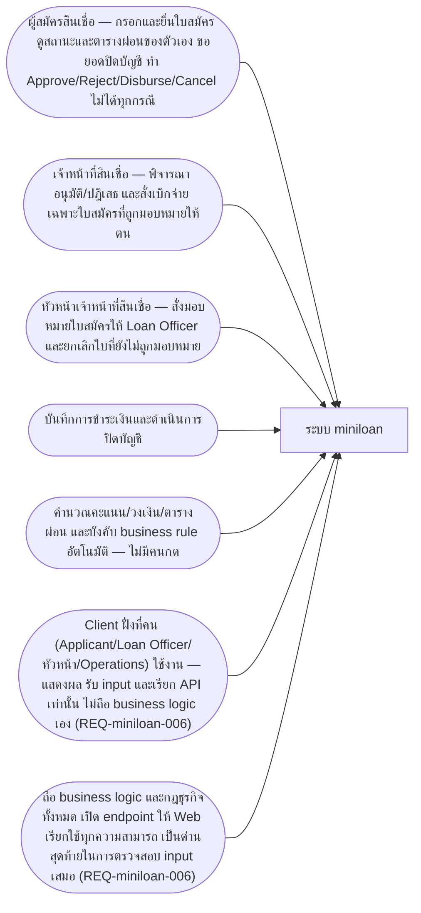
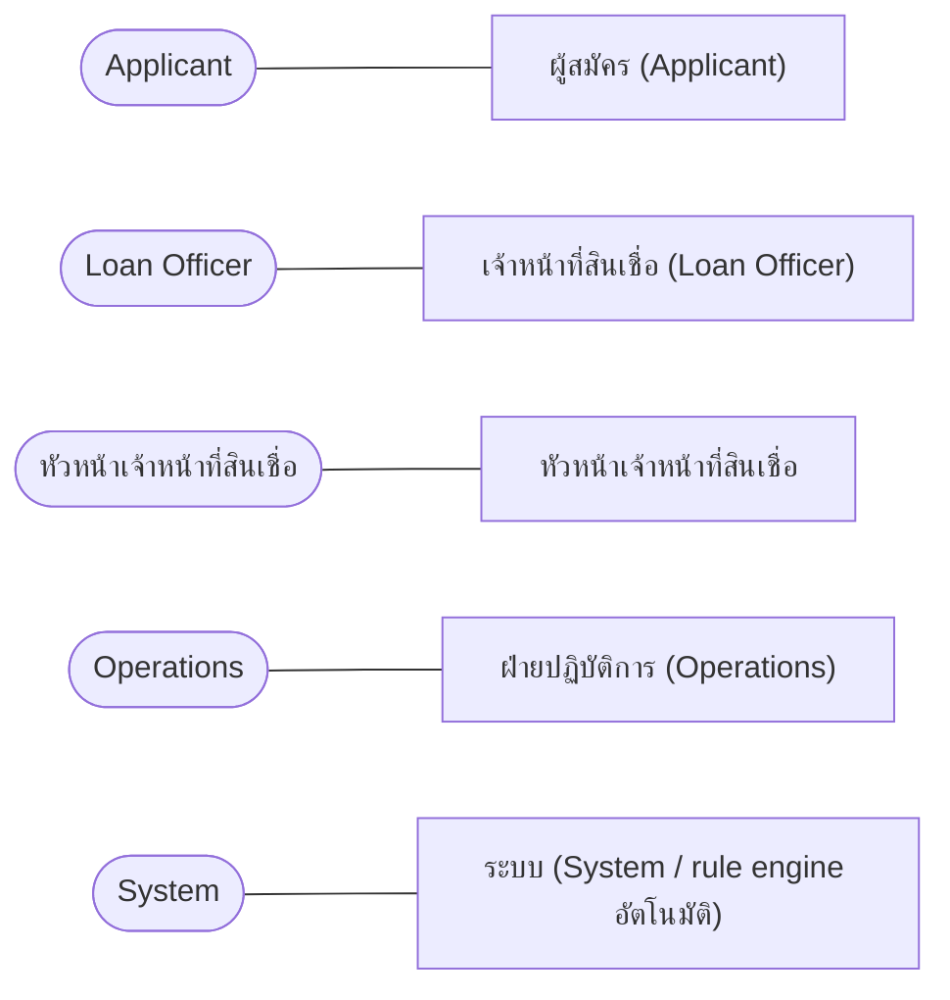
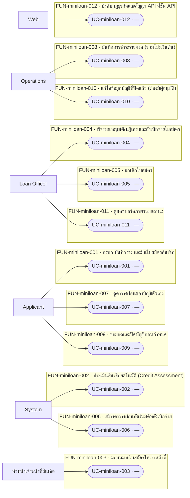
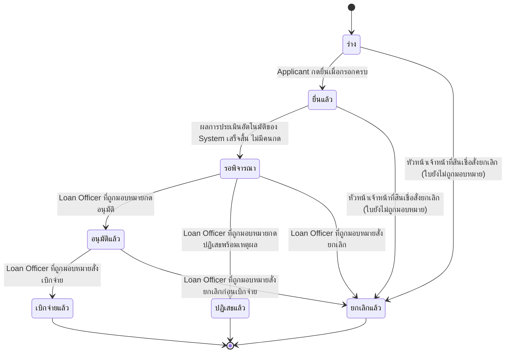
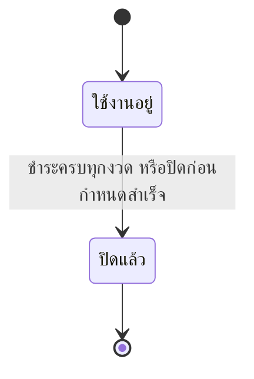
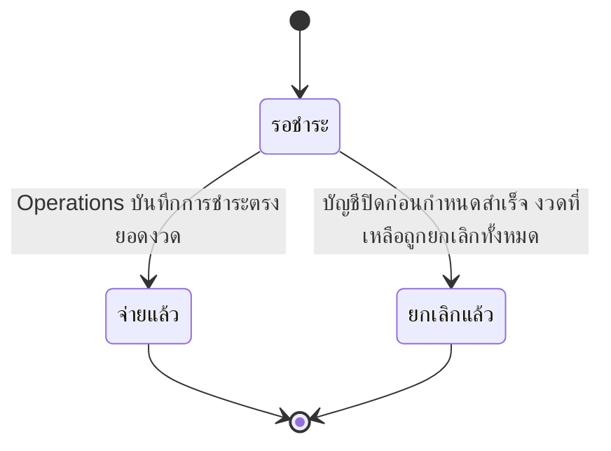
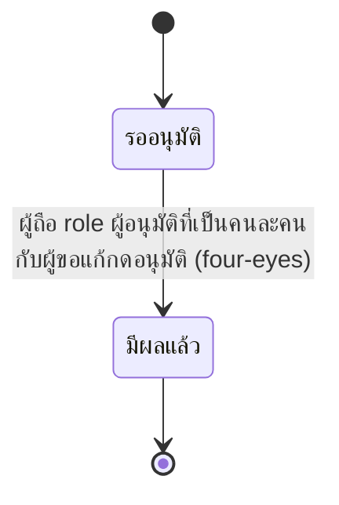
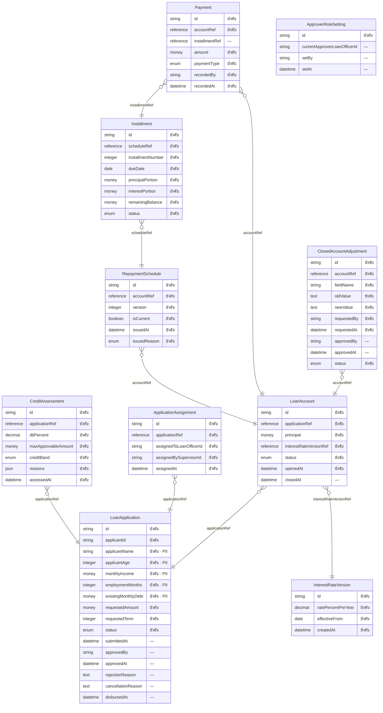
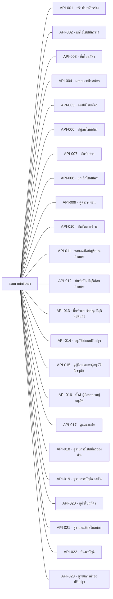
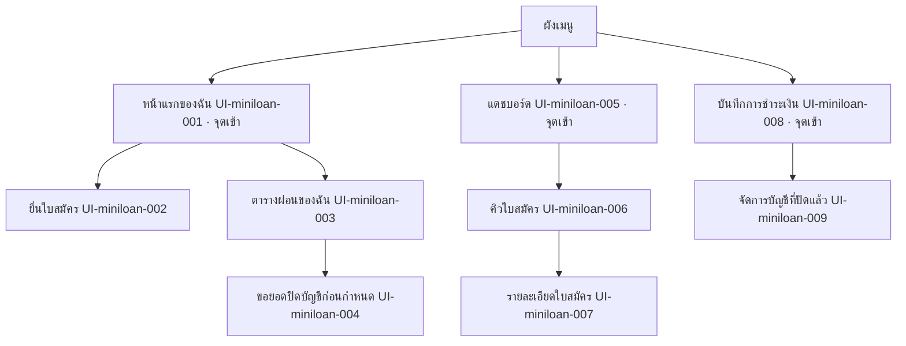

# เอกสารการออกแบบระบบ — miniloan

> เอกสารฉบับนี้ถูก **สร้างจากไฟล์ JSON ทั้งฉบับ** (renderer v1.0) — แก้ไฟล์นี้โดยตรงแล้วจะหายในการ render รอบถัดไป
> แก้ที่ต้นทางเสมอ: รายการและตารางแก้ผ่านคำสั่งของ `design` · ร้อยแก้วแก้ที่ไฟล์ Markdown ต้นทางที่ระบุไว้ท้ายแต่ละหัวข้อ

## ปกและตารางแก้ไข

**เอกสารฉบับนี้ไม่มีเลขเวอร์ชันของตัวเอง** — ไม่มีไฟล์ไหนในเฟสนี้เก็บเลขเวอร์ชันของเอกสารไว้
สิ่งที่ใช้แทนคือตารางการเปลี่ยนแปลงข้างล่าง ซึ่งอ่านจากใบเปลี่ยนแปลงจริง และตารางสถานะการอนุมัติรายไฟล์

### ตารางแก้ไข (Revision History)

| รหัส | ที่มา | เมื่อ | เหตุผล | ผู้เกี่ยวข้อง / สถานะ |
|---|---|---|---|---|
| CHG-miniloan-001 | req | 2026-08-15T11:06+07:00 | หัวหน้าเจ้าหน้าที่สินเชื่อถูกตัดสินแล้วว่าเป็น actor แยก ไม่ใช่ Loan Officer คนหนึ่ง (คำตอบ Q-miniloan-012) · ประโยคเดิมที่ว่า "ยกเลิกได้เฉพาะ Loan Officer เท่านั้น" จึงแคบเกินความจริง และทำให้เส้นยกเลิกใบสถานะ Draft กับ Submitted ที่ BR-miniloan-010@v1 เปิดไว้ ไม่มีใครเดินได้ | เจ้าของสเปก (ตอบในแชท รอบ /req:ask ตอบการ์ดแดง Q-miniloan-012) → เจ้าของสเปก |
| CHG-miniloan-002 | req | 2026-08-21T00:00+07:00 | ประโยค "กลไกการเก็บค่าธรรมเนียมยังไม่ตัดสิน (ดู Q-miniloan-013)" ในข้อความของ BR-miniloan-046@v1 ตกยุคตั้งแต่ Q-miniloan-013 ตอบแล้ว (2026-08-15) — คำตอบคลอด BR-miniloan-050@v1 และ BR-miniloan-051@v1 แยกออกไปแทนที่จะแก้ทับ BR-miniloan-046@v1 เพราะตอนนั้นมีตัวอย่างพิสูจน์อยู่แล้ว (EX-miniloan-087/088/089) · เมื่อ EX-miniloan-087/088 ถูกแก้ในรอบ /req:example ล่าสุดให้ตรงกับกลไกที่ตัดสินแล้ว ตัวอย่างที่พิสูจน์กฎข้อนี้จึงขัดกับข้อความของกฎเอง (กฎบอกว่ายังไม่ตัดสิน ตัวอย่างยืนยันกลไกที่ตัดสินแล้ว) · เป็นการขึ้นเวอร์ชันเพื่อให้ข้อความตรงกับคำตอบที่มีอยู่แล้ว ไม่ใช่การตัดสินใจใหม่ | เจ้าของสเปก (คำตอบเดิมอยู่ใน SRC-013 · Q-miniloan-013 ตอบแล้วตั้งแต่ 2026-08-15 แต่ข้อความ BR-miniloan-046@v1 ไม่เคยถูกแก้ตาม เพราะมีตัวอย่างพิสูจน์อยู่แล้ว — ช่องว่างนี้ถูกจับได้ตอนแก้ EX-miniloan-087/088 ด้วย /req:example) → เจ้าของสเปก |
| CHG-miniloan-003 | req | 2026-08-21T15:00+07:00 | Q-miniloan-015 ถูกตอบแล้ว: กรณีที่ส่วนเกินหลังหักค่าธรรมเนียมการโปะ 1% แล้วมากกว่าเงินต้นคงเหลือ ให้ปฏิเสธการบันทึกทั้งรายการ เช่นเดียวกับ BR-miniloan-052@v1 — ไม่ตัดเท่าที่เหลือแล้วทอนคืนส่วนล้น และไม่ถือเป็นการปิดบัญชีก่อนกำหนด · ประโยค "ยังไม่ตัดสิน (ดู Q-miniloan-015)" ที่ค้างอยู่ในข้อความของ BR-miniloan-050@v1 จึงตกยุคและต้องถูกแทนที่ด้วยผลการตัดสิน | เจ้าของสเปก (ตอบสด ๆ ในรอบ /req:change BR-miniloan-050 นี้ ไม่มีเอกสารรองรับ — Q-miniloan-015 เดิมเป็นการ์ดแดง raised_by BR-miniloan-050@v1 เอง ไม่ได้มาจากคำถามที่เคยส่งลูกค้า) → เจ้าของสเปก |
| CHG-miniloan-004 | req | 2026-08-21T15:30+07:00 | Q-miniloan-015 ข้อ (2) สั่งให้ขยายเงื่อนไขของ BR-miniloan-052@v1 จาก "ส่วนเกินมากกว่ายอดปิดบัญชี" ให้ครอบ "ส่วนเกินหลังหักค่าธรรมเนียมการโปะมากกว่าเงินต้นคงเหลือ" ด้วย — BR-miniloan-050@v2 (CHG-miniloan-003) อ้างถึงกฎข้อนี้ไปแล้วในฐานะปลายทางของการปฏิเสธ แต่เงื่อนไขเดิมยังไม่ครอบกรณีนั้นจริง ผลลัพธ์เหมือนกันทั้งสองทริกเกอร์จึงรวมเป็นเงื่อนไข OR เดียว ไม่แยกเป็นกฎคนละข้อ | เจ้าของสเปก (ยืนยันข้อความใหม่สด ๆ ในรอบ /req:change BR-miniloan-052 นี้ — ทำตามที่ CHG-miniloan-003 รายงานไว้ว่าเป็นขั้นถัดไปที่ต้องอนุมัติแยก) → เจ้าของสเปก |
| CHG-miniloan-005 | req | 2026-08-21T16:00+07:00 | Q-miniloan-016 ท่อน (3) เผยว่า CALC-miniloan-001@v1 (เก็บค่าเต็มความละเอียดภายใน ปัดเฉพาะตอนแสดง) ขัดกับ BR-miniloan-035@v1 (ตอบไปแล้วว่าต้องปัดทุกจุดทันทีที่เกิด ไม่เก็บค่าเต็มไว้) — สัญญาเขียนก่อนกฎข้อนั้นจะเกิดจึงไม่เคยรู้จักกัน เจ้าของสเปกเลือกย้ายสัญญาให้ตรงกับกฎที่ตอบแล้ว แทนที่จะแก้กฎให้ยกเว้นสัญญานี้ | เจ้าของสเปก (ตอบผ่าน AskUserQuestion ที่ routed มาจากการตรวจ Q-miniloan-016 ในรอบ /req:check — เลือกย้าย CALC ให้ตรงกับ BR-miniloan-035@v1 แทนที่จะแก้กฎให้ยกเว้นสัญญานี้) → เจ้าของสเปก |
| CHG-miniloan-001 | design · revised | 2026-08-24T09:15+07:00 | หัวหน้าเจ้าหน้าที่สินเชื่อถูกตัดสินแล้วว่าเป็น actor แยก ไม่ใช่ Loan Officer คนหนึ่ง (คำตอบ Q-miniloan-012) · ประโยคเดิมที่ว่า "ยกเลิกได้เฉพาะ Loan Officer เท่านั้น" จึงแคบเกินความจริง และทำให้เส้นยกเลิกใบสถานะ Draft กับ Submitted ที่ BR-miniloan-010@v1 เปิดไว้ ไม่มีใครเดินได้ | รับเข้าแล้ว 2026-08-24T02:09:42Z |
| CHG-miniloan-002 | design · revised | 2026-08-24T09:15+07:00 | ประโยค "กลไกการเก็บค่าธรรมเนียมยังไม่ตัดสิน (ดู Q-miniloan-013)" ในข้อความของ BR-miniloan-046@v1 ตกยุคตั้งแต่ Q-miniloan-013 ตอบแล้ว (2026-08-15) — คำตอบคลอด BR-miniloan-050@v1 และ BR-miniloan-051@v1 แยกออกไปแทนที่จะแก้ทับ BR-miniloan-046@v1 เพราะตอนนั้นมีตัวอย่างพิสูจน์อยู่แล้ว (EX-miniloan-087/088/089) · เมื่อ EX-miniloan-087/088 ถูกแก้ในรอบ /req:example ล่าสุดให้ตรงกับกลไกที่ตัดสินแล้ว ตัวอย่างที่พิสูจน์กฎข้อนี้จึงขัดกับข้อความของกฎเอง (กฎบอกว่ายังไม่ตัดสิน ตัวอย่างยืนยันกลไกที่ตัดสินแล้ว) · เป็นการขึ้นเวอร์ชันเพื่อให้ข้อความตรงกับคำตอบที่มีอยู่แล้ว ไม่ใช่การตัดสินใจใหม่ | รับเข้าแล้ว 2026-08-24T02:09:42Z |
| CHG-miniloan-003 | design · revised | 2026-08-24T09:15+07:00 | Q-miniloan-015 ถูกตอบแล้ว: กรณีที่ส่วนเกินหลังหักค่าธรรมเนียมการโปะ 1% แล้วมากกว่าเงินต้นคงเหลือ ให้ปฏิเสธการบันทึกทั้งรายการ เช่นเดียวกับ BR-miniloan-052@v1 — ไม่ตัดเท่าที่เหลือแล้วทอนคืนส่วนล้น และไม่ถือเป็นการปิดบัญชีก่อนกำหนด · ประโยค "ยังไม่ตัดสิน (ดู Q-miniloan-015)" ที่ค้างอยู่ในข้อความของ BR-miniloan-050@v1 จึงตกยุคและต้องถูกแทนที่ด้วยผลการตัดสิน | รับเข้าแล้ว 2026-08-24T02:09:42Z |
| CHG-miniloan-004 | design · revised | 2026-08-24T09:15+07:00 | Q-miniloan-015 ข้อ (2) สั่งให้ขยายเงื่อนไขของ BR-miniloan-052@v1 จาก "ส่วนเกินมากกว่ายอดปิดบัญชี" ให้ครอบ "ส่วนเกินหลังหักค่าธรรมเนียมการโปะมากกว่าเงินต้นคงเหลือ" ด้วย — BR-miniloan-050@v2 (CHG-miniloan-003) อ้างถึงกฎข้อนี้ไปแล้วในฐานะปลายทางของการปฏิเสธ แต่เงื่อนไขเดิมยังไม่ครอบกรณีนั้นจริง ผลลัพธ์เหมือนกันทั้งสองทริกเกอร์จึงรวมเป็นเงื่อนไข OR เดียว ไม่แยกเป็นกฎคนละข้อ | รับเข้าแล้ว 2026-08-24T02:09:42Z |
| CHG-miniloan-005 | design · revised | 2026-08-24T09:15+07:00 | Q-miniloan-016 ท่อน (3) เผยว่า CALC-miniloan-001@v1 (เก็บค่าเต็มความละเอียดภายใน ปัดเฉพาะตอนแสดง) ขัดกับ BR-miniloan-035@v1 (ตอบไปแล้วว่าต้องปัดทุกจุดทันทีที่เกิด ไม่เก็บค่าเต็มไว้) — สัญญาเขียนก่อนกฎข้อนั้นจะเกิดจึงไม่เคยรู้จักกัน เจ้าของสเปกเลือกย้ายสัญญาให้ตรงกับกฎที่ตอบแล้ว แทนที่จะแก้กฎให้ยกเว้นสัญญานี้ | รับเข้าแล้ว 2026-08-24T02:09:42Z |

### สถานะการอนุมัติรายไฟล์

| ไฟล์ | คำสั่งที่เขียน | สถานะขั้น | สถานะเอกสาร | ผู้อนุมัติ | เมื่อ | หมายเหตุ |
|---|---|---|---|---|---|---|
| design.state.json | /design:init | done | — | — | — | — |
| context.json | /design:overview | done | draft | — | — | — |
| modules/miniloan/functions.json | /design:function | done | draft | — | — | — |
| trace.design.json | /design:function | done | — | — | — | — |
| datamodel.json | /design:datamodel | done | draft | — | — | — |
| modules/miniloan/statemachines.json | /design:datamodel | done | draft | — | — | — |
| modules/miniloan/scenarios.json | /design:scenario | done | draft | — | — | — |
| rbac.json | /design:rbac | done | draft | — | — | — |
| nfr.json | /design:nfr | done | draft | — | — | — |
| sitemap.json | /design:sitemap | done | draft | — | — | — |
| modules/miniloan/screens.json | /design:sitemap | done | draft | — | — | — |
| interfaces.json | /design:interface | done | draft | — | — | — |

> ℹ️ **ข้อจำกัดของข้อมูลชุดนี้** — "สถานะขั้น" มาจากไฟล์สถานะ ส่วน "สถานะเอกสาร" มาจากตัวไฟล์เอง — ขั้นที่ค้างจะเห็นได้ที่คอลัมน์แรกเท่านั้น เพราะเครื่องหมายค้างถูกเก็บที่ขั้น ไม่ใช่ในเนื้อหาที่อนุมัติไปแล้ว

> ℹ️ **ข้อจำกัดของข้อมูลชุดนี้** — ตารางนี้ไม่มีแถวของขั้น `export` เอง เพราะ artifact ของขั้นนั้นคือเอกสารฉบับนี้ — เอกสารที่รายงานสถานะการส่งมอบของตัวเอง จะไม่ตรงกับความจริงทันทีที่มีคนบันทึกว่าส่งแล้ว

## 1 บทนำ

## ที่มาและเหตุผลที่ต้องมีระบบนี้

MiniLoan คือระบบสินเชื่อส่วนบุคคลแบบผ่อนชำระ (installment loan) ครอบคลุมตั้งแต่ผู้สมัครกรอกและยื่นใบสมัคร
ระบบประเมินความเสี่ยงอัตโนมัติเพื่อจัดกลุ่มความน่าเชื่อถือ (Credit Band) เจ้าหน้าที่พิจารณาอนุมัติหรือปฏิเสธ
สั่งเบิกจ่ายเพื่อเปิดบัญชีสินเชื่อพร้อมตารางผ่อนแบบลดต้นลดดอกที่ถูกต้องตั้งแต่วันแรก ไปจนถึงการบันทึกรับชำระ
รายงวดและปิดบัญชี ทั้งแบบชำระครบกำหนดตามปกติและแบบขอปิดบัญชีก่อนกำหนด

เอกสารฉบับนี้เป็นสเปกการออกแบบ (Design Specification) เฟส 2 ของโครงการ ต่อยอดจากข้อกำหนดที่เก็บและยืนยันไว้แล้ว
ในเฟส 1 (Requirement) — ลูกค้าลงนามรับรอง CP1 ของเฟส 1 แล้วเมื่อวันที่ 2026-08-24 โดย mounc

## เป้าหมายของระบบ

1. **คัดกรองอัตโนมัติ** — ผู้สมัครที่ไม่ผ่านเกณฑ์คุณสมบัติหรือความสามารถในการชำระถูกคัดออกโดยอัตโนมัติ พร้อมเหตุผล
   ที่เจ้าหน้าที่ตรวจสอบได้ก่อนตัดสินใจ
2. **จุดตัดสินใจที่ตรวจสอบย้อนหลังได้** — การอนุมัติทุกครั้งมีคนรับผิดชอบชัดเจน กันไม่ให้สัญญาสินเชื่อเริ่มขึ้นโดย
   ไม่มีใครอนุมัติ
3. **ตัวเลขที่ทุกฝ่ายอ้างอิงตรงกัน** — ตารางผ่อนคำนวณจากสูตรเดียว ปัดเศษด้วยวิธีเดียวกันทุกจุด ไม่มีบัญชีคู่ขนาน
4. **ยอดคงเหลือตรงความจริงตลอดเวลา** — แม้การชำระเงินจะเกิดขึ้นนอกระบบ (ไม่เชื่อมต่อ payment gateway จริง
   ในรอบนี้) ระบบก็ยังเป็นบันทึกกลางที่ถูกต้องของภาระหนี้คงเหลือ

## ขอบเขตของเอกสารนี้

เอกสารนี้ครอบคลุมการออกแบบทั้งหมดของโมดูล `miniloan`: ฟังก์ชันและ use case (หัวข้อ 4) โมเดลข้อมูลและวงจร
สถานะ (หัวข้อ 5) สถานการณ์ทดสอบ (หัวข้อ 6) ตารางสิทธิ์การเข้าถึง (หัวข้อ 7) ความต้องการที่ไม่ใช่เชิงฟังก์ชัน
(หัวข้อ 8) รายการหน้าจอ (หัวข้อ 9) และระบบภายนอก/API (หัวข้อ 11) — ทุกรายการสาวย้อนกลับไปหาข้อกำหนด (REQ-)
ที่มาจากเฟส 1 ได้ทั้งหมด

**สิ่งที่ไม่อยู่ในเอกสารนี้**: หน้าตา สี ฟอนต์ หรือ layout ของหน้าจอ (เป็นงานของปลั๊กอิน mockup ซึ่งยังไม่มีในตลาดนี้)
และการเชื่อมต่อระบบภายนอกจริง (Credit Bureau, payment gateway, eKYC/OTP, ระบบยืนยันตัวตนจริง) ซึ่งถูกกันไว้
นอกขอบเขตของรอบนี้ตามที่ตกลงไว้ในหัวข้อขอบเขต (§2 ของหัวข้อ 2)

> **หมายเหตุ**: MiniLoan เป็นโปรเจกต์ตัวอย่างเพื่อการเรียน ตัวเลขกฎธุรกิจทั้งหมด (อัตราดอกเบี้ย เพดานวงเงิน
> ค่าธรรมเนียม) เป็นค่าสมมติ ไม่ใช่ policy จริงของบริษัทใด

### 1.1 ขอบเขตที่อยู่ในงาน

| รหัส | รายการ | ที่มา |
|---|---|---|
| origination | รับและประเมินใบสมัครสินเชื่อส่วนบุคคล ตั้งแต่ร่างจนยื่น — ระบบประเมินอัตโนมัติตามกฎที่กำหนดเพื่อจัด Credit Band พร้อมเหตุผล | REQ-miniloan-001 |
| approval-disbursement | เจ้าหน้าที่พิจารณาอนุมัติหรือปฏิเสธใบสมัครแบบ 1 ระดับ แล้วสั่งเบิกจ่ายเพื่อเปิดบัญชีสินเชื่อ | REQ-miniloan-002 |
| servicing-setup | สร้างบัญชีสินเชื่อและตารางผ่อนแบบลดต้นลดดอกทันทีที่เบิกจ่ายสำเร็จ ให้เจ้าของบัญชีเปิดดูตารางของตัวเองได้ | REQ-miniloan-003 |
| servicing-operation | บันทึกการชำระรายงวดที่เกิดขึ้นแล้วนอกระบบเข้าบัญชีสินเชื่อ คิดยอดปิดบัญชีก่อนกำหนด และปิดบัญชีได้ทั้งแบบชำระครบทุกงวดและแบบปิดก่อนกำหนด | REQ-miniloan-004 |
| dashboard | แดชบอร์ดภาพรวมจำนวนใบสมัครและบัญชีแยกตามสถานะในหน้าเดียว สำหรับ Loan Officer จัดลำดับงาน | REQ-miniloan-005 |
| web-api-separation | แยก deploy เป็น Backend API (ถือ business logic และกฎธุรกิจทั้งหมด) กับ Web (client ที่เรียกใช้ API เท่านั้น ไม่ถือกฎเอง) | REQ-miniloan-006 |

### 1.2 ขอบเขตที่ไม่อยู่ในงาน

| รหัส | รายการ | ที่มา |
|---|---|---|
| real-credit-bureau-ekyc-otp | เชื่อมต่อ Credit Bureau / eKYC / OTP จริง — ข้อมูลภาระหนี้เดิมของผู้สมัครกรอกด้วยมือ ไม่ดึงจากแหล่งข้อมูลจริง | REQ-miniloan-001 |
| real-payment-gateway | Payment gateway จริงและการตัดบัญชีอัตโนมัติ — การชำระเงินบันทึกด้วยมือ (mock payment) โดย Operations | REQ-miniloan-004 |
| debt-collection | การติดตามหนี้ (collection) และการปรับโครงสร้างหนี้ รวมถึงสถานะค้างชำระ — งวดที่เลยกำหนดชำระไม่มีสถานะและไม่มีกฎรองรับในรอบนี้ เป็นการตัดออกโดยตั้งใจ | REQ-miniloan-004 |
| other-loan-products | บัตรเครดิต, สินเชื่อเช่าซื้อ, วงเงินหมุนเวียน — เฉพาะสินเชื่อส่วนบุคคลแบบผ่อนชำระเท่ากันทุกงวดเท่านั้น | REQ-miniloan-001 |
| multi-currency | หลายสกุลเงิน — ใช้ THB อย่างเดียวทั้งระบบ | REQ-miniloan-003 |
| real-authentication | ระบบยืนยันตัวตน (authentication) จริง — ไม่มีการพิสูจน์ตัวตนจริงในรอบนี้ ใช้ user จำลองแทน | REQ-miniloan-006 |

### 1.3 เอกสารอ้างอิง

| เอกสาร | ที่อยู่ |
|---|---|
| ความต้องการที่ `req` เก็บไว้ | .aeon/req/requirements.json |
| อภิธานศัพท์ | .aeon/req/glossary.json |
| ผู้มีส่วนได้ส่วนเสีย | .aeon/req/stakeholders.json |

### 1.4 อภิธานศัพท์

| รหัส | คำไทย | คำอังกฤษ | ความหมาย | อย่าสับสนกับ | สถานะ |
|---|---|---|---|---|---|
| UL-miniloan-001 | ใบสมัครสินเชื่อ | LoanApplication | ใบสมัครสินเชื่อ ตั้งแต่ร่างจนถึงเบิกจ่าย เป็น Aggregate ฝั่ง Origination · 1 ผู้สมัครมีได้หลายใบสมัคร | UL-miniloan-004 | draft |
| UL-miniloan-002 | ข้อมูลผู้สมัคร | ApplicantProfile | ข้อมูลผู้สมัคร: อายุ รายได้ อายุงาน ภาระหนี้ปัจจุบัน | — | draft |
| UL-miniloan-003 | ผลการประเมินสินเชื่อ | CreditAssessment | ผลการประเมินจาก rule engine ประกอบด้วยคะแนน เหตุผล และวงเงินที่อนุมัติได้ | — | draft |
| UL-miniloan-004 | บัญชีสินเชื่อ | LoanAccount | บัญชีสินเชื่อหลังเบิกจ่าย เป็น Aggregate ฝั่ง Servicing · 1 ใบสมัครที่ Disbursed สร้าง 1 บัญชี | UL-miniloan-001 | draft |
| UL-miniloan-005 | ตารางผ่อน | RepaymentSchedule | ตารางผ่อนรายงวดของบัญชีสินเชื่อหนึ่งบัญชี แต่ละแถวแยกเงินต้น ดอกเบี้ย และยอดคงเหลือ | UL-miniloan-006 | draft |
| UL-miniloan-006 | งวดผ่อน | Installment | งวดผ่อน 1 งวดในตารางผ่อน — หนึ่งแถวของ RepaymentSchedule | UL-miniloan-005 · UL-miniloan-012 | draft |
| UL-miniloan-007 | รายการชำระเงิน | Payment | รายการชำระเงินที่บันทึกเข้าบัญชีสินเชื่อ · รอบการเรียนนี้บันทึกด้วยมือ ไม่เชื่อม payment gateway จริง | — | draft |
| UL-miniloan-008 | การปิดบัญชีก่อนกำหนด | EarlySettlement | การปิดบัญชีสินเชื่อก่อนครบกำหนดงวดสุดท้าย โดยชำระยอดปิดบัญชีตาม BR-07 | — | draft |
| UL-miniloan-009 | จำนวนเงิน | Money | จำนวนเงินพร้อมสกุลเงิน เป็น Value Object · ห้ามใช้ทศนิยมลอย (floating point) · รอบการเรียนนี้ใช้ THB อย่างเดียว | — | draft |
| UL-miniloan-010 | วงเงินอนุมัติสูงสุด | MaxApprovableAmount | วงเงินสูงสุดที่ระบบอนุมัติให้ผู้สมัครรายนี้ได้ = 5 เท่าของรายได้ต่อเดือน และไม่เกิน 1,000,000 บาท — คำนวณโดยระบบ ไม่ใช่ตัวเลขที่ผู้สมัครกรอก | UL-miniloan-011 | draft |
| UL-miniloan-011 | จำนวนเงินกู้ที่ขอ | RequestedAmount | จำนวนเงินที่ผู้สมัครกรอกในใบสมัคร ต้องอยู่ในช่วง 10,000 – 1,000,000 บาท — เป็นตัวเลขที่คนกรอก ไม่ใช่ตัวเลขที่ระบบคำนวณ | UL-miniloan-010 | draft |
| UL-miniloan-012 | จำนวนงวด | Term | จำนวนงวดที่ตกลงกันในสัญญา เป็นตัวเลขนับ ต้องอยู่ในช่วง 6 – 60 งวด (รายเดือน) — เป็นค่าที่ผู้สมัครเลือกตอนกรอกใบสมัคร และเป็น n ในสูตร EMI · ไม่ใช่แถวในตารางผ่อน | UL-miniloan-006 | draft |
| UL-miniloan-013 | การมอบหมายใบสมัคร | ApplicationAssignment | การผูกใบสมัครหนึ่งใบเข้ากับ Loan Officer หนึ่งคนเพื่อให้เป็นผู้พิจารณา · เฉพาะคนที่ถูกมอบหมายเท่านั้นที่กดอนุมัติหรือปฏิเสธใบสมัครนั้นได้ · แนวคิดนี้ไม่มีในเอกสารต้นทาง เกิดจากการตัดสินของเจ้าของในรอบ /req:ask permission | — | draft |
| UL-miniloan-014 | อัตราดอกเบี้ย | InterestRate | อัตราดอกเบี้ยแบบลดต้นลดดอกที่ใช้คำนวณตารางผ่อน · เป็นข้อมูลหลักที่มีเวอร์ชันและมีวันเริ่มมีผล (effective date) ไม่ใช่ค่าคงที่ในโค้ด — บัญชีสินเชื่อผูกกับเวอร์ชันที่มีผลอยู่ ณ วันเบิกจ่าย และเวอร์ชันที่เคยถูกใช้ห้ามลบ | — | draft |
| UL-miniloan-015 | การปรับปรุงบัญชีหลังปิด | ClosedAccountAdjustment | รายการขอแก้ไขข้อมูลของบัญชีสินเชื่อที่ปิดแล้ว (Closed) ต้องผ่านการอนุมัติจากผู้ถือบทบาทผู้อนุมัติ (UL-miniloan-016) ก่อนจึงมีผล ไม่ใช่การแก้ทับทันที · เก็บเป็นรายการปรับปรุงแยกจากตัวบัญชี ค่าเดิมของบัญชีคงไว้ไม่ถูกทับ และรายการเก็บค่าเดิม ค่าใหม่ ผู้ขอแก้ ผู้อนุมัติ และเวลาอนุมัติ | UL-miniloan-008 | draft |
| UL-miniloan-016 | บทบาทผู้อนุมัติ | ApproverRole | role ที่ระบบกำหนดให้มีสิทธิ์อนุมัติการปรับปรุงบัญชีสินเชื่อที่ปิดแล้ว — เป็นค่าที่ตั้งไว้ในระบบและเปลี่ยนได้ภายหลัง ไม่ผูกตายกับ actor ใด actor หนึ่งในโค้ด · ถ้ายังไม่ตั้ง ฟีเจอร์ปรับปรุงบัญชีที่ปิดแล้วใช้ไม่ได้ (ไม่มีค่าเริ่มต้น) · ใครตั้งค่าได้ และต้องต่างจากผู้ขอแก้หรือไม่ ยังไม่ตัดสิน — ดู Q-miniloan-009 | UL-miniloan-013 · UL-miniloan-026 | draft |
| UL-miniloan-017 | ตารางผ่อนฉบับที่ออกใหม่ | RepaymentScheduleRevision | ตารางผ่อนฉบับใหม่ที่ออกทับฉบับเดิมของบัญชีสินเชื่อเดียวกัน เมื่อจำเป็นต้องเปลี่ยนตารางผ่อนที่ออกให้ผู้กู้ไปแล้ว — ออกทับทั้งฉบับ ไม่ใช่แก้บางแถวของฉบับเดิม · ฉบับเดิมยังเก็บไว้ดูย้อนหลังได้และห้ามลบ แนวเดียวกับเวอร์ชันของอัตราดอกเบี้ยใน BR-miniloan-037@v1 | UL-miniloan-005 | draft |
| UL-miniloan-018 | การโปะเงินต้น | PartialPrepayment | การชำระเกินยอดงวด โดยส่วนที่เกินถูกนำไปตัดเงินต้นของบัญชีสินเชื่อที่ยังเป็น Active — บัญชีไม่ปิด ยังผ่อนต่อ แต่เงินต้นลดลงจึงต้องออกตารางผ่อนฉบับใหม่ทับตาม BR-miniloan-044@v1 · ส่วนเกินไปลดจำนวนงวดโดยค่างวดคงเดิม (Q-miniloan-010) · มีค่าธรรมเนียม 1% ของยอดส่วนที่เกิน หักออกจากส่วนเกินก่อนนำไปตัดเงินต้น (Q-miniloan-013 → BR-miniloan-050@v1) · ถ้าส่วนเกินมากพอปิดบัญชีได้ในครั้งเดียว ไม่ใช่การโปะแล้ว แต่เป็นการปิดบัญชีก่อนกำหนดตาม BR-miniloan-051@v1 | UL-miniloan-008 | draft |
| UL-miniloan-019 | หัวหน้าเจ้าหน้าที่สินเชื่อ | Supervisor | ผู้ที่มีอำนาจสั่งมอบหมายใบสมัครให้ Loan Officer รายคน — เอกสารต้นทาง §3 ไม่มี actor นี้ (มีแค่ Applicant / Loan Officer / Operations / System) เกิดขึ้นจากคำตอบของ Q-miniloan-005 · ยังไม่ตัดสินว่ามีกี่ระดับ ทำอย่างอื่นได้อีกไหม และเห็นข้อมูลของลูกน้องแค่ไหน — ส่วนขอบเขตข้อมูลค้างอยู่ที่ DQ-miniloan-002 | UL-miniloan-013 | draft |
| UL-miniloan-020 | การยกเลิกใบสมัคร | ApplicationCancellation | การจบใบสมัครก่อนถึงการเบิกจ่าย โดยใบนั้นไปอยู่สถานะสุดท้าย Cancelled — ทำได้ตั้งแต่ Draft ถึง Approved เท่านั้น ใบที่ Disbursed แล้วยกเลิกไม่ได้ · **สั่งได้เฉพาะเจ้าหน้าที่ (Loan Officer) และต้องระบุเหตุผลเสมอ** — Applicant ยกเลิกใบของตัวเองไม่ได้ ต้องแจ้งเจ้าหน้าที่ · เป็นวิธีแก้เดียวเมื่อใบสมัครเดินสถานะผิด เพราะ BR-miniloan-010@v1 ไม่มีเส้นถอยกลับ · ใครยกเลิกใบที่ยังไม่ถูกมอบหมายได้ ยังไม่ตัดสิน — ดู Q-miniloan-012 | UL-miniloan-008 | draft |
| UL-miniloan-021 | ค่าธรรมเนียมการโปะ | PrepaymentFee | ค่าธรรมเนียม 1% ของยอดส่วนที่เกิน ซึ่งเกิดขึ้นเมื่อผู้กู้โปะเงินต้นของบัญชีที่ยังเป็น Active — หักออกจากยอดส่วนเกินก่อนนำไปตัดเงินต้น ไม่ใช่รายการเรียกเก็บแยก (BR-miniloan-050@v1) · ต่างจากค่าธรรมเนียมปิดก่อนกำหนดซึ่งคิด 1% ของเงินต้นคงเหลือและใช้เมื่อบัญชีปิด (BR-miniloan-022@v1) · ที่ขอบซึ่งส่วนเกินพอปิดบัญชีได้พอดี ให้ใช้ฐานปิดก่อนกำหนดเสมอตาม BR-miniloan-051@v1 | UL-miniloan-008 | draft |
| UL-miniloan-022 | เงินต้นคงเหลือ | OutstandingPrincipal | เงินต้นที่ยังไม่ได้ชำระของบัญชีสินเชื่อ ณ เวลาหนึ่ง — เป็นฐานของดอกเบี้ยรายงวด (ดอกเบี้ยงวด = เงินต้นคงเหลือ × อัตราต่อเดือน ตาม BR-miniloan-016@v1) · เป็นฐานของยอดปิดบัญชีก่อนกำหนดและค่าธรรมเนียม 1% ตาม BR-miniloan-022@v1 · เป็นคอลัมน์สุดท้ายของตารางผ่อน ซึ่งต้องเป็น 0 พอดีหลังงวดสุดท้าย · **"ยอดคงเหลือ" ที่พบในเอกสารต้นทางและในกฎหลายข้อคือคำเดียวกันกับคำนี้** ไม่ใช่ยอดที่ต้องจ่ายทั้งหมดที่เหลือ (ซึ่งจะรวมดอกเบี้ยในอนาคต) — ยืนยันแล้วในรอบ QB-lang-01 · คำหลักเลือก "เงินต้นคงเหลือ" เพราะเป็นคำที่ไม่กำกวม · **แหล่งอ้างอิงเดียวของค่านี้คือคอลัมน์ยอดคงเหลือของตารางผ่อนฉบับล่าสุด** ไม่ใช่การคำนวณขึ้นใหม่จากสูตร — ตัดสินในรอบตอบการ์ดแดง Q-miniloan-016 และเขียนเป็น BR-miniloan-053@v1 | UL-miniloan-008 | draft |
| UL-miniloan-023 | ยอดที่อนุมัติจริง | ApprovedAmount | จำนวนเงินที่ Loan Officer อนุมัติจริงให้ใบสมัครหนึ่งใบ — อาจต่ำกว่าจำนวนเงินกู้ที่ขอ (UL-miniloan-011) เมื่อยอดที่ขอเกินวงเงินอนุมัติสูงสุด (UL-miniloan-010) และเจ้าหน้าที่ปรับลงตาม BR-miniloan-012@v1 · เป็นตัวเลขที่กลายเป็นเงินต้นตั้งต้น (P) ของตารางผ่อนตอนเบิกจ่าย · **ไม่ใช่ตัวเดียวกับจำนวนเงินกู้ที่ขอ** — DTI ที่บันทึกไว้ตอนยื่นผูกกับยอดที่ขอและไม่คำนวณใหม่แม้เจ้าหน้าที่จะปรับวงเงินลง (Q-miniloan-002) ถ้าใช้คำเดียวกัน ตัวเลขที่ DTI อ้างถึงจะหายไป · **กฎที่ระบุว่า P ของ BR-miniloan-016@v1 มาจากยอดนี้ยังไม่ถูกเขียนเป็น BR** เพราะรอบที่คลอดคำนี้เป็นรอบชั้น 1 ซึ่งเขียน rules[] ไม่ได้ — เส้นทางที่เหลือคือ /req:calc BR-miniloan-016@v1 ซึ่งต้องระบุ input ของสูตรอยู่แล้ว | UL-miniloan-011 · UL-miniloan-010 · UL-miniloan-022 | draft |
| UL-miniloan-024 | ผู้สมัคร | Applicant | คนที่ยื่นขอสินเชื่อ และเป็นคนเดียวกับคนที่ถือบัญชีสินเชื่อหลังเบิกจ่าย — **หนึ่งคน หนึ่งคำ** ไม่แยกเป็นคนละแนวคิดตามช่วงเวลา · คำว่า "ผู้กู้" และ "ลูกค้า" ที่ปรากฏใน spec เป็นคำเรียกอย่างอื่นของคนคนเดียวกัน ไม่ใช่ actor คนละตัว — ทั้งสองคำไม่มีในเอกสารต้นทางเลย เกิดขึ้นระหว่างการเก็บกฎ · เลือก "ผู้สมัคร / Applicant" เป็นคำหลักจากอินพุต (§3 ตาราง actor) — **เป็นการอ่าน ไม่ใช่คำตอบ เจ้าของยังไม่ได้ระบุคำหลัก** | UL-miniloan-002 | draft |
| UL-miniloan-025 | ยอดปิดบัญชี | PayoffAmount | จำนวนเงินทั้งหมดที่ต้องชำระเพื่อปิดบัญชีสินเชื่อก่อนครบกำหนด = เงินต้นคงเหลือ + ดอกเบี้ยค้างจ่ายถึงวันที่ปิด + ค่าธรรมเนียมปิดก่อนกำหนด 1% ของเงินต้นคงเหลือ ตาม BR-miniloan-022@v1 · **เป็นเส้นแบ่งที่ระบบใช้ตัดสินว่าการชำระที่เกินยอดงวดเป็นอะไร** ตาม BR-miniloan-051@v1 — เท่ากันพอดี = ปิดบัญชี · น้อยกว่า = การโปะ · มากกว่า = ปฏิเสธทั้งรายการตาม BR-miniloan-052@v1 · **ไม่ใช่เงินต้นคงเหลือ** ซึ่งเป็นเพียงส่วนหนึ่งของยอดนี้ และไม่ใช่ตัวการปิดบัญชีเอง | UL-miniloan-022 · UL-miniloan-008 | draft |
| UL-miniloan-026 | เจ้าหน้าที่สินเชื่อ | LoanOfficer | เจ้าหน้าที่ที่พิจารณา อนุมัติ/ปฏิเสธใบสมัคร และสั่งเบิกจ่าย เฉพาะใบที่ตนถูกมอบหมาย (BR-miniloan-032@v1) — คนละบทบาทกับหัวหน้าเจ้าหน้าที่สินเชื่อ (UL-miniloan-019, ผู้สั่งมอบหมายและยกเลิกใบที่ยังไม่ถูกมอบหมาย) และคนละบทบาทกับบทบาทผู้อนุมัติการปรับปรุงบัญชีที่ปิดแล้ว (UL-miniloan-016) | UL-miniloan-016 · UL-miniloan-019 | draft |

## 2 ภาพรวมระบบ

## มุมมองผลิตภัณฑ์ (Product Perspective)

MiniLoan แยกเป็น 2 หน่วยที่ deploy อิสระจากกันตามข้อกำหนดสถาปัตยกรรม (REQ-miniloan-006):

- **API** — ถือ business logic และกฎธุรกิจทั้งหมด รวมศูนย์อยู่ในชั้น domain เป็นด่านตรวจสอบสุดท้ายเสมอ
- **Web** — client ที่แสดงผลและรับ input เรียกใช้ API สำหรับทุกการตัดสินใจเชิงธุรกิจ ไม่ถือกฎเอง

ผู้ใช้งานระบบมี 5 กลุ่ม (ดูรายละเอียดสิทธิ์เต็มในหัวข้อ 7): **ผู้สมัคร** (ยื่นใบสมัคร ดูสถานะและตารางผ่อนของตัวเอง)
**เจ้าหน้าที่สินเชื่อ** (พิจารณา อนุมัติ/ปฏิเสธ เบิกจ่าย) **หัวหน้าเจ้าหน้าที่สินเชื่อ** (มอบหมายงาน) **ฝ่ายปฏิบัติการ**
(บันทึกการชำระ ปิดบัญชี) และ **ระบบ** เอง (ประเมินสินเชื่อและสร้างตารางผ่อนอัตโนมัติ)

## กระบวนการทำงานแบบเดิม (As-Is)

> **หมายเหตุความน่าเชื่อถือ**: MiniLoan เป็นระบบที่สร้างขึ้นใหม่ทั้งหมด (greenfield) เอกสารข้อกำหนดต้นทาง
> (SRC-001) ไม่ได้บรรยายกระบวนการเดิมไว้อย่างเป็นทางการ ท่อนนี้จึงเป็น**การอนุมานสภาพทั่วไปของกระบวนการสินเชื่อ
> ที่ยังไม่มีระบบรองรับ** ไม่ใช่ข้อเท็จจริงที่ได้รับการยืนยันจากลูกค้า — ควรให้เจ้าของสเปกตรวจทานและแก้ไขให้ตรงกับ
> ความเป็นจริงก่อนเผยแพร่เอกสารนี้

ก่อนมีระบบ กระบวนการสินเชื่อลักษณะนี้มักดำเนินด้วยมือหรือเครื่องมือทั่วไปที่ไม่ได้ออกแบบมาเฉพาะทาง:

- รับใบสมัครด้วยกระดาษหรือฟอร์มออนไลน์ทั่วไป ไม่มีการตรวจคุณสมบัติหรือคำนวณ DTI อัตโนมัติ
- เจ้าหน้าที่คำนวณวงเงินและประเมินความเสี่ยงด้วยมือหรือสเปรดชีต ซึ่งเสี่ยงต่อความคลาดเคลื่อนและใช้เวลานาน
- ไม่มีบันทึกกลางว่าใครเป็นผู้อนุมัติและเมื่อใด ทำให้ตรวจสอบย้อนหลังยาก
- ตารางผ่อนคำนวณแยกกันในแต่ละเครื่องมือ เสี่ยงต่อการปัดเศษไม่ตรงกันระหว่างสิ่งที่แจ้งลูกค้ากับที่บันทึกจริง
- การมอบหมายงานให้เจ้าหน้าที่แต่ละคนไม่มีระบบติดตาม ทำให้ใบสมัครตกหล่นหรือซ้ำซ้อนได้

## กระบวนการทำงานแบบใหม่ (To-Be)

MiniLoan รวมทุกขั้นตอนไว้ในระบบเดียวที่บังคับกฎธุรกิจอย่างสม่ำเสมอที่ชั้น API/domain (ไม่ใช่แค่หน้าจอ):

1. **รับและประเมินใบสมัคร** (REQ-miniloan-001) — ผู้สมัครกรอก บันทึกร่าง และยื่นผ่าน Web ระบบตรวจคุณสมบัติ
   คำนวณ DTI และวงเงินอนุมัติสูงสุดอัตโนมัติทันทีที่ยื่น พร้อมจัด Credit Band และเหตุผลรายเกณฑ์
2. **มอบหมายและอนุมัติ** (REQ-miniloan-002) — หัวหน้ามอบหมายใบสมัครให้เจ้าหน้าที่หนึ่งคนต่อหนึ่งใบ เจ้าหน้าที่
   ที่ถูกมอบหมายเท่านั้นที่อนุมัติ/ปฏิเสธ/เบิกจ่ายได้ ทุกการตัดสินใจบันทึกผู้กระทำและเวลาไว้เสมอ
3. **สร้างบัญชีและตารางผ่อน** (REQ-miniloan-003) — ทันทีที่เบิกจ่ายสำเร็จ ระบบสร้างตารางผ่อนแบบลดต้นลดดอกจาก
   สูตรเดียว ผูกกับเวอร์ชันอัตราดอกเบี้ย ณ วันเบิกจ่าย ไม่เปลี่ยนแปลงย้อนหลังแม้มีการประกาศอัตราใหม่ภายหลัง
4. **รับชำระและปิดบัญชี** (REQ-miniloan-004) — ฝ่ายปฏิบัติการบันทึกการชำระที่เกิดขึ้นแล้วนอกระบบเข้าบัญชี
   รองรับทั้งชำระตรงงวด ชำระเกิน (โปะเงินต้นอัตโนมัติ) และปิดบัญชีก่อนกำหนดพร้อมคำนวณยอดที่ต้องจ่ายล่วงหน้า
5. **มองเห็นภาพรวม** (REQ-miniloan-005) — แดชบอร์ดเดียวแสดงจำนวนงานค้างแยกตามสถานะ ไม่ต้องไล่เปิดทีละใบ

ผลลัพธ์ที่ต่างจากเดิมอย่างชัดเจน: ตัวเลขทุกจุดมาจากสูตรและแหล่งข้อมูลเดียว การตัดสินใจทุกครั้งมีผู้รับผิดชอบ
ตรวจสอบย้อนหลังได้ และกฎธุรกิจถูกบังคับที่ API เสมอไม่ว่าจะเรียกผ่านหน้าจอหรือเรียกตรง (REQ-miniloan-006)

### 2.1 ผังบริบทของระบบ (DFD ระดับ 0)

> ℹ️ **ข้อจำกัดของข้อมูลชุดนี้** — `context.json` ยังไม่มีระบบภายนอกสักรายการ ผังนี้จึงมีแต่ผู้ใช้ — ระบบภายนอกที่บันทึกไว้จริงอยู่ในหัวข้อ 6 และเป็นคนละช่องข้อมูล

### 2.2 ผู้ใช้ระบบ

| รหัส | ผู้ใช้ | ผู้มีส่วนได้ส่วนเสียที่ `req` บันทึก |
|---|---|---|
| applicant | ผู้สมัครสินเชื่อ — กรอกและยื่นใบสมัคร ดูสถานะและตารางผ่อนของตัวเอง ขอยอดปิดบัญชี ทำ Approve/Reject/Disburse/Cancel ไม่ได้ทุกกรณี | STK-miniloan-001 |
| loan-officer | เจ้าหน้าที่สินเชื่อ — พิจารณา อนุมัติ/ปฏิเสธ และสั่งเบิกจ่าย เฉพาะใบสมัครที่ถูกมอบหมายให้ตน | STK-miniloan-002 |
| supervisor | หัวหน้าเจ้าหน้าที่สินเชื่อ — สั่งมอบหมายใบสมัครให้ Loan Officer และยกเลิกใบที่ยังไม่ถูกมอบหมาย | STK-miniloan-003 |
| operations | บันทึกการชำระเงินและดำเนินการปิดบัญชี | STK-miniloan-004 |
| system | คำนวณคะแนน/วงเงิน/ตารางผ่อน และบังคับ business rule อัตโนมัติ — ไม่มีคนกด | STK-miniloan-005 |
| web | Client ฝั่งที่คน (Applicant/Loan Officer/หัวหน้า/Operations) ใช้งาน — แสดงผล รับ input และเรียก API เท่านั้น ไม่ถือ business logic เอง (REQ-miniloan-006) | — |
| api | ถือ business logic และกฎธุรกิจทั้งหมด เปิด endpoint ให้ Web เรียกใช้ทุกความสามารถ เป็นด่านสุดท้ายในการตรวจสอบ input เสมอ (REQ-miniloan-006) | — |

### 2.3 ข้อสมมติ

| รหัส | ข้อสมมติ | ที่มา |
|---|---|---|
| user-already-authenticated | ผู้ใช้ล็อกอินแล้วก่อนเข้าใช้งานทุกหน้าจอ — auth จริงอยู่นอกขอบเขต (ดู real-authentication) ใช้ user จำลองและ token จำลองแทนการยืนยันตัวตนจริง | REQ-miniloan-006 |
| one-application-one-account | ผู้สมัคร 1 คนมีใบสมัครได้หลายใบ แต่ใบสมัคร 1 ใบที่ Disbursed สร้าง LoanAccount ได้ 1 บัญชีเท่านั้น | REQ-miniloan-002 |
| manual-debt-data | ข้อมูลภาระหนี้เดิมของผู้สมัครกรอกด้วยมือ ไม่ได้ดึงจาก credit bureau จริง | REQ-miniloan-001 |
| monthly-due-date | วันครบกำหนดชำระของแต่ละงวดนับแบบรายเดือน อิงตามวันเบิกจ่าย | REQ-miniloan-003 |

### 2.4 ข้อจำกัด

| รหัส | ข้อจำกัด | ที่มา |
|---|---|---|
| web-api-deployment-split | ต้องแยก deploy เป็น 2 หน่วยอิสระ: Backend API (ถือ business logic ทั้งหมด รวมศูนย์อยู่ในชั้น domain) และ Web (client ที่เรียกใช้ API เท่านั้น) — ทั้งสองต้อง deploy และทดสอบแยกกันได้ | REQ-miniloan-006 |
| no-mandated-tech-stack | ไม่ผูกภาษาหรือเฟรมเวิร์กตายตัวสำหรับทั้ง Web และ API — เลือกได้อิสระ ตราบใดที่พฤติกรรมตรงตาม Acceptance Criteria | REQ-miniloan-006 |

### 2.5 แผนผังผู้มีส่วนได้ส่วนเสีย

| รหัส | ชื่อ | ประเภท | กลายเป็นบทบาท | คำอธิบาย |
|---|---|---|---|---|
| STK-miniloan-001 | Applicant | external | — | ผู้สมัครสินเชื่อ กรอกและยื่นใบสมัคร ดูสถานะและตารางผ่อนของตัวเอง ขอยอดปิดบัญชี — อนุมัติ/ปฏิเสธ/เบิกจ่าย/ยกเลิกเองไม่ได้ทุกกรณี (BR-miniloan-031@v2) |
| STK-miniloan-002 | Loan Officer | internal | — | เจ้าหน้าที่พิจารณา อนุมัติ/ปฏิเสธ และสั่งเบิกจ่าย เฉพาะใบที่ถูกมอบหมายให้ตน |
| STK-miniloan-003 | หัวหน้าเจ้าหน้าที่สินเชื่อ | internal | — | สั่งมอบหมายใบสมัครให้ Loan Officer · ยกเลิกใบที่ยังไม่ถูกมอบหมาย (Draft/Submitted) ได้เฉพาะบทบาทนี้ |
| STK-miniloan-004 | Operations | internal | — | บันทึกการชำระเงิน และดำเนินการปิดบัญชี |
| STK-miniloan-005 | System | system | — | คำนวณคะแนน/วงเงิน/ตารางผ่อน และบังคับ business rule อัตโนมัติ (rule engine) — ไม่มีคนกด |

## 3 ความต้องการเชิงหน้าที่

### 3.1 โมดูล miniloan

| รหัส | ฟังก์ชัน | คำอธิบาย | ความต้องการต้นทาง | กฎที่คุม |
|---|---|---|---|---|
| FUN-miniloan-001 | กรอก บันทึกร่าง และยื่นใบสมัครสินเชื่อ | ผู้สมัครกรอกข้อมูลส่วนตัวและเงื่อนไขสินเชื่อที่ขอ บันทึกเป็นร่างระหว่างทางได้ แล้วยื่นเมื่อกรอกครบเพื่อเข้าสู่การประเมิน | REQ-miniloan-001 | BR-miniloan-004@v1 · BR-miniloan-007@v1 · BR-miniloan-008@v1 |
| FUN-miniloan-002 | ประเมินสินเชื่ออัตโนมัติ (Credit Assessment) | เมื่อใบสมัครถูกยื่น ระบบประเมินคุณสมบัติ คำนวณ DTI และวงเงินอนุมัติสูงสุด แล้วจัด Credit Band พร้อมเหตุผลโดยอัตโนมัติ ไม่มีคนกด | REQ-miniloan-001 | BR-miniloan-001@v1 · BR-miniloan-002@v1 · BR-miniloan-003@v1 · BR-miniloan-005@v1 · BR-miniloan-006@v1 · BR-miniloan-009@v1 · CALC-miniloan-004@v1 · CALC-miniloan-005@v1 |
| FUN-miniloan-003 | มอบหมายใบสมัครให้เจ้าหน้าที่ | หัวหน้าเจ้าหน้าที่สินเชื่อสั่งมอบหมายใบสมัครที่รอพิจารณาให้ Loan Officer หนึ่งคนรับผิดชอบ | REQ-miniloan-002 | BR-miniloan-032@v1 |
| FUN-miniloan-004 | พิจารณาอนุมัติ/ปฏิเสธ และสั่งเบิกจ่ายใบสมัคร | Loan Officer ที่ถูกมอบหมายพิจารณาใบสมัคร อนุมัติหรือปฏิเสธพร้อมเหตุผล แล้วสั่งเบิกจ่ายเพื่อเปิดบัญชีสินเชื่อ | REQ-miniloan-002 | BR-miniloan-010@v1 · BR-miniloan-011@v1 · BR-miniloan-012@v1 · BR-miniloan-013@v1 · BR-miniloan-014@v1 · BR-miniloan-031@v2 · BR-miniloan-032@v1 |
| FUN-miniloan-005 | ยกเลิกใบสมัคร | ยกเลิกใบสมัครก่อนเบิกจ่าย โดยสิทธิ์แยกตามว่าใบนั้นถูกมอบหมายแล้วหรือยัง และต้องระบุเหตุผลเสมอ | REQ-miniloan-002 | BR-miniloan-010@v1 · BR-miniloan-031@v2 · BR-miniloan-047@v1 |
| FUN-miniloan-006 | สร้างตารางผ่อนอัตโนมัติหลังเบิกจ่าย | ทันทีที่เบิกจ่ายสำเร็จ ระบบสร้างตารางผ่อนแบบลดต้นลดดอกโดยอิงเวอร์ชันอัตราดอกเบี้ยที่มีผล ณ วันเบิกจ่าย | REQ-miniloan-003 | BR-miniloan-015@v1 · BR-miniloan-016@v1 · BR-miniloan-017@v1 · BR-miniloan-036@v1 · BR-miniloan-037@v1 · CALC-miniloan-001@v2 |
| FUN-miniloan-007 | ดูตารางผ่อนของบัญชีตัวเอง | เจ้าของบัญชีเปิดดูตารางผ่อนทั้งหมดของบัญชีตัวเองพร้อมสถานะรายงวด | REQ-miniloan-003 | BR-miniloan-018@v1 · BR-miniloan-033@v1 |
| FUN-miniloan-008 | บันทึกการชำระรายงวด (รวมโปะเงินต้น) | Operations บันทึกการชำระเงินที่เกิดขึ้นแล้วนอกระบบ — ชำระตรงยอดปิดงวด ชำระน้อยกว่าถูกปฏิเสธ ชำระเกินกลายเป็นการโปะเงินต้นพร้อมค่าธรรมเนียมและออกตารางผ่อนฉบับใหม่ | REQ-miniloan-004 | BR-miniloan-019@v1 · BR-miniloan-020@v1 · BR-miniloan-034@v1 · BR-miniloan-044@v1 · BR-miniloan-046@v2 · BR-miniloan-050@v2 · BR-miniloan-051@v1 · BR-miniloan-052@v2 · BR-miniloan-053@v1 · CALC-miniloan-003@v1 |
| FUN-miniloan-009 | ขอยอดและปิดบัญชีก่อนกำหนด | ผู้กู้ขอยอดปิดบัญชี ระบบคำนวณเงินต้นคงเหลือ ดอกเบี้ยค้างจ่าย และค่าธรรมเนียม แล้ว Operations บันทึกการชำระเพื่อปิดบัญชี | REQ-miniloan-004 | BR-miniloan-021@v1 · BR-miniloan-022@v1 · BR-miniloan-023@v1 · BR-miniloan-034@v1 · CALC-miniloan-002@v1 |
| FUN-miniloan-010 | แก้ไขข้อมูลบัญชีที่ปิดแล้ว (ต้องมีผู้อนุมัติ) | แก้ไขยอดหรือข้อมูลของบัญชีที่ปิดไปแล้วผ่านรายการปรับปรุงที่ต้องมีผู้ถือ role ผู้อนุมัติซึ่งเป็นคนละคนกับผู้ขอแก้เห็นชอบก่อนจึงมีผล | REQ-miniloan-004 | BR-miniloan-038@v1 · BR-miniloan-039@v1 · BR-miniloan-040@v1 · BR-miniloan-041@v1 · BR-miniloan-045@v1 · BR-miniloan-048@v1 · BR-miniloan-049@v1 |
| FUN-miniloan-011 | ดูแดชบอร์ดภาพรวมสถานะ | Loan Officer เห็นจำนวนใบสมัครและบัญชีแยกตามสถานะในหน้าเดียวเพื่อจัดลำดับงาน | REQ-miniloan-005 | BR-miniloan-024@v1 |
| FUN-miniloan-012 | บังคับกฎธุรกิจและสัญญา API ที่ชั้น API | ทุกความสามารถของระบบเปิดเป็น API endpoint ที่บังคับกฎธุรกิจ ตรวจสิทธิ์ และตรวจ input เสมอ โดย Web เป็นเพียง client ที่เรียกใช้และไม่ตัดสินใจเชิงธุรกิจเอง | REQ-miniloan-006 | BR-miniloan-025@v1 · BR-miniloan-026@v1 · BR-miniloan-027@v1 · BR-miniloan-028@v1 · BR-miniloan-029@v1 · BR-miniloan-030@v1 · BR-miniloan-033@v1 · BR-miniloan-035@v1 · BR-miniloan-042@v1 · BR-miniloan-043@v1 |

#### ผังกรณีใช้งาน — miniloan

> ℹ️ **ข้อจำกัดของข้อมูลชุดนี้** — Mermaid ไม่มีไวยากรณ์ของ use case diagram โดยตรง ผังนี้จึงวาดด้วย flowchart — ผู้ใช้เป็นกล่อง กรณีใช้งานเป็นแคปซูล และกรอบคือฟังก์ชันที่เป็นเจ้าของ

#### UC-miniloan-001 · undefined

| หัวข้อ | รายละเอียด |
|---|---|
| ฟังก์ชันที่สังกัด | FUN-miniloan-001 |
| ผู้ใช้ | Applicant |
| เงื่อนไขก่อนเริ่ม | ผู้สมัครเข้าสู่ระบบแล้ว (token จำลอง) |

**ขั้นตอนหลัก**
1. กรอกข้อมูลส่วนตัว รายได้ อายุงาน จำนวนเงินกู้ที่ขอ และจำนวนงวดที่ขอ
2. กดยื่นเมื่อกรอกครบทุกช่อง — ระบบตรวจความครบถ้วนและตรวจช่วงตาม BR-miniloan-004@v1
3. ยื่นผ่าน — สถานะเปลี่ยนเป็น Submitted และล็อกการแก้ไข (BR-miniloan-007@v1)

**ทางเลือกอื่น**
1. กดบันทึกร่างขณะกรอกไม่ครบ — ระบบอนุญาตให้บันทึกได้โดยยังไม่ตรวจ business rule เต็ม ได้ใบสมัครสถานะ Draft กลับมาแก้ต่อได้ภายหลัง (BR-miniloan-008@v1)

**กรณียกเว้น**
1. ยื่นทั้งที่กรอกไม่ครบ — ระบบปฏิเสธ ระบุ field ที่ขาด และคงสถานะ Draft (BR-miniloan-007@v1)
2. ยื่นด้วยจำนวนเงินกู้หรือจำนวนงวดนอกช่วงที่กำหนด — ระบบแจ้ง error และไม่เปลี่ยนสถานะ (BR-miniloan-004@v1)

#### UC-miniloan-002 · undefined

| หัวข้อ | รายละเอียด |
|---|---|
| ฟังก์ชันที่สังกัด | FUN-miniloan-002 |
| ผู้ใช้ | System |
| เงื่อนไขก่อนเริ่ม | ใบสมัครถูกยื่นแล้ว (สถานะ Submitted) |

**ขั้นตอนหลัก**
1. ตรวจคุณสมบัติผู้สมัครตาม BR-miniloan-001@v1 (อายุ รายได้ อายุงาน)
2. คำนวณ DTI ตาม BR-miniloan-002@v1 และ CALC-miniloan-004@v1
3. คำนวณวงเงินอนุมัติสูงสุดตาม BR-miniloan-003@v1 และ CALC-miniloan-005@v1
4. จัด Credit Band (A/B/C) ตาม BR-miniloan-006@v1
5. สร้าง CreditAssessment พร้อมคะแนน Band วงเงินที่อนุมัติได้ และเหตุผลรายเกณฑ์ (BR-miniloan-009@v1)
6. ใบสมัครเปลี่ยนสถานะเป็น UnderReview

**ทางเลือกอื่น**
1. ผ่านทุกเกณฑ์และ DTI ≤ 50% — ได้ Band A ซึ่งอนุมัติอัตโนมัติได้ แต่ยังต้องให้ Loan Officer ยืนยันก่อนเปลี่ยนเป็น Approved จริง (BR-miniloan-005@v1/006@v1)

**กรณียกเว้น**
1. ผิดเกณฑ์คุณสมบัติข้อใดข้อหนึ่ง หรือ DTI มากกว่า 70% — ได้ Band C พร้อมเหตุผล ใบสมัครพร้อมถูกปฏิเสธ (BR-miniloan-006@v1)

#### UC-miniloan-003 · undefined

| หัวข้อ | รายละเอียด |
|---|---|
| ฟังก์ชันที่สังกัด | FUN-miniloan-003 |
| ผู้ใช้ | หัวหน้าเจ้าหน้าที่สินเชื่อ |
| เงื่อนไขก่อนเริ่ม | ใบสมัครอยู่ในสถานะ UnderReview และยังไม่ถูกมอบหมาย |

**ขั้นตอนหลัก**
1. หัวหน้าเปิดรายการใบสมัครที่รอมอบหมาย
2. เลือก Loan Officer ที่จะรับผิดชอบใบสมัครนั้น
3. ระบบบันทึกการมอบหมาย ผูกใบสมัครกับ Loan Officer คนนั้นโดยเฉพาะ (BR-miniloan-032@v1)

**ทางเลือกอื่น**
1. หัวหน้ามอบหมายใบสมัครหลายใบให้ Loan Officer คนเดียวกันในรอบเดียว

**กรณียกเว้น**
1. Loan Officer หรือ Applicant พยายามกดอนุมัติหรือปฏิเสธใบที่ยังไม่ถูกมอบหมาย — ระบบปฏิเสธ ต้องรอหัวหน้ามอบหมายก่อน (BR-miniloan-032@v1)

#### UC-miniloan-004 · undefined

| หัวข้อ | รายละเอียด |
|---|---|
| ฟังก์ชันที่สังกัด | FUN-miniloan-004 |
| ผู้ใช้ | Loan Officer |
| เงื่อนไขก่อนเริ่ม | ใบสมัครอยู่ในสถานะ UnderReview และถูกมอบหมายให้ Loan Officer คนนี้แล้ว (BR-miniloan-032@v1) |

**ขั้นตอนหลัก**
1. Loan Officer เปิดดูใบสมัครและเหตุผลของ CreditAssessment
2. กดอนุมัติ — สถานะเปลี่ยนเป็น Approved พร้อมบันทึกผู้อนุมัติและเวลา (BR-miniloan-011@v1)
3. กดสั่งเบิกจ่าย — สถานะเปลี่ยนเป็น Disbursed และสร้าง LoanAccount สถานะ Active หนึ่งบัญชี (BR-miniloan-014@v1)

**ทางเลือกอื่น**
1. จำนวนเงินกู้ที่ขอมากกว่าวงเงินอนุมัติสูงสุด — ระบบเตือนและให้ปรับวงเงินก่อนจึงจะอนุมัติได้ (BR-miniloan-012@v1)
2. กดปฏิเสธพร้อมระบุเหตุผล — สถานะเปลี่ยนเป็น Rejected ซึ่งเป็นสถานะสุดท้าย (BR-miniloan-013@v1)

**กรณียกเว้น**
1. Loan Officer ที่ไม่ได้ถูกมอบหมายพยายามอนุมัติหรือปฏิเสธใบสมัครนี้ — ระบบปฏิเสธ (BR-miniloan-031@v2, BR-miniloan-032@v1)
2. พยายามอนุมัติใบที่ Rejected แล้ว — ระบบปฏิเสธเป็น invalid transition (BR-miniloan-013@v1, BR-miniloan-010@v1)
3. พยายามสั่งเบิกจ่ายใบที่ยังไม่ Approved — ระบบปฏิเสธ (BR-miniloan-014@v1)

#### UC-miniloan-005 · undefined

| หัวข้อ | รายละเอียด |
|---|---|
| ฟังก์ชันที่สังกัด | FUN-miniloan-005 |
| ผู้ใช้ | Loan Officer |
| เงื่อนไขก่อนเริ่ม | ใบสมัครอยู่ในสถานะ Draft, Submitted, UnderReview หรือ Approved (ยังไม่ Disbursed) |

**ขั้นตอนหลัก**
1. ผู้มีสิทธิ์ตามสถานะการมอบหมายกดยกเลิกพร้อมระบุเหตุผล
2. ระบบตรวจสิทธิ์: ใบที่ถูกมอบหมายแล้วยกเลิกได้เฉพาะ Loan Officer ที่ถูกมอบหมาย (BR-miniloan-031@v2)
3. สถานะเปลี่ยนเป็น Cancelled พร้อมเก็บเหตุผลไว้กับใบสมัคร (BR-miniloan-047@v1)

**ทางเลือกอื่น**
1. ใบสมัครยังไม่ถูกมอบหมาย (Draft/Submitted) — ยกเลิกได้เฉพาะหัวหน้าเจ้าหน้าที่สินเชื่อ ไม่ใช่ Loan Officer ทั่วไป (BR-miniloan-031@v2)

**กรณียกเว้น**
1. สั่งยกเลิกโดยไม่ระบุเหตุผล — ระบบปฏิเสธ ใบสมัครไม่เปลี่ยนสถานะ (BR-miniloan-047@v1)
2. พยายามยกเลิกใบที่ Disbursed แล้ว — ระบบปฏิเสธทุกกรณี ต้องไปทางปิดบัญชีแทน (BR-miniloan-010@v1)
3. Applicant พยายามยกเลิกใบสมัครของตัวเองโดยตรง — ระบบปฏิเสธ ต้องแจ้งเจ้าหน้าที่ (BR-miniloan-031@v2)

#### UC-miniloan-006 · undefined

| หัวข้อ | รายละเอียด |
|---|---|
| ฟังก์ชันที่สังกัด | FUN-miniloan-006 |
| ผู้ใช้ | System |
| เงื่อนไขก่อนเริ่ม | ใบสมัครเพิ่งเบิกจ่ายสำเร็จ และ LoanAccount ถูกสร้างสถานะ Active |

**ขั้นตอนหลัก**
1. ระบบดึงเวอร์ชันอัตราดอกเบี้ยที่มีผล ณ วันเบิกจ่าย (BR-miniloan-036@v1)
2. คำนวณ EMI ตามสูตรลดต้นลดดอก ปัดเศษทันทีทุกจุดที่เกิดด้วย round half up (BR-miniloan-016@v1, CALC-miniloan-001@v2)
3. สร้างแต่ละงวดแยกดอกเบี้ยและเงินต้น จนครบจำนวนงวดที่ขอ (BR-miniloan-015@v1)
4. งวดสุดท้ายปัดเศษให้ยอดคงเหลือเป็น 0 พอดี (BR-miniloan-017@v1)
5. บัญชีเก็บ id ของเวอร์ชันอัตราที่ใช้ ไม่คัดลอกตัวเลขมาเก็บแยก (BR-miniloan-037@v1)

**ทางเลือกอื่น**
1. ไม่มีเวอร์ชันอัตราใหม่ประกาศระหว่างทาง — ใช้เวอร์ชันเดียวกับที่มีผล ณ วันเบิกจ่ายตลอดทั้งตาราง

**กรณียกเว้น**
1. ผลรวมเงินต้นทุกงวดไม่เท่ากับเงินต้นตั้งต้นพอดีจากการปัดเศษสะสม — ปรับที่งวดสุดท้ายเพื่อให้ยอดคงเหลือเป็น 0 (BR-miniloan-017@v1)

#### UC-miniloan-007 · undefined

| หัวข้อ | รายละเอียด |
|---|---|
| ฟังก์ชันที่สังกัด | FUN-miniloan-007 |
| ผู้ใช้ | Applicant |
| เงื่อนไขก่อนเริ่ม | ผู้สมัครมีบัญชีสินเชื่อสถานะ Active เป็นของตัวเอง |

**ขั้นตอนหลัก**
1. เปิดหน้าดูตารางผ่อนของบัญชีตัวเอง
2. ระบบแสดงตารางผ่อนทั้งหมดพร้อมสถานะรายงวด (จ่ายแล้ว/ค้าง) (BR-miniloan-018@v1)

**ทางเลือกอื่น**
1. บัญชีมีการออกตารางผ่อนฉบับใหม่ทับ (เช่นหลังโปะเงินต้น) — แสดงเฉพาะฉบับล่าสุด

**กรณียกเว้น**
1. พยายามเรียกดูตารางผ่อนของบัญชีที่ไม่ใช่ของตัวเอง — API ปฏิเสธ แม้จะรู้ id ของบัญชีนั้น (BR-miniloan-033@v1)

#### UC-miniloan-008 · undefined

| หัวข้อ | รายละเอียด |
|---|---|
| ฟังก์ชันที่สังกัด | FUN-miniloan-008 |
| ผู้ใช้ | Operations |
| เงื่อนไขก่อนเริ่ม | บัญชีสินเชื่ออยู่ในสถานะ Active และมีงวดค้างชำระ |

**ขั้นตอนหลัก**
1. Operations บันทึก Payment ตรงตามยอดงวด
2. งวดนั้นเปลี่ยนสถานะเป็น Paid และยอดคงเหลือของบัญชีลดลง (BR-miniloan-020@v1, BR-miniloan-053@v1)
3. ถ้าเป็นงวดสุดท้ายและชำระครบทุกงวดแล้ว บัญชีเปลี่ยนเป็น Closed

**ทางเลือกอื่น**
1. ชำระเกินยอดงวด — รับชำระ ปิดงวดนั้น หักค่าธรรมเนียมโปะ 1% จากส่วนเกินก่อนตัดเงินต้น (BR-miniloan-050@v2, CALC-miniloan-003@v1) แล้วนำที่เหลือไปตัดเงินต้น ลดจำนวนงวดโดยค่างวดคงเดิม และออกตารางผ่อนฉบับใหม่ทับ (BR-miniloan-046@v2, BR-miniloan-044@v1)
2. ส่วนเกินมากพอปิดบัญชีได้พอดี — ถือเป็นการปิดบัญชีก่อนกำหนดแทนการโปะ ใช้ฐานค่าธรรมเนียม 1% ของเงินต้นคงเหลือ ไม่ใช่ของส่วนเกิน (BR-miniloan-051@v1)

**กรณียกเว้น**
1. ชำระน้อยกว่ายอดงวด — ระบบแจ้งว่าไม่ครบงวด ไม่ปิดงวดนั้น (BR-miniloan-019@v1)
2. ส่วนเกินมากกว่ายอดปิดบัญชี หรือส่วนเกินหลังหักค่าธรรมเนียมโปะมากกว่าเงินต้นคงเหลือ — ระบบปฏิเสธการบันทึกทั้งรายการ ไม่ทอนคืนและไม่เก็บเป็นยอดค้าง (BR-miniloan-052@v2)
3. Applicant พยายามบันทึกการชำระเอง — ระบบปฏิเสธ ทำได้เฉพาะ Operations (BR-miniloan-034@v1)

#### UC-miniloan-009 · undefined

| หัวข้อ | รายละเอียด |
|---|---|
| ฟังก์ชันที่สังกัด | FUN-miniloan-009 |
| ผู้ใช้ | Applicant |
| เงื่อนไขก่อนเริ่ม | บัญชีสินเชื่ออยู่ในสถานะ Active |

**ขั้นตอนหลัก**
1. Applicant ขอยอดปิดบัญชี ณ วันที่กำหนด
2. ระบบคำนวณยอดปิดบัญชี = เงินต้นคงเหลือ + ดอกเบี้ยค้างจ่าย (actual/365) + ค่าธรรมเนียม 1% ของเงินต้นคงเหลือ (BR-miniloan-022@v1, CALC-miniloan-002@v1, BR-miniloan-053@v1)
3. Operations บันทึกการชำระยอดปิดบัญชีเมื่อผู้กู้จ่ายครบ
4. บัญชีเปลี่ยนเป็น Closed และงวดที่เหลือในตารางผ่อนถูกยกเลิก (BR-miniloan-021@v1, BR-miniloan-023@v1)

**ทางเลือกอื่น**
1. ปิดตรงวันครบกำหนดงวดที่เพิ่งชำระพอดี — ดอกเบี้ยค้างจ่ายเป็น 0 (BR-miniloan-022@v1)

**กรณียกเว้น**
1. Applicant พยายามบันทึกการปิดบัญชีเอง ไม่ใช่แค่ขอยอด — ระบบปฏิเสธ ทำได้เฉพาะ Operations (BR-miniloan-034@v1)
2. ยอดที่ชำระไม่ครบยอดปิดบัญชีที่คำนวณไว้ — ระบบไม่เปลี่ยนบัญชีเป็น Closed

#### UC-miniloan-010 · undefined

| หัวข้อ | รายละเอียด |
|---|---|
| ฟังก์ชันที่สังกัด | FUN-miniloan-010 |
| ผู้ใช้ | Operations |
| เงื่อนไขก่อนเริ่ม | บัญชีสินเชื่ออยู่ในสถานะ Closed และมีการตั้งค่า role ผู้อนุมัติไว้แล้ว (BR-miniloan-039@v1) |

**ขั้นตอนหลัก**
1. Operations ยื่นคำขอปรับปรุงข้อมูลบัญชีที่ปิดแล้ว ระบุค่าเดิมและค่าใหม่
2. ระบบสร้างรายการปรับปรุง (adjustment) แยกจากตัวบัญชี ค่าเดิมของบัญชีคงไว้ไม่ถูกทับ (BR-miniloan-041@v1)
3. ผู้ถือ role ผู้อนุมัติซึ่งเป็นคนละคนกับผู้ขอแก้อนุมัติคำขอ (BR-miniloan-049@v1)
4. การแก้ไขมีผลหลังอนุมัติเท่านั้น ระบบบันทึกผู้อนุมัติและเวลา (BR-miniloan-038@v1, BR-miniloan-041@v1)

**ทางเลือกอื่น**
1. Loan Officer ตั้งค่าหรือเปลี่ยน role ผู้อนุมัติล่วงหน้าก่อนมีคำขอใดๆ (BR-miniloan-048@v1)

**กรณียกเว้น**
1. ยังไม่มีการตั้งค่า role ผู้อนุมัติ — ระบบปฏิเสธคำขอปรับปรุงทุกกรณีพร้อมแจ้งเหตุผล ไม่มีค่า default (BR-miniloan-040@v1)
2. ผู้ขอแก้พยายามอนุมัติคำขอของตัวเอง — ระบบปฏิเสธตามหลัก four-eyes (BR-miniloan-049@v1)
3. พยายามออกตารางผ่อนฉบับใหม่ทับให้บัญชีที่ปิดแล้ว — ระบบปฏิเสธ ตารางผ่อนของบัญชีที่ปิดแล้วล็อกถาวร (BR-miniloan-045@v1)

#### UC-miniloan-011 · undefined

| หัวข้อ | รายละเอียด |
|---|---|
| ฟังก์ชันที่สังกัด | FUN-miniloan-011 |
| ผู้ใช้ | Loan Officer |
| เงื่อนไขก่อนเริ่ม | Loan Officer เข้าสู่ระบบแล้ว |

**ขั้นตอนหลัก**
1. เปิดหน้าแดชบอร์ด
2. ระบบนับจำนวนใบสมัครและบัญชีแยกตามสถานะ (Submitted/UnderReview/Approved/Active/Closed) ข้ามทั้ง LoanApplication และ LoanAccount (BR-miniloan-024@v1)
3. แสดงจำนวนแยกตามสถานะในหน้าเดียว

**ทางเลือกอื่น**
1. ไม่มีใบสมัครหรือบัญชีในสถานะใดสถานะหนึ่ง — แสดงจำนวน 0 สำหรับสถานะนั้น ไม่ซ่อนแถว

**กรณียกเว้น**
1. เรียกแดชบอร์ดขณะไม่มีข้อมูลเลยในระบบ — แสดงทุกสถานะเป็น 0 ไม่ error

#### UC-miniloan-012 · undefined

| หัวข้อ | รายละเอียด |
|---|---|
| ฟังก์ชันที่สังกัด | FUN-miniloan-012 |
| ผู้ใช้ | Web |
| เงื่อนไขก่อนเริ่ม | Web ต้องดำเนินการที่มีผลทางธุรกิจ เช่น อนุมัติหรือคำนวณวงเงิน |

**ขั้นตอนหลัก**
1. Web แนบ token จำลองแล้วเรียก API endpoint ที่ตรงกับความสามารถนั้น (BR-miniloan-025@v1, BR-miniloan-030@v1)
2. API ตรวจสอบ token และ input ตาม schema ที่ประกาศไว้ (BR-miniloan-029@v1)
3. API บังคับกฎธุรกิจ ตรวจขอบเขตข้อมูล และคำนวณผลทั้งหมด — Web ไม่ตัดสินใจหรือคำนวณเอง (BR-miniloan-027@v1, BR-miniloan-033@v1, BR-miniloan-035@v1)
4. API คืนผลให้ Web แสดง

**ทางเลือกอื่น**
1. Web ตรวจ validate เบื้องต้นฝั่งตัวเองก่อนส่ง — API ยังคงตรวจซ้ำทุกครั้งเสมอ ไม่พึ่งผลจาก Web (BR-miniloan-026@v1)

**กรณียกเว้น**
1. เรียก API ด้วยข้อมูลที่ผิดกฎธุรกิจ — API ปฏิเสธพร้อมรหัสและข้อความ error ที่ชัดเจน (BR-miniloan-026@v1)
2. API ปิดให้บริการหรือ timeout — Web แสดงสถานะข้อผิดพลาดโดยไม่ crash ไม่มีคิว retry อัตโนมัติ และไม่ค้างรอจนกว่าจะสำเร็จ (BR-miniloan-028@v1, BR-miniloan-042@v1)
3. เรียกคำสั่งเขียนข้อมูลซ้ำ (เช่นกดยื่นซ้ำ) — ฐานข้อมูลกันด้วย unique constraint ปฏิเสธพร้อม error ที่ผู้ใช้เห็น ไม่คืนผลครั้งแรกเงียบๆ (BR-miniloan-043@v1)

#### วงจรชีวิต STM-miniloan-001 · วงจรสถานะใบสมัครสินเชื่อ

เอนทิตี: `ENT-001`

| จาก | ไป | เหตุการณ์ | ผู้กระทำ |
|---|---|---|---|
| Draft | Submitted | Applicant กดยื่นเมื่อกรอกครบ | — |
| Draft | Cancelled | หัวหน้าเจ้าหน้าที่สินเชื่อสั่งยกเลิก (ใบยังไม่ถูกมอบหมาย) | — |
| Submitted | UnderReview | ผลการประเมินอัตโนมัติของ System เสร็จสิ้น ไม่มีคนกด | — |
| Submitted | Cancelled | หัวหน้าเจ้าหน้าที่สินเชื่อสั่งยกเลิก (ใบยังไม่ถูกมอบหมาย) | — |
| UnderReview | Approved | Loan Officer ที่ถูกมอบหมายกดอนุมัติ | — |
| UnderReview | Rejected | Loan Officer ที่ถูกมอบหมายกดปฏิเสธพร้อมเหตุผล | — |
| UnderReview | Cancelled | Loan Officer ที่ถูกมอบหมายสั่งยกเลิก | — |
| Approved | Disbursed | Loan Officer ที่ถูกมอบหมายสั่งเบิกจ่าย | — |
| Approved | Cancelled | Loan Officer ที่ถูกมอบหมายสั่งยกเลิกก่อนเบิกจ่าย | — |

#### วงจรชีวิต STM-miniloan-002 · วงจรสถานะบัญชีสินเชื่อ

เอนทิตี: `ENT-004`

| จาก | ไป | เหตุการณ์ | ผู้กระทำ |
|---|---|---|---|
| Active | Closed | ชำระครบทุกงวด หรือปิดก่อนกำหนดสำเร็จ | — |

#### วงจรชีวิต STM-miniloan-003 · วงจรสถานะงวดผ่อน

เอนทิตี: `ENT-006`

| จาก | ไป | เหตุการณ์ | ผู้กระทำ |
|---|---|---|---|
| Due | Paid | Operations บันทึกการชำระตรงยอดงวด | — |
| Due | Cancelled | บัญชีปิดก่อนกำหนดสำเร็จ งวดที่เหลือถูกยกเลิกทั้งหมด | — |

#### วงจรชีวิต STM-miniloan-004 · วงจรสถานะการปรับปรุงบัญชีหลังปิด

เอนทิตี: `ENT-009`

| จาก | ไป | เหตุการณ์ | ผู้กระทำ |
|---|---|---|---|
| Pending | Applied | ผู้ถือ role ผู้อนุมัติที่เป็นคนละคนกับผู้ขอแก้กดอนุมัติ (four-eyes) | — |

## 4 ความต้องการที่ไม่ใช่เชิงหน้าที่

| รหัส | ด้าน | ข้อความจาก `req` | สิ่งที่วัด | เป้าหมาย | เงื่อนไข | วัดด้วย |
|---|---|---|---|---|---|---|
| NFR-miniloan-001 | other | ความถูกต้องของการเงิน: จำนวนเงินเป็นชนิดข้อมูลที่แม่นยำ (ไม่ใช้ floating point) และปัดเศษสม่ำเสมอทั้งระบบ | สัดส่วนของการคำนวณ/เก็บค่าเงินในระบบที่ใช้ชนิดข้อมูลแม่นยำ (decimal) และปัดเศษตาม BR-miniloan-035@v1 อย่างสม่ำเสมอ ไม่มีจุดใดใช้ floating point | >= 100 percent | ทุกจุดคำนวณเงินในระบบ (EMI ดอกเบี้ยรายงวด ยอดปิดบัญชี ค่าธรรมเนียม) ทั้งใน unit test และการตรวจโค้ด ไม่มีข้อยกเว้น | unit_test |
| NFR-miniloan-002 | compliance | ตรวจสอบย้อนหลัง: ทุกการเปลี่ยนสถานะบันทึกผู้กระทำและเวลา | สัดส่วนของการเปลี่ยนสถานะ (LoanApplication, LoanAccount, Installment, ClosedAccountAdjustment) ที่มีการบันทึกผู้กระทำและเวลาไว้ในระบบ | >= 100 percent | ทุกการเปลี่ยนสถานะที่เกิดขึ้นจริงในระบบ ตรวจย้อนหลังได้จาก audit log | audit_log_review |
| NFR-miniloan-003 | security | ตรวจสอบ input ทั้งฝั่ง Web และฝั่ง API โดย API เป็นด่านสุดท้ายเสมอ และไม่เก็บข้อมูลอ่อนไหวจริง | สัดส่วนของ API endpoint ที่ปฏิเสธ request ซึ่งผิดกฎธุรกิจ แม้ Web จะไม่ได้ validate มาก่อนหรือ validate ผิดพลาด (API เป็นด่านสุดท้ายเสมอ) | >= 100 percent | ยิง request ตรงไปที่ API ข้าม Web สำหรับทุก endpoint ที่มีผลทางธุรกิจ ในชุดทดสอบสัญญา API | api_contract_test |
| NFR-miniloan-004 | other | business logic อยู่ที่ฝั่ง API และรวมศูนย์อยู่ในชั้น domain (domain-centric / layered) — Web ไม่ทำ business logic | สัดส่วนของกฎธุรกิจ (BR-) ที่บังคับใช้อยู่ที่ชั้น API/domain เท่านั้น ไม่มีกฎใดถูกบังคับเฉพาะฝั่ง Web | >= 100 percent | ตรวจสอบทุกกฎที่ผูกกับฟังก์ชันผ่าน governedBy edge ใน interfaces.json (ผลจาก /design:interface) ว่าประกาศชั้นบังคับเป็น api หรือ domain | architecture_review |
| NFR-miniloan-005 | other | API เป็นแบบ stateless สื่อสารด้วยรูปแบบมาตรฐาน (เช่น REST/JSON) · Web กับ API deploy และทดสอบแยกกันได้อิสระ · มีสัญญา API (เช่น OpenAPI) ให้อ้างอิงและทดสอบ · ตั้งค่า CORS/Origin ให้ Web เรียก API ได้ถูกต้อง | สัดส่วนของรายการตรวจสอบการ deploy ที่ผ่าน จากทั้งหมด 4 ข้อ: (1) API เป็นแบบ stateless (2) มีสัญญา API แบบ OpenAPI ที่ request/response จริงตรงตามที่ประกาศ (3) ตั้งค่า CORS ให้ Web เรียก API ได้ถูกต้อง (4) Web กับ API แยก deploy และแยกทดสอบได้อิสระจริง | >= 100 percent | ตรวจซ้ำทุกครั้งที่มีการปล่อยเวอร์ชันใหม่ของ Web หรือ API | deployment_test |
| NFR-miniloan-006 | other | ความเป็นอิสระจากภาษา: requirement ไม่ผูกภาษา/เฟรมเวิร์ก ทีมเลือกได้อิสระ ตราบใดที่พฤติกรรมตรงตาม Acceptance Criteria | สัดส่วนของ Acceptance Criteria (ทุก AC ในเอกสาร requirement) ที่ผ่านโดยไม่ขึ้นกับภาษาหรือเฟรมเวิร์กที่ทีมเลือกใช้จริง | >= 100 percent | รันชุด acceptance test ทั้งหมดกับ implementation ที่เลือกภาษา/เฟรมเวิร์กใดก็ได้ตามที่ทีมกำหนด | acceptance_test |

> ℹ️ **ข้อจำกัดของข้อมูลชุดนี้** — ช่อง *ด้าน* กับ *ข้อความ* เป็นของ `req` และไม่ถูกคัดลอกลงไฟล์ของ `design` — ถ้าเห็นเป็นขีด แปลว่ารหัสนี้ไม่มีอยู่ในสัญญาที่ `req` ส่งมา

## 5 ความต้องการด้านข้อมูล

### 5.1 แผนภาพความสัมพันธ์ของข้อมูล (ERD)

| ชื่อในผัง | รหัส | ชื่อที่แสดง | มีวงจรชีวิต | คำอธิบาย |
|---|---|---|---|---|
| LoanApplication | ENT-001 | ใบสมัครสินเชื่อ | มี | — |
| CreditAssessment | ENT-002 | ผลการประเมินสินเชื่อ | ไม่มี | — |
| ApplicationAssignment | ENT-003 | การมอบหมายใบสมัคร | ไม่มี | — |
| LoanAccount | ENT-004 | บัญชีสินเชื่อ | มี | — |
| RepaymentSchedule | ENT-005 | ตารางผ่อน | ไม่มี | — |
| Installment | ENT-006 | งวดผ่อน | มี | — |
| Payment | ENT-007 | รายการชำระเงิน | ไม่มี | — |
| InterestRateVersion | ENT-008 | อัตราดอกเบี้ย (เวอร์ชัน) | ไม่มี | — |
| ClosedAccountAdjustment | ENT-009 | การปรับปรุงบัญชีหลังปิด | มี | — |
| ApproverRoleSetting | ENT-010 | การตั้งค่าบทบาทผู้อนุมัติ | ไม่มี | — |

### 5.2 พจนานุกรมข้อมูล (Data Dictionary)

#### ENT-001 · ใบสมัครสินเชื่อ

ข้อบังคับที่ต้องเป็นจริงเสมอ: `BR-miniloan-010@v1`

| ฟิลด์ | ชื่อที่แสดง | ชนิด | บังคับ | ข้อมูลส่วนบุคคล | ชั้นความอ่อนไหว | ระยะเก็บรักษา | กฎตรวจสอบ |
|---|---|---|---|---|---|---|---|
| id | — | string | บังคับ | ไม่ใช่ | — | — | รหัสใบสมัคร primary key สร้างโดยระบบ |
| applicantId | — | string | บังคับ | ไม่ใช่ | — | — | external auth identity ของผู้สมัคร (ระบบ auth จริงอยู่นอกขอบเขต ใช้ user จำลอง) |
| applicantName | — | string | บังคับ | ใช่ | confidential | ตลอดอายุใบสมัครและบัญชีที่เกิดจากใบสมัครนี้ นับจากวันปิดบัญชีหรือวันที่ใบสมัครถึงสถานะสุดท้าย | ชื่อ-นามสกุลผู้สมัคร ตามที่กรอกในใบสมัคร |
| applicantAge | — | integer | บังคับ | ใช่ | internal | ตลอดอายุใบสมัครและบัญชีที่เกิดจากใบสมัครนี้ นับจากวันปิดบัญชีหรือวันที่ใบสมัครถึงสถานะสุดท้าย | อายุ 20–60 ปี |
| monthlyIncome | — | money | บังคับ | ใช่ | confidential | ตลอดอายุใบสมัครและบัญชีที่เกิดจากใบสมัครนี้ นับจากวันปิดบัญชีหรือวันที่ใบสมัครถึงสถานะสุดท้าย | รายได้ต่อเดือน ≥ 15,000 บาท |
| employmentMonths | — | integer | บังคับ | ใช่ | internal | ตลอดอายุใบสมัครและบัญชีที่เกิดจากใบสมัครนี้ นับจากวันปิดบัญชีหรือวันที่ใบสมัครถึงสถานะสุดท้าย | อายุงานปัจจุบัน ≥ 4 เดือน |
| existingMonthlyDebt | — | money | บังคับ | ใช่ | confidential | ตลอดอายุใบสมัครและบัญชีที่เกิดจากใบสมัครนี้ นับจากวันปิดบัญชีหรือวันที่ใบสมัครถึงสถานะสุดท้าย | ภาระหนี้เดิมต่อเดือน กรอกด้วยมือ ใช้คำนวณ DTI |
| requestedAmount | — | money | บังคับ | ไม่ใช่ | — | — | 10,000–1,000,000 บาท |
| requestedTerm | — | integer | บังคับ | ไม่ใช่ | — | — | 6–60 งวด รายเดือน |
| status | — | enum | บังคับ | ไม่ใช่ | — | — | Draft/Submitted/UnderReview/Approved/Rejected/Disbursed/Cancelled ตามวงจรสถานะ STM-miniloan-001 |
| submittedAt | — | datetime | ไม่บังคับ | ไม่ใช่ | — | — | เวลาที่กดยื่น ว่างถ้ายังเป็น Draft |
| approvedBy | — | string | ไม่บังคับ | ไม่ใช่ | — | — | รหัส Loan Officer ผู้อนุมัติ ว่างถ้ายังไม่อนุมัติ |
| approvedAt | — | datetime | ไม่บังคับ | ไม่ใช่ | — | — | เวลาที่อนุมัติ ว่างถ้ายังไม่อนุมัติ |
| rejectionReason | — | text | ไม่บังคับ | ไม่ใช่ | — | — | เหตุผลการปฏิเสธ บังคับกรอกเมื่อสถานะเป็น Rejected |
| cancellationReason | — | text | ไม่บังคับ | ไม่ใช่ | — | — | เหตุผลการยกเลิก บังคับกรอกเมื่อสถานะเป็น Cancelled |
| disbursedAt | — | datetime | ไม่บังคับ | ไม่ใช่ | — | — | เวลาที่เบิกจ่ายสำเร็จ ว่างถ้ายังไม่เบิกจ่าย |

#### ENT-002 · ผลการประเมินสินเชื่อ

ข้อบังคับที่ต้องเป็นจริงเสมอ: `BR-miniloan-009@v1`

| ฟิลด์ | ชื่อที่แสดง | ชนิด | บังคับ | ข้อมูลส่วนบุคคล | ชั้นความอ่อนไหว | ระยะเก็บรักษา | กฎตรวจสอบ |
|---|---|---|---|---|---|---|---|
| id | — | string | บังคับ | ไม่ใช่ | — | — | รหัสผลประเมิน primary key |
| applicationRef | — | reference → ENT-001 | บังคับ | ไม่ใช่ | — | — | ใบสมัครที่ประเมิน หนึ่งใบสมัครมี CreditAssessment ได้ครั้งเดียว |
| dtiPercent | — | decimal | บังคับ | ไม่ใช่ | — | — | DTI ที่คำนวณได้ เป็นเปอร์เซ็นต์ |
| maxApprovableAmount | — | money | บังคับ | ไม่ใช่ | — | — | วงเงินอนุมัติสูงสุดที่คำนวณได้ |
| creditBand | — | enum | บังคับ | ไม่ใช่ | — | — | A / B / C |
| reasons | — | json | บังคับ | ไม่ใช่ | — | — | รายการเกณฑ์ที่ผ่าน/ไม่ผ่านพร้อมเหตุผล |
| assessedAt | — | datetime | บังคับ | ไม่ใช่ | — | — | เวลาที่ระบบประเมิน |

#### ENT-003 · การมอบหมายใบสมัคร

ข้อบังคับที่ต้องเป็นจริงเสมอ: `BR-miniloan-032@v1`

| ฟิลด์ | ชื่อที่แสดง | ชนิด | บังคับ | ข้อมูลส่วนบุคคล | ชั้นความอ่อนไหว | ระยะเก็บรักษา | กฎตรวจสอบ |
|---|---|---|---|---|---|---|---|
| id | — | string | บังคับ | ไม่ใช่ | — | — | รหัสรายการมอบหมาย primary key |
| applicationRef | — | reference → ENT-001 | บังคับ | ไม่ใช่ | — | — | ใบสมัครที่ถูกมอบหมาย |
| assignedToLoanOfficerId | — | string | บังคับ | ไม่ใช่ | — | — | รหัส Loan Officer ผู้รับผิดชอบ — เฉพาะคนนี้เท่านั้นที่อนุมัติ/ปฏิเสธใบนี้ได้ |
| assignedBySupervisorId | — | string | บังคับ | ไม่ใช่ | — | — | รหัสหัวหน้าเจ้าหน้าที่สินเชื่อผู้สั่งมอบหมาย |
| assignedAt | — | datetime | บังคับ | ไม่ใช่ | — | — | เวลาที่มอบหมาย — DQ-miniloan-003 ยังไม่ตัดสินว่ามอบหมายใหม่ทับของเดิมหรือสร้างประวัติแยกเป็นหลายแถว โครงร่างนี้รองรับได้ทั้งสองทาง (แถวเดียวอัปเดต หรือหลายแถวเรียงตามเวลา) — decision ยังค้างอยู่ที่ req |

#### ENT-004 · บัญชีสินเชื่อ

ข้อบังคับที่ต้องเป็นจริงเสมอ: `BR-miniloan-021@v1`

| ฟิลด์ | ชื่อที่แสดง | ชนิด | บังคับ | ข้อมูลส่วนบุคคล | ชั้นความอ่อนไหว | ระยะเก็บรักษา | กฎตรวจสอบ |
|---|---|---|---|---|---|---|---|
| id | — | string | บังคับ | ไม่ใช่ | — | — | รหัสบัญชี primary key |
| applicationRef | — | reference → ENT-001 | บังคับ | ไม่ใช่ | — | — | ใบสมัครที่เบิกจ่ายจนเกิดบัญชีนี้ หนึ่งใบสมัครสร้างบัญชีได้หนึ่งบัญชี |
| principal | — | money | บังคับ | ไม่ใช่ | — | — | เงินต้นตั้งต้น = ยอดที่อนุมัติจริง |
| interestRateVersionRef | — | reference → ENT-008 | บังคับ | ไม่ใช่ | — | — | เวอร์ชันอัตราดอกเบี้ยที่ผูกไว้ตอนสร้างตารางผ่อน ไม่คัดลอกตัวเลขมาเก็บแยก |
| status | — | enum | บังคับ | ไม่ใช่ | — | — | Active/Closed ตามวงจรสถานะ STM-miniloan-002 |
| openedAt | — | datetime | บังคับ | ไม่ใช่ | — | — | เวลาที่เบิกจ่ายสำเร็จ |
| closedAt | — | datetime | ไม่บังคับ | ไม่ใช่ | — | — | เวลาที่ปิดบัญชี ว่างถ้ายังเป็น Active |

#### ENT-005 · ตารางผ่อน

ข้อบังคับที่ต้องเป็นจริงเสมอ: `BR-miniloan-017@v1` · `BR-miniloan-044@v1` · `BR-miniloan-045@v1`

| ฟิลด์ | ชื่อที่แสดง | ชนิด | บังคับ | ข้อมูลส่วนบุคคล | ชั้นความอ่อนไหว | ระยะเก็บรักษา | กฎตรวจสอบ |
|---|---|---|---|---|---|---|---|
| id | — | string | บังคับ | ไม่ใช่ | — | — | รหัสตารางผ่อน primary key |
| accountRef | — | reference → ENT-004 | บังคับ | ไม่ใช่ | — | — | บัญชีที่ตารางนี้เป็นของ |
| version | — | integer | บังคับ | ไม่ใช่ | — | — | เลขฉบับ เริ่มที่ 1 เพิ่มทุกครั้งที่ออกฉบับใหม่ทับ |
| isCurrent | — | boolean | บังคับ | ไม่ใช่ | — | — | true เฉพาะฉบับล่าสุด ฉบับเก่าเก็บไว้ดูย้อนหลัง ห้ามลบ |
| issuedAt | — | datetime | บังคับ | ไม่ใช่ | — | — | เวลาที่ออกฉบับนี้ |
| issuedReason | — | enum | บังคับ | ไม่ใช่ | — | — | disbursement \| prepayment — เหตุที่ออกฉบับนี้ |

#### ENT-006 · งวดผ่อน

ข้อบังคับที่ต้องเป็นจริงเสมอ: `BR-miniloan-017@v1`

| ฟิลด์ | ชื่อที่แสดง | ชนิด | บังคับ | ข้อมูลส่วนบุคคล | ชั้นความอ่อนไหว | ระยะเก็บรักษา | กฎตรวจสอบ |
|---|---|---|---|---|---|---|---|
| id | — | string | บังคับ | ไม่ใช่ | — | — | รหัสงวด primary key |
| scheduleRef | — | reference → ENT-005 | บังคับ | ไม่ใช่ | — | — | ตารางผ่อนฉบับที่งวดนี้อยู่ |
| installmentNumber | — | integer | บังคับ | ไม่ใช่ | — | — | ลำดับงวด 1..n |
| dueDate | — | date | บังคับ | ไม่ใช่ | — | — | วันครบกำหนดชำระของงวดนี้ |
| principalPortion | — | money | บังคับ | ไม่ใช่ | — | — | ส่วนเงินต้นของงวด = EMI − ดอกเบี้ยที่ปัดแล้ว |
| interestPortion | — | money | บังคับ | ไม่ใช่ | — | — | ส่วนดอกเบี้ยของงวด = ยอดคงเหลือ × อัตราต่อเดือน |
| remainingBalance | — | money | บังคับ | ไม่ใช่ | — | — | ยอดคงเหลือหลังงวดนี้ — งวดสุดท้ายต้องเป็น 0 พอดี และเป็นแหล่งอ้างอิงเดียวของ "เงินต้นคงเหลือ" ทั้งระบบ |
| status | — | enum | บังคับ | ไม่ใช่ | — | — | Due/Paid/Cancelled ตามวงจรสถานะ STM-miniloan-003 |

#### ENT-007 · รายการชำระเงิน

ข้อบังคับที่ต้องเป็นจริงเสมอ: `BR-miniloan-019@v1` · `BR-miniloan-020@v1`

| ฟิลด์ | ชื่อที่แสดง | ชนิด | บังคับ | ข้อมูลส่วนบุคคล | ชั้นความอ่อนไหว | ระยะเก็บรักษา | กฎตรวจสอบ |
|---|---|---|---|---|---|---|---|
| id | — | string | บังคับ | ไม่ใช่ | — | — | รหัสรายการชำระ primary key |
| accountRef | — | reference → ENT-004 | บังคับ | ไม่ใช่ | — | — | บัญชีที่รับชำระ |
| installmentRef | — | reference → ENT-006 | ไม่บังคับ | ไม่ใช่ | — | — | งวดที่ปิด ว่างถ้าเป็นยอดปิดบัญชีก่อนกำหนดที่ไม่ผูกกับงวดเดียว |
| amount | — | money | บังคับ | ไม่ใช่ | — | — | จำนวนเงินที่ชำระจริง |
| paymentType | — | enum | บังคับ | ไม่ใช่ | — | — | regular \| prepayment \| payoff — ประเภทการชำระ |
| recordedBy | — | string | บังคับ | ไม่ใช่ | — | — | รหัส Operations ผู้บันทึก |
| recordedAt | — | datetime | บังคับ | ไม่ใช่ | — | — | เวลาที่บันทึก |

#### ENT-008 · อัตราดอกเบี้ย (เวอร์ชัน)

ข้อบังคับที่ต้องเป็นจริงเสมอ: `BR-miniloan-036@v1` · `BR-miniloan-037@v1`

| ฟิลด์ | ชื่อที่แสดง | ชนิด | บังคับ | ข้อมูลส่วนบุคคล | ชั้นความอ่อนไหว | ระยะเก็บรักษา | กฎตรวจสอบ |
|---|---|---|---|---|---|---|---|
| id | — | string | บังคับ | ไม่ใช่ | — | — | รหัสเวอร์ชันอัตรา primary key ห้ามลบเวอร์ชันที่เคยถูกใช้ |
| ratePercentPerYear | — | decimal | บังคับ | ไม่ใช่ | — | — | อัตราดอกเบี้ยต่อปี เช่น 25.00 |
| effectiveFrom | — | date | บังคับ | ไม่ใช่ | — | — | วันเริ่มมีผล นับรวมวันนั้น (inclusive) ต้องเป็นวันประกาศหรือวันในอนาคตเท่านั้น ห้ามย้อนหลัง |
| createdAt | — | datetime | บังคับ | ไม่ใช่ | — | — | เวลาที่ประกาศเวอร์ชันนี้เข้าระบบ |

#### ENT-009 · การปรับปรุงบัญชีหลังปิด

ข้อบังคับที่ต้องเป็นจริงเสมอ: `BR-miniloan-038@v1` · `BR-miniloan-041@v1` · `BR-miniloan-049@v1`

| ฟิลด์ | ชื่อที่แสดง | ชนิด | บังคับ | ข้อมูลส่วนบุคคล | ชั้นความอ่อนไหว | ระยะเก็บรักษา | กฎตรวจสอบ |
|---|---|---|---|---|---|---|---|
| id | — | string | บังคับ | ไม่ใช่ | — | — | รหัสรายการปรับปรุง primary key |
| accountRef | — | reference → ENT-004 | บังคับ | ไม่ใช่ | — | — | บัญชีที่ปิดแล้วซึ่งขอปรับปรุง |
| fieldName | — | string | บังคับ | ไม่ใช่ | — | — | ชื่อฟิลด์ที่ขอแก้ |
| oldValue | — | text | บังคับ | ไม่ใช่ | — | — | ค่าเดิม เก็บไว้ไม่ถูกทับ |
| newValue | — | text | บังคับ | ไม่ใช่ | — | — | ค่าใหม่ที่ขอแก้ |
| requestedBy | — | string | บังคับ | ไม่ใช่ | — | — | รหัส Operations ผู้ขอแก้ |
| requestedAt | — | datetime | บังคับ | ไม่ใช่ | — | — | เวลาที่ขอแก้ |
| approvedBy | — | string | ไม่บังคับ | ไม่ใช่ | — | — | รหัสผู้อนุมัติ ต้องเป็นคนละคนกับผู้ขอแก้ ว่างถ้ายังไม่อนุมัติ |
| approvedAt | — | datetime | ไม่บังคับ | ไม่ใช่ | — | — | เวลาที่อนุมัติ ว่างถ้ายังไม่อนุมัติ |
| status | — | enum | บังคับ | ไม่ใช่ | — | — | Pending/Applied ตามวงจรสถานะ STM-miniloan-004 |

#### ENT-010 · การตั้งค่าบทบาทผู้อนุมัติ

ข้อบังคับที่ต้องเป็นจริงเสมอ: `BR-miniloan-039@v1` · `BR-miniloan-040@v1` · `BR-miniloan-048@v1`

| ฟิลด์ | ชื่อที่แสดง | ชนิด | บังคับ | ข้อมูลส่วนบุคคล | ชั้นความอ่อนไหว | ระยะเก็บรักษา | กฎตรวจสอบ |
|---|---|---|---|---|---|---|---|
| id | — | string | บังคับ | ไม่ใช่ | — | — | ค่าตั้งค่าเดียวทั้งระบบ ไม่มีแนวคิด tenant |
| currentApproverLoanOfficerId | — | string | ไม่บังคับ | ไม่ใช่ | — | — | รหัส Loan Officer ผู้ถือ role ผู้อนุมัติ ว่าง = ยังไม่ตั้งค่า → ฟีเจอร์ปรับปรุงบัญชีที่ปิดแล้วใช้ไม่ได้เลย ไม่มีค่า default |
| setBy | — | string | ไม่บังคับ | ไม่ใช่ | — | — | รหัส Loan Officer ผู้ตั้งค่าล่าสุด — เฉพาะ Loan Officer เท่านั้นที่ตั้งค่านี้ได้ |
| setAt | — | datetime | ไม่บังคับ | ไม่ใช่ | — | — | เวลาที่ตั้งค่าล่าสุด |

> ℹ️ **ข้อจำกัดของข้อมูลชุดนี้** — มีฟิลด์ที่ติดธงว่าเป็นข้อมูลส่วนบุคคล 5 ฟิลด์ — ฟิลด์ที่ไม่มีใครติดธง ไม่มีสคริปต์ไหนรู้ว่าเป็นข้อมูลส่วนบุคคล ตารางนี้จึงไม่ใช่ผลการตรวจ PDPA

## 6 ความต้องการด้าน Interface

### 6.1 หน้าจอ

#### โมดูล miniloan

| รหัส | หน้าจอ | หน้าที่ | ถือข้อมูล | บทบาทที่เข้าถึงได้ |
|---|---|---|---|---|
| UI-miniloan-001 | รายการใบสมัคร/บัญชีของฉัน | ผู้สมัครเห็นภาพรวมใบสมัครและบัญชีสินเชื่อทั้งหมดของตัวเอง แล้วเลือกไปยื่นใหม่ ดูตารางผ่อน หรือขอยอดปิดบัญชี | ใช่ | ROLE-001 |
| UI-miniloan-002 | กรอก/แก้ไขใบสมัครสินเชื่อ | ผู้สมัครกรอกข้อมูลส่วนตัวและเงื่อนไขที่ขอกู้ บันทึกร่างหรือยื่นเข้าสู่การประเมิน | ใช่ | ROLE-001 |
| UI-miniloan-003 | ตารางผ่อนของฉัน | เจ้าของบัญชีดูตารางผ่อนทั้งหมดของบัญชีตัวเองพร้อมสถานะรายงวด | ใช่ | ROLE-001 |
| UI-miniloan-004 | ขอยอดปิดบัญชีก่อนกำหนด | ผู้สมัครดูยอดที่ต้องจ่ายถ้าจะปิดบัญชีก่อนกำหนด ณ วันที่เลือก | ใช่ | ROLE-001 |
| UI-miniloan-005 | แดชบอร์ดภาพรวมสถานะ | Loan Officer เห็นจำนวนใบสมัครและบัญชีแยกตามสถานะในหน้าเดียวเพื่อจัดลำดับงาน | ใช่ | ROLE-002 |
| UI-miniloan-006 | คิวใบสมัครรอมอบหมาย/รอพิจารณา | หัวหน้าเห็นใบที่รอมอบหมาย และเจ้าหน้าที่เห็นใบที่ถูกมอบหมายให้ตนเพื่อเลือกเปิดพิจารณา | ใช่ | ROLE-002 · ROLE-003 |
| UI-miniloan-007 | รายละเอียดใบสมัคร (มอบหมาย/พิจารณา/อนุมัติ/เบิกจ่าย/ยกเลิก) | หัวหน้ามอบหมายงาน และเจ้าหน้าที่ที่ถูกมอบหมายพิจารณาอนุมัติ/ปฏิเสธ/เบิกจ่าย/ยกเลิกใบสมัครหนึ่งใบ | ใช่ | ROLE-002 · ROLE-003 |
| UI-miniloan-008 | บันทึกการชำระเงิน | Operations บันทึกการชำระที่เกิดขึ้นแล้วนอกระบบเข้าบัญชี รวมถึงบันทึกยอดปิดบัญชีก่อนกำหนด | ใช่ | ROLE-004 |
| UI-miniloan-009 | จัดการบัญชีที่ปิดแล้ว | Operations ยื่นคำขอแก้ไขข้อมูลบัญชีที่ปิดแล้ว และ Loan Officer อนุมัติคำขอหรือตั้งค่าผู้ถือบทบาทผู้อนุมัติ | ใช่ | ROLE-002 · ROLE-004 |

##### UI-miniloan-001 · รายการใบสมัคร/บัญชีของฉัน

| ฟิลด์ | ผูกกับข้อมูล | บังคับ | กฎตรวจสอบ | กฎธุรกิจที่คุม |
|---|---|---|---|---|
| รายการใบสมัคร | ENT-001.status | ไม่บังคับ | แสดงทุกใบสมัครที่ applicantId ตรงกับผู้ใช้ที่ล็อกอิน เรียงจากล่าสุด | BR-miniloan-033@v1 |
| รายการบัญชีสินเชื่อ | ENT-004.status | ไม่บังคับ | แสดงทุกบัญชีที่เกิดจากใบสมัครของผู้ใช้ที่ล็อกอิน | BR-miniloan-033@v1 |

| การกระทำ | ผลที่เกิด | ไปที่ |
|---|---|---|
| ยื่นใบสมัครใหม่ | ไปหน้ากรอกใบสมัคร | UI-miniloan-002 |
| เปิดดูใบสมัคร | ไม่เปลี่ยนข้อมูล เปิดดูรายละเอียด | UI-miniloan-002 |
| ดูตารางผ่อน | ไม่เปลี่ยนข้อมูล เปิดดูตารางผ่อนของบัญชีนั้น | UI-miniloan-003 |

| สถานะที่ต้องรองรับ | พฤติกรรม |
|---|---|
| empty | ผู้สมัครที่ยังไม่เคยยื่นใบสมัครเลย — แสดงข้อความ 'ยังไม่มีใบสมัคร' พร้อมปุ่มยื่นใบสมัครใหม่เด่นชัด |
| loading | แสดง skeleton แถวรายการระหว่างโหลด ปุ่มยื่นใบสมัครใหม่ยังกดได้ทันที |
| error | แสดง 'ไม่สามารถโหลดรายการได้ ลองใหม่อีกครั้ง' พร้อมปุ่มลองใหม่ ไม่แสดงรายการเก่าค้าง |
| unauthorized | ไม่เกิด — หน้านี้กรองด้วย applicantId ของผู้ใช้ที่ล็อกอินเองเสมอ ไม่มีทางเห็นของคนอื่นจนต้องกันสิทธิ์ซ้ำ |
| overflow | ผู้สมัครที่มีมากกว่า 20 ใบสมัคร/บัญชี — แบ่งหน้า (pagination) 20 รายการต่อหน้า เรียงล่าสุดก่อน |

##### UI-miniloan-002 · กรอก/แก้ไขใบสมัครสินเชื่อ

| ฟิลด์ | ผูกกับข้อมูล | บังคับ | กฎตรวจสอบ | กฎธุรกิจที่คุม |
|---|---|---|---|---|
| ชื่อ-นามสกุล | ENT-001.applicantName | บังคับ | ไม่ว่าง | — |
| อายุ | ENT-001.applicantAge | บังคับ | จำนวนเต็ม 20–60 | BR-miniloan-001@v1 |
| รายได้ต่อเดือน | ENT-001.monthlyIncome | บังคับ | ตัวเลข ≥ 15,000 บาท | BR-miniloan-001@v1 |
| อายุงานปัจจุบัน (เดือน) | ENT-001.employmentMonths | บังคับ | จำนวนเต็ม ≥ 4 | BR-miniloan-001@v1 |
| ภาระหนี้เดิมต่อเดือน | ENT-001.existingMonthlyDebt | บังคับ | ตัวเลข ≥ 0 | BR-miniloan-002@v1 |
| จำนวนเงินกู้ที่ขอ | ENT-001.requestedAmount | บังคับ | 10,000–1,000,000 บาท | BR-miniloan-004@v1 |
| จำนวนงวดที่ขอ | ENT-001.requestedTerm | บังคับ | จำนวนเต็ม 6–60 งวด | BR-miniloan-004@v1 |

| การกระทำ | ผลที่เกิด | ไปที่ |
|---|---|---|
| บันทึกร่าง | บันทึกสถานะ Draft แม้กรอกไม่ครบ | UI-miniloan-001 |
| ยื่นใบสมัคร | ตรวจครบถ้วนและตรวจช่วงค่า แล้วเปลี่ยนสถานะเป็น Submitted | UI-miniloan-001 |

| สถานะที่ต้องรองรับ | พฤติกรรม |
|---|---|
| empty | ใบสมัครใหม่ — ทุกช่องว่างเปล่า พร้อมให้กรอก |
| loading | ปุ่มบันทึกร่าง/ยื่น disabled ระหว่างบันทึก พร้อม spinner บนปุ่ม |
| error | บันทึก/ยื่นไม่สำเร็จ — แสดงข้อความ error เฉพาะช่องที่ผิด ไม่ล้างข้อมูลที่กรอกไว้ |
| unauthorized | เปิดใบสมัครของผู้อื่นด้วย id ตรง — แสดง 'คุณไม่มีสิทธิ์เข้าถึงใบสมัครนี้' และพากลับหน้ารายการ (BR-miniloan-033@v1) |
| overflow | ชื่อยาวเกิน 200 ตัวอักษร — ระบบตัดไม่ให้พิมพ์เกิน พร้อมตัวนับตัวอักษรที่เหลือ |

##### UI-miniloan-003 · ตารางผ่อนของฉัน

| ฟิลด์ | ผูกกับข้อมูล | บังคับ | กฎตรวจสอบ | กฎธุรกิจที่คุม |
|---|---|---|---|---|
| งวดที่ | ENT-006.installmentNumber | บังคับ | จำนวนเต็ม | — |
| วันครบกำหนด | ENT-006.dueDate | บังคับ | วันที่ | — |
| เงินต้นของงวด | ENT-006.principalPortion | บังคับ | จำนวนเงิน | BR-miniloan-016@v1 |
| ดอกเบี้ยของงวด | ENT-006.interestPortion | บังคับ | จำนวนเงิน | BR-miniloan-016@v1 |
| ยอดคงเหลือหลังงวดนี้ | ENT-006.remainingBalance | บังคับ | จำนวนเงิน | BR-miniloan-017@v1 · BR-miniloan-053@v1 |
| สถานะงวด | ENT-006.status | บังคับ | Due/Paid/Cancelled | — |

| การกระทำ | ผลที่เกิด | ไปที่ |
|---|---|---|
| ขอยอดปิดบัญชีก่อนกำหนด | ไม่เปลี่ยนข้อมูล ไปหน้าขอยอดปิดบัญชี | UI-miniloan-004 |

| สถานะที่ต้องรองรับ | พฤติกรรม |
|---|---|
| empty | ไม่เกิด — บัญชีที่มีอยู่ต้องมีตารางผ่อนเสมอตาม BR-miniloan-015@v1 ตั้งแต่เบิกจ่ายสำเร็จ |
| loading | แสดง skeleton ตารางระหว่างโหลด |
| error | แสดง 'ไม่สามารถโหลดตารางผ่อนได้ ลองใหม่อีกครั้ง' พร้อมปุ่มลองใหม่ |
| unauthorized | เปิดตารางผ่อนของบัญชีคนอื่นด้วย id ตรง — แสดง 'คุณไม่มีสิทธิ์ดูตารางผ่อนนี้' (BR-miniloan-033@v1) |
| overflow | งวดมากกว่า 60 แถว — เลื่อนดูได้ในตารางเดียว ไม่แบ่งหน้า เพราะสูงสุดคือ 60 งวดตาม BR-miniloan-004@v1 |

##### UI-miniloan-004 · ขอยอดปิดบัญชีก่อนกำหนด

| ฟิลด์ | ผูกกับข้อมูล | บังคับ | กฎตรวจสอบ | กฎธุรกิจที่คุม |
|---|---|---|---|---|
| วันที่ต้องการปิดบัญชี | ไม่ผูกกับเอนทิตีไหน | บังคับ | วันที่ตั้งแต่วันนี้เป็นต้นไป | — |
| เงินต้นคงเหลือ | ENT-006.remainingBalance | บังคับ | จำนวนเงิน | BR-miniloan-053@v1 |
| ดอกเบี้ยค้างจ่าย | ไม่ผูกกับเอนทิตีไหน | บังคับ | คำนวณจาก actual/365 ณ วันที่เลือก | BR-miniloan-022@v1 · CALC-miniloan-002@v1 |
| ค่าธรรมเนียมปิดก่อนกำหนด | ไม่ผูกกับเอนทิตีไหน | บังคับ | 1% ของเงินต้นคงเหลือ | BR-miniloan-022@v1 |
| ยอดปิดบัญชีรวม | ไม่ผูกกับเอนทิตีไหน | บังคับ | ผลรวมทั้งสามรายการข้างต้น | BR-miniloan-022@v1 |

| การกระทำ | ผลที่เกิด | ไปที่ |
|---|---|---|
| คำนวณยอดปิดบัญชี | ไม่เปลี่ยนข้อมูล คำนวณยอดแสดงบนจอเท่านั้น ยังไม่ปิดบัญชีจริง | อยู่ที่หน้าเดิม |

| สถานะที่ต้องรองรับ | พฤติกรรม |
|---|---|
| empty | ยังไม่ได้เลือกวันที่ — แสดงฟอร์มเลือกวันที่ ยังไม่มีตัวเลขให้ดู |
| loading | ปุ่มคำนวณ disabled พร้อม spinner ระหว่างคำนวณ |
| error | คำนวณไม่สำเร็จ — แสดง 'ไม่สามารถคำนวณยอดได้ ลองใหม่อีกครั้ง' |
| unauthorized | ขอยอดของบัญชีคนอื่น — แสดง 'คุณไม่มีสิทธิ์เข้าถึงบัญชีนี้' (BR-miniloan-033@v1) |
| overflow | ไม่เกิด — เป็นตัวเลขเดี่ยวไม่มีรายการที่ล้นจอ |

##### UI-miniloan-005 · แดชบอร์ดภาพรวมสถานะ

| ฟิลด์ | ผูกกับข้อมูล | บังคับ | กฎตรวจสอบ | กฎธุรกิจที่คุม |
|---|---|---|---|---|
| จำนวนแยกตามสถานะ | ENT-001.status | บังคับ | นับจำนวน LoanApplication และ LoanAccount แยกตามสถานะ | BR-miniloan-024@v1 |

| การกระทำ | ผลที่เกิด | ไปที่ |
|---|---|---|
| ไปหน้าคิวใบสมัคร | ไม่เปลี่ยนข้อมูล เปิดหน้าคิวรอมอบหมาย/พิจารณา | UI-miniloan-006 |

| สถานะที่ต้องรองรับ | พฤติกรรม |
|---|---|
| empty | ระบบยังไม่มีข้อมูลเลย — แสดงทุกสถานะเป็น 0 ไม่แสดง error |
| loading | แสดง skeleton การ์ดตัวเลขระหว่างโหลด |
| error | แสดง 'ไม่สามารถโหลดแดชบอร์ดได้ ลองใหม่อีกครั้ง' |
| unauthorized | ผู้ใช้ที่ไม่ใช่ Loan Officer เปิดหน้านี้ — แสดง 'คุณไม่มีสิทธิ์เข้าถึงหน้านี้' พากลับหน้าแรกของบทบาทตัวเอง |
| overflow | ไม่เกิด — เป็นตัวเลขสรุปคงที่ 5 สถานะ ไม่มีรายการที่ล้นจอ |

##### UI-miniloan-006 · คิวใบสมัครรอมอบหมาย/รอพิจารณา

| ฟิลด์ | ผูกกับข้อมูล | บังคับ | กฎตรวจสอบ | กฎธุรกิจที่คุม |
|---|---|---|---|---|
| รายการใบสมัคร | ENT-001.status | บังคับ | หัวหน้าเห็นใบ UnderReview ที่ยังไม่มอบหมายทั้งหมด · Loan Officer เห็นเฉพาะใบที่ถูกมอบหมายให้ตน | BR-miniloan-032@v1 |

| การกระทำ | ผลที่เกิด | ไปที่ |
|---|---|---|
| เปิดดูรายละเอียด | ไม่เปลี่ยนข้อมูล | UI-miniloan-007 |

| สถานะที่ต้องรองรับ | พฤติกรรม |
|---|---|
| empty | ไม่มีใบรอมอบหมาย/รอพิจารณาในขณะนี้ — แสดง 'ไม่มีงานค้าง' |
| loading | แสดง skeleton แถวรายการระหว่างโหลด |
| error | แสดง 'ไม่สามารถโหลดคิวได้ ลองใหม่อีกครั้ง' |
| unauthorized | ผู้ใช้ที่ไม่ใช่ Loan Officer หรือหัวหน้าเปิดหน้านี้ — แสดง 'คุณไม่มีสิทธิ์เข้าถึงหน้านี้' |
| overflow | มากกว่า 30 รายการ — แบ่งหน้า 30 รายการต่อหน้า เรียงเก่าสุดก่อน (FIFO) |

##### UI-miniloan-007 · รายละเอียดใบสมัคร (มอบหมาย/พิจารณา/อนุมัติ/เบิกจ่าย/ยกเลิก)

| ฟิลด์ | ผูกกับข้อมูล | บังคับ | กฎตรวจสอบ | กฎธุรกิจที่คุม |
|---|---|---|---|---|
| ข้อมูลผู้สมัคร | ENT-001.applicantName | บังคับ | อ่านอย่างเดียว | — |
| ผลการประเมิน | ENT-002.creditBand | บังคับ | A/B/C พร้อมเหตุผลรายเกณฑ์ | BR-miniloan-009@v1 |
| วงเงินอนุมัติสูงสุด | ENT-002.maxApprovableAmount | บังคับ | จำนวนเงิน อ่านอย่างเดียว | BR-miniloan-003@v1 |
| ผู้รับผิดชอบ (มอบหมายแล้ว) | ENT-003.assignedToLoanOfficerId | ไม่บังคับ | ว่างถ้ายังไม่มอบหมาย | BR-miniloan-032@v1 |

| การกระทำ | ผลที่เกิด | ไปที่ |
|---|---|---|
| มอบหมายให้เจ้าหน้าที่ | สร้างระเบียนมอบหมาย ผูก Loan Officer กับใบนี้ | อยู่ที่หน้าเดิม |
| อนุมัติ | เปลี่ยนสถานะเป็น Approved บันทึกผู้อนุมัติและเวลา | อยู่ที่หน้าเดิม |
| ปฏิเสธ | เปลี่ยนสถานะเป็น Rejected พร้อมเหตุผล | UI-miniloan-006 |
| สั่งเบิกจ่าย | เปลี่ยนสถานะเป็น Disbursed สร้าง LoanAccount ใหม่ | UI-miniloan-006 |
| ยกเลิกใบสมัคร | เปลี่ยนสถานะเป็น Cancelled พร้อมเหตุผล | UI-miniloan-006 |

| สถานะที่ต้องรองรับ | พฤติกรรม |
|---|---|
| empty | ไม่เกิด — เปิดหน้านี้ได้ก็ต่อเมื่อมีใบสมัครที่เลือกจากคิวแล้วเสมอ |
| loading | ปุ่มดำเนินการทั้งหมด disabled ระหว่างโหลดหรือระหว่างส่งคำสั่ง |
| error | คำสั่งไม่สำเร็จ (เช่น วงเงินเกิน ยังไม่ถูกมอบหมาย) — แสดงข้อความเหตุผลเฉพาะเจาะจง ไม่เปลี่ยนสถานะ |
| unauthorized | Loan Officer ที่ไม่ถูกมอบหมายพยายามเปิด — แสดง 'ใบสมัครนี้ไม่ได้มอบหมายให้คุณ' ซ่อนปุ่มอนุมัติ/ปฏิเสธ/เบิกจ่าย/ยกเลิกทั้งหมด (BR-miniloan-031@v2) |
| overflow | ไม่เกิด — ข้อมูลของหนึ่งใบสมัครมีจำนวนคงที่ ไม่มีรายการที่ล้นจอ |

##### UI-miniloan-008 · บันทึกการชำระเงิน

| ฟิลด์ | ผูกกับข้อมูล | บังคับ | กฎตรวจสอบ | กฎธุรกิจที่คุม |
|---|---|---|---|---|
| ค้นหาบัญชี | ENT-004.id | บังคับ | ค้นหาด้วยรหัสบัญชีหรือชื่อผู้กู้ | — |
| จำนวนเงินที่ชำระ | ไม่ผูกกับเอนทิตีไหน | บังคับ | ตัวเลข > 0 | BR-miniloan-019@v1 · BR-miniloan-046@v2 |
| ประเภทการชำระ | ENT-007.paymentType | บังคับ | regular / prepayment / payoff — เลือกอัตโนมัติตามจำนวนที่กรอกเทียบยอดงวด/ยอดปิดบัญชี | — |

| การกระทำ | ผลที่เกิด | ไปที่ |
|---|---|---|
| บันทึกการชำระ | สร้าง Payment ปิดงวดหรือโปะเงินต้นหรือปิดบัญชีตามจำนวนที่กรอก | อยู่ที่หน้าเดิม |

| สถานะที่ต้องรองรับ | พฤติกรรม |
|---|---|
| empty | ยังไม่ได้ค้นหาบัญชี — แสดงช่องค้นหาเปล่า |
| loading | ปุ่มบันทึกการชำระ disabled ระหว่างส่งคำสั่ง |
| error | บันทึกไม่สำเร็จ (เช่น ชำระไม่ครบงวด หรือส่วนเกินเกินเงินต้นคงเหลือ) — แสดงเหตุผลเฉพาะเจาะจง ไม่สร้างรายการ |
| unauthorized | ผู้ใช้ที่ไม่ใช่ Operations เปิดหน้านี้ — แสดง 'คุณไม่มีสิทธิ์เข้าถึงหน้านี้' (BR-miniloan-034@v1) |
| overflow | ไม่เกิด — บันทึกทีละหนึ่งรายการชำระต่อหนึ่งการกรอก |

##### UI-miniloan-009 · จัดการบัญชีที่ปิดแล้ว

| ฟิลด์ | ผูกกับข้อมูล | บังคับ | กฎตรวจสอบ | กฎธุรกิจที่คุม |
|---|---|---|---|---|
| ผู้ถือบทบาทผู้อนุมัติปัจจุบัน | ENT-010.currentApproverLoanOfficerId | ไม่บังคับ | ว่างถ้ายังไม่ตั้งค่า | BR-miniloan-039@v1 · BR-miniloan-040@v1 |
| รายการคำขอปรับปรุง | ENT-009.status | บังคับ | Pending/Applied | BR-miniloan-041@v1 |

| การกระทำ | ผลที่เกิด | ไปที่ |
|---|---|---|
| ตั้งค่า/เปลี่ยนผู้ถือบทบาทผู้อนุมัติ | เปลี่ยน currentApproverLoanOfficerId | อยู่ที่หน้าเดิม |
| ยื่นคำขอปรับปรุง | สร้าง ClosedAccountAdjustment สถานะ Pending | อยู่ที่หน้าเดิม |
| อนุมัติคำขอปรับปรุง | เปลี่ยนคำขอเป็น Applied และอัปเดตฟิลด์ของบัญชี | อยู่ที่หน้าเดิม |

| สถานะที่ต้องรองรับ | พฤติกรรม |
|---|---|
| empty | ยังไม่มีคำขอปรับปรุงค้างอยู่ — แสดง 'ไม่มีคำขอค้าง' ปุ่มยื่นคำขอ/ตั้งค่ายังกดได้ |
| loading | ปุ่มดำเนินการทั้งหมด disabled ระหว่างส่งคำสั่ง |
| error | คำสั่งไม่สำเร็จ (เช่น ยังไม่ตั้งค่าผู้อนุมัติ หรืออนุมัติงานตัวเอง) — แสดงเหตุผลเฉพาะเจาะจง |
| unauthorized | Operations พยายามตั้งค่าผู้อนุมัติ หรือผู้ใช้นอกสองบทบาทนี้เปิดหน้า — แสดง 'คุณไม่มีสิทธิ์ทำรายการนี้' (BR-miniloan-048@v1) |
| overflow | คำขอปรับปรุงมากกว่า 20 รายการ — แบ่งหน้า 20 รายการต่อหน้า เรียงล่าสุดก่อน |

### 6.2 ระบบภายนอกและ API

> ℹ️ **ข้อจำกัดของข้อมูลชุดนี้** — §11.1 ขอทั้ง Sequence และ Integration Diagram — ที่วาดได้คือ Integration เท่านั้น เพราะ `interfaces.json` เก็บ *ชุด* ของ endpoint ไม่ได้เก็บ *ลำดับ* ของข้อความ และการวาดลำดับที่ไม่มีใครเขียนไว้คือการอ้างพฤติกรรมที่ไม่มีหลักฐาน

#### ระบบที่อยู่อีกฝั่งของสาย

_(ไม่มีรายการ)_

#### เมื่อปลายทางล่ม

_(ไม่มีรายการ)_

#### ที่อยู่ที่ระบบนี้ตอบ

| รหัส | ชื่อ | การกระทำ | เพื่ออะไร |
|---|---|---|---|
| API-001 | สร้างใบสมัครร่าง | POST /applications | สร้าง LoanApplication สถานะ Draft |
| API-002 | แก้ไขใบสมัครร่าง | PUT /applications/{id} | แก้ไขข้อมูลใบสมัครสถานะ Draft |
| API-003 | ยื่นใบสมัคร | POST /applications/{id}/submit | ตรวจครบถ้วน เปลี่ยนเป็น Submitted แล้ว trigger ประเมินอัตโนมัติ |
| API-004 | มอบหมายใบสมัคร | POST /applications/{id}/assign | หัวหน้ามอบหมายใบสมัครให้ Loan Officer |
| API-005 | อนุมัติใบสมัคร | POST /applications/{id}/approve | Loan Officer ที่ถูกมอบหมายอนุมัติ |
| API-006 | ปฏิเสธใบสมัคร | POST /applications/{id}/reject | Loan Officer ที่ถูกมอบหมายปฏิเสธพร้อมเหตุผล |
| API-007 | สั่งเบิกจ่าย | POST /applications/{id}/disburse | เบิกจ่ายและสร้าง LoanAccount ใหม่ |
| API-008 | ยกเลิกใบสมัคร | POST /applications/{id}/cancel | ยกเลิกใบสมัครพร้อมเหตุผล |
| API-009 | ดูตารางผ่อน | GET /accounts/{id}/schedule | คืนตารางผ่อนฉบับล่าสุดของบัญชี |
| API-010 | บันทึกการชำระ | POST /accounts/{id}/payments | บันทึก Payment ปิดงวด/โปะเงินต้น |
| API-011 | ขอยอดปิดบัญชีก่อนกำหนด | GET /accounts/{id}/payoff-quote | คำนวณยอดปิดบัญชี ณ วันที่ระบุ ไม่บันทึกอะไร |
| API-012 | บันทึกปิดบัญชีก่อนกำหนด | POST /accounts/{id}/payoff | บันทึกการชำระยอดปิดบัญชี ปิดบัญชีถ้าครบ |
| API-013 | ยื่นคำขอปรับปรุงบัญชีที่ปิดแล้ว | POST /accounts/{id}/adjustments | สร้าง ClosedAccountAdjustment สถานะ Pending |
| API-014 | อนุมัติคำขอปรับปรุง | POST /adjustments/{id}/approve | เปลี่ยนคำขอเป็น Applied และอัปเดตฟิลด์บัญชี |
| API-015 | ดูผู้ถือบทบาทผู้อนุมัติปัจจุบัน | GET /settings/approver-role | คืนค่า currentApproverLoanOfficerId |
| API-016 | ตั้งค่าผู้ถือบทบาทผู้อนุมัติ | PUT /settings/approver-role | ตั้ง/เปลี่ยนผู้ถือ role ผู้อนุมัติ |
| API-017 | ดูแดชบอร์ด | GET /dashboard/summary | คืนจำนวนใบสมัคร/บัญชีแยกตามสถานะ |
| API-018 | ดูรายการใบสมัครของฉัน | GET /applications?mine=true | คืนใบสมัครทั้งหมดที่ applicantId ตรงกับผู้ใช้ |
| API-019 | ดูรายการบัญชีของฉัน | GET /accounts?mine=true | คืนบัญชีทั้งหมดของผู้ใช้ที่ล็อกอิน |
| API-020 | ดูคิวใบสมัคร | GET /applications/queue | คืนใบที่รอมอบหมาย (หัวหน้า) หรือถูกมอบหมายให้ตน (Loan Officer) |
| API-021 | ดูรายละเอียดใบสมัคร | GET /applications/{id} | คืนใบสมัคร ผลประเมิน และสถานะการมอบหมาย |
| API-022 | ค้นหาบัญชี | GET /accounts/{id} | คืนรายละเอียดบัญชีสำหรับบันทึกการชำระ |
| API-023 | ดูรายการคำขอปรับปรุง | GET /accounts/{id}/adjustments | คืนคำขอปรับปรุงทั้งหมดของบัญชีนั้น |

#### กฎธุรกิจถูกบังคับใช้ที่ชั้นไหน

| กฎ | ชั้นที่บังคับใช้ | หมายเหตุ |
|---|---|---|
| BR-miniloan-001@v1 | api · domain | คุณสมบัติผู้สมัคร ตรวจซ้ำทั้งสองชั้น |
| BR-miniloan-002@v1 | api · domain | DTI คำนวณและตรวจที่ domain, API ปฏิเสธถ้าไม่ผ่าน |
| BR-miniloan-003@v1 | domain | คำนวณวงเงินอนุมัติสูงสุด |
| BR-miniloan-004@v1 | api · domain | ช่วงจำนวนเงินกู้/งวด |
| BR-miniloan-005@v1 | domain | ค่าคงที่อัตราดอกเบี้ยที่ผูกกับเวอร์ชัน |
| BR-miniloan-006@v1 | domain | จัด Credit Band |
| BR-miniloan-007@v1 | api · domain | ตรวจครบถ้วนก่อนยื่น |
| BR-miniloan-008@v1 | api · domain | อนุญาตบันทึกร่างไม่ครบ |
| BR-miniloan-009@v1 | domain | สร้าง CreditAssessment พร้อมเหตุผล |
| BR-miniloan-010@v1 | domain | บังคับเส้นทางเดินสถานะผ่าน method บน Aggregate เท่านั้น |
| BR-miniloan-011@v1 | api · domain | อนุมัติเฉพาะ UnderReview บันทึกผู้อนุมัติ |
| BR-miniloan-012@v1 | api · domain | เตือนวงเงินเกินก่อนอนุมัติ |
| BR-miniloan-013@v1 | api · domain | ปฏิเสธต้องมีเหตุผล Rejected เป็นสถานะสุดท้าย |
| BR-miniloan-014@v1 | api · domain | เบิกจ่ายเฉพาะ Approved สร้าง LoanAccount |
| BR-miniloan-015@v1 | domain | สร้างตารางผ่อนทันทีที่เบิกจ่าย |
| BR-miniloan-016@v1 | domain | สูตร EMI |
| BR-miniloan-017@v1 | domain | ผลรวมเงินต้นตรง งวดสุดท้ายเป็นศูนย์ |
| BR-miniloan-018@v1 | api · domain | ดูตารางผ่อนของบัญชีตัวเอง |
| BR-miniloan-019@v1 | api · domain | ปฏิเสธชำระไม่ครบงวด |
| BR-miniloan-020@v1 | domain | ปิดงวดเมื่อชำระตรงยอด |
| BR-miniloan-021@v1 | domain | บัญชีปิดได้เฉพาะสองทาง |
| BR-miniloan-022@v1 | domain | คำนวณยอดปิดบัญชีก่อนกำหนด |
| BR-miniloan-023@v1 | domain | ปิดบัญชีเมื่อชำระยอดปิดครบ ยกเลิกงวดที่เหลือ |
| BR-miniloan-024@v1 | api · domain | นับจำนวนแยกตามสถานะบนแดชบอร์ด |
| BR-miniloan-025@v1 | api | ทุกความสามารถมี API endpoint รองรับ |
| BR-miniloan-026@v1 | api | API ปฏิเสธข้อมูลผิดกฎเสมอ ไม่พึ่ง Web |
| BR-miniloan-027@v1 | api · domain | การตัดสินใจเชิงธุรกิจอยู่ที่ API/domain เท่านั้น ไม่มีช่องทางให้ Web ตัดสินใจเอง |
| BR-miniloan-028@v1 | ui | พฤติกรรมของหน้าจอ Web เองล้วนๆ เมื่อ API ปิดให้บริการ — ไม่มีชั้น api/domain ให้บังคับ เพราะเป็นเรื่องของฝั่ง client แสดงผลอย่างไร |
| BR-miniloan-029@v1 | api | สัญญา API ตรวจ schema ที่ชั้น API |
| BR-miniloan-030@v1 | api | ตรวจ token ที่ชั้น API |
| BR-miniloan-031@v2 | api · domain | สิทธิ์เดินสถานะแยกตามเส้นทาง |
| BR-miniloan-032@v1 | api · domain | ต้องมอบหมายก่อนจึงอนุมัติ/ปฏิเสธได้ |
| BR-miniloan-033@v1 | api · domain | ขอบเขตข้อมูล Applicant เห็นเฉพาะของตัวเอง |
| BR-miniloan-034@v1 | api · domain | บันทึกการชำระ/ปิดบัญชีเฉพาะ Operations |
| BR-miniloan-035@v1 | domain | ปัดเศษทันทีทุกจุด ไม่เก็บค่าเต็ม |
| BR-miniloan-036@v1 | domain | กฎวันเริ่มมีผลของเวอร์ชันอัตรา |
| BR-miniloan-037@v1 | domain · db | บัญชีผูก id เวอร์ชันอัตรา ห้ามลบเวอร์ชันที่เคยใช้ (บังคับที่ระดับข้อมูลด้วย) |
| BR-miniloan-038@v1 | api · domain | แก้บัญชีที่ปิดแล้วต้องผ่านอนุมัติก่อน |
| BR-miniloan-039@v1 | domain | ผู้อนุมัติกำหนดเป็น role ที่ตั้งค่าได้ |
| BR-miniloan-040@v1 | api · domain | ยังไม่ตั้งผู้อนุมัติ = ปฏิเสธคำขอทั้งหมด |
| BR-miniloan-041@v1 | domain | เก็บรายการปรับปรุงแยก ไม่ทับค่าเดิม |
| BR-miniloan-042@v1 | ui | พฤติกรรมของ Web เองเมื่อเรียก API ไม่สำเร็จ (ไม่ retry เอง ไม่ค้างรอ) — เป็นเรื่องของ client ล้วนๆ เช่นเดียวกับ BR-028 |
| BR-miniloan-043@v1 | db · api | กันยิงซ้ำด้วย unique constraint ที่ฐานข้อมูลจริง API ปฏิเสธตามผลจาก DB |
| BR-miniloan-044@v1 | domain | ออกตารางผ่อนฉบับใหม่ทับ เก็บฉบับเดิมไว้ |
| BR-miniloan-045@v1 | domain | ตารางผ่อนของบัญชีที่ปิดแล้วล็อกถาวร |
| BR-miniloan-046@v2 | domain | ชำระเกินยอดงวดกลายเป็นการโปะเงินต้น |
| BR-miniloan-047@v1 | api · domain | ยกเลิกต้องมีเหตุผล |
| BR-miniloan-048@v1 | api · domain | ตั้งค่าผู้อนุมัติเฉพาะ Loan Officer |
| BR-miniloan-049@v1 | api · domain | four-eyes ผู้อนุมัติคนละคนกับผู้ขอแก้ |
| BR-miniloan-050@v2 | domain | กลไกหักค่าธรรมเนียมการโปะ |
| BR-miniloan-051@v1 | domain | ส่วนเกินพอดีกับยอดปิดบัญชีถือเป็นปิดก่อนกำหนด |
| BR-miniloan-052@v2 | domain | ปฏิเสธทั้งรายการเมื่อส่วนเกินเกินเงินต้นคงเหลือ |
| BR-miniloan-053@v1 | domain | เงินต้นคงเหลืออ่านจากคอลัมน์เดียว |
| CALC-miniloan-001@v2 | domain | สัญญาการคำนวณ EMI |
| CALC-miniloan-002@v1 | domain | สัญญาการคำนวณยอดปิดบัญชี |
| CALC-miniloan-003@v1 | domain | สัญญาการคำนวณค่าธรรมเนียมโปะ |
| CALC-miniloan-004@v1 | domain | สัญญาการคำนวณ DTI |
| CALC-miniloan-005@v1 | domain | สัญญาการคำนวณวงเงินอนุมัติสูงสุด |

### 6.5 ตารางกำหนดสิทธิ์

**ค่าเริ่มต้นเมื่อไม่มีรายการไหนตรง:** `deny`

#### บทบาท

| รหัส | บทบาท | ผู้มีส่วนได้ส่วนเสียต้นทาง | สืบทอดจาก |
|---|---|---|---|
| ROLE-001 | ผู้สมัคร (Applicant) | STK-miniloan-001 | — |
| ROLE-002 | เจ้าหน้าที่สินเชื่อ (Loan Officer) | STK-miniloan-002 | — |
| ROLE-003 | หัวหน้าเจ้าหน้าที่สินเชื่อ | STK-miniloan-003 | — |
| ROLE-004 | ฝ่ายปฏิบัติการ (Operations) | STK-miniloan-004 | — |
| ROLE-005 | ระบบ (System / rule engine อัตโนมัติ) | STK-miniloan-005 | — |

#### ตารางสิทธิ์

| รหัส | บทบาท | ทำกับอะไร | ทำอะไรได้ | ขอบเขตข้อมูล | เฉพาะตอนสถานะ | บังคับใช้ที่ชั้น |
|---|---|---|---|---|---|---|
| ACL-001 | ROLE-001 | UC-miniloan-001 | กรอกและบันทึกร่างใบสมัคร | own | — | api · domain |
| ACL-002 | ROLE-001 | UC-miniloan-001 | ยื่นใบสมัคร | own | STM-miniloan-001 Draft | api · domain |
| ACL-003 | ROLE-005 | UC-miniloan-002 | ประเมินสินเชื่ออัตโนมัติ | all | STM-miniloan-001 Submitted | domain |
| ACL-004 | ROLE-003 | UC-miniloan-003 | มอบหมายใบสมัครให้เจ้าหน้าที่ | all | STM-miniloan-001 UnderReview | api · domain |
| ACL-005 | ROLE-002 | UC-miniloan-004 | อนุมัติใบสมัคร | own | STM-miniloan-001 UnderReview | api · domain |
| ACL-006 | ROLE-002 | UC-miniloan-004 | ปฏิเสธใบสมัคร | own | STM-miniloan-001 UnderReview | api · domain |
| ACL-007 | ROLE-002 | UC-miniloan-004 | สั่งเบิกจ่าย | own | STM-miniloan-001 Approved | api · domain |
| ACL-008 | ROLE-002 | UC-miniloan-005 | ยกเลิกใบสมัครที่ถูกมอบหมายให้ตนแล้ว | own | STM-miniloan-001 UnderReview · Approved | api · domain |
| ACL-009 | ROLE-003 | UC-miniloan-005 | ยกเลิกใบสมัครที่ยังไม่ถูกมอบหมาย | all | STM-miniloan-001 Draft · Submitted | api · domain |
| ACL-010 | ROLE-005 | UC-miniloan-006 | สร้างตารางผ่อนอัตโนมัติ | all | — | domain |
| ACL-011 | ROLE-001 | UC-miniloan-007 | ดูตารางผ่อนของตัวเอง | own | — | api · domain |
| ACL-012 | ROLE-004 | UC-miniloan-008 | บันทึกการชำระรายงวด (รวมโปะเงินต้น) | all | STM-miniloan-003 Due | api · domain |
| ACL-013 | ROLE-001 | UC-miniloan-009 | ขอยอดปิดบัญชีก่อนกำหนด | own | STM-miniloan-002 Active | api · domain |
| ACL-014 | ROLE-004 | UC-miniloan-009 | บันทึกการปิดบัญชีก่อนกำหนด | all | STM-miniloan-002 Active | api · domain |
| ACL-015 | ROLE-004 | UC-miniloan-010 | ยื่นคำขอปรับปรุงบัญชีที่ปิดแล้ว | all | STM-miniloan-002 Closed | api · domain |
| ACL-016 | ROLE-002 | UC-miniloan-010 | อนุมัติคำขอปรับปรุงบัญชีที่ปิดแล้ว | all | STM-miniloan-004 Pending | api · domain |
| ACL-017 | ROLE-002 | UC-miniloan-010 | ตั้งค่า/เปลี่ยนผู้ถือบทบาทผู้อนุมัติ | all | — | api · domain |
| ACL-018 | ROLE-002 | UC-miniloan-011 | ดูแดชบอร์ดภาพรวมสถานะ | all | — | api · domain |
| ACL-019 | ROLE-001 | UI-miniloan-001 | เข้าถึงหน้าแรกของฉัน | own | — | ui · api |
| ACL-020 | ROLE-001 | UI-miniloan-002 | เข้าถึงหน้ากรอก/แก้ไขใบสมัคร | own | — | ui · api |
| ACL-021 | ROLE-001 | UI-miniloan-003 | เข้าถึงหน้าตารางผ่อนของฉัน | own | — | ui · api |
| ACL-022 | ROLE-001 | UI-miniloan-004 | เข้าถึงหน้าขอยอดปิดบัญชีก่อนกำหนด | own | — | ui · api |
| ACL-023 | ROLE-002 | UI-miniloan-005 | เข้าถึงแดชบอร์ด | all | — | ui · api |
| ACL-024 | ROLE-002 | UI-miniloan-006 | เข้าถึงคิวใบสมัคร (เฉพาะที่มอบหมายให้ตน) | own | — | ui · api |
| ACL-025 | ROLE-003 | UI-miniloan-006 | เข้าถึงคิวใบสมัคร (ทั้งหมดที่รอมอบหมาย) | all | — | ui · api |
| ACL-026 | ROLE-002 | UI-miniloan-007 | เข้าถึงรายละเอียดใบสมัคร (เฉพาะที่มอบหมายให้ตน) | own | — | ui · api |
| ACL-027 | ROLE-003 | UI-miniloan-007 | เข้าถึงรายละเอียดใบสมัคร (เพื่อมอบหมาย/ยกเลิกใบที่ยังไม่มอบหมาย) | all | — | ui · api |
| ACL-028 | ROLE-004 | UI-miniloan-008 | เข้าถึงหน้าบันทึกการชำระเงิน | all | — | ui · api |
| ACL-029 | ROLE-002 | UI-miniloan-009 | เข้าถึงหน้าจัดการบัญชีที่ปิดแล้ว (ตั้งค่า/อนุมัติ) | all | — | ui · api |
| ACL-030 | ROLE-004 | UI-miniloan-009 | เข้าถึงหน้าจัดการบัญชีที่ปิดแล้ว (ยื่นคำขอ) | all | — | ui · api |

#### ฟิลด์ที่จำกัดการมองเห็น

| เอนทิตี | ฟิลด์ | ใครเห็นได้ | ชั้นความอ่อนไหว |
|---|---|---|---|
| ENT-001 | applicantName | ROLE-001 · ROLE-002 · ROLE-003 · ROLE-004 | confidential |
| ENT-001 | applicantAge | ROLE-001 · ROLE-002 | internal |
| ENT-001 | monthlyIncome | ROLE-001 · ROLE-002 | confidential |
| ENT-001 | employmentMonths | ROLE-001 · ROLE-002 | internal |
| ENT-001 | existingMonthlyDebt | ROLE-001 · ROLE-002 | confidential |

#### การมอบอำนาจ

| เปิดใช้ | ขอบเขตที่ผู้รับมอบได้ |
|---|---|
| ปิด | — |

> ℹ️ **ข้อจำกัดของข้อมูลชุดนี้** — ตารางนี้เป็นเอกสารที่ **ลูกค้าเซ็น** ไม่ใช่ของภายในทีม — อำนาจในองค์กรเป็นคำถามทางธุรกิจ ตารางที่ไม่เข้าเอกสารส่งมอบคือตารางที่จะไปเถียงกันตอนตรวจรับ

## 7 ตารางสอบทานความต้องการ (RTM)

| ความต้องการ | หัวข้อ | ฟังก์ชัน | หน้าจอ | สถานการณ์ทดสอบ | ต้องมีหน้าจอไหม | ผลสอบทานหน้าจอ | ผลสอบทานการทดสอบ |
|---|---|---|---|---|---|---|---|
| REQ-miniloan-001 | รับและประเมินใบสมัคร | FUN-miniloan-001 · FUN-miniloan-002 | UI-miniloan-001 · UI-miniloan-002 · UI-miniloan-007 | SCN-miniloan-001 · SCN-miniloan-002 · SCN-miniloan-003 · SCN-miniloan-004 · SCN-miniloan-005 · SCN-miniloan-006 · SCN-miniloan-007 · SCN-miniloan-008 · SCN-miniloan-009 · SCN-miniloan-010 | ต้องมี | มีแล้ว | มีแล้ว |
| REQ-miniloan-002 | อนุมัติและเบิกจ่าย | FUN-miniloan-003 · FUN-miniloan-004 · FUN-miniloan-005 | UI-miniloan-006 · UI-miniloan-007 | SCN-miniloan-011 · SCN-miniloan-012 · SCN-miniloan-013 · SCN-miniloan-014 · SCN-miniloan-015 · SCN-miniloan-016 · SCN-miniloan-017 · SCN-miniloan-018 · SCN-miniloan-019 · SCN-miniloan-020 · SCN-miniloan-021 · SCN-miniloan-022 · SCN-miniloan-023 · SCN-miniloan-024 | ต้องมี | มีแล้ว | มีแล้ว |
| REQ-miniloan-003 | สร้างบัญชีและตารางผ่อน | FUN-miniloan-006 · FUN-miniloan-007 | UI-miniloan-001 · UI-miniloan-003 | SCN-miniloan-025 · SCN-miniloan-026 · SCN-miniloan-027 · SCN-miniloan-028 · SCN-miniloan-029 | ต้องมี | มีแล้ว | มีแล้ว |
| REQ-miniloan-004 | รับชำระและปิดบัญชี | FUN-miniloan-008 · FUN-miniloan-009 · FUN-miniloan-010 | UI-miniloan-004 · UI-miniloan-008 · UI-miniloan-009 | SCN-miniloan-030 · SCN-miniloan-031 · SCN-miniloan-032 · SCN-miniloan-033 · SCN-miniloan-034 · SCN-miniloan-035 · SCN-miniloan-036 · SCN-miniloan-037 · SCN-miniloan-038 · SCN-miniloan-039 · SCN-miniloan-040 · SCN-miniloan-041 · SCN-miniloan-042 · SCN-miniloan-043 · SCN-miniloan-044 | ต้องมี | มีแล้ว | มีแล้ว |
| REQ-miniloan-005 | ภาพรวมสถานะ (แดชบอร์ด) | FUN-miniloan-011 | UI-miniloan-005 | SCN-miniloan-045 · SCN-miniloan-046 | ต้องมี | มีแล้ว | มีแล้ว |
| REQ-miniloan-006 | สถาปัตยกรรมแยก Web กับ API | FUN-miniloan-012 | — | SCN-miniloan-052 · SCN-miniloan-053 · SCN-miniloan-054 · SCN-miniloan-055 · SCN-miniloan-056 · SCN-miniloan-057 · SCN-miniloan-047 · SCN-miniloan-048 · SCN-miniloan-049 · SCN-miniloan-050 · SCN-miniloan-051 | ไม่ต้องมี | ไม่ต้องมี ตามที่ `req` ระบุ | มีแล้ว |

**สรุป:** 6 ความต้องการ · 0 ข้อยังมีช่องว่าง

> ℹ️ **ข้อจำกัดของข้อมูลชุดนี้** — ตารางนี้อ่านจาก **มุมมองรวมตอนอ่าน** ของกราฟ ไม่ใช่จากไฟล์กราฟรวมใบไหน — §11 เขียนว่าสร้างจาก `trace.json` แต่ไฟล์นั้นไม่มีอยู่และจะไม่มี · ช่อง "ต้องมีหน้าจอไหม" มีสามค่า และ "req ไม่ได้บอก" ไม่ใช่ทั้งช่องว่างและไม่ใช่ทั้งผ่าน

**แหล่งข้อมูลของกราฟที่อ่านไม่ได้ในรอบนี้:**
- `dev` — absent
- `qa` — absent
- `mockup` — absent

`absent` แปลว่ายังไม่มีใครบันทึกอะไรไว้ทั้งสองทาง ไม่ได้แปลว่า *ยังไม่ได้สร้าง* และไม่ได้แปลว่า *ไม่มีเทส*

## 8 ผังหน้าจอ

| หน้าจอ | ชื่อในเมนู | อยู่ใต้ | ลำดับ | เป็นจุดเข้า |
|---|---|---|---|---|
| UI-miniloan-001 | หน้าแรกของฉัน | (ระดับบนสุด) | 1 | ใช่ |
| UI-miniloan-002 | ยื่นใบสมัคร | UI-miniloan-001 | 1 | ไม่ใช่ |
| UI-miniloan-003 | ตารางผ่อนของฉัน | UI-miniloan-001 | 2 | ไม่ใช่ |
| UI-miniloan-004 | ขอยอดปิดบัญชีก่อนกำหนด | UI-miniloan-003 | 1 | ไม่ใช่ |
| UI-miniloan-005 | แดชบอร์ด | (ระดับบนสุด) | 2 | ใช่ |
| UI-miniloan-006 | คิวใบสมัคร | UI-miniloan-005 | 1 | ไม่ใช่ |
| UI-miniloan-007 | รายละเอียดใบสมัคร | UI-miniloan-006 | 1 | ไม่ใช่ |
| UI-miniloan-008 | บันทึกการชำระเงิน | (ระดับบนสุด) | 3 | ใช่ |
| UI-miniloan-009 | จัดการบัญชีที่ปิดแล้ว | UI-miniloan-008 | 1 | ไม่ใช่ |

## 9 Wireframe / Mockup

> ⛔ **ยังไม่มีข้อมูลในส่วนนี้** — wireframe กับ mockup เป็นของ plugin `mockup` ซึ่งยังไม่มีอยู่ในตลาดนี้
>
> **ปิดช่องว่างนี้ด้วย:** หัวข้อนี้จะเติมเองเมื่อ `mockup` เกิดและเขียนไฟล์ของมัน — `design` เป็นเจ้าของ *พฤติกรรม* ของหน้าจอ (หัวข้อ 6.1) ไม่ใช่ *หน้าตา*

## 10 สถาปัตยกรรมการตัดสินใจ (ภาคผนวก)

> ⛔ **ยังไม่มีข้อมูลในส่วนนี้** — ยังไม่มีบันทึกการตัดสินใจสักใบใน .aeon/wiki/adr
>
> **ปิดช่องว่างนี้ด้วย:** เขียนไฟล์ `.md` ลงโฟลเดอร์ `adr/` ของห้องสมุด แล้ว render ใหม่ — ไม่มีคำสั่งไหนสร้างให้ เพราะการตัดสินใจเป็นของคน

---

## ที่มาของเอกสารฉบับนี้

| หัวข้อ | สร้างจาก | ผังที่ generate |
|---|---|---|
| — ปกและตารางแก้ไข | design.state.json · changes.json · req/change-set.json | — |
| 1 บทนำ | context.json · docs/design/01-introduction.md | — |
| 1.4 อภิธานศัพท์ | req/glossary.json | — |
| 2 ภาพรวมระบบ | context.json · req/stakeholders.json · docs/design/02-system-overview.md | System Context (DFD 0) · Stakeholder Map |
| 3 ความต้องการเชิงหน้าที่ | modules/<module>/functions.json · modules/<module>/statemachines.json | Use Case · State Diagram |
| 4 ความต้องการที่ไม่ใช่เชิงหน้าที่ | nfr.json · req/requirements.json | — |
| 5 ความต้องการด้านข้อมูล | datamodel.json | Conceptual ERD |
| 6 ความต้องการด้าน Interface | interfaces.json · modules/<module>/screens.json | Integration Diagram |
| 6.5 ตารางกำหนดสิทธิ์ | rbac.json | — |
| 7 ตารางสอบทานความต้องการ (RTM) | queries.mjs · merged graph · req/requirements.json | — |
| 8 ผังหน้าจอ | sitemap.json | Sitemap Tree |
| 9 Wireframe / Mockup | mockup plugin | — |
| 10 สถาปัตยกรรมการตัดสินใจ (ภาคผนวก) | wiki/adr/*.md | — |

> ℹ️ **ข้อจำกัดของข้อมูลชุดนี้** — `design` ไม่แปลงไฟล์นี้เป็น `.docx` — รีโปนี้ไม่มี `package.json` และไม่มี dependency ตัวไหน · ให้แปลงด้วยเครื่องมือภายนอก และแปลงจากไฟล์นี้เสมอ ไม่ใช่จากสำเนาที่มีคนแก้มือ
