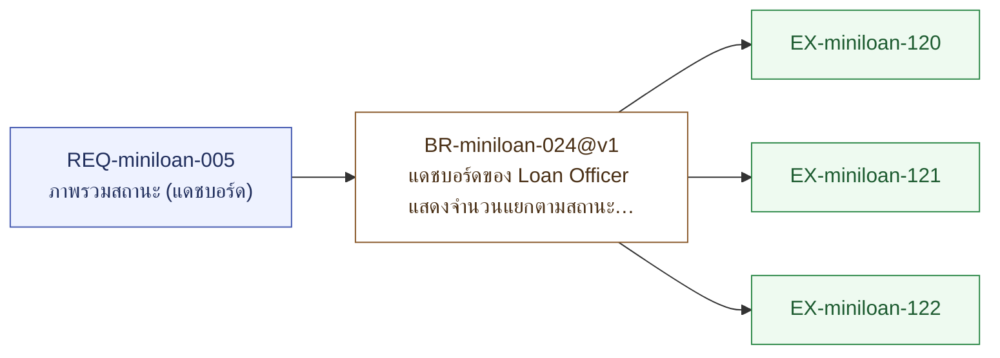

# เอกสารความต้องการระบบ — miniloan

> เอกสารฉบับนี้ถูก **สร้างจาก `spec.json` ทั้งฉบับ** (renderer v2.0) — แก้ไฟล์นี้โดยตรงแล้วจะหายในการ render รอบถัดไป
> แก้ที่ต้นทางเสมอ: `/req:capture` `/req:ask` `/req:example` `/req:calc` `/req:golden` `/req:change`
> **ไฟเขียวของเอกสารฉบับนี้ไม่ใช่การอนุมัติ** — ด่านคือ `/req:check` และคนที่เซ็น CP1 คือเจ้าของ

> 🕒 **สแนปช็อตนี้ถ่ายเมื่อ:** `2026-08-24T01:38:39.549Z`
> เป็นไฟล์ต่อท้าย — ไม่มีใครเขียนทับหรือลบมัน เอาไว้วางเทียบกับใบก่อนหน้าเพื่อดูว่าอะไรขยับ
> **ไม่มีด่านไหนตรวจไฟล์นี้** (ประตู 16) — แก้ด้วยมือแล้วจะไม่มีอะไรบอก · กราฟ `.html` ต่างหากที่ `--validate` ตัดสิน

| คำถาม | คำตอบ |
|---|---|
| กฎที่ยังใช้อยู่ | 53 ข้อ |
| กฎที่มีตัวอย่างพิสูจน์แล้ว | 53 ข้อ (100%) |
| การ์ดแดงที่ยังเปิดอยู่ | 0 ใบ |
| คำถามที่เลื่อนไปเฟสหน้า | 10 ใบ (บล็อก CP2 ไม่ใช่ CP1) |
| เงื่อนไข CP1 ครบหรือยัง | ✅ ครบ |
| ใครรับมอบ Phase 1 | 🖊 ยังไม่มีใครเซ็น — `/req:approve` |
| สถานะของ spec | draft |
| แก้ล่าสุดเมื่อ | 2026-08-15T15:18+07:00 |
| schema | 0.4.0 |

---

## สารบัญ — จากหัวข้อหลักลงไปหัวข้อเล็กสุด

➡️ **สิ่งที่ต้องทำต่อคือหัวข้อ 1 (ขอบเขตและผู้เกี่ยวข้อง)** — คำสั่ง: `/req:ask`

| หัวข้อ | สถานะ | อ่านว่าอะไร | ทำต่อที่ |
|---|---|---|---|
| 1. ขอบเขตและผู้เกี่ยวข้อง | ⬜ ยังไม่มีใครเริ่ม | ยังไม่มีใครบันทึกผู้เกี่ยวข้อง — ตารางสิทธิ์ของเฟสถัดไปต้องสาวกลับมาที่นี่ | `/req:ask` |
| 2. อภิธานศัพท์ | ✅ ครบแล้ว | 25 คำที่ตกลงกันแล้ว | — |
| 3. ความต้องการรายข้อ | ✅ ครบแล้ว | กฎ 53 ข้อ มีตัวอย่างพิสูจน์ครบทุกข้อ | — |
| 4. สัญญาการคำนวณและเลขเฉลย | ✅ ครบแล้ว | สัญญา 6 ใบ · เลขเฉลย 6 ชุด | — |
| 5. สิ่งที่ยังไม่ตัดสิน | ✅ ครบแล้ว | ไม่มีการ์ดแดงค้าง · เลื่อนไปเฟสหน้า 10 ใบ (บล็อก CP2 ไม่ใช่ CP1) | — |
| 6. ประวัติการเปลี่ยนแปลง | ✅ ครบแล้ว | 5 ใบ | — |
| 7. ต้นฉบับที่สาวกลับได้ | ✅ ครบแล้ว | 21 ต้นฉบับ | — |
| 8. ตารางสอบทาน | ✅ ครบแล้ว | ทุกแถวเต็ม | — |

### ผังต้นไม้ของความต้องการ

- **REQ-miniloan-001** — รับและประเมินใบสมัคร · _draft_
  - `BR-miniloan-001@v1` — ผู้สมัครต้องมีอายุ 20–60 ปี · รายได้ต่อเดือน ≥ 15,000 บาท · อายุงานปัจจุบัน ≥ 4 เดือน · ✅ 4 ตัวอย่าง
    - `EX-miniloan-015` — happy · draft
    - `EX-miniloan-016` — boundary · draft
    - `EX-miniloan-017` — exception · draft
    - `EX-miniloan-018` — boundary · draft
  - `BR-miniloan-002@v1` — Debt-to-Income หลังรวมงวดใหม่ ต้อง ≤ 70% ของรายได้ต่อเดือน โดย DTI = (ภาระหนี้เดิมต่อเดือน + งวดใหม่) / รายได้ต่อเดือน · "งวดใหม่" คือค่างวด EMI ที่คำนวณด้วยสูตรเดียวกับ BR-miniloan-016@v1 จากจำนวนเงินกู้ที่ขอ จำนวนงวดที่ขอ และอัตราดอกเบี้ยที่มีผล ณ วันประเมิน — ไม่มีสูตรประมาณแยกอีกชุด · DTI คำนวณครั้งเดียวตอนยื่นจากจำนวนเงินกู้ที่ขอ และไม่คำนวณใหม่แม้เจ้าหน้าที่จะปรับวงเงินลงตาม BR-miniloan-012@v1 · ✅ 5 ตัวอย่าง
    - `EX-miniloan-037` — boundary · draft
    - `EX-miniloan-038` — exception · draft
    - `EX-miniloan-039` — happy · draft
    - `EX-miniloan-040` — alternate · draft
    - `EX-miniloan-153` — alternate · draft
  - `BR-miniloan-003@v1` — วงเงินอนุมัติสูงสุด = 5 เท่าของรายได้ต่อเดือน และไม่เกิน 1,000,000 บาท · ✅ 4 ตัวอย่าง
    - `EX-miniloan-019` — happy · draft
    - `EX-miniloan-020` — boundary · draft
    - `EX-miniloan-021` — boundary · draft
    - `EX-miniloan-022` — boundary · draft
  - `BR-miniloan-004@v1` — ใบสมัครรับได้เฉพาะจำนวนเงินกู้ 10,000 – 1,000,000 บาท และจำนวนงวด 6 – 60 งวด (รายเดือน) · ✅ 4 ตัวอย่าง
    - `EX-miniloan-023` — happy · draft
    - `EX-miniloan-024` — boundary · draft
    - `EX-miniloan-025` — boundary · draft
    - `EX-miniloan-026` — exception · draft
  - `BR-miniloan-005@v1` — อัตราดอกเบี้ยเป็นแบบลดต้นลดดอก 25% ต่อปี · ✅ 2 ตัวอย่าง
    - `EX-miniloan-027` — happy · draft
    - `EX-miniloan-028` — exception · draft
  - `BR-miniloan-006@v1` — จัด Credit Band จากผลประเมิน: Band A = ผ่านทุกเกณฑ์ + DTI ≤ 50% → อนุมัติอัตโนมัติได้ (ยังต้องให้เจ้าหน้าที่ยืนยัน) · Band B = ผ่านเกณฑ์ + DTI มากกว่า 50% ถึง 70% → ส่งเจ้าหน้าที่พิจารณา · Band C = ผิดเกณฑ์ข้อใดข้อหนึ่ง → ปฏิเสธพร้อมเหตุผล · DTI เท่ากับ 50% พอดีได้ Band A ไม่ใช่ Band B — ขอบทั้งสองแบนด์ไม่ซ้อนกันอีกต่อไป · ✅ 4 ตัวอย่าง
    - `EX-miniloan-041` — happy · draft
    - `EX-miniloan-042` — boundary · draft
    - `EX-miniloan-043` — boundary · draft
    - `EX-miniloan-044` — exception · draft
  - `BR-miniloan-007@v1` — ยื่นใบสมัครได้เฉพาะเมื่อกรอกครบ (ชื่อ อายุ รายได้ อายุงาน จำนวนเงินกู้ จำนวนงวด) — ครบแล้วสถานะเปลี่ยนเป็น Submitted และล็อกการแก้ไข · ไม่ครบ ระบบต้องปฏิเสธพร้อมระบุ field ที่ขาด และคงสถานะ Draft · ✅ 3 ตัวอย่าง
    - `EX-miniloan-029` — happy · draft
    - `EX-miniloan-030` — exception · draft
    - `EX-miniloan-031` — boundary · draft
  - `BR-miniloan-008@v1` — บันทึกร่างใบสมัครได้แม้กรอกไม่ครบ — ขั้นร่างยังไม่ตรวจ business rule เต็ม และได้ใบสมัครสถานะ Draft · ✅ 2 ตัวอย่าง
    - `EX-miniloan-032` — happy · draft
    - `EX-miniloan-033` — alternate · draft
  - `BR-miniloan-009@v1` — เมื่อใบสมัครถูกยื่น ระบบต้องประเมินอัตโนมัติและสร้าง CreditAssessment ที่มีคะแนน Band (A/B/C) วงเงินที่อนุมัติได้ และเหตุผลที่ผ่าน/ไม่ผ่านรายเกณฑ์ · ✅ 3 ตัวอย่าง
    - `EX-miniloan-034` — happy · draft
    - `EX-miniloan-035` — exception · draft
    - `EX-miniloan-036` — boundary · draft
- **REQ-miniloan-002** — อนุมัติและเบิกจ่าย · _draft_
  - `BR-miniloan-010@v1` — LoanApplication เดินสถานะได้เฉพาะตามเส้นทางที่กำหนด: Draft → Submitted → UnderReview → Approved → Disbursed และ UnderReview → Rejected · มีเส้นยกเลิกเพิ่ม: Draft, Submitted, UnderReview และ Approved → Cancelled ได้ · ใบที่ Disbursed แล้วยกเลิกไม่ได้ทุกกรณี ต้องไปทางปิดบัญชีตาม BR-miniloan-021@v1 แทน · Rejected และ Cancelled เป็นสถานะสุดท้ายทั้งคู่ ไม่มีเส้นออก · เปลี่ยนสถานะได้ผ่าน method บน Aggregate เท่านั้น (Submit(), Approve(), Reject(), Disburse(), Cancel()) — ถอยสถานะกลับไม่ได้ วิธีแก้เมื่อเดินผิดคือยกเลิกแล้วสร้างใบใหม่ · ✅ 4 ตัวอย่าง
    - `EX-miniloan-045` — happy · draft
    - `EX-miniloan-046` — exception · draft
    - `EX-miniloan-047` — alternate · draft
    - `EX-miniloan-048` — boundary · draft
  - `BR-miniloan-011@v1` — อนุมัติได้เฉพาะใบสมัครสถานะ UnderReview และเมื่ออนุมัติต้องบันทึกผู้อนุมัติและเวลาไว้ด้วย · ✅ 3 ตัวอย่าง
    - `EX-miniloan-049` — happy · draft
    - `EX-miniloan-050` — exception · draft
    - `EX-miniloan-051` — boundary · draft
  - `BR-miniloan-012@v1` — ถ้าจำนวนเงินกู้ที่ขอ > วงเงินอนุมัติสูงสุดตาม BR-miniloan-003@v1 ระบบต้องเตือนและให้ปรับวงเงินก่อน จึงจะอนุมัติได้ · ✅ 3 ตัวอย่าง
    - `EX-miniloan-052` — boundary · draft
    - `EX-miniloan-053` — exception · draft
    - `EX-miniloan-054` — alternate · draft
  - `BR-miniloan-013@v1` — ปฏิเสธใบสมัครต้องระบุเหตุผลเสมอ และสถานะ Rejected เป็นสถานะสุดท้าย — พยายามอนุมัติใบที่ Rejected แล้วต้องถูกปฏิเสธเป็น invalid transition · ✅ 3 ตัวอย่าง
    - `EX-miniloan-055` — happy · draft
    - `EX-miniloan-056` — exception · draft
    - `EX-miniloan-057` — boundary · draft
  - `BR-miniloan-014@v1` — เบิกจ่ายได้เฉพาะใบสมัครสถานะ Approved · เมื่อเบิกจ่ายสำเร็จ ใบสมัครเปลี่ยนเป็น Disbursed และระบบสร้าง LoanAccount สถานะ Active หนึ่งบัญชีต่อหนึ่งใบสมัคร · ✅ 3 ตัวอย่าง
    - `EX-miniloan-058` — happy · draft
    - `EX-miniloan-059` — exception · draft
    - `EX-miniloan-060` — boundary · draft
  - `BR-miniloan-031@v2` — สิทธิ์เดินสถานะ LoanApplication แยกตามเส้น: Draft → Submitted ทำได้เฉพาะ Applicant ที่เป็นเจ้าของใบสมัครนั้น · Submitted → UnderReview เกิดจากผลการประเมินของ System ไม่มีคนกด · UnderReview → Approved, UnderReview → Rejected และ Approved → Disbursed ทำได้เฉพาะ Loan Officer · **การยกเลิก (→ Cancelled) แยกตามว่าใบนั้นถูกมอบหมายแล้วหรือยัง — ใบที่ถูกมอบหมายแล้ว ยกเลิกได้เฉพาะ Loan Officer ที่ถูกมอบหมายตาม BR-miniloan-032@v1 · ใบที่ยังไม่ถูกมอบหมาย (Draft และ Submitted) ยกเลิกได้เฉพาะหัวหน้าเจ้าหน้าที่สินเชื่อ (UL-miniloan-019) เท่านั้น Loan Officer ทั่วไปทำไม่ได้** · Applicant ทำ Approve, Reject, Disburse และ Cancel ไม่ได้ทุกกรณีทุกสถานะ — ต้องการยกเลิกต้องแจ้งเจ้าหน้าที่ และถ้าใบยังไม่ถูกมอบหมายต้องถึงหัวหน้า · ✅ 7 ตัวอย่าง
    - `EX-miniloan-047` — alternate · draft
    - `EX-miniloan-061` — happy · draft
    - `EX-miniloan-062` — exception · draft
    - `EX-miniloan-064` — alternate · draft
    - `EX-miniloan-091` — happy · draft
    - `EX-miniloan-092` — exception · draft
    - `EX-miniloan-093` — boundary · draft
  - `BR-miniloan-032@v1` — ใบสมัครที่เข้าสู่การพิจารณาต้องถูกมอบหมาย (assign) ให้ Loan Officer หนึ่งคน โดย**หัวหน้าเป็นผู้สั่งมอบหมาย** — ระบบไม่กระจายงานเอง และเจ้าหน้าที่หยิบงานเองไม่ได้ · เฉพาะคนที่ถูกมอบหมายเท่านั้นที่กดอนุมัติหรือปฏิเสธใบสมัครนั้นได้ Loan Officer คนอื่นทำไม่ได้แม้จะมีสิทธิ์ระดับเดียวกัน · ใบสมัครที่ยังไม่ถูกมอบหมายจึงอนุมัติหรือปฏิเสธไม่ได้เลย ต้องรอหัวหน้าจ่ายงานก่อน · ✅ 3 ตัวอย่าง
    - `EX-miniloan-065` — happy · draft
    - `EX-miniloan-066` — exception · draft
    - `EX-miniloan-067` — boundary · draft
  - `BR-miniloan-047@v1` — ยกเลิกใบสมัครต้องระบุเหตุผลเสมอ และเก็บเหตุผลนั้นไว้กับใบสมัคร — เช่นเดียวกับที่ BR-miniloan-013@v1 บังคับกับการปฏิเสธ · สั่งยกเลิกโดยไม่ระบุเหตุผลต้องถูกปฏิเสธและใบสมัครไม่เปลี่ยนสถานะ · ✅ 2 ตัวอย่าง
    - `EX-miniloan-068` — happy · draft
    - `EX-miniloan-069` — exception · draft
- **REQ-miniloan-003** — สร้างบัญชีและตารางผ่อน · _draft_
  - `BR-miniloan-015@v1` — เมื่อเบิกจ่ายสำเร็จ ระบบต้องสร้าง RepaymentSchedule ให้บัญชีนั้นทันทีตามกฎการคำนวณงวดผ่อน · ✅ 3 ตัวอย่าง
    - `EX-miniloan-094` — happy · draft
    - `EX-miniloan-095` — boundary · draft
    - `EX-miniloan-096` — exception · draft
  - `BR-miniloan-016@v1` — งวดผ่อนเท่ากันทุกงวด (EMI) = P × r × (1+r)^n / ((1+r)^n − 1) โดย P = เงินต้น, r = อัตราดอกเบี้ยต่อเดือน (= อัตราต่อปี / 12), n = จำนวนงวด · แต่ละงวดแยกเป็นดอกเบี้ย (ยอดคงเหลือ × r) และเงินต้น (EMI − ดอกเบี้ย) · ✅ 2 ตัวอย่าง
    - `EX-miniloan-097` — happy · draft
    - `EX-miniloan-098` — boundary · draft
  - `BR-miniloan-017@v1` — ผลรวมเงินต้นทุกงวดในตารางผ่อนต้องเท่ากับเงินต้นตั้งต้นพอดี และยอดคงเหลือหลังงวดสุดท้ายต้องเป็น 0 — งวดสุดท้ายเป็นงวดที่รับเศษจากการปัด · ✅ 3 ตัวอย่าง
    - `EX-miniloan-001` — happy · draft
    - `EX-miniloan-002` — boundary · draft
    - `EX-miniloan-003` — boundary · draft
  - `BR-miniloan-018@v1` — เจ้าของบัญชีเปิดดูตารางผ่อนของบัญชีสถานะ Active ของตัวเองได้ทั้งตาราง พร้อมสถานะรายงวด (จ่ายแล้ว / ค้าง) · ✅ 2 ตัวอย่าง
    - `EX-miniloan-099` — happy · draft
    - `EX-miniloan-100` — exception · draft
  - `BR-miniloan-036@v1` — อัตราดอกเบี้ยและสูตรคำนวณมีเวอร์ชันและมีวันเริ่มมีผล (effective date) · บัญชีสินเชื่อใช้เวอร์ชันที่มีผลอยู่ ณ วันเบิกจ่าย และการประกาศอัตราใหม่ไม่กระทบตารางผ่อนที่สร้างไปแล้ว · **วันเริ่มมีผลนับรวมวันนั้น (inclusive)** — เบิกจ่ายตรงวัน effective date พอดี ใช้อัตราเวอร์ชันใหม่ ไม่ใช่เวอร์ชันเก่า · **ประกาศอัตราย้อนหลังไม่ได้** — effective date ต้องเป็นวันที่ประกาศหรือวันในอนาคตเท่านั้น ใส่วันในอดีตระบบต้องปฏิเสธและไม่บันทึกเวอร์ชันนั้น จึงไม่มีกรณีที่บัญชีซึ่งเบิกจ่ายไปแล้วต้องคำนวณตารางผ่อนใหม่ · ✅ 4 ตัวอย่าง
    - `EX-miniloan-101` — happy · draft
    - `EX-miniloan-102` — boundary · draft
    - `EX-miniloan-103` — exception · draft
    - `EX-miniloan-104` — alternate · draft
  - `BR-miniloan-037@v1` — บัญชีสินเชื่อผูกกับเวอร์ชันของอัตราดอกเบี้ยที่ใช้ตอนสร้างตารางผ่อน ไม่ได้คัดลอกตัวเลขมาเก็บไว้ในตัวบัญชี — เปิดบัญชีเก่าต้องเห็นอัตราเดิมเสมอแม้ master จะเปลี่ยนไปแล้ว และเวอร์ชันของอัตราที่เคยถูกใช้ห้ามลบ · ✅ 3 ตัวอย่าง
    - `EX-miniloan-105` — happy · draft
    - `EX-miniloan-106` — exception · draft
    - `EX-miniloan-107` — boundary · draft
  - `BR-miniloan-044@v1` — ตารางผ่อนที่ออกให้ผู้กู้แล้วหลังเบิกจ่าย แก้แถวในฉบับเดิมไม่ได้ — ถ้าต้องเปลี่ยน ต้องออกตารางผ่อนฉบับใหม่ทับทั้งฉบับ และฉบับเดิมต้องเก็บไว้ดูย้อนหลังได้ ห้ามลบ · ✅ 4 ตัวอย่าง
    - `EX-miniloan-008` — happy · draft
    - `EX-miniloan-009` — exception · draft
    - `EX-miniloan-010` — exception · draft
    - `EX-miniloan-011` — boundary · draft
  - `BR-miniloan-045@v1` — ตารางผ่อนของบัญชีสินเชื่อที่ปิดแล้ว (Closed) ล็อกถาวร — ออกตารางผ่อนฉบับใหม่ทับไม่ได้ทุกกรณี · ข้อนี้เป็นข้อยกเว้นที่กันตารางผ่อนออกจากเส้นทางการปรับปรุงบัญชีหลังปิดตาม BR-miniloan-038@v1 ด้วย คือถึงมีผู้อนุมัติก็ออกฉบับใหม่ไม่ได้ · การออกฉบับใหม่ทับตาม BR-miniloan-044@v1 ทำได้เฉพาะขณะบัญชียังเป็น Active เท่านั้น · ✅ 3 ตัวอย่าง
    - `EX-miniloan-108` — exception · draft
    - `EX-miniloan-109` — exception · draft
    - `EX-miniloan-110` — boundary · draft
- **REQ-miniloan-004** — รับชำระและปิดบัญชี · _draft_
  - `BR-miniloan-019@v1` — ไม่รับชำระบางส่วน — ชำระน้อยกว่ายอดงวด ระบบต้องแจ้งว่าไม่ครบงวด และไม่ปิดงวดนั้น · ✅ 3 ตัวอย่าง
    - `EX-miniloan-012` — boundary · draft
    - `EX-miniloan-013` — happy · draft
    - `EX-miniloan-014` — exception · draft
  - `BR-miniloan-020@v1` — บันทึก Payment ตรงตามยอดงวดของบัญชี Active ที่มีงวดค้าง → งวดนั้นเปลี่ยนสถานะเป็น Paid และยอดคงเหลือของบัญชีลดลง · ✅ 1 ตัวอย่าง
    - `EX-miniloan-013` — happy · draft
  - `BR-miniloan-021@v1` — LoanAccount เปลี่ยนเป็น Closed ได้เฉพาะสองทาง: ชำระครบทุกงวด หรือปิดก่อนกำหนดสำเร็จ · ✅ 4 ตัวอย่าง
    - `EX-miniloan-004` — happy · draft
    - `EX-miniloan-005` — alternate · draft
    - `EX-miniloan-006` — exception · draft
    - `EX-miniloan-007` — boundary · draft
  - `BR-miniloan-022@v1` — ยอดปิดบัญชีก่อนกำหนด = เงินต้นคงเหลือ + ดอกเบี้ยค้างจ่ายถึงวันที่ปิด + ค่าธรรมเนียมปิดก่อนกำหนด 1% ของเงินต้นคงเหลือ · ไม่คิดดอกเบี้ยของงวดในอนาคตที่ยังไม่ถึงกำหนด · ดอกเบี้ยค้างจ่ายใช้ฐานนับวัน actual/365 (นับวันจริง หารด้วย 365) นับจากวันครบกำหนดงวดล่าสุดที่ชำระแล้วถึงวันที่ปิด — ปิดตรงวันครบกำหนดที่เพิ่งชำระ ดอกเบี้ยค้างจ่ายเป็น 0 · ✅ 4 ตัวอย่าง
    - `EX-miniloan-074` — happy · draft
    - `EX-miniloan-075` — boundary · draft
    - `EX-miniloan-076` — boundary · draft
    - `EX-miniloan-151` — exception · draft
  - `BR-miniloan-023@v1` — เมื่อชำระยอดปิดบัญชีก่อนกำหนดครบ บัญชีเปลี่ยนเป็น Closed และงวดที่เหลือในตารางผ่อนถูกยกเลิก · ✅ 1 ตัวอย่าง
    - `EX-miniloan-005` — alternate · draft
  - `BR-miniloan-034@v1` — บันทึก Payment และปิดบัญชีสินเชื่อทำได้เฉพาะ Operations · Applicant ขอยอดปิดบัญชีก่อนกำหนดได้ แต่บันทึกการชำระเองและปิดบัญชีเองไม่ได้ · ✅ 4 ตัวอย่าง
    - `EX-miniloan-070` — happy · draft
    - `EX-miniloan-071` — exception · draft
    - `EX-miniloan-072` — alternate · draft
    - `EX-miniloan-073` — boundary · draft
  - `BR-miniloan-038@v1` — แก้ข้อมูลของบัญชีสินเชื่อที่ปิดแล้ว (Closed) ทำได้ แต่ต้องผ่านการอนุมัติก่อนจึงมีผล — แก้ทับทันทีไม่ได้ และการยกเลิกบัญชีทิ้งอย่างเดียวก็ไม่ใช่ทางแก้ · ✅ 3 ตัวอย่าง
    - `EX-miniloan-077` — happy · draft
    - `EX-miniloan-078` — exception · draft
    - `EX-miniloan-079` — exception · draft
  - `BR-miniloan-039@v1` — ผู้อนุมัติการปรับปรุงบัญชีสินเชื่อที่ปิดแล้ว (Closed) กำหนดเป็น role ได้ — เป็นค่าที่ตั้งไว้ในระบบและเปลี่ยนได้ภายหลังโดยไม่ต้องแก้โปรแกรม ไม่ผูกตายกับ actor ใด actor หนึ่งในโค้ด · ✅ 2 ตัวอย่าง
    - `EX-miniloan-083` — happy · draft
    - `EX-miniloan-090` — happy · draft
  - `BR-miniloan-040@v1` — ถ้ายังไม่ได้ตั้ง role ผู้อนุมัติตาม BR-miniloan-039@v1 ระบบต้องปฏิเสธคำขอปรับปรุงบัญชีที่ปิดแล้วทุกกรณีพร้อมแจ้งเหตุผล — ไม่มีผู้อนุมัติค่าเริ่มต้น (default) และห้ามให้การแก้มีผลไปก่อนแล้วค่อยหาคนอนุมัติทีหลัง · ✅ 2 ตัวอย่าง
    - `EX-miniloan-081` — exception · draft
    - `EX-miniloan-082` — boundary · draft
  - `BR-miniloan-041@v1` — การแก้ข้อมูลบัญชีสินเชื่อที่ปิดแล้วต้องบันทึกเป็นรายการปรับปรุง (adjustment) แยกจากตัวบัญชี — ค่าเดิมของบัญชีคงไว้ไม่ถูกทับ · รายการปรับปรุงต้องเก็บค่าเดิม ค่าใหม่ ผู้ขอแก้ ผู้อนุมัติ และเวลาอนุมัติ (บันทึกผู้อนุมัติและเวลาแนวเดียวกับ BR-miniloan-011@v1) · ✅ 2 ตัวอย่าง
    - `EX-miniloan-085` — happy · draft
    - `EX-miniloan-086` — exception · draft
  - `BR-miniloan-046@v2` — ชำระเกินยอดงวด ระบบต้องรับชำระ ปิดงวดนั้น และนำส่วนที่เกินไปตัดเงินต้นของบัญชี (โปะเงินต้น) — ไม่ปฏิเสธและไม่ทอนคืน · เมื่อเงินต้นลดลง ตารางผ่อนที่ออกไปแล้วไม่ตรงอีกต่อไป ระบบจึงต้องออกตารางผ่อนฉบับใหม่ทับตาม BR-miniloan-044@v1 ทุกครั้งที่มีการโปะ · ส่วนเกินไปลดจำนวนงวด โดยค่างวด (EMI) คงเดิม · การโปะมีค่าธรรมเนียม 1% ของยอดส่วนที่เกิน ฐานเดียวกับค่าธรรมเนียมปิดก่อนกำหนดตาม BR-miniloan-022@v1 · กลไกการหักและฐานการคำนวณที่แน่นอนกำหนดไว้ที่ BR-miniloan-050@v1 (หักออกจากส่วนเกินก่อนนำไปตัดเงินต้น เงินต้นลดลง = ส่วนเกิน × 99%) · ✅ 3 ตัวอย่าง
    - `EX-miniloan-087` — happy · draft
    - `EX-miniloan-088` — boundary · draft
    - `EX-miniloan-089` — exception · draft
  - `BR-miniloan-048@v1` — ผู้มีสิทธิ์ตั้งค่าและเปลี่ยน role ผู้อนุมัติตาม BR-miniloan-039@v1 คือ Loan Officer เท่านั้น — Operations และ Applicant ตั้งค่าไม่ได้ ทั้งจากหน้าจอและผ่าน API · โมดูลนี้ไม่เพิ่ม actor ผู้ดูแลระบบ (System Admin) เข้ามาในรอบนี้ · ✅ 2 ตัวอย่าง
    - `EX-miniloan-083` — happy · draft
    - `EX-miniloan-084` — exception · draft
  - `BR-miniloan-049@v1` — ผู้อนุมัติคำขอปรับปรุงบัญชีสินเชื่อที่ปิดแล้วต้องเป็นคนละคนกับผู้ขอแก้ (four-eyes) — ผู้ที่ยื่นคำขออนุมัติคำขอของตัวเองไม่ได้ แม้จะถือ role ผู้อนุมัติที่ตั้งไว้ตาม BR-miniloan-039@v1 · ข้อห้ามนี้ต้องบังคับที่ฝั่ง API ตาม BR-miniloan-025@v1 ไม่ใช่แค่ซ่อนปุ่มบนหน้าจอ · ✅ 2 ตัวอย่าง
    - `EX-miniloan-077` — happy · draft
    - `EX-miniloan-080` — exception · draft
- **REQ-miniloan-005** — ภาพรวมสถานะ (แดชบอร์ด) · _draft_
  - `BR-miniloan-024@v1` — แดชบอร์ดของ Loan Officer แสดงจำนวนแยกตามสถานะ Submitted / UnderReview / Approved / Active / Closed โดยนับข้ามทั้ง LoanApplication และ LoanAccount · ✅ 3 ตัวอย่าง
    - `EX-miniloan-120` — happy · draft
    - `EX-miniloan-121` — boundary · draft
    - `EX-miniloan-122` — exception · draft
- **REQ-miniloan-006** — สถาปัตยกรรมแยก Web กับ API · _draft_
  - `BR-miniloan-025@v1` — ทุกความสามารถใน Epic 1–8 ต้องมี API endpoint รองรับ และ business rule ต้องถูกบังคับที่ฝั่ง API เสมอ · ✅ 2 ตัวอย่าง
    - `EX-miniloan-123` — happy · draft
    - `EX-miniloan-124` — exception · draft
  - `BR-miniloan-026@v1` — เรียก API ด้วยข้อมูลที่ผิด business rule → API ต้องปฏิเสธพร้อมรหัสและข้อความ error ที่ชัดเจน โดยไม่พึ่งการ validate ของ Web เพียงอย่างเดียว · ✅ 2 ตัวอย่าง
    - `EX-miniloan-125` — exception · draft
    - `EX-miniloan-126` — exception · draft
  - `BR-miniloan-027@v1` — Web ไม่ตัดสินใจเชิงธุรกิจเอง — เมื่อต้องตัดสิน (เช่น อนุมัติได้ไหม วงเงินเท่าไร) ต้องเรียก API เท่านั้น ห้ามคำนวณเอง · ✅ 2 ตัวอย่าง
    - `EX-miniloan-127` — happy · draft
    - `EX-miniloan-128` — exception · draft
  - `BR-miniloan-028@v1` — เมื่อ API ปิดให้บริการ Web ต้องแสดงสถานะข้อผิดพลาดอย่างเหมาะสม และต้องไม่ crash · ✅ 2 ตัวอย่าง
    - `EX-miniloan-129` — exception · draft
    - `EX-miniloan-130` — boundary · draft
  - `BR-miniloan-029@v1` — API ต้องมีสัญญาที่ทดสอบได้ — คำอธิบาย endpoint และ request/response schema (เช่น OpenAPI) — และ request/response จริงต้องตรงตาม schema ที่ประกาศไว้ · ✅ 2 ตัวอย่าง
    - `EX-miniloan-131` — happy · draft
    - `EX-miniloan-132` — exception · draft
  - `BR-miniloan-030@v1` — Web เรียก API ต้องแนบ token จำลองทุกครั้ง และ API ต้องตรวจสอบ token ก่อนให้บริการ (ระบบ auth จริงอยู่นอกขอบเขต) · ✅ 3 ตัวอย่าง
    - `EX-miniloan-133` — happy · draft
    - `EX-miniloan-134` — exception · draft
    - `EX-miniloan-135` — exception · draft
  - `BR-miniloan-033@v1` — Applicant เห็นและเรียกดูได้เฉพาะใบสมัครและบัญชีสินเชื่อที่ตัวเองเป็นเจ้าของเท่านั้น · ขอบเขตนี้ต้องถูกบังคับที่ฝั่ง API ไม่ใช่แค่ซ่อนบนหน้าจอ — เรียก API ด้วย id ของคนอื่นต้องถูกปฏิเสธ · ✅ 3 ตัวอย่าง
    - `EX-miniloan-136` — happy · draft
    - `EX-miniloan-137` — exception · draft
    - `EX-miniloan-138` — boundary · draft
  - `BR-miniloan-035@v1` — ค่าเงินทุกจุดที่เกิดขึ้นในระบบต้องปัดทันทีที่เกิดด้วยวิธี round half up ไม่ใช่เก็บค่าเต็มไว้แล้วปัดตอนแสดงผล — EMI ปัดก่อน ดอกเบี้ยรายงวดปัด แล้วเงินต้นของงวด = EMI − ดอกเบี้ยที่ปัดแล้ว · จำนวนตำแหน่งทศนิยมยังไม่ถูกกำหนด (ดู DQ-miniloan-001) · ✅ 2 ตัวอย่าง
    - `EX-miniloan-139` — boundary · draft
    - `EX-miniloan-140` — boundary · draft
  - `BR-miniloan-042@v1` — เมื่อ Web เรียก API แล้วล้มเหลวหรือ timeout ระบบต้องล้มทันทีและแจ้งผู้ใช้ให้สั่งใหม่เอง — ไม่มีคิว retry อัตโนมัติ และห้ามค้างรอจนกว่าจะสำเร็จ · รูปแบบการแสดงข้อผิดพลาดเป็นไปตาม BR-miniloan-028@v1 · ✅ 2 ตัวอย่าง
    - `EX-miniloan-141` — exception · draft
    - `EX-miniloan-142` — boundary · draft
  - `BR-miniloan-043@v1` — ทุกคำสั่งที่เขียนข้อมูล (สร้างรายการใหม่ หรือเปลี่ยนสถานะ) ต้องกันการยิงซ้ำด้วยข้อจำกัดไม่ซ้ำ (unique constraint) ที่ฐานข้อมูล — คำสั่งซ้ำต้องถูกปฏิเสธพร้อม error ที่ผู้ใช้เห็น ไม่ใช่คืนผลของครั้งแรกเงียบๆ และไม่ใช่ปล่อยให้เกิดรายการซ้ำแล้วให้ผู้ใช้ไปลบเอง · ฟิลด์ที่ใช้เป็น key กันซ้ำของแต่ละคำสั่งยังไม่ถูกกำหนด (ดู DQ-miniloan-009) · ✅ 2 ตัวอย่าง
    - `EX-miniloan-143` — exception · draft
    - `EX-miniloan-144` — boundary · draft

---

## 1. ขอบเขตและผู้เกี่ยวข้อง ⬜

> **สถานะ ณ เวลาที่ export:** ⬜ ยังไม่มีใครเริ่ม — ยังไม่มีใครบันทึกผู้เกี่ยวข้อง — ตารางสิทธิ์ของเฟสถัดไปต้องสาวกลับมาที่นี่
> **ทำต่อที่:** `/req:ask`

| เรื่อง | ค่า |
|---|---|
| โมดูล | miniloan |
| ขนาดที่ตกลงกัน | FULL |
| เริ่มเก็บเมื่อ | 2026-08-14T11:21+07:00 |

### ผู้เกี่ยวข้อง

> ⬜ **ยังไม่มีข้อมูลในหัวข้อนี้** — ยังไม่มีใครบันทึกผู้เกี่ยวข้องไว้ · `/req:ask` ชั้นกรอบเป็นคนถามเรื่องนี้ และตารางสิทธิ์ของเฟสถัดไปต้องสาวกลับมาที่นี่

## 2. อภิธานศัพท์ ✅

> **สถานะ ณ เวลาที่ export:** ✅ ครบแล้ว — 25 คำที่ตกลงกันแล้ว

คำที่ตกลงกันแล้ว — ทุกคำในเอกสารนี้ที่ปรากฏในตารางนี้ ใช้ความหมายตามตารางนี้เท่านั้น

| รหัส | คำ | อังกฤษ | นิยาม | อย่าสับสนกับ | สถานะ |
|---|---|---|---|---|---|
| [`UL-miniloan-001`](../../docs/wiki/glossary/UL-miniloan-001.md) | ใบสมัครสินเชื่อ | LoanApplication | ใบสมัครสินเชื่อ ตั้งแต่ร่างจนถึงเบิกจ่าย เป็น Aggregate ฝั่ง Origination · 1 ผู้สมัครมีได้หลายใบสมัคร | UL-miniloan-004 | draft |
| [`UL-miniloan-002`](../../docs/wiki/glossary/UL-miniloan-002.md) | ข้อมูลผู้สมัคร | ApplicantProfile | ข้อมูลผู้สมัคร: อายุ รายได้ อายุงาน ภาระหนี้ปัจจุบัน | — | draft |
| [`UL-miniloan-003`](../../docs/wiki/glossary/UL-miniloan-003.md) | ผลการประเมินสินเชื่อ | CreditAssessment | ผลการประเมินจาก rule engine ประกอบด้วยคะแนน เหตุผล และวงเงินที่อนุมัติได้ | — | draft |
| [`UL-miniloan-004`](../../docs/wiki/glossary/UL-miniloan-004.md) | บัญชีสินเชื่อ | LoanAccount | บัญชีสินเชื่อหลังเบิกจ่าย เป็น Aggregate ฝั่ง Servicing · 1 ใบสมัครที่ Disbursed สร้าง 1 บัญชี | UL-miniloan-001 | draft |
| [`UL-miniloan-005`](../../docs/wiki/glossary/UL-miniloan-005.md) | ตารางผ่อน | RepaymentSchedule | ตารางผ่อนรายงวดของบัญชีสินเชื่อหนึ่งบัญชี แต่ละแถวแยกเงินต้น ดอกเบี้ย และยอดคงเหลือ | UL-miniloan-006 | draft |
| [`UL-miniloan-006`](../../docs/wiki/glossary/UL-miniloan-006.md) | งวดผ่อน | Installment | งวดผ่อน 1 งวดในตารางผ่อน — หนึ่งแถวของ RepaymentSchedule | UL-miniloan-005 · UL-miniloan-012 | draft |
| [`UL-miniloan-007`](../../docs/wiki/glossary/UL-miniloan-007.md) | รายการชำระเงิน | Payment | รายการชำระเงินที่บันทึกเข้าบัญชีสินเชื่อ · รอบการเรียนนี้บันทึกด้วยมือ ไม่เชื่อม payment gateway จริง | — | draft |
| [`UL-miniloan-008`](../../docs/wiki/glossary/UL-miniloan-008.md) | การปิดบัญชีก่อนกำหนด | EarlySettlement | การปิดบัญชีสินเชื่อก่อนครบกำหนดงวดสุดท้าย โดยชำระยอดปิดบัญชีตาม BR-07 | — | draft |
| [`UL-miniloan-009`](../../docs/wiki/glossary/UL-miniloan-009.md) | จำนวนเงิน | Money | จำนวนเงินพร้อมสกุลเงิน เป็น Value Object · ห้ามใช้ทศนิยมลอย (floating point) · รอบการเรียนนี้ใช้ THB อย่างเดียว | — | draft |
| [`UL-miniloan-010`](../../docs/wiki/glossary/UL-miniloan-010.md) | วงเงินอนุมัติสูงสุด | MaxApprovableAmount | วงเงินสูงสุดที่ระบบอนุมัติให้ผู้สมัครรายนี้ได้ = 5 เท่าของรายได้ต่อเดือน และไม่เกิน 1,000,000 บาท — คำนวณโดยระบบ ไม่ใช่ตัวเลขที่ผู้สมัครกรอก | UL-miniloan-011 | draft |
| [`UL-miniloan-011`](../../docs/wiki/glossary/UL-miniloan-011.md) | จำนวนเงินกู้ที่ขอ | RequestedAmount | จำนวนเงินที่ผู้สมัครกรอกในใบสมัคร ต้องอยู่ในช่วง 10,000 – 1,000,000 บาท — เป็นตัวเลขที่คนกรอก ไม่ใช่ตัวเลขที่ระบบคำนวณ | UL-miniloan-010 | draft |
| [`UL-miniloan-012`](../../docs/wiki/glossary/UL-miniloan-012.md) | จำนวนงวด | Term | จำนวนงวดที่ตกลงกันในสัญญา เป็นตัวเลขนับ ต้องอยู่ในช่วง 6 – 60 งวด (รายเดือน) — เป็นค่าที่ผู้สมัครเลือกตอนกรอกใบสมัคร และเป็น n ในสูตร EMI · ไม่ใช่แถวในตารางผ่อน | UL-miniloan-006 | draft |
| [`UL-miniloan-013`](../../docs/wiki/glossary/UL-miniloan-013.md) | การมอบหมายใบสมัคร | ApplicationAssignment | การผูกใบสมัครหนึ่งใบเข้ากับ Loan Officer หนึ่งคนเพื่อให้เป็นผู้พิจารณา · เฉพาะคนที่ถูกมอบหมายเท่านั้นที่กดอนุมัติหรือปฏิเสธใบสมัครนั้นได้ · แนวคิดนี้ไม่มีในเอกสารต้นทาง เกิดจากการตัดสินของเจ้าของในรอบ /req:ask permission | — | draft |
| [`UL-miniloan-014`](../../docs/wiki/glossary/UL-miniloan-014.md) | อัตราดอกเบี้ย | InterestRate | อัตราดอกเบี้ยแบบลดต้นลดดอกที่ใช้คำนวณตารางผ่อน · เป็นข้อมูลหลักที่มีเวอร์ชันและมีวันเริ่มมีผล (effective date) ไม่ใช่ค่าคงที่ในโค้ด — บัญชีสินเชื่อผูกกับเวอร์ชันที่มีผลอยู่ ณ วันเบิกจ่าย และเวอร์ชันที่เคยถูกใช้ห้ามลบ | — | draft |
| [`UL-miniloan-015`](../../docs/wiki/glossary/UL-miniloan-015.md) | การปรับปรุงบัญชีหลังปิด | ClosedAccountAdjustment | รายการขอแก้ไขข้อมูลของบัญชีสินเชื่อที่ปิดแล้ว (Closed) ต้องผ่านการอนุมัติจากผู้ถือบทบาทผู้อนุมัติ (UL-miniloan-016) ก่อนจึงมีผล ไม่ใช่การแก้ทับทันที · เก็บเป็นรายการปรับปรุงแยกจากตัวบัญชี ค่าเดิมของบัญชีคงไว้ไม่ถูกทับ และรายการเก็บค่าเดิม ค่าใหม่ ผู้ขอแก้ ผู้อนุมัติ และเวลาอนุมัติ | UL-miniloan-008 | draft |
| [`UL-miniloan-016`](../../docs/wiki/glossary/UL-miniloan-016.md) | บทบาทผู้อนุมัติ | ApproverRole | role ที่ระบบกำหนดให้มีสิทธิ์อนุมัติการปรับปรุงบัญชีสินเชื่อที่ปิดแล้ว — เป็นค่าที่ตั้งไว้ในระบบและเปลี่ยนได้ภายหลัง ไม่ผูกตายกับ actor ใด actor หนึ่งในโค้ด · ถ้ายังไม่ตั้ง ฟีเจอร์ปรับปรุงบัญชีที่ปิดแล้วใช้ไม่ได้ (ไม่มีค่าเริ่มต้น) · ใครตั้งค่าได้ และต้องต่างจากผู้ขอแก้หรือไม่ ยังไม่ตัดสิน — ดู Q-miniloan-009 | UL-miniloan-013 | draft |
| [`UL-miniloan-017`](../../docs/wiki/glossary/UL-miniloan-017.md) | ตารางผ่อนฉบับที่ออกใหม่ | RepaymentScheduleRevision | ตารางผ่อนฉบับใหม่ที่ออกทับฉบับเดิมของบัญชีสินเชื่อเดียวกัน เมื่อจำเป็นต้องเปลี่ยนตารางผ่อนที่ออกให้ผู้กู้ไปแล้ว — ออกทับทั้งฉบับ ไม่ใช่แก้บางแถวของฉบับเดิม · ฉบับเดิมยังเก็บไว้ดูย้อนหลังได้และห้ามลบ แนวเดียวกับเวอร์ชันของอัตราดอกเบี้ยใน BR-miniloan-037@v1 | UL-miniloan-005 | draft |
| [`UL-miniloan-018`](../../docs/wiki/glossary/UL-miniloan-018.md) | การโปะเงินต้น | PartialPrepayment | การชำระเกินยอดงวด โดยส่วนที่เกินถูกนำไปตัดเงินต้นของบัญชีสินเชื่อที่ยังเป็น Active — บัญชีไม่ปิด ยังผ่อนต่อ แต่เงินต้นลดลงจึงต้องออกตารางผ่อนฉบับใหม่ทับตาม BR-miniloan-044@v1 · ส่วนเกินไปลดจำนวนงวดโดยค่างวดคงเดิม (Q-miniloan-010) · มีค่าธรรมเนียม 1% ของยอดส่วนที่เกิน หักออกจากส่วนเกินก่อนนำไปตัดเงินต้น (Q-miniloan-013 → BR-miniloan-050@v1) · ถ้าส่วนเกินมากพอปิดบัญชีได้ในครั้งเดียว ไม่ใช่การโปะแล้ว แต่เป็นการปิดบัญชีก่อนกำหนดตาม BR-miniloan-051@v1 | UL-miniloan-008 | draft |
| [`UL-miniloan-019`](../../docs/wiki/glossary/UL-miniloan-019.md) | หัวหน้าเจ้าหน้าที่สินเชื่อ | Supervisor | ผู้ที่มีอำนาจสั่งมอบหมายใบสมัครให้ Loan Officer รายคน — เอกสารต้นทาง §3 ไม่มี actor นี้ (มีแค่ Applicant / Loan Officer / Operations / System) เกิดขึ้นจากคำตอบของ Q-miniloan-005 · ยังไม่ตัดสินว่ามีกี่ระดับ ทำอย่างอื่นได้อีกไหม และเห็นข้อมูลของลูกน้องแค่ไหน — ส่วนขอบเขตข้อมูลค้างอยู่ที่ DQ-miniloan-002 | UL-miniloan-013 | draft |
| [`UL-miniloan-020`](../../docs/wiki/glossary/UL-miniloan-020.md) | การยกเลิกใบสมัคร | ApplicationCancellation | การจบใบสมัครก่อนถึงการเบิกจ่าย โดยใบนั้นไปอยู่สถานะสุดท้าย Cancelled — ทำได้ตั้งแต่ Draft ถึง Approved เท่านั้น ใบที่ Disbursed แล้วยกเลิกไม่ได้ · **สั่งได้เฉพาะเจ้าหน้าที่ (Loan Officer) และต้องระบุเหตุผลเสมอ** — Applicant ยกเลิกใบของตัวเองไม่ได้ ต้องแจ้งเจ้าหน้าที่ · เป็นวิธีแก้เดียวเมื่อใบสมัครเดินสถานะผิด เพราะ BR-miniloan-010@v1 ไม่มีเส้นถอยกลับ · ใครยกเลิกใบที่ยังไม่ถูกมอบหมายได้ ยังไม่ตัดสิน — ดู Q-miniloan-012 | UL-miniloan-008 | draft |
| [`UL-miniloan-021`](../../docs/wiki/glossary/UL-miniloan-021.md) | ค่าธรรมเนียมการโปะ | PrepaymentFee | ค่าธรรมเนียม 1% ของยอดส่วนที่เกิน ซึ่งเกิดขึ้นเมื่อผู้กู้โปะเงินต้นของบัญชีที่ยังเป็น Active — หักออกจากยอดส่วนเกินก่อนนำไปตัดเงินต้น ไม่ใช่รายการเรียกเก็บแยก (BR-miniloan-050@v1) · ต่างจากค่าธรรมเนียมปิดก่อนกำหนดซึ่งคิด 1% ของเงินต้นคงเหลือและใช้เมื่อบัญชีปิด (BR-miniloan-022@v1) · ที่ขอบซึ่งส่วนเกินพอปิดบัญชีได้พอดี ให้ใช้ฐานปิดก่อนกำหนดเสมอตาม BR-miniloan-051@v1 | UL-miniloan-008 | draft |
| [`UL-miniloan-022`](../../docs/wiki/glossary/UL-miniloan-022.md) | เงินต้นคงเหลือ | OutstandingPrincipal | เงินต้นที่ยังไม่ได้ชำระของบัญชีสินเชื่อ ณ เวลาหนึ่ง — เป็นฐานของดอกเบี้ยรายงวด (ดอกเบี้ยงวด = เงินต้นคงเหลือ × อัตราต่อเดือน ตาม BR-miniloan-016@v1) · เป็นฐานของยอดปิดบัญชีก่อนกำหนดและค่าธรรมเนียม 1% ตาม BR-miniloan-022@v1 · เป็นคอลัมน์สุดท้ายของตารางผ่อน ซึ่งต้องเป็น 0 พอดีหลังงวดสุดท้าย · **"ยอดคงเหลือ" ที่พบในเอกสารต้นทางและในกฎหลายข้อคือคำเดียวกันกับคำนี้** ไม่ใช่ยอดที่ต้องจ่ายทั้งหมดที่เหลือ (ซึ่งจะรวมดอกเบี้ยในอนาคต) — ยืนยันแล้วในรอบ QB-lang-01 · คำหลักเลือก "เงินต้นคงเหลือ" เพราะเป็นคำที่ไม่กำกวม · **แหล่งอ้างอิงเดียวของค่านี้คือคอลัมน์ยอดคงเหลือของตารางผ่อนฉบับล่าสุด** ไม่ใช่การคำนวณขึ้นใหม่จากสูตร — ตัดสินในรอบตอบการ์ดแดง Q-miniloan-016 และเขียนเป็น BR-miniloan-053@v1 | UL-miniloan-008 | draft |
| [`UL-miniloan-023`](../../docs/wiki/glossary/UL-miniloan-023.md) | ยอดที่อนุมัติจริง | ApprovedAmount | จำนวนเงินที่ Loan Officer อนุมัติจริงให้ใบสมัครหนึ่งใบ — อาจต่ำกว่าจำนวนเงินกู้ที่ขอ (UL-miniloan-011) เมื่อยอดที่ขอเกินวงเงินอนุมัติสูงสุด (UL-miniloan-010) และเจ้าหน้าที่ปรับลงตาม BR-miniloan-012@v1 · เป็นตัวเลขที่กลายเป็นเงินต้นตั้งต้น (P) ของตารางผ่อนตอนเบิกจ่าย · **ไม่ใช่ตัวเดียวกับจำนวนเงินกู้ที่ขอ** — DTI ที่บันทึกไว้ตอนยื่นผูกกับยอดที่ขอและไม่คำนวณใหม่แม้เจ้าหน้าที่จะปรับวงเงินลง (Q-miniloan-002) ถ้าใช้คำเดียวกัน ตัวเลขที่ DTI อ้างถึงจะหายไป · **กฎที่ระบุว่า P ของ BR-miniloan-016@v1 มาจากยอดนี้ยังไม่ถูกเขียนเป็น BR** เพราะรอบที่คลอดคำนี้เป็นรอบชั้น 1 ซึ่งเขียน rules[] ไม่ได้ — เส้นทางที่เหลือคือ /req:calc BR-miniloan-016@v1 ซึ่งต้องระบุ input ของสูตรอยู่แล้ว | UL-miniloan-011 · UL-miniloan-010 · UL-miniloan-022 | draft |
| [`UL-miniloan-024`](../../docs/wiki/glossary/UL-miniloan-024.md) | ผู้สมัคร | Applicant | คนที่ยื่นขอสินเชื่อ และเป็นคนเดียวกับคนที่ถือบัญชีสินเชื่อหลังเบิกจ่าย — **หนึ่งคน หนึ่งคำ** ไม่แยกเป็นคนละแนวคิดตามช่วงเวลา · คำว่า "ผู้กู้" และ "ลูกค้า" ที่ปรากฏใน spec เป็นคำเรียกอย่างอื่นของคนคนเดียวกัน ไม่ใช่ actor คนละตัว — ทั้งสองคำไม่มีในเอกสารต้นทางเลย เกิดขึ้นระหว่างการเก็บกฎ · เลือก "ผู้สมัคร / Applicant" เป็นคำหลักจากอินพุต (§3 ตาราง actor) — **เป็นการอ่าน ไม่ใช่คำตอบ เจ้าของยังไม่ได้ระบุคำหลัก** | UL-miniloan-002 | draft |
| [`UL-miniloan-025`](../../docs/wiki/glossary/UL-miniloan-025.md) | ยอดปิดบัญชี | PayoffAmount | จำนวนเงินทั้งหมดที่ต้องชำระเพื่อปิดบัญชีสินเชื่อก่อนครบกำหนด = เงินต้นคงเหลือ + ดอกเบี้ยค้างจ่ายถึงวันที่ปิด + ค่าธรรมเนียมปิดก่อนกำหนด 1% ของเงินต้นคงเหลือ ตาม BR-miniloan-022@v1 · **เป็นเส้นแบ่งที่ระบบใช้ตัดสินว่าการชำระที่เกินยอดงวดเป็นอะไร** ตาม BR-miniloan-051@v1 — เท่ากันพอดี = ปิดบัญชี · น้อยกว่า = การโปะ · มากกว่า = ปฏิเสธทั้งรายการตาม BR-miniloan-052@v1 · **ไม่ใช่เงินต้นคงเหลือ** ซึ่งเป็นเพียงส่วนหนึ่งของยอดนี้ และไม่ใช่ตัวการปิดบัญชีเอง | UL-miniloan-022 · UL-miniloan-008 | draft |

## 3. ความต้องการรายข้อ ✅

> **สถานะ ณ เวลาที่ export:** ✅ ครบแล้ว — กฎ 53 ข้อ มีตัวอย่างพิสูจน์ครบทุกข้อ

หัวข้อใหญ่คือ **ความต้องการ** · หัวข้อย่อยคือ **กฎที่ระบบต้องบังคับ** · ใต้กฎแต่ละข้อคือ **ตัวอย่างที่พิสูจน์มัน**
**หน่วยของความครอบคลุมคือกฎ ไม่ใช่ความต้องการ** — ความต้องการที่เขียนสวยแต่ไม่มีกฎ ไม่มีอะไรให้สร้างและไม่มีอะไรให้ทดสอบ

### REQ-miniloan-001 · รับและประเมินใบสมัคร

**สถานะ:** draft · **ผู้ใช้:** Applicant / System · **ความสำคัญ:** high · **มีหน้าจอ:** ใช่

**เป้าหมาย:** รับใบสมัครสินเชื่อส่วนบุคคลตั้งแต่ร่างจนยื่น และให้ระบบประเมินตามกฎที่กำหนดเพื่อจัด Credit Band พร้อมเหตุผล

**คุณค่าทางธุรกิจ:** คัดกรองผู้สมัครที่ไม่ผ่านเกณฑ์ออกอัตโนมัติ และให้เจ้าหน้าที่เห็นเหตุผลของคะแนนก่อนตัดสินใจ

**คำศัพท์ที่ผูกอยู่:** [`UL-miniloan-001`](../../docs/wiki/glossary/UL-miniloan-001.md) ใบสมัครสินเชื่อ · [`UL-miniloan-002`](../../docs/wiki/glossary/UL-miniloan-002.md) ข้อมูลผู้สมัคร · [`UL-miniloan-003`](../../docs/wiki/glossary/UL-miniloan-003.md) ผลการประเมินสินเชื่อ · [`UL-miniloan-009`](../../docs/wiki/glossary/UL-miniloan-009.md) จำนวนเงิน · [`UL-miniloan-010`](../../docs/wiki/glossary/UL-miniloan-010.md) วงเงินอนุมัติสูงสุด · [`UL-miniloan-011`](../../docs/wiki/glossary/UL-miniloan-011.md) จำนวนเงินกู้ที่ขอ · [`UL-miniloan-012`](../../docs/wiki/glossary/UL-miniloan-012.md) จำนวนงวด · [`UL-miniloan-014`](../../docs/wiki/glossary/UL-miniloan-014.md) อัตราดอกเบี้ย · [`UL-miniloan-023`](../../docs/wiki/glossary/UL-miniloan-023.md) ยอดที่อนุมัติจริง · [`UL-miniloan-024`](../../docs/wiki/glossary/UL-miniloan-024.md) ผู้สมัคร

#### ความเชื่อมโยง

```mermaid
flowchart LR
  nREQ_miniloan_001["REQ-miniloan-001<br/>รับและประเมินใบสมัคร"]:::req
  nBR_miniloan_001_v1["BR-miniloan-001@v1<br/>ผู้สมัครต้องมีอายุ 20–60 ปี · รายได้ต่อเดือน …"]:::rule
  nREQ_miniloan_001 --> nBR_miniloan_001_v1
  nEX_miniloan_015["EX-miniloan-015"]:::ex
  nBR_miniloan_001_v1 --> nEX_miniloan_015
  nEX_miniloan_016["EX-miniloan-016"]:::ex
  nBR_miniloan_001_v1 --> nEX_miniloan_016
  nEX_miniloan_017["EX-miniloan-017"]:::ex
  nBR_miniloan_001_v1 --> nEX_miniloan_017
  nEX_miniloan_018["EX-miniloan-018"]:::ex
  nBR_miniloan_001_v1 --> nEX_miniloan_018
  nBR_miniloan_002_v1["BR-miniloan-002@v1<br/>Debt-to-Income หลังรวมงวดใหม่ ต้อง ≤ 70% ของร…"]:::rule
  nREQ_miniloan_001 --> nBR_miniloan_002_v1
  nEX_miniloan_037["EX-miniloan-037"]:::ex
  nBR_miniloan_002_v1 --> nEX_miniloan_037
  nEX_miniloan_038["EX-miniloan-038"]:::ex
  nBR_miniloan_002_v1 --> nEX_miniloan_038
  nEX_miniloan_039["EX-miniloan-039"]:::ex
  nBR_miniloan_002_v1 --> nEX_miniloan_039
  nEX_miniloan_040["EX-miniloan-040"]:::ex
  nBR_miniloan_002_v1 --> nEX_miniloan_040
  nEX_miniloan_153["EX-miniloan-153"]:::ex
  nBR_miniloan_002_v1 --> nEX_miniloan_153
  nCALC_miniloan_004_v1["CALC-miniloan-004@v1"]:::calc
  nBR_miniloan_002_v1 --> nCALC_miniloan_004_v1
  nGD_miniloan_005["GD-miniloan-005"]:::gold
  nBR_miniloan_002_v1 --> nGD_miniloan_005
  nBR_miniloan_003_v1["BR-miniloan-003@v1<br/>วงเงินอนุมัติสูงสุด = 5 เท่าของรายได้ต่อเดือน…"]:::rule
  nREQ_miniloan_001 --> nBR_miniloan_003_v1
  nEX_miniloan_019["EX-miniloan-019"]:::ex
  nBR_miniloan_003_v1 --> nEX_miniloan_019
  nEX_miniloan_020["EX-miniloan-020"]:::ex
  nBR_miniloan_003_v1 --> nEX_miniloan_020
  nEX_miniloan_021["EX-miniloan-021"]:::ex
  nBR_miniloan_003_v1 --> nEX_miniloan_021
  nEX_miniloan_022["EX-miniloan-022"]:::ex
  nBR_miniloan_003_v1 --> nEX_miniloan_022
  nCALC_miniloan_005_v1["CALC-miniloan-005@v1"]:::calc
  nBR_miniloan_003_v1 --> nCALC_miniloan_005_v1
  nGD_miniloan_006["GD-miniloan-006"]:::gold
  nBR_miniloan_003_v1 --> nGD_miniloan_006
  nBR_miniloan_004_v1["BR-miniloan-004@v1<br/>ใบสมัครรับได้เฉพาะจำนวนเงินกู้ 10,000 – 1,000…"]:::rule
  nREQ_miniloan_001 --> nBR_miniloan_004_v1
  nEX_miniloan_023["EX-miniloan-023"]:::ex
  nBR_miniloan_004_v1 --> nEX_miniloan_023
  nEX_miniloan_024["EX-miniloan-024"]:::ex
  nBR_miniloan_004_v1 --> nEX_miniloan_024
  nEX_miniloan_025["EX-miniloan-025"]:::ex
  nBR_miniloan_004_v1 --> nEX_miniloan_025
  nEX_miniloan_026["EX-miniloan-026"]:::ex
  nBR_miniloan_004_v1 --> nEX_miniloan_026
  nBR_miniloan_005_v1["BR-miniloan-005@v1<br/>อัตราดอกเบี้ยเป็นแบบลดต้นลดดอก 25% ต่อปี"]:::rule
  nREQ_miniloan_001 --> nBR_miniloan_005_v1
  nEX_miniloan_027["EX-miniloan-027"]:::ex
  nBR_miniloan_005_v1 --> nEX_miniloan_027
  nEX_miniloan_028["EX-miniloan-028"]:::ex
  nBR_miniloan_005_v1 --> nEX_miniloan_028
  nBR_miniloan_006_v1["BR-miniloan-006@v1<br/>จัด Credit Band จากผลประเมิน: Band A = ผ่านทุ…"]:::rule
  nREQ_miniloan_001 --> nBR_miniloan_006_v1
  nEX_miniloan_041["EX-miniloan-041"]:::ex
  nBR_miniloan_006_v1 --> nEX_miniloan_041
  nEX_miniloan_042["EX-miniloan-042"]:::ex
  nBR_miniloan_006_v1 --> nEX_miniloan_042
  nEX_miniloan_043["EX-miniloan-043"]:::ex
  nBR_miniloan_006_v1 --> nEX_miniloan_043
  nEX_miniloan_044["EX-miniloan-044"]:::ex
  nBR_miniloan_006_v1 --> nEX_miniloan_044
  nBR_miniloan_007_v1["BR-miniloan-007@v1<br/>ยื่นใบสมัครได้เฉพาะเมื่อกรอกครบ (ชื่อ อายุ รา…"]:::rule
  nREQ_miniloan_001 --> nBR_miniloan_007_v1
  nEX_miniloan_029["EX-miniloan-029"]:::ex
  nBR_miniloan_007_v1 --> nEX_miniloan_029
  nEX_miniloan_030["EX-miniloan-030"]:::ex
  nBR_miniloan_007_v1 --> nEX_miniloan_030
  nEX_miniloan_031["EX-miniloan-031"]:::ex
  nBR_miniloan_007_v1 --> nEX_miniloan_031
  nBR_miniloan_008_v1["BR-miniloan-008@v1<br/>บันทึกร่างใบสมัครได้แม้กรอกไม่ครบ — ขั้นร่างย…"]:::rule
  nREQ_miniloan_001 --> nBR_miniloan_008_v1
  nEX_miniloan_032["EX-miniloan-032"]:::ex
  nBR_miniloan_008_v1 --> nEX_miniloan_032
  nEX_miniloan_033["EX-miniloan-033"]:::ex
  nBR_miniloan_008_v1 --> nEX_miniloan_033
  nBR_miniloan_009_v1["BR-miniloan-009@v1<br/>เมื่อใบสมัครถูกยื่น ระบบต้องประเมินอัตโนมัติแ…"]:::rule
  nREQ_miniloan_001 --> nBR_miniloan_009_v1
  nEX_miniloan_034["EX-miniloan-034"]:::ex
  nBR_miniloan_009_v1 --> nEX_miniloan_034
  nEX_miniloan_035["EX-miniloan-035"]:::ex
  nBR_miniloan_009_v1 --> nEX_miniloan_035
  nEX_miniloan_036["EX-miniloan-036"]:::ex
  nBR_miniloan_009_v1 --> nEX_miniloan_036
  classDef req fill:#eef2ff,stroke:#4459b0,color:#22305e;
  classDef rule fill:#fff,stroke:#8a5a2b,color:#4a3016;
  classDef ex fill:#eefaf0,stroke:#2f8a4a,color:#1e5c31;
  classDef calc fill:#fdf4e7,stroke:#b0792c,color:#6b481a;
  classDef gold fill:#fdf8e2,stroke:#a8932c,color:#5f5417;
  classDef gap fill:#fdeeee,stroke:#a8341f,color:#7a2416,stroke-dasharray:3 3;
  classDef red fill:#fdeeee,stroke:#a8341f,color:#7a2416;
```

#### BR-miniloan-001@v1 — constraint

> ผู้สมัครต้องมีอายุ 20–60 ปี · รายได้ต่อเดือน ≥ 15,000 บาท · อายุงานปัจจุบัน ≥ 4 เดือน

**สถานะ:** draft

**แนวทางทดสอบ:** BVA · EP

| ตัวอย่าง | ชนิด | สถานะ | เมื่อ (given) | ทำอะไร (when) | ต้องได้ (then) |
|---|---|---|---|---|---|
| [`EX-miniloan-015`](../../docs/wiki/examples/EX-miniloan-015.md) | happy | draft | ผู้สมัครกรอกใบสมัครครบตาม BR-miniloan-007@v1 โดยมีอายุ 35 ปี รายได้ 30,000 บาทต่อเดือน และอายุงานปัจจุบัน 24 เดือน — ห่างจากทุกขอบเกณฑ์อย่างชัดเจน เป็นตัวแทนของกลุ่มที่ผ่าน (EP) | ยื่นใบสมัคร และระบบประเมินอัตโนมัติตาม BR-miniloan-009@v1 | หน้าผลการประเมินแสดงเกณฑ์คุณสมบัติทั้งสามข้อเป็น "ผ่าน" — "อายุ 35 ปี ✓ (เกณฑ์ 20–60 ปี)" · "รายได้ 30,000 บาท/เดือน ✓ (เกณฑ์ ไม่น้อยกว่า 15,000 บาท)" · "อายุงาน 24 เดือน ✓ (เกณฑ์ ไม่น้อยกว่า 4 เดือน)" |
| [`EX-miniloan-016`](../../docs/wiki/examples/EX-miniloan-016.md) | boundary | draft | ผู้สมัครที่มีอายุ 20 ปีพอดี รายได้ 15,000 บาทต่อเดือนพอดี และอายุงาน 4 เดือนพอดี — ชนขอบล่างของทั้งสามเกณฑ์พร้อมกัน | ยื่นใบสมัคร และระบบประเมินอัตโนมัติ | ทั้งสามข้อขึ้น "ผ่าน" — "อายุ 20 ปี ✓ (เกณฑ์ 20–60 ปี)" · "รายได้ 15,000 บาท/เดือน ✓ (เกณฑ์ ไม่น้อยกว่า 15,000 บาท)" · "อายุงาน 4 เดือน ✓ (เกณฑ์ ไม่น้อยกว่า 4 เดือน)" — ค่าที่ตรงขอบพอดีถือว่าผ่าน ไม่ใช่ตก |
| [`EX-miniloan-017`](../../docs/wiki/examples/EX-miniloan-017.md) | exception | draft | ผู้สมัครที่มีอายุ 19 ปี รายได้ 14,999 บาทต่อเดือน และอายุงาน 3 เดือน — ต่ำกว่าขอบล่างของทั้งสามเกณฑ์อย่างละหนึ่งหน่วย | ยื่นใบสมัคร และระบบประเมินอัตโนมัติ | ระบบปฏิเสธ และหน้าผลการประเมินแสดงเหตุผลครบทั้งสามข้อ ไม่ใช่ข้อแรกข้อเดียว — "อายุ 19 ปี ✗ ต้องอยู่ระหว่าง 20–60 ปี" · "รายได้ 14,999 บาท/เดือน ✗ ต้องไม่น้อยกว่า 15,000 บาท" · "อายุงาน 3 เดือน ✗ ต้องไม่น้อยกว่า 4 เดือน" (BR-miniloan-009@v1 บังคับให้บอกเหตุผลรายเกณฑ์) |
| [`EX-miniloan-018`](../../docs/wiki/examples/EX-miniloan-018.md) | boundary | draft | ผู้สมัครสองรายที่เหมือนกันทุกอย่าง (รายได้ 30,000 บาทต่อเดือน · อายุงาน 24 เดือน) ต่างกันแค่อายุ — รายแรกอายุ 60 ปีพอดี รายที่สองอายุ 61 ปี · ขอบที่ตรวจคือขอบบนของช่วงอายุ ซึ่งเป็นขอบเดียวที่มีทิศตรงข้ามกับอีกสองเกณฑ์ | ทั้งสองรายยื่นใบสมัคร และระบบประเมินอัตโนมัติ | รายอายุ 60 ปีผ่าน — "อายุ 60 ปี ✓ (เกณฑ์ 20–60 ปี)" · รายอายุ 61 ปีถูกปฏิเสธ — "อายุ 61 ปี ✗ ต้องอยู่ระหว่าง 20–60 ปี" · ขอบบนนับรวมเช่นเดียวกับขอบล่าง |

#### BR-miniloan-002@v1 — calculation

> Debt-to-Income หลังรวมงวดใหม่ ต้อง ≤ 70% ของรายได้ต่อเดือน โดย DTI = (ภาระหนี้เดิมต่อเดือน + งวดใหม่) / รายได้ต่อเดือน · "งวดใหม่" คือค่างวด EMI ที่คำนวณด้วยสูตรเดียวกับ BR-miniloan-016@v1 จากจำนวนเงินกู้ที่ขอ จำนวนงวดที่ขอ และอัตราดอกเบี้ยที่มีผล ณ วันประเมิน — ไม่มีสูตรประมาณแยกอีกชุด · DTI คำนวณครั้งเดียวตอนยื่นจากจำนวนเงินกู้ที่ขอ และไม่คำนวณใหม่แม้เจ้าหน้าที่จะปรับวงเงินลงตาม BR-miniloan-012@v1

**สถานะ:** draft · **ตัวเลขถูกพินโดย:** [`CALC-miniloan-004@v1`](../../docs/wiki/calculations/CALC-miniloan-004@v1.md)

**แนวทางทดสอบ:** BVA · decision_table

| ตัวอย่าง | ชนิด | สถานะ | เมื่อ (given) | ทำอะไร (when) | ต้องได้ (then) |
|---|---|---|---|---|---|
| [`EX-miniloan-037`](../../docs/wiki/examples/EX-miniloan-037.md) | boundary | draft | ผู้สมัครที่ผ่านเกณฑ์คุณสมบัติตาม BR-miniloan-001@v1 มีรายได้ 30,000 บาทต่อเดือน · ภาระหนี้เดิมบวกค่างวดใหม่ที่คำนวณจากยอดที่ขอ รวมกันได้ 21,000 บาทพอดี ซึ่งเท่ากับ 70% ของรายได้พอดี | ยื่นใบสมัคร และระบบประเมินอัตโนมัติ | ผ่านเกณฑ์ DTI — หน้าผลการประเมินแสดง "ภาระหนี้ต่อรายได้ (DTI) 70.00% ✓ (เกณฑ์ ไม่เกิน 70%)" · ค่าที่ตรงเพดานพอดีถือว่าผ่าน ไม่ใช่ตก |
| [`EX-miniloan-038`](../../docs/wiki/examples/EX-miniloan-038.md) | exception | draft | ผู้สมัครคนเดียวกันทุกอย่าง ต่างกันแค่ภาระหนี้เดิมบวกค่างวดใหม่รวมกันได้ 21,001 บาท — เกิน 70% ของรายได้ 30,000 บาทอยู่ 1 บาท | ยื่นใบสมัคร และระบบประเมินอัตโนมัติ | ไม่ผ่านเกณฑ์ DTI — หน้าผลการประเมินแสดง "ภาระหนี้ต่อรายได้ (DTI) เกินเกณฑ์ ✗ ภาระหนี้รวม 21,001 บาท เกินเพดาน 21,000 บาท (70% ของรายได้ 30,000 บาท/เดือน)" และใบสมัครได้ Band C ตาม BR-miniloan-006@v1 · **การเปรียบเทียบต้องตัดสินจากยอดบาทที่เกินจริง ไม่ใช่จากเปอร์เซ็นต์ที่ปัดแล้ว** — 21,001 ÷ 30,000 ปัดสองตำแหน่งได้ 70.00% เท่ากับเคสที่ผ่าน |
| [`EX-miniloan-039`](../../docs/wiki/examples/EX-miniloan-039.md) | happy | draft | ผู้สมัครที่มีรายได้ 30,000 บาทต่อเดือน และภาระหนี้เดิมบวกค่างวดใหม่รวมกัน 10,500 บาท — ห่างจากเพดานอย่างชัดเจน | ยื่นใบสมัคร และระบบประเมินอัตโนมัติ | ผ่านเกณฑ์ DTI — "ภาระหนี้ต่อรายได้ (DTI) 35.00% ✓ (เกณฑ์ ไม่เกิน 70%)" |
| [`EX-miniloan-040`](../../docs/wiki/examples/EX-miniloan-040.md) | alternate | draft | ใบสมัครที่ประเมินแล้วและบันทึก DTI ไว้จากจำนวนเงินกู้ที่ขอ 300,000 บาท · เจ้าหน้าที่พบว่ายอดที่ขอเกินวงเงินอนุมัติสูงสุด จึงต้องปรับวงเงินลงเหลือ 150,000 บาทตาม BR-miniloan-012@v1 | เจ้าหน้าที่ปรับวงเงินลงเหลือ 150,000 บาท แล้วเปิดดูผลการประเมินอีกครั้ง | ค่า DTI ในผลการประเมิน **ไม่เปลี่ยน** ยังเป็นค่าเดิมที่คำนวณจากยอดที่ขอ 300,000 บาท · หน้าจอกำกับว่า "DTI คำนวณจากจำนวนเงินกู้ที่ขอ 300,000 บาท ณ วันยื่น" เพื่อไม่ให้เข้าใจผิดว่าเป็นค่าของวงเงินที่อนุมัติจริง |
| [`EX-miniloan-153`](../../docs/wiki/examples/EX-miniloan-153.md) | alternate | draft | ผู้สมัครกรอกจำนวนเงินกู้ที่ขอ 240,000 บาท และจำนวนงวด 24 งวด ในใบสมัครเดียวกัน ที่อัตราดอกเบี้ยเดียวกันซึ่งมีผล ณ วันประเมิน — ยังไม่กดยื่น | ผู้สมัครเปิดดูหน้าผลการประเมิน DTI (ก่อนยื่น) แล้วเปิดหน้าตัวอย่างตารางผ่อน (repayment schedule preview) ของจำนวนเงินกู้ จำนวนงวด และอัตราดอกเบี้ยชุดเดียวกัน | ตัวเลข "งวดใหม่" ที่หน้าผลการประเมิน DTI นำไปบวกกับภาระหนี้เดิม ต้องเป็นค่าเดียวกันเป๊ะทุกตำแหน่งทศนิยมกับค่างวด (EMI) ที่หน้าตัวอย่างตารางผ่อนแสดง — **ไม่ใช่คนละสูตรที่บังเอิญใกล้เคียงกัน** ตาม CALC-miniloan-004@v1 ที่อ้างผลลัพธ์จาก CALC-miniloan-001@v2 ตรงๆ ไม่คำนวณ EMI ซ้ำ · ป้ายกำกับหน้า DTI แสดง **"งวดใหม่ (ประมาณ) X บาท/เดือน — คำนวณจากจำนวนเงินกู้ที่ขอ 240,000 บาท จำนวนงวด 24 งวด ด้วยสูตรเดียวกับตารางผ่อนจริง"** ตรงกับป้ายของหน้าตัวอย่างตารางผ่อนที่แสดง **"ค่างวดผ่อนต่อเดือน X บาท"** · **ใบนี้จงใจไม่มีจำนวนเงินที่คำนวณเอง** — พิสูจน์เฉพาะว่าเป็นแหล่งตัวเลขเดียวกัน (แหล่งอ้างอิงเดียว ไม่มีสูตรประมาณแยกอีกชุดตามที่ Q-miniloan-001 ตอบไว้) ตัวเลข X จริงยืนยันที่ `/req:golden` |

#### BR-miniloan-003@v1 — calculation

> วงเงินอนุมัติสูงสุด = 5 เท่าของรายได้ต่อเดือน และไม่เกิน 1,000,000 บาท

**สถานะ:** draft · **ตัวเลขถูกพินโดย:** [`CALC-miniloan-005@v1`](../../docs/wiki/calculations/CALC-miniloan-005@v1.md)

**แนวทางทดสอบ:** BVA

| ตัวอย่าง | ชนิด | สถานะ | เมื่อ (given) | ทำอะไร (when) | ต้องได้ (then) |
|---|---|---|---|---|---|
| [`EX-miniloan-019`](../../docs/wiki/examples/EX-miniloan-019.md) | happy | draft | ผู้สมัครที่ผ่านเกณฑ์คุณสมบัติตาม BR-miniloan-001@v1 และมีรายได้ 30,000 บาทต่อเดือน — ห้าเท่าของรายได้ยังต่ำกว่าเพดานมาก | ระบบประเมินและคำนวณวงเงินอนุมัติสูงสุดตาม BR-miniloan-009@v1 | หน้าผลการประเมินแสดง "วงเงินที่อนุมัติได้ 150,000 บาท (5 เท่าของรายได้ 30,000 บาท/เดือน)" — เพดาน 1,000,000 บาทไม่ได้เข้ามาเกี่ยวข้องในเคสนี้ |
| [`EX-miniloan-020`](../../docs/wiki/examples/EX-miniloan-020.md) | boundary | draft | ผู้สมัครที่มีรายได้ 199,999 บาทต่อเดือน — ห้าเท่าได้ 999,995 บาท ต่ำกว่าเพดานอยู่ 5 บาท คือค่าสุดท้ายก่อนเพดานจะเริ่มมีผล | ระบบประเมินและคำนวณวงเงินอนุมัติสูงสุด | หน้าผลการประเมินแสดง "วงเงินที่อนุมัติได้ 999,995 บาท (5 เท่าของรายได้ 199,999 บาท/เดือน)" — ยังใช้ค่าจากสูตร ไม่ใช่ค่าจากเพดาน |
| [`EX-miniloan-021`](../../docs/wiki/examples/EX-miniloan-021.md) | boundary | draft | ผู้สมัครที่มีรายได้ 200,000 บาทต่อเดือน — ห้าเท่าได้ 1,000,000 บาทพอดี เท่ากับเพดานพอดี เป็นจุดที่สองเงื่อนไขให้คำตอบเดียวกัน | ระบบประเมินและคำนวณวงเงินอนุมัติสูงสุด | หน้าผลการประเมินแสดง "วงเงินที่อนุมัติได้ 1,000,000 บาท" — จุดนี้คือรอยต่อที่สูตรกับเพดานให้คำตอบตรงกัน โค้ดที่เขียนเงื่อนไขผิดด้าน (ใช้ < แทน ≤ หรือกลับกัน) จะพลาดที่ค่านี้ค่าเดียว |
| [`EX-miniloan-022`](../../docs/wiki/examples/EX-miniloan-022.md) | boundary | draft | ผู้สมัครที่มีรายได้ 250,000 บาทต่อเดือน — ห้าเท่าได้ 1,250,000 บาท ซึ่งเกินเพดาน | ระบบประเมินและคำนวณวงเงินอนุมัติสูงสุด | หน้าผลการประเมินแสดง "วงเงินที่อนุมัติได้ 1,000,000 บาท (ถูกจำกัดด้วยเพดาน 1,000,000 บาท ไม่ใช่ 5 เท่าของรายได้)" — ต้องบอกด้วยว่าอะไรเป็นตัวจำกัด ไม่ใช่แสดงแต่ตัวเลข เพราะ BR-miniloan-009@v1 บังคับให้ผลประเมินมีเหตุผลกำกับ |

#### BR-miniloan-004@v1 — constraint

> ใบสมัครรับได้เฉพาะจำนวนเงินกู้ 10,000 – 1,000,000 บาท และจำนวนงวด 6 – 60 งวด (รายเดือน)

**สถานะ:** draft

**แนวทางทดสอบ:** BVA · EP

| ตัวอย่าง | ชนิด | สถานะ | เมื่อ (given) | ทำอะไร (when) | ต้องได้ (then) |
|---|---|---|---|---|---|
| [`EX-miniloan-023`](../../docs/wiki/examples/EX-miniloan-023.md) | happy | draft | ผู้สมัครกรอกจำนวนเงินกู้ 100,000 บาท และจำนวนงวด 12 งวด — อยู่กลางช่วงทั้งสองค่า เป็นตัวแทนของกลุ่มที่รับได้ (EP) | กดยื่นใบสมัคร | ระบบรับใบสมัคร ไม่มีข้อความเตือนเรื่องช่วงจำนวนเงินหรือจำนวนงวด และใบสมัครเดินต่อไปตาม BR-miniloan-007@v1 |
| [`EX-miniloan-024`](../../docs/wiki/examples/EX-miniloan-024.md) | boundary | draft | ผู้สมัครกรอกจำนวนเงินกู้ 10,000 บาท และจำนวนงวด 6 งวด — ชนขอบล่างของทั้งสองค่าพร้อมกัน | กดยื่นใบสมัคร | ระบบรับใบสมัคร ไม่มีข้อความเตือน — ค่าที่ตรงขอบล่างพอดีถือว่าอยู่ในช่วง |
| [`EX-miniloan-025`](../../docs/wiki/examples/EX-miniloan-025.md) | boundary | draft | ผู้สมัครกรอกจำนวนเงินกู้ 1,000,000 บาท และจำนวนงวด 60 งวด — ชนขอบบนของทั้งสองค่าพร้อมกัน | กดยื่นใบสมัคร | ระบบรับใบสมัคร ไม่มีข้อความเตือน — ค่าที่ตรงขอบบนพอดีถือว่าอยู่ในช่วงเช่นเดียวกับขอบล่าง |
| [`EX-miniloan-026`](../../docs/wiki/examples/EX-miniloan-026.md) | exception | draft | ผู้สมัครกรอกจำนวนเงินกู้ 9,999 บาท และจำนวนงวด 61 งวด — พลาดขอบล่างของค่าแรกและขอบบนของค่าที่สองอย่างละหนึ่งหน่วย | กดยื่นใบสมัคร | ระบบไม่เปลี่ยนสถานะใบสมัคร และแสดงข้อความครบทั้งสองข้อ — "จำนวนเงินกู้ 9,999 บาท ✗ ต้องอยู่ระหว่าง 10,000 – 1,000,000 บาท" · "จำนวนงวด 61 งวด ✗ ต้องอยู่ระหว่าง 6 – 60 งวด" · ใบสมัครยังเป็น "ร่าง (Draft)" ตาม BR-miniloan-007@v1 |

#### BR-miniloan-005@v1 — policy

> อัตราดอกเบี้ยเป็นแบบลดต้นลดดอก 25% ต่อปี

**สถานะ:** draft

**แนวทางทดสอบ:** EP

| ตัวอย่าง | ชนิด | สถานะ | เมื่อ (given) | ทำอะไร (when) | ต้องได้ (then) |
|---|---|---|---|---|---|
| [`EX-miniloan-027`](../../docs/wiki/examples/EX-miniloan-027.md) | happy | draft | บัญชีสินเชื่อที่เบิกจ่ายแล้วและระบบสร้างตารางผ่อนให้ตาม BR-miniloan-015@v1 — เป็นตัวแทนของกลุ่ม 'คิดแบบลดต้นลดดอก' ซึ่งเป็นวิธีเดียวที่กฎข้อนี้ยอมรับ | เจ้าของบัญชีเปิดตารางผ่อนและดูคอลัมน์ "ดอกเบี้ยของงวด" ไล่จากงวดที่ 1 ลงไป | ดอกเบี้ยของงวดที่ 1 เท่ากับ เงินต้นตั้งต้น × 25% ÷ 12 และดอกเบี้ยของงวดถัดๆ ไป **ลดลงทุกงวด** เพราะคิดจากยอดคงเหลือที่ลดลง · หน้าจอกำกับว่า "อัตราดอกเบี้ย 25% ต่อปี (ลดต้นลดดอก)" |
| [`EX-miniloan-028`](../../docs/wiki/examples/EX-miniloan-028.md) | exception | draft | ตารางผ่อนที่ระบบสร้างขึ้นแล้ว แต่คำนวณดอกเบี้ยจากเงินต้นตั้งต้นทุกงวดแทนที่จะคิดจากยอดคงเหลือ — เป็นตัวแทนของกลุ่ม 'คิดแบบคงที่ (flat)' ซึ่งกฎข้อนี้ไม่ยอมรับ | เปิดตารางผ่อนและเทียบคอลัมน์ "ดอกเบี้ยของงวด" ของงวดที่ 1 กับงวดสุดท้าย | ดอกเบี้ยเท่ากันทุกงวด — เป็นผลของการคิดแบบคงที่ (flat) ซึ่ง **ผิด BR-miniloan-005@v1** · ตารางที่ถูกต้องต้องมีดอกเบี้ยงวดสุดท้ายน้อยกว่างวดแรกเสมอ · เคสนี้ต้องทำให้เทสต์ตก ไม่ใช่ผ่าน |

#### BR-miniloan-006@v1 — policy

> จัด Credit Band จากผลประเมิน: Band A = ผ่านทุกเกณฑ์ + DTI ≤ 50% → อนุมัติอัตโนมัติได้ (ยังต้องให้เจ้าหน้าที่ยืนยัน) · Band B = ผ่านเกณฑ์ + DTI มากกว่า 50% ถึง 70% → ส่งเจ้าหน้าที่พิจารณา · Band C = ผิดเกณฑ์ข้อใดข้อหนึ่ง → ปฏิเสธพร้อมเหตุผล · DTI เท่ากับ 50% พอดีได้ Band A ไม่ใช่ Band B — ขอบทั้งสองแบนด์ไม่ซ้อนกันอีกต่อไป

**สถานะ:** draft

**แนวทางทดสอบ:** decision_table · BVA

| ตัวอย่าง | ชนิด | สถานะ | เมื่อ (given) | ทำอะไร (when) | ต้องได้ (then) |
|---|---|---|---|---|---|
| [`EX-miniloan-041`](../../docs/wiki/examples/EX-miniloan-041.md) | happy | draft | ผู้สมัครที่ผ่านเกณฑ์คุณสมบัติทุกข้อตาม BR-miniloan-001@v1 มีรายได้ 30,000 บาทต่อเดือน และภาระหนี้รวม 10,500 บาท (DTI 35%) — เป็นตัวแทนของกิ่ง Band A | ยื่นใบสมัคร และระบบประเมินอัตโนมัติ | หน้าผลการประเมินแสดง "Credit Band A — อนุมัติอัตโนมัติได้ (รอเจ้าหน้าที่ยืนยัน)" และใบสมัครเปลี่ยนสถานะเป็น "อยู่ระหว่างพิจารณา (UnderReview)" · **Band A ไม่ได้แปลว่าอนุมัติแล้ว** ยังต้องมีเจ้าหน้าที่กดยืนยันตาม BR-miniloan-031@v1 |
| [`EX-miniloan-042`](../../docs/wiki/examples/EX-miniloan-042.md) | boundary | draft | ผู้สมัครที่ผ่านเกณฑ์คุณสมบัติทุกข้อ มีรายได้ 30,000 บาทต่อเดือน และภาระหนี้รวม 15,000 บาทพอดี — DTI เท่ากับ 50% พอดี ซึ่งเป็นขอบที่ Q-miniloan-003 เพิ่งตัดสิน | ยื่นใบสมัคร และระบบประเมินอัตโนมัติ | หน้าผลการประเมินแสดง "Credit Band A — อนุมัติอัตโนมัติได้ (รอเจ้าหน้าที่ยืนยัน)" · **DTI 50% พอดีได้ Band A ไม่ใช่ Band B** — ขอบนี้นับรวมเข้าฝั่ง A |
| [`EX-miniloan-043`](../../docs/wiki/examples/EX-miniloan-043.md) | boundary | draft | ผู้สมัครคนเดียวกันทุกอย่าง ต่างกันแค่ภาระหนี้รวมเป็น 15,001 บาท — เกิน 50% ของรายได้อยู่ 1 บาท แต่ยังไม่ถึง 70% | ยื่นใบสมัคร และระบบประเมินอัตโนมัติ | หน้าผลการประเมินแสดง "Credit Band B — ส่งเจ้าหน้าที่พิจารณา" · เกิน 50% แม้บาทเดียวก็ตกไป Band B ทันที และเส้นทางเปลี่ยนจาก "อนุมัติอัตโนมัติได้" เป็น "ต้องให้เจ้าหน้าที่พิจารณา" |
| [`EX-miniloan-044`](../../docs/wiki/examples/EX-miniloan-044.md) | exception | draft | ผู้สมัครอายุ 19 ปี ซึ่งตกเกณฑ์คุณสมบัติตาม BR-miniloan-001@v1 แม้ DTI จะต่ำมากก็ตาม — เป็นตัวแทนของกิ่ง Band C | ยื่นใบสมัคร และระบบประเมินอัตโนมัติ | หน้าผลการประเมินแสดง "Credit Band C — ปฏิเสธ" พร้อมเหตุผล "อายุ 19 ปี ✗ ต้องอยู่ระหว่าง 20–60 ปี" · **ผิดเกณฑ์ข้อเดียวก็เป็น Band C ทันที ไม่ว่า DTI จะดีแค่ไหน** และผลประเมินยังถูกเก็บไว้ตาม BR-miniloan-009@v1 |

#### BR-miniloan-007@v1 — invariant

> ยื่นใบสมัครได้เฉพาะเมื่อกรอกครบ (ชื่อ อายุ รายได้ อายุงาน จำนวนเงินกู้ จำนวนงวด) — ครบแล้วสถานะเปลี่ยนเป็น Submitted และล็อกการแก้ไข · ไม่ครบ ระบบต้องปฏิเสธพร้อมระบุ field ที่ขาด และคงสถานะ Draft

**สถานะ:** draft

**แนวทางทดสอบ:** state_transition · EP

| ตัวอย่าง | ชนิด | สถานะ | เมื่อ (given) | ทำอะไร (when) | ต้องได้ (then) |
|---|---|---|---|---|---|
| [`EX-miniloan-029`](../../docs/wiki/examples/EX-miniloan-029.md) | happy | draft | ใบสมัครสถานะ Draft ที่กรอกครบทั้งหกช่อง — ชื่อ อายุ รายได้ อายุงาน จำนวนเงินกู้ และจำนวนงวด — และทุกค่าอยู่ในช่วงที่ BR-miniloan-004@v1 รับ | กดยื่นใบสมัคร | ใบสมัครเปลี่ยนสถานะเป็น "ยื่นแล้ว (Submitted)" และหน้าจอแสดง "ยื่นใบสมัครเรียบร้อย — แก้ไขข้อมูลไม่ได้อีก" · ทุกช่องกรอกกลายเป็นอ่านอย่างเดียว |
| [`EX-miniloan-030`](../../docs/wiki/examples/EX-miniloan-030.md) | exception | draft | ใบสมัครสถานะ Draft ที่กรอกมาแล้วสี่ช่อง แต่เว้น อายุงาน และ จำนวนงวด ไว้ | กดยื่นใบสมัคร | ระบบไม่เปลี่ยนสถานะ และแสดงข้อความระบุช่องที่ขาด **ครบทุกช่อง ไม่ใช่ช่องแรกช่องเดียว** — "ยื่นใบสมัครไม่ได้ — ยังกรอกไม่ครบ: อายุงาน, จำนวนงวด" · ใบสมัครยังเป็น "ร่าง (Draft)" และยังแก้ไขได้ตามปกติ |
| [`EX-miniloan-031`](../../docs/wiki/examples/EX-miniloan-031.md) | boundary | draft | ใบสมัครที่อยู่ในสถานะ Submitted แล้ว — ขอบที่ตรวจคือสถานะหลังการล็อก ซึ่งเป็นสถานะที่ไม่มีเส้นกลับไปแก้ไข | พยายามแก้จำนวนเงินกู้ของใบสมัครนั้น ทั้งจากหน้าจอและด้วยการเรียก API แก้ใบสมัครด้วย id เดิม | ทั้งสองทางถูกปฏิเสธเหมือนกัน — "ใบสมัครนี้ยื่นแล้ว แก้ไขข้อมูลไม่ได้" และ API ปฏิเสธด้วยตาม BR-miniloan-025@v1 · จำนวนเงินกู้ยังเป็นค่าเดิม |

#### BR-miniloan-008@v1 — policy

> บันทึกร่างใบสมัครได้แม้กรอกไม่ครบ — ขั้นร่างยังไม่ตรวจ business rule เต็ม และได้ใบสมัครสถานะ Draft

**สถานะ:** draft

**แนวทางทดสอบ:** EP

| ตัวอย่าง | ชนิด | สถานะ | เมื่อ (given) | ทำอะไร (when) | ต้องได้ (then) |
|---|---|---|---|---|---|
| [`EX-miniloan-032`](../../docs/wiki/examples/EX-miniloan-032.md) | happy | draft | ผู้สมัครเปิดหน้าใบสมัครใหม่ กรอกเฉพาะชื่อ แล้วยังไม่ได้กรอกช่องอื่นเลย | กด "บันทึกร่าง" | ระบบบันทึกสำเร็จและแสดง "บันทึกร่างเรียบร้อย" · ได้ใบสมัครสถานะ "ร่าง (Draft)" ที่กลับมาแก้ต่อได้ · **ไม่มีข้อความเตือนเรื่องช่องที่ยังไม่ได้กรอก** |
| [`EX-miniloan-033`](../../docs/wiki/examples/EX-miniloan-033.md) | alternate | draft | ผู้สมัครกรอกจำนวนเงินกู้ 5,000 บาท ซึ่งต่ำกว่าช่วงที่ BR-miniloan-004@v1 รับ และกรอกช่องอื่นไม่ครบ | กด "บันทึกร่าง" (ไม่ใช่กดยื่น) | ระบบบันทึกสำเร็จและแสดง "บันทึกร่างเรียบร้อย" · ใบสมัครเป็น "ร่าง (Draft)" ที่เก็บค่า 5,000 ไว้ตามที่กรอก · **ขั้นร่างยังไม่ตรวจ business rule เต็ม** — ค่านี้จะถูกปฏิเสธก็ต่อเมื่อกดยื่น ตาม BR-miniloan-004@v1 |

#### BR-miniloan-009@v1 — invariant

> เมื่อใบสมัครถูกยื่น ระบบต้องประเมินอัตโนมัติและสร้าง CreditAssessment ที่มีคะแนน Band (A/B/C) วงเงินที่อนุมัติได้ และเหตุผลที่ผ่าน/ไม่ผ่านรายเกณฑ์

**สถานะ:** draft

**แนวทางทดสอบ:** state_transition

| ตัวอย่าง | ชนิด | สถานะ | เมื่อ (given) | ทำอะไร (when) | ต้องได้ (then) |
|---|---|---|---|---|---|
| [`EX-miniloan-034`](../../docs/wiki/examples/EX-miniloan-034.md) | happy | draft | ใบสมัครที่กรอกครบและผ่านเกณฑ์คุณสมบัติตาม BR-miniloan-001@v1 | กดยื่นใบสมัคร | ระบบประเมินทันทีโดยไม่ต้องมีใครกดอะไรเพิ่ม และหน้าผลการประเมินมีครบสามส่วน — ช่อง "Credit Band" มีค่ากำกับ · ช่อง "วงเงินที่อนุมัติได้" มีจำนวนเงิน · และรายการ "เหตุผลรายเกณฑ์" แสดงผลผ่าน/ไม่ผ่านของทุกเกณฑ์ ไม่ใช่เฉพาะข้อที่ตก |
| [`EX-miniloan-035`](../../docs/wiki/examples/EX-miniloan-035.md) | exception | draft | ใบสมัครที่ยังเป็นสถานะ Draft — บันทึกร่างไว้แล้วตาม BR-miniloan-008@v1 แต่ยังไม่ได้กดยื่น | เปิดดูผลการประเมินของใบสมัครนั้น | ไม่มี CreditAssessment ให้ดู และหน้าจอแสดง "ยังไม่มีผลการประเมิน — ใบสมัครนี้ยังไม่ได้ยื่น" · **การประเมินผูกกับการยื่น ไม่ใช่กับการบันทึก** |
| [`EX-miniloan-036`](../../docs/wiki/examples/EX-miniloan-036.md) | boundary | draft | ใบสมัครของผู้สมัครที่ตกเกณฑ์คุณสมบัติชัดเจน (อายุ 19 ปี) — เป็นเคสที่ปลายทางคือถูกปฏิเสธ | กดยื่นใบสมัคร | ถึงผลจะเป็นการปฏิเสธ ระบบก็ยัง **ต้องสร้าง CreditAssessment เก็บไว้** — หน้าผลการประเมินแสดง "อายุ 19 ปี ✗ ต้องอยู่ระหว่าง 20–60 ปี" พร้อม Credit Band และวงเงินที่คำนวณได้ · **ไม่ใช่ปฏิเสธแล้วไม่เก็บอะไรเลย** ไม่งั้นจะตอบไม่ได้ว่าตอนนั้นระบบตัดสินด้วยอะไร |

### REQ-miniloan-002 · อนุมัติและเบิกจ่าย

**สถานะ:** draft · **ผู้ใช้:** Loan Officer (พิจารณา อนุมัติ ปฏิเสธ เบิกจ่าย) / หัวหน้าเจ้าหน้าที่สินเชื่อ (สั่งมอบหมายใบสมัคร) · **ความสำคัญ:** high · **มีหน้าจอ:** ใช่

**เป้าหมาย:** ให้เจ้าหน้าที่พิจารณาอนุมัติหรือปฏิเสธใบสมัครแบบ 1 ระดับ แล้วสั่งเบิกจ่ายเพื่อเปิดบัญชีสินเชื่อ

**คุณค่าทางธุรกิจ:** มีจุดตัดสินใจของคนที่ตรวจสอบย้อนหลังได้ และกันการเดินสถานะข้ามขั้นที่ทำให้สัญญาเริ่มโดยไม่มีคนอนุมัติ

**คำศัพท์ที่ผูกอยู่:** [`UL-miniloan-001`](../../docs/wiki/glossary/UL-miniloan-001.md) ใบสมัครสินเชื่อ · [`UL-miniloan-003`](../../docs/wiki/glossary/UL-miniloan-003.md) ผลการประเมินสินเชื่อ · [`UL-miniloan-004`](../../docs/wiki/glossary/UL-miniloan-004.md) บัญชีสินเชื่อ · [`UL-miniloan-010`](../../docs/wiki/glossary/UL-miniloan-010.md) วงเงินอนุมัติสูงสุด · [`UL-miniloan-011`](../../docs/wiki/glossary/UL-miniloan-011.md) จำนวนเงินกู้ที่ขอ · [`UL-miniloan-013`](../../docs/wiki/glossary/UL-miniloan-013.md) การมอบหมายใบสมัคร · [`UL-miniloan-019`](../../docs/wiki/glossary/UL-miniloan-019.md) หัวหน้าเจ้าหน้าที่สินเชื่อ · [`UL-miniloan-020`](../../docs/wiki/glossary/UL-miniloan-020.md) การยกเลิกใบสมัคร

#### ความเชื่อมโยง

```mermaid
flowchart LR
  nREQ_miniloan_002["REQ-miniloan-002<br/>อนุมัติและเบิกจ่าย"]:::req
  nBR_miniloan_010_v1["BR-miniloan-010@v1<br/>LoanApplication เดินสถานะได้เฉพาะตามเส้นทางที…"]:::rule
  nREQ_miniloan_002 --> nBR_miniloan_010_v1
  nEX_miniloan_045["EX-miniloan-045"]:::ex
  nBR_miniloan_010_v1 --> nEX_miniloan_045
  nEX_miniloan_046["EX-miniloan-046"]:::ex
  nBR_miniloan_010_v1 --> nEX_miniloan_046
  nEX_miniloan_047["EX-miniloan-047"]:::ex
  nBR_miniloan_010_v1 --> nEX_miniloan_047
  nEX_miniloan_048["EX-miniloan-048"]:::ex
  nBR_miniloan_010_v1 --> nEX_miniloan_048
  nBR_miniloan_011_v1["BR-miniloan-011@v1<br/>อนุมัติได้เฉพาะใบสมัครสถานะ UnderReview และเม…"]:::rule
  nREQ_miniloan_002 --> nBR_miniloan_011_v1
  nEX_miniloan_049["EX-miniloan-049"]:::ex
  nBR_miniloan_011_v1 --> nEX_miniloan_049
  nEX_miniloan_050["EX-miniloan-050"]:::ex
  nBR_miniloan_011_v1 --> nEX_miniloan_050
  nEX_miniloan_051["EX-miniloan-051"]:::ex
  nBR_miniloan_011_v1 --> nEX_miniloan_051
  nBR_miniloan_012_v1["BR-miniloan-012@v1<br/>ถ้าจำนวนเงินกู้ที่ขอ > วงเงินอนุมัติสูงสุดตาม…"]:::rule
  nREQ_miniloan_002 --> nBR_miniloan_012_v1
  nEX_miniloan_052["EX-miniloan-052"]:::ex
  nBR_miniloan_012_v1 --> nEX_miniloan_052
  nEX_miniloan_053["EX-miniloan-053"]:::ex
  nBR_miniloan_012_v1 --> nEX_miniloan_053
  nEX_miniloan_054["EX-miniloan-054"]:::ex
  nBR_miniloan_012_v1 --> nEX_miniloan_054
  nBR_miniloan_013_v1["BR-miniloan-013@v1<br/>ปฏิเสธใบสมัครต้องระบุเหตุผลเสมอ และสถานะ Reje…"]:::rule
  nREQ_miniloan_002 --> nBR_miniloan_013_v1
  nEX_miniloan_055["EX-miniloan-055"]:::ex
  nBR_miniloan_013_v1 --> nEX_miniloan_055
  nEX_miniloan_056["EX-miniloan-056"]:::ex
  nBR_miniloan_013_v1 --> nEX_miniloan_056
  nEX_miniloan_057["EX-miniloan-057"]:::ex
  nBR_miniloan_013_v1 --> nEX_miniloan_057
  nBR_miniloan_014_v1["BR-miniloan-014@v1<br/>เบิกจ่ายได้เฉพาะใบสมัครสถานะ Approved · เมื่อ…"]:::rule
  nREQ_miniloan_002 --> nBR_miniloan_014_v1
  nEX_miniloan_058["EX-miniloan-058"]:::ex
  nBR_miniloan_014_v1 --> nEX_miniloan_058
  nEX_miniloan_059["EX-miniloan-059"]:::ex
  nBR_miniloan_014_v1 --> nEX_miniloan_059
  nEX_miniloan_060["EX-miniloan-060"]:::ex
  nBR_miniloan_014_v1 --> nEX_miniloan_060
  nBR_miniloan_031_v2["BR-miniloan-031@v2<br/>สิทธิ์เดินสถานะ LoanApplication แยกตามเส้น: D…"]:::rule
  nREQ_miniloan_002 --> nBR_miniloan_031_v2
  nEX_miniloan_047["EX-miniloan-047"]:::ex
  nBR_miniloan_031_v2 --> nEX_miniloan_047
  nEX_miniloan_061["EX-miniloan-061"]:::ex
  nBR_miniloan_031_v2 --> nEX_miniloan_061
  nEX_miniloan_062["EX-miniloan-062"]:::ex
  nBR_miniloan_031_v2 --> nEX_miniloan_062
  nEX_miniloan_064["EX-miniloan-064"]:::ex
  nBR_miniloan_031_v2 --> nEX_miniloan_064
  nEX_miniloan_091["EX-miniloan-091"]:::ex
  nBR_miniloan_031_v2 --> nEX_miniloan_091
  nEX_miniloan_092["EX-miniloan-092"]:::ex
  nBR_miniloan_031_v2 --> nEX_miniloan_092
  nEX_miniloan_093["EX-miniloan-093"]:::ex
  nBR_miniloan_031_v2 --> nEX_miniloan_093
  nBR_miniloan_032_v1["BR-miniloan-032@v1<br/>ใบสมัครที่เข้าสู่การพิจารณาต้องถูกมอบหมาย (as…"]:::rule
  nREQ_miniloan_002 --> nBR_miniloan_032_v1
  nEX_miniloan_065["EX-miniloan-065"]:::ex
  nBR_miniloan_032_v1 --> nEX_miniloan_065
  nEX_miniloan_066["EX-miniloan-066"]:::ex
  nBR_miniloan_032_v1 --> nEX_miniloan_066
  nEX_miniloan_067["EX-miniloan-067"]:::ex
  nBR_miniloan_032_v1 --> nEX_miniloan_067
  nBR_miniloan_047_v1["BR-miniloan-047@v1<br/>ยกเลิกใบสมัครต้องระบุเหตุผลเสมอ และเก็บเหตุผล…"]:::rule
  nREQ_miniloan_002 --> nBR_miniloan_047_v1
  nEX_miniloan_068["EX-miniloan-068"]:::ex
  nBR_miniloan_047_v1 --> nEX_miniloan_068
  nEX_miniloan_069["EX-miniloan-069"]:::ex
  nBR_miniloan_047_v1 --> nEX_miniloan_069
  classDef req fill:#eef2ff,stroke:#4459b0,color:#22305e;
  classDef rule fill:#fff,stroke:#8a5a2b,color:#4a3016;
  classDef ex fill:#eefaf0,stroke:#2f8a4a,color:#1e5c31;
  classDef calc fill:#fdf4e7,stroke:#b0792c,color:#6b481a;
  classDef gold fill:#fdf8e2,stroke:#a8932c,color:#5f5417;
  classDef gap fill:#fdeeee,stroke:#a8341f,color:#7a2416,stroke-dasharray:3 3;
  classDef red fill:#fdeeee,stroke:#a8341f,color:#7a2416;
```

#### BR-miniloan-010@v1 — invariant

> LoanApplication เดินสถานะได้เฉพาะตามเส้นทางที่กำหนด: Draft → Submitted → UnderReview → Approved → Disbursed และ UnderReview → Rejected · มีเส้นยกเลิกเพิ่ม: Draft, Submitted, UnderReview และ Approved → Cancelled ได้ · ใบที่ Disbursed แล้วยกเลิกไม่ได้ทุกกรณี ต้องไปทางปิดบัญชีตาม BR-miniloan-021@v1 แทน · Rejected และ Cancelled เป็นสถานะสุดท้ายทั้งคู่ ไม่มีเส้นออก · เปลี่ยนสถานะได้ผ่าน method บน Aggregate เท่านั้น (Submit(), Approve(), Reject(), Disburse(), Cancel()) — ถอยสถานะกลับไม่ได้ วิธีแก้เมื่อเดินผิดคือยกเลิกแล้วสร้างใบใหม่

**สถานะ:** draft

**แนวทางทดสอบ:** state_transition

| ตัวอย่าง | ชนิด | สถานะ | เมื่อ (given) | ทำอะไร (when) | ต้องได้ (then) |
|---|---|---|---|---|---|
| [`EX-miniloan-045`](../../docs/wiki/examples/EX-miniloan-045.md) | happy | draft | ใบสมัครใหม่ที่กรอกครบและผู้สมัครผ่านทุกเกณฑ์ · หัวหน้ามอบหมายให้ Loan Officer แล้วตาม BR-miniloan-032@v1 | เดินครบเส้นทางหลัก: ยื่น → ระบบประเมิน → เจ้าหน้าที่อนุมัติ → เจ้าหน้าที่สั่งเบิกจ่าย | ใบสมัครเดินตามลำดับ "ร่าง (Draft)" → "ยื่นแล้ว (Submitted)" → "อยู่ระหว่างพิจารณา (UnderReview)" → "อนุมัติแล้ว (Approved)" → "เบิกจ่ายแล้ว (Disbursed)" โดยไม่ข้ามขั้นใดเลย และทุกครั้งที่เปลี่ยนสถานะมีผู้กระทำและเวลาบันทึกไว้ |
| [`EX-miniloan-046`](../../docs/wiki/examples/EX-miniloan-046.md) | exception | draft | ใบสมัครสถานะ "อนุมัติแล้ว (Approved)" ที่เจ้าหน้าที่เพิ่งพบว่าตัวเองอนุมัติผิดใบ | พยายามถอยสถานะกลับไปเป็น "อยู่ระหว่างพิจารณา (UnderReview)" ทั้งจากหน้าจอและด้วยการเรียก API ตรง | ทั้งสองทางถูกปฏิเสธเหมือนกัน — "ถอยสถานะใบสมัครไม่ได้ — ถ้าต้องแก้ ให้ยกเลิกใบนี้แล้วสร้างใบใหม่" และ API ปฏิเสธด้วยตาม BR-miniloan-025@v1 · สถานะยังเป็น "อนุมัติแล้ว (Approved)" ไม่เปลี่ยน |
| [`EX-miniloan-047`](../../docs/wiki/examples/EX-miniloan-047.md) | alternate | draft | ใบสมัครสถานะ "อนุมัติแล้ว (Approved)" ที่ถูกมอบหมายให้ Loan Officer คนหนึ่งอยู่แล้ว และยังไม่ได้เบิกจ่าย | Loan Officer ที่ถูกมอบหมายสั่งยกเลิกใบสมัครนั้นพร้อมระบุเหตุผล | ใบสมัครเปลี่ยนเป็น "ยกเลิกแล้ว (Cancelled)" ซึ่งเป็นสถานะสุดท้าย · หน้าจอแสดง "ยกเลิกใบสมัครเรียบร้อย — ใบนี้จบแล้ว สร้างใบใหม่ได้ถ้าต้องการยื่นอีกครั้ง" · ปุ่มอนุมัติ ปฏิเสธ และเบิกจ่ายหายไปทั้งหมด |
| [`EX-miniloan-048`](../../docs/wiki/examples/EX-miniloan-048.md) | boundary | draft | ใบสมัครสถานะ "เบิกจ่ายแล้ว (Disbursed)" ซึ่งมีบัญชีสินเชื่อเปิดอยู่แล้ว — ขอบที่ตรวจคือจุดที่การยกเลิกหมดสิทธิ์ | Loan Officer ที่ถูกมอบหมายสั่งยกเลิกใบสมัครนั้น | ระบบปฏิเสธ — "ยกเลิกใบสมัครที่เบิกจ่ายแล้วไม่ได้ — ใบนี้มีบัญชีสินเชื่อเปิดอยู่ ให้ดำเนินการทางปิดบัญชีแทน" · สถานะยังเป็น "เบิกจ่ายแล้ว (Disbursed)" และบัญชีสินเชื่อไม่ถูกแตะต้อง |

#### BR-miniloan-011@v1 — invariant

> อนุมัติได้เฉพาะใบสมัครสถานะ UnderReview และเมื่ออนุมัติต้องบันทึกผู้อนุมัติและเวลาไว้ด้วย

**สถานะ:** draft

**แนวทางทดสอบ:** state_transition

| ตัวอย่าง | ชนิด | สถานะ | เมื่อ (given) | ทำอะไร (when) | ต้องได้ (then) |
|---|---|---|---|---|---|
| [`EX-miniloan-049`](../../docs/wiki/examples/EX-miniloan-049.md) | happy | draft | ใบสมัครสถานะ "อยู่ระหว่างพิจารณา (UnderReview)" ที่มอบหมายให้ Loan Officer ชื่อ ก. แล้ว | ก. กดอนุมัติใบสมัครนั้น | ใบสมัครเปลี่ยนเป็น "อนุมัติแล้ว (Approved)" และหน้าใบสมัครแสดง "อนุมัติโดย ก. เมื่อ {วันที่เวลา}" · ทั้งชื่อผู้อนุมัติและเวลาถูกบันทึกไว้กับใบสมัคร ไม่ใช่แค่ใน log แยก |
| [`EX-miniloan-050`](../../docs/wiki/examples/EX-miniloan-050.md) | exception | draft | ใบสมัครสถานะ "ยื่นแล้ว (Submitted)" ที่ระบบยังประเมินไม่เสร็จ จึงยังไม่เข้า UnderReview | Loan Officer พยายามกดอนุมัติใบสมัครนั้น | ระบบปฏิเสธ — "อนุมัติไม่ได้ — ใบสมัครนี้ยังไม่เข้าสู่การพิจารณา" · สถานะยังเป็น "ยื่นแล้ว (Submitted)" และไม่มีการบันทึกผู้อนุมัติใดๆ |
| [`EX-miniloan-051`](../../docs/wiki/examples/EX-miniloan-051.md) | boundary | draft | ใบสมัครที่อนุมัติไปแล้วสถานะ "อนุมัติแล้ว (Approved)" — ขอบที่ตรวจคือการอนุมัติซ้ำบนใบที่พ้น UnderReview ไปแล้ว | Loan Officer กดอนุมัติใบเดิมอีกครั้ง | ระบบปฏิเสธ — "อนุมัติไม่ได้ — ใบสมัครนี้อนุมัติไปแล้วเมื่อ {วันที่เวลา}" · ค่าผู้อนุมัติและเวลาเดิมไม่ถูกเขียนทับ |

#### BR-miniloan-012@v1 — invariant

> ถ้าจำนวนเงินกู้ที่ขอ > วงเงินอนุมัติสูงสุดตาม BR-miniloan-003@v1 ระบบต้องเตือนและให้ปรับวงเงินก่อน จึงจะอนุมัติได้

**สถานะ:** draft

**แนวทางทดสอบ:** BVA · decision_table

| ตัวอย่าง | ชนิด | สถานะ | เมื่อ (given) | ทำอะไร (when) | ต้องได้ (then) |
|---|---|---|---|---|---|
| [`EX-miniloan-052`](../../docs/wiki/examples/EX-miniloan-052.md) | boundary | draft | ใบสมัครที่ผู้สมัครรายได้ 30,000 บาทต่อเดือน จึงมีวงเงินอนุมัติสูงสุด 150,000 บาทตาม BR-miniloan-003@v1 และขอมาพอดี 150,000 บาท | Loan Officer ที่ถูกมอบหมายกดอนุมัติ | อนุมัติได้ทันที ไม่มีข้อความเตือนเรื่องวงเงิน · ใบสมัครเปลี่ยนเป็น "อนุมัติแล้ว (Approved)" — ขอเท่าวงเงินสูงสุดพอดีไม่ถือว่าเกิน |
| [`EX-miniloan-053`](../../docs/wiki/examples/EX-miniloan-053.md) | exception | draft | ใบสมัครของผู้สมัครคนเดียวกัน (วงเงินสูงสุด 150,000 บาท) แต่ขอมา 150,001 บาท — เกินไป 1 บาท | Loan Officer กดอนุมัติ | ระบบไม่อนุมัติ และแสดง "อนุมัติไม่ได้ — จำนวนเงินที่ขอ 150,001 บาท เกินวงเงินอนุมัติสูงสุด 150,000 บาท กรุณาปรับวงเงินก่อน" · ใบสมัครยังเป็น "อยู่ระหว่างพิจารณา (UnderReview)" |
| [`EX-miniloan-054`](../../docs/wiki/examples/EX-miniloan-054.md) | alternate | draft | ใบสมัครใบเดียวกับ EX-miniloan-053 ที่ถูกเตือนว่าขอเกินวงเงิน | Loan Officer ปรับวงเงินลงเหลือ 150,000 บาท แล้วกดอนุมัติอีกครั้ง | อนุมัติสำเร็จ ใบสมัครเปลี่ยนเป็น "อนุมัติแล้ว (Approved)" ที่วงเงิน 150,000 บาท · ค่า DTI ในผลการประเมิน **ไม่ถูกคำนวณใหม่** ยังเป็นค่าที่คิดจากยอดที่ขอเดิม ตาม BR-miniloan-002@v1 |

#### BR-miniloan-013@v1 — invariant

> ปฏิเสธใบสมัครต้องระบุเหตุผลเสมอ และสถานะ Rejected เป็นสถานะสุดท้าย — พยายามอนุมัติใบที่ Rejected แล้วต้องถูกปฏิเสธเป็น invalid transition

**สถานะ:** draft

**แนวทางทดสอบ:** state_transition

| ตัวอย่าง | ชนิด | สถานะ | เมื่อ (given) | ทำอะไร (when) | ต้องได้ (then) |
|---|---|---|---|---|---|
| [`EX-miniloan-055`](../../docs/wiki/examples/EX-miniloan-055.md) | happy | draft | ใบสมัครสถานะ "อยู่ระหว่างพิจารณา (UnderReview)" ที่มอบหมายแล้ว | Loan Officer กดปฏิเสธพร้อมกรอกเหตุผล "ภาระหนี้ต่อรายได้สูงเกินเกณฑ์" | ใบสมัครเปลี่ยนเป็น "ปฏิเสธแล้ว (Rejected)" และหน้าใบสมัครแสดง "ปฏิเสธโดย {ชื่อเจ้าหน้าที่} เมื่อ {วันที่เวลา} · เหตุผล: ภาระหนี้ต่อรายได้สูงเกินเกณฑ์" |
| [`EX-miniloan-056`](../../docs/wiki/examples/EX-miniloan-056.md) | exception | draft | ใบสมัครสถานะ "อยู่ระหว่างพิจารณา (UnderReview)" เช่นเดียวกัน | Loan Officer กดปฏิเสธโดยเว้นช่องเหตุผลไว้ว่าง | ระบบไม่เปลี่ยนสถานะ และแสดง "ปฏิเสธไม่ได้ — ต้องระบุเหตุผลการปฏิเสธ" · ใบสมัครยังเป็น "อยู่ระหว่างพิจารณา (UnderReview)" |
| [`EX-miniloan-057`](../../docs/wiki/examples/EX-miniloan-057.md) | boundary | draft | ใบสมัครที่ถูกปฏิเสธไปแล้วสถานะ "ปฏิเสธแล้ว (Rejected)" — ขอบที่ตรวจคือสถานะสุดท้ายที่ไม่มีเส้นออก | Loan Officer พยายามกดอนุมัติใบนั้น ทั้งจากหน้าจอและด้วยการเรียก API ตรง | ทั้งสองทางถูกปฏิเสธเป็นการเดินสถานะที่ไม่ถูกต้อง — "อนุมัติไม่ได้ — ใบสมัครนี้ถูกปฏิเสธไปแล้ว" · สถานะยังเป็น "ปฏิเสธแล้ว (Rejected)" |

#### BR-miniloan-014@v1 — invariant

> เบิกจ่ายได้เฉพาะใบสมัครสถานะ Approved · เมื่อเบิกจ่ายสำเร็จ ใบสมัครเปลี่ยนเป็น Disbursed และระบบสร้าง LoanAccount สถานะ Active หนึ่งบัญชีต่อหนึ่งใบสมัคร

**สถานะ:** draft

**แนวทางทดสอบ:** state_transition

| ตัวอย่าง | ชนิด | สถานะ | เมื่อ (given) | ทำอะไร (when) | ต้องได้ (then) |
|---|---|---|---|---|---|
| [`EX-miniloan-058`](../../docs/wiki/examples/EX-miniloan-058.md) | happy | draft | ใบสมัครสถานะ "อนุมัติแล้ว (Approved)" วงเงิน 100,000 บาท 12 งวด ที่ยังไม่เคยเบิกจ่าย | Loan Officer สั่งเบิกจ่าย | ใบสมัครเปลี่ยนเป็น "เบิกจ่ายแล้ว (Disbursed)" และระบบสร้างบัญชีสินเชื่อสถานะ "กำลังผ่อนชำระ (Active)" ขึ้นหนึ่งบัญชี พร้อมตารางผ่อนตาม BR-miniloan-015@v1 · หน้าจอแสดง "เบิกจ่ายเรียบร้อย — เปิดบัญชีสินเชื่อเลขที่ {เลขบัญชี}" |
| [`EX-miniloan-059`](../../docs/wiki/examples/EX-miniloan-059.md) | exception | draft | ใบสมัครสถานะ "อยู่ระหว่างพิจารณา (UnderReview)" ที่ยังไม่มีใครอนุมัติ | Loan Officer สั่งเบิกจ่ายใบนั้น | ระบบปฏิเสธ — "เบิกจ่ายไม่ได้ — ใบสมัครนี้ยังไม่ได้รับอนุมัติ" · ไม่มีบัญชีสินเชื่อถูกสร้าง และสถานะใบสมัครไม่เปลี่ยน |
| [`EX-miniloan-060`](../../docs/wiki/examples/EX-miniloan-060.md) | boundary | draft | ใบสมัครที่เบิกจ่ายไปแล้วสถานะ "เบิกจ่ายแล้ว (Disbursed)" และมีบัญชีสินเชื่อเปิดอยู่หนึ่งบัญชี — ขอบที่ตรวจคือความสัมพันธ์หนึ่งใบต่อหนึ่งบัญชี | Loan Officer สั่งเบิกจ่ายใบเดิมอีกครั้ง | ระบบปฏิเสธ — "เบิกจ่ายไม่ได้ — ใบสมัครนี้เบิกจ่ายไปแล้วเมื่อ {วันที่เวลา}" · **ไม่มีบัญชีสินเชื่อใบที่สองเกิดขึ้น** จำนวนบัญชีของใบสมัครนี้ยังเป็น 1 |

#### BR-miniloan-031@v2 — invariant

> สิทธิ์เดินสถานะ LoanApplication แยกตามเส้น: Draft → Submitted ทำได้เฉพาะ Applicant ที่เป็นเจ้าของใบสมัครนั้น · Submitted → UnderReview เกิดจากผลการประเมินของ System ไม่มีคนกด · UnderReview → Approved, UnderReview → Rejected และ Approved → Disbursed ทำได้เฉพาะ Loan Officer · **การยกเลิก (→ Cancelled) แยกตามว่าใบนั้นถูกมอบหมายแล้วหรือยัง — ใบที่ถูกมอบหมายแล้ว ยกเลิกได้เฉพาะ Loan Officer ที่ถูกมอบหมายตาม BR-miniloan-032@v1 · ใบที่ยังไม่ถูกมอบหมาย (Draft และ Submitted) ยกเลิกได้เฉพาะหัวหน้าเจ้าหน้าที่สินเชื่อ (UL-miniloan-019) เท่านั้น Loan Officer ทั่วไปทำไม่ได้** · Applicant ทำ Approve, Reject, Disburse และ Cancel ไม่ได้ทุกกรณีทุกสถานะ — ต้องการยกเลิกต้องแจ้งเจ้าหน้าที่ และถ้าใบยังไม่ถูกมอบหมายต้องถึงหัวหน้า

**สถานะ:** draft · **มีผลตั้งแต่:** 2026-08-14 · **แทนที่:** [`BR-miniloan-031@v1`](../../docs/wiki/rules/BR-miniloan-031@v1.md)

**แนวทางทดสอบ:** state_transition · decision_table

| ตัวอย่าง | ชนิด | สถานะ | เมื่อ (given) | ทำอะไร (when) | ต้องได้ (then) |
|---|---|---|---|---|---|
| [`EX-miniloan-047`](../../docs/wiki/examples/EX-miniloan-047.md) | alternate | draft | ใบสมัครสถานะ "อนุมัติแล้ว (Approved)" ที่ถูกมอบหมายให้ Loan Officer คนหนึ่งอยู่แล้ว และยังไม่ได้เบิกจ่าย | Loan Officer ที่ถูกมอบหมายสั่งยกเลิกใบสมัครนั้นพร้อมระบุเหตุผล | ใบสมัครเปลี่ยนเป็น "ยกเลิกแล้ว (Cancelled)" ซึ่งเป็นสถานะสุดท้าย · หน้าจอแสดง "ยกเลิกใบสมัครเรียบร้อย — ใบนี้จบแล้ว สร้างใบใหม่ได้ถ้าต้องการยื่นอีกครั้ง" · ปุ่มอนุมัติ ปฏิเสธ และเบิกจ่ายหายไปทั้งหมด |
| [`EX-miniloan-061`](../../docs/wiki/examples/EX-miniloan-061.md) | happy | draft | ใบสมัครสถานะ "ร่าง (Draft)" ที่กรอกครบแล้ว และผู้ที่ล็อกอินอยู่คือ Applicant เจ้าของใบสมัครนั้น | กดยื่นใบสมัคร | ใบสมัครเปลี่ยนเป็น "ยื่นแล้ว (Submitted)" ตามปกติ — เส้น Draft → Submitted เป็นของ Applicant เจ้าของใบเท่านั้น |
| [`EX-miniloan-062`](../../docs/wiki/examples/EX-miniloan-062.md) | exception | draft | ใบสมัครของตัวเองที่อยู่สถานะ "อยู่ระหว่างพิจารณา (UnderReview)" และผู้ที่ล็อกอินอยู่คือ Applicant เจ้าของใบ | Applicant เรียก API อนุมัติใบสมัครของตัวเองโดยตรง โดยไม่ผ่านหน้าจอ | API ปฏิเสธ — "ไม่มีสิทธิ์อนุมัติใบสมัคร" · **การปฏิเสธเกิดที่ฝั่ง API ไม่ใช่แค่ซ่อนปุ่มบนหน้าจอ** ตาม BR-miniloan-025@v1 · สถานะใบสมัครไม่เปลี่ยน |
| [`EX-miniloan-064`](../../docs/wiki/examples/EX-miniloan-064.md) | alternate | draft | ใบสมัครสถานะ "ยื่นแล้ว (Submitted)" ที่ระบบกำลังประเมินตาม BR-miniloan-009@v1 | ดูหน้าใบสมัครระหว่างที่การประเมินทำงาน และมองหาปุ่มที่จะพาไปสถานะ UnderReview | **ไม่มีปุ่มให้ใครกดเลย** — ทั้ง Applicant, Loan Officer และหัวหน้า · ใบสมัครเปลี่ยนเป็น "อยู่ระหว่างพิจารณา (UnderReview)" เองเมื่อการประเมินเสร็จ เพราะเส้นนี้เป็นของ System ไม่ใช่ของคน |
| [`EX-miniloan-091`](../../docs/wiki/examples/EX-miniloan-091.md) | happy | draft | ใบสมัครสถานะ "ร่าง (Draft)" ที่ยังไม่มีใครถูกมอบหมาย — การมอบหมายเกิดตอนใบเข้าสู่การพิจารณาตาม BR-miniloan-032@v1 · ผู้ที่ล็อกอินอยู่คือหัวหน้าเจ้าหน้าที่สินเชื่อ | หัวหน้าสั่งยกเลิกใบสมัครนั้นพร้อมระบุเหตุผลตาม BR-miniloan-047@v1 | ใบสมัครเปลี่ยนเป็น "ยกเลิกแล้ว (Cancelled)" ซึ่งเป็นสถานะสุดท้าย · หน้าจอแสดง **"ยกเลิกใบสมัครเรียบร้อย — ใบนี้จบแล้ว สร้างใบใหม่ได้ถ้าต้องการยื่นอีกครั้ง"** · ระบบบันทึกว่าหัวหน้าเป็นผู้กระทำพร้อมเวลาตาม NFR-miniloan-002 · **เส้น Draft → Cancelled ที่ BR-miniloan-010@v1 ประกาศไว้ตั้งแต่แรก เดินได้จริงเป็นครั้งแรกที่ใบนี้** |
| [`EX-miniloan-092`](../../docs/wiki/examples/EX-miniloan-092.md) | exception | draft | ใบสมัครสถานะ "ยื่นแล้ว (Submitted)" ที่ยังไม่มีใครถูกมอบหมาย · ผู้ที่ล็อกอินอยู่คือ Loan Officer ที่ไม่ใช่หัวหน้า | กดยกเลิกใบสมัครนั้น ทั้งจากหน้าจอและด้วยการเรียก API ตรง | ทั้งสองทางถูกปฏิเสธเหมือนกัน — **"ยกเลิกใบสมัครที่ยังไม่ถูกมอบหมายได้เฉพาะหัวหน้าเจ้าหน้าที่สินเชื่อ"** · การปฏิเสธเกิดที่ฝั่ง API ไม่ใช่แค่ซ่อนปุ่มบนหน้าจอ ตาม BR-miniloan-025@v1 · สถานะยังเป็น "ยื่นแล้ว (Submitted)" ไม่เปลี่ยน · **นี่คือข้อจำกัดที่ @v1 ไม่มี** — ภายใต้ @v1 ใบนี้จะถูกยกเลิกสำเร็จ เพราะกฎเดิมให้ Loan Officer คนไหนก็ได้ |
| [`EX-miniloan-093`](../../docs/wiki/examples/EX-miniloan-093.md) | boundary | draft | ใบสมัครใบเดียวกับที่หัวหน้ายกเลิกได้ตอนยังเป็น "ยื่นแล้ว (Submitted)" · ตอนนี้ใบเดินเข้า "อยู่ระหว่างพิจารณา (UnderReview)" และหัวหน้ามอบหมายให้ Loan Officer คนหนึ่งไปแล้วตาม BR-miniloan-032@v1 — **ขอบที่ตรวจคือจังหวะที่การมอบหมายเกิดขึ้น ซึ่งเป็นจุดที่สิทธิ์ยกเลิกสลับมือ** | หัวหน้าคนเดิมสั่งยกเลิกใบสมัครใบนั้นอีกครั้ง | ระบบปฏิเสธ — **"ใบสมัครนี้ถูกมอบหมายแล้ว ยกเลิกได้เฉพาะเจ้าหน้าที่ที่รับผิดชอบใบนี้"** · สถานะยังเป็น "อยู่ระหว่างพิจารณา (UnderReview)" ไม่เปลี่ยน · **สิทธิ์ยกเลิกย้ายจากหัวหน้าไปที่ Loan Officer ที่ถูกมอบหมายทันทีที่การมอบหมายเกิด ไม่ใช่ทั้งสองคนถือพร้อมกัน** — คนเดิมคนเดียวกัน ใบเดิมใบเดียวกัน ต่างกันแค่ถูกมอบหมายแล้วหรือยัง |

#### BR-miniloan-032@v1 — invariant

> ใบสมัครที่เข้าสู่การพิจารณาต้องถูกมอบหมาย (assign) ให้ Loan Officer หนึ่งคน โดย**หัวหน้าเป็นผู้สั่งมอบหมาย** — ระบบไม่กระจายงานเอง และเจ้าหน้าที่หยิบงานเองไม่ได้ · เฉพาะคนที่ถูกมอบหมายเท่านั้นที่กดอนุมัติหรือปฏิเสธใบสมัครนั้นได้ Loan Officer คนอื่นทำไม่ได้แม้จะมีสิทธิ์ระดับเดียวกัน · ใบสมัครที่ยังไม่ถูกมอบหมายจึงอนุมัติหรือปฏิเสธไม่ได้เลย ต้องรอหัวหน้าจ่ายงานก่อน

**สถานะ:** draft

**แนวทางทดสอบ:** state_transition · decision_table

| ตัวอย่าง | ชนิด | สถานะ | เมื่อ (given) | ทำอะไร (when) | ต้องได้ (then) |
|---|---|---|---|---|---|
| [`EX-miniloan-065`](../../docs/wiki/examples/EX-miniloan-065.md) | happy | draft | ใบสมัครสถานะ "อยู่ระหว่างพิจารณา (UnderReview)" ที่หัวหน้าสั่งมอบหมายให้ Loan Officer ชื่อ ก. แล้ว | ก. กดอนุมัติใบสมัครนั้น | อนุมัติสำเร็จ ใบสมัครเปลี่ยนเป็น "อนุมัติแล้ว (Approved)" · หน้าใบสมัครแสดง "ผู้รับผิดชอบ: ก. (มอบหมายโดย {ชื่อหัวหน้า} เมื่อ {วันที่เวลา})" |
| [`EX-miniloan-066`](../../docs/wiki/examples/EX-miniloan-066.md) | exception | draft | ใบสมัครใบเดียวกันที่มอบหมายให้ ก. อยู่ และผู้ที่ล็อกอินอยู่คือ Loan Officer ชื่อ ข. ซึ่งมีสิทธิ์ระดับเดียวกับ ก. ทุกประการ | ข. กดอนุมัติใบสมัครนั้น ทั้งจากหน้าจอและด้วยการเรียก API ตรง | ทั้งสองทางถูกปฏิเสธ — "อนุมัติไม่ได้ — ใบสมัครนี้มอบหมายให้ ก. เป็นผู้พิจารณา" · **มีสิทธิ์ระดับเดียวกันไม่พอ ต้องเป็นคนที่ถูกมอบหมายเท่านั้น** |
| [`EX-miniloan-067`](../../docs/wiki/examples/EX-miniloan-067.md) | boundary | draft | ใบสมัครที่เข้าสถานะ "อยู่ระหว่างพิจารณา (UnderReview)" แล้ว แต่หัวหน้ายังไม่ได้สั่งมอบหมายให้ใคร — ขอบที่ตรวจคือช่วงที่ยังไม่มีผู้รับผิดชอบ | Loan Officer คนใดก็ตามกดอนุมัติหรือปฏิเสธใบสมัครนั้น | ถูกปฏิเสธทุกคน — "ดำเนินการไม่ได้ — ใบสมัครนี้ยังไม่ถูกมอบหมายให้ผู้พิจารณา" · ใบสมัครค้างรอจนกว่าหัวหน้าจะจ่ายงาน · **นี่คือสภาพปกติของระบบ ไม่ใช่ข้อผิดพลาด** |

#### BR-miniloan-047@v1 — invariant

> ยกเลิกใบสมัครต้องระบุเหตุผลเสมอ และเก็บเหตุผลนั้นไว้กับใบสมัคร — เช่นเดียวกับที่ BR-miniloan-013@v1 บังคับกับการปฏิเสธ · สั่งยกเลิกโดยไม่ระบุเหตุผลต้องถูกปฏิเสธและใบสมัครไม่เปลี่ยนสถานะ

**สถานะ:** draft

**แนวทางทดสอบ:** state_transition · decision_table

| ตัวอย่าง | ชนิด | สถานะ | เมื่อ (given) | ทำอะไร (when) | ต้องได้ (then) |
|---|---|---|---|---|---|
| [`EX-miniloan-068`](../../docs/wiki/examples/EX-miniloan-068.md) | happy | draft | ใบสมัครสถานะ "อยู่ระหว่างพิจารณา (UnderReview)" ที่มอบหมายให้ Loan Officer ชื่อ ก. แล้ว | ก. สั่งยกเลิกใบสมัครพร้อมกรอกเหตุผล "ผู้สมัครแจ้งขอถอนเรื่อง" | ใบสมัครเปลี่ยนเป็น "ยกเลิกแล้ว (Cancelled)" และหน้าใบสมัครแสดง "ยกเลิกโดย ก. เมื่อ {วันที่เวลา} · เหตุผล: ผู้สมัครแจ้งขอถอนเรื่อง" · เหตุผลถูกเก็บไว้กับใบสมัคร เปิดดูย้อนหลังได้ |
| [`EX-miniloan-069`](../../docs/wiki/examples/EX-miniloan-069.md) | exception | draft | ใบสมัครใบเดียวกันที่ยังไม่ถูกยกเลิก | ก. สั่งยกเลิกโดยเว้นช่องเหตุผลไว้ว่าง | ระบบไม่เปลี่ยนสถานะ และแสดง "ยกเลิกไม่ได้ — ต้องระบุเหตุผลการยกเลิก" · ใบสมัครยังเป็น "อยู่ระหว่างพิจารณา (UnderReview)" — **เงื่อนไขเดียวกับการปฏิเสธตาม BR-miniloan-013@v1 ไม่ใช่คนละมาตรฐาน** |

### REQ-miniloan-003 · สร้างบัญชีและตารางผ่อน

**สถานะ:** draft · **ผู้ใช้:** System (สร้างตารางผ่อน) / Applicant (ดูตารางของบัญชีตัวเองอย่างเดียว) · **ความสำคัญ:** high · **มีหน้าจอ:** ใช่

**เป้าหมาย:** เมื่อเบิกจ่ายสำเร็จ ให้ระบบสร้างตารางผ่อนแบบลดต้นลดดอกที่ถูกต้อง และให้เจ้าของบัญชีเปิดดูได้

**คุณค่าทางธุรกิจ:** ผู้กู้รู้ยอดผ่อนและกำหนดชำระตั้งแต่วันแรก และตัวเลขในตารางเป็นฐานเดียวที่ทุกฝ่ายอ้างอิงตรงกัน

**คำศัพท์ที่ผูกอยู่:** [`UL-miniloan-004`](../../docs/wiki/glossary/UL-miniloan-004.md) บัญชีสินเชื่อ · [`UL-miniloan-005`](../../docs/wiki/glossary/UL-miniloan-005.md) ตารางผ่อน · [`UL-miniloan-006`](../../docs/wiki/glossary/UL-miniloan-006.md) งวดผ่อน · [`UL-miniloan-009`](../../docs/wiki/glossary/UL-miniloan-009.md) จำนวนเงิน · [`UL-miniloan-012`](../../docs/wiki/glossary/UL-miniloan-012.md) จำนวนงวด · [`UL-miniloan-014`](../../docs/wiki/glossary/UL-miniloan-014.md) อัตราดอกเบี้ย · [`UL-miniloan-017`](../../docs/wiki/glossary/UL-miniloan-017.md) ตารางผ่อนฉบับที่ออกใหม่ · [`UL-miniloan-022`](../../docs/wiki/glossary/UL-miniloan-022.md) เงินต้นคงเหลือ · [`UL-miniloan-023`](../../docs/wiki/glossary/UL-miniloan-023.md) ยอดที่อนุมัติจริง · [`UL-miniloan-024`](../../docs/wiki/glossary/UL-miniloan-024.md) ผู้สมัคร

#### ความเชื่อมโยง

```mermaid
flowchart LR
  nREQ_miniloan_003["REQ-miniloan-003<br/>สร้างบัญชีและตารางผ่อน"]:::req
  nBR_miniloan_015_v1["BR-miniloan-015@v1<br/>เมื่อเบิกจ่ายสำเร็จ ระบบต้องสร้าง RepaymentSc…"]:::rule
  nREQ_miniloan_003 --> nBR_miniloan_015_v1
  nEX_miniloan_094["EX-miniloan-094"]:::ex
  nBR_miniloan_015_v1 --> nEX_miniloan_094
  nEX_miniloan_095["EX-miniloan-095"]:::ex
  nBR_miniloan_015_v1 --> nEX_miniloan_095
  nEX_miniloan_096["EX-miniloan-096"]:::ex
  nBR_miniloan_015_v1 --> nEX_miniloan_096
  nBR_miniloan_016_v1["BR-miniloan-016@v1<br/>งวดผ่อนเท่ากันทุกงวด (EMI) = P × r × (1+r)^n …"]:::rule
  nREQ_miniloan_003 --> nBR_miniloan_016_v1
  nEX_miniloan_097["EX-miniloan-097"]:::ex
  nBR_miniloan_016_v1 --> nEX_miniloan_097
  nEX_miniloan_098["EX-miniloan-098"]:::ex
  nBR_miniloan_016_v1 --> nEX_miniloan_098
  nCALC_miniloan_001_v2["CALC-miniloan-001@v2"]:::calc
  nBR_miniloan_016_v1 --> nCALC_miniloan_001_v2
  nGD_miniloan_001["GD-miniloan-001"]:::gold
  nBR_miniloan_016_v1 --> nGD_miniloan_001
  nGD_miniloan_002["GD-miniloan-002"]:::gold
  nBR_miniloan_016_v1 --> nGD_miniloan_002
  nBR_miniloan_017_v1["BR-miniloan-017@v1<br/>ผลรวมเงินต้นทุกงวดในตารางผ่อนต้องเท่ากับเงินต…"]:::rule
  nREQ_miniloan_003 --> nBR_miniloan_017_v1
  nEX_miniloan_001["EX-miniloan-001"]:::ex
  nBR_miniloan_017_v1 --> nEX_miniloan_001
  nEX_miniloan_002["EX-miniloan-002"]:::ex
  nBR_miniloan_017_v1 --> nEX_miniloan_002
  nEX_miniloan_003["EX-miniloan-003"]:::ex
  nBR_miniloan_017_v1 --> nEX_miniloan_003
  nBR_miniloan_018_v1["BR-miniloan-018@v1<br/>เจ้าของบัญชีเปิดดูตารางผ่อนของบัญชีสถานะ Acti…"]:::rule
  nREQ_miniloan_003 --> nBR_miniloan_018_v1
  nEX_miniloan_099["EX-miniloan-099"]:::ex
  nBR_miniloan_018_v1 --> nEX_miniloan_099
  nEX_miniloan_100["EX-miniloan-100"]:::ex
  nBR_miniloan_018_v1 --> nEX_miniloan_100
  nBR_miniloan_036_v1["BR-miniloan-036@v1<br/>อัตราดอกเบี้ยและสูตรคำนวณมีเวอร์ชันและมีวันเร…"]:::rule
  nREQ_miniloan_003 --> nBR_miniloan_036_v1
  nEX_miniloan_101["EX-miniloan-101"]:::ex
  nBR_miniloan_036_v1 --> nEX_miniloan_101
  nEX_miniloan_102["EX-miniloan-102"]:::ex
  nBR_miniloan_036_v1 --> nEX_miniloan_102
  nEX_miniloan_103["EX-miniloan-103"]:::ex
  nBR_miniloan_036_v1 --> nEX_miniloan_103
  nEX_miniloan_104["EX-miniloan-104"]:::ex
  nBR_miniloan_036_v1 --> nEX_miniloan_104
  nBR_miniloan_037_v1["BR-miniloan-037@v1<br/>บัญชีสินเชื่อผูกกับเวอร์ชันของอัตราดอกเบี้ยที…"]:::rule
  nREQ_miniloan_003 --> nBR_miniloan_037_v1
  nEX_miniloan_105["EX-miniloan-105"]:::ex
  nBR_miniloan_037_v1 --> nEX_miniloan_105
  nEX_miniloan_106["EX-miniloan-106"]:::ex
  nBR_miniloan_037_v1 --> nEX_miniloan_106
  nEX_miniloan_107["EX-miniloan-107"]:::ex
  nBR_miniloan_037_v1 --> nEX_miniloan_107
  nBR_miniloan_044_v1["BR-miniloan-044@v1<br/>ตารางผ่อนที่ออกให้ผู้กู้แล้วหลังเบิกจ่าย แก้แ…"]:::rule
  nREQ_miniloan_003 --> nBR_miniloan_044_v1
  nEX_miniloan_008["EX-miniloan-008"]:::ex
  nBR_miniloan_044_v1 --> nEX_miniloan_008
  nEX_miniloan_009["EX-miniloan-009"]:::ex
  nBR_miniloan_044_v1 --> nEX_miniloan_009
  nEX_miniloan_010["EX-miniloan-010"]:::ex
  nBR_miniloan_044_v1 --> nEX_miniloan_010
  nEX_miniloan_011["EX-miniloan-011"]:::ex
  nBR_miniloan_044_v1 --> nEX_miniloan_011
  nBR_miniloan_045_v1["BR-miniloan-045@v1<br/>ตารางผ่อนของบัญชีสินเชื่อที่ปิดแล้ว (Closed) …"]:::rule
  nREQ_miniloan_003 --> nBR_miniloan_045_v1
  nEX_miniloan_108["EX-miniloan-108"]:::ex
  nBR_miniloan_045_v1 --> nEX_miniloan_108
  nEX_miniloan_109["EX-miniloan-109"]:::ex
  nBR_miniloan_045_v1 --> nEX_miniloan_109
  nEX_miniloan_110["EX-miniloan-110"]:::ex
  nBR_miniloan_045_v1 --> nEX_miniloan_110
  classDef req fill:#eef2ff,stroke:#4459b0,color:#22305e;
  classDef rule fill:#fff,stroke:#8a5a2b,color:#4a3016;
  classDef ex fill:#eefaf0,stroke:#2f8a4a,color:#1e5c31;
  classDef calc fill:#fdf4e7,stroke:#b0792c,color:#6b481a;
  classDef gold fill:#fdf8e2,stroke:#a8932c,color:#5f5417;
  classDef gap fill:#fdeeee,stroke:#a8341f,color:#7a2416,stroke-dasharray:3 3;
  classDef red fill:#fdeeee,stroke:#a8341f,color:#7a2416;
```

#### BR-miniloan-015@v1 — invariant

> เมื่อเบิกจ่ายสำเร็จ ระบบต้องสร้าง RepaymentSchedule ให้บัญชีนั้นทันทีตามกฎการคำนวณงวดผ่อน

**สถานะ:** draft

**แนวทางทดสอบ:** state_transition

| ตัวอย่าง | ชนิด | สถานะ | เมื่อ (given) | ทำอะไร (when) | ต้องได้ (then) |
|---|---|---|---|---|---|
| [`EX-miniloan-094`](../../docs/wiki/examples/EX-miniloan-094.md) | happy | draft | ใบสมัครสถานะ "อนุมัติแล้ว (Approved)" ที่ผ่านการพิจารณาครบแล้ว และยังไม่เคยเบิกจ่าย | Loan Officer ที่ถูกมอบหมายสั่งเบิกจ่าย | ใบสมัครเปลี่ยนเป็น "เบิกจ่ายแล้ว (Disbursed)" · เกิดบัญชีสินเชื่อสถานะ "ใช้งานอยู่ (Active)" หนึ่งบัญชี · **และตารางผ่อนถูกสร้างพร้อมกันในจังหวะเดียวกัน ไม่ใช่งานที่รอทำทีหลัง** · หน้าจอแสดง **"เบิกจ่ายเรียบร้อย — เปิดบัญชีสินเชื่อเลขที่ {เลขบัญชี} พร้อมตารางผ่อน {จำนวนงวด} งวด"** |
| [`EX-miniloan-095`](../../docs/wiki/examples/EX-miniloan-095.md) | boundary | draft | บัญชีสินเชื่อที่เพิ่งถูกเปิดจากการเบิกจ่ายเมื่อครู่ ยังไม่มีการชำระใดๆ เกิดขึ้น — ขอบที่ตรวจคือคำว่า "ทันที" | เปิดหน้าบัญชีนั้นในคำขอถัดไปทันที | เห็นตารางผ่อนครบทุกงวดแล้ว · **ไม่มีสถานะ "กำลังสร้างตารางผ่อน" ไม่มีหน้าว่าง และไม่ต้องกดรีเฟรชรอ** · "ทันที" หมายถึงเห็นได้ในคำขอถัดไป ไม่ใช่ภายในไม่กี่วินาที |
| [`EX-miniloan-096`](../../docs/wiki/examples/EX-miniloan-096.md) | exception | draft | ใบสมัครสถานะ "อนุมัติแล้ว (Approved)" ที่ยังไม่ได้สั่งเบิกจ่าย | พยายามเปิดดูตารางผ่อนของใบสมัครนั้น | ระบบแจ้ง **"ยังไม่มีตารางผ่อน — ตารางผ่อนจะถูกสร้างเมื่อเบิกจ่ายเรียบร้อยแล้ว"** · ไม่มีบัญชีสินเชื่อและไม่มีตารางผ่อนเกิดขึ้นก่อนการเบิกจ่าย |

#### BR-miniloan-016@v1 — calculation

> งวดผ่อนเท่ากันทุกงวด (EMI) = P × r × (1+r)^n / ((1+r)^n − 1) โดย P = เงินต้น, r = อัตราดอกเบี้ยต่อเดือน (= อัตราต่อปี / 12), n = จำนวนงวด · แต่ละงวดแยกเป็นดอกเบี้ย (ยอดคงเหลือ × r) และเงินต้น (EMI − ดอกเบี้ย)

**สถานะ:** draft · **ตัวเลขถูกพินโดย:** [`CALC-miniloan-001@v2`](../../docs/wiki/calculations/CALC-miniloan-001@v2.md)

**แนวทางทดสอบ:** BVA · decision_table

| ตัวอย่าง | ชนิด | สถานะ | เมื่อ (given) | ทำอะไร (when) | ต้องได้ (then) |
|---|---|---|---|---|---|
| [`EX-miniloan-097`](../../docs/wiki/examples/EX-miniloan-097.md) | happy | draft | ใบสมัครที่เบิกจ่ายแล้ว มีเงินต้นตั้งต้น P · อัตราดอกเบี้ยต่อปีตามเวอร์ชันที่มีผล ณ วันเบิกจ่าย · จำนวนงวด n ตามที่ผู้สมัครเลือก | ระบบสร้างตารางผ่อนตามสูตร EMI | ได้ตารางผ่อน **n แถวพอดี** · **ค่างวดของทุกแถวเท่ากันทุกงวด** · ทุกแถวแยกเป็นดอกเบี้ยและเงินต้น และดอกเบี้ย + เงินต้นของแถวนั้นรวมกันได้เท่ากับค่างวด · **ตัวเลขเงินบาทจริงยังไม่ถูกยืนยันในใบนี้โดยตั้งใจ** — กฎข้อนี้เป็น `calculation` ที่ยังไม่มีสัญญาการคำนวณและยังไม่มีเลขเฉลยที่รันจริง ตัวเลขต้องมาจาก `/req:calc` แล้ว `/req:golden` ไม่ใช่จากการคำนวณด้วยมือ |
| [`EX-miniloan-098`](../../docs/wiki/examples/EX-miniloan-098.md) | boundary | draft | ตารางผ่อนที่เพิ่งสร้างเสร็จ — ขอบที่ตรวจคือ **งวดแรก** ซึ่งเป็นงวดเดียวที่ดอกเบี้ยคิดจากเงินต้นเต็มจำนวนก่อนถูกตัดครั้งแรก | อ่านแถวงวดที่ 1 เทียบกับแถวงวดสุดท้าย | งวดที่ 1 มี **ดอกเบี้ยสูงที่สุดและเงินต้นต่ำที่สุด**ของทั้งตาราง เพราะยอดเงินต้นคงเหลือยังไม่ลดเลย · งวดสุดท้ายกลับกันคือดอกเบี้ยต่ำสุดและเงินต้นสูงสุด · **สัดส่วนต้อง ไล่ทิศทางเดียวกันทั้งตาราง ไม่มีงวดไหนที่ดอกเบี้ยเพิ่มขึ้นจากงวดก่อนหน้า** — นี่คือรูปแบบที่พิสูจน์ว่าเป็นลดต้นลดดอกจริง ไม่ใช่ดอกเบี้ยคงที่ |

#### BR-miniloan-017@v1 — invariant

> ผลรวมเงินต้นทุกงวดในตารางผ่อนต้องเท่ากับเงินต้นตั้งต้นพอดี และยอดคงเหลือหลังงวดสุดท้ายต้องเป็น 0 — งวดสุดท้ายเป็นงวดที่รับเศษจากการปัด

**สถานะ:** draft

**แนวทางทดสอบ:** BVA

| ตัวอย่าง | ชนิด | สถานะ | เมื่อ (given) | ทำอะไร (when) | ต้องได้ (then) |
|---|---|---|---|---|---|
| [`EX-miniloan-001`](../../docs/wiki/examples/EX-miniloan-001.md) | happy | draft | บัญชีสินเชื่อสถานะ Active ของผู้กู้ที่มีรายได้ 20,000 บาทต่อเดือน (ผ่านเกณฑ์ BR-miniloan-001@v1 และวงเงินสูงสุดตาม BR-miniloan-003@v1 = 100,000 บาท) เบิกจ่ายเงินต้น 100,000 บาท ผ่อน 12 งวด อัตราลดต้นลดดอก 25% ต่อปี และระบบสร้างตารางผ่อนให้แล้วตาม BR-miniloan-015@v1 | เจ้าของบัญชีเปิดหน้า "ตารางผ่อน" ของบัญชีนั้น แล้วดูแถวสรุปท้ายตาราง | แถวสรุปท้ายตารางแสดง "รวมเงินต้น 12 งวด 100,000.00 บาท — ตรงกับเงินต้นตั้งต้น" และช่อง "ยอดคงเหลือ" ของงวดที่ 12 แสดง "0.00" |
| [`EX-miniloan-002`](../../docs/wiki/examples/EX-miniloan-002.md) | boundary | draft | ตารางผ่อนของบัญชีเดียวกันกับ EX-miniloan-001 (รายได้ 20,000 บาทต่อเดือน · เงินต้น 100,000 บาท · 12 งวด · 25% ต่อปี) ที่ระบบสร้างเสร็จแล้ว — ขอบที่ตรวจคือรอยต่อระหว่างงวดรองสุดท้ายกับงวดสุดท้าย | เจ้าของบัญชีเทียบแถวงวดที่ 11 กับแถวงวดที่ 12 ในตารางผ่อน | งวดที่ 11 ช่อง "ยอดคงเหลือ" แสดงจำนวนที่มากกว่า "0.00" · งวดที่ 12 ช่อง "ยอดคงเหลือ" แสดง "0.00" และช่อง "เงินต้นของงวด" ของงวดที่ 12 ต่างจากงวดที่ 11 เท่ากับเศษที่เหลือจากการปัด โดยแถวนั้นมีหมายเหตุกำกับว่า "งวดสุดท้าย — ปรับเศษให้ยอดคงเหลือเป็น 0" |
| [`EX-miniloan-003`](../../docs/wiki/examples/EX-miniloan-003.md) | boundary | draft | บัญชีสินเชื่อของผู้กู้ที่มีรายได้ 200,000 บาทต่อเดือน ซึ่งทำให้วงเงินสูงสุดตาม BR-miniloan-003@v1 ชนเพดาน 1,000,000 บาทพอดี · เบิกจ่ายเงินต้น 1,000,000 บาท ผ่อน 60 งวด — ทั้งเงินต้นและจำนวนงวดอยู่ที่ค่าสูงสุดที่ BR-miniloan-004@v1 ยอมรับ อัตราลดต้นลดดอก 25% ต่อปี · เป็นเคสที่เศษจากการปัดสะสมมากที่สุดในระบบ | เปิดตารางผ่อนของบัญชีนั้น แล้วดูแถวสรุปท้ายตารางกับแถวงวดที่ 60 | แถวสรุปแสดง "รวมเงินต้น 60 งวด 1,000,000.00 บาท — ตรงกับเงินต้นตั้งต้น" ไม่ใช่ "999,999.99" หรือ "1,000,000.03" และช่อง "ยอดคงเหลือ" ของงวดที่ 60 แสดง "0.00" |

#### BR-miniloan-018@v1 — policy

> เจ้าของบัญชีเปิดดูตารางผ่อนของบัญชีสถานะ Active ของตัวเองได้ทั้งตาราง พร้อมสถานะรายงวด (จ่ายแล้ว / ค้าง)

**สถานะ:** draft

**แนวทางทดสอบ:** EP

| ตัวอย่าง | ชนิด | สถานะ | เมื่อ (given) | ทำอะไร (when) | ต้องได้ (then) |
|---|---|---|---|---|---|
| [`EX-miniloan-099`](../../docs/wiki/examples/EX-miniloan-099.md) | happy | draft | ผู้สมัครที่มีบัญชีสินเชื่อสถานะ "ใช้งานอยู่ (Active)" ของตัวเอง ผ่อนมาแล้วบางงวด | เปิดดูตารางผ่อนของบัญชีตัวเอง | เห็น **ทุกงวดตั้งแต่งวดที่ 1 ถึงงวดสุดท้าย ไม่ใช่เฉพาะงวดที่ยังไม่ถึงกำหนด** · แต่ละงวดมีป้ายสถานะ **"จ่ายแล้ว"** หรือ **"ค้าง"** กำกับชัดเจน · เห็นเงินต้น ดอกเบี้ย และยอดคงเหลือของแต่ละงวด |
| [`EX-miniloan-100`](../../docs/wiki/examples/EX-miniloan-100.md) | exception | draft | ผู้สมัคร ก. ที่ล็อกอินอยู่ และเลขบัญชีสินเชื่อของผู้สมัคร ข. ซึ่งเป็นคนละคน | ก. เรียกดูตารางผ่อนของบัญชี ข. ทั้งจากหน้าจอและด้วยการเรียก API ตรง | ทั้งสองทางถูกปฏิเสธ — **"ไม่มีสิทธิ์เข้าถึงบัญชีสินเชื่อนี้"** · การปฏิเสธเกิดที่ฝั่ง API ตาม BR-miniloan-033@v1 ไม่ใช่แค่ไม่แสดงลิงก์บนหน้าจอ · **ไม่มีข้อมูลงวดใดของ ข. หลุดออกมาแม้แต่แถวเดียว** |

#### BR-miniloan-036@v1 — policy

> อัตราดอกเบี้ยและสูตรคำนวณมีเวอร์ชันและมีวันเริ่มมีผล (effective date) · บัญชีสินเชื่อใช้เวอร์ชันที่มีผลอยู่ ณ วันเบิกจ่าย และการประกาศอัตราใหม่ไม่กระทบตารางผ่อนที่สร้างไปแล้ว · **วันเริ่มมีผลนับรวมวันนั้น (inclusive)** — เบิกจ่ายตรงวัน effective date พอดี ใช้อัตราเวอร์ชันใหม่ ไม่ใช่เวอร์ชันเก่า · **ประกาศอัตราย้อนหลังไม่ได้** — effective date ต้องเป็นวันที่ประกาศหรือวันในอนาคตเท่านั้น ใส่วันในอดีตระบบต้องปฏิเสธและไม่บันทึกเวอร์ชันนั้น จึงไม่มีกรณีที่บัญชีซึ่งเบิกจ่ายไปแล้วต้องคำนวณตารางผ่อนใหม่

**สถานะ:** draft

**แนวทางทดสอบ:** BVA · decision_table

| ตัวอย่าง | ชนิด | สถานะ | เมื่อ (given) | ทำอะไร (when) | ต้องได้ (then) |
|---|---|---|---|---|---|
| [`EX-miniloan-101`](../../docs/wiki/examples/EX-miniloan-101.md) | happy | draft | อัตราดอกเบี้ยมีสองเวอร์ชัน — เวอร์ชันเก่ามีผลตั้งแต่ 2026-01-01 และเวอร์ชันใหม่มีผลตั้งแต่ 2026-09-01 · วันนี้คือ 2026-08-20 | เบิกจ่ายใบสมัครหนึ่งใบวันนี้ | ตารางผ่อนถูกสร้างด้วย **อัตราเวอร์ชันเก่า** เพราะเป็นเวอร์ชันที่มีผลอยู่ ณ วันเบิกจ่าย · หน้าบัญชีแสดง **"อัตราดอกเบี้ยที่ใช้: เวอร์ชันมีผล 2026-01-01"** กำกับไว้ |
| [`EX-miniloan-102`](../../docs/wiki/examples/EX-miniloan-102.md) | boundary | draft | เวอร์ชันใหม่ของอัตราดอกเบี้ยมีวันเริ่มมีผลเป็น 2026-09-01 — ขอบที่ตรวจคือ **วันเริ่มมีผลพอดีเป๊ะ** | เบิกจ่ายใบสมัครในวันที่ 2026-09-01 | ใช้ **อัตราเวอร์ชันใหม่** ไม่ใช่เวอร์ชันเก่า — **วันเริ่มมีผลนับรวมวันนั้น (inclusive)** · ถ้าเบิกจ่ายวันที่ 2026-08-31 จะยังเป็นเวอร์ชันเก่า · ขอบนี้ต่างกันแค่หนึ่งวันแต่ให้ตารางผ่อนคนละฉบับ |
| [`EX-miniloan-103`](../../docs/wiki/examples/EX-miniloan-103.md) | exception | draft | วันนี้คือ 2026-08-20 และผู้ดูแลอัตราดอกเบี้ยกำลังประกาศเวอร์ชันใหม่ | กรอกวันเริ่มมีผลเป็น 2026-08-01 ซึ่งเป็นวันในอดีต แล้วกดบันทึก | ระบบปฏิเสธ — **"วันเริ่มมีผลต้องเป็นวันนี้หรือวันในอนาคตเท่านั้น — ประกาศอัตราดอกเบี้ยย้อนหลังไม่ได้"** · **ไม่มีเวอร์ชันใหม่ถูกบันทึกลงระบบเลย** ไม่ใช่บันทึกแล้วเตือน · เพราะห้ามย้อนหลังตั้งแต่ต้น จึงไม่มีวันเกิดกรณีที่บัญชีซึ่งเบิกจ่ายไปแล้วต้องคำนวณตารางผ่อนใหม่ |
| [`EX-miniloan-104`](../../docs/wiki/examples/EX-miniloan-104.md) | alternate | draft | มีบัญชีสินเชื่อที่เบิกจ่ายไปแล้วและมีตารางผ่อนอยู่ ใช้อัตราเวอร์ชันที่มีผล ณ วันนั้น | ประกาศอัตราดอกเบี้ยเวอร์ชันใหม่ที่มีผลตั้งแต่พรุ่งนี้ | **ตารางผ่อนของบัญชีเดิมไม่ขยับแม้แต่แถวเดียว** — ค่างวด ดอกเบี้ย และยอดคงเหลือทุกงวดคงเดิม · การประกาศอัตราใหม่มีผลกับบัญชีที่เบิกจ่าย **ตั้งแต่วันเริ่มมีผลเป็นต้นไป** เท่านั้น |

#### BR-miniloan-037@v1 — invariant

> บัญชีสินเชื่อผูกกับเวอร์ชันของอัตราดอกเบี้ยที่ใช้ตอนสร้างตารางผ่อน ไม่ได้คัดลอกตัวเลขมาเก็บไว้ในตัวบัญชี — เปิดบัญชีเก่าต้องเห็นอัตราเดิมเสมอแม้ master จะเปลี่ยนไปแล้ว และเวอร์ชันของอัตราที่เคยถูกใช้ห้ามลบ

**สถานะ:** draft

**แนวทางทดสอบ:** state_transition · decision_table

| ตัวอย่าง | ชนิด | สถานะ | เมื่อ (given) | ทำอะไร (when) | ต้องได้ (then) |
|---|---|---|---|---|---|
| [`EX-miniloan-105`](../../docs/wiki/examples/EX-miniloan-105.md) | happy | draft | บัญชีสินเชื่อที่เปิดเมื่อต้นปีด้วยอัตราเวอร์ชันเก่า และหลังจากนั้นมีการประกาศอัตราเวอร์ชันใหม่ไปแล้วสองรอบ | เปิดดูรายละเอียดบัญชีเก่าใบนั้นวันนี้ | ยังเห็น **อัตราเดิมของเวอร์ชันที่ใช้ตอนสร้างตารางผ่อน** ไม่ใช่อัตราล่าสุดของข้อมูลหลัก · หน้าจอแสดงว่าอ้างถึงเวอร์ชันไหน ไม่ใช่แสดงแค่ตัวเลขลอยๆ · **บัญชีเก็บการอ้างถึงเวอร์ชัน ไม่ได้คัดลอกตัวเลขมาเก็บไว้ในตัวเอง** |
| [`EX-miniloan-106`](../../docs/wiki/examples/EX-miniloan-106.md) | exception | draft | เวอร์ชันอัตราดอกเบี้ยหนึ่งที่มีบัญชีสินเชื่อผูกอยู่ | ผู้ดูแลสั่งลบเวอร์ชันนั้นออกจากข้อมูลหลัก | ระบบปฏิเสธ — **"ลบเวอร์ชันอัตราดอกเบี้ยนี้ไม่ได้ — มีบัญชีสินเชื่อผูกอยู่ {จำนวน} บัญชี"** · ถ้าลบได้ บัญชีเก่าจะอ่านอัตราของตัวเองไม่ออก ซึ่งทำให้ตอบไม่ได้ว่าสัญญานั้นคิดดอกเบี้ยเท่าไร |
| [`EX-miniloan-107`](../../docs/wiki/examples/EX-miniloan-107.md) | boundary | draft | เวอร์ชันอัตราที่ประกาศไว้แล้วแต่ยังไม่มีบัญชีไหนใช้เลย — ขอบที่ตรวจคือ **วินาทีที่บัญชีแรกผูกเข้ามา** | เบิกจ่ายใบสมัครใบแรกที่ตกอยู่ในช่วงของเวอร์ชันนั้น | นับจากวินาทีนั้นเวอร์ชันนี้ **ห้ามลบตลอดไป** · ก่อนหน้านั้นยังไม่มีบัญชีไหนอ้างถึงมัน · **จุดที่สิทธิ์ลบหายไปคือจุดที่มีบัญชีแรกผูก ไม่ใช่จุดที่ประกาศ** — วิธีเก็บเวอร์ชันที่เลิกใช้ (ซ่อนหรือ archive) ยังไม่ตัดสิน ดู DQ-miniloan-006 |

#### BR-miniloan-044@v1 — policy

> ตารางผ่อนที่ออกให้ผู้กู้แล้วหลังเบิกจ่าย แก้แถวในฉบับเดิมไม่ได้ — ถ้าต้องเปลี่ยน ต้องออกตารางผ่อนฉบับใหม่ทับทั้งฉบับ และฉบับเดิมต้องเก็บไว้ดูย้อนหลังได้ ห้ามลบ

**สถานะ:** draft

**แนวทางทดสอบ:** state_transition · decision_table

| ตัวอย่าง | ชนิด | สถานะ | เมื่อ (given) | ทำอะไร (when) | ต้องได้ (then) |
|---|---|---|---|---|---|
| [`EX-miniloan-008`](../../docs/wiki/examples/EX-miniloan-008.md) | happy | draft | บัญชีสินเชื่อสถานะ Active (เงินต้น 100,000 บาท · 12 งวด · 25% ต่อปี) ที่ระบบออกตารางผ่อนฉบับที่ 1 ให้ผู้กู้ไปแล้วตั้งแต่วันเบิกจ่ายตาม BR-miniloan-015@v1 | มีเหตุต้องเปลี่ยนตารางผ่อนของบัญชีนั้น ระบบจึงออกตารางผ่อนฉบับที่ 2 ทับทั้งฉบับ | หน้า "ตารางผ่อน" แสดง "ฉบับที่ 2 (ใช้อยู่) — ออกเมื่อ {วันที่ออกฉบับใหม่}" เป็นตารางที่ใช้จริง และมีตัวเลือก "ดูฉบับก่อนหน้า" ที่เปิดฉบับที่ 1 ขึ้นมาดูได้ครบทุกแถว โดยฉบับที่ 1 กำกับว่า "ฉบับที่ 1 — ถูกแทนที่เมื่อ {วันที่ออกฉบับใหม่}" |
| [`EX-miniloan-009`](../../docs/wiki/examples/EX-miniloan-009.md) | exception | draft | บัญชีสินเชื่อ**สถานะ Active** ที่มีตารางผ่อนฉบับที่ใช้อยู่หนึ่งฉบับ ซึ่งออกให้ผู้กู้ไปแล้ว | พยายามแก้ยอดเงินต้นของงวดที่ 7 ในฉบับที่ใช้อยู่โดยตรง ทั้งจากหน้าจอและด้วยการเรียก API แก้แถวนั้น | ทั้งสองทางถูกปฏิเสธเหมือนกัน — แสดงข้อความ "แก้ตารางผ่อนรายงวดไม่ได้ — ถ้าต้องเปลี่ยน ให้ออกตารางผ่อนฉบับใหม่ทับทั้งฉบับ" และ API ปฏิเสธด้วยเช่นกันตาม BR-miniloan-025@v1 · แถวงวดที่ 7 ยังคงค่าเดิมทุกช่อง |
| [`EX-miniloan-010`](../../docs/wiki/examples/EX-miniloan-010.md) | exception | draft | บัญชีสินเชื่อ**สถานะ Active** ที่มีตารางผ่อน 2 ฉบับ — ฉบับที่ 1 ถูกแทนที่ไปแล้ว และฉบับที่ 2 เป็นฉบับที่ใช้อยู่ | พยายามลบตารางผ่อนฉบับที่ 1 ทิ้ง | ระบบปฏิเสธ และแสดงข้อความ "ลบตารางผ่อนฉบับเก่าไม่ได้ — ฉบับที่ถูกแทนที่ต้องเก็บไว้ให้ดูย้อนหลังได้" · ฉบับที่ 1 ยังเปิดดูได้ครบทุกแถวตามเดิม |
| [`EX-miniloan-011`](../../docs/wiki/examples/EX-miniloan-011.md) | boundary | draft | บัญชีสินเชื่อ**สถานะ Active** ที่ออกตารางผ่อนมาแล้ว 2 ฉบับ (ฉบับที่ 2 ใช้อยู่) — ขอบที่ตรวจคือการออกทับซ้อนหลายรอบ ไม่ใช่แค่รอบเดียว | ออกตารางผ่อนฉบับที่ 3 ทับอีกครั้ง | หน้า "ตารางผ่อน" แสดง "ฉบับที่ 3 (ใช้อยู่)" เป็นตารางที่ใช้จริง · รายการฉบับก่อนหน้าแสดงทั้ง "ฉบับที่ 1" และ "ฉบับที่ 2" และเปิดดูได้ทั้งคู่ ไม่มีฉบับใดหายไป · มีฉบับที่กำกับว่า "ใช้อยู่" ได้เพียงฉบับเดียวเสมอ |

#### BR-miniloan-045@v1 — invariant

> ตารางผ่อนของบัญชีสินเชื่อที่ปิดแล้ว (Closed) ล็อกถาวร — ออกตารางผ่อนฉบับใหม่ทับไม่ได้ทุกกรณี · ข้อนี้เป็นข้อยกเว้นที่กันตารางผ่อนออกจากเส้นทางการปรับปรุงบัญชีหลังปิดตาม BR-miniloan-038@v1 ด้วย คือถึงมีผู้อนุมัติก็ออกฉบับใหม่ไม่ได้ · การออกฉบับใหม่ทับตาม BR-miniloan-044@v1 ทำได้เฉพาะขณะบัญชียังเป็น Active เท่านั้น

**สถานะ:** draft

**แนวทางทดสอบ:** state_transition · decision_table

| ตัวอย่าง | ชนิด | สถานะ | เมื่อ (given) | ทำอะไร (when) | ต้องได้ (then) |
|---|---|---|---|---|---|
| [`EX-miniloan-108`](../../docs/wiki/examples/EX-miniloan-108.md) | exception | draft | บัญชีสินเชื่อสถานะ "ปิดแล้ว (Closed)" ที่ชำระครบทุกงวดไปแล้ว | Operations สั่งออกตารางผ่อนฉบับใหม่ทับบัญชีนั้น | ระบบปฏิเสธ — **"บัญชีนี้ปิดแล้ว — ออกตารางผ่อนฉบับใหม่ทับไม่ได้"** · ตารางผ่อนฉบับเดิมยังอ่านได้ครบทุกงวดตามเดิม ไม่ถูกแตะต้อง |
| [`EX-miniloan-109`](../../docs/wiki/examples/EX-miniloan-109.md) | exception | draft | บัญชีสินเชื่อสถานะ "ปิดแล้ว (Closed)" ที่มีคำขอปรับปรุงและ **ได้รับอนุมัติจากผู้ถือบทบาทผู้อนุมัติเรียบร้อยแล้ว** ตาม BR-miniloan-038@v1 | ผู้ขอแก้ใช้คำขอที่อนุมัติแล้วนั้นสั่งออกตารางผ่อนฉบับใหม่ทับ | **ยังถูกปฏิเสธอยู่ดี** — **"ตารางผ่อนของบัญชีที่ปิดแล้วล็อกถาวร — ถึงมีผู้อนุมัติก็ออกฉบับใหม่ทับไม่ได้"** · ใบนี้คือใบที่พิสูจน์ว่าตารางผ่อนถูกกันออกจากเส้นทางการปรับปรุงบัญชีหลังปิดทั้งเส้น ไม่ใช่แค่ต้องขออนุมัติเพิ่ม |
| [`EX-miniloan-110`](../../docs/wiki/examples/EX-miniloan-110.md) | boundary | draft | บัญชีสินเชื่อเดียวกันสองจังหวะ — จังหวะแรกยังเป็น "ใช้งานอยู่ (Active)" จังหวะที่สองเพิ่งถูกปิด · ขอบที่ตรวจคือ **จังหวะที่บัญชีเปลี่ยนเป็น Closed** | สั่งออกตารางผ่อนฉบับใหม่ทับทั้งสองจังหวะ | จังหวะที่ยัง Active **ทำได้** ตาม BR-miniloan-044@v1 · จังหวะที่ปิดแล้ว **ทำไม่ได้** · **สิทธิ์ออกฉบับใหม่หายไปพร้อมกับการปิดบัญชี ไม่มีช่วงผ่อนผัน** |

### REQ-miniloan-004 · รับชำระและปิดบัญชี

**สถานะ:** draft · **ผู้ใช้:** Operations (บันทึกการชำระและปิดบัญชี) / Applicant (ขอยอดปิดบัญชีและดูสถานะเท่านั้น — ปิดบัญชีเองไม่ได้) · **ความสำคัญ:** high · **มีหน้าจอ:** ใช่

**เป้าหมาย:** เงินไหลนอกระบบ — ระบบเป็นผู้บันทึกผลและคิดยอด: บันทึกการชำระรายงวดที่เกิดขึ้นไปแล้วเข้าบัญชีสินเชื่อ คิดยอดปิดบัญชีก่อนกำหนด และปิดบัญชีได้ทั้งแบบชำระครบทุกงวดและแบบปิดก่อนกำหนด

**คุณค่าทางธุรกิจ:** ยอดคงเหลือของทุกบัญชีตรงกับความจริงตลอดเวลาโดยไม่ต้องเชื่อมระบบชำระเงินภายนอก และผู้กู้ปิดบัญชีก่อนกำหนดได้โดยรู้ยอดที่ต้องจ่ายล่วงหน้า

**คำศัพท์ที่ผูกอยู่:** [`UL-miniloan-004`](../../docs/wiki/glossary/UL-miniloan-004.md) บัญชีสินเชื่อ · [`UL-miniloan-005`](../../docs/wiki/glossary/UL-miniloan-005.md) ตารางผ่อน · [`UL-miniloan-006`](../../docs/wiki/glossary/UL-miniloan-006.md) งวดผ่อน · [`UL-miniloan-007`](../../docs/wiki/glossary/UL-miniloan-007.md) รายการชำระเงิน · [`UL-miniloan-008`](../../docs/wiki/glossary/UL-miniloan-008.md) การปิดบัญชีก่อนกำหนด · [`UL-miniloan-009`](../../docs/wiki/glossary/UL-miniloan-009.md) จำนวนเงิน · [`UL-miniloan-015`](../../docs/wiki/glossary/UL-miniloan-015.md) การปรับปรุงบัญชีหลังปิด · [`UL-miniloan-016`](../../docs/wiki/glossary/UL-miniloan-016.md) บทบาทผู้อนุมัติ · [`UL-miniloan-018`](../../docs/wiki/glossary/UL-miniloan-018.md) การโปะเงินต้น · [`UL-miniloan-021`](../../docs/wiki/glossary/UL-miniloan-021.md) ค่าธรรมเนียมการโปะ · [`UL-miniloan-022`](../../docs/wiki/glossary/UL-miniloan-022.md) เงินต้นคงเหลือ · [`UL-miniloan-024`](../../docs/wiki/glossary/UL-miniloan-024.md) ผู้สมัคร · [`UL-miniloan-025`](../../docs/wiki/glossary/UL-miniloan-025.md) ยอดปิดบัญชี

#### ความเชื่อมโยง

```mermaid
flowchart LR
  nREQ_miniloan_004["REQ-miniloan-004<br/>รับชำระและปิดบัญชี"]:::req
  nBR_miniloan_019_v1["BR-miniloan-019@v1<br/>ไม่รับชำระบางส่วน — ชำระน้อยกว่ายอดงวด ระบบต้…"]:::rule
  nREQ_miniloan_004 --> nBR_miniloan_019_v1
  nEX_miniloan_012["EX-miniloan-012"]:::ex
  nBR_miniloan_019_v1 --> nEX_miniloan_012
  nEX_miniloan_013["EX-miniloan-013"]:::ex
  nBR_miniloan_019_v1 --> nEX_miniloan_013
  nEX_miniloan_014["EX-miniloan-014"]:::ex
  nBR_miniloan_019_v1 --> nEX_miniloan_014
  nBR_miniloan_020_v1["BR-miniloan-020@v1<br/>บันทึก Payment ตรงตามยอดงวดของบัญชี Active ที…"]:::rule
  nREQ_miniloan_004 --> nBR_miniloan_020_v1
  nEX_miniloan_013["EX-miniloan-013"]:::ex
  nBR_miniloan_020_v1 --> nEX_miniloan_013
  nBR_miniloan_021_v1["BR-miniloan-021@v1<br/>LoanAccount เปลี่ยนเป็น Closed ได้เฉพาะสองทาง…"]:::rule
  nREQ_miniloan_004 --> nBR_miniloan_021_v1
  nEX_miniloan_004["EX-miniloan-004"]:::ex
  nBR_miniloan_021_v1 --> nEX_miniloan_004
  nEX_miniloan_005["EX-miniloan-005"]:::ex
  nBR_miniloan_021_v1 --> nEX_miniloan_005
  nEX_miniloan_006["EX-miniloan-006"]:::ex
  nBR_miniloan_021_v1 --> nEX_miniloan_006
  nEX_miniloan_007["EX-miniloan-007"]:::ex
  nBR_miniloan_021_v1 --> nEX_miniloan_007
  nBR_miniloan_022_v1["BR-miniloan-022@v1<br/>ยอดปิดบัญชีก่อนกำหนด = เงินต้นคงเหลือ + ดอกเบ…"]:::rule
  nREQ_miniloan_004 --> nBR_miniloan_022_v1
  nEX_miniloan_074["EX-miniloan-074"]:::ex
  nBR_miniloan_022_v1 --> nEX_miniloan_074
  nEX_miniloan_075["EX-miniloan-075"]:::ex
  nBR_miniloan_022_v1 --> nEX_miniloan_075
  nEX_miniloan_076["EX-miniloan-076"]:::ex
  nBR_miniloan_022_v1 --> nEX_miniloan_076
  nEX_miniloan_151["EX-miniloan-151"]:::ex
  nBR_miniloan_022_v1 --> nEX_miniloan_151
  nCALC_miniloan_002_v1["CALC-miniloan-002@v1"]:::calc
  nBR_miniloan_022_v1 --> nCALC_miniloan_002_v1
  nGD_miniloan_003["GD-miniloan-003"]:::gold
  nBR_miniloan_022_v1 --> nGD_miniloan_003
  nBR_miniloan_023_v1["BR-miniloan-023@v1<br/>เมื่อชำระยอดปิดบัญชีก่อนกำหนดครบ บัญชีเปลี่ยน…"]:::rule
  nREQ_miniloan_004 --> nBR_miniloan_023_v1
  nEX_miniloan_005["EX-miniloan-005"]:::ex
  nBR_miniloan_023_v1 --> nEX_miniloan_005
  nBR_miniloan_034_v1["BR-miniloan-034@v1<br/>บันทึก Payment และปิดบัญชีสินเชื่อทำได้เฉพาะ …"]:::rule
  nREQ_miniloan_004 --> nBR_miniloan_034_v1
  nEX_miniloan_070["EX-miniloan-070"]:::ex
  nBR_miniloan_034_v1 --> nEX_miniloan_070
  nEX_miniloan_071["EX-miniloan-071"]:::ex
  nBR_miniloan_034_v1 --> nEX_miniloan_071
  nEX_miniloan_072["EX-miniloan-072"]:::ex
  nBR_miniloan_034_v1 --> nEX_miniloan_072
  nEX_miniloan_073["EX-miniloan-073"]:::ex
  nBR_miniloan_034_v1 --> nEX_miniloan_073
  nBR_miniloan_038_v1["BR-miniloan-038@v1<br/>แก้ข้อมูลของบัญชีสินเชื่อที่ปิดแล้ว (Closed) …"]:::rule
  nREQ_miniloan_004 --> nBR_miniloan_038_v1
  nEX_miniloan_077["EX-miniloan-077"]:::ex
  nBR_miniloan_038_v1 --> nEX_miniloan_077
  nEX_miniloan_078["EX-miniloan-078"]:::ex
  nBR_miniloan_038_v1 --> nEX_miniloan_078
  nEX_miniloan_079["EX-miniloan-079"]:::ex
  nBR_miniloan_038_v1 --> nEX_miniloan_079
  nBR_miniloan_039_v1["BR-miniloan-039@v1<br/>ผู้อนุมัติการปรับปรุงบัญชีสินเชื่อที่ปิดแล้ว …"]:::rule
  nREQ_miniloan_004 --> nBR_miniloan_039_v1
  nEX_miniloan_083["EX-miniloan-083"]:::ex
  nBR_miniloan_039_v1 --> nEX_miniloan_083
  nEX_miniloan_090["EX-miniloan-090"]:::ex
  nBR_miniloan_039_v1 --> nEX_miniloan_090
  nBR_miniloan_040_v1["BR-miniloan-040@v1<br/>ถ้ายังไม่ได้ตั้ง role ผู้อนุมัติตาม BR-minilo…"]:::rule
  nREQ_miniloan_004 --> nBR_miniloan_040_v1
  nEX_miniloan_081["EX-miniloan-081"]:::ex
  nBR_miniloan_040_v1 --> nEX_miniloan_081
  nEX_miniloan_082["EX-miniloan-082"]:::ex
  nBR_miniloan_040_v1 --> nEX_miniloan_082
  nBR_miniloan_041_v1["BR-miniloan-041@v1<br/>การแก้ข้อมูลบัญชีสินเชื่อที่ปิดแล้วต้องบันทึก…"]:::rule
  nREQ_miniloan_004 --> nBR_miniloan_041_v1
  nEX_miniloan_085["EX-miniloan-085"]:::ex
  nBR_miniloan_041_v1 --> nEX_miniloan_085
  nEX_miniloan_086["EX-miniloan-086"]:::ex
  nBR_miniloan_041_v1 --> nEX_miniloan_086
  nBR_miniloan_046_v2["BR-miniloan-046@v2<br/>ชำระเกินยอดงวด ระบบต้องรับชำระ ปิดงวดนั้น และ…"]:::rule
  nREQ_miniloan_004 --> nBR_miniloan_046_v2
  nEX_miniloan_087["EX-miniloan-087"]:::ex
  nBR_miniloan_046_v2 --> nEX_miniloan_087
  nEX_miniloan_088["EX-miniloan-088"]:::ex
  nBR_miniloan_046_v2 --> nEX_miniloan_088
  nEX_miniloan_089["EX-miniloan-089"]:::ex
  nBR_miniloan_046_v2 --> nEX_miniloan_089
  nBR_miniloan_048_v1["BR-miniloan-048@v1<br/>ผู้มีสิทธิ์ตั้งค่าและเปลี่ยน role ผู้อนุมัติต…"]:::rule
  nREQ_miniloan_004 --> nBR_miniloan_048_v1
  nEX_miniloan_083["EX-miniloan-083"]:::ex
  nBR_miniloan_048_v1 --> nEX_miniloan_083
  nEX_miniloan_084["EX-miniloan-084"]:::ex
  nBR_miniloan_048_v1 --> nEX_miniloan_084
  nBR_miniloan_049_v1["BR-miniloan-049@v1<br/>ผู้อนุมัติคำขอปรับปรุงบัญชีสินเชื่อที่ปิดแล้ว…"]:::rule
  nREQ_miniloan_004 --> nBR_miniloan_049_v1
  nEX_miniloan_077["EX-miniloan-077"]:::ex
  nBR_miniloan_049_v1 --> nEX_miniloan_077
  nEX_miniloan_080["EX-miniloan-080"]:::ex
  nBR_miniloan_049_v1 --> nEX_miniloan_080
  classDef req fill:#eef2ff,stroke:#4459b0,color:#22305e;
  classDef rule fill:#fff,stroke:#8a5a2b,color:#4a3016;
  classDef ex fill:#eefaf0,stroke:#2f8a4a,color:#1e5c31;
  classDef calc fill:#fdf4e7,stroke:#b0792c,color:#6b481a;
  classDef gold fill:#fdf8e2,stroke:#a8932c,color:#5f5417;
  classDef gap fill:#fdeeee,stroke:#a8341f,color:#7a2416,stroke-dasharray:3 3;
  classDef red fill:#fdeeee,stroke:#a8341f,color:#7a2416;
```

#### BR-miniloan-019@v1 — policy

> ไม่รับชำระบางส่วน — ชำระน้อยกว่ายอดงวด ระบบต้องแจ้งว่าไม่ครบงวด และไม่ปิดงวดนั้น

**สถานะ:** draft

**แนวทางทดสอบ:** BVA · decision_table

| ตัวอย่าง | ชนิด | สถานะ | เมื่อ (given) | ทำอะไร (when) | ต้องได้ (then) |
|---|---|---|---|---|---|
| [`EX-miniloan-012`](../../docs/wiki/examples/EX-miniloan-012.md) | boundary | draft | บัญชีสินเชื่อสถานะ Active ที่ชำระมาแล้ว 2 งวด และงวดที่ 3 เป็นงวดค้างงวดถัดไป — ขอบที่ตรวจคือค่าที่ต่ำกว่ายอดงวดน้อยที่สุดเท่าที่เป็นไปได้ | Operations บันทึกการชำระงวดที่ 3 ด้วยยอดที่น้อยกว่ายอดงวดอยู่ 0.01 บาท | ระบบไม่บันทึกการชำระ และแสดงข้อความ "ยอดชำระไม่ครบงวด — งวดที่ 3 ต้องชำระเต็มจำนวน {ยอดงวด} บาท ระบบไม่รับชำระบางส่วน" · งวดที่ 3 ยังมีสถานะ "ค้าง" และยอดคงเหลือของบัญชีไม่เปลี่ยน — ขาดแม้สตางค์เดียวก็ไม่ผ่าน ไม่มีค่าผ่อนผัน (tolerance) |
| [`EX-miniloan-013`](../../docs/wiki/examples/EX-miniloan-013.md) | happy | draft | บัญชีสินเชื่อสถานะ Active เดียวกัน ที่งวดที่ 3 เป็นงวดค้าง — ขอบที่ตรวจคือค่าที่ตรงเส้นพอดี ซึ่งเป็นฝั่งที่ผ่าน | Operations บันทึกการชำระงวดที่ 3 ด้วยยอดที่ตรงกับยอดงวดพอดี | ระบบบันทึกการชำระสำเร็จ และแสดงข้อความ "บันทึกการชำระงวดที่ 3 เรียบร้อย" · งวดที่ 3 เปลี่ยนสถานะเป็น "จ่ายแล้ว" และยอดคงเหลือของบัญชีลดลงตามเงินต้นของงวดนั้น ตาม BR-miniloan-020@v1 |
| [`EX-miniloan-014`](../../docs/wiki/examples/EX-miniloan-014.md) | exception | draft | บัญชีสินเชื่อสถานะ Active เดียวกัน ที่งวดที่ 3 เป็นงวดค้าง และยังไม่มีการชำระงวดนั้นเลย | Operations บันทึกการชำระงวดที่ 3 เป็นสองครั้ง ครั้งละครึ่งหนึ่งของยอดงวด ซึ่งรวมกันแล้วเท่ากับยอดงวดพอดี | ทั้งสองครั้งถูกปฏิเสธแยกกันด้วยข้อความเดียวกัน "ยอดชำระไม่ครบงวด — งวดที่ 3 ต้องชำระเต็มจำนวน {ยอดงวด} บาท ระบบไม่รับชำระบางส่วน" · ไม่มีการสะสมยอดที่จ่ายมาก่อนหน้า และไม่มีสถานะ "ชำระแล้วบางส่วน" ในระบบ · งวดที่ 3 ยังเป็น "ค้าง" และยอดคงเหลือของบัญชีไม่เปลี่ยน |

#### BR-miniloan-020@v1 — invariant

> บันทึก Payment ตรงตามยอดงวดของบัญชี Active ที่มีงวดค้าง → งวดนั้นเปลี่ยนสถานะเป็น Paid และยอดคงเหลือของบัญชีลดลง

**สถานะ:** draft

**แนวทางทดสอบ:** state_transition

| ตัวอย่าง | ชนิด | สถานะ | เมื่อ (given) | ทำอะไร (when) | ต้องได้ (then) |
|---|---|---|---|---|---|
| [`EX-miniloan-013`](../../docs/wiki/examples/EX-miniloan-013.md) | happy | draft | บัญชีสินเชื่อสถานะ Active เดียวกัน ที่งวดที่ 3 เป็นงวดค้าง — ขอบที่ตรวจคือค่าที่ตรงเส้นพอดี ซึ่งเป็นฝั่งที่ผ่าน | Operations บันทึกการชำระงวดที่ 3 ด้วยยอดที่ตรงกับยอดงวดพอดี | ระบบบันทึกการชำระสำเร็จ และแสดงข้อความ "บันทึกการชำระงวดที่ 3 เรียบร้อย" · งวดที่ 3 เปลี่ยนสถานะเป็น "จ่ายแล้ว" และยอดคงเหลือของบัญชีลดลงตามเงินต้นของงวดนั้น ตาม BR-miniloan-020@v1 |

#### BR-miniloan-021@v1 — invariant

> LoanAccount เปลี่ยนเป็น Closed ได้เฉพาะสองทาง: ชำระครบทุกงวด หรือปิดก่อนกำหนดสำเร็จ

**สถานะ:** draft

**แนวทางทดสอบ:** state_transition

| ตัวอย่าง | ชนิด | สถานะ | เมื่อ (given) | ทำอะไร (when) | ต้องได้ (then) |
|---|---|---|---|---|---|
| [`EX-miniloan-004`](../../docs/wiki/examples/EX-miniloan-004.md) | happy | draft | บัญชีสินเชื่อสถานะ Active ของผู้กู้รายได้ 20,000 บาทต่อเดือน (เงินต้น 100,000 บาท · 12 งวด · 25% ต่อปี) ที่ชำระมาแล้ว 11 งวด เหลือเพียงงวดที่ 12 เป็นงวดค้างงวดสุดท้าย | Operations บันทึกการชำระงวดที่ 12 ตรงตามยอดงวด (ทางที่ 1 — ชำระครบทุกงวด ตาม BR-miniloan-020@v1) | หน้าบัญชีแสดงสถานะ "ปิดบัญชีแล้ว (Closed)" พร้อมข้อความ "ชำระครบทุกงวดแล้ว — ปิดบัญชีเมื่อ {วันที่บันทึกงวดสุดท้าย}" และทุกงวดในตารางผ่อนแสดงสถานะ "จ่ายแล้ว" |
| [`EX-miniloan-005`](../../docs/wiki/examples/EX-miniloan-005.md) | alternate | draft | บัญชีสินเชื่อสถานะ Active (เงินต้น 100,000 บาท · 12 งวด) ที่ชำระมาแล้ว 5 งวด และ Applicant ขอยอดปิดบัญชีก่อนกำหนดตาม BR-miniloan-022@v1 ไปแล้ว | Operations บันทึกการชำระยอดปิดบัญชีก่อนกำหนดครบเต็มจำนวน (ทางที่ 2 — ปิดก่อนกำหนดสำเร็จ) | หน้าบัญชีแสดงสถานะ "ปิดบัญชีแล้ว (Closed)" พร้อมข้อความ "ปิดบัญชีก่อนกำหนด — ชำระยอดปิดบัญชีครบเมื่อ {วันที่บันทึก}" และงวดที่ 6 ถึง 12 ในตารางผ่อนแสดงสถานะ "ยกเลิก (ปิดบัญชีก่อนกำหนด)" ตาม BR-miniloan-023@v1 |
| [`EX-miniloan-006`](../../docs/wiki/examples/EX-miniloan-006.md) | exception | draft | บัญชีสินเชื่อสถานะ Active ที่ยังมีงวดค้างอยู่ 7 งวด และยังไม่มีการชำระยอดปิดบัญชีก่อนกำหนด — ไม่เข้าทางใดในสองทางที่กฎอนุญาต | Operations กดปุ่ม "ปิดบัญชี" บนหน้าบัญชีนั้น | ระบบไม่เปลี่ยนสถานะบัญชี และแสดงข้อความ "ปิดบัญชีไม่ได้ — บัญชีนี้ยังมีงวดค้าง 7 งวด · ปิดบัญชีได้เมื่อชำระครบทุกงวด หรือชำระยอดปิดบัญชีก่อนกำหนดครบเท่านั้น" · บัญชียังคงสถานะ "กำลังผ่อนชำระ (Active)" |
| [`EX-miniloan-007`](../../docs/wiki/examples/EX-miniloan-007.md) | boundary | draft | บัญชีสินเชื่อที่สถานะเป็น Closed ไปแล้วจากการชำระครบทุกงวด — ขอบที่ตรวจคือสถานะปลายทางซึ่งไม่มีเส้นออก | ภายหลัง Operations สั่งปิดบัญชีเดิมซ้ำอีกครั้ง ทั้งจากหน้าจอและด้วยการเรียก API ปิดบัญชีด้วย id เดิมโดยตรง | ทั้งสองทางถูกปฏิเสธเหมือนกัน — หน้าจอแสดง "บัญชีนี้ปิดแล้ว — ปิดซ้ำไม่ได้" และ API ปฏิเสธด้วยเช่นกันตาม BR-miniloan-025@v1 (กฎบังคับที่ฝั่ง API ไม่ใช่แค่ซ่อนบนหน้าจอ) · สถานะยังเป็น "ปิดบัญชีแล้ว (Closed)" ไม่เปลี่ยนแปลง |

#### BR-miniloan-022@v1 — calculation

> ยอดปิดบัญชีก่อนกำหนด = เงินต้นคงเหลือ + ดอกเบี้ยค้างจ่ายถึงวันที่ปิด + ค่าธรรมเนียมปิดก่อนกำหนด 1% ของเงินต้นคงเหลือ · ไม่คิดดอกเบี้ยของงวดในอนาคตที่ยังไม่ถึงกำหนด · ดอกเบี้ยค้างจ่ายใช้ฐานนับวัน actual/365 (นับวันจริง หารด้วย 365) นับจากวันครบกำหนดงวดล่าสุดที่ชำระแล้วถึงวันที่ปิด — ปิดตรงวันครบกำหนดที่เพิ่งชำระ ดอกเบี้ยค้างจ่ายเป็น 0

**สถานะ:** draft · **ตัวเลขถูกพินโดย:** [`CALC-miniloan-002@v1`](../../docs/wiki/calculations/CALC-miniloan-002@v1.md)

**แนวทางทดสอบ:** BVA · decision_table

| ตัวอย่าง | ชนิด | สถานะ | เมื่อ (given) | ทำอะไร (when) | ต้องได้ (then) |
|---|---|---|---|---|---|
| [`EX-miniloan-074`](../../docs/wiki/examples/EX-miniloan-074.md) | happy | draft | บัญชีสถานะ Active (เงินต้น 100,000 บาท · 12 งวด · 25% ต่อปี) ที่ชำระมาแล้ว 5 งวด งวดที่ 5 ครบกำหนดและชำระในวันที่ 15 มิถุนายน · ผู้กู้ขอปิดบัญชีวันที่ 25 มิถุนายน และยังมีงวดที่ 6 ถึง 12 ที่ยังไม่ถึงกำหนด | Operations เปิดหน้า "ยอดปิดบัญชีก่อนกำหนด" ของบัญชีนั้น โดยระบุวันที่ปิด = 25 มิถุนายน | ระบบแสดงยอดแยกเป็นสามบรรทัดเสมอ — "เงินต้นคงเหลือ {จำนวน} บาท · ดอกเบี้ยค้างจ่าย 10 วัน (15 มิ.ย. → 25 มิ.ย. · ฐาน actual/365) {จำนวน} บาท · ค่าธรรมเนียมปิดก่อนกำหนด 1% ของเงินต้นคงเหลือ {จำนวน} บาท" และปิดท้ายด้วย "รวมที่ต้องชำระ {จำนวน} บาท" · ในยอดนี้ไม่มีดอกเบี้ยของงวดที่ 6 ถึง 12 ซึ่งยังไม่ถึงกำหนดรวมอยู่เลย · ตัวเลขจริงของแต่ละบรรทัดไม่ใช่สิ่งที่ตัวอย่างนี้พิสูจน์ — ต้องมาจากสัญญาการคำนวณและเลขเฉลยที่รันจริงของ BR-miniloan-022@v1 |
| [`EX-miniloan-075`](../../docs/wiki/examples/EX-miniloan-075.md) | boundary | draft | บัญชีเดียวกันที่เพิ่งชำระงวดที่ 5 ในวันครบกำหนดคือ 15 มิถุนายน — ขอบล่างของช่วงนับดอกเบี้ย คือช่วงที่ยาว 0 วัน | Operations ขอยอดปิดบัญชีโดยระบุวันที่ปิด = 15 มิถุนายน ซึ่งเป็นวันเดียวกับวันครบกำหนดงวดล่าสุดที่ชำระแล้ว | บรรทัดดอกเบี้ยแสดง "ดอกเบี้ยค้างจ่าย 0 วัน — 0.00 บาท" และยอดรวมประกอบด้วยเงินต้นคงเหลือกับค่าธรรมเนียม 1% เท่านั้น · เลข 0.00 นี้เป็นศูนย์โดยนิยามเพราะช่วงนับวันยาว 0 วัน ไม่ใช่ผลลัพธ์ที่คำนวณมาจากสูตร จึงเขียนเป็นตัวเลขในตัวอย่างได้ |
| [`EX-miniloan-076`](../../docs/wiki/examples/EX-miniloan-076.md) | boundary | draft | บัญชีเดียวกัน — ขอบอีกฝั่งของ 0 วัน คือ 1 วันถัดจากวันครบกำหนดงวดล่าสุดที่ชำระแล้ว | Operations ขอยอดปิดบัญชีโดยระบุวันที่ปิด = 16 มิถุนายน | บรรทัดดอกเบี้ยแสดง "ดอกเบี้ยค้างจ่าย 1 วัน (15 มิ.ย. → 16 มิ.ย. · ฐาน actual/365) {จำนวน} บาท" ซึ่งมากกว่า 0.00 · ระบบไม่ปัดขึ้นเป็นดอกเบี้ยทั้งงวดหรือทั้งเดือน ไม่นับย้อนกลับไปถึงวันเบิกจ่าย และตัวหารคือ 365 ไม่ใช่ 360 และไม่ใช่ 30 วันต่อเดือน |
| [`EX-miniloan-151`](../../docs/wiki/examples/EX-miniloan-151.md) | exception | draft | บัญชีเดียวกับ EX-miniloan-074 (สถานะ Active · ชำระงวดที่ 5 ครบกำหนดและชำระแล้ววันที่ 15 มิถุนายน) — ผู้ใช้ที่พยายามข้ามการตรวจของหน้าจอ | เรียก API ขอยอดปิดบัญชีก่อนกำหนดโดยระบุวันที่ปิด = 10 มิถุนายน — **ก่อน**วันครบกำหนดงวดล่าสุดที่ชำระแล้ว (15 มิถุนายน) จำนวนวันจึงติดลบ โดยไม่ผ่านหน้าจอ | API ปฏิเสธคำขอทั้งหมด — **"วันที่ปิดบัญชีต้องไม่ก่อนวันครบกำหนดงวดล่าสุดที่ชำระแล้ว (15 มิ.ย.)"** · ไม่คำนวณและไม่คืนยอดปิดบัญชีใดๆ ออกมา · **การบังคับเกิดที่ฝั่ง API ตาม BR-miniloan-025@v1 ไม่ใช่แค่ปุ่มบนหน้าจอที่เลือกวันย้อนหลังไม่ได้อยู่แล้ว** — ตรงกับขอบที่ `CALC-miniloan-002@v1` ระบุไว้ว่าจำนวนวันติดลบ "เกิดขึ้นไม่ได้ในเส้นทางจริง" เพราะมีการกันไว้จริง ไม่ใช่แค่สมมติว่าไม่เกิด |

#### BR-miniloan-023@v1 — invariant

> เมื่อชำระยอดปิดบัญชีก่อนกำหนดครบ บัญชีเปลี่ยนเป็น Closed และงวดที่เหลือในตารางผ่อนถูกยกเลิก

**สถานะ:** draft

**แนวทางทดสอบ:** state_transition

| ตัวอย่าง | ชนิด | สถานะ | เมื่อ (given) | ทำอะไร (when) | ต้องได้ (then) |
|---|---|---|---|---|---|
| [`EX-miniloan-005`](../../docs/wiki/examples/EX-miniloan-005.md) | alternate | draft | บัญชีสินเชื่อสถานะ Active (เงินต้น 100,000 บาท · 12 งวด) ที่ชำระมาแล้ว 5 งวด และ Applicant ขอยอดปิดบัญชีก่อนกำหนดตาม BR-miniloan-022@v1 ไปแล้ว | Operations บันทึกการชำระยอดปิดบัญชีก่อนกำหนดครบเต็มจำนวน (ทางที่ 2 — ปิดก่อนกำหนดสำเร็จ) | หน้าบัญชีแสดงสถานะ "ปิดบัญชีแล้ว (Closed)" พร้อมข้อความ "ปิดบัญชีก่อนกำหนด — ชำระยอดปิดบัญชีครบเมื่อ {วันที่บันทึก}" และงวดที่ 6 ถึง 12 ในตารางผ่อนแสดงสถานะ "ยกเลิก (ปิดบัญชีก่อนกำหนด)" ตาม BR-miniloan-023@v1 |

#### BR-miniloan-034@v1 — invariant

> บันทึก Payment และปิดบัญชีสินเชื่อทำได้เฉพาะ Operations · Applicant ขอยอดปิดบัญชีก่อนกำหนดได้ แต่บันทึกการชำระเองและปิดบัญชีเองไม่ได้

**สถานะ:** draft

**แนวทางทดสอบ:** state_transition · decision_table

| ตัวอย่าง | ชนิด | สถานะ | เมื่อ (given) | ทำอะไร (when) | ต้องได้ (then) |
|---|---|---|---|---|---|
| [`EX-miniloan-070`](../../docs/wiki/examples/EX-miniloan-070.md) | happy | draft | บัญชีสินเชื่อสถานะ Active (เงินต้น 100,000 บาท · 12 งวด) ที่ชำระมาแล้ว 11 งวด เหลืองวดที่ 12 เป็นงวดค้างงวดสุดท้าย · ผู้ใช้ที่ล็อกอินมีบทบาท Operations | Operations บันทึกการชำระงวดที่ 12 ตรงตามยอดงวด แล้วบัญชีเดินเข้าเส้นปิดบัญชีตาม BR-miniloan-021@v1 | ระบบรับคำสั่งทั้งสองขั้นจากผู้ใช้รายนี้ — แสดง "บันทึกการชำระงวดที่ 12 เรียบร้อย" แล้วหน้าบัญชีแสดงสถานะ "ปิดบัญชีแล้ว (Closed)" · บนหน้าบัญชี ปุ่ม "บันทึกการชำระ" และ "ปิดบัญชี" แสดงให้กดได้กับบทบาท Operations เท่านั้น |
| [`EX-miniloan-071`](../../docs/wiki/examples/EX-miniloan-071.md) | exception | draft | บัญชีสินเชื่อสถานะ Active ของ Applicant ก. ที่งวดที่ 3 เป็นงวดค้าง · ก. ล็อกอินด้วยบทบาท Applicant และเป็นเจ้าของบัญชีนั้นเอง | ก. พยายามบันทึกการชำระงวดที่ 3 ด้วยตัวเอง ทั้งจากหน้าบัญชีและด้วยการเรียก API บันทึกการชำระโดยตรง | ทั้งสองทางถูกปฏิเสธเหมือนกัน — หน้าจอไม่มีปุ่ม "บันทึกการชำระ" ให้กด และ API ปฏิเสธด้วยข้อความ "ไม่มีสิทธิ์บันทึกการชำระ — การบันทึกการชำระทำได้เฉพาะเจ้าหน้าที่ Operations" · การปฏิเสธเกิดที่ฝั่ง API ไม่ใช่แค่ซ่อนปุ่มบนหน้าจอ ตาม BR-miniloan-025@v1 · งวดที่ 3 ยังมีสถานะ "ค้าง" และยอดคงเหลือของบัญชีไม่เปลี่ยน — เป็นเจ้าของบัญชีก็ไม่ทำให้บันทึกการชำระเองได้ |
| [`EX-miniloan-072`](../../docs/wiki/examples/EX-miniloan-072.md) | alternate | draft | บัญชีสินเชื่อสถานะ Active ของ Applicant ก. ที่ชำระมาแล้ว 5 งวด · ก. ล็อกอินด้วยบทบาท Applicant — เส้นนี้คือสิ่งเดียวในกฎที่ Applicant ทำได้ | ก. กด "ขอยอดปิดบัญชีก่อนกำหนด" บนหน้าบัญชีของตัวเอง | ระบบแสดงยอดให้ ก. เห็นได้ — "ยอดปิดบัญชีก่อนกำหนด ณ วันที่ {วันที่ขอ}" พร้อมรายการแยก "เงินต้นคงเหลือ {จำนวน} บาท · ดอกเบี้ยค้างจ่ายถึงวันที่ปิด {จำนวน} บาท · ค่าธรรมเนียมปิดก่อนกำหนด 1% ของเงินต้นคงเหลือ {จำนวน} บาท · รวมที่ต้องชำระ {จำนวน} บาท" · เป็นการแสดงยอดอย่างเดียว ไม่เปลี่ยนสถานะบัญชีและไม่สร้างรายการชำระใดๆ · ตัวเลขในยอดนี้เป็นเรื่องของ BR-miniloan-022@v1 ไม่ใช่สิ่งที่ตัวอย่างนี้พิสูจน์ |
| [`EX-miniloan-073`](../../docs/wiki/examples/EX-miniloan-073.md) | boundary | draft | ต่อจากสถานการณ์ที่ ก. ขอยอดปิดบัญชีก่อนกำหนดสำเร็จและเห็นยอดรวมบนหน้าจอแล้ว — ขอบที่ตรวจคือเส้นแบ่งระหว่างสิ่งที่ Applicant ทำได้กับสิ่งที่ทำไม่ได้ ซึ่งอยู่ติดกันบนหน้าจอเดียวกัน | ก. กด "ยืนยันปิดบัญชี" ต่อจากหน้ายอดนั้น และเมื่อไม่สำเร็จก็เรียก API ปิดบัญชีด้วย id บัญชีของตัวเองโดยตรง | ทั้งสองทางถูกปฏิเสธ — หน้าจอแสดง "ขอยอดได้ แต่ปิดบัญชีเองไม่ได้ — นำยอดนี้ไปชำระ แล้วเจ้าหน้าที่ Operations จะเป็นผู้บันทึกการชำระและปิดบัญชีให้" และ API ปฏิเสธด้วยข้อความ "ไม่มีสิทธิ์ปิดบัญชีสินเชื่อ" ตาม BR-miniloan-025@v1 · บัญชียังคงสถานะ "กำลังผ่อนชำระ (Active)" และงวดที่เหลือในตารางผ่อนไม่ถูกยกเลิก |

#### BR-miniloan-038@v1 — policy

> แก้ข้อมูลของบัญชีสินเชื่อที่ปิดแล้ว (Closed) ทำได้ แต่ต้องผ่านการอนุมัติก่อนจึงมีผล — แก้ทับทันทีไม่ได้ และการยกเลิกบัญชีทิ้งอย่างเดียวก็ไม่ใช่ทางแก้

**สถานะ:** draft

**แนวทางทดสอบ:** decision_table · state_transition

| ตัวอย่าง | ชนิด | สถานะ | เมื่อ (given) | ทำอะไร (when) | ต้องได้ (then) |
|---|---|---|---|---|---|
| [`EX-miniloan-077`](../../docs/wiki/examples/EX-miniloan-077.md) | happy | draft | บัญชีสินเชื่อสถานะ Closed ที่พบภายหลังว่ายอดชำระงวดสุดท้ายถูกบันทึกผิด · ระบบตั้ง role ผู้อนุมัติไว้แล้วตาม BR-miniloan-039@v1 · Operations ก. เป็นผู้พบข้อผิดพลาด ส่วน Loan Officer ข. เป็นผู้ถือ role ผู้อนุมัติ — คนละคนกัน | ก. ยื่นคำขอปรับปรุงยอดชำระงวดสุดท้าย จากนั้น ข. เปิดคำขอนั้นและกดอนุมัติ | ระบบแยกเป็นสองขั้นชัดเจน — ตอนยื่นแสดง "ส่งคำขอปรับปรุงบัญชีที่ปิดแล้วเรียบร้อย — รออนุมัติจาก {role ผู้อนุมัติ}" และหลัง ข. อนุมัติแสดง "อนุมัติคำขอปรับปรุงแล้ว — การแก้ไขมีผลเมื่อ {เวลาอนุมัติ}" · ค่าบนบัญชีเปลี่ยนเป็นค่าใหม่ก็ต่อเมื่อผ่านขั้นที่สองแล้วเท่านั้น · ผู้ขอแก้ (ก.) กับผู้อนุมัติ (ข.) เป็นคนละคน ซึ่งเป็นเงื่อนไขที่ BR-miniloan-049@v1 บังคับไว้ |
| [`EX-miniloan-078`](../../docs/wiki/examples/EX-miniloan-078.md) | exception | draft | บัญชี Closed เดียวกัน และ ก. ยื่นคำขอปรับปรุงไว้แล้วแต่ยังไม่มีใครอนุมัติ | ก. เปิดหน้าบัญชีนั้นแล้วพยายามแก้ค่าบนตัวบัญชีตรงๆ ทั้งจากหน้าจอและด้วยการเรียก API แก้ไขบัญชีโดยตรง | ทั้งสองทางถูกปฏิเสธ — ช่องข้อมูลบนหน้าบัญชีที่ปิดแล้วอยู่ในสถานะแก้ไม่ได้ และ API ปฏิเสธด้วยข้อความ "แก้ข้อมูลบัญชีที่ปิดแล้วโดยตรงไม่ได้ — ต้องยื่นคำขอปรับปรุงและรออนุมัติก่อน" ตาม BR-miniloan-025@v1 · ค่าบนบัญชียังเป็นค่าเดิม และคำขอที่ยื่นไว้ยังอยู่ในสถานะ "รออนุมัติ" |
| [`EX-miniloan-079`](../../docs/wiki/examples/EX-miniloan-079.md) | exception | draft | บัญชี Closed เดียวกันที่บันทึกยอดผิด · ก. เลือกทางลัดด้วยการล้างบัญชีทิ้งแล้วสร้างใหม่ แทนการยื่นคำขอปรับปรุง | ก. สั่งยกเลิกหรือลบบัญชีสินเชื่อที่ปิดแล้วนั้น | ระบบปฏิเสธ — "ยกเลิกบัญชีสินเชื่อที่ปิดแล้วไม่ได้ — ถ้าข้อมูลผิด ให้ยื่นคำขอปรับปรุงเพื่อขออนุมัติแทน" · บัญชียังคงสถานะ "ปิดบัญชีแล้ว (Closed)" และข้อมูลเดิมยังอยู่ครบ — เส้นทางแก้ข้อมูลหลังปิดมีทางเดียวคือคำขอปรับปรุงที่ผ่านการอนุมัติ |

#### BR-miniloan-039@v1 — policy

> ผู้อนุมัติการปรับปรุงบัญชีสินเชื่อที่ปิดแล้ว (Closed) กำหนดเป็น role ได้ — เป็นค่าที่ตั้งไว้ในระบบและเปลี่ยนได้ภายหลังโดยไม่ต้องแก้โปรแกรม ไม่ผูกตายกับ actor ใด actor หนึ่งในโค้ด

**สถานะ:** draft

**แนวทางทดสอบ:** decision_table

| ตัวอย่าง | ชนิด | สถานะ | เมื่อ (given) | ทำอะไร (when) | ต้องได้ (then) |
|---|---|---|---|---|---|
| [`EX-miniloan-083`](../../docs/wiki/examples/EX-miniloan-083.md) | happy | draft | ระบบยังไม่ได้ตั้ง role ผู้อนุมัติ · ผู้ใช้ที่ล็อกอินมีบทบาท Loan Officer | Loan Officer เปิดหน้าตั้งค่าระบบแล้วกำหนด role ผู้อนุมัติการปรับปรุงบัญชีที่ปิดแล้ว | ระบบบันทึกค่าและแสดง "ตั้งค่า role ผู้อนุมัติการปรับปรุงบัญชีที่ปิดแล้วเป็น {role ที่เลือก} เรียบร้อย" · หลังจากนี้คำขอปรับปรุงบัญชีที่ปิดแล้วยื่นได้ตาม BR-miniloan-038@v1 และประตูที่ BR-miniloan-040@v1 ปิดไว้ก็เปิดออก |
| [`EX-miniloan-090`](../../docs/wiki/examples/EX-miniloan-090.md) | happy | draft | ระบบตั้ง role ผู้อนุมัติไว้เป็น role หนึ่งอยู่แล้ว และมีคำขอปรับปรุงบัญชีที่ปิดแล้วเข้ามาเป็นระยะ | Loan Officer เปลี่ยนค่า role ผู้อนุมัติเป็นอีก role หนึ่งตาม BR-miniloan-048@v1 แล้วมีคำขอปรับปรุงใหม่เข้ามาหลังจากนั้น | ระบบแสดง "เปลี่ยน role ผู้อนุมัติเป็น {role ใหม่} เรียบร้อย" · คำขอที่ยื่นหลังจากนี้แสดง "รออนุมัติจาก {role ใหม่}" และผู้ถือ role เดิมกดอนุมัติไม่ได้อีก โดย API ปฏิเสธด้วย "ไม่มีสิทธิ์อนุมัติคำขอปรับปรุง" ตาม BR-miniloan-025@v1 · การเปลี่ยนมีผลจากการตั้งค่าล้วนๆ — ไม่ต้องแก้โปรแกรมและไม่ต้องนำระบบขึ้นใหม่ |

#### BR-miniloan-040@v1 — policy

> ถ้ายังไม่ได้ตั้ง role ผู้อนุมัติตาม BR-miniloan-039@v1 ระบบต้องปฏิเสธคำขอปรับปรุงบัญชีที่ปิดแล้วทุกกรณีพร้อมแจ้งเหตุผล — ไม่มีผู้อนุมัติค่าเริ่มต้น (default) และห้ามให้การแก้มีผลไปก่อนแล้วค่อยหาคนอนุมัติทีหลัง

**สถานะ:** draft

**แนวทางทดสอบ:** decision_table · state_transition

| ตัวอย่าง | ชนิด | สถานะ | เมื่อ (given) | ทำอะไร (when) | ต้องได้ (then) |
|---|---|---|---|---|---|
| [`EX-miniloan-081`](../../docs/wiki/examples/EX-miniloan-081.md) | exception | draft | ระบบยังไม่เคยตั้งค่า role ผู้อนุมัติตาม BR-miniloan-039@v1 (ค่ายังว่าง) และมีบัญชี Closed ที่ยอดชำระถูกบันทึกผิดรออยู่ | Operations ก. ยื่นคำขอปรับปรุงบัญชีที่ปิดแล้วนั้น | ระบบปฏิเสธตั้งแต่ขั้นยื่น — "ยังไม่ได้ตั้ง role ผู้อนุมัติ — ใช้ฟีเจอร์แก้ข้อมูลบัญชีที่ปิดแล้วไม่ได้ · ให้ Loan Officer ตั้งค่า role ผู้อนุมัติก่อน" · ไม่มีคำขอถูกสร้างขึ้น ไม่มีผู้อนุมัติค่าเริ่มต้นที่ระบบเลือกให้เอง และบัญชีไม่ถูกแตะต้อง |
| [`EX-miniloan-082`](../../docs/wiki/examples/EX-miniloan-082.md) | boundary | draft | สถานการณ์เดียวกันที่ยังไม่มี role ผู้อนุมัติ — ขอบที่ตรวจคือทางเลี่ยงที่คนมักคิดถึง คือให้การแก้มีผลไปก่อนแล้วค่อยหาคนอนุมัติย้อนหลัง | ก. เรียก API แก้ไขบัญชีที่ปิดแล้วโดยตรง โดยตั้งใจจะขออนุมัติย้อนหลังภายหลัง | API ปฏิเสธ — "ยังไม่ได้ตั้ง role ผู้อนุมัติ — การแก้ไขมีผลก่อนได้รับอนุมัติไม่ได้ทุกกรณี" ตาม BR-miniloan-025@v1 · ไม่มีการเขียนค่าใหม่ลงบัญชี และไม่มีรายการปรับปรุงถูกสร้างค้างไว้ — ระบบไม่มีสถานะ "แก้แล้วรออนุมัติย้อนหลัง" ให้เดินเข้าไปได้เลย |

#### BR-miniloan-041@v1 — policy

> การแก้ข้อมูลบัญชีสินเชื่อที่ปิดแล้วต้องบันทึกเป็นรายการปรับปรุง (adjustment) แยกจากตัวบัญชี — ค่าเดิมของบัญชีคงไว้ไม่ถูกทับ · รายการปรับปรุงต้องเก็บค่าเดิม ค่าใหม่ ผู้ขอแก้ ผู้อนุมัติ และเวลาอนุมัติ (บันทึกผู้อนุมัติและเวลาแนวเดียวกับ BR-miniloan-011@v1)

**สถานะ:** draft

**แนวทางทดสอบ:** decision_table

| ตัวอย่าง | ชนิด | สถานะ | เมื่อ (given) | ทำอะไร (when) | ต้องได้ (then) |
|---|---|---|---|---|---|
| [`EX-miniloan-085`](../../docs/wiki/examples/EX-miniloan-085.md) | happy | draft | ต่อจาก EX-miniloan-077 ที่คำขอปรับปรุงยอดชำระงวดสุดท้ายได้รับอนุมัติจาก ข. เรียบร้อยแล้ว | เปิดดูประวัติการปรับปรุงของบัญชีนั้น | หน้าประวัติแสดงรายการปรับปรุงหนึ่งรายการพร้อมครบห้าช่อง — "ค่าเดิม {ค่าเดิม} · ค่าใหม่ {ค่าใหม่} · ผู้ขอแก้ ก. · ผู้อนุมัติ ข. · เวลาอนุมัติ {วันเวลา}" · ค่าเดิมของบัญชียังอ่านได้จากรายการนี้เสมอแม้ค่าบนบัญชีจะเป็นค่าใหม่แล้ว — รายการปรับปรุงเป็นคนละรายการกับตัวบัญชี ไม่ใช่การเขียนทับ |
| [`EX-miniloan-086`](../../docs/wiki/examples/EX-miniloan-086.md) | exception | draft | คำขอปรับปรุงที่ยื่นแล้วแต่ยังไม่มีใครอนุมัติ — ยังไม่มีผู้อนุมัติและยังไม่มีเวลาอนุมัติ | เปิดดูประวัติการปรับปรุงของบัญชีนั้น | หน้าประวัติยังไม่มีรายการปรับปรุงใดๆ — แสดง "ยังไม่มีรายการปรับปรุงที่มีผล · มีคำขอรออนุมัติ 1 รายการ" · รายการปรับปรุงเกิดขึ้นได้เฉพาะเมื่อครบทั้งผู้อนุมัติและเวลาอนุมัติเท่านั้น ระบบไม่บันทึกรายการปรับปรุงที่ช่องผู้อนุมัติว่างไว้ก่อน |

#### BR-miniloan-046@v2 — policy

> ชำระเกินยอดงวด ระบบต้องรับชำระ ปิดงวดนั้น และนำส่วนที่เกินไปตัดเงินต้นของบัญชี (โปะเงินต้น) — ไม่ปฏิเสธและไม่ทอนคืน · เมื่อเงินต้นลดลง ตารางผ่อนที่ออกไปแล้วไม่ตรงอีกต่อไป ระบบจึงต้องออกตารางผ่อนฉบับใหม่ทับตาม BR-miniloan-044@v1 ทุกครั้งที่มีการโปะ · ส่วนเกินไปลดจำนวนงวด โดยค่างวด (EMI) คงเดิม · การโปะมีค่าธรรมเนียม 1% ของยอดส่วนที่เกิน ฐานเดียวกับค่าธรรมเนียมปิดก่อนกำหนดตาม BR-miniloan-022@v1 · กลไกการหักและฐานการคำนวณที่แน่นอนกำหนดไว้ที่ BR-miniloan-050@v1 (หักออกจากส่วนเกินก่อนนำไปตัดเงินต้น เงินต้นลดลง = ส่วนเกิน × 99%)

**สถานะ:** draft · **มีผลตั้งแต่:** 2026-08-15 · **แทนที่:** [`BR-miniloan-046@v1`](../../docs/wiki/rules/BR-miniloan-046@v1.md)

**แนวทางทดสอบ:** BVA · decision_table

| ตัวอย่าง | ชนิด | สถานะ | เมื่อ (given) | ทำอะไร (when) | ต้องได้ (then) |
|---|---|---|---|---|---|
| [`EX-miniloan-087`](../../docs/wiki/examples/EX-miniloan-087.md) | happy | draft | บัญชีสถานะ Active (เงินต้น 100,000 บาท · 12 งวด · ค่างวดเท่ากันทุกงวดตาม BR-miniloan-016@v1) ที่ชำระมาแล้ว 5 งวด และงวดที่ 6 เป็นงวดค้าง | Operations บันทึกการชำระงวดที่ 6 ด้วยยอดที่มากกว่ายอดงวดอยู่ 20,000 บาท | ระบบรับชำระและแสดง "บันทึกการชำระงวดที่ 6 เรียบร้อย — ส่วนเกิน 20,000.00 บาท · ค่าธรรมเนียมการโปะ 200.00 บาท · ตัดเงินต้น 19,800.00 บาท" (ตาม BR-miniloan-050@v1) · งวดที่ 6 เปลี่ยนเป็น "จ่ายแล้ว" และระบบออกตารางผ่อนฉบับใหม่ทับทันทีตาม BR-miniloan-044@v1 คำนวณจากเงินต้นที่ลดลง 19,800.00 บาท ไม่ใช่ 20,000.00 บาท · ค่างวดยังเท่าเดิมทุกงวด และจำนวนงวดที่เหลือลดลง · ไม่มีการปฏิเสธและไม่มีการทอนเงินคืน |
| [`EX-miniloan-088`](../../docs/wiki/examples/EX-miniloan-088.md) | boundary | draft | บัญชีเดียวกัน งวดที่ 6 เป็นงวดค้าง — ขอบบนของเส้น "ยอดงวด" ซึ่งเป็นฝั่งที่ BR-miniloan-019@v1 เงียบมาตลอด (EX-miniloan-012 ตรวจฝั่งต่ำกว่าไว้แล้ว) | Operations บันทึกการชำระงวดที่ 6 ด้วยยอดที่มากกว่ายอดงวดอยู่ 0.01 บาท | ระบบรับชำระ — "บันทึกการชำระงวดที่ 6 เรียบร้อย — ส่วนเกิน 0.01 บาท · ค่าธรรมเนียมการโปะ 0.00 บาท · ตัดเงินต้น 0.01 บาท" (ค่าธรรมเนียม 1% ของ 0.01 บาท = 0.0001 บาท ปัดด้วย round half up ตาม BR-miniloan-035@v1 แล้วเป็น 0.00 บาท ที่ 2 ตำแหน่ง — **จำนวนตำแหน่งทศนิยมที่ใช้ปัดยังไม่ถูกเคาะ (DQ-miniloan-001)** ถ้าตัดสินที่ 4 ตำแหน่งค่านี้จะเป็น 0.0001 บาทแทน ใบนี้ต้องรีวิวใหม่เมื่อนั้น) · งวดที่ 6 เป็น "จ่ายแล้ว" และระบบออกตารางผ่อนฉบับใหม่ทับ · เกินแม้สตางค์เดียวก็เข้าเส้นโปะ ไม่ใช่เศษที่ปัดทิ้ง — เป็นภาพสะท้อนของฝั่งขาด 0.01 บาทที่ไม่รับตาม BR-miniloan-019@v1 |
| [`EX-miniloan-089`](../../docs/wiki/examples/EX-miniloan-089.md) | exception | draft | บัญชีสถานะ Closed ที่ชำระครบทุกงวดไปแล้ว | Operations บันทึกการชำระเพิ่มเข้าบัญชีนั้นเพื่อโปะเงินต้น | ระบบปฏิเสธ — "บัญชีนี้ปิดแล้ว — บันทึกการชำระเพิ่มไม่ได้" · ไม่มีการออกตารางผ่อนฉบับใหม่ เพราะตารางผ่อนของบัญชีที่ปิดแล้วล็อกถาวรตาม BR-miniloan-045@v1 · การโปะทำได้เฉพาะขณะบัญชียังเป็น Active เท่านั้น |

#### BR-miniloan-048@v1 — policy

> ผู้มีสิทธิ์ตั้งค่าและเปลี่ยน role ผู้อนุมัติตาม BR-miniloan-039@v1 คือ Loan Officer เท่านั้น — Operations และ Applicant ตั้งค่าไม่ได้ ทั้งจากหน้าจอและผ่าน API · โมดูลนี้ไม่เพิ่ม actor ผู้ดูแลระบบ (System Admin) เข้ามาในรอบนี้

**สถานะ:** draft

**แนวทางทดสอบ:** decision_table

| ตัวอย่าง | ชนิด | สถานะ | เมื่อ (given) | ทำอะไร (when) | ต้องได้ (then) |
|---|---|---|---|---|---|
| [`EX-miniloan-083`](../../docs/wiki/examples/EX-miniloan-083.md) | happy | draft | ระบบยังไม่ได้ตั้ง role ผู้อนุมัติ · ผู้ใช้ที่ล็อกอินมีบทบาท Loan Officer | Loan Officer เปิดหน้าตั้งค่าระบบแล้วกำหนด role ผู้อนุมัติการปรับปรุงบัญชีที่ปิดแล้ว | ระบบบันทึกค่าและแสดง "ตั้งค่า role ผู้อนุมัติการปรับปรุงบัญชีที่ปิดแล้วเป็น {role ที่เลือก} เรียบร้อย" · หลังจากนี้คำขอปรับปรุงบัญชีที่ปิดแล้วยื่นได้ตาม BR-miniloan-038@v1 และประตูที่ BR-miniloan-040@v1 ปิดไว้ก็เปิดออก |
| [`EX-miniloan-084`](../../docs/wiki/examples/EX-miniloan-084.md) | exception | draft | ระบบเดียวกัน · ผู้ใช้ที่ล็อกอินมีบทบาท Operations ซึ่งเป็นฝ่ายที่มักเป็นผู้ขอแก้เอง | Operations พยายามเปิดหน้าตั้งค่า role ผู้อนุมัติและกำหนดค่าเอง ทั้งจากหน้าจอและด้วยการเรียก API ตั้งค่าโดยตรง (ทดสอบด้วยบทบาท Applicant ให้ผลเดียวกัน) | ทั้งสองทางถูกปฏิเสธ — เมนูตั้งค่า role ผู้อนุมัติไม่ปรากฏสำหรับบทบาทนี้ และ API ปฏิเสธด้วยข้อความ "ไม่มีสิทธิ์ตั้งค่า role ผู้อนุมัติ — ทำได้เฉพาะ Loan Officer" ตาม BR-miniloan-025@v1 · ค่า role ผู้อนุมัติไม่เปลี่ยน — ฝ่ายที่จะเป็นผู้ขอแก้ ตั้งผู้อนุมัติของตัวเองไม่ได้ |

#### BR-miniloan-049@v1 — policy

> ผู้อนุมัติคำขอปรับปรุงบัญชีสินเชื่อที่ปิดแล้วต้องเป็นคนละคนกับผู้ขอแก้ (four-eyes) — ผู้ที่ยื่นคำขออนุมัติคำขอของตัวเองไม่ได้ แม้จะถือ role ผู้อนุมัติที่ตั้งไว้ตาม BR-miniloan-039@v1 · ข้อห้ามนี้ต้องบังคับที่ฝั่ง API ตาม BR-miniloan-025@v1 ไม่ใช่แค่ซ่อนปุ่มบนหน้าจอ

**สถานะ:** draft

**แนวทางทดสอบ:** decision_table

| ตัวอย่าง | ชนิด | สถานะ | เมื่อ (given) | ทำอะไร (when) | ต้องได้ (then) |
|---|---|---|---|---|---|
| [`EX-miniloan-077`](../../docs/wiki/examples/EX-miniloan-077.md) | happy | draft | บัญชีสินเชื่อสถานะ Closed ที่พบภายหลังว่ายอดชำระงวดสุดท้ายถูกบันทึกผิด · ระบบตั้ง role ผู้อนุมัติไว้แล้วตาม BR-miniloan-039@v1 · Operations ก. เป็นผู้พบข้อผิดพลาด ส่วน Loan Officer ข. เป็นผู้ถือ role ผู้อนุมัติ — คนละคนกัน | ก. ยื่นคำขอปรับปรุงยอดชำระงวดสุดท้าย จากนั้น ข. เปิดคำขอนั้นและกดอนุมัติ | ระบบแยกเป็นสองขั้นชัดเจน — ตอนยื่นแสดง "ส่งคำขอปรับปรุงบัญชีที่ปิดแล้วเรียบร้อย — รออนุมัติจาก {role ผู้อนุมัติ}" และหลัง ข. อนุมัติแสดง "อนุมัติคำขอปรับปรุงแล้ว — การแก้ไขมีผลเมื่อ {เวลาอนุมัติ}" · ค่าบนบัญชีเปลี่ยนเป็นค่าใหม่ก็ต่อเมื่อผ่านขั้นที่สองแล้วเท่านั้น · ผู้ขอแก้ (ก.) กับผู้อนุมัติ (ข.) เป็นคนละคน ซึ่งเป็นเงื่อนไขที่ BR-miniloan-049@v1 บังคับไว้ |
| [`EX-miniloan-080`](../../docs/wiki/examples/EX-miniloan-080.md) | exception | draft | บัญชี Closed ที่ต้องแก้ยอด · Loan Officer ค. เป็นทั้งผู้พบข้อผิดพลาดและเป็นผู้ถือ role ผู้อนุมัติที่ตั้งไว้ — สิทธิ์ครบทุกอย่างอยู่ในคนเดียว | ค. ยื่นคำขอปรับปรุงเอง แล้วกดอนุมัติคำขอของตัวเอง ทั้งจากหน้าจอและด้วยการเรียก API อนุมัติโดยตรง | ทั้งสองทางถูกปฏิเสธ — ปุ่ม "อนุมัติ" บนคำขอที่ตัวเองยื่นแสดงเป็นสถานะกดไม่ได้ และ API ปฏิเสธด้วยข้อความ "อนุมัติคำขอของตัวเองไม่ได้ — ผู้อนุมัติต้องเป็นคนละคนกับผู้ขอแก้" ตาม BR-miniloan-025@v1 · คำขอยังอยู่ในสถานะ "รออนุมัติ" และค่าบนบัญชียังไม่เปลี่ยน — ถือ role ผู้อนุมัติยังไม่พอ ต้องเป็นคนละคนด้วย |

### REQ-miniloan-005 · ภาพรวมสถานะ (แดชบอร์ด)

**สถานะ:** draft · **ผู้ใช้:** Loan Officer · **ความสำคัญ:** low · **มีหน้าจอ:** ใช่

**เป้าหมาย:** เห็นจำนวนใบสมัครและบัญชีแยกตามสถานะในหน้าเดียว เพื่อจัดลำดับงาน

**คุณค่าทางธุรกิจ:** เจ้าหน้าที่รู้ว่ามีงานค้างอยู่กี่ใบและอยู่ขั้นไหน โดยไม่ต้องไล่เปิดทีละใบ

**คำศัพท์ที่ผูกอยู่:** [`UL-miniloan-001`](../../docs/wiki/glossary/UL-miniloan-001.md) ใบสมัครสินเชื่อ · [`UL-miniloan-004`](../../docs/wiki/glossary/UL-miniloan-004.md) บัญชีสินเชื่อ

#### ความเชื่อมโยง

#### BR-miniloan-024@v1 — policy

> แดชบอร์ดของ Loan Officer แสดงจำนวนแยกตามสถานะ Submitted / UnderReview / Approved / Active / Closed โดยนับข้ามทั้ง LoanApplication และ LoanAccount

**สถานะ:** draft

**แนวทางทดสอบ:** EP

| ตัวอย่าง | ชนิด | สถานะ | เมื่อ (given) | ทำอะไร (when) | ต้องได้ (then) |
|---|---|---|---|---|---|
| [`EX-miniloan-120`](../../docs/wiki/examples/EX-miniloan-120.md) | happy | draft | ระบบมีใบสมัครสถานะ Submitted 3 ใบ · UnderReview 2 ใบ · Approved 1 ใบ และมีบัญชีสินเชื่อสถานะ Active 5 บัญชี · Closed 4 บัญชี | Loan Officer เปิดแดชบอร์ด | แดชบอร์ดแสดงครบห้าตัวเลข **"ยื่นแล้ว 3 · อยู่ระหว่างพิจารณา 2 · อนุมัติแล้ว 1 · ใช้งานอยู่ 5 · ปิดแล้ว 4"** · **สามตัวแรกนับจากใบสมัคร สองตัวหลังนับจากบัญชีสินเชื่อ — ตัวเลขชุดเดียวกันมาจากสอง Aggregate** |
| [`EX-miniloan-121`](../../docs/wiki/examples/EX-miniloan-121.md) | boundary | draft | ระบบที่ยังไม่มีใบสมัครและไม่มีบัญชีสินเชื่อเลยสักรายการ — ขอบล่างสุดของการนับ | Loan Officer เปิดแดชบอร์ด | แสดง **"ยื่นแล้ว 0 · อยู่ระหว่างพิจารณา 0 · อนุมัติแล้ว 0 · ใช้งานอยู่ 0 · ปิดแล้ว 0"** · **เป็นเลขศูนย์ ไม่ใช่ช่องว่าง ไม่ใช่ขีด และไม่ใช่ข้อความว่าไม่มีข้อมูล** · หน้าจอไม่พังและไม่แสดงข้อผิดพลาด |
| [`EX-miniloan-122`](../../docs/wiki/examples/EX-miniloan-122.md) | exception | draft | ใบสมัครหนึ่งใบที่เดินถึงสถานะ "เบิกจ่ายแล้ว (Disbursed)" แล้ว และสร้างบัญชีสินเชื่อสถานะ Active ขึ้นมาหนึ่งบัญชี — ใบเดียวกัน เรื่องเดียวกัน แต่มีตัวตนอยู่ในสอง Aggregate | ตรวจตัวเลขบนแดชบอร์ด | ถูกนับเป็น **"ใช้งานอยู่ 1" เท่านั้น** · **ต้องไม่ถูกนับซ้ำในช่อง "อนุมัติแล้ว" ด้วย** และสถานะ Disbursed ของใบสมัครไม่มีช่องของตัวเองบนแดชบอร์ด · **นี่คือจุดที่การนับข้ามสอง Aggregate พลาดได้ง่ายที่สุด** · ขอบเขตข้อมูลที่ Loan Officer แต่ละคนเห็นยังไม่ตัดสิน (DQ-miniloan-004) |

### REQ-miniloan-006 · สถาปัตยกรรมแยก Web กับ API

**สถานะ:** draft · **ผู้ใช้:** Web (client) / API · **ความสำคัญ:** high · **มีหน้าจอ:** ไม่

**เป้าหมาย:** ให้ business logic และกฎธุรกิจทั้งหมดอยู่หลัง API เท่านั้น โดย Web เป็น client ที่เรียกใช้และไม่ถือกฎเอง เพื่อให้ทั้งสองส่วน deploy และทดสอบแยกกันได้

**คุณค่าทางธุรกิจ:** เปลี่ยนหรือทดสอบ Web และ API ได้อิสระ และกันไม่ให้กฎธุรกิจถูกบังคับเฉพาะฝั่งหน้าจอ ซึ่งข้ามได้ด้วยการเรียก API ตรง

#### ข้อกำหนดที่ไม่ใช่ฟังก์ชัน

| รหัส | ชนิด | ข้อความ | พิสูจน์โดย |
|---|---|---|---|
| [`NFR-miniloan-001`](../../docs/wiki/nfr/NFR-miniloan-001.md) | other | ความถูกต้องของการเงิน: จำนวนเงินเป็นชนิดข้อมูลที่แม่นยำ (ไม่ใช้ floating point) และปัดเศษสม่ำเสมอทั้งระบบ | unit_test |
| [`NFR-miniloan-002`](../../docs/wiki/nfr/NFR-miniloan-002.md) | compliance | ตรวจสอบย้อนหลัง: ทุกการเปลี่ยนสถานะบันทึกผู้กระทำและเวลา | audit_log_review |
| [`NFR-miniloan-003`](../../docs/wiki/nfr/NFR-miniloan-003.md) | security | ตรวจสอบ input ทั้งฝั่ง Web และฝั่ง API โดย API เป็นด่านสุดท้ายเสมอ และไม่เก็บข้อมูลอ่อนไหวจริง | api_contract_test |
| [`NFR-miniloan-004`](../../docs/wiki/nfr/NFR-miniloan-004.md) | other | business logic อยู่ที่ฝั่ง API และรวมศูนย์อยู่ในชั้น domain (domain-centric / layered) — Web ไม่ทำ business logic | architecture_review |
| [`NFR-miniloan-005`](../../docs/wiki/nfr/NFR-miniloan-005.md) | other | API เป็นแบบ stateless สื่อสารด้วยรูปแบบมาตรฐาน (เช่น REST/JSON) · Web กับ API deploy และทดสอบแยกกันได้อิสระ · มีสัญญา API (เช่น OpenAPI) ให้อ้างอิงและทดสอบ · ตั้งค่า CORS/Origin ให้ Web เรียก API ได้ถูกต้อง | deployment_test |
| [`NFR-miniloan-006`](../../docs/wiki/nfr/NFR-miniloan-006.md) | other | ความเป็นอิสระจากภาษา: requirement ไม่ผูกภาษา/เฟรมเวิร์ก ทีมเลือกได้อิสระ ตราบใดที่พฤติกรรมตรงตาม Acceptance Criteria | acceptance_test |

#### ความเชื่อมโยง

```mermaid
flowchart LR
  nREQ_miniloan_006["REQ-miniloan-006<br/>สถาปัตยกรรมแยก Web กับ API"]:::req
  nBR_miniloan_025_v1["BR-miniloan-025@v1<br/>ทุกความสามารถใน Epic 1–8 ต้องมี API endpoint …"]:::rule
  nREQ_miniloan_006 --> nBR_miniloan_025_v1
  nEX_miniloan_123["EX-miniloan-123"]:::ex
  nBR_miniloan_025_v1 --> nEX_miniloan_123
  nEX_miniloan_124["EX-miniloan-124"]:::ex
  nBR_miniloan_025_v1 --> nEX_miniloan_124
  nBR_miniloan_026_v1["BR-miniloan-026@v1<br/>เรียก API ด้วยข้อมูลที่ผิด business rule → AP…"]:::rule
  nREQ_miniloan_006 --> nBR_miniloan_026_v1
  nEX_miniloan_125["EX-miniloan-125"]:::ex
  nBR_miniloan_026_v1 --> nEX_miniloan_125
  nEX_miniloan_126["EX-miniloan-126"]:::ex
  nBR_miniloan_026_v1 --> nEX_miniloan_126
  nBR_miniloan_027_v1["BR-miniloan-027@v1<br/>Web ไม่ตัดสินใจเชิงธุรกิจเอง — เมื่อต้องตัดสิ…"]:::rule
  nREQ_miniloan_006 --> nBR_miniloan_027_v1
  nEX_miniloan_127["EX-miniloan-127"]:::ex
  nBR_miniloan_027_v1 --> nEX_miniloan_127
  nEX_miniloan_128["EX-miniloan-128"]:::ex
  nBR_miniloan_027_v1 --> nEX_miniloan_128
  nBR_miniloan_028_v1["BR-miniloan-028@v1<br/>เมื่อ API ปิดให้บริการ Web ต้องแสดงสถานะข้อผิ…"]:::rule
  nREQ_miniloan_006 --> nBR_miniloan_028_v1
  nEX_miniloan_129["EX-miniloan-129"]:::ex
  nBR_miniloan_028_v1 --> nEX_miniloan_129
  nEX_miniloan_130["EX-miniloan-130"]:::ex
  nBR_miniloan_028_v1 --> nEX_miniloan_130
  nBR_miniloan_029_v1["BR-miniloan-029@v1<br/>API ต้องมีสัญญาที่ทดสอบได้ — คำอธิบาย endpoin…"]:::rule
  nREQ_miniloan_006 --> nBR_miniloan_029_v1
  nEX_miniloan_131["EX-miniloan-131"]:::ex
  nBR_miniloan_029_v1 --> nEX_miniloan_131
  nEX_miniloan_132["EX-miniloan-132"]:::ex
  nBR_miniloan_029_v1 --> nEX_miniloan_132
  nBR_miniloan_030_v1["BR-miniloan-030@v1<br/>Web เรียก API ต้องแนบ token จำลองทุกครั้ง และ…"]:::rule
  nREQ_miniloan_006 --> nBR_miniloan_030_v1
  nEX_miniloan_133["EX-miniloan-133"]:::ex
  nBR_miniloan_030_v1 --> nEX_miniloan_133
  nEX_miniloan_134["EX-miniloan-134"]:::ex
  nBR_miniloan_030_v1 --> nEX_miniloan_134
  nEX_miniloan_135["EX-miniloan-135"]:::ex
  nBR_miniloan_030_v1 --> nEX_miniloan_135
  nBR_miniloan_033_v1["BR-miniloan-033@v1<br/>Applicant เห็นและเรียกดูได้เฉพาะใบสมัครและบัญ…"]:::rule
  nREQ_miniloan_006 --> nBR_miniloan_033_v1
  nEX_miniloan_136["EX-miniloan-136"]:::ex
  nBR_miniloan_033_v1 --> nEX_miniloan_136
  nEX_miniloan_137["EX-miniloan-137"]:::ex
  nBR_miniloan_033_v1 --> nEX_miniloan_137
  nEX_miniloan_138["EX-miniloan-138"]:::ex
  nBR_miniloan_033_v1 --> nEX_miniloan_138
  nBR_miniloan_035_v1["BR-miniloan-035@v1<br/>ค่าเงินทุกจุดที่เกิดขึ้นในระบบต้องปัดทันทีที่…"]:::rule
  nREQ_miniloan_006 --> nBR_miniloan_035_v1
  nEX_miniloan_139["EX-miniloan-139"]:::ex
  nBR_miniloan_035_v1 --> nEX_miniloan_139
  nEX_miniloan_140["EX-miniloan-140"]:::ex
  nBR_miniloan_035_v1 --> nEX_miniloan_140
  nBR_miniloan_042_v1["BR-miniloan-042@v1<br/>เมื่อ Web เรียก API แล้วล้มเหลวหรือ timeout ร…"]:::rule
  nREQ_miniloan_006 --> nBR_miniloan_042_v1
  nEX_miniloan_141["EX-miniloan-141"]:::ex
  nBR_miniloan_042_v1 --> nEX_miniloan_141
  nEX_miniloan_142["EX-miniloan-142"]:::ex
  nBR_miniloan_042_v1 --> nEX_miniloan_142
  nBR_miniloan_043_v1["BR-miniloan-043@v1<br/>ทุกคำสั่งที่เขียนข้อมูล (สร้างรายการใหม่ หรือ…"]:::rule
  nREQ_miniloan_006 --> nBR_miniloan_043_v1
  nEX_miniloan_143["EX-miniloan-143"]:::ex
  nBR_miniloan_043_v1 --> nEX_miniloan_143
  nEX_miniloan_144["EX-miniloan-144"]:::ex
  nBR_miniloan_043_v1 --> nEX_miniloan_144
  classDef req fill:#eef2ff,stroke:#4459b0,color:#22305e;
  classDef rule fill:#fff,stroke:#8a5a2b,color:#4a3016;
  classDef ex fill:#eefaf0,stroke:#2f8a4a,color:#1e5c31;
  classDef calc fill:#fdf4e7,stroke:#b0792c,color:#6b481a;
  classDef gold fill:#fdf8e2,stroke:#a8932c,color:#5f5417;
  classDef gap fill:#fdeeee,stroke:#a8341f,color:#7a2416,stroke-dasharray:3 3;
  classDef red fill:#fdeeee,stroke:#a8341f,color:#7a2416;
```

#### BR-miniloan-025@v1 — constraint

> ทุกความสามารถใน Epic 1–8 ต้องมี API endpoint รองรับ และ business rule ต้องถูกบังคับที่ฝั่ง API เสมอ

**สถานะ:** draft

**แนวทางทดสอบ:** EP

| ตัวอย่าง | ชนิด | สถานะ | เมื่อ (given) | ทำอะไร (when) | ต้องได้ (then) |
|---|---|---|---|---|---|
| [`EX-miniloan-123`](../../docs/wiki/examples/EX-miniloan-123.md) | happy | draft | ใบสมัครสถานะ "อยู่ระหว่างพิจารณา (UnderReview)" ที่ถูกมอบหมายให้ Loan Officer ก. แล้ว — ใช้ความสามารถ "อนุมัติใบสมัคร" เป็นตัวแทนของ Epic 1–8 | ก. เรียก API อนุมัติใบสมัครนั้นโดยตรง ไม่ผ่านหน้าจอเลย | **มี endpoint รองรับจริงและทำงานได้ครบ** — ใบสมัครเปลี่ยนเป็น "อนุมัติแล้ว (Approved)" พร้อมบันทึกผู้อนุมัติและเวลา เหมือนกับที่กดผ่านหน้าจอทุกประการ · **ใบนี้พิสูจน์ความสามารถหนึ่งตัวเป็นตัวแทน ไม่ได้พิสูจน์ทุกความสามารถใน Epic 1–8 พร้อมกัน** — ความครบถ้วนต้องมาจากการที่ทุกกฎมีตัวอย่างของตัวเอง |
| [`EX-miniloan-124`](../../docs/wiki/examples/EX-miniloan-124.md) | exception | draft | ใบสมัครเดียวกัน และผู้ใช้ที่เป็น Loan Officer ข. ซึ่งไม่ได้ถูกมอบหมายใบนี้ | ข. เรียก API อนุมัติใบสมัครนั้นโดยตรง | API ปฏิเสธ — **"อนุมัติไม่ได้ — ใบสมัครนี้มอบหมายให้ผู้พิจารณาคนอื่น"** · **กฎธุรกิจถูกบังคับที่ฝั่ง API ไม่ใช่แค่ที่หน้าจอ** — ถ้าปฏิเสธเฉพาะบนหน้าจอ ใบนี้จะผ่าน และนั่นคือสิ่งที่กฎข้อนี้ห้าม |

#### BR-miniloan-026@v1 — constraint

> เรียก API ด้วยข้อมูลที่ผิด business rule → API ต้องปฏิเสธพร้อมรหัสและข้อความ error ที่ชัดเจน โดยไม่พึ่งการ validate ของ Web เพียงอย่างเดียว

**สถานะ:** draft

**แนวทางทดสอบ:** EP · decision_table

| ตัวอย่าง | ชนิด | สถานะ | เมื่อ (given) | ทำอะไร (when) | ต้องได้ (then) |
|---|---|---|---|---|---|
| [`EX-miniloan-125`](../../docs/wiki/examples/EX-miniloan-125.md) | exception | draft | ข้อมูลใบสมัครที่มีจำนวนเงินกู้ที่ขอ 5,000 บาท ซึ่งต่ำกว่าขั้นต่ำ 10,000 บาทตาม BR-miniloan-004@v1 | เรียก API สร้างใบสมัครด้วยข้อมูลชุดนั้นโดยตรง | API ปฏิเสธพร้อม **รหัสข้อผิดพลาดที่อ่านได้ด้วยเครื่อง** และ **ข้อความไทยที่คนอ่านรู้เรื่อง** — **"จำนวนเงินกู้ที่ขอต้องอยู่ระหว่าง 10,000 – 1,000,000 บาท"** · **ไม่ใช่ข้อความว่างเปล่า ไม่ใช่ 500 Internal Server Error และไม่ใช่รหัสอย่างเดียวโดยไม่มีข้อความ** |
| [`EX-miniloan-126`](../../docs/wiki/examples/EX-miniloan-126.md) | exception | draft | หน้าจอเว็บที่ปกติตรวจช่วงจำนวนเงินให้ก่อนส่ง — จำลองว่าการตรวจฝั่งหน้าจอถูกข้ามไป | ส่งข้อมูลชุดเดิม (5,000 บาท) ผ่านหน้าจอที่ปิดการตรวจแล้ว | **API ยังปฏิเสธเหมือนเดิมด้วยรหัสและข้อความเดียวกัน** · หน้าจอแสดงข้อความที่ API ส่งกลับมา ไม่ใช่ข้อความที่หน้าจอแต่งเอง · **การตรวจของหน้าจอเป็นความสะดวก ไม่ใช่ด่านสุดท้าย** |

#### BR-miniloan-027@v1 — constraint

> Web ไม่ตัดสินใจเชิงธุรกิจเอง — เมื่อต้องตัดสิน (เช่น อนุมัติได้ไหม วงเงินเท่าไร) ต้องเรียก API เท่านั้น ห้ามคำนวณเอง

**สถานะ:** draft

**แนวทางทดสอบ:** EP

| ตัวอย่าง | ชนิด | สถานะ | เมื่อ (given) | ทำอะไร (when) | ต้องได้ (then) |
|---|---|---|---|---|---|
| [`EX-miniloan-127`](../../docs/wiki/examples/EX-miniloan-127.md) | happy | draft | หน้าจอกรอกใบสมัครที่ต้องแสดงวงเงินอนุมัติสูงสุดจากรายได้ที่กรอก | ผู้ใช้กรอกรายได้แล้วหน้าจอต้องแสดงวงเงินสูงสุด | **หน้าจอเรียก API เพื่อขอตัวเลขทุกครั้ง** ไม่ได้คูณ 5 เองในเบราว์เซอร์ · ตรวจได้จากการที่มีคำขอออกไปยัง API ทุกครั้งที่ตัวเลขเปลี่ยน · **ตัวเลขที่ผู้ใช้เห็นมาจากฝั่งเดียวกับที่จะใช้ตัดสินตอนอนุมัติจริง จึงไม่มีวันไม่ตรงกัน** |
| [`EX-miniloan-128`](../../docs/wiki/examples/EX-miniloan-128.md) | exception | draft | หน้าจอเดียวกัน แต่ API ไม่ตอบสนอง | ผู้ใช้กรอกรายได้แล้วรอดูวงเงินสูงสุด | หน้าจอ **ไม่แสดงตัวเลขที่คำนวณเอง** แต่แสดงข้อผิดพลาดตาม BR-miniloan-028@v1 — **"ตอนนี้ดึงข้อมูลวงเงินไม่ได้ กรุณาลองใหม่อีกครั้ง"** · **การเดาตัวเลขให้ผู้ใช้ดูไปพลางๆ เป็นสิ่งที่กฎข้อนี้ห้าม** เพราะตัวเลขที่เดาอาจไม่ตรงกับที่ API จะตัดสินจริง |

#### BR-miniloan-028@v1 — constraint

> เมื่อ API ปิดให้บริการ Web ต้องแสดงสถานะข้อผิดพลาดอย่างเหมาะสม และต้องไม่ crash

**สถานะ:** draft

**แนวทางทดสอบ:** EP

| ตัวอย่าง | ชนิด | สถานะ | เมื่อ (given) | ทำอะไร (when) | ต้องได้ (then) |
|---|---|---|---|---|---|
| [`EX-miniloan-129`](../../docs/wiki/examples/EX-miniloan-129.md) | exception | draft | ระบบที่ API ถูกปิดให้บริการอยู่ ส่วนเว็บยังทำงานปกติ | ผู้ใช้เปิดหน้ารายการใบสมัคร | หน้าจอ **แสดงสถานะข้อผิดพลาดอย่างชัดเจน** — **"ตอนนี้เชื่อมต่อระบบไม่ได้ กรุณาลองใหม่อีกครั้ง"** · **ไม่ใช่หน้าขาว ไม่ใช่หน้าที่ค้างหมุนตลอด และไม่ใช่ข้อความภาษาอังกฤษดิบจากเบราว์เซอร์** · เมนูและส่วนอื่นของหน้ายังกดได้ ไม่พังทั้งแอป |
| [`EX-miniloan-130`](../../docs/wiki/examples/EX-miniloan-130.md) | boundary | draft | หน้าเดียวกันที่เพิ่งแสดงข้อผิดพลาดไป และ API เพิ่งกลับมาให้บริการ — ขอบที่ตรวจคือจังหวะฟื้นตัว | ผู้ใช้กดปุ่มลองใหม่บนหน้าเดิม | หน้าจอโหลดข้อมูลได้ตามปกติทันที · **ไม่ต้องปิดแล้วเปิดแอปใหม่ ไม่ต้องล็อกอินใหม่** · สถานะข้อผิดพลาดหายไปเอง — พิสูจน์ว่าหน้าจอไม่ได้พังค้างอยู่ แค่แสดงสถานะ |

#### BR-miniloan-029@v1 — constraint

> API ต้องมีสัญญาที่ทดสอบได้ — คำอธิบาย endpoint และ request/response schema (เช่น OpenAPI) — และ request/response จริงต้องตรงตาม schema ที่ประกาศไว้

**สถานะ:** draft

**แนวทางทดสอบ:** EP

| ตัวอย่าง | ชนิด | สถานะ | เมื่อ (given) | ทำอะไร (when) | ต้องได้ (then) |
|---|---|---|---|---|---|
| [`EX-miniloan-131`](../../docs/wiki/examples/EX-miniloan-131.md) | happy | draft | ระบบที่ประกาศสัญญา API ไว้เป็นเอกสาร OpenAPI ครอบ endpoint ทั้งหมด | เรียก endpoint สร้างใบสมัครด้วย request ที่ตรงตาม schema แล้วนำ response ที่ได้ไปตรวจกับ schema ที่ประกาศไว้ | **response ผ่านการตรวจกับ schema ทุกฟิลด์** — ชื่อฟิลด์ ชนิดข้อมูล และฟิลด์ที่บังคับ ตรงกับที่ประกาศทั้งหมด · **สัญญาที่ประกาศไว้ทดสอบได้จริงด้วยเครื่อง ไม่ใช่เอกสารที่เขียนไว้เฉยๆ** |
| [`EX-miniloan-132`](../../docs/wiki/examples/EX-miniloan-132.md) | exception | draft | endpoint ที่ response จริงมีฟิลด์ไม่ตรงกับ schema ที่ประกาศ (เช่น ส่งจำนวนเงินเป็นข้อความแทนตัวเลข) | รันการตรวจ response กับ schema | **การตรวจต้องไม่ผ่าน และต้องชี้ได้ว่าฟิลด์ไหนไม่ตรง** · **ถือเป็นข้อผิดพลาดของสัญญา ไม่ใช่เรื่องเล็กที่ปล่อยผ่าน** — เพราะฝั่งเว็บสร้างขึ้นจาก schema ที่ประกาศ ถ้าของจริงไม่ตรง เว็บจะพังโดยไม่มีใครรู้ล่วงหน้า |

#### BR-miniloan-030@v1 — constraint

> Web เรียก API ต้องแนบ token จำลองทุกครั้ง และ API ต้องตรวจสอบ token ก่อนให้บริการ (ระบบ auth จริงอยู่นอกขอบเขต)

**สถานะ:** draft

**แนวทางทดสอบ:** EP

| ตัวอย่าง | ชนิด | สถานะ | เมื่อ (given) | ทำอะไร (when) | ต้องได้ (then) |
|---|---|---|---|---|---|
| [`EX-miniloan-133`](../../docs/wiki/examples/EX-miniloan-133.md) | happy | draft | ผู้ใช้ที่ล็อกอินแล้วและมี token จำลองที่ถูกต้อง | หน้าเว็บเรียก API เพื่อดึงรายการใบสมัคร | **คำขอมี token แนบไปด้วยทุกครั้ง** และ API ตรวจ token ผ่านแล้วจึงให้บริการ · ข้อมูลถูกส่งกลับตามปกติ |
| [`EX-miniloan-134`](../../docs/wiki/examples/EX-miniloan-134.md) | exception | draft | คำขอที่ **ไม่มี token แนบมาเลย** | เรียก API ดึงรายการใบสมัครโดยตรง | API ปฏิเสธก่อนแตะข้อมูลใดๆ — **"ไม่ได้รับอนุญาต — กรุณาเข้าสู่ระบบใหม่"** · **ไม่มีข้อมูลใบสมัครถูกส่งกลับแม้แต่รายการเดียว** |
| [`EX-miniloan-135`](../../docs/wiki/examples/EX-miniloan-135.md) | exception | draft | คำขอที่แนบ token ซึ่งไม่ถูกต้อง (ปลอมหรือหมดอายุ) | เรียก API ดึงรายการใบสมัครด้วย token นั้น | API ปฏิเสธเหมือนกรณีไม่มี token เลย · **การมี token ไม่พอ ต้องเป็น token ที่ผ่านการตรวจ** — ถ้า API รับ token ทุกอันที่แนบมา การตรวจก็ไม่มีความหมาย · ระบบ auth จริงอยู่นอกขอบเขต แต่การตรวจต้องมี |

#### BR-miniloan-033@v1 — constraint

> Applicant เห็นและเรียกดูได้เฉพาะใบสมัครและบัญชีสินเชื่อที่ตัวเองเป็นเจ้าของเท่านั้น · ขอบเขตนี้ต้องถูกบังคับที่ฝั่ง API ไม่ใช่แค่ซ่อนบนหน้าจอ — เรียก API ด้วย id ของคนอื่นต้องถูกปฏิเสธ

**สถานะ:** draft

**แนวทางทดสอบ:** EP · decision_table

| ตัวอย่าง | ชนิด | สถานะ | เมื่อ (given) | ทำอะไร (when) | ต้องได้ (then) |
|---|---|---|---|---|---|
| [`EX-miniloan-136`](../../docs/wiki/examples/EX-miniloan-136.md) | happy | draft | ผู้สมัคร ก. ที่มีใบสมัคร 2 ใบและบัญชีสินเชื่อ 1 บัญชีเป็นของตัวเอง | ก. เรียกดูรายการใบสมัครและบัญชีของตัวเอง | เห็นครบทั้ง 2 ใบและ 1 บัญชีของตัวเองตามปกติ |
| [`EX-miniloan-137`](../../docs/wiki/examples/EX-miniloan-137.md) | exception | draft | ผู้สมัคร ก. ที่ล็อกอินอยู่ และเลขที่ใบสมัครของผู้สมัคร ข. | ก. เรียก API เปิดดูใบสมัครของ ข. ด้วย id ของ ข. โดยตรง ไม่ผ่านหน้าจอ | API ปฏิเสธ — **"ไม่มีสิทธิ์เข้าถึงใบสมัครนี้"** · **การปฏิเสธเกิดที่ฝั่ง API ไม่ใช่แค่ไม่แสดงลิงก์บนหน้าจอ** — ถ้ากันแค่บนหน้าจอ ใบนี้จะผ่าน |
| [`EX-miniloan-138`](../../docs/wiki/examples/EX-miniloan-138.md) | boundary | draft | ระบบที่มีใบสมัครของหลายคนปนกันอยู่ในตารางเดียวกัน — ขอบที่ตรวจคือ **การเรียกดูแบบรายการ ไม่ใช่รายใบ** | ก. เรียก API ขอรายการใบสมัครทั้งหมดที่ตัวเองเข้าถึงได้ | **ไม่มีใบของคนอื่นหลุดเข้ามาแม้แต่ใบเดียว** และจำนวนรายการที่ได้ตรงกับจำนวนใบของ ก. เท่านั้น · **ช่องโหว่ของขอบเขตข้อมูลมักอยู่ที่การเรียกแบบรายการ ไม่ใช่รายใบ** เพราะรายใบมักมีการตรวจ แต่รายการมักลืม |

#### BR-miniloan-035@v1 — constraint

> ค่าเงินทุกจุดที่เกิดขึ้นในระบบต้องปัดทันทีที่เกิดด้วยวิธี round half up ไม่ใช่เก็บค่าเต็มไว้แล้วปัดตอนแสดงผล — EMI ปัดก่อน ดอกเบี้ยรายงวดปัด แล้วเงินต้นของงวด = EMI − ดอกเบี้ยที่ปัดแล้ว · จำนวนตำแหน่งทศนิยมยังไม่ถูกกำหนด (ดู DQ-miniloan-001)

**สถานะ:** draft

**แนวทางทดสอบ:** BVA · decision_table

| ตัวอย่าง | ชนิด | สถานะ | เมื่อ (given) | ทำอะไร (when) | ต้องได้ (then) |
|---|---|---|---|---|---|
| [`EX-miniloan-139`](../../docs/wiki/examples/EX-miniloan-139.md) | boundary | draft | ค่าเงินที่คำนวณออกมาแล้วลงท้ายพอดีครึ่ง — ใช้ 2 ตำแหน่งทศนิยมเป็นตัวอย่างประกอบ (จำนวนตำแหน่งจริงยังไม่เคาะ ดู DQ-miniloan-001) เช่น 1,234.565 | ระบบปัดค่านั้นเพื่อเก็บลงฐานข้อมูล | ได้ **1,234.57** — **ปัดขึ้นเมื่อเจอครึ่งพอดี (round half up)** ไม่ใช่ 1,234.56 ที่ได้จากการปัดแบบ banker's rounding ซึ่งเป็นค่าเริ่มต้นของหลายภาษา · **ใบนี้จับความต่างที่ทำให้ยอดเพี้ยนหลักสตางค์สะสมข้ามหกสิบงวด** |
| [`EX-miniloan-140`](../../docs/wiki/examples/EX-miniloan-140.md) | boundary | draft | งวดผ่อนหนึ่งงวดที่ต้องแยกเป็นดอกเบี้ยและเงินต้น — ขอบที่ตรวจคือ **ลำดับของการปัด ไม่ใช่ค่าที่ปัด** | ระบบคำนวณเงินต้นของงวดนั้น | ต้องได้จาก **ค่างวดที่ปัดแล้ว ลบ ดอกเบี้ยที่ปัดแล้ว** ไม่ใช่คำนวณด้วยค่าเต็มความละเอียดทั้งเส้นแล้วค่อยปัดตอนแสดงผล · **ผลรวมเงินต้นทุกงวดจึงยังเท่ากับเงินต้นตั้งต้นพอดีตาม BR-miniloan-017@v1** · ถ้าปัดตอนท้าย ตัวเลขบนหน้าจอกับตัวเลขในฐานข้อมูลจะเป็นคนละค่า |

#### BR-miniloan-042@v1 — policy

> เมื่อ Web เรียก API แล้วล้มเหลวหรือ timeout ระบบต้องล้มทันทีและแจ้งผู้ใช้ให้สั่งใหม่เอง — ไม่มีคิว retry อัตโนมัติ และห้ามค้างรอจนกว่าจะสำเร็จ · รูปแบบการแสดงข้อผิดพลาดเป็นไปตาม BR-miniloan-028@v1

**สถานะ:** draft

**แนวทางทดสอบ:** decision_table

| ตัวอย่าง | ชนิด | สถานะ | เมื่อ (given) | ทำอะไร (when) | ต้องได้ (then) |
|---|---|---|---|---|---|
| [`EX-miniloan-141`](../../docs/wiki/examples/EX-miniloan-141.md) | exception | draft | ผู้ใช้กดสั่งเบิกจ่ายใบสมัครหนึ่งใบ และ API ไม่ตอบสนองจนหมดเวลารอ | รอจนคำขอ timeout | ระบบ **ล้มทันที** และแจ้ง **"ดำเนินการไม่สำเร็จ — ระบบไม่ตอบสนอง กรุณาสั่งใหม่อีกครั้ง"** · **ไม่มีการลองใหม่อัตโนมัติเบื้องหลัง ไม่มีคิวงานค้างไว้ และหน้าจอไม่ค้างหมุนรอจนกว่าจะสำเร็จ** · ผู้ใช้เป็นคนตัดสินใจว่าจะสั่งใหม่หรือไม่ |
| [`EX-miniloan-142`](../../docs/wiki/examples/EX-miniloan-142.md) | boundary | draft | หลังจากคำขอเบิกจ่ายล้มเหลวไปแล้วหนึ่งครั้ง และ API กลับมาให้บริการ — ขอบที่ตรวจคือ **ต้องไม่มีคำสั่งค้างจากครั้งแรก** | ผู้ใช้กดสั่งเบิกจ่ายใบเดิมอีกครั้งด้วยตัวเอง | เบิกจ่ายสำเร็จ **หนึ่งครั้งเท่านั้น** และเกิดบัญชีสินเชื่อ **หนึ่งบัญชี** · **ต้องไม่มีการเบิกจ่ายครั้งที่สองโผล่มาทีหลังจากคิว retry ที่ระบบเก็บไว้เอง** — ถ้ามีคิวเงียบๆ อยู่ ใบนี้จะเจอบัญชีสองใบ |

#### BR-miniloan-043@v1 — policy

> ทุกคำสั่งที่เขียนข้อมูล (สร้างรายการใหม่ หรือเปลี่ยนสถานะ) ต้องกันการยิงซ้ำด้วยข้อจำกัดไม่ซ้ำ (unique constraint) ที่ฐานข้อมูล — คำสั่งซ้ำต้องถูกปฏิเสธพร้อม error ที่ผู้ใช้เห็น ไม่ใช่คืนผลของครั้งแรกเงียบๆ และไม่ใช่ปล่อยให้เกิดรายการซ้ำแล้วให้ผู้ใช้ไปลบเอง · ฟิลด์ที่ใช้เป็น key กันซ้ำของแต่ละคำสั่งยังไม่ถูกกำหนด (ดู DQ-miniloan-009)

**สถานะ:** draft

**แนวทางทดสอบ:** decision_table · state_transition

| ตัวอย่าง | ชนิด | สถานะ | เมื่อ (given) | ทำอะไร (when) | ต้องได้ (then) |
|---|---|---|---|---|---|
| [`EX-miniloan-143`](../../docs/wiki/examples/EX-miniloan-143.md) | exception | draft | คำสั่งยื่นใบสมัครหนึ่งครั้งที่ทำสำเร็จไปแล้ว | ยิงคำสั่งเดิมซ้ำอีกครั้ง (เช่น ผู้ใช้กดปุ่มสองครั้งติดกัน) | ครั้งที่สอง **ถูกปฏิเสธพร้อมข้อความที่ผู้ใช้เห็น** · **ไม่ใช่คืนผลของครั้งแรกเงียบๆ เหมือนไม่มีอะไรเกิดขึ้น และไม่ใช่ปล่อยให้เกิดใบสมัครใบที่สองแล้วให้ผู้ใช้ไปลบเอง** · **ข้อความไทยตรงตัวยังไม่ถูกเคาะ (DQ-miniloan-010)** ใบนี้จึงพิสูจน์พฤติกรรม ไม่ใช่ถ้อยคำ |
| [`EX-miniloan-144`](../../docs/wiki/examples/EX-miniloan-144.md) | boundary | draft | ฐานข้อมูลหลังจากการยิงซ้ำในใบก่อนหน้า — ขอบที่ตรวจคือ **ผลที่ตกค้างในฐานข้อมูล ไม่ใช่สิ่งที่หน้าจอแสดง** | ตรวจจำนวนรายการใบสมัครที่เกิดขึ้นจริงจากการยิงสองครั้ง | มี **หนึ่งรายการเท่านั้น** · การกันซ้ำต้องเกิดจาก **ข้อจำกัดไม่ซ้ำที่ฐานข้อมูล** ไม่ใช่จากการปิดปุ่มบนหน้าจอหรือการเช็คในหน่วยความจำของแอป · **ฟิลด์ที่ใช้เป็น key กันซ้ำของแต่ละคำสั่งยังไม่ถูกกำหนด (DQ-miniloan-009)** ใบนี้จึงบังคับที่ผลลัพธ์ ไม่ใช่ที่วิธี |

---

## 4. สัญญาการคำนวณและเลขเฉลย ✅

> **สถานะ ณ เวลาที่ export:** ✅ ครบแล้ว — สัญญา 6 ใบ · เลขเฉลย 6 ชุด

ขั้นที่เอกสารความต้องการทั่วไปไม่มี และเป็นเหตุผลที่โค้ดคำนวณผิดทั้งที่ requirement ครบ
*"ปัดเศษให้สม่ำเสมอ"* ไม่ใช่สัญญา · สัญญาคือชนิดตัวเลข วิธีปัด **ปัดตรงไหน** และพฤติกรรมที่ขอบ

### CALC-miniloan-001@v1 — พินกฎ [`BR-miniloan-016@v1`](../../docs/wiki/rules/BR-miniloan-016@v1.md)

**สถานะ:** superseded · **ใช้อยู่:** ไม่ (ถูกแทนที่แล้ว)

**สูตร:** `EMI = P × r × (1+r)^n / ((1+r)^n − 1) · P = เงินต้น · r = อัตราดอกเบี้ยต่อเดือน (= อัตราต่อปี / 12) · n = จำนวนงวด · ดอกเบี้ยงวดที่ t = ยอดคงเหลือ × r · เงินต้นงวดที่ t = EMI − ดอกเบี้ยงวดที่ t`

| ตัวแปรเข้า | ชนิด | คำอธิบาย |
|---|---|---|
| principal | money(2) | เงินต้นตั้งต้น P เป็นบาท/สตางค์ — ช่วงที่รับได้ 10,000–1,000,000 บาท ตาม BR-miniloan-004@v1 · การกรองค่านอกช่วงเป็นหน้าที่ของกฎข้อนั้น ไม่ใช่ของสัญญานี้ |
| annual_rate | rate(10) | อัตราดอกเบี้ยต่อปีของเวอร์ชันอัตราที่มีผล ณ วันเบิกจ่าย ตาม BR-miniloan-036@v1 และ BR-miniloan-037@v1 · สัญญาหาร 12 เองเพื่อให้ได้ r ต่อเดือน ผู้เรียกไม่ต้องหารมาก่อน |
| term_months | int | จำนวนงวด n เป็นรายเดือน — ช่วงที่รับได้ 6–60 งวด ตาม BR-miniloan-004@v1 |

| เรื่อง | ค่า |
|---|---|
| ชนิดตัวเลข | decimal |
| วิธีปัด | HALF_UP |
| ปัดตรงไหน | คำนวณเต็มความละเอียดตลอดทั้งตาราง — EMI ไม่ปัด และการเดินของยอดคงเหลือภายในไม่ปัด · ปัดจุดเดียวคือตอนเขียนแถวลงตารางผ่อน ที่ 2 ตำแหน่ง (สตางค์) ตาม shape money(2) ของอินพุต: ค่างวดที่แสดง = round(EMI, 2) เท่ากันทุกแถว · ดอกเบี้ยของแถว = round(ดอกเบี้ยงวดนั้น, 2) · เงินต้นของแถว = round(EMI, 2) − ดอกเบี้ยของแถว โดยหักเอา ไม่ปัดซ้ำ เพื่อให้ ดอกเบี้ย + เงินต้น ของทุกแถวรวมกันได้เท่ากับค่างวดเสมอตาม EX-miniloan-097 · ผลข้างเคียงที่เจ้าของสเปกรับแล้ว: เงินต้นที่แสดงในแถวอาจต่างจาก round ของเงินต้นจริงได้ 1 สตางค์ · ความละเอียดของการเก็บ decimal(p,s) ยังไม่ถูกตัดสินที่นี่ — ค้างอยู่ที่ DQ-miniloan-001 |
| เศษที่เหลือตกกับใคร | งวดสุดท้ายดูดเศษ โดยเทียบกับ **คอลัมน์ที่แสดงจริง** ไม่ใช่กับบัญชีภายใน — เงินต้นของงวดสุดท้าย = P − ผลรวมเงินต้นที่แสดงของงวดที่ 1 ถึง n−1 · ทำให้ผลรวมเงินต้นทุกงวดในตารางเท่ากับ P พอดี และยอดคงเหลือที่แสดงหลังงวดสุดท้ายเป็น 0 พอดี ตาม BR-miniloan-017@v1 · เหตุที่ต้องเทียบคอลัมน์ที่แสดง: ค่างวดที่แสดงคือ round(EMI, 2) ซึ่งต่างจาก EMI จริงเท่ากันทุกแถว เป็นความคลาดที่สะสมทางเดียวไม่หักล้างกัน งวดสุดท้ายจึงต้องดูดทั้งเศษและส่วนที่สะสมจากการปัดพร้อมกัน · ดอกเบี้ยของงวดสุดท้ายยังเป็น round(ดอกเบี้ยงวดนั้น, 2) ตามปกติ และค่างวดสุดท้าย = เงินต้น + ดอกเบี้ยของแถวนั้น จึงอาจต่างจากงวดอื่นเล็กน้อย |

**พฤติกรรมที่ขอบ** — ทุกการคำนวณมีขอบ และขอบที่ไม่มีใครเขียนไว้ คือที่ที่โค้ดสองคนเขียนออกมาไม่เหมือนกัน

- r = 0 (อัตรา 0% ต่อปี) → (1+0)^n − 1 = 0 สูตร EMI หารด้วยศูนย์ · สัญญาสลับไปใช้ EMI = P / n แทน ดอกเบี้ยทุกงวดเป็น 0 เงินต้นทุกงวดเท่ากับค่างวด และงวดสุดท้ายยังดูดเศษตามเดิม · ขอบนี้เข้าถึงได้จริงเพราะอัตราเป็นข้อมูลหลักที่ตั้งค่าได้และมีเวอร์ชันตาม BR-miniloan-036@v1 แม้ค่าที่ประกาศอยู่ตอนนี้จะเป็น 25% ต่อปี
- P นอกช่วง 10,000–1,000,000 บาท หรือ n นอกช่วง 6–60 งวด → สัญญาไม่คำนวณและไม่คืนตาราง · การปฏิเสธเกิดก่อนถึงสูตร และเป็นหน้าที่ของ BR-miniloan-004@v1 ไม่ใช่ของสัญญานี้
- n = 1 → ตารางมีแถวเดียว งวดแรกเป็นงวดสุดท้ายด้วย · ดอกเบี้ย = P × r · เงินต้น = P · ยอดคงเหลือหลังงวดนั้น = 0 · กฎดูดเศษของงวดสุดท้ายจึงกินตัวเอง · เขียนไว้แม้ BR-miniloan-004@v1 จะห้าม n < 6 เพราะสัญญาต้องนิยามพฤติกรรมของตัวเองได้โดยไม่พึ่งกฎอื่น

**หมายเหตุ:** สี่ในเจ็ดช่องมาจากรอบถามในแชท ไม่ได้อยู่ในเอกสารต้นทาง: rounding_mode และ rounding_points ไม่มีที่มาเลย (SRC-001 §8 พูดแค่ห้าม floating point ซึ่งตอบเฉพาะ numeric_type) · ค่างวดสุดท้ายที่ต่างจากงวดอื่นเป็นข้อยกเว้นเดียวของถ้อยคำ "งวดผ่อนเท่ากันทุกงวด" ใน BR-miniloan-016@v1 และข้อยกเว้นนั้นมีที่อยู่แล้วใน BR-miniloan-017@v1 ซึ่งอ้าง SRC-001 §5 บรรทัด 114 ตรงๆ — ไม่ใช่ความขัดที่สัญญานี้เพิ่งสร้าง · ที่ค้างไว้หลังรอบนี้: (1) EX-miniloan-097 เขียน then ว่า "ค่างวดของทุกแถวเท่ากันทุกงวด" ซึ่งต้องแคบลงเป็นงวดที่ 1 ถึง n−1 — แก้ผ่าน /req:example ไม่ใช่จากที่นี่ · (2) ยังไม่มีใบตัวอย่างรองรับขอบ r = 0 · (3) DQ-miniloan-001 ยังเปิด สัญญานี้จึงพูดถึงการปัดที่ 2 ตำแหน่งในระดับธุรกิจเท่านั้น ไม่ได้ตัดสิน decimal(p,s) ของการเก็บ · (4) เลขเฉลยมีแล้วและเซ็นแล้ว (GD-miniloan-001 · 2026-08-15) และการรันนั้นลากการ์ดแดง Q-miniloan-016 ออกมา: คอลัมน์ยอดคงเหลือที่แสดงกับบัญชีภายในให้ค่าต่างกันระหว่างทาง และยังไม่มีใครบอกว่ากฎอื่นอ่านจากคอลัมน์ไหน · (5) เลขเฉลยเดิม — ตัวเลขบาทจริงต้องมาจาก /req:golden CALC-miniloan-001@v1 ที่รันโค้ดจริงแล้วมีคนเซ็น ไม่ใช่จากการคำนวณด้วยมือ · **แทนที่ด้วย @v2 (2026-08-21, CHG-miniloan-005)** — @v1 ขัดกับ BR-miniloan-035@v1 ที่ตอบทีหลังว่าต้องปัดทุกจุดทันที ไม่เก็บค่าเต็มไว้

### CALC-miniloan-001@v2 — พินกฎ [`BR-miniloan-016@v1`](../../docs/wiki/rules/BR-miniloan-016@v1.md)

**สถานะ:** draft · **ใช้อยู่:** ใช่ · **มีผลตั้งแต่:** 2026-08-21

**สูตร:** `EMI = P × r × (1+r)^n / ((1+r)^n − 1) · P = เงินต้น · r = อัตราดอกเบี้ยต่อเดือน (= อัตราต่อปี / 12) · n = จำนวนงวด · ดอกเบี้ยงวดที่ t = ยอดคงเหลือ × r · เงินต้นงวดที่ t = EMI − ดอกเบี้ยงวดที่ t`

| ตัวแปรเข้า | ชนิด | คำอธิบาย |
|---|---|---|
| principal | money(2) | เงินต้นตั้งต้น P เป็นบาท/สตางค์ — ช่วงที่รับได้ 10,000–1,000,000 บาท ตาม BR-miniloan-004@v1 · การกรองค่านอกช่วงเป็นหน้าที่ของกฎข้อนั้น ไม่ใช่ของสัญญานี้ |
| annual_rate | rate(10) | อัตราดอกเบี้ยต่อปีของเวอร์ชันอัตราที่มีผล ณ วันเบิกจ่าย ตาม BR-miniloan-036@v1 และ BR-miniloan-037@v1 · สัญญาหาร 12 เองเพื่อให้ได้ r ต่อเดือน ผู้เรียกไม่ต้องหารมาก่อน |
| term_months | int | จำนวนงวด n เป็นรายเดือน — ช่วงที่รับได้ 6–60 งวด ตาม BR-miniloan-004@v1 |

| เรื่อง | ค่า |
|---|---|
| ชนิดตัวเลข | decimal |
| วิธีปัด | HALF_UP |
| ปัดตรงไหน | ปัดทุกจุดที่เกิดขึ้นทันทีตาม BR-miniloan-035@v1 — ไม่เก็บค่าเต็มไว้แล้วปัดตอนแสดงผลอีกต่อไป (แก้จาก @v1 ที่คำนวณเต็มความละเอียดตลอดทั้งตาราง) · ค่างวด (EMI) ปัดก่อนใช้งานด้วย round half up ที่ 2 ตำแหน่ง (สตางค์) ตาม shape money(2) — เป็นค่าเดียวกันทุกแถว (round(EMI, 2)) · ดอกเบี้ยของแถวที่ t = round(ยอดคงเหลือหลังงวด t−1 ที่แสดง × r, 2) — ใช้ยอดคงเหลือที่ **แสดงจริง (ปัดแล้ว) ของแถวก่อนหน้า** เป็นฐานเสมอ ไม่มีบัญชีภายในเก็บค่าเต็มแยกต่างหากอีกต่อไป · เงินต้นของแถว = round(EMI, 2) − ดอกเบี้ยของแถว โดยหักเอา ไม่ปัดซ้ำ เพื่อให้ ดอกเบี้ย + เงินต้น ของทุกแถวรวมกันได้เท่ากับค่างวดเสมอตาม EX-miniloan-097 · ยอดคงเหลือหลังแถว = ยอดคงเหลือก่อนหน้า (ที่ปัดแล้ว) − เงินต้นของแถว (ที่ปัดแล้ว) เป็นผลต่างของเลขปัดแล้วสองตัว จึงเป็น**คอลัมน์เดียว แหล่งอ้างอิงเดียว** ไม่มีค่าคู่ขนานที่ต่างกันระหว่างทางอีกต่อไป ตาม BR-miniloan-053@v1 · ความละเอียดของการเก็บ decimal(p,s) ยังไม่ถูกตัดสินที่นี่ — ค้างอยู่ที่ DQ-miniloan-001 |
| เศษที่เหลือตกกับใคร | งวดสุดท้ายดูดเศษ — เงินต้นของงวดสุดท้าย = P − ผลรวมเงินต้นของงวดที่ 1 ถึง n−1 (คอลัมน์เดียวที่เดินตลอดทั้งตาราง ไม่มีคอลัมน์อื่นให้เทียบอีกต่อไปหลัง @v2) · ทำให้ผลรวมเงินต้นทุกงวดในตารางเท่ากับ P พอดี และยอดคงเหลือหลังงวดสุดท้ายเป็น 0 พอดี ตาม BR-miniloan-017@v1 · ดอกเบี้ยของงวดสุดท้ายยังเป็น round(ยอดคงเหลือก่อนหน้า × r, 2) ตามปกติ และค่างวดสุดท้าย = เงินต้น + ดอกเบี้ยของแถวนั้น จึงอาจต่างจากงวดอื่นเล็กน้อย เหมือน @v1 |

**พฤติกรรมที่ขอบ** — ทุกการคำนวณมีขอบ และขอบที่ไม่มีใครเขียนไว้ คือที่ที่โค้ดสองคนเขียนออกมาไม่เหมือนกัน

- r = 0 (อัตรา 0% ต่อปี) → (1+0)^n − 1 = 0 สูตร EMI หารด้วยศูนย์ · สัญญาสลับไปใช้ EMI = P / n แทน ดอกเบี้ยทุกงวดเป็น 0 เงินต้นทุกงวดเท่ากับค่างวด และงวดสุดท้ายยังดูดเศษตามเดิม · ขอบนี้เข้าถึงได้จริงเพราะอัตราเป็นข้อมูลหลักที่ตั้งค่าได้และมีเวอร์ชันตาม BR-miniloan-036@v1 แม้ค่าที่ประกาศอยู่ตอนนี้จะเป็น 25% ต่อปี
- P นอกช่วง 10,000–1,000,000 บาท หรือ n นอกช่วง 6–60 งวด → สัญญาไม่คำนวณและไม่คืนตาราง · การปฏิเสธเกิดก่อนถึงสูตร และเป็นหน้าที่ของ BR-miniloan-004@v1 ไม่ใช่ของสัญญานี้
- n = 1 → ตารางมีแถวเดียว งวดแรกเป็นงวดสุดท้ายด้วย · ดอกเบี้ย = P × r · เงินต้น = P · ยอดคงเหลือหลังงวดนั้น = 0 · กฎดูดเศษของงวดสุดท้ายจึงกินตัวเอง · เขียนไว้แม้ BR-miniloan-004@v1 จะห้าม n < 6 เพราะสัญญาต้องนิยามพฤติกรรมของตัวเองได้โดยไม่พึ่งกฎอื่น

**หมายเหตุ:** เขียนขึ้นเพื่อแก้ความขัดกับ BR-miniloan-035@v1 (ตอบแล้วว่าต้องปัดทุกจุดทันทีที่เกิด) ที่ @v1 ของสัญญานี้ไม่เคยรู้จัก เพราะเขียนก่อน BR-miniloan-035@v1 จะเกิด · ผลคือไม่มี "บัญชีภายในเก็บค่าเต็ม" แยกจากคอลัมน์ที่แสดงอีกต่อไป — ยอดคงเหลือคอลัมน์เดียวเป็นทั้งค่าที่แสดงและฐานคำนวณงวดถัดไป ตรงกับหลักการที่ BR-miniloan-053@v1 วางไว้แล้วพอดี (คอลัมน์เดียว แหล่งอ้างอิงเดียว) · **ยังไม่ปิด Q-miniloan-016** — การ์ดจะปิดได้ต่อเมื่อรัน /req:golden CALC-miniloan-001@v2 จริงแล้วยืนยันว่าไม่มีค่าที่ต่างกันระหว่างทางอีก ตัวเลขที่ยังไม่ได้รันไม่ใช่หลักฐาน · GD-miniloan-001 (เลขเฉลยเดิม) คำนวณภายใต้กลไกของ @v1 จึงใช้ไม่ได้แล้ว อยู่ใน invalidates[] ของ CHG-miniloan-005 ต้องรันเลขเฉลยใหม่ · EX-miniloan-147 (พิสูจน์ BR-miniloan-053@v1) อาศัยผลต่าง 50,000.02 vs 50,000.00 ของกลไก @v1 เป็นหลักฐาน boundary — ผลต่างนั้นหายไปใต้ @v2 ต้องรีวิว/แก้ผ่าน /req:example BR-miniloan-053@v1 แยกต่างหาก ตามที่บันทึกเตือนไว้ล่วงหน้าแล้วในเอกสารว่า "ต้องรีวิวใบนี้ใหม่เมื่อนั้น"

### CALC-miniloan-002@v1 — พินกฎ [`BR-miniloan-022@v1`](../../docs/wiki/rules/BR-miniloan-022@v1.md)

**สถานะ:** draft · **ใช้อยู่:** ใช่

**สูตร:** `ยอดปิดบัญชีก่อนกำหนด = เงินต้นคงเหลือ + ดอกเบี้ยค้างจ่าย + ค่าธรรมเนียมปิดก่อนกำหนด · ดอกเบี้ยค้างจ่าย = เงินต้นคงเหลือ × อัตราดอกเบี้ยต่อปี × (จำนวนวันจริงจากวันครบกำหนดงวดล่าสุดที่ชำระแล้ว ถึงวันที่ปิด) / 365 · ค่าธรรมเนียมปิดก่อนกำหนด = เงินต้นคงเหลือ × 1%`

| ตัวแปรเข้า | ชนิด | คำอธิบาย |
|---|---|---|
| remaining_principal | money(2) | เงินต้นคงเหลือ — อ่านจากคอลัมน์ยอดคงเหลือของตารางผ่อนฉบับล่าสุดตาม BR-miniloan-053@v1 เท่านั้น ไม่คำนวณขึ้นใหม่จากสูตร |
| last_due_date_paid | date | วันครบกำหนดงวดล่าสุดที่ชำระแล้ว — อ่านจากตารางผ่อนฉบับล่าสุด (คอลัมน์เดียวกับที่ remaining_principal อ่าน) |
| closing_date | date | วันที่ขอปิดบัญชีก่อนกำหนด — หน้าจอบังคับให้ ≥ วันนี้เสมอ (ตาม boundary ด้านล่าง) |
| annual_rate | rate(10) | อัตราดอกเบี้ยต่อปีของเวอร์ชันที่ผูกกับบัญชี ณ วันเบิกจ่าย ตาม BR-miniloan-036@v1 และ BR-miniloan-037@v1 — ไม่ใช่อัตราประกาศล่าสุด ณ วันที่ปิด (เหมือนกลไกที่ CALC-miniloan-001 ใช้) |

| เรื่อง | ค่า |
|---|---|
| ชนิดตัวเลข | decimal |
| วิธีปัด | HALF_UP |
| ปัดตรงไหน | ปัดทันทีที่แต่ละองค์ประกอบคำนวณเสร็จตาม BR-miniloan-035@v1 — ไม่เก็บค่าเต็มไว้แล้วปัดตอนแสดงผล: ดอกเบี้ยค้างจ่ายปัด (round half up) ที่ 2 ตำแหน่งทันทีที่คำนวณเสร็จ · ค่าธรรมเนียมปิดก่อนกำหนด (1% ของเงินต้นคงเหลือ) ปัดที่ 2 ตำแหน่งทันทีที่คำนวณเสร็จ · ยอดปิดบัญชี = ผลรวมขององค์ประกอบที่ปัดแล้วทั้งสาม (เงินต้นคงเหลือซึ่งปัดอยู่แล้วในตัวตาม BR-miniloan-053@v1 + ดอกเบี้ยค้างจ่ายที่ปัดแล้ว + ค่าธรรมเนียมที่ปัดแล้ว) — ไม่ปัดยอดรวมซ้ำอีกครั้ง เพราะผลรวมของจำนวนเต็มสตางค์สามจำนวนก็เป็นจำนวนเต็มสตางค์อยู่แล้ว |
| เศษที่เหลือตกกับใคร | — |

**พฤติกรรมที่ขอบ** — ทุกการคำนวณมีขอบ และขอบที่ไม่มีใครเขียนไว้ คือที่ที่โค้ดสองคนเขียนออกมาไม่เหมือนกัน

- เงินต้นคงเหลือ = 0 (บัญชีผ่อนหมดพอดีหรือปิดไปแล้ว) → สูตรรองรับเองโดยไม่ต้องกันพิเศษที่ชั้นสัญญานี้: ดอกเบี้ยค้างจ่าย = 0 × อัตรา × วัน/365 = 0 · ค่าธรรมเนียม = 0 × 1% = 0 · ยอดปิดบัญชี = 0 บาท
- จำนวนวันจริงจากวันครบกำหนดงวดล่าสุดที่ชำระแล้วถึงวันที่ปิด = 0 (ปิดตรงวันครบกำหนดที่เพิ่งชำระพอดี) → ดอกเบี้ยค้างจ่าย = 0 บาท ตามที่ระบุไว้ตรงๆ ในถ้อยคำของ BR-miniloan-022@v1 เอง
- จำนวนวันติดลบ (closing_date ก่อนวันครบกำหนดงวดล่าสุดที่ชำระแล้ว) → เกิดขึ้นไม่ได้ในเส้นทางจริง เพราะหน้าจอบังคับ closing_date ≥ วันนี้เสมอ และวันนี้ ≥ วันครบกำหนดงวดล่าสุดที่ชำระแล้วโดยธรรมชาติของเวลา — สัญญาไม่นิยามพฤติกรรมสำหรับกรณีนี้เพราะไม่ใช่เส้นทางที่ระบบต้องรองรับ
- อัตราดอกเบี้ยต่อปี = 0% → ดอกเบี้ยค้างจ่าย = 0 บาทเสมอไม่ว่าจำนวนวันเท่าไร — สูตรนี้เป็นการคูณตรง ไม่มีตัวหารที่เป็นฟังก์ชันของอัตรา จึงไม่มีขอบหารด้วยศูนย์แบบที่ CALC-miniloan-001 เจอกับ EMI

**หมายเหตุ:** สัญญานี้เป็นยอดปิดบัญชีก้อนเดียว ไม่ใช่ตารางแบ่งงวดแบบ CALC-miniloan-001 — จึงไม่มี residual_policy และไม่มีขอบ n=1/นอกช่วงงวดแบบเดียวกัน · remaining_principal อ่านจากคอลัมน์เดียวกับที่ CALC-miniloan-001@v2 เขียน (ผ่าน BR-miniloan-053@v1) จึงไม่มีความเสี่ยงคอลัมน์คู่ขนานแบบที่เคยเกิดกับ Q-miniloan-016 · DQ-miniloan-001 (decimal(p,s)) ผูกร่วมกับ CALC-miniloan-001 เพราะเป็นคำถามระดับ Money ทั้งระบบ ไม่ใช่คำถามใหม่เฉพาะสัญญานี้ · ยังไม่มีการรัน /req:golden — เลขบาทจริงต้องรอคำสั่งนั้นแยกต่างหาก

### CALC-miniloan-003@v1 — พินกฎ [`BR-miniloan-050@v2`](../../docs/wiki/rules/BR-miniloan-050@v2.md)

**สถานะ:** draft · **ใช้อยู่:** ใช่

**สูตร:** `ค่าธรรมเนียมการโปะ = ROUND(ส่วนเกิน × 1%, HALF_UP) ปัดทันทีที่คำนวณเสร็จตาม BR-miniloan-035@v1 · เงินต้นที่ลดลง (principal_cut) = ส่วนเกิน − ค่าธรรมเนียมที่ปัดแล้ว — ถ้อยคำ "(เท่ากับส่วนเกิน × 99%)" ใน BR-miniloan-050@v2 เป็นคำอธิบายโดยประมาณเท่านั้น ไม่ใช่เส้นทางคำนวณคู่ขนาน: ลำดับที่ผูกพันคือปัดค่าธรรมเนียม 1% ก่อน แล้วจึงลบออกจากส่วนเกิน ไม่ใช่ปัดผลคูณ 99% โดยตรง — ทั้งสองทางให้ผลต่างกันเมื่อค่าธรรมเนียมตกที่กึ่งสตางค์พอดี (เช่น ส่วนเกิน 1.50: ทาง a → ค่าธรรมเนียม 0.015→HALF_UP→0.02 เงินต้นลด 1.48 · ทาง b → 1.50×99%=1.485→HALF_UP→1.49) — ยืนยันแล้วผ่าน AskUserQuestion ระหว่างรอบเก็บสัญญานี้ (ดู SRC-019 [1])`

| ตัวแปรเข้า | ชนิด | คำอธิบาย |
|---|---|---|
| surplus_amount | money(2) | ยอดส่วนที่เกินจากการโปะเงินต้นตาม BR-miniloan-046@v1 — คำนวณมาแล้วจากขั้นก่อนหน้า ไม่คำนวณซ้ำที่สัญญานี้ |
| remaining_principal | money(2) | เงินต้นคงเหลือ — อ่านจากคอลัมน์ยอดคงเหลือของตารางผ่อนฉบับล่าสุดตาม BR-miniloan-053@v1 เท่านั้น ไม่คำนวณขึ้นใหม่จากสูตร ใช้เพื่อเปรียบเทียบกับ principal_cut ตามเงื่อนไข boundary ด้านล่างเท่านั้น — ไม่ใช่ตัวแปรในสูตรค่าธรรมเนียม/เงินต้นลด |

| เรื่อง | ค่า |
|---|---|
| ชนิดตัวเลข | decimal |
| วิธีปัด | HALF_UP |
| ปัดตรงไหน | ปัดทันทีที่แต่ละองค์ประกอบคำนวณเสร็จตาม BR-miniloan-035@v1 — ไม่เก็บค่าเต็มไว้แล้วปัดตอนแสดงผล: ค่าธรรมเนียมการโปะ (1% ของส่วนเกิน) ปัดที่ 2 ตำแหน่งทันทีที่คำนวณเสร็จ ก่อนนำไปลบออกจากส่วนเกิน · เงินต้นที่ลดลง (principal_cut) = ส่วนเกิน − ค่าธรรมเนียมที่ปัดแล้ว ไม่ปัดผลต่างซ้ำอีกครั้ง (ผลต่างของจำนวนเต็มสตางค์สองจำนวนก็เป็นจำนวนเต็มสตางค์อยู่แล้ว) · ลำดับนี้คือคำตอบของคำถามลำดับการคำนวณที่ยกขึ้นระหว่างรอบเก็บสัญญา (ดู SRC-019 [1]) — ปัดค่าธรรมเนียมก่อน ไม่ใช่ปัดผลคูณ 99% โดยตรง |
| เศษที่เหลือตกกับใคร | — |

**พฤติกรรมที่ขอบ** — ทุกการคำนวณมีขอบ และขอบที่ไม่มีใครเขียนไว้ คือที่ที่โค้ดสองคนเขียนออกมาไม่เหมือนกัน

- ส่วนเกิน = 0 (ชำระพอดีตามยอดงวด ไม่มีการโปะ) → ค่าธรรมเนียม = ROUND(0 × 1%) = 0 · เงินต้นที่ลดลง = 0 − 0 = 0 — สูตรรองรับเองโดยไม่ต้องกันพิเศษที่ชั้นสัญญานี้ ไม่ถือเป็นเหตุการณ์โปะ เป็นเพียงงวดปกติที่ชำระตรงยอด
- principal_cut (ส่วนเกินหลังหักค่าธรรมเนียมแล้ว) มากกว่าเงินต้นคงเหลือ → ระบบต้องปฏิเสธการบันทึกทั้งรายการตาม BR-miniloan-052@v2 (ทริกเกอร์ที่สอง: "ส่วนเกินหลังหักค่าธรรมเนียมการโปะ 1% ตาม BR-miniloan-050@v2 แล้วมากกว่าเงินต้นคงเหลือ") — ฐานเปรียบเทียบคือเงินต้นคงเหลือตาม BR-miniloan-053@v1 ไม่ใช่ยอดปิดบัญชีก่อนกำหนดเต็มจำนวนตาม BR-miniloan-022@v1 (เงินต้น + ดอกเบี้ยค้างจ่าย + ค่าธรรมเนียมปิดบัญชี) · หมายเหตุ: ถ้อยคำใน BR-miniloan-050@v2 เองยังอ้างว่าเงื่อนไขนี้ "ยังไม่ถูกขยายให้ครอบกรณีนี้โดยตรง — ดู CHG-miniloan-003" แต่ ณ วันที่ทำสัญญานี้ CHG-miniloan-004 ได้ขึ้นเวอร์ชัน BR-miniloan-052 เป็น @v2 ไปแล้วซึ่งครอบกรณีนี้ตรงๆ สัญญานี้จึงอ้างสถานะปัจจุบัน (@v2) ไม่ใช่ถ้อยคำที่ค้างอยู่ใน BR-miniloan-050@v2
- principal_cut เท่ากับเงินต้นคงเหลือพอดี (เท่ากัน ไม่ใช่มากกว่า) → อนุญาต ไม่ปฏิเสธ — เงินต้นลดลงเหลือ 0 พอดีในเส้นทางการโปะ ไม่ใช่การปิดบัญชีก่อนกำหนดตาม BR-miniloan-022@v1 (คนละเส้นทาง คนละสัญญา คนละงวด/ดอกเบี้ยค้างจ่าย)

**หมายเหตุ:** สัญญานี้ครอบเฉพาะขั้นหักค่าธรรมเนียม/ลดเงินต้นของการโปะ ไม่ครอบการออกตารางผ่อนฉบับใหม่ (นั่นคือ BR-miniloan-044@v1 ผ่านกลไกของ CALC-miniloan-001) · remaining_principal อ่านจากคอลัมน์เดียวกับที่ CALC-miniloan-001@v2 และ CALC-miniloan-002@v1 อ่าน (ผ่าน BR-miniloan-053@v1) จึงไม่มีความเสี่ยงคอลัมน์คู่ขนาน · เกณฑ์ปฏิเสธอ้าง BR-miniloan-052@v2 (สถานะปัจจุบัน ณ วันที่ทำสัญญา) ไม่ใช่ @v1 ที่ statement ของ BR-miniloan-050@v2 ยังค้างอ้างอยู่ — ดูรายละเอียดใน boundary_behavior[1] · DQ-miniloan-001 (decimal(p,s)) ผูกร่วมกับ CALC-miniloan-001/002 เพราะเป็นคำถามระดับ Money ทั้งระบบ ไม่ใช่คำถามใหม่เฉพาะสัญญานี้ · ยังไม่มีการรัน /req:golden — เลขบาทจริงต้องรอคำสั่งนั้นแยกต่างหาก

### CALC-miniloan-004@v1 — พินกฎ [`BR-miniloan-002@v1`](../../docs/wiki/rules/BR-miniloan-002@v1.md)

**สถานะ:** draft · **ใช้อยู่:** ใช่

**สูตร:** `DTI (สำหรับแสดงผล) = (ภาระหนี้เดิมต่อเดือน + งวดใหม่) / รายได้ต่อเดือน · เกณฑ์ผ่าน/ตก (ตัดสินผลจริง) แยกจากค่าที่แสดง: ผ่าน ⟺ (ภาระหนี้เดิมต่อเดือน + งวดใหม่) ≤ 0.70 × รายได้ต่อเดือน เทียบกันเป็นบาทที่ความละเอียดเต็ม ไม่ใช่เทียบที่ตัว % ที่ปัดแล้ว`

| ตัวแปรเข้า | ชนิด | คำอธิบาย |
|---|---|---|
| existing_monthly_debt | money(2) | ภาระหนี้เดิมต่อเดือน ณ วันประเมิน — ตัวเลขที่ผู้สมัคร/ระบบบันทึกไว้ก่อนยื่นใบสมัครนี้ ไม่ใช่ผลลัพธ์จากสัญญานี้ |
| monthly_income | money(2) | รายได้ต่อเดือนตามที่ประเมินคุณสมบัติใน BR-miniloan-001@v1 (ต้อง ≥ 15,000 บาท ก่อนถึงสัญญานี้) |
| new_installment | money(2) | "งวดใหม่" — ผลลัพธ์ EMI จาก CALC-miniloan-001@v2 คำนวณจากจำนวนเงินกู้ที่ขอ จำนวนงวดที่ขอ และอัตราดอกเบี้ยที่มีผล ณ วันประเมิน ตาม BR-miniloan-002@v1 · สัญญานี้ไม่คำนวณ EMI ซ้ำ ไม่มีสูตรประมาณแยกอีกชุด — รับค่าที่ปัดมาแล้วเป็น money(2) จาก CALC-miniloan-001@v2 ตรงๆ |

| เรื่อง | ค่า |
|---|---|
| ชนิดตัวเลข | decimal |
| วิธีปัด | HALF_UP |
| ปัดตรงไหน | new_installment รับมาเป็น money(2) ที่ปัดมาแล้วจาก CALC-miniloan-001@v2 (ไม่ปัดซ้ำ) · ผลรวม (existing_monthly_debt + new_installment) กับเกณฑ์ 0.70 × monthly_income เทียบกันที่ความละเอียดเต็ม ไม่ปัดก่อนเทียบ — ตาม EX-miniloan-038 ที่ยืนยันว่าการตัดสินผ่าน/ตกใช้ยอดบาทที่เกินจริง ไม่ใช่เปอร์เซ็นต์ที่ปัดแล้ว · DTI% ที่แสดงบนหน้าจอผลการประเมิน = round((existing_monthly_debt + new_installment) / monthly_income × 100, 2) ด้วย HALF_UP — เป็นค่าที่ใช้ 'แสดง' เท่านั้น ไม่ป้อนกลับเข้าไปตัดสินผ่าน/ตก |
| เศษที่เหลือตกกับใคร | — |

**พฤติกรรมที่ขอบ** — ทุกการคำนวณมีขอบ และขอบที่ไม่มีใครเขียนไว้ คือที่ที่โค้ดสองคนเขียนออกมาไม่เหมือนกัน

- monthly_income < 15,000 บาท (รวมถึง = 0) → ถูกปฏิเสธตั้งแต่ BR-miniloan-001@v1 ก่อนถึงสัญญานี้ สัญญานี้ไม่คำนวณและไม่ต้องกันหารด้วยศูนย์เอง — เหมือนที่ CALC-miniloan-001@v2 ปล่อยให้ BR-miniloan-004@v1 กรองช่วงนอกเขตของ P/n ก่อนถึงสูตร
- (existing_monthly_debt + new_installment) = 0.70 × monthly_income พอดี (DTI ชนเพดานพอดี) → ผ่าน ไม่ใช่ตก ตาม EX-miniloan-037
- เจ้าหน้าที่ปรับวงเงินลงภายหลังตาม BR-miniloan-012@v1 → DTI ที่บันทึกไว้ไม่ถูกคำนวณใหม่ ยังคงอิงจำนวนเงินกู้ที่ขอตอนยื่น (และ new_installment ที่คำนวณจากยอดนั้น) ตาม EX-miniloan-040 — สัญญานี้ถูกเรียกครั้งเดียวตอนยื่น ไม่มี trigger ให้เรียกซ้ำเมื่อวงเงินเปลี่ยน

**หมายเหตุ:** สัญญานี้ครอบเฉพาะการตัดสินผ่าน/ตกและค่า DTI% ที่แสดงผลของ BR-miniloan-002@v1 — ไม่ครอบการคำนวณ EMI (นั่นคือ CALC-miniloan-001@v2 ผ่าน BR-miniloan-016@v1) · จุดสำคัญที่สัญญานี้ปิดคือช่องว่างระหว่างค่า % ที่ปัดแสดงกับค่าที่ใช้ตัดสินจริง ซึ่ง EX-miniloan-037/038 พิสูจน์ไว้แล้วแต่ยังไม่เคยถูกเขียนเป็นสูตรที่ชัด · DQ-miniloan-001 (decimal(p,s)) ผูกร่วมกับ CALC-miniloan-001/002/003 เพราะเป็นคำถามระดับ Money ทั้งระบบ ไม่ใช่คำถามใหม่เฉพาะสัญญานี้ · ยังไม่มีการรัน /req:golden — เลขบาทจริงต้องรอคำสั่งนั้นแยกต่างหาก

### CALC-miniloan-005@v1 — พินกฎ [`BR-miniloan-003@v1`](../../docs/wiki/rules/BR-miniloan-003@v1.md)

**สถานะ:** draft · **ใช้อยู่:** ใช่

**สูตร:** `MaxApprovableAmount = MIN(5 × monthly_income, 1,000,000) — ค่าคงที่ 5 (ตัวคูณ) และ 1,000,000 (เพดานบาท) ฝังอยู่ในสูตรของสัญญาเอง ไม่ใช่ข้อมูลหลักที่มีเวอร์ชันแยกต่างหากแบบอัตราดอกเบี้ย (BR-miniloan-036@v1/037@v1) — เปลี่ยนค่าใดค่าหนึ่งต้องขึ้นเวอร์ชันกฎ BR-miniloan-003 ผ่าน /req:change เท่านั้น`

| ตัวแปรเข้า | ชนิด | คำอธิบาย |
|---|---|---|
| monthly_income | money(2) | รายได้ต่อเดือนตามที่ประเมินคุณสมบัติใน BR-miniloan-001@v1 (ต้อง ≥ 15,000 บาท ก่อนถึงสัญญานี้) — เป็น input เดียวของสัญญานี้ |

| เรื่อง | ค่า |
|---|---|
| ชนิดตัวเลข | decimal |
| วิธีปัด | HALF_UP |
| ปัดตรงไหน | ไม่มีจุดปัดที่เกิดขึ้นจริงในสูตรนี้ — 5 เป็นจำนวนเต็ม, 1,000,000 เป็นจำนวนเต็มบาท, 5×money(2) ที่เป็นจำนวนเต็มสตางค์อยู่แล้วยังเป็นจำนวนเต็มสตางค์ (ไม่มีเศษใหม่เกิดขึ้น) และ MIN() ไม่แนะนำทศนิยมใหม่ — ผลลัพธ์จึงคงความละเอียด 2 ตำแหน่งเท่าที่ monthly_income มีอยู่แล้วเสมอ · rounding_mode = HALF_UP ระบุไว้ตาม BR-miniloan-035@v1 ที่ใช้ทั้งระบบ แต่เป็น field ที่ไม่เคยถูกเรียกใช้จริงในสัญญานี้ (inert) |
| เศษที่เหลือตกกับใคร | — |

**พฤติกรรมที่ขอบ** — ทุกการคำนวณมีขอบ และขอบที่ไม่มีใครเขียนไว้ คือที่ที่โค้ดสองคนเขียนออกมาไม่เหมือนกัน

- monthly_income × 5 < 1,000,000 → ใช้สูตร 5× ตรงๆ ตาม EX-miniloan-019 (happy) และ EX-miniloan-020 (boundary — 199,999 บาท/เดือน ค่าสุดท้ายก่อนเพดานมีผล)
- monthly_income × 5 = 1,000,000 พอดี (รายได้ 200,000 บาท/เดือน) → สองสูตร (5× กับเพดาน) ให้คำตอบเดียวกันพอดี ไม่มีนัยว่าใช้ทางไหนตัดสิน ตาม EX-miniloan-021
- monthly_income × 5 > 1,000,000 → ผลลัพธ์ถูกจำกัดที่เพดาน 1,000,000 บาท ไม่ใช่ 5×รายได้ ตาม EX-miniloan-022

**หมายเหตุ:** สัญญานี้ไม่มีจุดปัดที่เกิดขึ้นจริง — เป็นสัญญาที่ง่ายที่สุดในโมดูลนี้เพราะไม่มีการคูณ/หารที่สร้างทศนิยมใหม่เลย ต่างจาก CALC-miniloan-001/002/003/004 ที่ล้วนมีจุดปัดจริง · DQ-miniloan-001 (decimal(p,s)) ผูกร่วมกับ CALC-miniloan-001/002/003/004 เพราะเป็นคำถามระดับ Money ทั้งระบบ ไม่ใช่คำถามใหม่เฉพาะสัญญานี้ · ยังไม่มีการรัน /req:golden — เลขบาทจริงต้องรอคำสั่งนั้นแยกต่างหาก

### เลขเฉลยที่คนยืนยันแล้ว

| รหัส | พิสูจน์ | จำนวนแถว | คำนวณโดย | สถานะ | คนยืนยัน |
|---|---|---|---|---|---|
| [`GD-miniloan-001`](../../docs/wiki/golden/GD-miniloan-001.md) | CALC-miniloan-001@v1 · BR-miniloan-016@v1 | 7 | golden/CALC-miniloan-001@v1.mjs | validated | mounc |
| [`GD-miniloan-002`](../../docs/wiki/golden/GD-miniloan-002.md) | CALC-miniloan-001@v2 · BR-miniloan-016@v1 | 7 | golden/CALC-miniloan-001@v2.mjs | validated | mounc |
| [`GD-miniloan-003`](../../docs/wiki/golden/GD-miniloan-003.md) | CALC-miniloan-002@v1 · BR-miniloan-022@v1 | 6 | golden/CALC-miniloan-002@v1.mjs | validated | mounc |
| [`GD-miniloan-004`](../../docs/wiki/golden/GD-miniloan-004.md) | CALC-miniloan-003@v1 · BR-miniloan-050@v2 | 6 | golden/CALC-miniloan-003@v1.mjs | validated | mounc |
| [`GD-miniloan-005`](../../docs/wiki/golden/GD-miniloan-005.md) | CALC-miniloan-004@v1 · BR-miniloan-002@v1 | 7 | golden/CALC-miniloan-004@v1.mjs | validated | mounc |
| [`GD-miniloan-006`](../../docs/wiki/golden/GD-miniloan-006.md) | CALC-miniloan-005@v1 · BR-miniloan-003@v1 | 5 | golden/CALC-miniloan-005@v1.mjs | validated | mounc |

---

## 5. สิ่งที่ยังไม่ตัดสิน ✅

> **สถานะ ณ เวลาที่ export:** ✅ ครบแล้ว — ไม่มีการ์ดแดงค้าง · เลื่อนไปเฟสหน้า 10 ใบ (บล็อก CP2 ไม่ใช่ CP1)

### การ์ดแดง — บล็อก CP1 (0 ใบเปิดอยู่)

| รหัส | คำถาม | ตั้งจาก | สถานะ | คำตอบ |
|---|---|---|---|---|
| [`Q-miniloan-001`](../../docs/wiki/questions/Q-miniloan-001.md) | BR-02 ใช้คำว่า "งวดใหม่โดยประมาณ" แต่ไม่ได้นิยามว่าคำนวณอย่างไร — ให้ใช้ EMI ตาม BR-06 จากจำนวนเงินกู้ที่ขอกับจำนวนงวดที่ขอตรงๆ เลยไหม หรือมีวิธีประมาณอย่างอื่น | BR-miniloan-002@v1 | ✅ ตอบแล้ว | "งวดใหม่โดยประมาณ" = EMI ตามสูตรเดียวกับ BR-miniloan-016@v1 คำนวณจากจำนวนเงินกู้ที่ขอ จำนวนงวดที่ขอ และอัตราดอกเบี้ยที่มีผล ณ วันประเมิน — ไม่มีสูตรประมาณแยกอีกชุด · เขียนลงใน BR-miniloan-002@v1 แล้ว |
| [`Q-miniloan-002`](../../docs/wiki/questions/Q-miniloan-002.md) | DTI ตาม BR-02 ประเมินเทียบกับ "จำนวนเงินกู้ที่ขอ" หรือเทียบกับ "วงเงินอนุมัติสูงสุดตาม BR-03" — ถ้าคิดจากยอดที่ขอแต่ระบบอนุมัติวงเงินต่ำกว่า ต้องคำนวณ DTI ใหม่ไหม | BR-miniloan-002@v1 | ✅ ตอบแล้ว | DTI คิดจากจำนวนเงินกู้ที่ขอ ครั้งเดียวตอนยื่น และไม่คำนวณใหม่แม้เจ้าหน้าที่จะปรับวงเงินลงตาม BR-miniloan-012@v1 — ยอมรับว่า DTI ที่บันทึกไว้ผูกกับยอดที่ขอ ไม่ใช่ยอดที่อนุมัติจริง · เขียนลงใน BR-miniloan-002@v1 แล้ว |
| [`Q-miniloan-003`](../../docs/wiki/questions/Q-miniloan-003.md) | BR-05 อ้างขอบ 50% ซ้อนกันสองแบนด์ (Band A = DTI ≤ 50% · Band B = DTI 50–70%) — DTI เท่ากับ 50% พอดี ต้องได้ Band A หรือ Band B | BR-miniloan-006@v1 | ✅ ตอบแล้ว | DTI เท่ากับ 50% พอดีได้ Band A ตามเอกสารต้นทาง §7 US-06 ("DTI ≤ 50% → Band A") · ช่วงของ Band B แก้เป็น "มากกว่า 50% ถึง 70%" เพื่อไม่ให้ขอบซ้อนกัน · เขียนลงใน BR-miniloan-006@v1 แล้ว |
| [`Q-miniloan-004`](../../docs/wiki/questions/Q-miniloan-004.md) | BR-07 ระบุ "ดอกเบี้ยค้างจ่ายถึงวันที่ปิด" แต่ไม่ได้บอกฐานนับวัน — ใช้ actual/365, actual/360 หรือ 30/360 และนับตั้งแต่วันครบกำหนดงวดล่าสุดที่ชำระแล้ว หรือนับจากวันเบิกจ่าย | BR-miniloan-022@v1 | ✅ ตอบแล้ว | ฐานนับวัน actual/365 (นับวันจริง หารด้วย 365) นับจากวันครบกำหนดงวดล่าสุดที่ชำระแล้วถึงวันที่ปิด — ปิดตรงวันครบกำหนดที่เพิ่งชำระ ดอกเบี้ยค้างจ่ายเป็น 0 · เขียนลงใน BR-miniloan-022@v1 แล้ว · ตัวเลขจริงยังต้องผ่าน /req:calc แล้ว /req:golden ตัวอย่างของกฎข้อนี้จึงไม่ระบุจำนวนเงินที่คำนวณเอง |
| [`Q-miniloan-005`](../../docs/wiki/questions/Q-miniloan-005.md) | BR-miniloan-032@v1 บอกว่าเฉพาะ Loan Officer ที่ถูกมอบหมายเท่านั้นที่อนุมัติได้ แต่ยังไม่มีใครตอบว่า **ใครเป็นคนมอบหมาย และมอบหมายตอนไหน** — ระบบสุ่ม/กระจายให้อัตโนมัติตอนใบสมัครเข้า UnderReview, หัวหน้าเป็นคนสั่ง, หรือเจ้าหน้าที่หยิบงานจากคิวเอง · และถ้ายังไม่มีใครถูกมอบหมาย ใบสมัครนั้นอนุมัติไม่ได้เลยใช่ไหม | BR-miniloan-032@v1 | ✅ ตอบแล้ว | หัวหน้าเป็นผู้สั่งมอบหมาย — ระบบไม่กระจายเองและเจ้าหน้าที่หยิบเองไม่ได้ · ใบที่ยังไม่ถูกมอบหมายอนุมัติหรือปฏิเสธไม่ได้ ต้องรอหัวหน้าจ่ายงาน · เขียนลงใน BR-miniloan-032@v1 แล้ว และ actor "หัวหน้า" ถูกเพิ่มเข้าคำศัพท์เป็น UL-miniloan-019 |
| [`Q-miniloan-006`](../../docs/wiki/questions/Q-miniloan-006.md) | BR-miniloan-036@v1 ให้กำหนดวันเริ่มมีผลของอัตราดอกเบี้ยได้ แต่ยังไม่มีใครตอบสองข้อที่ตามมา: (1) ถ้าเบิกจ่าย**ตรงวัน** effective date พอดี ใช้อัตราเก่าหรืออัตราใหม่ — วันเริ่มมีผลนับรวมวันนั้นหรือไม่ · (2) ประกาศอัตราย้อนหลัง (effective date เป็นวันในอดีต) ทำได้ไหม และถ้าทำได้ บัญชีที่เบิกจ่ายไปแล้วในช่วงนั้นต้องคำนวณตารางผ่อนใหม่หรือไม่ — ซึ่งจะขัดกับ BR-miniloan-036@v1 ที่บอกว่าอัตราใหม่ไม่กระทบตารางที่สร้างไปแล้ว | BR-miniloan-036@v1 | ✅ ตอบแล้ว | (1) วันเริ่มมีผลนับรวมวันนั้น — เบิกจ่ายตรงวัน effective date ใช้อัตราเวอร์ชันใหม่ · (2) ประกาศอัตราย้อนหลังไม่ได้ effective date ต้องเป็นวันที่ประกาศหรือวันในอนาคตเท่านั้น ระบบต้องปฏิเสธวันในอดีต — จึงไม่มีกรณีคำนวณตารางผ่อนของบัญชีเดิมใหม่ และไม่ขัดกับ BR-miniloan-036@v1 เดิม · เขียนทับลงใน BR-miniloan-036@v1 ที่เดิมแล้ว (ครบเงื่อนไขห้าข้อ ไม่ต้องขึ้นเวอร์ชัน) |
| [`Q-miniloan-007`](../../docs/wiki/questions/Q-miniloan-007.md) | ยืนยันแล้วว่าถอยสถานะไม่ได้ และวิธีแก้คือ "ยกเลิกแล้วสร้างใบใหม่" — แต่ "ยกเลิก" ยังไม่มีที่อยู่ในวงจรสถานะ §6 เลย: (1) ยกเลิกแล้วใบสมัครไปอยู่สถานะไหน — ใช้ Rejected ที่มีอยู่แล้ว หรือเป็นสถานะใหม่ Cancelled ซึ่งจะทำให้ BR-miniloan-010@v1 ต้องขึ้น @v2 · (2) ยกเลิกได้ถึงขั้นไหน — คำตอบ QB-rev-02 เลือก "เฉพาะก่อนถึงสถานะปิด" แต่ข้อนั้นถามเรื่องการถอยซึ่งถูกตัดทิ้งไปแล้ว ถ้าเจตนาคือ "ยกเลิกได้เฉพาะก่อน Disbursed" ยืนยันได้เลย · (3) ใบที่เบิกจ่ายไปแล้ว (มีบัญชีแล้ว) ยกเลิกได้ไหม หรือต้องไปทางปิดบัญชีอย่างเดียว | BR-miniloan-010@v1 | ✅ ตอบแล้ว | (1) ใบที่ถูกยกเลิกไปอยู่สถานะใหม่ Cancelled แยกจาก Rejected · (2)+(3) ยกเลิกได้ตั้งแต่ Draft ถึง Approved เท่านั้น ใบที่ Disbursed แล้วยกเลิกไม่ได้ ต้องไปทางปิดบัญชี · เขียนลงใน BR-miniloan-010@v1 แล้ว · ส่วนที่ยังเปิดอยู่ — ใครมีสิทธิ์กดยกเลิก และต้องระบุเหตุผลไหม — แยกไปเป็น Q-miniloan-011 |
| [`Q-miniloan-008`](../../docs/wiki/questions/Q-miniloan-008.md) | BR-miniloan-038@v1 บอกว่าแก้ข้อมูลบัญชีที่ปิดแล้วต้องมีคนอนุมัติ แต่ยังไม่มีใครตอบว่า **ใครเป็นผู้อนุมัติ** — Loan Officer คนไหนก็ได้ที่ไม่ใช่คนแก้ · หัวหน้า · หรือกำหนด role เองได้ · และถ้ายังไม่มีใครถูกกำหนดเป็นผู้อนุมัติ ระบบทำยังไง (ปิดฟีเจอร์นี้ หรือมี default) — เป็นคำถามที่หมวด approval ชั้น 2 ถามตรงๆ อยู่แล้ว | BR-miniloan-038@v1 | ✅ ตอบแล้ว | ผู้อนุมัติกำหนดเป็น role ที่ตั้งค่าได้ในระบบ ไม่ fix ในโค้ด (QB-apr-01 → c → BR-miniloan-039@v1) · ถ้ายังไม่ได้ตั้ง role ผู้อนุมัติ ฟีเจอร์แก้ข้อมูลบัญชีที่ปิดแล้วใช้ไม่ได้เลย ไม่มีค่า default (QB-apr-02 → c → BR-miniloan-040@v1) · ส่วนที่ยังเปิดอยู่ — ใครตั้งค่า role นี้ได้ และผู้อนุมัติต้องต่างจากผู้ขอแก้หรือไม่ — แยกไปเป็น Q-miniloan-009 |
| [`Q-miniloan-009`](../../docs/wiki/questions/Q-miniloan-009.md) | BR-miniloan-039@v1 ให้ผู้อนุมัติเป็น role ที่ตั้งค่าได้ แต่ยังไม่มีใครตอบสองข้อที่ทำให้กฎนี้บังคับได้จริง: (1) **ใครมีสิทธิ์ตั้งค่าและเปลี่ยน role ผู้อนุมัติ** — Loan Officer, Operations หรือ role ผู้ดูแลระบบซึ่ง §3 ของเอกสารต้นทางยังไม่มี (actor มีแค่ Applicant / Loan Officer / Operations / System) · (2) **ผู้อนุมัติต้องเป็นคนละคนกับผู้ขอแก้หรือไม่ (four-eyes)** — ข้อบังคับนี้อยู่ในตัวเลือก b ของ QB-apr-01 ซึ่งไม่ได้ถูกเลือก คำตอบ c ไม่ได้พูดถึงเลย ถ้าไม่บังคับ คนแก้อนุมัติงานของตัวเองได้และการอนุมัติก็ไม่เหลือความหมาย | BR-miniloan-039@v1 | ✅ ตอบแล้ว | (1) ผู้มีสิทธิ์ตั้งค่าและเปลี่ยน role ผู้อนุมัติคือ Loan Officer เท่านั้น ไม่เพิ่ม actor ผู้ดูแลระบบเข้ามาในรอบนี้ → BR-miniloan-048@v1 · (2) บังคับ four-eyes ผู้อนุมัติต้องเป็นคนละคนกับผู้ขอแก้ → BR-miniloan-049@v1 · BR-miniloan-039@v1 คงข้อความเดิม |
| [`Q-miniloan-010`](../../docs/wiki/questions/Q-miniloan-010.md) | BR-miniloan-046@v1 ให้ส่วนที่ชำระเกินไปตัดเงินต้น แต่ยังไม่มีใครตอบสองข้อที่เขียนโค้ดไม่ได้ถ้าไม่รู้: (1) **โปะแล้วลดอะไร** — จำนวนงวดสั้นลงโดยค่างวดเท่าเดิม หรือค่างวดถูกลงโดยจำนวนงวดเท่าเดิม · เป็นการตัดสินทางธุรกิจที่ให้ตารางผ่อนฉบับใหม่คนละหน้าตากันสิ้นเชิง และ BR-miniloan-016@v1 คำนวณ EMI จาก n ซึ่งเปลี่ยนไปคนละทางในสองคำตอบนี้ · (2) **การโปะมีค่าธรรมเนียมไหม** — BR-miniloan-022@v1 คิดค่าธรรมเนียมปิดก่อนกำหนด 1% ของเงินต้นคงเหลือ · การโปะบางส่วนคิดแบบเดียวกัน คิดอัตราอื่น หรือไม่คิดเลย · ถ้าไม่คิด ผู้กู้โปะทีละน้อยจนเกือบหมดแล้วค่อยปิดบัญชี จะเสียค่าธรรมเนียมน้อยกว่าปิดทีเดียวมาก | BR-miniloan-046@v1 | ✅ ตอบแล้ว | (1) ส่วนเกินไปลดจำนวนงวด โดยค่างวด (EMI) คงเดิม · (2) การโปะมีค่าธรรมเนียม 1% ของยอดส่วนที่เกิน ฐานเดียวกับค่าธรรมเนียมปิดก่อนกำหนด · เขียนลงใน BR-miniloan-046@v1 แล้ว · กลไกการเก็บค่าธรรมเนียม (หักจากส่วนเกิน หรือเก็บเพิ่ม) ยังไม่ตัดสิน → เปิด Q-miniloan-013 |
| [`Q-miniloan-011`](../../docs/wiki/questions/Q-miniloan-011.md) | BR-miniloan-010@v1 เพิ่มสถานะ Cancelled และ method Cancel() เข้ามาแล้ว แต่ยังไม่มีใครตอบสองข้อที่ทำให้เขียนโค้ดไม่ได้: (1) **ใครมีสิทธิ์กดยกเลิก** — Applicant ยกเลิกใบของตัวเองได้ไหม · Loan Officer ที่ถูกมอบหมายยกเลิกได้ไหม · หัวหน้า · หรือแล้วแต่สถานะ (เช่น ตอน Draft เป็นของ Applicant แต่พอถึง Approved ต้องเป็นเจ้าหน้าที่) · BR-miniloan-031@v1 ระบุสิทธิ์ไว้ครบทุกเส้นยกเว้นเส้นยกเลิก เพราะตอนเขียนยังไม่มีเส้นนี้ · (2) **ยกเลิกต้องระบุเหตุผลไหม** — BR-miniloan-013@v1 บังคับให้ Rejected ต้องมีเหตุผลเสมอ ถ้า Cancelled ไม่ต้องมี จะตอบไม่ได้ว่าทำไมใบนั้นถูกยกเลิก ซึ่งขัดกับ NFR-miniloan-002 (ตรวจสอบย้อนหลัง) | BR-miniloan-010@v1 | ✅ ตอบแล้ว | (1) ยกเลิกได้เฉพาะเจ้าหน้าที่ (Loan Officer) — Applicant ยกเลิกเองไม่ได้ทุกสถานะ · เขียนลงใน BR-miniloan-031@v1 แล้ว · (2) ยกเลิกต้องระบุเหตุผลเสมอ → BR-miniloan-047@v1 · ส่วนที่คำตอบ (1) เปิดช่องไว้ — ใบที่ยังไม่ถูกมอบหมายใครยกเลิกได้ — แยกไปเป็น Q-miniloan-012 |
| [`Q-miniloan-012`](../../docs/wiki/questions/Q-miniloan-012.md) | คำตอบ Q-miniloan-011 ทำให้เกิดเส้นที่เปิดไว้แต่ยังไม่มีใครเดินได้: BR-miniloan-031@v1 ให้ยกเลิกได้เฉพาะ Loan Officer และถ้าใบถูกมอบหมายแล้วต้องเป็นคนที่ถูกมอบหมาย · แต่ BR-miniloan-032@v1 มอบหมายตอนใบ**เข้าสู่การพิจารณา** แปลว่าใบสถานะ Draft และ Submitted ยังไม่มีใครถูกมอบหมายเลย — **เส้น Draft → Cancelled และ Submitted → Cancelled ที่ BR-miniloan-010@v1 เปิดไว้ จึงยังไม่มีใครเดินได้จริง** · (1) ใบที่ยังไม่ถูกมอบหมาย ใครยกเลิกได้ — หัวหน้า (UL-miniloan-019), Loan Officer คนไหนก็ได้, หรือยกเลิกไม่ได้จริงๆ จนกว่าจะถูกมอบหมาย · (2) ถ้าคำตอบคือยกเลิกไม่ได้จริง **ต้องตัดเส้น Draft → Cancelled และ Submitted → Cancelled ออกจาก BR-miniloan-010@v1** เพราะกฎที่ประกาศเส้นที่ไม่มีใครเดินได้คือกฎที่ทดสอบไม่ได้ | BR-miniloan-031@v1 | ✅ ตอบแล้ว | (1) ใบที่ยังไม่ถูกมอบหมาย (Draft, Submitted) ยกเลิกได้เฉพาะหัวหน้าเจ้าหน้าที่สินเชื่อเท่านั้น Loan Officer ทั่วไปทำไม่ได้ · และหัวหน้าเป็น actor แยก ไม่ใช่ Loan Officer คนหนึ่ง · (2) เส้น Draft → Cancelled และ Submitted → Cancelled ของ BR-miniloan-010@v1 จึงไม่ต้องตัดออก เพราะมีคนเดินได้แล้ว · เขียนเป็น BR-miniloan-031@v2 ผ่าน /req:change (CHG-miniloan-001) ไม่ใช่แก้ทับ เพราะ @v1 มีตัวอย่างพิสูจน์อยู่ |
| [`Q-miniloan-013`](../../docs/wiki/questions/Q-miniloan-013.md) | BR-miniloan-046@v1 ตัดสินแล้วว่าโปะเงินต้นลดจำนวนงวดและมีค่าธรรมเนียม 1% ของส่วนเกิน แต่ยังมีสองข้อที่เขียนโค้ดไม่ได้ถ้าไม่รู้: (1) **ค่าธรรมเนียม 1% หักออกจากส่วนเกินก่อนนำไปตัดเงินต้น** (เงินต้นลดลง = ส่วนเกิน × 99%) **หรือเก็บเพิ่มจากผู้กู้ต่างหาก** (เงินต้นลดลงเต็มส่วนเกิน) — สองทางให้เงินต้นคงเหลือคนละค่า ซึ่งเปลี่ยน n ของตารางผ่อนฉบับใหม่ตาม BR-miniloan-016@v1 · (2) **ถ้าส่วนเกินมากพอปิดบัญชีได้พอดีในครั้งเดียว คิดฐานไหน** — 1% ของส่วนเกินตาม BR-miniloan-046@v1 หรือ 1% ของเงินต้นคงเหลือตาม BR-miniloan-022@v1 · ต้องไม่เหลือช่องให้เลือกทางที่ถูกกว่าได้เอง มิฉะนั้นช่องโหว่ที่ Q-miniloan-010 เพิ่งปิดจะเปิดกลับมาที่ขอบนี้แทน | BR-miniloan-046@v1 | ✅ ตอบแล้ว | (1) ค่าธรรมเนียมการโปะ 1% หักออกจากส่วนเกินก่อนนำไปตัดเงินต้น เงินต้นลดลง = ส่วนเกิน × 99% ไม่เรียกเก็บเพิ่มต่างหาก → BR-miniloan-050@v1 · (2) ถ้าส่วนเกินพอปิดบัญชีได้ในครั้งเดียว ถือเป็นการปิดบัญชีก่อนกำหนด ใช้ฐาน 1% ของเงินต้นคงเหลือตาม BR-miniloan-022@v1 และระบบตัดสินเอง → BR-miniloan-051@v1 · BR-miniloan-046@v1 ไม่ถูกแก้ เพราะมีตัวอย่าง EX-miniloan-087/088/089 พิสูจน์อยู่แล้ว — ประโยค "กลไกการเก็บค่าธรรมเนียมยังไม่ตัดสิน (ดู Q-miniloan-013)" ที่ค้างอยู่ในกฎข้อนั้น ต้องล้างด้วย /req:change BR-miniloan-046@v1 และ then ของ EX-miniloan-087/088 ต้องแก้ด้วย /req:example |
| [`Q-miniloan-014`](../../docs/wiki/questions/Q-miniloan-014.md) | BR-miniloan-051@v1 ให้ส่วนเกินที่พอปิดบัญชีได้ถือเป็นการปิดบัญชีก่อนกำหนดตาม BR-miniloan-022@v1 แต่เปิดช่องไว้สองข้อที่เขียนโค้ดไม่ได้ถ้าไม่รู้: (1) **เงินที่เกินจาก "ยอดปิดบัญชี" ไปอีก เอาไปไหน** — เช่น เงินต้นคงเหลือ 50,000 · ดอกเบี้ยค้าง 200 · ค่าธรรมเนียมปิดก่อนกำหนด 500 → ยอดปิดบัญชี 50,700 แต่ส่วนเกินที่รับมาคือ 55,000 เหลืออีก 4,300 · ประโยค "ไม่ทอนคืน" ของ BR-miniloan-046@v1 ใช้ไม่ได้แล้ว เพราะ BR-miniloan-051@v1 ประกาศว่ารายการนี้ไม่ใช่การโปะ · ส่วน BR-miniloan-022@v1 และ BR-miniloan-023@v1 พูดถึงแค่ "ชำระยอดปิดบัญชีครบ" ไม่ได้พูดถึงเงินที่เกินจากยอดนั้น — ทอนคืน, ปฏิเสธทั้งรายการแล้วให้ชำระใหม่ให้พอดี, หรือรับไว้เป็นยอดค้างของลูกค้า · (2) **เทียบอย่างไรว่า "พอปิดบัญชีได้"** — ใช้ยอดส่วนเกินเต็มจำนวน หรือส่วนเกินหลังหักค่าธรรมเนียมการโปะ 1% ตาม BR-miniloan-050@v1 แล้ว · ที่ขอบพอดีเป๊ะ สองวิธีนี้พาไปคนละกฎ (โปะ กับ ปิดบัญชี) ซึ่งเป็น "สองฐานที่ขอบเดียวกัน" แบบเดียวกับที่ข้อความของ Q-miniloan-013 สั่งห้ามไว้ | BR-miniloan-051@v1 | ✅ ตอบแล้ว | (1) ส่วนเกินที่มากกว่ายอดปิดบัญชี → **ปฏิเสธการบันทึกทั้งรายการ** ให้ Operations บันทึกใหม่ให้พอดี ไม่ทอนคืนและไม่เก็บเป็นยอดค้างในระบบ เงินส่วนเกินจัดการนอกระบบตามกรอบ QB-goal-01 → c → BR-miniloan-052@v1 · (2) การเทียบว่า "พอปิดบัญชีได้" ใช้ **ยอดส่วนเกินเต็มจำนวน** ไม่หักค่าธรรมเนียมการโปะออกก่อน เพราะเส้นปิดบัญชีไม่เก็บค่าธรรมเนียมนั้นเลย → เขียนลงใน BR-miniloan-051@v1 ที่เดิม (ครบเงื่อนไขห้าข้อ ไม่ขึ้นเวอร์ชัน) · ผลข้างเคียงที่คำตอบชุดนี้เปิดออกมา — ช่วงที่ส่วนเกินหลังหักค่าธรรมเนียมมากกว่าเงินต้นคงเหลือ — แยกไปเป็น Q-miniloan-015 |
| [`Q-miniloan-015`](../../docs/wiki/questions/Q-miniloan-015.md) | BR-miniloan-050@v1 ให้หักค่าธรรมเนียมการโปะ 1% ออกจากส่วนเกินก่อนนำไปตัดเงินต้น และ BR-miniloan-051@v1 (หลังตอบ Q-miniloan-014) ให้เส้นโปะทำงานเมื่อส่วนเกิน**น้อยกว่า**ยอดปิดบัญชี — สองข้อรวมกันเปิดช่วงที่เงินต้นถูกตัดเกินยอดคงเหลือ · ตัวอย่าง: เงินต้นคงเหลือ 5,000 · ดอกเบี้ยค้าง 20 · ค่าธรรมเนียมปิดก่อนกำหนด 50 → ยอดปิดบัญชี 5,070 · รับส่วนเกินมา 5,060 ซึ่งน้อยกว่า 5,070 จึงเข้าเส้นโปะ · หักค่าธรรมเนียม 1% (50.60) เหลือไปตัดเงินต้น 5,009.40 **ซึ่งมากกว่าเงินต้นคงเหลือ 5,000 → เงินต้นติดลบ** · ช่วงนี้ไม่ใช่กรณีหายาก มันเกิดได้เสมอเมื่อมีดอกเบี้ยค้างจ่าย เพราะยอดปิดบัญชีสูงกว่า (เงินต้น + ค่าธรรมเนียมโปะ) อยู่แล้ว · (1) **ส่วนที่ล้นเกินเงินต้นคงเหลือทำยังไง** — ตัดเงินต้นได้แค่เท่าที่เหลือแล้วส่วนล้นคืนผู้สมัคร · ปฏิเสธทั้งรายการแบบ BR-miniloan-052@v1 · หรือถือเป็นการปิดบัญชีทั้งที่ยอดไม่ถึงยอดปิดบัญชี · (2) **ถ้าเลือกปฏิเสธ ต้องขยายเงื่อนไขของ BR-miniloan-052@v1** จาก "ส่วนเกินมากกว่ายอดปิดบัญชี" ให้ครอบ "ส่วนเกินหลังหักค่าธรรมเนียมมากกว่าเงินต้นคงเหลือ" ด้วย มิฉะนั้นจะมีช่องที่ไม่มีกฎไหนรับ | BR-miniloan-050@v1 | ✅ ตอบแล้ว | (1) ส่วนที่ล้นเกินเงินต้นคงเหลือ → **ปฏิเสธการบันทึกทั้งรายการ** เช่นเดียวกับ BR-miniloan-052@v1 — ไม่ใช่ตัดเท่าที่เหลือแล้วทอนคืนส่วนล้น และไม่ใช่ถือเป็นการปิดบัญชีก่อนกำหนดทั้งที่ยอดไม่ถึงยอดปิดบัญชี สอดคล้องกับหลักการที่ตัดสินไว้แล้วว่าระบบไม่ทอนคืนและไม่เก็บยอดค้างของผู้สมัครไว้ในระบบ → BR-miniloan-050@v2 · (2) ยืนยันว่าต้องขยายเงื่อนไขของ BR-miniloan-052@v1 จาก "ส่วนเกินมากกว่ายอดปิดบัญชี" ให้ครอบ "ส่วนเกินหลังหักค่าธรรมเนียมการโปะมากกว่าเงินต้นคงเหลือ" ด้วย — งานนี้ยังไม่ทำในรอบนี้ ต้องตามด้วย /req:change BR-miniloan-052 แยกต่างหาก มิฉะนั้นจะมีช่องที่ไม่มีกฎไหนรับ |
| [`Q-miniloan-016`](../../docs/wiki/questions/Q-miniloan-016.md) | CALC-miniloan-001@v1 ให้เงินต้นของแถวหักจาก round(EMI,2) ไม่ใช่จากเลขเต็ม **คอลัมน์ยอดคงเหลือที่แสดง กับ ยอดคงเหลือของบัญชีภายใน จึงให้ค่าต่างกันระหว่างทาง** — GD-miniloan-001 ที่รันจริงเห็นชัดที่ C4 (เงินต้น 100,000 · อัตรา 0% · 12 งวด): งวดที่ 6 คอลัมน์ที่แสดงเป็น 50,000.02 ส่วนบัญชีภายในเป็น 50,000.00 · ที่ C2 (1,000,000 · 25% · 60 งวด) ระยะห่างสะสมราว 0.17 บาท · **คำถามนี้ไม่ได้ถือว่าคอลัมน์ไหนถูก** — บัญชีภายในก็เป็นผลของ recurrence ที่สัญญานิยามเอง ไม่ใช่ความจริงจากภายนอก · ทั้งสองคอลัมน์ปิดที่ 0 พอดีเท่ากันเมื่อจบตาราง ปัญหาจึงอยู่เฉพาะ **ระหว่างทาง** ซึ่งเป็นจังหวะเดียวที่กฎอื่นมาอ่านค่านี้ · (1) **BR-miniloan-022@v1 คิดยอดปิดบัญชีก่อนกำหนดจาก "เงินต้นคงเหลือ" — อ่านจากคอลัมน์ที่แสดงในตารางผ่อน หรือคำนวณใหม่จากบัญชีภายใน** · (2) BR-miniloan-046@v1 กับ BR-miniloan-050@v1 (โปะเงินต้น) ใช้ฐานเดียวกับข้อ (1) หรือไม่ — ถ้าคนละฐาน จะมีสองนิยามของคำเดียวกันในระบบเดียว · (3) เมื่อตอบแล้ว ต้องเขียนลงสัญญาว่าคอลัมน์ไหนคือแหล่งอ้างอิงเดียว และค่าธรรมเนียม 1% ตาม BR-miniloan-022@v1 คิดจากตัวเลขนั้น · ผลต่างอยู่ระดับสตางค์ถึงราว 0.17 บาทต่อสัญญา ซึ่งเป็นเงินจริงที่ลูกค้าจ่ายและตรวจได้ · **ช่องว่างนี้ไม่ใช่การที่ตัวเลขขัดกับสัญญา** สัญญาให้ผลตรงตามที่เขียนไว้ทุกช่อง แต่เป็นสิ่งที่มองไม่เห็นจนกว่าจะรัน /req:golden จริง | BR-miniloan-016@v1 | ✅ ตอบแล้ว | [ปิดแล้ว — ตอบครบทั้งสามท่อน] ท่อน (1) และ (2) ตอบแล้ว 2026-08-15 (SRC-017 ข้อ [1] · รับดาว): คอลัมน์ยอดคงเหลือของตารางผ่อนฉบับล่าสุดเป็นแหล่งอ้างอิงเดียว — BR-miniloan-022@v1, BR-miniloan-046@v1 และ BR-miniloan-050@v1 อ่านจากคอลัมน์เดียวกันหมด ไม่มีกฎใดคำนวณยอดคงเหลือขึ้นใหม่จากสูตร · เขียนเป็น BR-miniloan-053@v1 แล้ว · ท่อน (3) เขียนลงสัญญาแล้ว (2026-08-21, CHG-miniloan-005) — ย้าย CALC-miniloan-001 ไป @v2 ให้ปัดทุกจุดทันทีตาม BR-miniloan-035@v1 แทนที่จะเก็บค่าเต็มความละเอียดภายใน · **ยืนยันด้วยเลขที่รันจริงแล้ว** (`/req:golden CALC-miniloan-001@v2`, GD-miniloan-002, เซ็นโดย mounc 2026-08-21): C4 (r=0, งวดที่ 6) ให้ยอดคงเหลือ 50,000.02 เป็นค่าเดียวที่มีอยู่ ไม่มี "บัญชีภายใน 50,000.00" คู่ขนานให้ต่างกันอีกต่อไปตามที่การ์ดนี้ตั้งคำถามไว้ · ผลข้างเคียงที่พบระหว่างยืนยัน: C2 (60 งวด) งวดสุดท้ายขยับจริง 0.13 บาทจากเลขเฉลยเดิม (@v1) — เจ้าของสเปกรับทราบและยืนยันแล้วว่าถูกต้อง เป็นผลตรงของการเลิกใช้บัญชีภายใน ไม่ใช่บั๊ก |

### คำถามที่เลื่อนไปเฟสหน้า — บล็อก CP2 (10 ใบเปิดอยู่)

| รหัส | คำถาม | รอจนกว่า | เฟสที่ตอบ | สถานะ |
|---|---|---|---|---|
| [`DQ-miniloan-001`](../../docs/wiki/questions/DQ-miniloan-001.md) | จำนวนเงินในระบบเก็บเป็น decimal(p,s) เท่าไร และปัดกี่ตำแหน่ง — §8 บอกแค่ว่าต้องแม่นยำและห้ามใช้ floating point แต่ไม่ได้ระบุความละเอียด | entity:Money | domain | ⏭ เปิดอยู่ |
| [`DQ-miniloan-002`](../../docs/wiki/questions/DQ-miniloan-002.md) | หัวหน้าของ Loan Officer เห็นใบสมัครที่มอบหมายให้ลูกน้องไหม — และมีลำดับชั้นของเจ้าหน้าที่ในระบบนี้หรือเปล่า | entity:LoanOfficer (ยังไม่มี entity หรือลำดับชั้นของ role) | domain | ⏭ เปิดอยู่ |
| [`DQ-miniloan-003`](../../docs/wiki/questions/DQ-miniloan-003.md) | ถ้ามอบหมายใบสมัครใหม่ให้เจ้าหน้าที่คนอื่น คนเดิมยังเห็นใบสมัครนั้นอยู่ไหม — และประวัติการมอบหมายต้องเก็บไว้หรือทับของเดิม | entity:ApplicationAssignment (UL-miniloan-013 ยังไม่ถูกผูกกับ entity) | domain | ⏭ เปิดอยู่ |
| [`DQ-miniloan-004`](../../docs/wiki/questions/DQ-miniloan-004.md) | แดชบอร์ดและยอดรวมตาม BR-miniloan-024@v1 ใช้ขอบเขตข้อมูลเดียวกับการเปิดดูรายใบหรือไม่ — Loan Officer เห็นจำนวนของทั้งระบบ หรือเห็นเฉพาะที่ตัวเองถูกมอบหมาย | entity:LoanApplication / LoanAccount (ต้องรู้ก่อนว่าฟิลด์เจ้าของและผู้รับมอบหมายอยู่ที่ไหน) | domain | ⏭ เปิดอยู่ |
| [`DQ-miniloan-005`](../../docs/wiki/questions/DQ-miniloan-005.md) | แก้ไขเวอร์ชันอัตราดอกเบี้ยที่ประกาศไปแล้วได้ไหม หรือต้องสร้างเวอร์ชันใหม่เสมอ — BR-miniloan-037@v1 บอกแค่ว่าห้ามลบ ไม่ได้บอกว่าห้ามแก้ | entity:InterestRate (UL-miniloan-014 ยังไม่ถูกผูกกับ entity) | domain | ⏭ เปิดอยู่ |
| [`DQ-miniloan-006`](../../docs/wiki/questions/DQ-miniloan-006.md) | ข้อมูลหลักของอัตราดอกเบี้ยต้องมี soft-delete หรือ archive ไหม — เวอร์ชันที่ห้ามลบต้องยังแสดงในรายการปกติ หรือซ่อนไว้แต่ยังอ้างอิงได้ | entity:InterestRate | domain | ⏭ เปิดอยู่ |
| [`DQ-miniloan-007`](../../docs/wiki/questions/DQ-miniloan-007.md) | หน้าจอจัดการอัตราดอกเบี้ยต้องมีประวัติเวอร์ชัน (version history) ให้ดูไหม และใครเปิดดูได้ | screen:จอจัดการอัตราดอกเบี้ย (ยังไม่มีในผังหน้าจอ) | screen | ⏭ เปิดอยู่ |
| [`DQ-miniloan-008`](../../docs/wiki/questions/DQ-miniloan-008.md) | ข้อมูลที่เขียนลงไปแล้วก่อนการเรียก API จะล้มเหลว ต้อง rollback ทั้งก้อนหรือค้างครึ่งทางได้ — ขอบเขตของ transaction อยู่ตรงไหน (เช่น เบิกจ่ายสำเร็จแต่สร้างตารางผ่อนไม่สำเร็จ ตาม BR-miniloan-015@v1) | entity:LoanApplication / LoanAccount (ยังไม่มีขอบเขต aggregate) | domain | ⏭ เปิดอยู่ |
| [`DQ-miniloan-009`](../../docs/wiki/questions/DQ-miniloan-009.md) | key ที่ใช้กันการยิงซ้ำของแต่ละคำสั่งคือฟิลด์อะไร (ยื่นใบสมัคร · อนุมัติ · เบิกจ่าย · บันทึกการชำระ) — natural key ที่มีอยู่แล้ว หรือ key ที่ client ส่งมาต่อครั้ง | entity:LoanApplication / Payment (ยังไม่มีฟิลด์ให้ตั้ง unique constraint) | domain | ⏭ เปิดอยู่ |
| [`DQ-miniloan-010`](../../docs/wiki/questions/DQ-miniloan-010.md) | ข้อความ error ภาษาไทยตรงตัวที่ผู้ใช้เห็นเมื่อยิงคำสั่งซ้ำคืออะไร — ต่างกันตามคำสั่งหรือใช้ข้อความเดียวทั้งระบบ | screen:หน้าจอที่มีปุ่มบันทึก (ยังไม่มีผังหน้าจอ) | screen | ⏭ เปิดอยู่ |

---

## 6. ประวัติการเปลี่ยนแปลง ✅

> **สถานะ ณ เวลาที่ export:** ✅ ครบแล้ว — 5 ใบ

| รหัส | เมื่อ | เหตุผล | ผู้ขอ | ผู้อนุมัติ | ทำให้เกิดเวอร์ชันใหม่ | ทำให้เลขเฉลยใช้ไม่ได้ |
|---|---|---|---|---|---|---|
| [`CHG-miniloan-001`](../../docs/wiki/changes/CHG-miniloan-001.md) | 2026-08-15T11:06+07:00 | หัวหน้าเจ้าหน้าที่สินเชื่อถูกตัดสินแล้วว่าเป็น actor แยก ไม่ใช่ Loan Officer คนหนึ่ง (คำตอบ Q-miniloan-012) · ประโยคเดิมที่ว่า "ยกเลิกได้เฉพาะ Loan Officer เท่านั้น" จึงแคบเกินความจริง และทำให้เส้นยกเลิกใบสถานะ Draft กับ Submitted ที่ BR-miniloan-010@v1 เปิดไว้ ไม่มีใครเดินได้ | เจ้าของสเปก (ตอบในแชท รอบ /req:ask ตอบการ์ดแดง Q-miniloan-012) | เจ้าของสเปก | BR-miniloan-031@v2 | — |
| [`CHG-miniloan-002`](../../docs/wiki/changes/CHG-miniloan-002.md) | 2026-08-21T00:00+07:00 | ประโยค "กลไกการเก็บค่าธรรมเนียมยังไม่ตัดสิน (ดู Q-miniloan-013)" ในข้อความของ BR-miniloan-046@v1 ตกยุคตั้งแต่ Q-miniloan-013 ตอบแล้ว (2026-08-15) — คำตอบคลอด BR-miniloan-050@v1 และ BR-miniloan-051@v1 แยกออกไปแทนที่จะแก้ทับ BR-miniloan-046@v1 เพราะตอนนั้นมีตัวอย่างพิสูจน์อยู่แล้ว (EX-miniloan-087/088/089) · เมื่อ EX-miniloan-087/088 ถูกแก้ในรอบ /req:example ล่าสุดให้ตรงกับกลไกที่ตัดสินแล้ว ตัวอย่างที่พิสูจน์กฎข้อนี้จึงขัดกับข้อความของกฎเอง (กฎบอกว่ายังไม่ตัดสิน ตัวอย่างยืนยันกลไกที่ตัดสินแล้ว) · เป็นการขึ้นเวอร์ชันเพื่อให้ข้อความตรงกับคำตอบที่มีอยู่แล้ว ไม่ใช่การตัดสินใจใหม่ | เจ้าของสเปก (คำตอบเดิมอยู่ใน SRC-013 · Q-miniloan-013 ตอบแล้วตั้งแต่ 2026-08-15 แต่ข้อความ BR-miniloan-046@v1 ไม่เคยถูกแก้ตาม เพราะมีตัวอย่างพิสูจน์อยู่แล้ว — ช่องว่างนี้ถูกจับได้ตอนแก้ EX-miniloan-087/088 ด้วย /req:example) | เจ้าของสเปก | BR-miniloan-046@v2 | — |
| [`CHG-miniloan-003`](../../docs/wiki/changes/CHG-miniloan-003.md) | 2026-08-21T15:00+07:00 | Q-miniloan-015 ถูกตอบแล้ว: กรณีที่ส่วนเกินหลังหักค่าธรรมเนียมการโปะ 1% แล้วมากกว่าเงินต้นคงเหลือ ให้ปฏิเสธการบันทึกทั้งรายการ เช่นเดียวกับ BR-miniloan-052@v1 — ไม่ตัดเท่าที่เหลือแล้วทอนคืนส่วนล้น และไม่ถือเป็นการปิดบัญชีก่อนกำหนด · ประโยค "ยังไม่ตัดสิน (ดู Q-miniloan-015)" ที่ค้างอยู่ในข้อความของ BR-miniloan-050@v1 จึงตกยุคและต้องถูกแทนที่ด้วยผลการตัดสิน | เจ้าของสเปก (ตอบสด ๆ ในรอบ /req:change BR-miniloan-050 นี้ ไม่มีเอกสารรองรับ — Q-miniloan-015 เดิมเป็นการ์ดแดง raised_by BR-miniloan-050@v1 เอง ไม่ได้มาจากคำถามที่เคยส่งลูกค้า) | เจ้าของสเปก | BR-miniloan-050@v2 | — |
| [`CHG-miniloan-004`](../../docs/wiki/changes/CHG-miniloan-004.md) | 2026-08-21T15:30+07:00 | Q-miniloan-015 ข้อ (2) สั่งให้ขยายเงื่อนไขของ BR-miniloan-052@v1 จาก "ส่วนเกินมากกว่ายอดปิดบัญชี" ให้ครอบ "ส่วนเกินหลังหักค่าธรรมเนียมการโปะมากกว่าเงินต้นคงเหลือ" ด้วย — BR-miniloan-050@v2 (CHG-miniloan-003) อ้างถึงกฎข้อนี้ไปแล้วในฐานะปลายทางของการปฏิเสธ แต่เงื่อนไขเดิมยังไม่ครอบกรณีนั้นจริง ผลลัพธ์เหมือนกันทั้งสองทริกเกอร์จึงรวมเป็นเงื่อนไข OR เดียว ไม่แยกเป็นกฎคนละข้อ | เจ้าของสเปก (ยืนยันข้อความใหม่สด ๆ ในรอบ /req:change BR-miniloan-052 นี้ — ทำตามที่ CHG-miniloan-003 รายงานไว้ว่าเป็นขั้นถัดไปที่ต้องอนุมัติแยก) | เจ้าของสเปก | BR-miniloan-052@v2 | — |
| [`CHG-miniloan-005`](../../docs/wiki/changes/CHG-miniloan-005.md) | 2026-08-21T16:00+07:00 | Q-miniloan-016 ท่อน (3) เผยว่า CALC-miniloan-001@v1 (เก็บค่าเต็มความละเอียดภายใน ปัดเฉพาะตอนแสดง) ขัดกับ BR-miniloan-035@v1 (ตอบไปแล้วว่าต้องปัดทุกจุดทันทีที่เกิด ไม่เก็บค่าเต็มไว้) — สัญญาเขียนก่อนกฎข้อนั้นจะเกิดจึงไม่เคยรู้จักกัน เจ้าของสเปกเลือกย้ายสัญญาให้ตรงกับกฎที่ตอบแล้ว แทนที่จะแก้กฎให้ยกเว้นสัญญานี้ | เจ้าของสเปก (ตอบผ่าน AskUserQuestion ที่ routed มาจากการตรวจ Q-miniloan-016 ในรอบ /req:check — เลือกย้าย CALC ให้ตรงกับ BR-miniloan-035@v1 แทนที่จะแก้กฎให้ยกเว้นสัญญานี้) | เจ้าของสเปก | CALC-miniloan-001@v2 | GD-miniloan-001 |

---

## 7. ต้นฉบับที่สาวกลับได้ ✅

> **สถานะ ณ เวลาที่ export:** ✅ ครบแล้ว — 21 ต้นฉบับ

ทุกข้อความในเอกสารนี้สาวกลับไปหาต้นฉบับได้ · ต้นฉบับที่หายไป แปลว่าข้อความนั้นกลายเป็นความจำของใครบางคน

| รหัส | ชนิด | ที่อยู่ | เก็บเมื่อ | เก็บโดย | ปกปิด PII |
|---|---|---|---|---|---|
| [`SRC-001`](../../docs/wiki/sources/SRC-001.md) | file | docs/requirement/requirements.md | 2026-08-14T11:21+07:00 | /req:capture docs/requirement/requirements.md | — |
| [`SRC-002`](../../docs/wiki/sources/SRC-002.md) | chat | — | 2026-08-14T14:43+07:00 | /req:ask permission | — |
| [`SRC-003`](../../docs/wiki/sources/SRC-003.md) | chat | — | 2026-08-14T14:59+07:00 | /req:ask calculation | — |
| [`SRC-004`](../../docs/wiki/sources/SRC-004.md) | chat | — | 2026-08-14T18:20+07:00 | /req:ask reversal | — |
| [`SRC-005`](../../docs/wiki/sources/SRC-005.md) | chat | — | 2026-08-14T18:58+07:00 | /req:ask approval | — |
| [`SRC-006`](../../docs/wiki/sources/SRC-006.md) | chat | — | 2026-08-14T19:52+07:00 | /req:ask integration | — |
| [`SRC-007`](../../docs/wiki/sources/SRC-007.md) | chat | — | 2026-08-14T21:13+07:00 | /req:ask (รอบยืนยันการตีความ) | — |
| [`SRC-008`](../../docs/wiki/sources/SRC-008.md) | chat | — | 2026-08-14T21:16+07:00 | /req:ask (รอบเคลียร์ข้อค้างจาก /req:example) | — |
| [`SRC-009`](../../docs/wiki/sources/SRC-009.md) | chat | — | 2026-08-14T21:45+07:00 | /req:ask (รอบตอบการ์ดแดงชุด DTI) | — |
| [`SRC-010`](../../docs/wiki/sources/SRC-010.md) | chat | — | 2026-08-14T21:58+07:00 | /req:ask (รอบตอบการ์ดแดง REQ-002) | — |
| [`SRC-011`](../../docs/wiki/sources/SRC-011.md) | chat | — | 2026-08-14T22:12+07:00 | /req:ask (รอบตอบ Q-011) | — |
| [`SRC-012`](../../docs/wiki/sources/SRC-012.md) | chat | — | 2026-08-14T22:40+07:00 | /req:example (รอบตอบ Q-004 / Q-009 / Q-010) | — |
| [`SRC-013`](../../docs/wiki/sources/SRC-013.md) | chat | — | 2026-08-15T09:29+07:00 | /req:ask (รอบตอบการ์ดแดง Q-006 / Q-012 / Q-013) | — |
| [`SRC-014`](../../docs/wiki/sources/SRC-014.md) | chat | — | 2026-08-15T10:35+07:00 | /req:ask (ชั้น 1 · หมวด language · QB-lang-01 x3) | — |
| [`SRC-015`](../../docs/wiki/sources/SRC-015.md) | chat | — | 2026-08-15T10:49+07:00 | /req:ask (รอบตอบการ์ดแดง Q-012 / Q-014) | — |
| [`SRC-016`](../../docs/wiki/sources/SRC-016.md) | chat | — | 2026-08-15T13:56+07:00 | /req:calc BR-miniloan-016@v1 | — |
| [`SRC-017`](../../docs/wiki/sources/SRC-017.md) | chat | — | 2026-08-15T15:03+07:00 | /req:ask (รอบตอบการ์ดแดง Q-015 / Q-016) | — |
| [`SRC-018`](../../docs/wiki/sources/SRC-018.md) | chat | — | 2026-08-21T17:00+07:00 | /req:calc BR-miniloan-022@v1 | — |
| [`SRC-019`](../../docs/wiki/sources/SRC-019.md) | chat | — | 2026-08-21T18:00+07:00 | /req:calc BR-miniloan-050@v2 | — |
| [`SRC-020`](../../docs/wiki/sources/SRC-020.md) | chat | — | 2026-08-22T00:00+07:00 | /req:calc BR-miniloan-002@v1 | — |
| [`SRC-021`](../../docs/wiki/sources/SRC-021.md) | chat | — | 2026-08-22T10:00+07:00 | /req:calc BR-miniloan-003@v1 | — |

---

## 8. ตารางสอบทาน ✅

> **สถานะ ณ เวลาที่ export:** ✅ ครบแล้ว — ทุกแถวเต็ม

หนึ่งแถวต่อหนึ่งกฎที่ยังใช้อยู่ · ช่องว่างในตารางนี้คือช่องว่างของงาน ไม่ใช่ช่องว่างของเอกสาร
**ด่านที่ตัดสินเรื่องนี้คือ `/req:check` ไม่ใช่ตารางนี้** — ตารางนี้แสดงให้เห็น ด่านเป็นคนบล็อก

| ความต้องการ | กฎ | ชนิด | ตัวอย่าง | สัญญาการคำนวณ | เลขเฉลย |
|---|---|---|---|---|---|
| REQ-miniloan-001 | [`BR-miniloan-001@v1`](../../docs/wiki/rules/BR-miniloan-001@v1.md) | constraint | ✅ 4 | — | — |
| REQ-miniloan-001 | [`BR-miniloan-002@v1`](../../docs/wiki/rules/BR-miniloan-002@v1.md) | calculation | ✅ 5 | ✅ CALC-miniloan-004@v1 | ✅ GD-miniloan-005 |
| REQ-miniloan-001 | [`BR-miniloan-003@v1`](../../docs/wiki/rules/BR-miniloan-003@v1.md) | calculation | ✅ 4 | ✅ CALC-miniloan-005@v1 | ✅ GD-miniloan-006 |
| REQ-miniloan-001 | [`BR-miniloan-004@v1`](../../docs/wiki/rules/BR-miniloan-004@v1.md) | constraint | ✅ 4 | — | — |
| REQ-miniloan-001 | [`BR-miniloan-005@v1`](../../docs/wiki/rules/BR-miniloan-005@v1.md) | policy | ✅ 2 | — | — |
| REQ-miniloan-001 | [`BR-miniloan-006@v1`](../../docs/wiki/rules/BR-miniloan-006@v1.md) | policy | ✅ 4 | — | — |
| REQ-miniloan-001 | [`BR-miniloan-007@v1`](../../docs/wiki/rules/BR-miniloan-007@v1.md) | invariant | ✅ 3 | — | — |
| REQ-miniloan-001 | [`BR-miniloan-008@v1`](../../docs/wiki/rules/BR-miniloan-008@v1.md) | policy | ✅ 2 | — | — |
| REQ-miniloan-001 | [`BR-miniloan-009@v1`](../../docs/wiki/rules/BR-miniloan-009@v1.md) | invariant | ✅ 3 | — | — |
| REQ-miniloan-002 | [`BR-miniloan-010@v1`](../../docs/wiki/rules/BR-miniloan-010@v1.md) | invariant | ✅ 4 | — | — |
| REQ-miniloan-002 | [`BR-miniloan-011@v1`](../../docs/wiki/rules/BR-miniloan-011@v1.md) | invariant | ✅ 3 | — | — |
| REQ-miniloan-002 | [`BR-miniloan-012@v1`](../../docs/wiki/rules/BR-miniloan-012@v1.md) | invariant | ✅ 3 | — | — |
| REQ-miniloan-002 | [`BR-miniloan-013@v1`](../../docs/wiki/rules/BR-miniloan-013@v1.md) | invariant | ✅ 3 | — | — |
| REQ-miniloan-002 | [`BR-miniloan-014@v1`](../../docs/wiki/rules/BR-miniloan-014@v1.md) | invariant | ✅ 3 | — | — |
| REQ-miniloan-003 | [`BR-miniloan-015@v1`](../../docs/wiki/rules/BR-miniloan-015@v1.md) | invariant | ✅ 3 | — | — |
| REQ-miniloan-003 | [`BR-miniloan-016@v1`](../../docs/wiki/rules/BR-miniloan-016@v1.md) | calculation | ✅ 2 | ✅ CALC-miniloan-001@v2 | ✅ GD-miniloan-001 · GD-miniloan-002 |
| REQ-miniloan-003 | [`BR-miniloan-017@v1`](../../docs/wiki/rules/BR-miniloan-017@v1.md) | invariant | ✅ 3 | — | — |
| REQ-miniloan-003 | [`BR-miniloan-018@v1`](../../docs/wiki/rules/BR-miniloan-018@v1.md) | policy | ✅ 2 | — | — |
| REQ-miniloan-004 | [`BR-miniloan-019@v1`](../../docs/wiki/rules/BR-miniloan-019@v1.md) | policy | ✅ 3 | — | — |
| REQ-miniloan-004 | [`BR-miniloan-020@v1`](../../docs/wiki/rules/BR-miniloan-020@v1.md) | invariant | ✅ 1 | — | — |
| REQ-miniloan-004 | [`BR-miniloan-021@v1`](../../docs/wiki/rules/BR-miniloan-021@v1.md) | invariant | ✅ 4 | — | — |
| REQ-miniloan-004 | [`BR-miniloan-022@v1`](../../docs/wiki/rules/BR-miniloan-022@v1.md) | calculation | ✅ 4 | ✅ CALC-miniloan-002@v1 | ✅ GD-miniloan-003 |
| REQ-miniloan-004 | [`BR-miniloan-023@v1`](../../docs/wiki/rules/BR-miniloan-023@v1.md) | invariant | ✅ 1 | — | — |
| REQ-miniloan-005 | [`BR-miniloan-024@v1`](../../docs/wiki/rules/BR-miniloan-024@v1.md) | policy | ✅ 3 | — | — |
| REQ-miniloan-006 | [`BR-miniloan-025@v1`](../../docs/wiki/rules/BR-miniloan-025@v1.md) | constraint | ✅ 2 | — | — |
| REQ-miniloan-006 | [`BR-miniloan-026@v1`](../../docs/wiki/rules/BR-miniloan-026@v1.md) | constraint | ✅ 2 | — | — |
| REQ-miniloan-006 | [`BR-miniloan-027@v1`](../../docs/wiki/rules/BR-miniloan-027@v1.md) | constraint | ✅ 2 | — | — |
| REQ-miniloan-006 | [`BR-miniloan-028@v1`](../../docs/wiki/rules/BR-miniloan-028@v1.md) | constraint | ✅ 2 | — | — |
| REQ-miniloan-006 | [`BR-miniloan-029@v1`](../../docs/wiki/rules/BR-miniloan-029@v1.md) | constraint | ✅ 2 | — | — |
| REQ-miniloan-006 | [`BR-miniloan-030@v1`](../../docs/wiki/rules/BR-miniloan-030@v1.md) | constraint | ✅ 3 | — | — |
| REQ-miniloan-002 | [`BR-miniloan-031@v2`](../../docs/wiki/rules/BR-miniloan-031@v2.md) | invariant | ✅ 7 | — | — |
| REQ-miniloan-002 | [`BR-miniloan-032@v1`](../../docs/wiki/rules/BR-miniloan-032@v1.md) | invariant | ✅ 3 | — | — |
| REQ-miniloan-006 | [`BR-miniloan-033@v1`](../../docs/wiki/rules/BR-miniloan-033@v1.md) | constraint | ✅ 3 | — | — |
| REQ-miniloan-004 | [`BR-miniloan-034@v1`](../../docs/wiki/rules/BR-miniloan-034@v1.md) | invariant | ✅ 4 | — | — |
| REQ-miniloan-006 | [`BR-miniloan-035@v1`](../../docs/wiki/rules/BR-miniloan-035@v1.md) | constraint | ✅ 2 | — | — |
| REQ-miniloan-003 | [`BR-miniloan-036@v1`](../../docs/wiki/rules/BR-miniloan-036@v1.md) | policy | ✅ 4 | — | — |
| REQ-miniloan-003 | [`BR-miniloan-037@v1`](../../docs/wiki/rules/BR-miniloan-037@v1.md) | invariant | ✅ 3 | — | — |
| REQ-miniloan-004 | [`BR-miniloan-038@v1`](../../docs/wiki/rules/BR-miniloan-038@v1.md) | policy | ✅ 3 | — | — |
| REQ-miniloan-004 | [`BR-miniloan-039@v1`](../../docs/wiki/rules/BR-miniloan-039@v1.md) | policy | ✅ 2 | — | — |
| REQ-miniloan-004 | [`BR-miniloan-040@v1`](../../docs/wiki/rules/BR-miniloan-040@v1.md) | policy | ✅ 2 | — | — |
| REQ-miniloan-004 | [`BR-miniloan-041@v1`](../../docs/wiki/rules/BR-miniloan-041@v1.md) | policy | ✅ 2 | — | — |
| REQ-miniloan-006 | [`BR-miniloan-042@v1`](../../docs/wiki/rules/BR-miniloan-042@v1.md) | policy | ✅ 2 | — | — |
| REQ-miniloan-006 | [`BR-miniloan-043@v1`](../../docs/wiki/rules/BR-miniloan-043@v1.md) | policy | ✅ 2 | — | — |
| REQ-miniloan-003 | [`BR-miniloan-044@v1`](../../docs/wiki/rules/BR-miniloan-044@v1.md) | policy | ✅ 4 | — | — |
| REQ-miniloan-003 | [`BR-miniloan-045@v1`](../../docs/wiki/rules/BR-miniloan-045@v1.md) | invariant | ✅ 3 | — | — |
| REQ-miniloan-004 | [`BR-miniloan-046@v2`](../../docs/wiki/rules/BR-miniloan-046@v2.md) | policy | ✅ 3 | — | — |
| REQ-miniloan-002 | [`BR-miniloan-047@v1`](../../docs/wiki/rules/BR-miniloan-047@v1.md) | invariant | ✅ 2 | — | — |
| REQ-miniloan-004 | [`BR-miniloan-048@v1`](../../docs/wiki/rules/BR-miniloan-048@v1.md) | policy | ✅ 2 | — | — |
| REQ-miniloan-004 | [`BR-miniloan-049@v1`](../../docs/wiki/rules/BR-miniloan-049@v1.md) | policy | ✅ 2 | — | — |
| ⚠️ ไม่มีความต้องการข้อไหนเป็นเจ้าของ | [`BR-miniloan-050@v2`](../../docs/wiki/rules/BR-miniloan-050@v2.md) | calculation | ✅ 3 | ✅ CALC-miniloan-003@v1 | ✅ GD-miniloan-004 |
| ⚠️ ไม่มีความต้องการข้อไหนเป็นเจ้าของ | [`BR-miniloan-051@v1`](../../docs/wiki/rules/BR-miniloan-051@v1.md) | policy | ✅ 3 | — | — |
| ⚠️ ไม่มีความต้องการข้อไหนเป็นเจ้าของ | [`BR-miniloan-052@v2`](../../docs/wiki/rules/BR-miniloan-052@v2.md) | invariant | ✅ 6 | — | — |
| ⚠️ ไม่มีความต้องการข้อไหนเป็นเจ้าของ | [`BR-miniloan-053@v1`](../../docs/wiki/rules/BR-miniloan-053@v1.md) | constraint | ✅ 3 | — | — |

---

**สรุปกราฟ:** 311 โหนด · 449 เส้นเชื่อม · ดูแบบกดคลิกได้ที่ [`requirement-graph.html`](requirement-graph.html)
